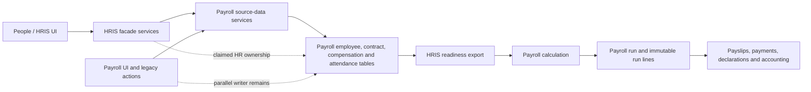

# Stoquify HRIS–Payroll Architecture and Integration Decision

**Date:** 19 July 2026  
**Decision status:** Recommended direction  
**Assessment type:** Read-only architecture and integration review  
**Confidence:** High (approximately 88%)

## Executive conclusion

Stoquify should **not** greenfield-rewrite both HRIS and Payroll, and it should **not** continue indefinitely patching the current HRIS facade.

The best route is a **selective rebuild**:

- Preserve the Payroll kernel, run lifecycle, payslips, payment and declaration controls, country-pack logic, accounting integration, and assurance evidence.
- Rebuild the HRIS/People Core boundary as a proper upstream domain.
- Migrate existing employee data rather than create a second employee master.
- Eliminate parallel Payroll write paths for HR-owned facts.
- Make Payroll consume only immutable, certified HRIS snapshots.

The present system is not fundamentally worthless or fake. The HRIS-to-Payroll readiness chain is real and tested. However, the concern that something structural is preventing complete deployment and integration is justified: HRIS has been layered over Payroll-owned tables and services without fully completing the ownership transfer. That transitional architecture is now becoming the obstacle.

**Decision:** selectively rebuild HRIS and the integration boundary; retain and incrementally decompose Payroll.

## What exists today

### Payroll

Payroll is a substantial implemented domain, not a prototype. The schema includes employee, contract, compensation assignment, salary-change, payment-destination, period, attendance snapshot, run, run-line, payslip, declaration, payment-batch, and employee-balance models, beginning with `PayrollEmployee` in `prisma/schema.prisma`.

It also has:

- Effective-dated contracts and compensation
- Maker-checker salary and destination workflows
- Immutable attendance corrections
- Certified-input hashes
- Payroll runs and corrective runs
- Payslip generation
- Payment release and reconciliation
- Declaration evidence
- Country-pack provenance
- Ledger posting and close-assurance integration
- Tenant and RBAC tests
- Production-readiness gate machinery

The HRIS readiness export is generated and checked inside `services/payroll/payroll-control.service.ts`. Each employee’s current source is revalidated before engine input is built, and the resulting proof hashes are persisted into Payroll run evidence. This is valuable work and a strong reason not to rewrite Payroll.

### HRIS

HRIS now has services, actions, People routes, permissions, self-service, manager views, approvals, movement history, lifecycle workflows, compensation controls, document evidence, time and attendance certification, and a Payroll-readiness contract.

The focused current-tree replay passed:

- 6 test suites
- 74 tests
- Coverage of HRIS employee, organization scope, lifecycle, time and leave, readiness contract, and Payroll control

However, HRIS is still primarily a facade over the Payroll domain. For example, `services/hris/employee.service.ts` imports the Payroll employee service, and its HRIS profile mutation calls `upsertPayrollEmployeeSourceProfile` directly. Contracts, compensation, payment destinations, organization scope, and attendance follow similar compatibility patterns.

## Current integration architecture



The lower half—from certified readiness through Payroll, payments, declarations, and accounting—is sound in concept. The upper half is transitional. HRIS claims ownership, but Payroll still provides storage, core mutation services, legacy permissions, and parallel actions.

## Critical architectural problems

### 1. HRIS ownership is declarative, not exclusive

The HRIS facade returns ownership markers such as `sourceOwner: "HRIS_PEOPLE_CORE"`, but those markers do not prevent Payroll code from modifying the same source records.

Legacy write actions remain available, including:

- Payroll employee mutation in `actions/payroll/payroll-employee.actions.ts`
- Payroll contract creation in `actions/payroll/payroll-contract.actions.ts`
- Payroll salary-change requests in `actions/payroll/payroll-compensation.actions.ts`
- Payroll payment-destination requests in `actions/payroll/payroll-payment-evidence.actions.ts`

This creates a dual-writer architecture: HRIS writes through Payroll services while Payroll can still write directly through Payroll actions. Both operate on the same records. The rule that HRIS owns people truth is therefore not fully enforced. This is the most important integration defect.

### 2. Important HRIS workflows are stored in JSON metadata

Several newly implemented HRIS domains are projections inside generic metadata fields:

- Employee lifecycle uses `PayrollEmployee.metadata.hrisLifecycle`.
- Contract approvals and document evidence use `PayrollContract.metadata`.
- Compensation approval state uses assignment metadata.
- Employee source provenance and destination evidence use employee metadata.

Business events and hashes provide useful auditability, but metadata-based domain state has limits:

- Weak database constraints
- Limited relational integrity
- Harder reporting and querying
- More complicated migrations
- Versioning logic scattered through services
- Greater risk of partially valid projections
- Difficult cross-workflow joins and effective dating

Metadata is acceptable for transitional compatibility and supplemental evidence. It should not remain the primary persistence mechanism for core employment lifecycle, document governance, or organization structure.

### 3. Organization and manager scope are incomplete

The current scope service explicitly has no reporting-line authority, historical access, effective-dated manager relationship, or delegation and temporary approver coverage. It is based primarily on current location responsibility.

This cannot yet reliably support effective-dated departments and positions, transfers, matrix reporting, temporary managers, approval delegation, position vacancies, or manager changes during a Payroll period.

### 4. Time and leave is a certification boundary, not a full engine

The HRIS time and leave service builds a certified aggregate and invokes Payroll’s attendance-snapshot freeze. That is a useful Payroll input control, but not a complete HRIS time and leave system.

Dedicated models and workflows are still missing for:

- Work schedules and shifts
- Holiday calendars
- Leave types and policies
- Accrual rules and balances
- Leave requests and approvals
- Attendance events and imports
- Overtime requests
- Exceptions and anomalies
- Carry-forward and expiry
- Policy-effective dates

The present service certifies externally prepared totals; it does not originate all underlying HR truth.

### 5. HRIS and Payroll are not separate commercial modules

There are separate `hris.*` and `payroll.*` permissions, but the module catalog contains Payroll only, and the People navigation surface is owned by the Payroll module slug.

The product therefore behaves like a combined People-and-Payroll package, not two independently entitled modules. If HRIS and Payroll are intended to be enabled or sold separately, the module catalog needs an explicit dependency:

```text
HRIS / People Core
        ↑ required dependency
Payroll
```

Payroll should depend on HRIS. HRIS should not depend on a Payroll entitlement.

### 6. Payroll has a major concentration hotspot

`services/payroll/payroll-control.service.ts` is approximately 8,900 lines and owns or coordinates readiness, attendance freezing, calculation, country-pack evaluation, corrections, run creation, posting, payments, declarations, and workbench read models.

The code is well tested, but this is a maintainability and change-risk hotspot. It should be decomposed incrementally behind its current tests, not rewritten from scratch.

### 7. Production evidence remains bounded

The latest HRIS readiness report remains **NO-GO for unrestricted production**. Important limitations include:

- Full typecheck fails by V8 out-of-memory.
- The migration pilot scanned only one employee.
- Evidence covers one local tenant and Cameroon fixtures.
- Production provider settlement was not exercised.
- Statutory authority filing was not exercised.
- Production accounting close was not replayed.
- Owner approval was for a local pilot, not independent production sign-off.
- The worktree remains extensively modified.
- Some final-readiness artifacts remain untracked.

A CI readiness report validates workflow configuration; it does not cancel unresolved full-typecheck or production-environment evidence gaps.

## Strategy comparison

| Strategy | Short-term speed | Migration risk | Long-term quality | Reuse | Recommendation |
|---|---:|---:|---:|---:|---|
| Continue patching the current facade | High | Medium | Low | Very high | Reject as the long-term plan |
| Greenfield HRIS and Payroll | Low | Critical | Potentially high | Very low | Reject |
| Selectively rebuild HRIS and preserve Payroll | Medium | Controlled | High | High | **Recommended** |

### Continue patching

This could deliver more screens quickly, but it would deepen Payroll-named people truth, parallel writers, metadata-based workflows, coarse HRIS permissions, location-only manager scope, service concentration, and entitlement ambiguity. It is acceptable only for small stabilization fixes while the replacement boundary is built.

### Full greenfield rebuild

A complete rewrite would discard approximately 67,000 lines across Payroll services and tests, plus calculation and correction controls, country-pack evaluation, payments and declarations, accounting posting, close assurance, provider and authority contracts, and extensive proof machinery.

It would likely reintroduce bugs already solved in tenant isolation, corrections, rounding, evidence, payment release, and statutory processing. Assuming a stable team of four to six experienced engineers, a credible HRIS-and-Payroll greenfield replacement would likely require at least 9–15 months before controlled production, with significant migration and regulatory risk.

### Selective rebuild

This preserves the expensive financial and statutory work while fixing the domain boundary causing the present difficulty. Under the same team assumption, a realistic People Core and integration transition could take approximately 4–6 months for a one-country controlled deployment. Broader country and enterprise coverage would take longer.

## Recommended target architecture

### Canonical People Core

Create one authoritative People aggregate; do not maintain duplicate HRIS and Payroll employee masters. Current `PayrollEmployee` records can be migrated or evolved into canonical employee identities by renaming the logical model while temporarily retaining the physical table, or by introducing a canonical `Employee` model and migrating each existing employee exactly once. Keep a compatibility adapter for Payroll until callers migrate.

Add first-class structures for:

- Employee identity and employment relationship
- Org unit and position
- Effective-dated employee assignment
- Reporting relationship and manager delegation
- Employment lifecycle events
- Contracts and amendments
- Document evidence and retention
- Work schedules
- Leave policies, balances, and requests
- Attendance events and period certification

### Exclusive HRIS writer

HRIS services should become the only writers of employee, contract, compensation assignment, payment-destination approval, organization assignment, lifecycle, and time and leave truth. Payroll legacy mutations should first become deprecated adapters calling HRIS and later be removed. Payroll permissions must no longer grant direct HR-source mutation.

### Explicit immutable snapshot boundary

Persist a first-class handoff such as:

```text
HrisPayrollInputSnapshot
HrisPayrollInputEmployeeSnapshot
HrisPayrollInputEvidence
```

Each Payroll period should reference:

- HRIS snapshot ID and hash
- Employee identity version
- Employment and contract version
- Compensation version
- Destination-proof version
- Attendance certification
- Blockers and approval evidence
- Superseded and correction lineage

Payroll calculation should read the snapshot, never mutable HRIS rows. The present hashing and stale-source checks are strong foundations for this design.

### Retain Payroll-owned models

Keep and improve Payroll periods, runs and corrective runs, run lines, payslips, payment batches, declarations, employee-balance cases, country-pack calculations, accounting source links, and assurance and close evidence.

### Decompose Payroll gradually

Split the large Payroll control service into input readiness, engine-input builder, calculation engine, run lifecycle, correction engine, posting coordinator, payment coordinator, and declaration coordinator. Do this behind characterization tests rather than as a simultaneous rewrite.

## Recommended execution sequence

1. **Freeze ownership.** Document the authoritative writer for every HR-owned field. Inventory every direct Payroll source mutation and prevent new callers.
2. **Close the dual-writer boundary.** Convert legacy Payroll employee, contract, compensation, destination, and attendance actions into adapters over HRIS services. Add enforcement tests proving Payroll cannot mutate HR source truth directly.
3. **Decide commercial packaging.** Create a canonical `hris` module with Payroll depending on it, or formally define a combined People-and-Payroll package. Do not leave the current ambiguity implicit.
4. **Build the canonical HRIS schema.** Prioritize organization assignments, reporting lines, lifecycle, documents, schedules, leave, and attendance events. Migrate metadata projections into constrained tables.
5. **Persist immutable Payroll-input snapshots.** Reuse current readiness hashes and proof validation, but make the handoff a first-class persisted contract.
6. **Shadow and reconcile.** For each pilot tenant, generate old and new HRIS projections, compare hashes and Payroll results, and block cutover on unexplained differences.
7. **Cut over one tenant and country.** Start with Cameroon, but use substantially more than one employee and include starters, leavers, salary changes, leave, overtime, destination changes, corrections, and retroactive adjustments.
8. **Retire compatibility writers.** Remove old Payroll source mutations only after parity, rollback, and reconciliation evidence pass.
9. **Complete release gates.** Partition or fix typecheck; run full repository verification, staging provider settlement, authority filing, accounting close, cross-browser and accessibility testing, tenant-negative testing, and independent owner sign-off.

## Final decision

- **Continue patching as-is:** No.
- **Full greenfield HRIS and Payroll rewrite:** No.
- **Selectively rebuild HRIS and the ownership/integration boundary while preserving Payroll:** Yes.

The current implementation should be treated as a useful transitional prototype of the correct HRIS-to-Payroll control chain, not as the final HRIS architecture.

The strongest assets are Payroll calculation, evidence, corrections, payments, declarations, accounting, and assurance. The weakest assets are HRIS persistence, exclusive ownership, organization structure, time and leave origination, module entitlement, and removal of legacy Payroll writers.

Additional evidence that could alter the sequencing or scope would be a production data-volume audit, real tenant workflow usage, incident history, staging provider and authority results, and a clean full verification run. None is likely to justify discarding the Payroll kernel; it would mainly affect the size and sequencing of the HRIS rebuild.

## Evidence references

- `prisma/schema.prisma` — Payroll domain models beginning at `PayrollEmployee`
- `services/hris/employee.service.ts` — HRIS facade over Payroll employee source services
- `services/hris/lifecycle.service.ts` — lifecycle state in metadata projection
- `services/hris/org.service.ts` — current organization and manager-scope limits
- `services/hris/time-leave.service.ts` — attendance certification boundary
- `services/payroll/payroll-control.service.ts` — readiness, calculation, run, correction, payment, declaration, and workbench coordination
- `actions/payroll/payroll-employee.actions.ts` — remaining Payroll employee mutation surface
- `actions/payroll/payroll-contract.actions.ts` — remaining Payroll contract mutation surface
- `actions/payroll/payroll-compensation.actions.ts` — remaining Payroll compensation mutation surface
- `actions/payroll/payroll-payment-evidence.actions.ts` — remaining Payroll destination mutation surface
- `config/sidebar.ts` — People navigation module ownership
- `what-next/payroll/STOQUIFY_HRIS_FINAL_READINESS_2026-07-17.md` — bounded final-readiness decision
- `what-next/payroll/STOQUIFY_HRIS_MIGRATION_BACKFILL_PILOT_SIGNOFF_READY_GATE_2026-07-17.md` — pilot evidence scope

---

*This recommendation is based on repository structure, service and action boundaries, schema ownership, focused tests, architecture reports, and readiness artifacts available in the working tree on 19 July 2026. Estimates are directional and assume a stable team of four to six experienced engineers.*
