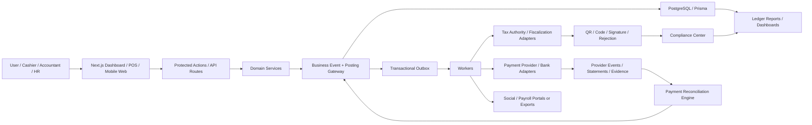

# AqStoqFlow OHADA SMB Platform Technical Specification

Date: 2026-06-14

Workspace: `E:\ohada saas\newStockFlow\aqstoqflow`

Status: Architecture specification for implementation planning. This document is engineering guidance, not legal, tax, audit, or social-security certification. Country-specific production behavior must be validated by an expert-comptable, qualified counsel, and the relevant tax/social/payment authority before launch.

## 1. Executive Intent

AqStoqFlow must become a ledger-first compliance operating system for OHADA-zone SMBs. The product should feel like a modern business platform, but its defensibility comes from something deeper than screens: every operational workflow must produce trustworthy, auditable, reconcilable business facts.

The platform is intended to cover:

- Inventory and stock control.
- POS and cashier operations.
- Sales, invoicing, fiscal documents, e-invoicing, and fiscalization.
- Purchasing, supplier invoices, goods receipts, and payables.
- Accounting, OHADA/SYSCOHADA journals, fiscal periods, statutory books, and reports.
- Finance, treasury, cash, bank, mobile money, card, payment reconciliation, suspense, and close controls.
- Payroll, HR, employee contracts, presence, attendance, leave, payslips, declarations, and salary payments.
- Compliance center, country packs, evidence archives, accountant/CGA access, and filing readiness.

The platform should be a painkiller for SMBs because it reduces the daily pain of fragmented tools, tax uncertainty, manual accounting, lost stock, unreconciled mobile-money payments, payroll fear, and audit panic.

## 2. Current Repo Baseline

The current codebase already contains important foundations that should be extended, not replaced:

- Next.js App Router with locale-aware dashboard routes.
- Prisma schema with organization-scoped business models.
- Accounting kernel models:
  - `OrganizationAccountingSettings`
  - `FiscalYear`
  - `AccountingPeriod`
  - `ChartOfAccount`
  - `JournalEntry`
  - `JournalEntryLine`
  - `LedgerPostingBatch`
  - `AccountingSourceLink`
- POS models:
  - `SalesOrder`
  - `SalesOrderLine`
  - `POSSession`
  - `CashDrawer`
  - `CashDrawerTransaction`
  - `Payment`
  - `PaymentRefund`
- Payment-reconciliation models:
  - `PaymentRail`
  - `ProviderAccount`
  - `ProviderEvent`
  - `StatementFile`
  - `StatementLine`
  - `PaymentTransaction`
  - `MatchRecord`
  - `SuspenseItem`
  - `ReconciliationRun`
  - `PaymentException`
  - `PaymentReconciliationInboxItem`
- Compliance/fiscalization models:
  - `FiscalDocument`
  - `FiscalDocumentLine`
  - `FiscalSequence`
  - `ComplianceSubmission`
  - `ComplianceAdapterConfig`
  - `ComplianceEvidence`
- Existing service anchors:
  - `services/pos/pos.service.ts`
  - `services/accounting/postings/post-sale.ts`
  - `services/accounting/postings/post-payment.ts`
  - `services/accounting/postings/post-refund.ts`
  - `services/accounting/postings/post-void.ts`
  - `services/accounting/posting.service.ts`
  - `services/accounting/source-link.service.ts`
  - `services/accounting/reconciliations.service.ts`
  - `services/payments/provider-event.service.ts`
  - `services/payments/statement-import.service.ts`
  - `services/payments/payment-reconciliation.service.ts`
  - `services/payments/payment-reconciliation-workbench.service.ts`
  - `services/regulatory/country-packs/*`

The graph report identifies cross-cutting architecture hubs such as `getSession()`, `scopedOrg()`, `requireOrg()`, resilient database/error services, and POS/finance/purchase communities. New implementation must respect these boundaries.

## 3. External Regulatory And Market Anchors

These sources were checked while preparing this specification:

- OHADA publishes active Uniform Acts, including `Droit comptable et à l'information financière` and AUDCIF metadata: https://www.ohada.org/actes-uniformes/
- Benin e-MECeF confirms online normalized invoicing, SFE approval, test access, DGI code recovery, and API/developer validation flow: https://e-mecef.impots.bj/
- Cameroon DGI exposes tax e-services including teledeclaration, DSF, IRPP, documents fiscaux, OTP/E-billing, and LF 2026 circular surface: https://www.impots.cm/
- BCEAO PI-SPI confirms UEMOA instant interoperable payments, QR, aliases, sandbox surface, and institutional payment modernization: https://pispi.bceao.int/
- BEAC confirms CEMAC monetary/payment-system context for Cameroon and Central Africa: https://www.beac.int/
- CNPS Cameroon exposes employer/social-security services and mission areas that affect payroll/presence architecture: https://www.cnps.cm/fr/

Implication: AqStoqFlow must treat OHADA/SYSCOHADA accounting as the uniform accounting foundation, and national requirements as versioned country overlays. No country-specific tax, payroll, e-invoicing, or payment behavior should be hardcoded as permanent application logic.

## 4. Product North Star

Build a platform where an SMB owner can answer these questions without spreadsheets, guesswork, or panic:

- What did I sell today, by location, cashier, tax rate, payment method, and margin?
- Is every POS sale posted, fiscally traceable, and immutable?
- Does stock on shelf equal stock in the system and stock value in accounting?
- Which invoices, payments, mobile-money settlements, and bank lines are unmatched?
- Can I close the day, month, payroll period, and fiscal period without hidden exceptions?
- Are my VAT, payroll, social contribution, and DSF numbers derived from posted truth?
- Can my accountant prove every number from source document to journal line?
- Can my staff operate offline without losing fiscal or accounting integrity?

## 5. Language Locked

- Business event: append-only fact representing a real economic action, such as POS sale, refund, goods receipt, supplier invoice, payroll approval, payment, bank match, or stock adjustment.
- Ledger-first: every economic event posts through one accounting gateway into balanced journal entries and source links before it becomes accounting truth.
- FiscalDocument: immutable statutory envelope for POS receipts, sales invoices, credit notes, and other fiscal documents. It links source event, posting batch, journal entry, country pack, sequence, hashes, and certification state.
- Country pack: versioned, effective-dated regulatory configuration for a country. It contains VAT, payroll, social, filing, fiscalization, payment, label, and legal provenance metadata.
- Fiscalization: tax-authority clearance or near-real-time control of a fiscal document. It is not merely PDF generation.
- Payment truth: three-leg proof across internal payment, provider/bank/cash evidence, and ledger posting.
- Presence: attendance, shift, leave, overtime, and validated work inputs that can affect payroll.
- Painkiller workflow: a workflow that removes a costly recurring operational risk, not just a visual convenience.

## 6. Architecture Spine

### 6.1 Source Of Truth

Operational tables are source documents and workflow state. Accounting truth lives in the ledger:

- POS, sales, purchasing, payroll, inventory, and payments create source facts.
- Business-event services validate, sequence, post, update projections, and audit in one transaction.
- Statutory reports read from ledger balances and source links, not direct operational totals.
- Dashboards may show operational metrics but must label provenance when numbers are not statutory.

### 6.2 State Model

Every money, stock, tax, payroll, and compliance workflow must follow a state machine.

Example POS sale:

```text
DRAFT -> VALIDATED -> FINALIZED -> POSTED -> FISCAL_DOCUMENT_CREATED -> CERTIFICATION_QUEUED -> CERTIFIED
                                      |
                                      +-> REVERSAL / REFUND / VOID via compensating event
```

Example payroll run:

```text
draft -> calculated -> reviewed -> approved -> emitted -> posted -> paid -> archived
                                            |
                                            +-> corrective_run
```

Example payment reconciliation:

```text
received -> verified -> matched -> reconciled -> certified
                         |
                         +-> suspense -> resolved -> corrected/reconciled
```

### 6.3 Transaction Boundary

One business event must commit these together, or not at all:

- Event capture.
- Source document state transition.
- Sequence allocation where applicable.
- Server-side recomputation of money, tax, discounts, payroll, and stock cost.
- Journal entry and lines.
- Posting batch.
- Source links.
- Subsidiary ledger updates.
- Inventory projection/value layers where applicable.
- Audit log.
- Fraud/anomaly signal.
- Outbox item for external side effects.

External calls must occur after commit through outbox/workers.

### 6.4 Trust Boundary

- UI never imports Prisma, provider adapters, accounting posting internals, or tax-authority clients.
- Hooks own client cache and call actions/API surfaces.
- Actions authenticate, authorize, parse input, call services, map typed errors, and revalidate.
- Services own business invariants and Prisma writes.
- Workers run with explicit tenant context.
- Provider/tax/payroll authority callbacks are claims until verified, persisted, and reconciled.

### 6.5 Failure Handling

Required typed errors:

- `PeriodClosed`
- `UnbalancedRecipe`
- `DuplicateKeyConflict`
- `InsufficientStock`
- `SoDViolation`
- `MissingDocument`
- `InvalidAccountMap`
- `SequenceConflict`
- `ReconciliationDrift`
- `StepUpRequired`
- `ApprovalRequired`
- `AuthorityUnavailable`
- `AuthorityRejected`
- `ProviderSignatureInvalid`
- `TenantScopeViolation`

Failure policy:

- Retriable: serialization conflicts, temporary authority outage, rate limit, network timeout.
- Terminal: invalid account map, closed period, unauthorized actor, malformed payload, authority rejection.
- Suspense: unmatched or ambiguous money, missing callback, settlement shortfall, duplicate provider ID, fee deviation.
- Compensate: refunds, credit notes, reversals, corrective payroll runs, stock adjustments, reconciliation corrections.

## 7. Non-Negotiable Invariants

1. Tenant scope on every read, write, report, aggregate, unique index, and background job.
2. Every economic event posts through one accounting/event gateway.
3. Journal entries and journal lines are balanced, leaf-account-only, source-linked, and immutable.
4. Posted/finalized financial artifacts are append-only.
5. Corrections happen through reversal, avoir/credit note, corrective run, or adjustment document.
6. Fiscal document numbers are chronological, gapless, and scoped by country, organization, document type, fiscal year/period, and location/register where needed.
7. One fiscal period model gates all modules.
8. No posting without source document hash and evidence metadata.
9. XAF/XOF money must use the repo money standard consistently. For fiscal truth in XAF/XOF, use integer minor units or Decimal scale 0; if existing Decimal fields keep two decimals, enforce zero-decimal validation for XAF/XOF.
10. Tax, payroll, social, withholding, filing, and fiscalization parameters resolve from versioned country packs.
11. Sensitive actions require RBAC, step-up, and segregation of duties.
12. Provider events and fiscal authority submissions require idempotency and payload-hash conflict detection.
13. Reconciled/certified evidence is immutable.
14. Period close is blocked by unresolved posting batches, unsigned reconciliation days, unresolved critical exceptions, open suspense, unposted payroll, and fiscalization failures where policy requires certification.
15. Reports that claim statutory truth read from ledger/posting views.

## 8. System Context Diagram



## 9. Module Architecture

### 9.1 Platform Foundation

Purpose:

- Multi-tenant organization control, locale, roles, subscriptions, modules, audit, security, and system readiness.

Required capabilities:

- Organization legal profile:
  - Country.
  - Tax ID / NIU / IFU / RCCM equivalent.
  - Legal name and trade name.
  - Regime and accounting system.
  - Fiscal year setup.
  - Base currency.
  - Active country pack version.
- Module gate:
  - POS.
  - Inventory.
  - Sales.
  - Purchasing.
  - Accounting.
  - Finance.
  - Payroll.
  - HR/presence.
  - Compliance.
  - Accountant portal.
- Role and permission matrix:
  - Owner.
  - Manager.
  - Accountant.
  - Cashier.
  - Stockkeeper.
  - Purchasing officer.
  - HR/payroll officer.
  - Auditor.
  - Employee self-service.
- Fresh-auth actions:
  - Period close/reopen.
  - Manual journal posting.
  - Account mapping change.
  - Fiscal document reversal.
  - Adapter credential change.
  - Payroll approval.
  - Payment release.
  - Supplier/employee bank change.
  - Large refund.

Implementation anchors:

- `services/_shared/protect.ts`
- `services/_shared/require-org.ts`
- `services/controls/sensitive-action.service.ts`
- `services/regulatory/country-packs/*`
- `app/[locale]/(dashboard)/dashboard/settings/*`

### 9.2 Regulatory Country Packs

Purpose:

- Make country-specific rules data, not code branches.

Core entities:

- `CountryPack`
- `RegulatoryParameter`
- `LegalReference`
- `GoldenFixture`
- `CountryPackValidationResult`

Required pack sections:

- Header:
  - `countryCode`
  - `packVersion`
  - `schemaVersion`
  - `effectiveFrom`
  - `effectiveTo`
  - `verificationStatus`
  - `capabilityMatrix`
  - `hash`
- Business identity:
  - Tax IDs.
  - Registry identifiers.
  - invoice seller fields.
- VAT:
  - Rates.
  - Exemptions.
  - Rounding.
  - Account mappings.
  - Filing lines.
- Payroll:
  - Social branches.
  - Tax brackets.
  - Ceilings.
  - SMIG/minimum wage.
  - Overtime rules.
  - Payslip labels.
- Filing:
  - VAT declaration.
  - DSF or country equivalent.
  - Payroll/social declarations.
  - Export formats and deadlines.
- E-invoicing/fiscalization:
  - Capability.
  - Required fields.
  - Certification timing.
  - Authority channels.
  - Manual fallback.
  - Artifact schema.
  - API/spec status.
- Payments:
  - Provider legality.
  - KYC/ceiling placeholders.
  - Settlement windows.
  - Fee schedules.

Production rule:

- A pack value that affects blocking, computation, statutory export, or authority submission must be `VERIFIED` or `EXPERT_APPROVED`. Otherwise production automation must be blocked for that behavior.

Implementation anchors:

- `services/regulatory/country-packs/cameroon.ts`
- `services/regulatory/country-packs/resolve.ts`
- `services/regulatory/country-packs/validation.ts`
- `services/regulatory/hardcode-detector.ts`

### 9.3 Accounting Backbone

Purpose:

- One OHADA/SYSCOHADA source of financial truth.

Core entities:

- `OrganizationAccountingSettings`
- `FiscalYear`
- `AccountingPeriod`
- `ChartOfAccount`
- `Journal`
- `JournalEntry`
- `JournalEntryLine`
- `LedgerPostingBatch`
- `AccountingSourceLink`
- `PostingRule`
- `PostingRuleLine`
- `LedgerAuditEvent`
- Future:
  - `SubsidiaryLedgerEntry`
  - `OpenItem`
  - `AccountingExport`
  - `CloseCertificate`

Required services:

- `accounts.service.ts`
- `accounting-settings.service.ts`
- `periods.service.ts`
- `journals.service.ts`
- `posting.service.ts`
- `posting-rules.service.ts`
- `source-link.service.ts`
- `reports.service.ts`
- `reconciliations.service.ts`
- `closing.service.ts`

Posting gateway contract:

```ts
type PostBusinessEventInput = {
  organizationId: string
  actorId: string
  eventType: BusinessEventType
  eventVersion: number
  sourceType: AccountingSourceType
  sourceId: string
  sourceDate: string
  idempotencyKey: string
  payloadHash: string
  documentHash: string
  postingPurpose: AccountingPostingPurpose
  lines: ProposedJournalLine[]
  subsidiaryEffects?: SubsidiaryEffect[]
  inventoryEffects?: InventoryEffect[]
  audit: AuditEnvelope
  outbox?: OutboxMessage[]
}
```

Required invariants:

- Debit total equals credit total.
- Account is active, leaf, tenant-scoped, and valid for date.
- Period is open.
- Idempotency key is unique per organization/source/purpose.
- Duplicate idempotency key plus same payload returns original result.
- Duplicate idempotency key plus different payload rejects and audits.
- Source link is created in same transaction.
- Posted entry cannot be updated or deleted.

Reports:

- Livre-journal.
- Grand livre.
- Balance generale.
- Bilan.
- Compte de resultat.
- TFT.
- Notes annexes.
- VAT declaration.
- Tax/social liabilities.
- Inventory book.
- Ledger-backed finance dashboard.

### 9.4 POS And Sales

Purpose:

- Fast selling experience with fiscal, stock, cash, payment, and accounting integrity.

Core entities:

- `POSStation`
- `POSSession`
- `SalesOrder`
- `SalesOrderLine`
- `Payment`
- `PaymentRefund`
- `CashDrawer`
- `CashDrawerTransaction`
- `ReceiptDelivery`
- `FiscalDocument`
- `LedgerPostingBatch`

State machines:

```text
POSSession: OPEN -> CLOSING -> CLOSED -> CERTIFIED
SalesOrder: DRAFT -> COMPLETED -> POSTED -> FISCALIZED -> REFUNDED|VOIDED
Payment: INITIATED -> CAPTURED -> POSTED -> MATCHED|SUSPENSE -> RECONCILED
Refund: REQUESTED -> APPROVED -> POSTED -> MATCHED|SUSPENSE
```

Required checkout transaction:

1. Validate tenant, cashier, active session, terminal, location, stock, prices, discounts, tax, customer, and tenders.
2. Recompute all totals server-side.
3. Commit `SalesOrder`, `SalesOrderLine`, payments, drawer movement, stock movements/value effects, and audit.
4. Call `postSale()` and `postPayment()` inside the same transaction or through a unified event gateway that shares the same transaction.
5. Create source links.
6. Create `FiscalDocument` and lines from posted source evidence.
7. Enqueue `ComplianceSubmission`.
8. Return receipt payload with certification status and delivery policy.

Offline POS:

- Device creates immutable local events with device sequence and hash chain.
- Offline events have provisional local references, not final legal fiscal numbers unless the country pack explicitly allows it.
- Sync sends events with idempotency key and payload hash.
- Server detects duplicate, missing, or out-of-order device sequence.
- Fiscal clearance happens after server commit according to country policy.

POS close:

- Z report must tie to posted ledger batches by VAT bucket, payment method, cashier, location, and drawer.
- Cash variance posts to configured account with reason and approval.
- Closed sessions are not reopened. Corrections use controlled corrective events.

### 9.5 Fiscal Documents And Compliance Center

Purpose:

- Certified-document, fiscalization, filing, evidence, obligations, and accountant workflow layer above the ledger.

Core entities:

- `FiscalDocument`
- `FiscalDocumentLine`
- `FiscalSequence`
- `ComplianceSubmission`
- `ComplianceAdapterConfig`
- `ComplianceEvidence`
- Future:
  - `ComplianceObligation`
  - `ComplianceReminder`
  - `AccountantFirm`
  - `AccountantClientAccess`
  - `ComplianceOutboxLease`

Fiscal document lifecycle:

```text
DRAFT -> QUEUED -> SUBMITTED -> CERTIFIED
                  -> REJECTED -> RESUBMITTABLE|REVERSED
```

Adapter contract:

```ts
type ComplianceAdapter = {
  code: string
  validatePayload(input: CanonicalFiscalPayload): Promise<AdapterValidationResult>
  buildAuthorityPayload(input: CanonicalFiscalPayload): Promise<AuthorityPayload>
  submit(input: AuthorityPayload, context: AdapterExecutionContext): Promise<AdapterSubmitResult>
  pollStatus(input: AdapterPollInput, context: AdapterExecutionContext): Promise<AdapterStatusResult>
  parseResponse(input: unknown): AdapterParsedResponse
}
```

Rules:

- Never call tax authority APIs in the POS sale transaction.
- Create fiscal document and compliance outbox in the database transaction.
- Authority calls run after commit.
- Store request hash, response hash, authority reference, QR/sticker/signature payload, rejection reason, correlation ID, and evidence hash.
- Rejection never mutates ledger truth.
- Reversal uses credit note/avoir or compliant reversal document.
- Certification artifact is legal evidence, not decorative UI.

Compliance Center UI:

- Certification queue.
- Rejected/failed submissions.
- Certified document trace.
- Fiscal sequence health.
- Country-pack readiness.
- Adapter configuration health.
- Manual portal fallback evidence.
- Filing obligations and deadlines.
- Accountant/CGA portfolio review.
- Close-blocking exceptions.

### 9.6 Inventory And Production

Purpose:

- Keep physical stock, sale availability, valuation, and accounting in sync.

Core entities:

- `Item`
- `Category`
- `Brand`
- `Unit`
- `Location`
- `InventoryMovement`
- `InventoryLevel` or equivalent projection.
- `StockTransfer`
- `StockAdjustment`
- `StockCount`
- `CostLayer`
- `Recipe`
- `RecipeIngredient`
- `ProductionBatch`

Required workflows:

- Goods receipt.
- Stock transfer.
- Stock adjustment.
- Physical count and variance.
- POS sale stock issue.
- Refund restock.
- Write-off/shrinkage.
- Production consumption.
- Finished goods recognition.

Rules:

- Never update stock quantity directly as business truth.
- Every movement is immutable, numbered, valued, tenant-scoped, and audited.
- Stock projection is rebuildable from movement history.
- Negative stock policy is explicit by organization/location/item category.
- Valuation method is configured and auditable, preferably weighted average or FIFO.
- Inventory valuation report reconciles to class 3 ledger balances or a documented reconciliation view.
- High-value adjustments require maker-checker approval.

Posting needs:

- `post-goods-receipt`
- `post-inventory-adjustment`
- `post-stock-transfer` where financial impact exists.
- `post-production-batch`
- `post-writeoff`

### 9.7 Purchasing And Supplier Payables

Purpose:

- Control supplier spending, goods receipt, input VAT, payables, and supplier payment risk.

Core entities:

- `PurchaseRequisition`
- `PurchaseOrder`
- `PurchaseOrderLine`
- `GoodsReceipt`
- `GoodsReceiptLine`
- `SupplierInvoice`
- `SupplierInvoiceLine`
- `ThreeWayMatch`
- `SupplierLedgerEntry`
- `SupplierBankAccount`
- `SupplierBankChangeRequest`
- `SupplierPayment`

Lifecycle:

```text
requisition -> approved_po -> goods_receipt -> supplier_invoice -> three_way_match -> posted_payable -> payment -> reconciled
```

Rules:

- Invoice above threshold cannot bypass PO/receipt/match.
- Supplier invoice uniqueness checks normalized supplier, invoice number, date, and amount tolerance.
- Supplier bank changes require dual approval and may impose a payment hold.
- Payment can only apply to approved posted payable.
- Withholding resolves from country pack by document/payment date.
- Goods receipt and supplier invoice must produce source evidence and posting.

Posting needs:

- `post-goods-receipt`
- `post-supplier-invoice`
- `post-supplier-payment`
- `post-withholding`

### 9.8 Finance, Treasury, And Payment Reconciliation

Purpose:

- Prove every franc across cash, bank, mobile money, card, QR, alias, payroll payment, supplier payment, and tax/social payment.

Core entities:

- `PaymentRail`
- `ProviderAccount`
- `SettlementAccount`
- `ProviderEvent`
- `StatementFile`
- `StatementLine`
- `PaymentTransaction`
- `MatchRecord`
- `SuspenseItem`
- `ReconciliationRun`
- `PaymentException`
- `PaymentReconciliationInboxItem`

Payment adapter contract:

```ts
type PaymentProviderAdapter = {
  providerCode: string
  verifySignature(input: SignatureInput): SignatureResult
  parseEvent(rawBody: string, headers?: ProviderWebhookHeaders): ParsedProviderEvent
  canonicalPayload(rawBody: string): string
  parseStatement(input: StatementInput): ParsedStatementFile
  fingerprintStatementLine(line: ParsedStatementLine): string
  queryStatus?(providerTxnId: string): Promise<ProviderStatus>
  explodeSettlementBatch?(line: StatementLine): Promise<SettlementComponent[]>
  feeSchedule?(txn: PaymentTransaction): FeeExpectation
}
```

Three-leg reconciliation:

1. Internal transaction or business event.
2. Provider event, statement line, bank line, switch record, card batch, or cash count.
3. Ledger posting.

Matching cascade:

1. Provider transaction ID.
2. Internal reference/payment intent.
3. QR/alias payload.
4. Amount/date/counterparty/rail/location/register composite.
5. Settlement batch decomposition.
6. Manual match with maker-checker.
7. Suspense item.

Rules:

- Provider callbacks are claims until signature, payload, idempotency, and truth policy pass.
- Same provider ID with different payload is tampering.
- No final payment state without `MatchRecord` or `SuspenseItem`.
- No 47x suspense balance without itemized suspense records summing exactly to it.
- Unreconciled critical exceptions block close.
- Refunds link to original payment and return to original instrument unless dual-approved.
- Settlement account changes require dual approval.

### 9.9 HR, Presence, And Payroll

Purpose:

- Turn employee, attendance, payroll, declaration, and payment workflows into immutable, ledger-linked evidence.

Core entities:

- `Employee`
- `EmployeeIdentity`
- `EmployeeContract`
- `Department`
- `Position`
- `CompensationRubrique`
- `SalaryHistory`
- `AttendanceRecord`
- `AttendanceCorrection`
- `LeaveRequest`
- `OvertimeRequest`
- `PayrollPeriod`
- `PayrollRun`
- `PayrollRunEmployee`
- `Payslip`
- `PayrollDeclaration`
- `PayrollPaymentBatch`
- `EmployeePaymentAllocation`

Payroll lifecycle:

```text
period_open -> inputs_locked -> calculated -> reviewed -> approved -> emitted -> posted -> paid -> archived
```

Rules:

- Payroll calculations resolve from country pack by pay date.
- Run calculation snapshots employee, contract, rubriques, attendance, leave, approved adjustments, rates, and rule provenance.
- Attendance feeding payroll freezes at validation.
- Post-payroll attendance corrections create corrective records for next run.
- Emitted payslips are immutable, numbered, hashed, and archived.
- Payroll posts expenses, employee deductions, employer charges, social/tax liabilities, and net payable.
- Payroll payments clear posted employee payable balances and reconcile through payment rails.
- Same actor cannot prepare and approve/pay a sensitive payroll run.
- Duplicate bank account, missing active contract, and ghost-employee indicators create review flags.

Posting needs:

- `post-payroll-run`
- `post-payroll-payment`
- `post-payroll-correction`
- `post-social-tax-payment`

### 9.10 Reports, Analytics, And Data Trust

Purpose:

- Give operators fast dashboards while preserving traceability and statutory truth.

Dashboard classes:

- Operational dashboards:
  - Sales by hour/location/cashier/item.
  - Stock alerts.
  - Purchase pipeline.
  - Payroll preparation.
  - Payment exceptions.
- Trusted finance dashboards:
  - Cash position.
  - AR/AP aging.
  - VAT payable.
  - Payroll liabilities.
  - Gross margin.
  - Reconciliation status.
- Statutory reports:
  - Ledger books and statements.
  - VAT/DSF exports.
  - Payroll declarations.
  - Inventory book.

Rules:

- Every financial/statutory number shows provenance:
  - Source.
  - As-of timestamp.
  - Ledger period.
  - Country pack version.
  - Tenant.
  - Exclusions/limitations.
- No false zeros. Use unavailable, not configured, or pending states.
- Export hashes and audit logs are required for statutory exports.
- Reports cannot be edited to make them balance.

### 9.11 Accountant/CGA Portal

Purpose:

- Let trusted accounting professionals manage multiple SMB clients without bypassing tenant control.

Core entities:

- `AccountantFirm`
- `AccountantUser`
- `AccountantClientAccess`
- `ClientConsentGrant`
- `ReviewTask`
- `ExceptionAssignment`
- `FilingReview`

Rules:

- Client grants and revokes explicit access.
- Access is tenant-scoped and role-scoped.
- Accountant actions are audited with firm, user, client organization, action, source, IP/device, and reason.
- Accountant cannot bypass approvals, period locks, or tenant rules.
- Portfolio views show readiness, exceptions, certification failures, unsigned reconciliations, and filing deadlines.

## 10. Cross-Module Event Catalog

Each event must have an event spec before implementation.

| Event | Module | Accounting effect | Source evidence | Required controls |
| --- | --- | --- | --- | --- |
| `POS_SALE_FINALIZED` | POS/Sales | AR/cash clearing, revenue, VAT, optional COGS/inventory | ticket, cart snapshot, payment intents, stock snapshot | period, stock, sequence, idempotency, cashier session |
| `POS_PAYMENT_CAPTURED` | POS/Payments | debit cash/bank/provider clearing, credit AR | payment record, provider ref/cash drawer | tender validation, provider mapping |
| `POS_REFUND_APPROVED` | POS | reversal/credit note, drawer/payment reversal | original ticket/payment, approval | original linkage, SoD, ceiling |
| `POS_VOIDED` | POS | reversal where applicable | void reason, original sale | no deletion, approval if posted |
| `CASH_DRAWER_CLOSED` | POS/Treasury | cash over/short, close certificate | Z report, cash count | dual control above threshold |
| `FISCAL_DOCUMENT_CREATED` | Compliance | no new accounting unless source not posted | posted source trace | source link, sequence policy |
| `FISCAL_DOCUMENT_CERTIFIED` | Compliance | none | authority QR/code/signature | adapter idempotency, evidence hash |
| `GOODS_RECEIVED` | Inventory/Purchasing | inventory/GRNI or configured accrual | goods receipt note | PO match, valuation |
| `SUPPLIER_INVOICE_POSTED` | Purchasing/AP | purchase/input VAT/AP | invoice, match evidence | duplicate check, 3-way match |
| `SUPPLIER_PAYMENT_RELEASED` | AP/Treasury | AP settlement | approved payable, bank/mobile ref | SoD, bank approval, reconciliation |
| `STOCK_ADJUSTMENT_APPROVED` | Inventory | inventory gain/loss | count sheet/reason | approval threshold, evidence |
| `PRODUCTION_BATCH_COMPLETED` | Production | WIP/finished goods, ingredient consumption | recipe, batch sheet | valuation, stock availability |
| `PAYROLL_RUN_APPROVED` | Payroll | salary expense/liabilities/net payable | run snapshot, payslips | country pack, SoD, employee flags |
| `PAYROLL_PAYMENT_RELEASED` | Payroll/Treasury | employee payable settlement | payment batch | payment approval, reconciliation |
| `PROVIDER_EVENT_CAPTURED` | Payments | none until accepted/matched | raw webhook/statement | signature, replay, payload hash |
| `PAYMENT_RECONCILIATION_SIGNED` | Payments | suspense corrections if any | certificate, matches, statement hash | three-leg proof, close block |
| `PERIOD_CLOSED` | Accounting | close entries where applicable | close certificate | no unresolved blockers |

## 11. Implementation Surface Pattern

For each domain, use this shape:

```text
prisma/schema.prisma
services/<domain>/<domain>.schemas.ts
services/<domain>/<domain>.service.ts
services/<domain>/<domain>-events.service.ts
services/<domain>/<domain>-read-model.service.ts
actions/<domain>/<domain>.actions.ts
hooks/<domain>Hooks/use<Domain>Queries.ts
components/<domain>/*
app/[locale]/(dashboard)/dashboard/<domain>/*
services/<domain>/__tests__/*
```

Rules:

- Services are canonical. UI is not a business-rule layer.
- Server actions are thin.
- Domain services accept `organizationId` from protected context, not request body.
- Every mutation has a Zod schema, typed result, and typed error mapping.
- All money/tax/payroll/stock math happens server-side.
- All financial/domain state transitions are tested.

## 12. Data Model Additions Needed

The schema already contains important kernels. The following additions should complete the full platform.

### 12.1 Business Events

Add:

- `BusinessEvent`
- `BusinessEventOutbox`
- `BusinessEventAudit`
- `BusinessEventAnomaly`

Purpose:

- Create one universal audit/event envelope for all modules.
- Provide idempotency and payload hash conflict detection across domains.
- Feed outbox workers and anomaly dashboards.

Core fields:

- `organizationId`
- `eventType`
- `schemaVersion`
- `sourceType`
- `sourceId`
- `occurredAt`
- `recordedAt`
- `actorId`
- `locationId`
- `registerId`
- `deviceId`
- `idempotencyKey`
- `payloadHash`
- `documentHash`
- `status`
- `postingBatchId`
- `metadata`

### 12.2 Compliance Center

Existing models should be extended with:

- `ComplianceObligation`
- `ComplianceReminder`
- `ComplianceOutboxLease`
- `ManualPortalFallback`
- `AccountantFirm`
- `AccountantClientAccess`

### 12.3 Inventory

Add or normalize:

- `InventoryMovement`
- `InventoryMovementLine`
- `InventoryValuationLayer`
- `StockCount`
- `StockCountLine`
- `StockCountVariance`
- `InventoryPolicy`
- `ProductionBatch`
- `ProductionConsumptionLine`

### 12.4 Purchasing

Add or normalize:

- `PurchaseRequisition`
- `GoodsReceipt`
- `GoodsReceiptLine`
- `SupplierInvoice`
- `SupplierInvoiceLine`
- `ThreeWayMatch`
- `SupplierBankAccount`
- `SupplierBankChangeRequest`

### 12.5 Payroll And Presence

Add:

- `Employee`
- `EmployeeContract`
- `CompensationRubrique`
- `EmployeeRubriqueAssignment`
- `AttendanceRecord`
- `AttendanceCorrection`
- `LeaveRequest`
- `OvertimeRequest`
- `PayrollPeriod`
- `PayrollRun`
- `PayrollRunEmployee`
- `PayrollRunCalculationSnapshot`
- `Payslip`
- `PayrollDeclaration`
- `PayrollPaymentBatch`
- `EmployeePaymentAllocation`

### 12.6 Subsidiary Ledgers

Add explicit open-item projections if current accounting models do not already satisfy them:

- `CustomerOpenItem`
- `SupplierOpenItem`
- `EmployeeOpenItem`
- `TaxOpenItem`
- `StockValueProjection`

These must reconcile to control accounts:

- Customers: 411x.
- Suppliers: 401x.
- Employees: 421x/422x.
- Tax/social: 43x/44x.
- Stock: class 3.

## 13. Service Layer Roadmap

### Phase A: Platform Readiness And Control Plane

Deliverables:

- Confirm active schema is canonical.
- Reconcile docs that still list now-present modules as missing.
- Add `BusinessEvent` envelope if absent.
- Confirm all money fields follow the chosen XAF/XOF rule.
- Create account mapping readiness dashboard.
- Create close-blocker read model.
- Add hardcode detector to CI for tax/payroll constants.

Acceptance:

- `npm run prisma:validate`.
- `npm run typecheck`.
- Accounting service tests pass.
- Static scan finds no client-side Prisma imports in dashboard UI.

### Phase B: POS To Ledger To Fiscal Document

Deliverables:

- Verify `commitPOSSale()` calls sale/payment posting in the same transaction.
- Add integration tests for rollback on posting failure.
- Create fiscal document from posted source trace.
- Add fake compliance adapter.
- Add certification outbox worker.
- Add receipt certification status and delivery policy.

Acceptance:

- Checkout replay is idempotent.
- Unbalanced posting rolls back sale/payment/stock/drawer.
- Closed period blocks sale finalization.
- Fiscal document cannot certify without source link.
- Authority outage retries without duplicate submission.

### Phase C: Payment Reconciliation Moat

Deliverables:

- Finalize provider account setup UI.
- Extend adapter registry for mobile money, bank CSV, card, cash, and future PI-SPI/GIMAC-style rails.
- Persist statement files and raw provider events as immutable evidence.
- Generate daily reconciliation certificates.
- Post itemized suspense through ledger event gateway.
- Block period close on unsigned days or critical exceptions.

Acceptance:

- Forged/replayed/mutated callbacks produce no unauthorized postings.
- Provider/bank closing balance ties to ledger with suspense included.
- Suspense item totals equal 47x ledger balance.
- Manual match above threshold requires maker-checker.

### Phase D: Inventory And Purchasing Backbone

Deliverables:

- Immutable inventory movements and valuation layers.
- Goods receipt posting.
- Supplier invoice posting.
- 3-way match service.
- Supplier bank change dual approval.
- Supplier payment posting and reconciliation.
- Inventory count and variance posting.

Acceptance:

- No direct stock balance updates in services.
- Physical count variance posts and source-links to count sheet.
- Duplicate supplier invoice detection works.
- Bank change blocks payment until approved by different user.
- Inventory valuation reconciles to class 3 ledger.

### Phase E: Payroll, HR, And Presence

Deliverables:

- Employee and contract model.
- Attendance/presence model.
- Payroll country-pack resolver.
- Payroll run calculation snapshot.
- Payslip generation and archive.
- Payroll posting.
- Payroll payment batch.
- Payroll declaration read model.
- Employee self-service for payslips and leave.

Acceptance:

- Payroll run pins country pack version.
- Emitted payslip cannot be regenerated with different values.
- Attendance edits after payroll create corrections, not mutation.
- Ledger posting equals payroll run totals.
- Bank/mobile payment file equals posted employee payable.
- Ghost employee and duplicate bank/phone flags surface.

### Phase F: Statutory Reports And Accountant Portal

Deliverables:

- Ledger-backed statutory reports.
- VAT/DSF export scaffolds by country pack.
- Compliance obligation calendar.
- Accountant firm and client consent model.
- Portfolio dashboard.
- Filing review and export hash archive.

Acceptance:

- Reports derive from posted ledger balances.
- Exports are hash-stamped and audited.
- Accountant access is tenant-scoped and consent-based.
- Close certificate lists evidence and unresolved blockers.

### Phase G: Country Expansion

Deliverables:

- Cameroon pack production hardening.
- Benin e-MECeF pack and sandbox adapter candidate.
- Cote d'Ivoire, Senegal, Niger, Togo, Gabon, DRC discovery packs.
- Country capability matrix.
- Expert review workflow.

Acceptance:

- Unsupported pack behavior blocks production automation.
- Each supported country has golden fixtures.
- Adding a country adapter requires no changes to POS, accounting, or reconciliation engine.

## 14. UX Architecture

The product must feel professional and operational, not decorative.

Navigation:

- Command center / home.
- POS.
- Sales.
- Inventory.
- Purchases.
- Finance.
- Accounting.
- Payroll.
- HR / Presence.
- Compliance Center.
- Reports.
- Settings.
- Accountant portfolio.

Design principles:

- Dense, scannable dashboards.
- Clear exception queues.
- No marketing-like hero pages inside the product.
- No hidden compliance failures.
- Every critical number has provenance.
- Bilingual French-first with English secondary.
- Dark/light theme using existing dashboard tokens.
- Mobile-friendly POS and manager approvals.
- Offline POS status must be impossible to miss.

Core painkiller surfaces:

- "Can I close today?" dashboard.
- "Unmatched money" queue.
- "Fiscal documents requiring action" queue.
- "Payroll run certification" screen.
- "Stock variance and shrinkage" workbench.
- "Supplier payment risk" queue.
- "Country pack readiness" screen.
- "Accountant portfolio exceptions" screen.

## 15. Security And Fraud Controls

### 15.1 Preventive Controls

- RBAC at service boundary.
- Step-up for sensitive actions.
- Maker-checker for:
  - Payment release.
  - Supplier/employee bank changes.
  - Payroll approval.
  - Stock write-off.
  - Large refund.
  - Manual journal.
  - Period close.
  - Compliance adapter changes.
- Server-side recomputation of totals.
- Webhook signature and replay verification.
- Idempotency keys and payload hash conflicts.
- Closed-period guard.
- Legal sequence allocation in serialized transaction.

### 15.2 Detective Controls

- Anomaly signals:
  - Duplicate invoice.
  - Sequence gap.
  - Refund spike.
  - Stock shrinkage spike.
  - Round adjustments before close.
  - Bank account changed before payment.
  - Duplicate employee bank/phone/ID.
  - Provider replay or mutated payload.
  - Reconciliation drift.
  - Posting without source link.
- Operator-visible exception queues.
- Daily reconciliation certificates.
- Close blocker dashboard.

### 15.3 Response Controls

- Compensating event workflow.
- Evidence lock and case assignment.
- Manager/accountant review.
- Exportable audit pack.
- Break-glass flow with reason, step-up, and audit.

## 16. Observability And Operations

Required logs:

- `business_event.created`
- `posting.succeeded`
- `posting.failed`
- `source_link.created`
- `fiscal_document.created`
- `compliance_submission.retry`
- `compliance_submission.rejected`
- `provider_event.captured`
- `provider_event.tampered`
- `reconciliation.signed`
- `suspense.created`
- `period.close_blocked`
- `payroll.run_approved`

Metrics:

- Posting failures by event type.
- Authority retry backlog.
- Unmatched payment amount by rail/account.
- Suspense aging.
- Open fiscal periods.
- Payroll exception count.
- Stock variance value.
- Webhook replay attempts.
- Country-pack unresolved parameters.

Runbooks:

- Authority outage.
- Provider webhook outage.
- Reconciliation drift.
- Duplicate fiscal sequence.
- Payroll correction.
- Period close blocked.
- Offline POS sync conflict.
- Supplier bank fraud alert.

## 17. Testing Strategy

### 17.1 Unit Tests

- Posting recipes balance.
- Tax calculations resolve correct pack version.
- Payroll calculations pin rules.
- Reconciliation matching cascade.
- Country-pack validation.
- Idempotency conflict detection.

### 17.2 Service Integration Tests

- POS checkout commits all or nothing.
- Refund links original payment and posts reversal.
- Goods receipt and supplier invoice post correctly.
- Payroll approval emits immutable payslips and posts ledger.
- Provider webhook persists evidence and creates inbox item.
- Reconciliation run signs only when invariants hold.

### 17.3 Database Invariant Tests

- Posted journal cannot update/delete.
- Certified fiscal document cannot update/delete financial fields.
- Final sequence uniqueness and no duplicate final number.
- Tenant escape attempts fail.
- Suspense item total equals ledger 47x balance.

### 17.4 UI/E2E Tests

- Cashier sale offline/online path.
- Compliance queue retry/rejection handling.
- Accountant portfolio access consent.
- Payroll run review and approval.
- Supplier payment approval.
- Period close blocker workflow.

### 17.5 Chaos Tests

- Duplicate POS submission.
- Authority outage mid-certification.
- Provider sends duplicate/out-of-order callbacks.
- Worker crashes after leasing job.
- Network loss during offline POS sync.
- Database transaction failure between source and posting.
- Payroll calculation failure mid-run.

## 18. Technical Debt And Migration Principles

- Prefer additive migrations.
- Do not delete or cascade away statutory evidence.
- Mark unsupported country paths as `REQUIRES_EXPERT_REVIEW`.
- Keep old/quarantined modules out of production until reconciled with active schema.
- Update docs when schema reality changes, especially where older readiness docs list now-present files as missing.
- Use feature flags for high-risk rollouts:
  - `accounting.ledger_required`
  - `compliance.fiscal_documents`
  - `payments.reconciliation_close_block`
  - `payroll.country_pack_engine`
  - `pos.offline_sync`

## 19. Market Moat Engineering

The defensible assets are:

1. Country-pack library with effective dates, legal provenance, fixtures, verification statuses, and expert review workflow.
2. Ledger-first event gateway with reusable posting recipes and anti-fraud tests.
3. Fiscal document/e-invoicing compliance center with immutable evidence.
4. Offline-first POS with fiscal sync and hash-chain evidence.
5. Three-leg payment reconciliation engine with suspense discipline.
6. Payroll/presence engine that ties HR, labor evidence, declarations, payments, and ledger postings.
7. Accountant/CGA portfolio portal.
8. Close-readiness engine that tells SMBs exactly what blocks a clean day/month/fiscal close.
9. Audit/evidence graph from dashboard number to source document to journal line to certification artifact.

## 20. Implementation Backlog

### P0: Make The Core Untouchable

- Add/confirm universal business event envelope.
- Verify POS sale/payment/refund/void posting in current code.
- Add rollback tests for POS-to-ledger.
- Add immutable fiscal document service and fake adapter.
- Add country-pack production blocker for unverified e-invoicing parameters.
- Add close blocker read model.

### P1: Make Money Provable

- Finish provider account setup.
- Add signed reconciliation certificates.
- Post suspense through ledger gateway.
- Add provider/bank/cash dashboard.
- Block close on unresolved critical payment exceptions.

### P2: Make Stock And Purchases Trustworthy

- Implement immutable stock movement kernel.
- Add goods receipt posting.
- Add supplier invoice and 3-way match.
- Add supplier payment controls.
- Add inventory count and valuation reconciliation.

### P3: Make Payroll Launchable

- Implement employee/contract/payroll period/run/payslip models.
- Add country-pack payroll resolver.
- Add attendance snapshot and correction model.
- Add payroll posting and payment batch.
- Add payroll declaration/export read model.

### P4: Make Compliance Marketable

- Build Compliance Center UI.
- Build accountant portfolio.
- Add Cameroon readiness workflow.
- Add Benin e-MECeF sandbox adapter candidate after official API access.
- Create country expansion template.

## 21. Acceptance Gate For "Enterprise Grade"

A module is enterprise-grade only when all are true:

- Tenant isolation tested.
- Service-layer RBAC enforced.
- Sensitive actions step-up and SoD enforced.
- Server-side validation and recomputation.
- Idempotency and payload-hash behavior tested.
- Closed-period behavior tested.
- Balanced ledger posting tested where applicable.
- Source document and hash captured.
- Audit trail captured.
- Finalized artifacts immutable.
- Reconciliation or subsidiary tie-out tested where applicable.
- UI has loading, empty, error, permission-denied, offline, and partial states.
- Bilingual strings exist.
- Dark/light theme checked.
- Operational dashboard surfaces exceptions, not false success.

## 22. Out Of Scope Until Explicitly Approved

- Claiming legal certification for any country.
- Real tax authority production submissions without official specs and credentials.
- Replacing the accounting backbone with a parallel subsystem.
- Trusting client totals or client-generated final legal numbers.
- Production automation for country packs marked `REQUIRES_EXPERT_REVIEW`.
- Hardware fiscal printer integrations unless country entry requires them.
- AI copilot actions that can post, approve, reverse, pay, or certify without human confirmation and audit.

## 23. Immediate Next Implementation Slice

The best first build slice is:

1. Reconcile current docs with current schema reality.
2. Add a universal `BusinessEvent` envelope if absent.
3. Build/verify POS sale -> payment -> ledger -> fiscal document -> fake certification flow.
4. Add close blockers for:
   - failed posting batches;
   - missing source links;
   - unresolved payment exceptions;
   - uncertified fiscal documents where country policy blocks delivery;
   - open POS sessions;
   - unreconciled drawer days.
5. Add tests proving duplicate submission, closed period, authority outage, and posting failure behave safely.

This slice turns the platform from "modules that work" into "a controlled operating system that proves what happened." That is the core painkiller.
