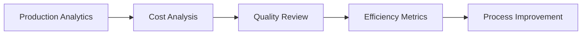
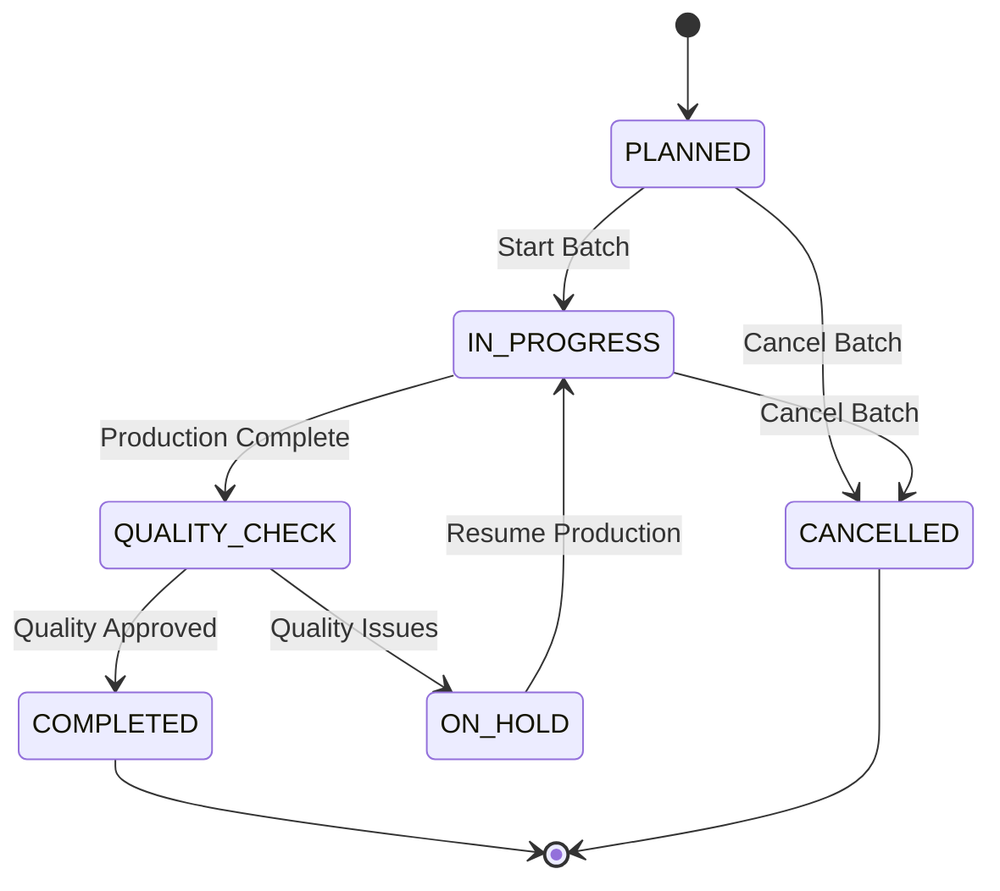

# Production Workflow System Documentation

## Overview

The Production Workflow System is a comprehensive manufacturing management solution designed to streamline the entire production process from recipe creation to finished product inventory. This system provides complete traceability, cost tracking, quality control, and analytics for manufacturing operations.

## Table of Contents

1. [System Architecture](#system-architecture)
2. [Core Components](#core-components)
3. [Production Workflow](#production-workflow)
4. [Recipe Management](#recipe-management)
5. [Production Batch Management](#production-batch-management)
6. [Inventory Integration](#inventory-integration)
7. [Cost Tracking](#cost-tracking)
8. [Quality Control](#quality-control)
9. [Analytics & Reporting](#analytics--reporting)
10. [API Reference](#api-reference)
11. [Database Schema](#database-schema)
12. [Sample Data](#sample-data)
13. [Best Practices](#best-practices)
14. [Troubleshooting](#troubleshooting)

---

## System Architecture

### Technology Stack
- **Backend**: Node.js with TypeScript
- **Database**: PostgreSQL with Prisma ORM
- **Frontend**: Next.js with React
- **Authentication**: NextAuth.js
- **State Management**: React Server Components with Server Actions

### Key Design Principles
- **Traceability**: Complete audit trail from raw materials to finished products
- **Cost Accuracy**: Real-time cost tracking and profitability analysis
- **Scalability**: Designed to handle multiple production facilities and product lines
- **Integration**: Seamless integration with inventory, sales, and financial systems
- **Quality Control**: Built-in quality management and compliance tracking

---

## Core Components

### 1. Recipe Management System
- **Digital Recipe Cards**: Standardized recipes with ingredients, instructions, and nutritional information
- **Version Control**: Track recipe changes and maintain historical versions
- **Cost Calculation**: Automatic cost computation based on current raw material prices
- **Yield Management**: Accurate yield tracking and loss analysis

### 2. Production Batch System
- **Batch Planning**: Schedule and plan production runs based on demand
- **Resource Allocation**: Assign staff, equipment, and materials to batches
- **Real-time Tracking**: Monitor production progress and status updates
- **Quality Checkpoints**: Built-in quality control steps and approvals

### 3. Inventory Integration
- **Raw Material Reservation**: Automatic inventory allocation for planned batches
- **Real-time Consumption**: Track material usage during production
- **Finished Goods**: Automatic inventory updates upon batch completion
- **Waste Tracking**: Monitor and analyze production waste

### 4. Cost Management
- **Material Costs**: Track raw material consumption and costs
- **Labor Costs**: Monitor production time and labor expenses
- **Overhead Allocation**: Distribute overhead costs across products
- **Profitability Analysis**: Real-time margin and profitability tracking

---

## Production Workflow

### Phase 1: Recipe Development & Costing


**Steps:**
1. **Recipe Creation**: Define basic recipe information including name, category, yield, and difficulty
2. **Ingredient Definition**: Specify raw materials, quantities, and units of measure
3. **Instruction Creation**: Detail step-by-step production instructions with timings
4. **Cost Calculation**: System automatically calculates material, labor, and overhead costs
5. **Pricing Strategy**: Set target margins and suggested selling prices
6. **Recipe Activation**: Approve recipe for production use

### Phase 2: Production Planning


**Steps:**
1. **Demand Analysis**: Review sales forecasts and current inventory levels
2. **Batch Creation**: Create production batches based on recipes and demand
3. **Resource Verification**: Check availability of raw materials, equipment, and staff
4. **Scheduling**: Set production start and end times considering capacity
5. **Material Reservation**: Reserve required raw materials from inventory
6. **Staff Assignment**: Assign production workers and supervisors

### Phase 3: Production Execution


**Steps:**
1. **Batch Initiation**: Start production and convert reserved materials to work-in-progress
2. **Material Consumption**: Track actual material usage against planned quantities
3. **Production Monitoring**: Monitor progress, time, and any issues encountered
4. **Quality Control**: Perform quality checks at designated checkpoints
5. **Batch Completion**: Record final quantities, quality scores, and completion time
6. **Inventory Update**: Add finished products to inventory with accurate costing

### Phase 4: Analysis & Optimization



**Steps:**
1. **Production Analytics**: Review batch performance and yield analysis
2. **Cost Analysis**: Compare actual vs. planned costs and identify variances
3. **Quality Assessment**: Analyze quality scores and identify improvement areas
4. **Efficiency Metrics**: Calculate productivity and capacity utilization
5. **Continuous Improvement**: Implement process enhancements based on data

---

## Recipe Management

### Recipe Structure

```typescript
interface Recipe {
  id: string
  name: string
  description?: string
  category: string
  servingSize: number
  servingUnit: UnitOfMeasure
  preparationTime: number // minutes
  cookingTime: number // minutes
  totalTime: number // minutes
  difficulty: 'EASY' | 'MEDIUM' | 'HARD'
  status: RecipeStatus
  version: number
  yields: number
  yieldUnit: UnitOfMeasure

  // Costing
  totalMaterialCost: number
  laborCost: number
  overheadCost: number
  totalCost: number
  costPerUnit: number
  suggestedSellingPrice: number
  targetMarginPercentage: number

  // Relations
  ingredients: RecipeIngredient[]
  instructions: RecipeInstruction[]
  productionBatches: ProductionBatch[]
}
```

### Recipe Creation Example

```javascript
// Create a new chocolate chip cookie recipe
const cookieRecipe = await createRecipe({
  name: "Classic Chocolate Chip Cookies",
  description: "Delicious homemade cookies with crispy edges",
  category: "Cookies & Biscuits",
  servingSize: 1,
  servingUnit: "PIECES",
  preparationTime: 45,
  cookingTime: 12,
  difficulty: "EASY",
  yields: 24,
  yieldUnit: "PIECES",
  targetMarginPercentage: 60,

  ingredients: [
    {
      rawMaterialId: "flour-id",
      quantity: 2.25,
      unitOfMeasure: "CUPS",
      notes: "All-purpose flour, sifted"
    },
    {
      rawMaterialId: "sugar-id",
      quantity: 0.75,
      unitOfMeasure: "CUPS",
      notes: "Granulated white sugar"
    },
    // ... more ingredients
  ],

  instructions: [
    {
      stepNumber: 1,
      instruction: "Preheat oven to 375°F",
      estimatedTime: 5,
      temperature: 375,
      equipment: "Oven"
    },
    // ... more steps
  ]
}, organizationId, userId)
```

### Cost Calculation Logic

The system automatically calculates recipe costs using this formula:

```javascript
// Material Costs
const materialCost = ingredients.reduce((total, ingredient) => {
  return total + (ingredient.quantity * ingredient.rawMaterial.costPrice)
}, 0)

// Labor Costs (based on total time and hourly rate)
const laborCost = (recipe.totalTime / 60) * HOURLY_LABOR_RATE

// Overhead Costs (percentage of material + labor)
const overheadCost = (materialCost + laborCost) * OVERHEAD_PERCENTAGE

// Total Cost
const totalCost = materialCost + laborCost + overheadCost

// Cost Per Unit
const costPerUnit = totalCost / recipe.yields

// Suggested Selling Price (based on target margin)
const sellingPrice = costPerUnit / (1 - (targetMargin / 100))
```

---

## Production Batch Management

### Batch Lifecycle



### Batch Creation

```javascript
// Create a production batch
const batch = await createProductionBatch({
  recipeId: "recipe-123",
  quantityToProduce: 48, // 2x recipe yield
  priority: "MEDIUM",
  scheduledStartTime: new Date("2024-03-15T08:00:00Z"),
  scheduledEndTime: new Date("2024-03-15T12:00:00Z"),
  locationId: "location-456",
  assignedToId: "user-789",
  supervisorId: "supervisor-012",
  productionNotes: "Rush order for weekend sales"
}, organizationId, userId)
```

### Material Reservation Process

When a batch is created, the system automatically:

1. **Validates Availability**: Checks if sufficient raw materials are available
2. **Calculates Requirements**: Determines exact quantities needed based on recipe scaling
3. **Reserves Inventory**: Moves materials from "Available" to "Reserved" status
4. **Creates Audit Trail**: Records all reservation transactions

```javascript
// Example: Reserve materials for 2x cookie recipe batch
const scalingFactor = 48 / 24 // 2x the base recipe
const flourNeeded = 2.25 * scalingFactor // 4.5 cups flour required

// Check availability
if (flourInventory.quantityAvailable < flourNeeded) {
  throw new Error(`Insufficient flour. Need: ${flourNeeded}, Available: ${flourInventory.quantityAvailable}`)
}

// Reserve the materials
await updateInventoryLevel({
  itemId: flour.id,
  locationId: batch.locationId,
  quantityReserved: { increment: flourNeeded },
  quantityAvailable: { decrement: flourNeeded }
})
```

---

## Inventory Integration

### Material Flow Tracking

The production system seamlessly integrates with inventory management through these transaction types:

| Transaction Type | Description | Inventory Impact |
|-----------------|-------------|-------------------|
| RESERVATION | Materials reserved for production | Available → Reserved |
| CONSUMPTION | Materials used in production | Reserved → Consumed |
| PRODUCTION | Finished goods created | Quantity Added |
| WASTE | Production waste recorded | Quantity Deducted |
| ADJUSTMENT | Corrections and adjustments | Quantity Adjusted |

### Inventory Transaction Examples

```javascript
// 1. Reserve materials when batch is created
await createInventoryTransaction({
  type: "RESERVATION",
  quantity: 4.5,
  unitCost: 0.75,
  totalCost: 3.375,
  itemId: "flour-123",
  locationId: "warehouse-1",
  referenceType: "PRODUCTION_BATCH",
  referenceId: "batch-456",
  notes: "Reserved for cookie batch #456"
})

// 2. Consume materials when production starts
await createInventoryTransaction({
  type: "CONSUMPTION",
  quantity: -4.5,
  unitCost: 0.75,
  totalCost: -3.375,
  itemId: "flour-123",
  locationId: "warehouse-1",
  referenceType: "PRODUCTION_BATCH",
  referenceId: "batch-456",
  notes: "Consumed in cookie production"
})

// 3. Add finished products when batch completes
await createInventoryTransaction({
  type: "PRODUCTION",
  quantity: 46, // 46 cookies produced
  unitCost: 0.125, // cost per cookie
  totalCost: 5.75,
  itemId: "cookies-789",
  locationId: "warehouse-1",
  referenceType: "PRODUCTION_BATCH",
  referenceId: "batch-456",
  notes: "Cookies produced from batch #456"
})
```

---

## Cost Tracking

### Cost Categories

The system tracks costs across multiple categories for accurate profitability analysis:

#### 1. Material Costs
- Raw material consumption at actual purchase prices
- Includes waste and yield loss calculations
- Tracks price variances from standard costs

#### 2. Labor Costs
- Production time × hourly labor rates
- Includes direct labor and supervision costs
- Overtime premiums and shift differentials

#### 3. Overhead Costs
- Equipment depreciation and maintenance
- Utilities (electricity, gas, water)
- Facility costs (rent, insurance)
- Quality control and testing

#### 4. Packaging Costs
- Primary packaging materials
- Labels and printing
- Secondary packaging for shipping

### Cost Calculation Example

```javascript
// For a completed cookie batch
const batchCosts = {
  materials: {
    flour: { quantity: 4.5, unitCost: 0.75, total: 3.375 },
    sugar: { quantity: 1.5, unitCost: 0.95, total: 1.425 },
    butter: { quantity: 2.0, unitCost: 4.50, total: 9.000 },
    eggs: { quantity: 4, unitCost: 0.25, total: 1.000 },
    vanilla: { quantity: 20, unitCost: 0.50, total: 10.000 },
    bakingPowder: { quantity: 10, unitCost: 0.15, total: 1.500 }
  },

  labor: {
    baker: { hours: 2.5, rate: 15.00, total: 37.50 },
    supervisor: { hours: 0.5, rate: 20.00, total: 10.00 }
  },

  overhead: {
    utilities: 3.25,
    equipment: 5.00,
    facility: 2.75
  },

  packaging: {
    bags: { quantity: 46, unitCost: 0.05, total: 2.30 },
    labels: { quantity: 46, unitCost: 0.02, total: 0.92 }
  }
}

// Calculate totals
const totalMaterialCost = Object.values(batchCosts.materials).reduce((sum, item) => sum + item.total, 0)
const totalLaborCost = Object.values(batchCosts.labor).reduce((sum, item) => sum + item.total, 0)
const totalOverheadCost = Object.values(batchCosts.overhead).reduce((sum, cost) => sum + cost, 0)
const totalPackagingCost = Object.values(batchCosts.packaging).reduce((sum, item) => sum + item.total, 0)

const totalCost = totalMaterialCost + totalLaborCost + totalOverheadCost + totalPackagingCost
const costPerUnit = totalCost / 46 // 46 cookies produced
```

---

## Quality Control

### Quality Management Framework

The system implements a comprehensive quality management framework with these components:

#### 1. Quality Checkpoints
- **Pre-production**: Raw material inspection
- **In-process**: Production monitoring and testing
- **Post-production**: Final product inspection
- **Packaging**: Package integrity and labeling verification

#### 2. Quality Scoring System
- **Scale**: 1-10 point quality score for each batch
- **Criteria**: Appearance, texture, taste, consistency
- **Thresholds**: Minimum quality scores for release
- **Grading**: A/B/C/Reject classification system

#### 3. Quality Documentation
- Detailed quality check notes for each batch
- Photo documentation of quality issues
- Corrective action tracking
- Root cause analysis for quality failures

### Quality Control Workflow

```javascript
// Quality check during production completion
const qualityCheck = {
  batchId: "batch-456",
  qualityScore: 8.5,
  qualityNotes: "Excellent batch. Perfect golden color, good texture, uniform size",
  qualityGrade: "A", // Calculated based on score
  inspector: "quality-manager-123",
  checkDate: new Date(),

  // Detailed scoring
  criteria: {
    appearance: 9,    // Visual appeal and color
    texture: 8,       // Consistency and mouth feel
    taste: 9,         // Flavor profile
    size: 8,          // Uniformity of pieces
    packaging: 9      // Package integrity
  },

  // Any issues found
  issues: [],

  // Photos attached
  photos: ["batch-456-photo-1.jpg", "batch-456-photo-2.jpg"]
}

await completeProductionBatch(
  batchId,
  quantityProduced: 46,
  qualityScore: 8.5,
  qualityNotes: qualityCheck.qualityNotes,
  organizationId,
  userId
)
```

### Quality Analytics

The system provides quality analytics including:
- Average quality scores by recipe
- Quality trends over time
- Defect tracking and root cause analysis
- Quality correlation with cost and yield
- Supplier quality performance

---

## Analytics & Reporting

### Production Analytics Dashboard

The system provides comprehensive analytics across multiple dimensions:

#### 1. Production Performance Metrics
- **Batch Completion Rate**: Percentage of batches completed on time
- **Yield Performance**: Actual vs. planned yield analysis
- **Production Efficiency**: Output per hour of production time
- **Capacity Utilization**: Percentage of production capacity used

#### 2. Cost Analytics
- **Cost Per Unit Trends**: Historical cost performance by product
- **Cost Variance Analysis**: Actual vs. standard cost comparison
- **Profitability Analysis**: Gross margins and profit per batch
- **Cost Center Performance**: Cost efficiency by production line/location

#### 3. Quality Metrics
- **Average Quality Scores**: Quality performance trends
- **Defect Rates**: Percentage of production rejected or downgraded
- **Quality Correlation**: Relationship between quality and cost/yield
- **Continuous Improvement**: Quality improvement tracking

#### 4. Recipe Performance Analysis
```javascript
const recipeAnalytics = {
  recipeId: "cookie-recipe-123",
  recipeName: "Classic Chocolate Chip Cookies",
  timeRange: "2024-Q1",

  performance: {
    totalBatches: 15,
    totalUnitsProduced: 720,
    averageYield: 96.5, // %
    averageQualityScore: 8.2,

    costs: {
      totalMaterialCost: 1250.50,
      totalLaborCost: 562.50,
      totalOverheadCost: 181.30,
      totalCost: 1994.30,
      averageCostPerUnit: 2.77
    },

    profitability: {
      averageSellingPrice: 7.50,
      grossMargin: 63.1, // %
      totalRevenue: 5400.00,
      totalProfit: 3405.70
    }
  }
}
```

### Standard Reports

#### 1. Daily Production Report
- Batches scheduled, started, and completed
- Production quantities and yields
- Quality scores and issues
- Material consumption summary
- Labor hours and costs

#### 2. Weekly Production Summary
- Production volume trends
- Cost performance analysis
- Quality metrics summary
- Capacity utilization review
- Top performing recipes

#### 3. Monthly Financial Analysis
- Production costs by category
- Profitability by product line
- Cost variance analysis
- Budget vs. actual performance
- ROI on production investments

#### 4. Quality Control Report
- Quality scores distribution
- Defect analysis and trending
- Root cause investigation status
- Corrective actions taken
- Quality improvement initiatives

---

## API Reference

### Recipe Management APIs

#### Create Recipe
```typescript
POST /api/recipes
Content-Type: application/json

{
  "name": "Classic Chocolate Chip Cookies",
  "description": "Traditional homemade cookies",
  "category": "Cookies & Biscuits",
  "servingSize": 1,
  "servingUnit": "PIECES",
  "preparationTime": 45,
  "cookingTime": 12,
  "difficulty": "EASY",
  "yields": 24,
  "yieldUnit": "PIECES",
  "targetMarginPercentage": 60,
  "ingredients": [...],
  "instructions": [...]
}
```

#### Get Recipes
```typescript
GET /api/recipes?status=ACTIVE&category=Cookies&page=1&limit=20
```

#### Update Recipe Costs
```typescript
PATCH /api/recipes/{recipeId}/costs
```

### Production Batch APIs

#### Create Production Batch
```typescript
POST /api/production/batches
Content-Type: application/json

{
  "recipeId": "recipe-123",
  "quantityToProduce": 48,
  "priority": "MEDIUM",
  "scheduledStartTime": "2024-03-15T08:00:00Z",
  "scheduledEndTime": "2024-03-15T12:00:00Z",
  "locationId": "location-456",
  "assignedToId": "user-789",
  "supervisorId": "supervisor-012",
  "productionNotes": "Rush order for weekend"
}
```

#### Start Production Batch
```typescript
POST /api/production/batches/{batchId}/start
```

#### Complete Production Batch
```typescript
POST /api/production/batches/{batchId}/complete
Content-Type: application/json

{
  "quantityProduced": 46,
  "qualityScore": 8.5,
  "qualityNotes": "Excellent batch quality",
  "issues": []
}
```

#### Get Production Batches
```typescript
GET /api/production/batches?status=IN_PROGRESS&locationId=location-456&page=1&limit=20
```

### Analytics APIs

#### Get Production Analytics
```typescript
GET /api/production/analytics?dateFrom=2024-01-01&dateTo=2024-03-31
```

#### Get Recipe Performance
```typescript
GET /api/production/recipes/{recipeId}/performance?dateRange=2024-Q1
```

---

## Database Schema

### Key Tables and Relationships

```sql
-- Core recipe table
CREATE TABLE recipes (
  id TEXT PRIMARY KEY,
  name TEXT NOT NULL,
  description TEXT,
  category TEXT NOT NULL,
  serving_size DECIMAL NOT NULL,
  serving_unit unit_of_measure NOT NULL,
  preparation_time INTEGER NOT NULL,
  cooking_time INTEGER NOT NULL,
  total_time INTEGER NOT NULL,
  difficulty TEXT NOT NULL,
  status recipe_status NOT NULL DEFAULT 'DRAFT',
  version INTEGER NOT NULL DEFAULT 1,
  yields DECIMAL NOT NULL,
  yield_unit unit_of_measure NOT NULL,

  -- Costing fields
  total_material_cost DECIMAL NOT NULL DEFAULT 0,
  labor_cost DECIMAL NOT NULL DEFAULT 0,
  overhead_cost DECIMAL NOT NULL DEFAULT 0,
  total_cost DECIMAL NOT NULL DEFAULT 0,
  cost_per_unit DECIMAL NOT NULL DEFAULT 0,
  suggested_selling_price DECIMAL NOT NULL DEFAULT 0,
  target_margin_percentage DECIMAL NOT NULL DEFAULT 0,

  -- Nutritional information
  calories_per_serving DECIMAL,
  fat_per_serving DECIMAL,
  protein_per_serving DECIMAL,
  carbs_per_serving DECIMAL,

  -- System fields
  organization_id TEXT NOT NULL REFERENCES organizations(id),
  created_by_id TEXT NOT NULL REFERENCES users(id),
  updated_by_id TEXT REFERENCES users(id),
  created_at TIMESTAMP NOT NULL DEFAULT NOW(),
  updated_at TIMESTAMP NOT NULL DEFAULT NOW()
);

-- Recipe ingredients (bill of materials)
CREATE TABLE recipe_ingredients (
  id TEXT PRIMARY KEY,
  recipe_id TEXT NOT NULL REFERENCES recipes(id) ON DELETE CASCADE,
  raw_material_id TEXT NOT NULL REFERENCES items(id),
  quantity DECIMAL NOT NULL,
  unit_of_measure unit_of_measure NOT NULL,
  cost DECIMAL NOT NULL DEFAULT 0,
  notes TEXT,
  is_optional BOOLEAN NOT NULL DEFAULT false
);

-- Recipe instructions (production steps)
CREATE TABLE recipe_instructions (
  id TEXT PRIMARY KEY,
  recipe_id TEXT NOT NULL REFERENCES recipes(id) ON DELETE CASCADE,
  step_number INTEGER NOT NULL,
  instruction TEXT NOT NULL,
  estimated_time INTEGER, -- minutes
  temperature DECIMAL,
  equipment TEXT,
  notes TEXT
);

-- Production batches
CREATE TABLE production_batches (
  id TEXT PRIMARY KEY,
  batch_number TEXT UNIQUE NOT NULL,
  recipe_id TEXT NOT NULL REFERENCES recipes(id),
  quantity_planned DECIMAL NOT NULL,
  quantity_produced DECIMAL NOT NULL DEFAULT 0,
  quantity_yield DECIMAL NOT NULL DEFAULT 0,
  yield_percentage DECIMAL NOT NULL DEFAULT 0,

  status production_status NOT NULL DEFAULT 'PLANNED',
  priority production_priority NOT NULL DEFAULT 'MEDIUM',

  -- Scheduling
  scheduled_start_time TIMESTAMP NOT NULL,
  scheduled_end_time TIMESTAMP NOT NULL,
  actual_start_time TIMESTAMP,
  actual_end_time TIMESTAMP,

  -- Location and staff
  location_id TEXT NOT NULL REFERENCES locations(id),
  assigned_to_id TEXT REFERENCES users(id),
  supervisor_id TEXT REFERENCES users(id),

  -- Costing
  total_material_cost DECIMAL NOT NULL DEFAULT 0,
  total_labor_cost DECIMAL NOT NULL DEFAULT 0,
  total_overhead_cost DECIMAL NOT NULL DEFAULT 0,
  total_cost DECIMAL NOT NULL DEFAULT 0,
  cost_per_unit DECIMAL NOT NULL DEFAULT 0,

  -- Quality control
  quality_check_notes TEXT,
  quality_score DECIMAL,
  quality_check_by TEXT REFERENCES users(id),
  quality_check_date TIMESTAMP,

  -- Notes and tracking
  production_notes TEXT,
  issues_encountered TEXT,
  waste_amount DECIMAL,
  waste_reason TEXT,

  -- System fields
  organization_id TEXT NOT NULL REFERENCES organizations(id),
  created_by_id TEXT NOT NULL REFERENCES users(id),
  updated_by_id TEXT REFERENCES users(id),
  created_at TIMESTAMP NOT NULL DEFAULT NOW(),
  updated_at TIMESTAMP NOT NULL DEFAULT NOW()
);

-- Raw material usage tracking
CREATE TABLE raw_material_usage (
  id TEXT PRIMARY KEY,
  production_batch_id TEXT NOT NULL REFERENCES production_batches(id) ON DELETE CASCADE,
  raw_material_id TEXT NOT NULL REFERENCES items(id),
  quantity_used DECIMAL NOT NULL,
  unit_cost DECIMAL NOT NULL,
  total_cost DECIMAL NOT NULL,
  notes TEXT
);

-- Finished products from batches
CREATE TABLE finished_products (
  id TEXT PRIMARY KEY,
  production_batch_id TEXT NOT NULL REFERENCES production_batches(id) ON DELETE CASCADE,
  item_id TEXT NOT NULL REFERENCES items(id),
  quantity_produced DECIMAL NOT NULL,
  unit_cost DECIMAL NOT NULL,
  total_cost DECIMAL NOT NULL,
  quality_grade TEXT,
  expiry_date TIMESTAMP,
  batch_code TEXT
);

-- Production cost breakdown
CREATE TABLE production_costs (
  id TEXT PRIMARY KEY,
  production_batch_id TEXT NOT NULL REFERENCES production_batches(id) ON DELETE CASCADE,
  cost_type cost_type NOT NULL,
  description TEXT NOT NULL,
  amount DECIMAL NOT NULL,
  quantity DECIMAL,
  rate DECIMAL,
  notes TEXT
);
```

### Indexes for Performance

```sql
-- Performance indexes
CREATE INDEX idx_recipes_organization ON recipes(organization_id);
CREATE INDEX idx_recipes_status ON recipes(status);
CREATE INDEX idx_recipes_category ON recipes(category);

CREATE INDEX idx_production_batches_organization ON production_batches(organization_id);
CREATE INDEX idx_production_batches_recipe ON production_batches(recipe_id);
CREATE INDEX idx_production_batches_status ON production_batches(status);
CREATE INDEX idx_production_batches_location ON production_batches(location_id);
CREATE INDEX idx_production_batches_scheduled_start ON production_batches(scheduled_start_time);

CREATE INDEX idx_raw_material_usage_batch ON raw_material_usage(production_batch_id);
CREATE INDEX idx_raw_material_usage_material ON raw_material_usage(raw_material_id);

CREATE INDEX idx_finished_products_batch ON finished_products(production_batch_id);
CREATE INDEX idx_finished_products_item ON finished_products(item_id);
```

---

## Sample Data

The system includes comprehensive sample data to demonstrate the full production workflow:

### Sample Recipes Created:

#### 1. Classic Chocolate Chip Cookies
- **Yield**: 24 cookies
- **Prep Time**: 45 minutes
- **Cook Time**: 12 minutes
- **Difficulty**: Easy
- **Ingredients**: Flour, sugar, butter, eggs, vanilla, baking powder
- **Cost per unit**: ~$0.125
- **Suggested price**: ~$7.50/dozen

#### 2. Artisan Sourdough Bread
- **Yield**: 1 loaf
- **Prep Time**: 180 minutes (includes rising)
- **Cook Time**: 45 minutes
- **Difficulty**: Medium
- **Ingredients**: Flour, sourdough starter, salt, water
- **Cost per unit**: ~$3.50
- **Suggested price**: ~$12.00/loaf

### Sample Production Batches:

#### 1. Cookie Batch #1 (Completed)
- **Recipe**: Classic Chocolate Chip Cookies
- **Planned**: 48 cookies (2x recipe)
- **Produced**: 46 cookies (95.8% yield)
- **Quality Score**: 8.5/10
- **Status**: Completed
- **Notes**: "Excellent batch. Perfect texture and golden color."

#### 2. Bread Batch #1 (In Progress)
- **Recipe**: Artisan Sourdough Bread
- **Planned**: 5 loaves
- **Status**: In Progress
- **Priority**: High
- **Notes**: "Dough is rising well. Expected completion in 2 hours."

#### 3. Cookie Batch #2 (Planned)
- **Recipe**: Classic Chocolate Chip Cookies
- **Planned**: 72 cookies (3x recipe)
- **Status**: Planned for tomorrow
- **Priority**: Medium
- **Notes**: "Large batch for weekend sales rush"

### Sample Raw Materials:
- All-Purpose Flour ($0.75/kg, 500kg in stock)
- Granulated Sugar ($0.95/kg, 300kg in stock)
- Unsalted Butter ($4.50/kg, 100kg in stock)
- Large Eggs ($0.25 each, 360 in stock)
- Pure Vanilla Extract ($0.50/ml, 200ml in stock)
- Baking Powder ($0.15/g, 2000g in stock)

---

## Best Practices

### 1. Recipe Development
- **Standardize Measurements**: Use consistent units of measure across all recipes
- **Document Everything**: Include detailed notes, equipment requirements, and timing
- **Version Control**: Track recipe changes and maintain version history
- **Cost Accuracy**: Regularly update material costs to ensure accurate costing
- **Test Batches**: Always run test batches before activating new recipes

### 2. Production Planning
- **Demand Forecasting**: Use sales data and trends for production planning
- **Capacity Planning**: Don't exceed equipment or staff capacity limits
- **Material Availability**: Always check raw material inventory before scheduling
- **Lead Times**: Account for procurement lead times in production schedules
- **Buffer Inventory**: Maintain safety stock levels for critical materials

### 3. Quality Management
- **Standard Procedures**: Establish clear quality control procedures
- **Documentation**: Record all quality checks and maintain audit trails
- **Root Cause Analysis**: Investigate quality issues and implement corrective actions
- **Continuous Improvement**: Use quality data to improve processes
- **Training**: Ensure all staff are trained on quality standards

### 4. Cost Control
- **Standard Costs**: Establish standard costs and monitor variances
- **Waste Tracking**: Monitor and analyze all forms of production waste
- **Efficiency Metrics**: Track labor productivity and equipment utilization
- **Regular Reviews**: Conduct monthly cost reviews and variance analysis
- **Pricing Updates**: Regularly review and update product pricing

### 5. System Administration
- **Access Control**: Implement role-based access controls
- **Data Backup**: Maintain regular backups of production data
- **Performance Monitoring**: Monitor system performance and scalability
- **Integration Testing**: Test all integrations with inventory and finance systems
- **User Training**: Provide comprehensive training to all system users

---

## Troubleshooting

### Common Issues and Solutions

#### 1. Recipe Cost Calculation Issues
**Problem**: Recipe costs are not calculating correctly
**Causes**:
- Missing or incorrect raw material costs
- Incorrect ingredient quantities or units
- Labor rate not configured

**Solutions**:
- Verify all raw material cost prices are current
- Check ingredient quantity and unit conversions
- Update labor rates in system configuration
- Recalculate recipe costs manually if needed

#### 2. Production Batch Creation Failures
**Problem**: Cannot create production batches
**Causes**:
- Insufficient raw material inventory
- Recipe not activated
- Location or user assignments invalid

**Solutions**:
- Check raw material availability in target location
- Ensure recipe status is "ACTIVE"
- Verify user and location assignments exist
- Check organization permissions

#### 3. Inventory Integration Issues
**Problem**: Inventory not updating correctly
**Causes**:
- Database transaction failures
- Inventory calculation errors
- Missing inventory levels for items

**Solutions**:
- Check database connection and transaction logs
- Verify inventory level records exist for all items/locations
- Reconcile physical inventory with system records
- Run inventory adjustment if needed

#### 4. Quality Control Problems
**Problem**: Quality scores not saving or calculating
**Causes**:
- Invalid quality score values
- Missing quality checker assignments
- Quality workflow not followed

**Solutions**:
- Ensure quality scores are between 1-10
- Verify quality checker has proper permissions
- Complete all required quality checkpoints
- Review quality control workflow configuration

#### 5. Performance Issues
**Problem**: System running slowly during production
**Causes**:
- Large number of concurrent transactions
- Database query optimization needed
- Memory or CPU constraints

**Solutions**:
- Optimize database queries and add indexes
- Implement caching for frequently accessed data
- Scale database resources if needed
- Monitor system resources during peak usage

### Debug Tools and Commands

#### Check Recipe Calculations
```sql
-- Verify recipe cost calculations
SELECT
  r.name,
  r.total_material_cost,
  SUM(ri.cost) as calculated_material_cost,
  r.total_cost,
  r.cost_per_unit
FROM recipes r
LEFT JOIN recipe_ingredients ri ON r.id = ri.recipe_id
WHERE r.id = 'recipe-id'
GROUP BY r.id, r.name, r.total_material_cost, r.total_cost, r.cost_per_unit;
```

#### Verify Inventory Levels
```sql
-- Check inventory levels for production batch
SELECT
  i.name,
  il.quantity_available,
  il.quantity_reserved,
  ri.quantity * (pb.quantity_planned / r.yields) as required_quantity
FROM production_batches pb
JOIN recipes r ON pb.recipe_id = r.id
JOIN recipe_ingredients ri ON r.id = ri.recipe_id
JOIN items i ON ri.raw_material_id = i.id
LEFT JOIN inventory_levels il ON i.id = il.item_id AND pb.location_id = il.location_id
WHERE pb.id = 'batch-id';
```

#### Monitor Production Performance
```sql
-- Production performance summary
SELECT
  DATE_TRUNC('day', pb.actual_start_time) as production_date,
  COUNT(*) as batches_completed,
  SUM(pb.quantity_produced) as total_units,
  AVG(pb.yield_percentage) as avg_yield,
  AVG(pb.quality_score) as avg_quality
FROM production_batches pb
WHERE pb.status = 'COMPLETED'
  AND pb.actual_start_time >= NOW() - INTERVAL '30 days'
GROUP BY DATE_TRUNC('day', pb.actual_start_time)
ORDER BY production_date DESC;
```

### Support and Maintenance

#### Regular Maintenance Tasks
- **Daily**: Review production schedules and material availability
- **Weekly**: Analyze production performance and quality metrics
- **Monthly**: Update material costs and review recipe profitability
- **Quarterly**: Full system performance review and optimization

#### Monitoring Alerts
- Low raw material inventory levels
- Production batches behind schedule
- Quality scores below thresholds
- System performance degradation
- Failed inventory transactions

#### Support Resources
- System documentation and user guides
- Video training materials
- Help desk and support ticketing system
- User forums and knowledge base
- Regular training webinars and updates

---

## Conclusion

The Production Workflow System provides a comprehensive solution for managing manufacturing operations from recipe development through finished product delivery. With robust cost tracking, quality control, and analytics capabilities, it enables manufacturers to optimize their operations, maintain quality standards, and maximize profitability.

The system's integration with inventory management, real-time cost tracking, and comprehensive reporting makes it an essential tool for modern manufacturing operations of any size.

For additional support, training, or customization requests, please contact the system administrators or refer to the support resources listed above.

---

*Last Updated: March 2024*
*Version: 1.0*
*Document Maintained By: Production Systems Team*