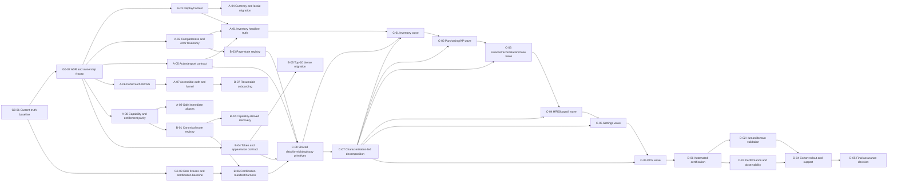

# Dependency Architecture and Critical Path

**Status:** planned  
**Rule:** a downstream module may adopt a contract only after its owner, interface, tests, telemetry, rollout, and rollback are approved.

## Program dependency graph

## Critical path interpretation

The longest control-dependent path is:

`G0-01 → G0-02 → A-08 → B-01 → B-02/B-06 → C-00 → C-01 → C-02 → C-03 → C-04 → C-05 → C-06 → D-01 → D-02/D-03 → D-04 → D-05`.

Why this path dominates:

- capability and route truth determine which users and packages may reach every later module surface;
- the certification manifest cannot be complete until canonical routes and roles are known;
- module waves must adopt stable shared contracts rather than inventing local variants;
- final certification must run against the migrated canonical surface, not aliases or temporary UI;
- rollout cannot begin until automated and human validation evidence converge.

The financial/display-truth path runs in parallel but is also Phase-A blocking:

`G0-02 → A-03 → A-04` and `G0-02 → A-02 → A-01`.

Neither path can be waived. Phase A closes only when both are complete.

## Safe parallel work

After G0-02 freezes interfaces and owners:

- A-03 DisplayContext, A-05 action/export, A-06 WCAG, and A-08 capability design may run concurrently.
- A-01 may begin service characterization while A-03/A-02 are finalized, but UI cutover waits for both contracts.
- B-03 page states and B-04 semantic tokens may run concurrently.
- B-06 may scaffold fixtures and manifest schema before B-01, but route population waits for the registry.
- Module teams may create characterization tests during Phase B; production migrations wait for C-00.
- D-03 performance instrumentation can be designed early; production thresholds are accepted only after representative route data exists.

Unsafe parallelization:

- do not migrate money displays before DisplayContext and approved currency semantics;
- do not redirect duplicate routes before canonical route and analytics decisions;
- do not hard-enforce entitlements globally before legacy tenant and subscription migrations;
- do not split high-risk components before characterization tests;
- do not create per-module table, state, form, or theme primitives while the shared contract is unsettled;
- do not certify screenshots produced before stable fixtures, route ownership, and supported theme decisions.

## Target contract register

### CT-01 — DisplayContext

- **Purpose:** provide trusted organization locale, currency, timezone, number/date formatting policy, organization ID, and optional location scope.
- **Owner:** platform/domain architecture; finance control approves money semantics.
- **Boundary:** server-derived and passed through read models; client consumes immutable display metadata.
- **Current foundation:** organization currency/timezone fields; dashboard, inventory history, AP history, reports, and daily-habit services already use parts of this context. `lib/i18n/formatters.ts` still defaults to USD.
- **Dependencies:** G0-02 decisions on organization truth; no schema change unless existing fields prove insufficient.
- **Consumers:** inventory, purchasing/AP, finance, POS, notifications, reports, analytics, settings, exports.
- **Version/migration:** introduce `v1`, adapter legacy formatters, migrate risk-tier domains, then ban unapproved literals.
- **Failure:** fail closed for financial displays or render explicit unavailable/partial state; never substitute USD silently.
- **Telemetry:** missing/invalid context count, fallback use count, display-context version.
- **Tests:** locale/currency fixtures, invalid timezone, organization-scope, SSR/client parity, notification/export parity.
- **Rollout/rollback:** feature flag by module; rollback to adapter, never to silent default.
- **Adoption measure:** certified business UI has zero unapproved currency fallback.

### CT-02 — Service-owned UI read model

- **Purpose:** make aggregation, scope, period/as-of, completeness, provenance, and policies server-owned.
- **Owner:** domain backend/data owner; finance/control validates metric definitions.
- **Boundary:** service returns typed read model; UI performs no organization-wide aggregation over paginated rows.
- **Current foundation:** dashboard read model, inventory movement history, inventory stats, AP history, finance and assurance models.
- **Dependencies:** CT-01 and CT-05 completeness/error taxonomy.
- **Consumers:** every KPI, table summary, proof banner, export, and command-center surface.
- **Version/migration:** add fields compatibly, build adapters, compare old/new in shadow mode, cut over route-by-route.
- **Failure:** explicit error/partial/stale/unavailable result with correlation ID.
- **Telemetry:** generation latency, source completeness, snapshot age, comparison drift.
- **Tests:** page-size invariance, filter equality, tenant isolation, monetary precision, failure paths, as-of behavior.
- **Rollout/rollback:** shadow results before visible cutover; retain previous read path behind short-lived rollback flag.
- **Adoption measure:** 100% headline metrics disclose scope/currency/as-of/completeness.

### CT-03 — Capability decision

- **Purpose:** combine permission, module entitlement, organization lifecycle, location scope, access intent, and dependency state.
- **Owner:** security/IAM and SaaS platform/billing.
- **Boundary:** server-authoritative decision; UI consumes presentation-safe state/reason.
- **Current foundation:** RBAC, module catalog/evaluator, explicit `mode: "enforce"` paths, API module access, audit logging.
- **Gap:** default module mode is observe; hard-enforcement flag is false; 257 candidates remain.
- **Dependencies:** G0-02 entitlement-source ADR and legacy tenant migration plan.
- **Consumers:** route guards, actions, APIs, jobs, navigation, search, command palette, shortcuts, notifications, exports.
- **Version/migration:** observe → compare → pilot enforce → cohort enforce → default enforce; never big-bang.
- **Failure:** denied/locked/read-only/not-configured with stable reason code; no data leak in explanation.
- **Telemetry:** would-block vs deny, decision mismatch, bypass attempt, dependency gap, legacy-default usage.
- **Tests:** role/package/location matrix, wildcard behavior, read-only intent, deep links, server/UI parity, tenant boundaries.
- **Rollback:** return selected cohorts to observe while retaining audit logging and server RBAC.
- **Adoption measure:** all registered protected surfaces have explicit tested decisions.

### CT-04 — Canonical route registry

- **Purpose:** one route per user intent with aliases, owner, module, capability, breadcrumb, telemetry, state contract, and retirement date.
- **Owner:** enterprise UX/frontend platform.
- **Boundary:** typed config consumed by server routes and client navigation; server redirects preserve locale/query.
- **Current foundation:** 81-link sidebar, localization helpers, permission-aware shell, some safe redirects.
- **Dependencies:** CT-03 capability decision.
- **Consumers:** routes, sidebar, navbar search, shortcuts, command palette, sitemap/support docs, analytics, certification manifest.
- **Version/migration:** register current routes; choose canonical; mark aliases; instrument traffic; redirect; retire implementation after evidence window.
- **Failure:** unresolved route is excluded from release certification and logged as registry debt.
- **Telemetry:** alias traffic, redirect errors, destination denials, broken bookmarks.
- **Tests:** uniqueness, capability presence, locale/query preservation, analytics continuity, no redirect loops.
- **Rollback:** restore alias implementation/redirect mapping without losing canonical telemetry.
- **Adoption measure:** 100% active routes registered; no duplicate active task implementation.

### CT-05 — Page-state union

- **Purpose:** distinguish loading, empty, filtered empty, partial, stale, error, permission denied, locked, not configured, and success.
- **Owner:** design system and backend error-contract owners.
- **Boundary:** services emit stable state/reason metadata; shared UI renders accessible recovery behavior.
- **Current foundation:** `DashboardRouteState` already covers nine important states; BI and transaction-history components include partial/stale semantics.
- **Gap:** no complete registry/adoption, limited localization, no filtered-empty/not-configured distinction everywhere, many manual messages.
- **Dependencies:** error taxonomy and CT-03 capability reason codes.
- **Consumers:** every canonical page and module workbench.
- **Version/migration:** extend current primitive, localize, register route requirements, migrate risk tier first.
- **Failure:** unknown states map to safe generic error with correlation, never successful empty.
- **Telemetry:** state distribution, retries, recovery success, repeated failures.
- **Tests:** component semantics, focus/announcement, recovery actions, service-state mapping.
- **Rollback:** route-level adapter to prior explicit state; no silent catch-to-empty.
- **Adoption measure:** every canonical route declares and tests its state contract.

### CT-06 — Action capability and artifact contract

- **Purpose:** ensure every visible action is hidden, locked, disabled with reason, or executable with a verifiable result.
- **Owner:** backend/integration plus audit/evidence owner.
- **Boundary:** server declares permission/entitlement/idempotency/result type; client renders state and tracks outcome.
- **Current foundation:** working PO and reconciliation exports, action wrappers, report trust/export gate.
- **Gap:** dead inventory/user export controls and simulated customer export success.
- **Dependencies:** CT-03 and evidence artifact semantics.
- **Consumers:** buttons, menus, bulk actions, exports, background jobs, AI proposals.
- **Version/migration:** inventory actions; disable false controls; standardize artifact response; migrate exports/actions.
- **Failure:** no success toast without result; failures return correlation and recovery path.
- **Telemetry:** invocation/result/artifact IDs, row counts, latency, failure/retry, idempotency collisions.
- **Tests:** artifact exists, metadata/filter parity, denied/disabled behavior, retries, duplicate invocation.
- **Rollback:** disable control or return to known working exporter; never simulate completion.
- **Adoption measure:** zero enabled controls without real outcomes.

### CT-07 — Accessible form field

- **Purpose:** standardized label, hint, error, invalid state, autocomplete, focus, live announcement, and localization behavior.
- **Owner:** design system/accessibility; auth and domain teams consume.
- **Boundary:** reusable field primitives and server-error adapter; no sensitive error leakage.
- **Current foundation:** form libraries and visible validation exist.
- **Gap:** active auth forms have no programmatic validation relationships or autocomplete.
- **Dependencies:** content/legal decision for auth fields and CT-05 errors.
- **Consumers:** auth, settings, items, purchasing, accounting, HRIS/payroll.
- **Version/migration:** auth first; shared primitive; high-risk forms; remainder by module wave.
- **Failure:** focus first invalid control, announce summary, preserve entered safe data.
- **Telemetry:** validation category, submit failure, completion time without sensitive values.
- **Tests:** axe, keyboard, screen reader, browser autofill, server/client error mapping, EN/FR.
- **Rollback:** retain prior form behind route flag while fixing blocking accessibility defects.
- **Adoption measure:** all certified forms meet WCAG 2.2 AA manual and automated gates.

### CT-08 — Enterprise data view

- **Purpose:** shared filters, sorting, paging, selection, bulk safety, responsive policy, saved views, export parity, and evidence metadata.
- **Owner:** design system/data UX.
- **Boundary:** server query/read model owns data and totals; component owns interaction/accessibility.
- **Current foundation:** DataTable, transaction-history shell, mobile card pattern, command primitives.
- **Dependencies:** CT-02, CT-05, CT-06, CT-07, CT-09.
- **Consumers:** inventory, AP, finance, reconciliation, accounting, HRIS/payroll, settings, POS history.
- **Version/migration:** define column priority and adapter API; pilot inventory; migrate module waves.
- **Failure:** preserve filters/selection safely; bulk actions fail atomically or report per-row result explicitly.
- **Telemetry:** query latency, filter use, overflow/mobile fallback, export parity, bulk failures.
- **Tests:** keyboard table semantics, mobile identity/actions, pagination totals, saved views, export filters.
- **Rollback:** adapter retains legacy table behind feature flag without altering service truth.
- **Adoption measure:** dense certified routes share the contract and preserve supported mobile tasks.

### CT-09 — Semantic design-token and appearance contract

- **Purpose:** one semantic color/density/spacing/typography API across light, dark, and system behavior.
- **Owner:** design-system/brand.
- **Boundary:** global tokens define semantics; components consume them; exceptions are registered.
- **Current foundation:** dashboard variables and a strong dark identity.
- **Gap:** 91 forced-dark lines, 72 manual-color files, alternate theme islands, and an appearance control that can disagree with rendering.
- **Dependencies:** product decision on supported appearance modes.
- **Consumers:** all application and public UI.
- **Version/migration:** freeze token names; add CI exception register; migrate top 20 routes; then module waves.
- **Failure:** unsupported mode is not offered; invalid token falls back to accessible semantic default.
- **Telemetry:** user mode, route mismatch, contrast regression, exception count.
- **Tests:** visual/contrast snapshots per supported theme, high contrast, reduced motion, zoom.
- **Rollback:** module-level theme adapter; never strand mixed unreadable modes.
- **Adoption measure:** preference matches rendering; unregistered literal colors trend to zero.

### CT-10 — Certification manifest

- **Purpose:** define and record route, role, locale, browser, viewport, package, fixture, theme, accessibility, performance, screenshot, and reviewer evidence.
- **Owner:** QA/release assurance.
- **Boundary:** machine-readable manifest drives tests and stores results; humans sign named validation fields.
- **Current foundation:** Playwright specs, browser smoke scripts, screenshots, axe use, release gates.
- **Gap:** breadth, reusable role fixtures, three-browser coverage, and expert sign-off are incomplete.
- **Dependencies:** CT-04 route registry, CT-03 roles/capabilities, G0-03 fixtures.
- **Consumers:** CI, release gates, QA, accessibility, finance/control, support.
- **Version/migration:** schema first; public and top-20 routes; all canonical routes; historical evidence retention.
- **Failure:** missing blocking evidence prevents certification; advisory gaps require accepted residual risk.
- **Telemetry:** pass/fail/skip age, flaky rate, route coverage, reviewer status, evidence expiry.
- **Tests:** schema validation, manifest completeness, fixture redaction, artifact existence, result freshness.
- **Rollback:** pause promotion; retain last certified version and evidence; never fabricate pass status.
- **Adoption measure:** every certified release has complete, fresh, reviewer-backed evidence.

## Architecture decisions required at Gate 0

| ADR | Decision | Blocks |
|---|---|---|
| ADR-UI-001 | DisplayContext source, validation, fallback, and versioning | A-03, A-04, A-01 |
| ADR-UI-002 | Inventory value/profit metric definitions | A-01 |
| ADR-UI-003 | Entitlement source and observe-to-enforce policy | A-08, B-01, B-02 |
| ADR-UI-004 | Canonical route selection and deprecation window | A-09, B-01 |
| ADR-UI-005 | Error/completeness taxonomy and correlation policy | A-02, B-03 |
| ADR-UI-006 | Action artifact schema and evidence retention | A-05, C-00 |
| ADR-UI-007 | Supported appearance modes and token exception policy | B-04, B-05 |
| ADR-UI-008 | Minimum registration fields and onboarding lifecycle | A-07, B-07 |
| ADR-UI-009 | Supported browser/viewport/screen-reader matrix | B-06, D-01, D-02 |
| ADR-UI-010 | Release authority and residual-risk acceptance | D-04, D-05 |
