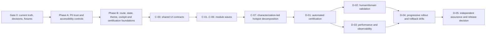

# Stoquify Enterprise UI/UX Remediation Roadmap

**Roadmap ID:** STQ-UIUX-REM-2026-08-06  
**Date:** 2026-08-06  
**Status:** executable roadmap; implementation not started by this deliverable  
**Authoritative input:** `STOQUIFY_ENTERPRISE_UI_UX_SYSTEM_AUDIT_2026-08-06.md`  
**Execution support directory:** `what-next/ui-ux/enterprise-remediation-roadmap/`

## 1. Executive directive

Stoquify should not approach the audit as a visual redesign. It is a convergence and trust program whose first duty is to make displayed business truth, access decisions, actions, routes, states, and accessibility dependable. The current product has valuable foundations—permission-filtered shell navigation, reusable route-state primitives, module inventory tooling, working export implementations, display-context islands, public route smoke automation, and extensive domain controls—but those foundations are not yet one closed UI system.

The delivery sequence is therefore:

No module-wide aesthetic migration starts before Phase A closes its P0 contracts and Phase B establishes canonical routes, states, semantic tokens, deterministic fixtures, and the certification harness. Module work can then proceed in parallel only where shared contracts are stable and each module has an independent rollout boundary.

## 2. What “done” means

The program is done only when:

- P0-01 through P0-05 are closed with current, reproducible automated and human evidence;
- every protected route/action is in a canonical registry and has a tested capability decision combining permission, module entitlement, organization state, and location scope;
- headline business metrics declare scope, currency, `asOf`, source status, provenance, and partiality, and are invariant to presentation pagination;
- every enabled control has a real executable outcome, and every successful export has an artifact ID/URL, filters, row count, timestamp, and audit correlation;
- EN/FR public/auth and risk-tiered authenticated journeys meet the declared WCAG 2.2 AA certification scope with keyboard and assistive-technology validation;
- currency, locale, time zone, number formatting, notification text, and export presentation derive from one server-owned `DisplayContext` without silent USD fallback;
- every canonical route declares its loading, empty, filtered-empty, partial, stale, error, denied, locked, not-configured, and success contract as applicable;
- appearance behavior matches the product decision and is governed by semantic tokens rather than forced theme roots and unowned literal colors;
- shared grid, dialog, image, copy, action, and state contracts are adopted by all prioritized modules;
- high-risk client hotspots are decomposed only after characterization tests and a refreshed dependency graph establish safe boundaries;
- the route × role × package × capability × state × locale × currency × theme × browser × viewport matrix is complete for its risk policy;
- rollout guardrails and rollback procedures are rehearsed, support/training are current, and adoption/control outcomes remain within budget; and
- an Independent Assurance Lead issues the final decision without an implementer self-certifying their own material control.

Code completion, screenshot creation, or passing one browser is not sufficient.

## 3. Revalidated starting point

The roadmap rechecked the dated audit against the current workspace. These values are planning baselines, not certification claims:

| Measure | Current observation |
|---|---:|
| Application `page.tsx` files | 140 |
| Localized pages under `app/[locale]` | 139 |
| Dashboard pages | 124 |
| App/component TSX files | 549 |
| Client TSX files | 213 |
| Sidebar href declarations | 81 |
| Loading / error / layout / not-found files | 11 / 23 / 14 / 2 |
| Module inventory | 19 modules / 387 surfaces |
| Mapped / enforcement-candidate / unmapped / missing-permission surfaces | 353 / 257 / 6 / 4 |
| E2E spec files / axe-integrated files | 10 / 6 |
| Forced-dark lines / manual-color TSX files | 91 / 72 |
| `globals.css` lines / hex / rgb(a) literals | 1,924 / 288 / 297 |
| Hard-coded currency/locale heuristic | 59 lines across 26 files; classification required |
| Raw interactive `` nodes | 5 |
| Current graph snapshot | 4,121 nodes, 5,321 edges, 135 communities, 755 isolated; stale/partial |

Material deltas from the audit:

- `/dashboard/inventory/items/new` and `/dashboard/items/new` now redirect to `/dashboard/inventory/items/create`; preserve and verify this remediation.
- Earlier invalid landing-page ARIA selectors are no longer in current source. This does not close P0-05: active login/registration fields still lack complete invalid/error/live-region/autocomplete semantics, and fresh accessibility certification is required.
- Module inventory counts changed to 387/353/257/6/4. Default module control remains `observe`, while explicit `enforce` paths already exist. Treat rollout as observe-to-enforce convergence, not a zero-enforcement starting point.
- An existing `getInventoryStats()` service already uses organization scope and reorder points. A-01 hardens and adopts this foundation; it does not create an unnecessary parallel read model.
- Display-context patterns exist in several dashboard, inventory, AP, finance, and accounting surfaces, but the shared formatter still defaults to USD.

Baseline verification performed during roadmap production:

- `npm run typecheck`: passed;
- focused Jest coverage: 6 suites / 45 tests passed;
- `npm run ui:smoke:public`: 6/6 EN/FR public/auth routes passed with screenshots.

These runs confirm planning stability only. Lint, production build, full tests, current policy gates, authenticated E2E, three-browser coverage, screen-reader validation, production performance, and rollout drills remain required execution gates.

## 4. Non-negotiable execution contracts

| ID | Contract | Required result | Principal producer |
|---|---|---|---|
| CT-01 | Inventory summary read model | Scoped, pagination-invariant, provenance-bearing inventory KPIs | A-01 |
| CT-02 | Read completeness and failure | Complete/partial/stale/unavailable semantics propagated to the UI | A-02 |
| CT-03 | DisplayContext | Server-derived locale, currency, time zone, number format and organization/location scope | A-03/A-04 |
| CT-04 | Capability decision | One permission + entitlement + org/location decision used by UI and server | A-08 |
| CT-05 | Canonical route registry | Typed owner/module/capability/state/canonical/alias/retirement metadata | B-01 |
| CT-06 | Action and artifact truth | Executable/disabled/locked controls and evidence-bearing exports | A-05 |
| CT-07 | Accessible field/state/dialog | Stable semantics, focus, announcements, recovery and WCAG behavior | A-06/A-07/B-03/C-00 |
| CT-08 | Semantic visual system | Governed theme tokens and component recipes with explicit exceptions | B-04/B-05/C-00 |
| CT-09 | Resumable onboarding | Persisted, role-aware, recoverable first-value journey | B-07 |
| CT-10 | Certification evidence | Risk-tiered, reproducible and freshness-bound route/role/capability evidence | G0-03/B-06/D-01/D-02 |

Consumers cannot invent private variants. A contract change requires versioning, consumer-impact analysis, compatibility/rollback policy, tests, telemetry, and an ADR update. Full definitions are in [`02_DEPENDENCY_AND_CRITICAL_PATH.md`](../../what-next/ui-ux/enterprise-remediation-roadmap/02_DEPENDENCY_AND_CRITICAL_PATH.md).

## 5. Work breakdown and execution order

### Gate 0 — make the program safe to execute

| WP | Outcome | Estimate | Accountable owner |
|---|---|---:|---|
| G0-01 | Current-truth and evidence ledger; refresh graphs; classify heuristics and audit deltas | 4–7 ideal days | Program Director |
| G0-02 | ADR, ownership, product boundary, RACI and evidence-policy freeze | 3–5 | Principal Architect |
| G0-03 | Deterministic organizations, personas, roles, packages, locales, currencies and route-state fixtures | 5–9 | QE Lead |

Gate 0 must resolve at least the supported theme promise, POS device boundary, canonical auth/route variants, entitlement rollout authority, country/currency scope, accessibility/browser scope, data-grid exception policy, and evidence retention. Unresolved decisions may not be silently converted into implementation assumptions.

### Phase A — close release-blocking trust defects

| WP | Outcome | Depends on | Estimate |
|---|---|---|---:|
| A-01 | Inventory financial-truth read boundary | G0-01/02/03 | 10–16 |
| A-02 | Read completeness, provenance, correlation and error taxonomy | G0-03 | 6–10 |
| A-03 | Server-derived DisplayContext | G0-02 | 7–12 |
| A-04 | Money-display migration and hard-code guard | A-03 | 10–18 |
| A-05 | Action/export/artifact truth contract | A-02/A-03/G0-03 | 8–14 |
| A-06 | Public/auth WCAG repair and rebaseline | G0-03 | 7–12 |
| A-07 | Accessible, simplified authentication funnel | A-06 | 8–13 |
| A-08 | Capability parity and staged entitlement enforcement | G0-02/G0-03 | 12–20 |
| A-09 | Immediate route aliases and false-control removal | A-05/A-08 | 5–8 |

Phase A exits only when P0 evidence is green for its scope. False zero, wrong money context, UI/server authorization mismatch, fake success, and critical/serious public/auth accessibility barriers are non-waivable release blockers.

### Phase B — establish the governing UI platform

| WP | Outcome | Depends on | Estimate |
|---|---|---|---:|
| B-01 | Canonical typed route registry and alias lifecycle | G0-02/A-08/A-09 | 8–14 |
| B-02 | Capability-derived navigation and role cockpit | A-08/B-01 | 8–14 |
| B-03 | Canonical page-state registry and accessible primitives | A-02/B-01 | 8–13 |
| B-04 | Semantic-token and appearance contract | G0-02 | 7–12 |
| B-05 | Top-20 risk surface theme migration | B-04/G0-03 | 12–20 |
| B-06 | Certification manifest and reusable Playwright/axe/visual harness | G0-03/A-06/A-08/B-01/B-03/B-05 | 10–17 |
| B-07 | Resumable role-aware onboarding | A-03/A-07/G0-03 | 10–17 |

B-04 can proceed alongside A contracts after the theme ADR. B-01 cannot finalize capability metadata before A-08. B-06 cannot claim coverage before routes, fixtures, states, accessibility primitives, and representative theme behavior exist.

### Phase C — normalize modules through shared contracts

| WP | Outcome | Estimate |
|---|---|---:|
| C-00 | Shared data-grid, dialog, image and localized-copy contracts | 12–20 |
| C-01 | Inventory normalization | 14–24 |
| C-02 | Purchasing/AP normalization | 18–28 |
| C-03 | Finance/accounting/reconciliation/close normalization | 22–34 |
| C-04 | HRIS/payroll normalization | 20–32 |
| C-05 | Settings/administration normalization | 14–22 |
| C-06 | POS normalization within desktop/tablet scope | 18–30 |
| C-07 | Characterization-led hotspot decomposition and refreshed architecture evidence | 15–25 |

C-01 through C-06 may proceed in separate squads once C-00 and their specific Phase A/B dependencies are stable. Finance/close, payroll, POS/offline, entitlement, and inventory-truth boundaries receive independent control review and rollback. C-07 extracts stable workflow boundaries in small reversible steps; it is not permission for a rewrite.

### Phase D — certify, validate, roll out and assure

| WP | Outcome | Depends on | Estimate |
|---|---|---|---:|
| D-01 | Automated release certification | B-06/C-07 | 8–14 |
| D-02 | Human accessibility, localization and domain validation | D-01 | 8–15 |
| D-03 | Performance and production-observability certification | D-01 | 7–12 |
| D-04 | Progressive rollout, support readiness and rollback rehearsal | D-01/02/03 | 7–12 |
| D-05 | Independent final assurance and release decision | D-04 | 4–7 |

Detailed work packages, including scope, non-goals, interfaces, migration, security/privacy/control requirements, accessibility/localization, implementation tasks, telemetry, tests, human validation, rollout, rollback, evidence, Definition of Ready/Done, estimates, owners, blockers and residual risks, are in:

- [`03_WORK_BREAKDOWN_STRUCTURE.md`](../../what-next/ui-ux/enterprise-remediation-roadmap/03_WORK_BREAKDOWN_STRUCTURE.md) — G0, A and B;
- [`03_WORK_BREAKDOWN_STRUCTURE_PHASE_C_D.md`](../../what-next/ui-ux/enterprise-remediation-roadmap/03_WORK_BREAKDOWN_STRUCTURE_PHASE_C_D.md) — C and D.

## 6. Critical path and parallel delivery

Primary critical path:

`G0-01 → G0-02/G0-03 → A-08 → B-01 → B-03/B-06 → C-00 → C-module gates → C-07 → D-01 → D-02/D-03 → D-04 → D-05`

Financial-truth subpath:

`G0-03 → A-01/A-02/A-03 → A-04/A-05 → C-01/C-03 → D-01/D-02`

Accessibility subpath:

`G0-03 → A-06 → A-07 → B-03/B-06 → C-00/module adoption → D-01/D-02`

Safe concurrency after Gate 0:

- A-01/A-02, A-03, A-05, A-06 and A-08 can run in separate bounded workstreams with shared-contract reviews.
- B-04 begins after its ADR and does not need to wait for all A implementation.
- C modules run in parallel after their dependency gates, with separate owners, fixtures, flags, telemetry and rollback.
- D-02 and D-03 run in parallel after D-01; D-04 waits for both.

Unsafe concurrency:

- independent capability logic in navigation, route guards and actions;
- multiple formatter/context contracts;
- module-specific route-state vocabularies;
- theme migrations before token semantics are frozen;
- hotspot decomposition before characterization tests and graph refresh;
- production entitlement enforcement before observe-mode parity; and
- several high-control module rollouts sharing one rollback boundary.

## 7. Resourcing, duration and operating model

The bottom-up range is **260–430 ideal engineering days**, excluding elapsed waiting for design partners, accessibility participants, independent assurance, or production observation windows. It is not a calendar commitment.

Planning scenarios:

| Model | Indicative elapsed time | Conditions |
|---|---:|---|
| One cross-functional squad | 10–15 months | Serial module delivery; specialist availability on demand |
| Three squads | 5–7 months | Platform/trust, experience/design system, and domain normalization streams |
| Four squads | 4–6 months | Adds dedicated certification/release stream; strong coordination and fixture discipline |

Use ±35% until Gate 0 completes graph refresh, current-truth classification, ADRs, fixture design and route inventory. Re-estimate at each phase gate using completed throughput and discovered coupling.

Minimum standing roles:

- Program Director / Product Executive sponsor;
- Principal Architect and Frontend Platform/Design Systems leads;
- Inventory, Purchasing/AP, Accounting Controls, Payroll, POS and Administration domain leads;
- Identity/Entitlements and Security Architecture leads;
- Accessibility, Localization and Privacy reviewers;
- QE automation, SRE/observability, Release and Support Readiness leads;
- independent assurance authority.

The implementer is responsible for evidence creation but cannot be the sole approver for financial truth, authorization, accessibility, privacy or release readiness.

## 8. Phase gates and release authority

| Gate | Minimum promotion condition | Decision authority |
|---|---|---|
| Gate 0 | Current truth reconciled; ADRs/owners/fixtures/evidence policy approved | Program Director + Principal Architect + Product Executive |
| A-P0 | P0 contracts implemented and verified; no false truth/access/action/accessibility blockers | Controls + Security + Accessibility + Program Director |
| B-Foundation | Canonical routes/states/tokens/cockpit/harness govern the selected scope | Architecture + Product Experience + QE |
| C-Module | Domain workflows, controls, access, states, a11y, localization, visual/performance and rollback pass | Domain/control owner + QE + Release |
| D-Automated | Full candidate build/policy/unit/E2E/manifest evidence green and fresh | QE Lead |
| D-Human/Operational | Human protocols, SLO/alerts, support/training and rollback drills accepted | Validation Director + SRE + Support + Release |
| Final | Exact certified claim supported; no open P0; residual risks accepted independently | Independent Assurance Lead |

The complete entry/exit evidence, non-waivable criteria, freshness and waiver rules are in [`06_PHASE_GATES_AND_RELEASE_CRITERIA.md`](../../what-next/ui-ux/enterprise-remediation-roadmap/06_PHASE_GATES_AND_RELEASE_CRITERIA.md).

## 9. Verification and validation strategy

The program uses four proof layers:

1. **Static/governance:** source inventories, schema validation, route/capability/state coverage, hard-code/theme/copy/native-dialog/image ratchets.
2. **Contract/functional:** service, failure-injection, tenant isolation, UI/server parity, export artifact, idempotency and reconciliation tests.
3. **Experience:** browser/viewport/theme/locale screenshots, axe, keyboard, reflow, assistive technology, role-based usability and domain-control validation.
4. **Operational:** production-build performance, SLOs/alerts, cohort telemetry, support readiness, adoption and timed rollback drills.

The executable matrix and reserved commands are in [`04_VERIFICATION_VALIDATION_MATRIX.md`](../../what-next/ui-ux/enterprise-remediation-roadmap/04_VERIFICATION_VALIDATION_MATRIX.md). Planned commands are deliberately labeled planned; they become gates only when their owner package implements and versions them.

The machine-readable certification specification is [`05_ROUTE_ROLE_CAPABILITY_CERTIFICATION_MANIFEST.json`](../../what-next/ui-ux/enterprise-remediation-roadmap/05_ROUTE_ROLE_CAPABILITY_CERTIFICATION_MANIFEST.json). Its current status is `planned-not-certified`. B-06 must validate it against the actual B-01 route registry and G0-03 fixture catalog.

## 10. Rollout, rollback and operations

Each contract/module follows shadow → staff → design partner → 5% → 25% → 50% → 100% → cleanup. Promotion uses explicit guardrails; high-control releases avoid payroll runs, period close and peak POS windows.

Rollback preserves authorization, audit evidence and durable business data. Capability policies may return to observe mode, UI read paths may revert only with truthful degraded states, false actions are disabled rather than simulated, and route rollback restores redirects rather than duplicate implementations.

The detailed decision triggers, procedures, RTO hypotheses and evidence-preservation checklist are in [`07_ROLLOUT_AND_ROLLBACK_RUNBOOK.md`](../../what-next/ui-ux/enterprise-remediation-roadmap/07_ROLLOUT_AND_ROLLBACK_RUNBOOK.md).

## 11. Change, support and adoption

Before a cohort receives a change, its operators and support team must understand the new state vocabulary, capability decisions, canonical routes, evidence/provenance, exports, accessibility support, and recovery steps. Training is role-based and scenario-assessed; it does not teach users around product defects.

The role curriculum, communication cadence, support decision tree, KB backlog, adoption measures and deprecation policy are in [`09_CHANGE_MANAGEMENT_SUPPORT_AND_TRAINING.md`](../../what-next/ui-ux/enterprise-remediation-roadmap/09_CHANGE_MANAGEMENT_SUPPORT_AND_TRAINING.md).

## 12. Principal risks and unresolved decisions

The highest-risk decisions to close at Gate 0 are:

1. **Theme promise:** certify dark-only and remove unsupported controls, or deliver light/dark/system through semantic tokens. The roadmap recommends the latter.
2. **Canonical route/auth variants:** select canonical `/login`/`/register`, item, supplier, location and tax-rate intents; define alias retirement and analytics continuity.
3. **Entitlement authority:** name the source of package truth, provider reconciliation policy, observe-to-enforce cohort authority and emergency behavior.
4. **Currency semantics:** distinguish organization display currency, document/transaction currency, reporting currency, exchange-rate provenance and unsupported configuration.
5. **Certification scope:** approve browsers, assistive technologies, viewports, role/package fixtures, evidence freshness and non-waivable thresholds.
6. **POS boundary:** retain desktop/tablet scope and define offline/replay SLO; phone certification remains excluded unless product scope changes.
7. **Data-grid policy:** define when responsive cards, priority columns, constrained horizontal scroll or measured virtualization apply.
8. **Retention/privacy:** approve evidence, screenshot, trace, artifact and support-data retention/redaction.

Dominant execution risks include stale architecture evidence, hidden coupling in very large client components, provider/package drift, partial read models, currency ambiguity, flaky/nondeterministic E2E, theme-island CSS blast radius, privacy leakage in evidence, and insufficient specialist availability. Owners, triggers and mitigations are recorded in [`08_RISK_ASSUMPTION_DECISION_LOG.md`](../../what-next/ui-ux/enterprise-remediation-roadmap/08_RISK_ASSUMPTION_DECISION_LOG.md).

## 13. Execution protocol

For each work package:

1. Confirm its Definition of Ready and dependency evidence.
2. Create a small delivery ledger linking the WP, findings, contracts, routes/actions, ADRs, risks and rollout unit.
3. Capture characterization/baseline evidence before changing behavior.
4. Implement the smallest contract-compliant slice behind an observable, expiring rollout boundary.
5. Run package-level automated verification and preserve failed as well as passed evidence.
6. Complete the named human/domain validation.
7. Update the traceability JSON, route certification evidence, risk/decision log, support/training content and phase gate.
8. Promote through cohorts only after the accountable and independent reviewers approve.
9. Roll back on guardrail breach, correct root cause, add a regression test and recertify the affected matrix.
10. Remove legacy paths/flags only after adoption, rollback-window and evidence requirements are met.

Work-package completion without traceability and gate updates is treated as incomplete.

## 14. Artifact index

| Artifact | Purpose |
|---|---|
| [`00_EXECUTIVE_ROADMAP.md`](../../what-next/ui-ux/enterprise-remediation-roadmap/00_EXECUTIVE_ROADMAP.md) | Executive baseline, critical path, estimates, RACI and decisions |
| [`01_AUDIT_TRACEABILITY_REGISTER.md`](../../what-next/ui-ux/enterprise-remediation-roadmap/01_AUDIT_TRACEABILITY_REGISTER.md) | Human-readable finding/contract traceability |
| [`01_AUDIT_TRACEABILITY_REGISTER.json`](../../what-next/ui-ux/enterprise-remediation-roadmap/01_AUDIT_TRACEABILITY_REGISTER.json) | Machine-readable work-package and finding system |
| [`02_DEPENDENCY_AND_CRITICAL_PATH.md`](../../what-next/ui-ux/enterprise-remediation-roadmap/02_DEPENDENCY_AND_CRITICAL_PATH.md) | Contract interfaces, dependency graph, parallelization and ADRs |
| [`03_WORK_BREAKDOWN_STRUCTURE.md`](../../what-next/ui-ux/enterprise-remediation-roadmap/03_WORK_BREAKDOWN_STRUCTURE.md) | Detailed G0/A/B packages |
| [`03_WORK_BREAKDOWN_STRUCTURE_PHASE_C_D.md`](../../what-next/ui-ux/enterprise-remediation-roadmap/03_WORK_BREAKDOWN_STRUCTURE_PHASE_C_D.md) | Detailed C/D packages |
| [`04_VERIFICATION_VALIDATION_MATRIX.md`](../../what-next/ui-ux/enterprise-remediation-roadmap/04_VERIFICATION_VALIDATION_MATRIX.md) | Existing/planned commands, proof rules and human protocols |
| [`05_ROUTE_ROLE_CAPABILITY_CERTIFICATION_MANIFEST.json`](../../what-next/ui-ux/enterprise-remediation-roadmap/05_ROUTE_ROLE_CAPABILITY_CERTIFICATION_MANIFEST.json) | Planned risk-tiered certification dimensions and fixtures |
| [`06_PHASE_GATES_AND_RELEASE_CRITERIA.md`](../../what-next/ui-ux/enterprise-remediation-roadmap/06_PHASE_GATES_AND_RELEASE_CRITERIA.md) | Entry/exit, authorities, evidence, waivers and failure rules |
| [`07_ROLLOUT_AND_ROLLBACK_RUNBOOK.md`](../../what-next/ui-ux/enterprise-remediation-roadmap/07_ROLLOUT_AND_ROLLBACK_RUNBOOK.md) | Cohorts, triggers, rollback and incident response |
| [`08_RISK_ASSUMPTION_DECISION_LOG.md`](../../what-next/ui-ux/enterprise-remediation-roadmap/08_RISK_ASSUMPTION_DECISION_LOG.md) | Risks, assumptions, decisions and multidisciplinary dispositions |
| [`09_CHANGE_MANAGEMENT_SUPPORT_AND_TRAINING.md`](../../what-next/ui-ux/enterprise-remediation-roadmap/09_CHANGE_MANAGEMENT_SUPPORT_AND_TRAINING.md) | Communications, training, support and adoption |
| [`10_FINAL_READINESS_REPORT_TEMPLATE.md`](../../what-next/ui-ux/enterprise-remediation-roadmap/10_FINAL_READINESS_REPORT_TEMPLATE.md) | Final evidence pack and independent release decision template |
| `validate_roadmap.py` | Structural integrity validator for this package |

## 15. Immediate next actions

1. Appoint the Program Director, contract owners, domain/control reviewers, Validation Director and Independent Assurance Lead.
2. Execute G0-01: refresh graph data, regenerate all baseline inventories, classify scan false positives, and publish current SHA/environment evidence.
3. Conduct G0-02 decision workshops and approve ADR-UI-001 through ADR-UI-010 before implementation crosses the affected boundary.
4. Build G0-03 deterministic fixtures and make reset/isolation reproducible in CI.
5. Start A-01/A-02, A-03, A-05, A-06 and A-08 as bounded parallel workstreams with shared weekly contract review.
6. Disable or accurately label the currently confirmed false export controls while A-05 builds the durable contract.
7. Do not expand module entitlement enforcement beyond proven cohorts until CT-04 parity evidence is zero-mismatch.
8. Re-estimate the roadmap and approve the first Phase A release plan at Gate 0 exit.

## 16. Current readiness statement

This roadmap is ready to govern execution because every audit finding maps to owned work, contracts, verification, validation, rollout and rollback; the phase dependencies and release authorities are explicit; and the certification and final-readiness artifacts define how claims will be proven.

The product itself is **not** certified by this document. No application code, production data, entitlements, routes, or user-visible behavior were changed while producing it.
