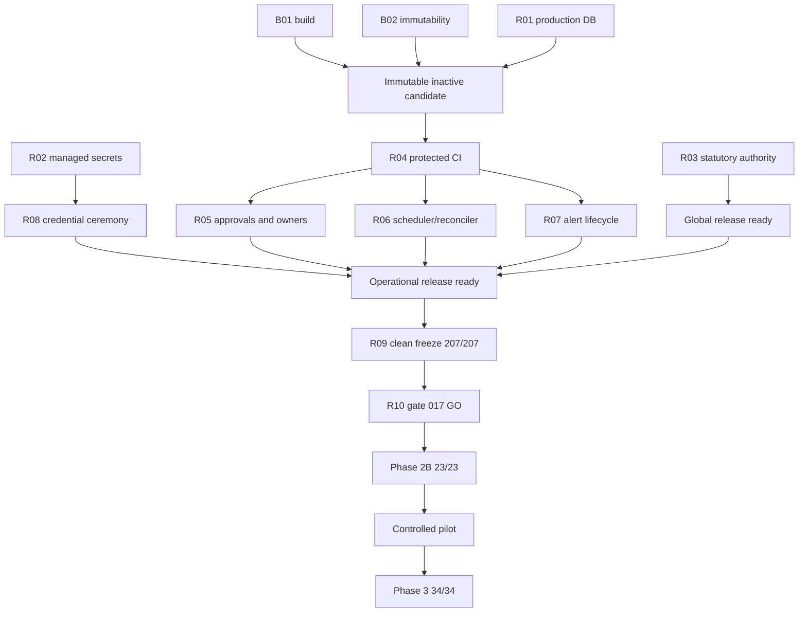

# Stoquify Agent Runtime Skill 017 Blocker Elimination and Phase 3 Entry Report

**Generated:** 2026-07-27T16:44:20.681Z  
**Decision:** `REJECTED_NO_GO`  
**Posture:** `DEVELOPMENT_CONTINUES_PILOT_AND_PRODUCTION_FAIL_CLOSED`  
**Activation authority:** false  
**Phase 3 authority:** false  
**GitHub/provider operations:** excluded by instruction

## Executive Decision

Skill 016 is ready at 15/15 and preserves read-only analysis plus non-executing proposal authority. Skill 017 remains correctly rejected. The headline failures are repetitive: 31 credential codes, 152 operational codes, 21 Phase 2B checks, and 34 Phase 3 checks collapse into twelve dependency roots. B01 application build and B02 payroll immutability are ready; B03-B12 remain open.

The next phase is a controlled release-evidence tranche, not Phase 3. Close production target/secrets and statutory authority; produce one immutable candidate; complete credentials and operations; freeze cleanly; obtain independent gate 017; then enter Phase 2B at 23/23. Phase 3 follows only after a successful bounded pilot and separate authority.

No placeholder, dry run, local database, inferred identity, generated approval, or synthetic hash may become authority.

## Current Snapshot

| Gate | Result | Interpretation |
|---|---:|---|
| Skill 016 | 15/15 | Read-only/proposal-only ready |
| B01-B12 | 2/12 | B01/B02 ready |
| Authorized scope | 36/37 | P2A-11 incomplete |
| Frozen manifest | 206/207 | 1 mismatch; 8 drift paths |
| Worktree snapshot | 470 changes | Active development, not candidate |
| Credential rotation | 31 blockers | Authority/binding/15 classes/approval |
| Operational release | 152 blockers | Seven repeated workstreams |
| Phase 2B | 2/23 | Not eligible |
| Phase 3 | 0/34 | Not eligible |
| External inputs | 1/13 | 102 raw blockers |
| Human interventions | 9 | Real owners/authorities required |

The companion JSON contains every raw blocker code and evidence path.

## Count Interpretation

- 206/207 plus eight drift paths is one stale-candidate problem.
- 36/37 with four blockers is four field assertions on P2A-11.
- 31 credentials = authority 8 + binding 6 + classifications 15 + ownership/approval 2.
- 152 operations = release/CI 29 + governance/owners 62 + scheduler 39 + alerting 17 + credential dependency 5.
- 21 Phase 2B checks are composition checks, not 21 features.
- 34 Phase 3 checks are those prerequisites plus thirteen pilot/authority checks.

## Dependency Graph

## B01-B12 Register

| ID | Gate | Status | Facts | Next action |
|---|---|---|---|---|
| B01 | Ready | READY | buildStatus=passed; buildExitCode=0 | Preserve and bind this evidence to the final candidate. |
| B02 | Ready | READY | triggers=9/9; blockedMutations=14/14 | Preserve and bind this evidence to the final candidate. |
| B03 | Blocked | BLOCKED_EXTERNAL_CONFIG | preflight=8/9; history=5/8; historyTarget=local | Provision the approved production target, deploy, and pass direct history health. |
| B04 | Blocked | BLOCKED_EXTERNAL_CONFIG | secretChecks=2/8 | Provision the three independent managed release secrets and rerun release preflight. |
| B05 | Blocked | REQUIRES_EXPERT_REVIEW | sourceHashes=0/7 | Return independently recomputed and checker-verified source hashes. |
| B06 | Blocked | REQUIRES_EXPERT_REVIEW | reviewChecks=4/12; approvalArtifactVerified=false | Return the authentic signed expert decision and separate checker verification. |
| B07 | Blocked | BLOCKED_DEPENDENCY | credentialStatus=BLOCKED; credentialBlockers=31 | After stable managed references exist, complete all credential dispositions and evidence. |
| B08 | Blocked | BLOCKED_DEPENDENCY | operationalStatus=BLOCKED; operationalBlockers=152 | Complete owner, scheduler, alert, CI, governance, and credential evidence. |
| B09 | Blocked | WAIT_FOR_STABLE_TREE | freezeStatus=BLOCKED; verifiedFiles=206/207; runtimeDrift=8 | After B01-B08 pass, cut a clean candidate and create a new immutable freeze. |
| B10 | Blocked | BLOCKED_DEPENDENCY | governanceBlockers=50; freezeReady=false | Bind real product/security approvals and six accepted owner assignments to the freeze. |
| B11 | Blocked | BLOCKED_DEPENDENCY | phase2b=2/23; eligible=false | After B01-B10 and gate 017 GO, rerun the 23-check entry gate. |
| B12 | Blocked | NOT_STARTED | phase3=0/34; eligible=false | After a successful pilot, obtain the artifact-bound 34-check Phase 3 decision. |

## Twelve Root Causes

### R01: Production database and migration history

- **Why:** No approved non-local PostgreSQL target is configured. Local dbakesman is quarantined with one unfinished migration, three missing repository migrations, and one checksum mismatch.
- **Owners:** Database Owner, Platform, Release Manager
- **Places:** what-next/prisma-migration-deployment-readiness.json; what-next/prisma-migration-history-health.json
- **Execution:** Provision approved target and restore proof; inject DATABASE_URL through managed deployment; run production preflight, deploy, then direct remote history health.
- **Acceptance:** 9/9 preflight; 8/8 remote history; no unfinished, missing, unknown, duplicate, or checksum findings.

### R02: Managed production secrets

- **Why:** Presence and strength checks fail for the identity HMAC, receipt signing, and history cursor secrets.
- **Owners:** Security, Platform
- **Places:** what-next/release-secret-preflight.json; scripts/release-secret-preflight.js:60
- **Execution:** Generate three purpose-specific managed values; prove strength, distinction, non-reuse, and rotation ownership.
- **Acceptance:** 8/8 release checks, enforcement on, no value printed.

### R03: Cameroon source and expert authority

- **Why:** Seven source hashes are unbound and no authentic qualified approval plus separate checker exists.
- **Owners:** OHADA Reviewer, Independent Checker, Payroll Product Owner
- **Places:** what-next/statutory-country-pack-review-preflight.json; what-next/statutory-country-pack-production-readiness.json
- **Execution:** Supply exact artifacts; recompute/bind all digests; record review decisions; separately verify signed approval.
- **Acceptance:** Review 12/12, production 12/12, hashes 7/7, approval verified.

### R04: Immutable release and protected CI

- **Why:** Package, commit, artifact, manifest, evidence bundle, browser report, CI run, and attestations are not bound to one inactive candidate.
- **Owners:** Engineering Release, QA, Platform
- **Places:** operational release register; release evidence index; agent-ci-release-evidence-capture.js
- **Execution:** Build from clean approved commit, publish inactive artifact, run protected CI and enabled-pilot Playwright, capture signed query-free evidence.
- **Acceptance:** All 29 release/CI codes clear and every digest binds to one identity.

### R05: Governance, approvals, and owners

- **Why:** No real product/security decisions or accepted primary/backup owners for six operational roles.
- **Owners:** Product, Security, Release Manager
- **Places:** operational release register; agent-governance-evidence-capture.js
- **Execution:** Bind distinct approvals and six primary/backup pairs to exact identity with runbook, escalation, acceptance, and coverage proof.
- **Acceptance:** All 62 governance/approval/owner codes clear.

### R06: Scheduler and reconciliation

- **Why:** No provider schedule, workload identity, readiness/heartbeat, deployment attestation, concurrency proof, or three successful windows.
- **Owners:** Platform, SRE, Reconciliation Owner, Security
- **Places:** agent-scheduler-deployment-evidence-capture.js; agent-reconciler-evidence-capture.js
- **Execution:** Deploy inactive workload at approved identity; configure five-minute cadence and lease; capture controls; observe three consecutive windows.
- **Acceptance:** All 39 scheduler codes clear; readiness fresh; three windows complete.

### R07: Alert lifecycle

- **Why:** HTTPS delivery, acknowledgement, retry, dead-letter, recovery, escalation, identities, and secret rotation are unproved.
- **Owners:** SRE, Security Incident Owner, On-call Backup
- **Places:** agent-alert-evidence-capture.js; agent-operational-release-gate.js:667
- **Execution:** Trigger controlled failure; prove SLO acknowledgement, retry, dead-letter, recovery, escalation, rotation, and old-version rejection.
- **Acceptance:** All 17 alerting codes clear and identities match owner registry.

### R08: Credential ceremony

- **Why:** Authority 8, binding 6, fifteen credential classifications, and security owner/approval 2 remain blocked.
- **Owners:** Security, Platform, Workload Owners
- **Places:** credential rotation register; agent-credential-rotation-gate.js:97
- **Execution:** Create stable binding; classify 15 classes; rotate/restart/verify/revoke/reject every present credential; attest independently.
- **Acceptance:** 31/31 codes clear, 15/15 classes resolved, no value serialized.

### R09: Stable tree and canonical freeze

- **Why:** Historical candidate is 206/207 with one mismatch and eight runtime drift paths; 470-change worktree is active development.
- **Owners:** Engineering Release, Agent Runtime Owner
- **Places:** freeze attestation; authorized-scope audit; agent-phase2a-freeze-commit-gate.js:217
- **Execution:** Review intended drift; finish R01-R08 against one identity; create clean checkout and exact manifest; rerun freeze and audit.
- **Acceptance:** 207/207, zero mismatch/drift, clean tree, FROZEN_COMMIT_VERIFIED, 37/37.

### R10: Independent Skill 017 authority

- **Why:** NO-GO is correct while R01-R09 remain incomplete; code cannot manufacture release authority.
- **Owners:** Enterprise Release Authority
- **Places:** enterprise blocker status; promotion ledger; Skill 017 contract
- **Execution:** Review one immutable bundle and record APPROVED_GO or REJECTED_NO_GO with identity, conditions, expiry, and reference.
- **Acceptance:** Independent artifact-bound GO; promotion points 1-11 correct.

### R11: Controlled Phase 2B pilot

- **Why:** Phase 2B is 2/23 and the pilot register is intentionally NOT_STARTED.
- **Owners:** Pilot, Product, Security, Finance Domain, Release
- **Places:** Phase 2B decision; pilot exit register; enabled-pilot E2E
- **Execution:** At 23/23 conduct separate allowlisted activation, preserve kill switch/no execution authority, observe pilot, test rollback, collect four distinct approvals.
- **Acceptance:** READY_FOR_PHASE3_REVIEW, zero prohibited violations, complete operations/incident evidence.

### R12: Phase 3 authority

- **Why:** All 34 checks are blocked and phase3Authorized is false.
- **Owners:** Enterprise Release Authority, Product, Security, Finance Domain
- **Places:** Phase 3 decision; promotion ledger; agent-phase-promotion-gate.js:80
- **Execution:** After pilot exit rerun 34 checks, obtain separate GO, record points 12/13, begin read-and-draft only.
- **Acceptance:** 34/34 and independently recorded authority; gate grants no execution authority.

## Exact Freeze Blockers

- `FREEZE_COMMIT_CONTENT_MISMATCH:components/agents/__tests__/AgentCommandPanel.test.tsx`
- `POST_FREEZE_RUNTIME_DRIFT:actions/agents/__tests__/command-agent.actions.test.ts`
- `POST_FREEZE_RUNTIME_DRIFT:actions/agents/command-agent.actions.ts`
- `POST_FREEZE_RUNTIME_DRIFT:components/agents/AgentCommandPanel.tsx`
- `POST_FREEZE_RUNTIME_DRIFT:components/agents/__tests__/AgentCommandPanel.test.tsx`
- `POST_FREEZE_RUNTIME_DRIFT:prisma/schema.prisma`
- `POST_FREEZE_RUNTIME_DRIFT:services/agents/__tests__/agent-output-validator.service.test.ts`
- `POST_FREEZE_RUNTIME_DRIFT:services/agents/command-agent-contracts.ts`
- `POST_FREEZE_RUNTIME_DRIFT:services/agents/skills/role-daily-brief.skill.ts`

### Eight Runtime Drift Paths

- `actions/agents/__tests__/command-agent.actions.test.ts`
- `actions/agents/command-agent.actions.ts`
- `components/agents/AgentCommandPanel.tsx`
- `components/agents/__tests__/AgentCommandPanel.test.tsx`
- `prisma/schema.prisma`
- `services/agents/__tests__/agent-output-validator.service.test.ts`
- `services/agents/command-agent-contracts.ts`
- `services/agents/skills/role-daily-brief.skill.ts`

Review and deliberately accept or remove these paths. Do not blindly revert concurrent user work.

## Authorized Scope Mismatch

- **P2A-11 Frozen commit attestation:** `P2A-11:JSON_FIELD_MISMATCH:freezeAttestation:status`, `P2A-11:JSON_FIELD_MISMATCH:freezeAttestation:freezeVerified`, `P2A-11:JSON_FIELD_MISMATCH:freezeAttestation:summary.contentMismatches`, `P2A-11:JSON_FIELD_MISMATCH:freezeAttestation:summary.phase2aRuntimeDrift`.

These four assertions represent one stale freeze requirement.

## Credential Blockers: All 31

### `authority` (8)

- `authority:ENVIRONMENT_MISSING`
- `authority:SOURCE_SYSTEM_REFERENCE_MISSING`
- `authority:ATTESTATION_REFERENCE_MISSING`
- `authority:ATTESTATION_DIGEST_MISSING`
- `authority:ATTESTED_AT_MISSING`
- `authority:EVIDENCE_SHA256_MISSING`
- `authority:INVALID_AUTH_EVIDENCE_REFERENCE_MISSING`
- `authority:ATTESTED_AT_INVALID_OR_STALE`

### `releaseBinding` (6)

- `releaseBinding:ENVIRONMENT_MISSING`
- `releaseBinding:PACKAGE_ID_MISSING`
- `releaseBinding:RELEASE_VERSION_MISSING`
- `releaseBinding:COMMIT_SHA_MISSING`
- `releaseBinding:ARTIFACT_DIGEST_MISSING`
- `releaseBinding:DEPLOYMENT_REFERENCE_MISSING`

### `primary-database-credential` (1)

- `primary-database-credential:SECURITY_CLASSIFICATION_UNRESOLVED`

### `payroll-immutability-database-credential` (1)

- `payroll-immutability-database-credential:SECURITY_CLASSIFICATION_UNRESOLVED`

### `application-auth-signing-secret` (1)

- `application-auth-signing-secret:SECURITY_CLASSIFICATION_UNRESOLVED`

### `legacy-nextauth-signing-secret` (1)

- `legacy-nextauth-signing-secret:SECURITY_CLASSIFICATION_UNRESOLVED`

### `google-oauth-client-secret` (1)

- `google-oauth-client-secret:SECURITY_CLASSIFICATION_UNRESOLVED`

### `email-server-credential` (1)

- `email-server-credential:SECURITY_CLASSIFICATION_UNRESOLVED`

### `redis-connection-credential` (1)

- `redis-connection-credential:SECURITY_CLASSIFICATION_UNRESOLVED`

### `public-identity-hmac-secret` (1)

- `public-identity-hmac-secret:SECURITY_CLASSIFICATION_UNRESOLVED`

### `public-receipt-signing-secret` (1)

- `public-receipt-signing-secret:SECURITY_CLASSIFICATION_UNRESOLVED`

### `history-cursor-signing-secret` (1)

- `history-cursor-signing-secret:SECURITY_CLASSIFICATION_UNRESOLVED`

### `payroll-destination-hmac-secret` (1)

- `payroll-destination-hmac-secret:SECURITY_CLASSIFICATION_UNRESOLVED`

### `upload-provider-secret` (1)

- `upload-provider-secret:SECURITY_CLASSIFICATION_UNRESOLVED`

### `error-monitoring-dsn` (1)

- `error-monitoring-dsn:SECURITY_CLASSIFICATION_UNRESOLVED`

### `agent-reconciler-credential` (1)

- `agent-reconciler-credential:SECURITY_CLASSIFICATION_UNRESOLVED`

### `workflow-assurance-webhook-secret` (1)

- `workflow-assurance-webhook-secret:SECURITY_CLASSIFICATION_UNRESOLVED`

### `register` (2)

- `register:SECURITY_OWNER_MISSING`
- `register:SECURITY_APPROVAL_REFERENCE_MISSING`

## Operational Blockers: All 152

### `release` (14)

- `release:PACKAGE_ID_MISSING`
- `release:RELEASE_VERSION_MISSING`
- `release:DEPLOYMENT_REFERENCE_MISSING`
- `release:ARTIFACT_REFERENCE_MISSING`
- `release:PACKAGE_CERTIFICATION_REFERENCE_MISSING`
- `release:PILOT_ALLOWLIST_REFERENCE_MISSING`
- `release:ROLE_ALLOWLIST_REFERENCE_MISSING`
- `release:COMMIT_SHA_INVALID`
- `release:ARTIFACT_DIGEST_INVALID`
- `release:PACKAGE_CERTIFICATION_HASH_INVALID`
- `release:CI_EVIDENCE_HASH_INVALID`
- `release:MANIFEST_HASH_INVALID`
- `release:EVIDENCE_BUNDLE_HASH_INVALID`
- `release:BROWSER_REPORT_HASH_INVALID`

### `ci` (15)

- `ci:STATUS_NOT_PASSED`
- `ci:SOURCE_TREE_NOT_CLEAN`
- `ci:RUN_REFERENCE_MISSING`
- `ci:BRANCH_REFERENCE_MISSING`
- `ci:ARTIFACT_REFERENCE_MISSING`
- `ci:SOURCE_SYSTEM_REFERENCE_MISSING`
- `ci:ATTESTATION_REFERENCE_MISSING`
- `ci:INVALID_AUTH_EVIDENCE_REFERENCE_MISSING`
- `ci:COMMIT_SHA_INVALID`
- `ci:ARTIFACT_DIGEST_INVALID`
- `ci:BROWSER_REPORT_HASH_INVALID`
- `ci:ATTESTATION_DIGEST_INVALID`
- `ci:EVIDENCE_HASH_INVALID`
- `ci:COMPLETED_AT_INVALID`
- `ci:ATTESTED_AT_INVALID`

### `governance` (12)

- `governance:SOURCE_SYSTEM_REFERENCE_MISSING`
- `governance:ATTESTATION_REFERENCE_MISSING`
- `governance:INVALID_AUTH_EVIDENCE_REFERENCE_MISSING`
- `governance:ATTESTATION_DIGEST_INVALID`
- `governance:EVIDENCE_HASH_INVALID`
- `governance:ATTESTED_AT_INVALID`
- `governance:PACKAGE_ID_MISSING`
- `governance:RELEASE_VERSION_MISSING`
- `governance:COMMIT_SHA_INVALID`
- `governance:ARTIFACT_DIGEST_INVALID`
- `governance:MANIFEST_HASH_INVALID`
- `governance:EVIDENCE_BUNDLE_HASH_INVALID`

### `approvals` (14)

- `approvals:PRODUCT_NOT_APPROVED`
- `approvals:PRODUCT_ACTOR_INVALID`
- `approvals:PRODUCT_REFERENCE_MISSING`
- `approvals:PRODUCT_WINDOW_INVALID`
- `approvals:PRODUCT_MANIFEST_HASH_INVALID`
- `approvals:PRODUCT_ARTIFACT_DIGEST_INVALID`
- `approvals:PRODUCT_EVIDENCE_BUNDLE_HASH_INVALID`
- `approvals:SECURITY_NOT_APPROVED`
- `approvals:SECURITY_ACTOR_INVALID`
- `approvals:SECURITY_REFERENCE_MISSING`
- `approvals:SECURITY_WINDOW_INVALID`
- `approvals:SECURITY_MANIFEST_HASH_INVALID`
- `approvals:SECURITY_ARTIFACT_DIGEST_INVALID`
- `approvals:SECURITY_EVIDENCE_BUNDLE_HASH_INVALID`

### `owners` (36)

- `owners:ROLLOUT_PRIMARY_INVALID`
- `owners:ROLLOUT_BACKUP_INVALID`
- `owners:ROLLOUT_RUNBOOK_MISSING`
- `owners:ROLLOUT_ESCALATION_REFERENCE_MISSING`
- `owners:ROLLOUT_ACCEPTED_AT_INVALID`
- `owners:ROLLOUT_WINDOW_INVALID`
- `owners:ROLLBACK_PRIMARY_INVALID`
- `owners:ROLLBACK_BACKUP_INVALID`
- `owners:ROLLBACK_RUNBOOK_MISSING`
- `owners:ROLLBACK_ESCALATION_REFERENCE_MISSING`
- `owners:ROLLBACK_ACCEPTED_AT_INVALID`
- `owners:ROLLBACK_WINDOW_INVALID`
- `owners:SUPPORT_PRIMARY_INVALID`
- `owners:SUPPORT_BACKUP_INVALID`
- `owners:SUPPORT_RUNBOOK_MISSING`
- `owners:SUPPORT_ESCALATION_REFERENCE_MISSING`
- `owners:SUPPORT_ACCEPTED_AT_INVALID`
- `owners:SUPPORT_WINDOW_INVALID`
- `owners:PILOT_PRIMARY_INVALID`
- `owners:PILOT_BACKUP_INVALID`
- `owners:PILOT_RUNBOOK_MISSING`
- `owners:PILOT_ESCALATION_REFERENCE_MISSING`
- `owners:PILOT_ACCEPTED_AT_INVALID`
- `owners:PILOT_WINDOW_INVALID`
- `owners:SECURITY_INCIDENT_PRIMARY_INVALID`
- `owners:SECURITY_INCIDENT_BACKUP_INVALID`
- `owners:SECURITY_INCIDENT_RUNBOOK_MISSING`
- `owners:SECURITY_INCIDENT_ESCALATION_REFERENCE_MISSING`
- `owners:SECURITY_INCIDENT_ACCEPTED_AT_INVALID`
- `owners:SECURITY_INCIDENT_WINDOW_INVALID`
- `owners:ON_CALL_BACKUP_PRIMARY_INVALID`
- `owners:ON_CALL_BACKUP_BACKUP_INVALID`
- `owners:ON_CALL_BACKUP_RUNBOOK_MISSING`
- `owners:ON_CALL_BACKUP_ESCALATION_REFERENCE_MISSING`
- `owners:ON_CALL_BACKUP_ACCEPTED_AT_INVALID`
- `owners:ON_CALL_BACKUP_WINDOW_INVALID`

### `scheduler` (39)

- `scheduler:PROVIDER_MISSING`
- `scheduler:SCHEDULE_REFERENCE_MISSING`
- `scheduler:WORKLOAD_REFERENCE_MISSING`
- `scheduler:MANAGED_CREDENTIAL_REFERENCE_MISSING`
- `scheduler:CONCURRENCY_EVIDENCE_REFERENCE_MISSING`
- `scheduler:READINESS_EVIDENCE_REFERENCE_MISSING`
- `scheduler:INVALID_AUTH_EVIDENCE_REFERENCE_MISSING`
- `scheduler:MISSING_CONFIG_EVIDENCE_REFERENCE_MISSING`
- `scheduler:FAILURE_ALERT_REFERENCE_MISSING`
- `scheduler:DEPLOYMENT_SOURCE_SYSTEM_REFERENCE_MISSING`
- `scheduler:DEPLOYMENT_ATTESTATION_REFERENCE_MISSING`
- `scheduler:DEPLOYMENT_AUTHORITY_INVALID_AUTH_EVIDENCE_REFERENCE_MISSING`
- `scheduler:READINESS_EVIDENCE_HASH_INVALID`
- `scheduler:DEPLOYMENT_ATTESTATION_DIGEST_INVALID`
- `scheduler:DEPLOYMENT_EVIDENCE_HASH_INVALID`
- `scheduler:AUTH_TYPE_INVALID`
- `scheduler:DEPLOYED_COMMIT_SHA_INVALID`
- `scheduler:DEPLOYED_ARTIFACT_DIGEST_INVALID`
- `scheduler:DEPLOYED_AT_INVALID`
- `scheduler:DEPLOYMENT_ATTESTED_AT_INVALID`
- `scheduler:READINESS_NOT_HEALTHY`
- `scheduler:READINESS_CHECKED_AT_INVALID`
- `scheduler:HEARTBEAT_NOT_FRESH`
- `scheduler:WINDOW_1_RUN_ID_MISSING`
- `scheduler:WINDOW_1_EVIDENCE_REFERENCE_MISSING`
- `scheduler:WINDOW_1_NOT_COMPLETED`
- `scheduler:WINDOW_1_SCHEDULED_AT_INVALID`
- `scheduler:WINDOW_1_COMPLETED_AT_INVALID`
- `scheduler:WINDOW_2_RUN_ID_MISSING`
- `scheduler:WINDOW_2_EVIDENCE_REFERENCE_MISSING`
- `scheduler:WINDOW_2_NOT_COMPLETED`
- `scheduler:WINDOW_2_SCHEDULED_AT_INVALID`
- `scheduler:WINDOW_2_COMPLETED_AT_INVALID`
- `scheduler:WINDOW_3_RUN_ID_MISSING`
- `scheduler:WINDOW_3_EVIDENCE_REFERENCE_MISSING`
- `scheduler:WINDOW_3_NOT_COMPLETED`
- `scheduler:WINDOW_3_SCHEDULED_AT_INVALID`
- `scheduler:WINDOW_3_COMPLETED_AT_INVALID`
- `scheduler:THREE_SUCCESS_WINDOWS_MISSING`

### `alerting` (17)

- `alerting:TRANSPORT_NOT_HEALTHY`
- `alerting:EVIDENCE_HASH_INVALID`
- `alerting:TRANSPORT_REFERENCE_MISSING`
- `alerting:MANAGED_SECRET_REFERENCE_MISSING`
- `alerting:HTTPS_DELIVERY_REFERENCE_MISSING`
- `alerting:EXTERNAL_REQUEST_REFERENCE_MISSING`
- `alerting:ACKNOWLEDGEMENT_REFERENCE_MISSING`
- `alerting:RETRY_EVIDENCE_REFERENCE_MISSING`
- `alerting:DEAD_LETTER_EVIDENCE_REFERENCE_MISSING`
- `alerting:RECOVERY_EVIDENCE_REFERENCE_MISSING`
- `alerting:ESCALATION_EVIDENCE_REFERENCE_MISSING`
- `alerting:SECRET_ROTATION_EVIDENCE_REFERENCE_MISSING`
- `alerting:DELIVERED_AT_INVALID`
- `alerting:ACKNOWLEDGED_AT_INVALID`
- `alerting:ESCALATION_TESTED_AT_INVALID`
- `alerting:ACKNOWLEDGER_IDENTITY_INVALID`
- `alerting:ESCALATION_IDENTITY_INVALID`

### `credentialRotation` (5)

- `credentialRotation:REGISTER_HASH_INVALID`
- `credentialRotation:SECURITY_APPROVAL_REFERENCE_MISSING`
- `credentialRotation:EVIDENCE_HASH_INVALID`
- `credentialRotation:ATTESTATION_REFERENCE_MISSING`
- `credentialRotation:CREDENTIAL_REGISTER_BLOCKED`

## Phase 2B: All 21 Failed Checks

| Check | Meaning | Evidence |
|---|---|---|
| `AUTHORIZED_SCOPE_COMPLETE` | All authorized repository requirements pass | `docs/agents-runtime/STOQUIFY_AGENT_RUNTIME_AUTHORIZED_SCOPE_REQUIREMENTS_AUDIT_2026-07-25.json` |
| `FROZEN_COMMIT_VERIFIED` | Phase 2A frozen commit remains verified | `docs/agents-runtime/STOQUIFY_AGENT_RUNTIME_PHASE_2A_FREEZE_COMMIT_ATTESTATION_2026-07-25.json` |
| `CLEAN_RELEASE_READY` | Frozen release has clean release identity | `docs/agents-runtime/STOQUIFY_AGENT_RUNTIME_PHASE_2A_FREEZE_COMMIT_ATTESTATION_2026-07-25.json` |
| `GLOBAL_RELEASE_READY` | Global release evidence has no release blockers | `what-next/skills-life-cycle/stoquify-ohada-leadership-release-evidence-index-2026-07-11.json` |
| `PRODUCTION_SECRETS_READY` | Production-purpose secret preflight is ready | `what-next/release-secret-preflight.json` |
| `MIGRATION_TARGET_READY` | Migration and non-local database target are ready | `what-next/prisma-migration-deployment-readiness.json` |
| `STATUTORY_AUTHORITY_READY` | Statutory source and expert evidence are ready | `what-next/statutory-country-pack-production-readiness.json` |
| `CREDENTIAL_ROTATION_READY` | Credential rotation register is ready | `docs/agents-runtime/STOQUIFY_AGENT_RUNTIME_CREDENTIAL_ROTATION_REGISTER_2026-07-25.json` |
| `OPERATIONAL_RELEASE_READY` | Operational release is ready for independent review | `docs/agents-runtime/STOQUIFY_AGENT_RUNTIME_OPERATIONAL_RELEASE_EVIDENCE_2026-07-25.json` |
| `PROMOTION_POINT_1_REVIEW_ACCEPTED` | Promotion point 1 is REVIEW_ACCEPTED | `docs/agents-runtime/STOQUIFY_AGENT_RUNTIME_PHASE_3_PROMOTION_LEDGER_2026-07-25.json` |
| `PROMOTION_POINT_2_COMPLETED` | Promotion point 2 is COMPLETED | `docs/agents-runtime/STOQUIFY_AGENT_RUNTIME_PHASE_3_PROMOTION_LEDGER_2026-07-25.json` |
| `PROMOTION_POINT_3_COMPLETED` | Promotion point 3 is COMPLETED | `docs/agents-runtime/STOQUIFY_AGENT_RUNTIME_PHASE_3_PROMOTION_LEDGER_2026-07-25.json` |
| `PROMOTION_POINT_4_COMPLETED` | Promotion point 4 is COMPLETED | `docs/agents-runtime/STOQUIFY_AGENT_RUNTIME_PHASE_3_PROMOTION_LEDGER_2026-07-25.json` |
| `PROMOTION_POINT_5_COMPLETED` | Promotion point 5 is COMPLETED | `docs/agents-runtime/STOQUIFY_AGENT_RUNTIME_PHASE_3_PROMOTION_LEDGER_2026-07-25.json` |
| `PROMOTION_POINT_6_COMPLETED` | Promotion point 6 is COMPLETED | `docs/agents-runtime/STOQUIFY_AGENT_RUNTIME_PHASE_3_PROMOTION_LEDGER_2026-07-25.json` |
| `PROMOTION_POINT_7_COMPLETED` | Promotion point 7 is COMPLETED | `docs/agents-runtime/STOQUIFY_AGENT_RUNTIME_PHASE_3_PROMOTION_LEDGER_2026-07-25.json` |
| `PROMOTION_POINT_8_COMPLETED` | Promotion point 8 is COMPLETED | `docs/agents-runtime/STOQUIFY_AGENT_RUNTIME_PHASE_3_PROMOTION_LEDGER_2026-07-25.json` |
| `PROMOTION_POINT_9_COMPLETED` | Promotion point 9 is COMPLETED | `docs/agents-runtime/STOQUIFY_AGENT_RUNTIME_PHASE_3_PROMOTION_LEDGER_2026-07-25.json` |
| `PROMOTION_POINT_10_COMPLETED` | Promotion point 10 is COMPLETED | `docs/agents-runtime/STOQUIFY_AGENT_RUNTIME_PHASE_3_PROMOTION_LEDGER_2026-07-25.json` |
| `PROMOTION_POINT_11_APPROVED_GO` | Promotion point 11 is APPROVED_GO | `docs/agents-runtime/STOQUIFY_AGENT_RUNTIME_PHASE_3_PROMOTION_LEDGER_2026-07-25.json` |
| `ENTERPRISE_GATE_017_GO` | Enterprise gate 017 records approved GO | `docs/agents-runtime/STOQUIFY_AGENT_RUNTIME_PHASE_3_PROMOTION_LEDGER_2026-07-25.json` |

### Phase 2B Contract

1. Close R01-R08 with authentic evidence.
2. Produce R09: 207/207, zero drift, 37/37.
3. Obtain R10 independent GO.
4. Run `npm run agent:phase2b:entry:gate`; require 23/23.
5. Conduct a separate allowlisted activation ceremony.
6. Preserve kill switch, tenant scope, RBAC, fresh auth, audit, outbox, and no execution authority.
7. Run and certify the bounded pilot.

## Phase 3: All 34 Failed Checks

The first 21 repeat Phase 2B prerequisites. The additional thirteen are:

- `PILOT_EXIT_STATUS_READY`: Pilot exit register is ready for Phase 3 review (`docs/agents-runtime/STOQUIFY_AGENT_RUNTIME_PHASE_2B_PILOT_EXIT_REGISTER_2026-07-25.json`)
- `PILOT_RELEASE_BINDING`: Pilot exit evidence is bound to commit, artifact, and evidence bundle (`docs/agents-runtime/STOQUIFY_AGENT_RUNTIME_PHASE_2B_PILOT_EXIT_REGISTER_2026-07-25.json`)
- `PILOT_SCOPE_AND_ACTIVATION_EVIDENCE`: Pilot has activation reference and hashed tenant/role scope (`docs/agents-runtime/STOQUIFY_AGENT_RUNTIME_PHASE_2B_PILOT_EXIT_REGISTER_2026-07-25.json`)
- `PILOT_OBSERVATION_COMPLETE`: Pilot has a bounded completed observation window and successful runs (`docs/agents-runtime/STOQUIFY_AGENT_RUNTIME_PHASE_2B_PILOT_EXIT_REGISTER_2026-07-25.json`)
- `PILOT_SAFETY_CLEAN`: Pilot records zero authority, tenant, execution, and secret violations (`docs/agents-runtime/STOQUIFY_AGENT_RUNTIME_PHASE_2B_PILOT_EXIT_REGISTER_2026-07-25.json`)
- `PILOT_OPERATIONS_EVIDENCE`: Pilot monitoring, support, rollback, and incident evidence are complete (`docs/agents-runtime/STOQUIFY_AGENT_RUNTIME_PHASE_2B_PILOT_EXIT_REGISTER_2026-07-25.json`)
- `PILOT_INCIDENTS_CLEAN`: Pilot has zero critical, high, and unresolved incidents (`docs/agents-runtime/STOQUIFY_AGENT_RUNTIME_PHASE_2B_PILOT_EXIT_REGISTER_2026-07-25.json`)
- `PILOT_EXIT_APPROVALS`: Product, security, finance-domain, and release approvals are complete (`docs/agents-runtime/STOQUIFY_AGENT_RUNTIME_PHASE_2B_PILOT_EXIT_REGISTER_2026-07-25.json`)
- `PILOT_APPROVER_SEGREGATION`: Pilot exit approvers are four distinct directory identities (`docs/agents-runtime/STOQUIFY_AGENT_RUNTIME_PHASE_2B_PILOT_EXIT_REGISTER_2026-07-25.json`)
- `PILOT_PHASE3_RECOMMENDATION`: Pilot exit register recommends Phase 3 without self-authorizing it (`docs/agents-runtime/STOQUIFY_AGENT_RUNTIME_PHASE_2B_PILOT_EXIT_REGISTER_2026-07-25.json`)
- `PHASE2B_PILOT_COMPLETED`: Promotion point 12 records completed Phase 2B pilot (`docs/agents-runtime/STOQUIFY_AGENT_RUNTIME_PHASE_3_PROMOTION_LEDGER_2026-07-25.json`)
- `PHASE3_GO_APPROVED`: Promotion point 13 records approved Phase 3 GO (`docs/agents-runtime/STOQUIFY_AGENT_RUNTIME_PHASE_3_PROMOTION_LEDGER_2026-07-25.json`)
- `PHASE3_AUTHORITY_RECORDED`: Authoritative promotion ledger records Phase 3 authority (`docs/agents-runtime/STOQUIFY_AGENT_RUNTIME_PHASE_3_PROMOTION_LEDGER_2026-07-25.json`)

Phase 3 eligibility does not grant authority. Initial Phase 3 remains read-and-draft. Direct Prisma writes, ledger posting, payment, payroll execution, filing, approval, reversal, certification, role/permission, and entitlement changes remain prohibited.

## Human Intervention Workstreams

| Workstream | Owners | Raw count | Command |
|---|---|---:|---|
| Immutable release and protected CI evidence | ENGINEERING_RELEASE, QA, PLATFORM | 29 | `npm run agent:ci-release:evidence:apply` |
| Product/security approval and operational ownership | PRODUCT, SECURITY, RELEASE_MANAGER | 62 | `npm run agent:governance:evidence:apply` |
| Managed scheduler and inactive reconciler deployment | PLATFORM, SRE, SECURITY | 39 | `npm run agent:scheduler:evidence:apply` |
| Three consecutive reconciliation windows | SRE, RECONCILIATION_OWNER | 20 | `npm run agent:reconciler:evidence:apply` |
| Production-like alert lifecycle | SRE, SECURITY_INCIDENT, ON_CALL_BACKUP | 17 | `npm run agent:alert:evidence:apply` |
| Credential classification, rotation, and revocation | SECURITY, PLATFORM, WORKLOAD_OWNERS | 31 | `npm run agent:credential-rotation:evidence:apply && npm run agent:credential-rotation:gate` |
| Statutory authority and global release preflight | OHADA_DOMAIN_REVIEWER, DATABASE_OWNER, SECURITY, RELEASE_MANAGER | 4 | `npm run statutory:country-pack:gate && npm run prisma:migration:release:preflight && npm run release:secrets:preflight:release && npm run release:evidence:gate:release` |
| Independent enterprise release decision | ENTERPRISE_RELEASE_AUTHORITY | 1 | `Rerun 017-aqstoqflow-enterprise-release-gate` |
| Controlled Phase 2B pilot and exit certification | PILOT, PRODUCT, SECURITY, FINANCE_DOMAIN, RELEASE | 34 | `npm run agent:phase3:entry:report` |

Counts overlap by design: reconciler windows are a focused subset of scheduler codes.

## Repository Work Executed

1. **Canonical B09 freeze contract:** `scripts/enterprise-release-blocker-status.js:289` now requires `FROZEN_COMMIT_VERIFIED`; a regression test rejects generic `READY`.
2. **Reliable phase-decision writes:** `scripts/agent-phase-promotion-gate.js:80` now retries transient evidence contention with bounded backoff. The initially failed Phase 3 write exposed this weakness; later Phase 2B and Phase 3 writes succeeded.
3. **Evidence regeneration:** migration, history, secrets, statutory, release index, freeze, audit, credentials, operations, Phase 2B, Phase 3, external input, human intervention, and B01-B12 reports were recomputed in order.

These fixes weaken no security, tenant, accounting, statutory, or authority control.

## Ordered Roadmap

### Tranche 1: External Prerequisites

Execute R01-R03. Database/secrets may run in parallel with qualified review. Never use local dbakesman as release evidence.

### Tranche 2: Candidate And CI

Stabilize intended runtime paths, select one commit, build inactive artifact, run protected CI and enabled-pilot certification, bind every hash/reference.

### Tranche 3: Credentials And Operations

Run R08, then R05-R07. Preparation may overlap, but final attestations bind to the exact candidate.

### Tranche 4: Freeze And Enterprise Review

Produce R09, assemble one immutable bundle, and run R10. Record no GO unless independently approved.

### Tranche 5: Phase 2B Pilot

Require 23/23, perform separate activation, run allowlisted pilot, observe operations, test rollback, obtain segregated exit approvals.

### Tranche 6: Phase 3

Require 34/34 and separately recorded authority. Begin read-and-draft only.

## Preventing Subsequent Blockers

- Use one immutable `releaseBinding` as the foreign key for all evidence.
- Capture signed query-free provider/OIDC attestations; never paste secrets into JSON.
- Automate expiry/recapture for approvals, heartbeat, readiness, and attestations.
- Use a clean release checkout separate from active development.
- Continuously validate owner, runbook, and coverage readiness.
- Rerun composition reports after each source gate; never edit ledgers to force green.
- Generate pilot exit from runtime evidence and distinct signed decisions.
- Invalidate promotion on commit, artifact, manifest, bundle, allowlist, or policy drift.
- Preserve tenant, period, as-of, sources, completed-run, TTL, RBAC, fresh-auth, and no-execution provenance.

## Verification

| Verification | Result |
|---|---|
| Skill 016 | 15/15 passed |
| Focused tests | 20/20 passed direct serial Jest with open-handle detection |
| Scoped ESLint | Passed |
| Node syntax | Passed |
| Phase 2B writer | Succeeded; correctly blocked 2/23 |
| Phase 3 writer | Succeeded; correctly blocked 0/34 |
| Enterprise fail gate | Expected exit 1; blocked 2/12 |
| TypeScript | Inconclusive: process terminated after about six minutes without diagnostic |
| Secrets/activation/Phase 3 authority | None printed/attempted/granted |

The edits are JavaScript gate code and passed focused tests, syntax, and scoped lint. TypeScript is not labeled failed because no compiler diagnostic returned.

## Architecture Evidence Note

`graphify-out/GRAPH_REPORT.md` was rebuilt 2026-06-14 with 4,121 nodes in 135 communities. It predates July agent-runtime work and has no searchable current runtime nodes. It is historical context, not release authority; current gate scripts and JSON control.

## Formal Skill 017 Result

**REJECTED / NO-GO.** B01/B02 are ready. Production target, secrets, statutory authority, credentials, operations, freeze, governance, Phase 2B, and Phase 3 remain blocked. Activation and Phase 3 authority remain false.

Remain on `017-aqstoqflow-enterprise-release-gate` until R01-R10 close. The next execution target is Phase 2B entry, not Phase 3.

## Evidence Sources

- `what-next/enterprise-release-blocker-status.json`
- `docs/agents-runtime/STOQUIFY_AGENT_RUNTIME_PHASE_2A_FREEZE_COMMIT_ATTESTATION_2026-07-25.json`
- `docs/agents-runtime/STOQUIFY_AGENT_RUNTIME_AUTHORIZED_SCOPE_REQUIREMENTS_AUDIT_2026-07-25.json`
- `docs/agents-runtime/STOQUIFY_AGENT_RUNTIME_CREDENTIAL_ROTATION_REGISTER_2026-07-25.json`
- `docs/agents-runtime/STOQUIFY_AGENT_RUNTIME_OPERATIONAL_RELEASE_EVIDENCE_2026-07-25.json`
- `docs/agents-runtime/STOQUIFY_AGENT_RUNTIME_PHASE_2B_ENTRY_DECISION_2026-07-25.json`
- `docs/agents-runtime/STOQUIFY_AGENT_RUNTIME_PHASE_3_ENTRY_DECISION_2026-07-25.json`
- `docs/agents-runtime/STOQUIFY_AGENT_RUNTIME_EXTERNAL_INPUT_READINESS_2026-07-25.json`
- `docs/agents-runtime/STOQUIFY_AGENT_RUNTIME_HUMAN_INTERVENTION_PLAN_2026-07-25.json`
- `what-next/skills-life-cycle/stoquify-ohada-leadership-release-evidence-index-2026-07-11.json`
