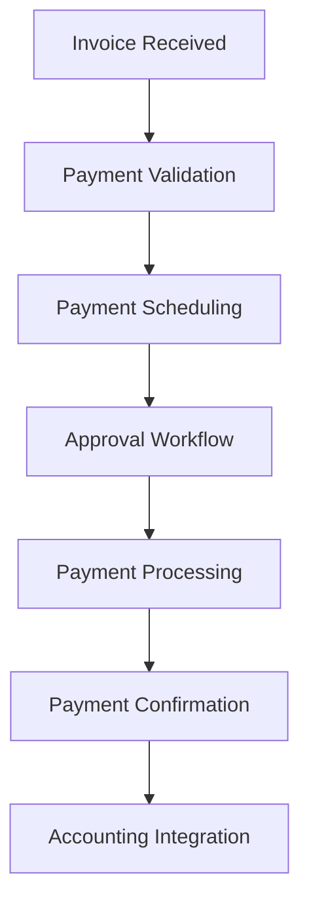

# Retail Finance System - Comprehensive Analysis & Documentation

## Table of Contents
1. [System Overview](#system-overview)
2. [Architecture & Design](#architecture--design)
3. [Module Breakdown](#module-breakdown)
4. [User Interface Analysis](#user-interface-analysis)
5. [Data Models & Analytics](#data-models--analytics)
6. [Integration Points](#integration-points)
7. [Security & Permissions](#security--permissions)
8. [Performance Considerations](#performance-considerations)
9. [Future Enhancements](#future-enhancements)
10. [Implementation Guidelines](#implementation-guidelines)

---

## System Overview

### Purpose
The Retail Finance System is a comprehensive financial management solution designed specifically for retail businesses. It provides real-time financial analytics, cost management, profitability analysis, and cash flow management capabilities.

### Key Objectives
- **Financial Visibility**: Provide real-time insights into financial performance
- **Cost Optimization**: Identify cost reduction opportunities and track expenses
- **Profitability Analysis**: Analyze profit margins across products, categories, and customer segments
- **Cash Flow Management**: Monitor receivables, payables, and working capital
- **Decision Support**: Enable data-driven financial decisions

### Core Value Propositions
1. **Integrated Analytics**: Unified view of all financial metrics
2. **Real-time Reporting**: Live data updates for immediate insights
3. **Multi-dimensional Analysis**: Product, category, customer, and time-based views
4. **Actionable Insights**: Specific recommendations for financial optimization
5. **Scalable Architecture**: Supports growth from small to enterprise-level operations

---

## Architecture & Design

### System Architecture

```
┌─────────────────────────────────────────────────────────────┐
│                    Presentation Layer                       │
├─────────────────────────────────────────────────────────────┤
│  • React Components (Client-side)                          │
│  • Server Components (Server-side)                         │
│  • UI Libraries (Tailwind CSS, Lucide Icons)              │
└─────────────────────────────────────────────────────────────┘
                                │
┌─────────────────────────────────────────────────────────────┐
│                    Business Logic Layer                     │
├─────────────────────────────────────────────────────────────┤
│  • Financial Analytics Actions                             │
│  • Cost Analysis Services                                  │
│  • Profitability Calculators                              │
│  • Report Generation Services                              │
└─────────────────────────────────────────────────────────────┘
                                │
┌─────────────────────────────────────────────────────────────┐
│                    Data Access Layer                        │
├─────────────────────────────────────────────────────────────┤
│  • Prisma ORM                                             │
│  • Database Queries & Aggregations                         │
│  • Real-time Data Synchronization                          │
└─────────────────────────────────────────────────────────────┘
                                │
┌─────────────────────────────────────────────────────────────┐
│                    Database Layer                           │
├─────────────────────────────────────────────────────────────┤
│  • PostgreSQL/MySQL Database                              │
│  • Financial Data Tables                                   │
│  • Audit & History Tables                                  │
└─────────────────────────────────────────────────────────────┘
```

### Technology Stack

#### Frontend
- **Framework**: Next.js 14 with React 18
- **Styling**: Tailwind CSS with custom components
- **Icons**: Lucide React
- **State Management**: React Hooks & Context
- **TypeScript**: Full type safety

#### Backend
- **Runtime**: Node.js
- **Framework**: Next.js API Routes
- **ORM**: Prisma
- **Authentication**: NextAuth.js
- **Validation**: Zod schemas

#### Database
- **Primary**: PostgreSQL/MySQL
- **Caching**: Redis (recommended)
- **File Storage**: AWS S3/Local storage

### Design Patterns

#### Component Architecture
```typescript
// Page Component (Server-side)
export default async function FinancePage() {
  await checkPermission(PERMISSIONS.FINANCIAL_READ);
  return <FinanceClient />
}

// Client Component (Client-side)
"use client"
export default function FinanceClient() {
  // Interactive logic, state management
}
```

#### Data Flow Pattern
1. **Server Component** → Permission validation
2. **Client Component** → State management & interactions
3. **API Actions** → Business logic & data processing
4. **Database** → Data persistence & retrieval

---

## Module Breakdown

### 1. Financial Dashboard (`/dashboard/finance/retail`)

#### Purpose
Central hub providing comprehensive financial overview with key performance indicators.

#### Key Features
- **Real-time KPIs**: Revenue, profit, cash flow, receivables, payables
- **Financial Alerts**: Overdue payments, cash flow warnings
- **Trend Analysis**: Period-over-period comparisons
- **Quick Actions**: Export reports, refresh data

#### Data Sources
```typescript
interface FinancialKPIs {
  revenue: {
    current: number;
    growth: number;
    trend: 'UP' | 'DOWN' | 'STABLE';
  };
  profit: {
    current: number;
    margin: number;
    growth: number;
  };
  cashFlow: {
    current: number;
    netFlow: number;
    projected: number;
  };
  receivables: {
    total: number;
    overdue: number;
    overduePercentage: number;
  };
  payables: {
    total: number;
    overdue: number;
    upcomingInWeek: number;
  };
}
```

### 2. Sales Analytics (`/dashboard/finance/sales`)

#### Purpose
Detailed analysis of sales performance across multiple dimensions.

#### Key Features
- **Revenue Tracking**: Total revenue, growth rates, trends
- **Transaction Analysis**: Volume, average order value, conversion rates
- **Product Performance**: Top-selling products, category breakdown
- **Channel Analysis**: Online vs offline sales performance

#### Analytics Capabilities
```typescript
interface SalesAnalytics {
  overview: {
    totalRevenue: number;
    totalTransactions: number;
    averageOrderValue: number;
    revenueGrowth: number;
  };
  productAnalysis: {
    topProducts: ProductPerformance[];
    categoryBreakdown: CategoryPerformance[];
  };
  channelAnalysis: {
    onlineRevenue: number;
    offlineRevenue: number;
    mobileRevenue: number;
  };
  trends: MonthlyTrend[];
}
```

### 3. Customer Receivables (`/dashboard/finance/receivables`)

#### Purpose
Comprehensive accounts receivable management and aging analysis.

#### Key Features
- **Aging Analysis**: 0-30, 31-60, 61-90, 90+ day buckets
- **Customer Management**: Individual account tracking
- **Collection Tools**: Automated reminders, payment tracking
- **Risk Assessment**: Credit limit monitoring, overdue alerts

#### Data Structure
```typescript
interface ReceivablesData {
  overview: {
    totalReceivables: number;
    currentReceivables: number;
    overdueReceivables: number;
    collectionRate: number;
  };
  agingBuckets: AgingBucket[];
  customers: CustomerAccount[];
  collectionActivities: CollectionActivity[];
}
```

### 4. Supplier Payables (`/dashboard/finance/payables`)

#### Purpose
Accounts payable management with payment scheduling and cash flow planning.

#### Key Features
- **Payment Scheduling**: Due date tracking, payment prioritization
- **Vendor Management**: Supplier relationship tracking
- **Cash Flow Planning**: Upcoming payment forecasting
- **Payment Processing**: Integration with payment systems

#### Workflow


### 5. Cost Analysis (`/dashboard/finance/costs`)

#### Purpose
Comprehensive cost breakdown and optimization analysis.

#### Key Features
- **Cost Categorization**: COGS, operating expenses, overhead
- **Trend Analysis**: Monthly cost patterns, variance analysis
- **Cost Center Tracking**: Department-wise cost allocation
- **Optimization Opportunities**: Automated cost reduction recommendations

#### Cost Categories
```typescript
interface CostAnalysis {
  categories: {
    costOfGoodsSold: number;
    laborCosts: number;
    overhead: number;
    marketing: number;
    technology: number;
    facilities: number;
  };
  trends: MonthlyCostTrend[];
  costCenters: CostCenterPerformance[];
  optimizationOpportunities: OptimizationRecommendation[];
}
```

### 6. Profitability Analysis (`/dashboard/finance/profitability`)

#### Purpose
Multi-dimensional profitability analysis across products, categories, and customer segments.

#### Key Features
- **Product Profitability**: Individual product margin analysis
- **Category Analysis**: Profit performance by product category
- **Customer Segmentation**: Profit analysis by customer type
- **Margin Optimization**: Pricing and cost optimization recommendations

#### Profitability Metrics
```typescript
interface ProfitabilityMetrics {
  grossProfit: number;
  grossMargin: number;
  netProfit: number;
  netMargin: number;
  operatingProfit: number;
  operatingMargin: number;

  productProfitability: ProductProfit[];
  categoryProfitability: CategoryProfit[];
  customerSegmentProfitability: SegmentProfit[];
}
```

---

## User Interface Analysis

### Design System

#### Color Palette
```css
/* Financial Dashboard - Green/Emerald Theme */
--primary: from-green-500 to-emerald-600
--success: text-green-600
--warning: text-yellow-600
--danger: text-red-600

/* Sales Analytics - Blue/Indigo Theme */
--primary: from-blue-500 to-indigo-600

/* Receivables - Orange/Red Theme */
--primary: from-orange-500 to-red-600

/* Payables - Purple/Indigo Theme */
--primary: from-purple-500 to-indigo-600

/* Cost Analysis - Red/Orange Theme */
--primary: from-red-500 to-orange-600
```

#### Component Hierarchy
```
Page Layout
├── Header Section
│   ├── Title & Description
│   ├── Period Selector
│   └── Action Buttons (Refresh, Export)
├── KPI Cards Grid
│   ├── Metric Cards (4-column responsive)
│   └── Trend Indicators
├── Alert Section (conditional)
│   └── Financial Alerts/Notifications
└── Main Content Tabs
    ├── Tab Navigation
    └── Tab Content Panels
```

#### Responsive Design
- **Mobile (320px+)**: Single column layout, stacked components
- **Tablet (768px+)**: 2-column KPI grid, tabbed navigation
- **Desktop (1024px+)**: 4-column KPI grid, full feature set
- **Large Desktop (1600px+)**: Optimized spacing, enhanced visuals

### Interactive Elements

#### Tab System
```typescript
interface TabConfig {
  id: string;
  label: string;
  icon: React.ComponentType;
  content: React.ComponentType;
}

const tabs = [
  { id: 'overview', label: 'Overview', icon: BarChart3, content: OverviewTab },
  { id: 'details', label: 'Details', icon: FileText, content: DetailsTab },
  // ...
];
```

#### Data Visualization
- **Trend Indicators**: Arrow icons with color coding
- **Progress Bars**: Visual representation of targets vs actuals
- **Badges**: Status indicators for various states
- **Charts**: Integration-ready for chart libraries

---

## Data Models & Analytics

### Core Financial Entities

#### Revenue Model
```typescript
interface RevenueData {
  id: string;
  organizationId: string;
  period: DatePeriod;
  totalRevenue: number;
  revenueByChannel: ChannelRevenue[];
  revenueByCategory: CategoryRevenue[];
  revenueByProduct: ProductRevenue[];
  growth: GrowthMetrics;
  createdAt: Date;
  updatedAt: Date;
}
```

#### Cost Model
```typescript
interface CostData {
  id: string;
  organizationId: string;
  period: DatePeriod;
  totalCosts: number;
  costOfGoodsSold: number;
  operatingExpenses: number;
  overheadCosts: number;
  costByCategory: CategoryCost[];
  costByCenter: CostCenterData[];
  variance: VarianceAnalysis;
  createdAt: Date;
  updatedAt: Date;
}
```

#### Receivables Model
```typescript
interface ReceivableAccount {
  id: string;
  customerId: string;
  organizationId: string;
  totalAmount: number;
  currentAmount: number;
  overdueAmount: number;
  daysPastDue: number;
  agingBucket: AgingBucket;
  lastPaymentDate: Date;
  creditLimit: number;
  status: 'CURRENT' | 'OVERDUE' | 'COLLECTIONS';
  paymentHistory: PaymentRecord[];
}
```

### Analytics Calculations

#### Profitability Calculations
```typescript
// Gross Profit Margin
const grossMargin = (revenue - costOfGoodsSold) / revenue * 100;

// Net Profit Margin
const netMargin = netProfit / revenue * 100;

// Operating Margin
const operatingMargin = operatingProfit / revenue * 100;

// Return on Investment
const roi = (gain - cost) / cost * 100;
```

#### Growth Rate Calculations
```typescript
// Period-over-period Growth
const growthRate = (currentPeriod - previousPeriod) / previousPeriod * 100;

// Compound Annual Growth Rate (CAGR)
const cagr = Math.pow(endingValue / beginningValue, 1 / numberOfYears) - 1;
```

#### Aging Analysis
```typescript
function calculateAging(invoiceDate: Date, currentDate: Date): AgingBucket {
  const daysDiff = differenceInDays(currentDate, invoiceDate);

  if (daysDiff <= 30) return '0-30';
  if (daysDiff <= 60) return '31-60';
  if (daysDiff <= 90) return '61-90';
  return '90+';
}
```

---

## Integration Points

### Internal System Integrations

#### Inventory Management
```typescript
interface InventoryIntegration {
  // Cost of Goods Sold calculation
  calculateCOGS(productId: string, quantity: number): Promise<number>;

  // Inventory valuation
  getInventoryValue(locationId?: string): Promise<number>;

  // Product profitability
  getProductCost(productId: string): Promise<number>;
}
```

#### Sales System
```typescript
interface SalesIntegration {
  // Revenue recognition
  recordSale(saleData: SaleRecord): Promise<void>;

  // Customer analytics
  getCustomerMetrics(customerId: string): Promise<CustomerMetrics>;

  // Sales trends
  getSalesTrends(period: DateRange): Promise<SalesTrend[]>;
}
```

#### Purchase Management
```typescript
interface PurchaseIntegration {
  // Accounts payable
  createPayable(purchaseOrder: PurchaseOrder): Promise<Payable>;

  // Vendor management
  getVendorMetrics(vendorId: string): Promise<VendorMetrics>;

  // Cost tracking
  trackPurchaseCosts(period: DateRange): Promise<CostBreakdown>;
}
```

### External System Integrations

#### Accounting Systems
- **QuickBooks Integration**: Automatic journal entry creation
- **Xero Integration**: Real-time financial data synchronization
- **SAP Integration**: Enterprise-level financial reporting

#### Payment Processors
- **Stripe Integration**: Payment tracking and reconciliation
- **PayPal Integration**: Transaction fee analysis
- **Bank APIs**: Automated bank reconciliation

#### Business Intelligence
- **Power BI**: Advanced analytics and reporting
- **Tableau**: Data visualization and dashboards
- **Google Analytics**: E-commerce performance tracking

---

## Security & Permissions

### Permission System

#### Role-Based Access Control (RBAC)
```typescript
const FINANCIAL_PERMISSIONS = {
  // Dashboard Access
  FINANCIAL_DASHBOARD_ACCESS: 'financial.dashboard.access',

  // Analytics Permissions
  SALES_ANALYTICS_READ: 'financial.sales.read',
  COST_ANALYTICS_READ: 'financial.cost.read',
  PROFITABILITY_ANALYTICS_READ: 'financial.profitability.read',

  // Data Management
  CUSTOMER_RECEIVABLES_READ: 'financial.receivables.read',
  CUSTOMER_RECEIVABLES_WRITE: 'financial.receivables.write',
  SUPPLIER_PAYABLES_READ: 'financial.payables.read',
  SUPPLIER_PAYABLES_WRITE: 'financial.payables.write',

  // Administrative
  FINANCIAL_ADMIN: 'financial.admin',
  FINANCIAL_EXPORT: 'financial.export'
} as const;
```

#### Permission Levels
1. **View Only**: Read access to financial reports
2. **Analyst**: Read access + export capabilities
3. **Manager**: Analyst + write access to receivables/payables
4. **Administrator**: Full access including system configuration

### Data Security

#### Encryption
- **Data at Rest**: AES-256 encryption for sensitive financial data
- **Data in Transit**: TLS 1.3 for all API communications
- **Database**: Field-level encryption for PII and financial amounts

#### Audit Trail
```typescript
interface FinancialAuditLog {
  id: string;
  userId: string;
  action: string;
  resourceType: string;
  resourceId: string;
  oldValues?: Record<string, any>;
  newValues?: Record<string, any>;
  ipAddress: string;
  userAgent: string;
  timestamp: Date;
}
```

#### Access Controls
- **IP Whitelisting**: Restrict access to specific IP ranges
- **Multi-Factor Authentication**: Required for financial data access
- **Session Management**: Automatic timeout for inactive sessions
- **API Rate Limiting**: Prevent abuse and ensure system stability

---

## Performance Considerations

### Database Optimization

#### Indexing Strategy
```sql
-- Core financial indexes
CREATE INDEX idx_revenue_org_period ON revenue_data(organization_id, period_start, period_end);
CREATE INDEX idx_receivables_customer ON receivables(customer_id, status, due_date);
CREATE INDEX idx_payables_supplier ON payables(supplier_id, status, due_date);
CREATE INDEX idx_costs_period ON cost_data(organization_id, period_start);

-- Composite indexes for analytics
CREATE INDEX idx_sales_analytics ON sales_orders(organization_id, status, created_at, total_amount);
CREATE INDEX idx_product_profitability ON order_items(product_id, quantity, unit_price, unit_cost);
```

#### Query Optimization
```typescript
// Efficient aggregation queries
const revenueByMonth = await prisma.salesOrder.groupBy({
  by: ['createdAt'],
  where: {
    organizationId,
    status: 'COMPLETED',
    createdAt: {
      gte: startDate,
      lte: endDate
    }
  },
  _sum: {
    totalAmount: true
  },
  orderBy: {
    createdAt: 'asc'
  }
});
```

### Caching Strategy

#### Redis Caching
```typescript
interface CacheConfig {
  // KPI data - 5 minutes
  kpiData: { ttl: 300, key: 'financial:kpi:{orgId}' };

  // Analytics data - 15 minutes
  analyticsData: { ttl: 900, key: 'financial:analytics:{type}:{orgId}' };

  // Report data - 1 hour
  reportData: { ttl: 3600, key: 'financial:report:{reportId}' };
}
```

#### Client-Side Caching
- **React Query**: API response caching with automatic invalidation
- **Local Storage**: User preferences and session data
- **Service Worker**: Offline capability for core features

### Real-Time Updates

#### WebSocket Integration
```typescript
// Real-time financial updates
const financialSocket = io('/financial', {
  auth: { token: authToken }
});

financialSocket.on('kpi-update', (data: KPIUpdate) => {
  updateKPIData(data);
});

financialSocket.on('alert', (alert: FinancialAlert) => {
  showAlert(alert);
});
```

---

## Future Enhancements

### Planned Features

#### Advanced Analytics
1. **Predictive Analytics**: ML-powered forecasting for revenue and costs
2. **Anomaly Detection**: Automated detection of unusual financial patterns
3. **Budget vs Actual**: Comprehensive budget management with variance analysis
4. **Cash Flow Forecasting**: AI-driven cash flow predictions

#### Enhanced Integrations
1. **Tax Calculation**: Automated tax computation and reporting
2. **Financial Planning**: Integration with budgeting and planning tools
3. **Compliance Reporting**: Automated regulatory reporting
4. **Multi-Currency Support**: Global business financial management

#### User Experience Improvements
1. **Mobile App**: Native mobile application for financial monitoring
2. **Voice Commands**: Voice-activated financial queries
3. **Custom Dashboards**: User-configurable dashboard layouts
4. **Automated Insights**: AI-generated financial recommendations

### Technical Roadmap

#### Phase 1 (Q1 2024)
- [ ] Real-time data synchronization
- [ ] Advanced caching implementation
- [ ] Mobile-responsive optimizations
- [ ] Basic export functionality

#### Phase 2 (Q2 2024)
- [ ] Predictive analytics engine
- [ ] Advanced chart integration
- [ ] Automated alert system
- [ ] Multi-tenant optimization

#### Phase 3 (Q3 2024)
- [ ] Machine learning integration
- [ ] Advanced reporting engine
- [ ] Third-party integrations
- [ ] Performance monitoring

#### Phase 4 (Q4 2024)
- [ ] AI-powered insights
- [ ] Custom dashboard builder
- [ ] Advanced workflow automation
- [ ] Enterprise features

---

## Implementation Guidelines

### Development Standards

#### Code Organization
```
src/
├── app/(dashboard)/dashboard/finance/
│   ├── retail/                 # Main dashboard
│   ├── sales/                 # Sales analytics
│   ├── receivables/           # Customer receivables
│   ├── payables/              # Supplier payables
│   ├── costs/                 # Cost analysis
│   └── profitability/         # Profit analysis
├── actions/finance/           # Server actions
├── components/finance/        # Reusable components
├── lib/finance/              # Utility functions
└── types/finance.ts          # Type definitions
```

#### Component Structure
```typescript
// Standard component structure
interface ComponentProps {
  organizationId: string;
  period?: DateRange;
  filters?: FilterOptions;
}

export default function FinanceComponent({
  organizationId,
  period,
  filters
}: ComponentProps) {
  // Component implementation
}
```

#### Error Handling
```typescript
// Standardized error handling
try {
  const data = await getFinancialData(organizationId);
  return { success: true, data };
} catch (error) {
  console.error('Financial data fetch error:', error);
  return {
    success: false,
    error: 'Failed to fetch financial data',
    code: 'FINANCIAL_FETCH_ERROR'
  };
}
```

### Testing Strategy

#### Unit Testing
```typescript
// Test financial calculations
describe('Financial Calculations', () => {
  test('should calculate gross margin correctly', () => {
    const revenue = 100000;
    const cogs = 60000;
    const expectedMargin = 40;

    expect(calculateGrossMargin(revenue, cogs)).toBe(expectedMargin);
  });
});
```

#### Integration Testing
```typescript
// Test API endpoints
describe('Financial API', () => {
  test('should return financial KPIs', async () => {
    const response = await request(app)
      .get('/api/finance/kpis')
      .set('Authorization', `Bearer ${token}`)
      .expect(200);

    expect(response.body).toHaveProperty('revenue');
    expect(response.body).toHaveProperty('profit');
  });
});
```

#### Performance Testing
- Load testing with concurrent users
- Database query performance analysis
- Memory usage monitoring
- Response time optimization

### Deployment Considerations

#### Environment Configuration
```typescript
// Environment-specific settings
const config = {
  development: {
    cacheEnabled: false,
    logLevel: 'debug',
    mockData: true
  },
  production: {
    cacheEnabled: true,
    logLevel: 'error',
    mockData: false
  }
};
```

#### Monitoring & Alerting
- Application performance monitoring (APM)
- Database performance monitoring
- Error tracking and alerting
- Business metric monitoring

---

## Conclusion

The Retail Finance System represents a comprehensive solution for financial management in retail environments. Its modular architecture, robust security, and scalable design make it suitable for businesses of all sizes. The system's focus on real-time analytics, actionable insights, and user experience positions it as a competitive advantage in the retail finance technology space.

### Key Success Factors
1. **User-Centric Design**: Intuitive interfaces that reduce learning curve
2. **Real-Time Data**: Immediate insights for quick decision-making
3. **Scalable Architecture**: Grows with business needs
4. **Security First**: Robust protection of sensitive financial data
5. **Integration Ready**: Seamless connection with existing systems

### Maintenance & Support
- Regular security updates and patches
- Performance optimization based on usage patterns
- Feature enhancements based on user feedback
- 24/7 monitoring and support for critical issues

---

*Document Version: 1.0*
*Last Updated: October 13, 2024*
*Next Review Date: January 13, 2025*