# Stoquify Approval, Attestation, Evidence and Gate Control Plane — target architecture

Prepared: 2026-08-18  
Decision status: proposed for governance and engineering review  
Initial pilot: POS G1 only

## Architecture decision in one sentence

Extend Stoquify's existing Workflow Assurance modular-monolith capability with authority, artifact, policy, approval, evidence-envelope and independent-verification modules; keep domain truth in domain services, run scheduled work through existing worker/outbox patterns, and integrate external e-signature providers only through an optional adapter.

## Design principles

1. **Automate facts, not authority or intent.** The system may collect evidence and route work; only authorized humans approve.
2. **Extend one control plane.** Workflow Assurance incidents, runs, alerts, waivers and control-tower UI remain canonical.
3. **Domain truth stays domain-owned.** The control plane consumes bounded evidence adapters; it does not mutate accounting, payroll, POS or inventory records directly.
4. **Bind every approval to exact content.** Artifact digest, policy version, decision, option and evidence-envelope digest are mandatory.
5. **Fail closed and explain why.** Missing, stale, ambiguous or conflicting evidence becomes a structured blocker.
6. **Preserve history.** Correction uses invalidation, supersession and new entries rather than destructive edits.
7. **Separate creation from verification.** The verifier recomputes evidence and enforces checker independence where policy requires it.
8. **Start narrow.** Implement G1 first, then generalize only after the pilot proves the contracts.

## System context

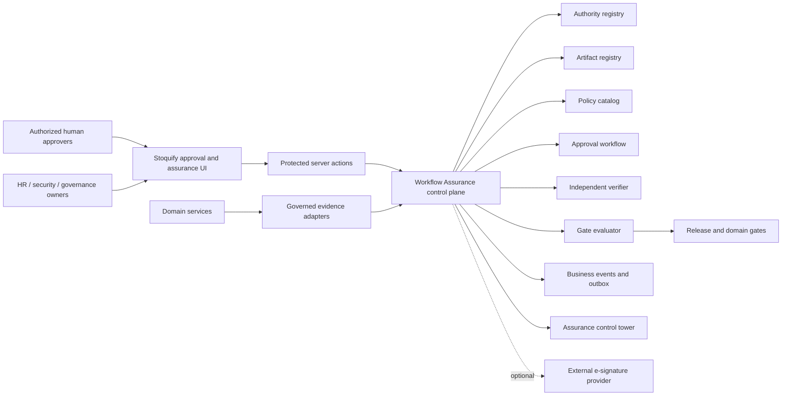

The production module consumes governed records and service contracts. Repository scanning remains a developer/audit tool and is not a production source of authority.

## Component boundaries

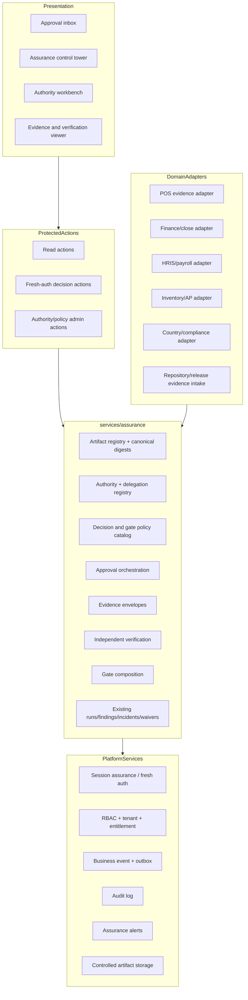

## Component specifications

### 1. Governed evidence connectors

Ownership: each domain owns its adapter; Assurance owns the adapter interface.

Responsibilities:

- return organization-scoped, permission-safe evidence descriptors;
- include source type, source ID, source version, observed time and source digest;
- distinguish unavailable, stale, partial and conflicting evidence;
- redact sensitive values before cross-domain projection;
- never silently fall back to a different source;
- expose no mutation of domain truth.

The repository evidence connector is a separate developer/release adapter. It may read registered manifests and CI evidence, not arbitrary production server files.

### 2. Artifact registry and canonical digest service

Ownership: Assurance platform, with domain owner for each artifact.

Responsibilities:

- register artifact identity, tenant, domain, owner, URI and media type;
- create immutable artifact versions;
- assign a versioned canonicalization profile;
- compute `sha256` server-side and support independent recomputation;
- freeze, supersede and retire artifacts;
- emit drift/invalidation events;
- reject approval requests for mutable or unverified artifacts.

Canonicalization profiles must be explicit. Binary files hash exact bytes. JSON uses a versioned canonical key/order/number/string policy. PDF/DOCX approvals bind the final exported bytes and any separately normalized semantic payload required by policy.

### 3. Authority and delegation registry

Ownership: HR/security/governance source owners; Assurance stores governed assignments and evidence references.

Responsibilities:

- map stable `User.id` to governance authority codes;
- record organization, scope, effective dates, appointment source and evidence digest;
- store qualification type, jurisdiction and expiry when applicable;
- support bounded delegation and revocation;
- prevent authority from being derived from display names;
- expose candidate, confirmed, expired, conflicted and revoked states;
- preserve historical assignments after supersession.

An application role may be a candidate signal. It is never the sole authority source for a controlled decision.

### 4. Decision and gate policy catalog

Ownership: control owner plus domain owner; security/country review where touched.

Responsibilities:

- version decision definitions, permitted options and required authority codes;
- define quorum, sequence, fresh-auth maximum age and authentication level;
- define same-person multi-role and maker-checker rules;
- bind policy to artifact types and gate obligations;
- define expiry, review, waiver and external-signature requirements;
- publish only after an explicit policy-review workflow;
- preserve the exact version used by historical approvals.

### 5. Approval orchestration

Ownership: Assurance service; decision content and consequences remain domain-owned.

Responsibilities:

- expand a policy into unique approval obligations;
- route requests only to active, eligible authorities;
- display the canonical decision payload before action;
- require explicit approve/reject intent and fresh authentication;
- recompute the request digest server-side;
- enforce tenant, entitlement, permission, authority, conflict and SoD rules;
- write approval entry, authentication attestation, audit log and business event transactionally;
- support rejection, expiry, cancellation, supersession and invalidation;
- never edit an existing approval into a different decision.

### 6. Authentication-attestation adapter

Ownership: Security/authentication platform.

Responsibilities:

- reuse the verified Stoquify session and `requireFreshAuth()`;
- capture stable user ID, session ID reference, tenant, assurance method/level and verification time;
- support stronger policy levels such as WebAuthn/passkeys when available;
- store no password, TOTP secret, token or passkey private material;
- reject session/tenant/identity mismatches;
- allow authentication-method upgrades without changing approval semantics.

### 7. Immutable evidence envelope

Ownership: Assurance evidence service.

The canonical envelope contains:

- schema and canonicalization versions;
- organization and approval-request IDs;
- policy ID/version/digest;
- decision ID and selected option;
- artifact ID/version/URI/digest;
- approver stable ID and verified authority assignment ID;
- authentication-attestation ID and timestamps;
- rationale/evidence references subject to redaction;
- approval-entry ID, status and server time;
- prior/superseded record references when applicable.

The service hashes the canonical envelope and produces controlled JSON/PDF exports. PDF is a presentation; the canonical JSON digest is the machine-verification anchor. External signature artifacts remain linked evidence with their own digests.

### 8. Independent verification engine

Ownership: Controls assurance; independent checker role where policy requires it.

Responsibilities:

- independently reload the artifact and policy versions;
- recompute digests;
- validate identity, tenant, authority scope/effectivity and qualification;
- validate fresh authentication and approval timing;
- validate quorum, role coverage, sequence and SoD;
- detect revocation, expiry, supersession and drift;
- create a deterministic verification record with reason codes;
- invalidate prior verification when dependencies change;
- require a separate human checker only for policies that demand human certification.

Automated cryptographic verification is not a human approval. Both may be required.

### 9. Gate composition and blocker engine

Ownership: Assurance platform; each gate has a named domain/control owner.

Responsibilities:

- compose technical assurance checks, approval obligations and external evidence requirements;
- evaluate an acyclic dependency graph;
- preserve each input digest and policy version in `GateRun`;
- use `NOT_EVALUATED`, not `PASSED`, when dependencies are blocked;
- generate/update `WorkflowAssuranceIncident` blockers;
- expose owner, safe detail and next permitted action;
- invalidate downstream passes on material changes;
- keep release authorization separate from domain-gate pass.

### 10. Operational read models and UI

Extend the existing Assurance Control Tower with:

- **My approvals:** pending, expiring, rejected and completed requests.
- **Gate overview:** dependencies, technical checks, approvals and external evidence.
- **Blocker work queue:** owner, age, severity, evidence freshness and next action.
- **Authority workbench:** assignments, delegations, qualifications, conflicts and expiry.
- **Artifact registry:** versions, digests, drift and supersession.
- **Verification queue:** automated results and human-checker work.
- **Evidence viewer/export:** canonical payload, redactions, digest and verification result.

All states require text and icon cues, keyboard operation, focus management and EN/FR content. UI visibility is not authorization.

### 11. Notifications and escalation

Reuse `WorkflowAssuranceAlertDelivery` for in-app and webhook delivery. Add approval-specific templates, expiry reminders and escalation policies. Dedupe by obligation/version, record delivery state, and keep message content redacted. A delivered or opened notification cannot satisfy an obligation.

### 12. External e-signature adapter

Define a provider-neutral port:

- create envelope from a frozen Stoquify decision payload;
- receive signed/completed/cancelled webhooks idempotently;
- verify provider signature and expected signer mapping;
- store provider envelope ID, audit-certificate digest and final artifact digest;
- attach evidence to, but do not replace, Stoquify authority and policy checks.

This adapter is optional for internal G1 attestations unless governance explicitly requires external signature evidence.

## Target data model

Existing models should be reused where indicated. Names below are logical; final Prisma names require a separate reviewed schema design.

| Logical entity | Reuse/new | Scope and keys | Mutability / lifecycle | Essential controls |
| --- | --- | --- | --- | --- |
| `ControlDefinition` | Map to/extend `WorkflowAssuranceCheckDefinition` | Global versioned key; optional tenant override reference | Published versions immutable | Required permission, owner, source contract, policy digest |
| `GateDefinition` | New | Versioned gate key | Immutable after publish | Dependency and obligation composition; no cycles |
| `GateDependency` | New | Unique gate version + dependency | Immutable with gate version | Acyclic graph validation |
| `GateRun` | New, linked to assurance runs | Tenant + gate/version + execution key | Append-only result; supersedable | Input manifest digest, idempotency, evaluator version |
| `GateCheckResult` | Map to assurance run/finding plus join | Tenant + gate run + obligation key | Append-only | Exact source/check-run reference |
| `Blocker` | Reuse `WorkflowAssuranceIncident` | Tenant + check/version/source identity | Lifecycle events; no destructive history | Source hash, owner, due date, redaction |
| `Artifact` | New | Tenant + artifact key | Metadata mutable; identity stable | Domain owner, type, access policy |
| `ArtifactVersion` | New | Tenant + artifact + version | Frozen versions immutable | URI, media type, state, canonicalization version |
| `ArtifactDigest` | New or child of version | Artifact version + algorithm + profile | Append-only | Server and independent-verification timestamps |
| `AuthorityAssignment` | New | Tenant + authority code + subject + scope + period | Active/revoked/superseded | Appointment evidence digest, stable user ID, qualification |
| `AuthorityDelegation` | Generalize HRIS pattern | Tenant + delegator/delegate/scope/period | Active/revoked/superseded | Delegability, maker-checker, source digest |
| `DecisionDefinition` | New | Policy/version + decision ID | Immutable after publish | Options, artifact binding, expiry policy |
| `DecisionRoleRequirement` | New | Decision version + authority code + ordinal | Immutable | Quorum, sequence, SoD group, external-signature flag |
| `ApprovalRequest` | New | Tenant + policy/artifact/decision + idempotency key | Draft/ready/pending/final/invalidated | Request digest, expiry, artifact/policy digests |
| `ApprovalEntry` | New | Tenant + request + requirement + approver; unique active obligation | Append-only; rejected/superseded/invalidated | Explicit intent, authority assignment, envelope digest |
| `AuthenticationAttestation` | New | Tenant + approval entry | Immutable snapshot | Method/level/time/session reference; no secret material |
| `EvidenceEnvelope` | New | Tenant + subject + schema version + digest | Immutable; supersedable exports | Canonical payload, redacted export, retention class |
| `VerificationRun` | New or specialized assurance run | Tenant + subject digest + verifier version + execution key | Append-only | Automated/human class, verifier ID, reason codes |
| `ExceptionOrWaiver` | Reuse/extend `WorkflowAssuranceWaiver` | Tenant + incident/policy | Requested/approved/rejected/expired/revoked | Requester != approver, expiry, evidence/policy digest |
| `PolicyVersion` | New | Policy key + version | Immutable after publish | Full policy digest and effective dates |
| `ExternalSignatureEnvelope` | New, optional | Tenant + provider + provider envelope ID | Provider lifecycle; history retained | Webhook idempotency, final artifact and audit digests |
| `NotificationDelivery` | Reuse `WorkflowAssuranceAlertDelivery` | Tenant + incident/obligation/channel/dedupe | Delivery lifecycle | Redaction, retry/dead-letter recovery |

Every tenant-owned table requires `organizationId`, composite tenant-safe uniqueness, tenant-filtered indexes and `onDelete: Restrict` for evidence-bearing relationships. Historical evidence should use retention/supersession rather than cascade deletion.

## Authority relationships

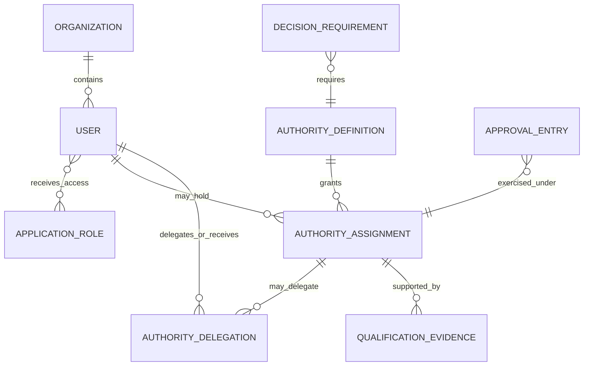

## Approval sequence

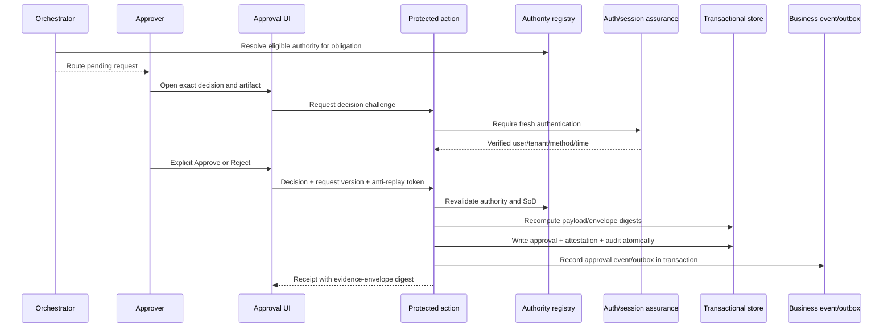

## Evidence verification sequence

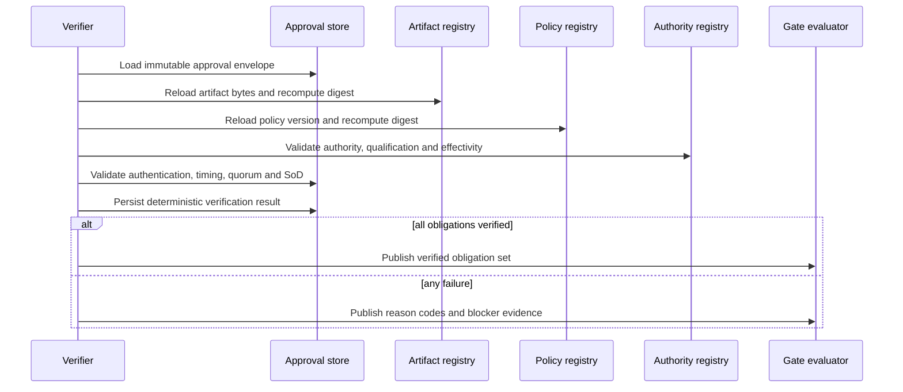

## Gate-evaluation sequence

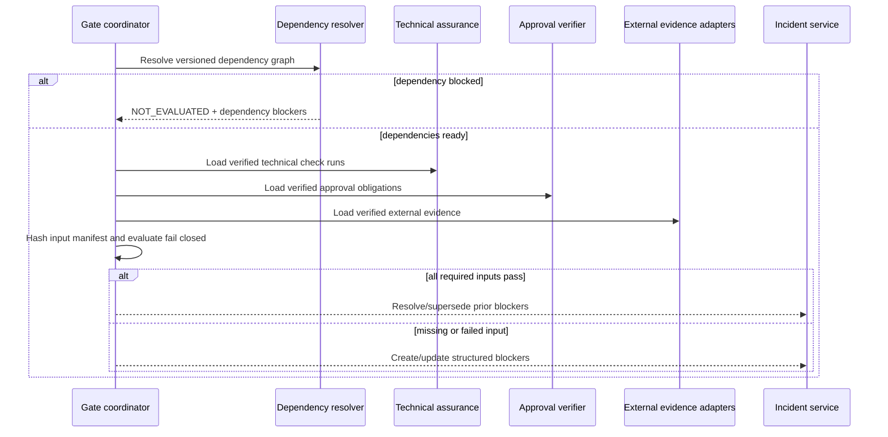

## Gate dependency flow

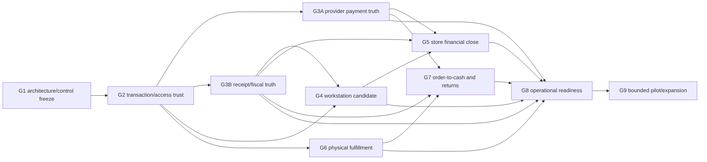

## Invalidation flow

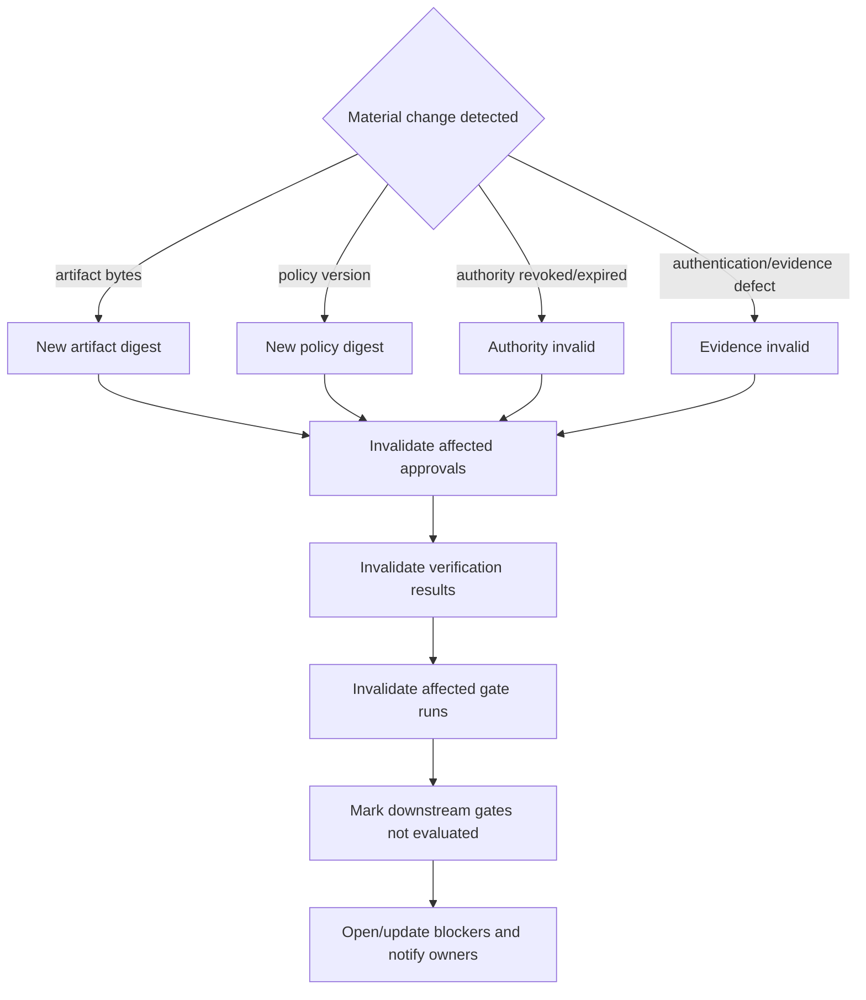

Invalidation never deletes history. It writes a reasoned invalidation record and creates a new path to reapproval.

## Lifecycle state machines

### Approval request

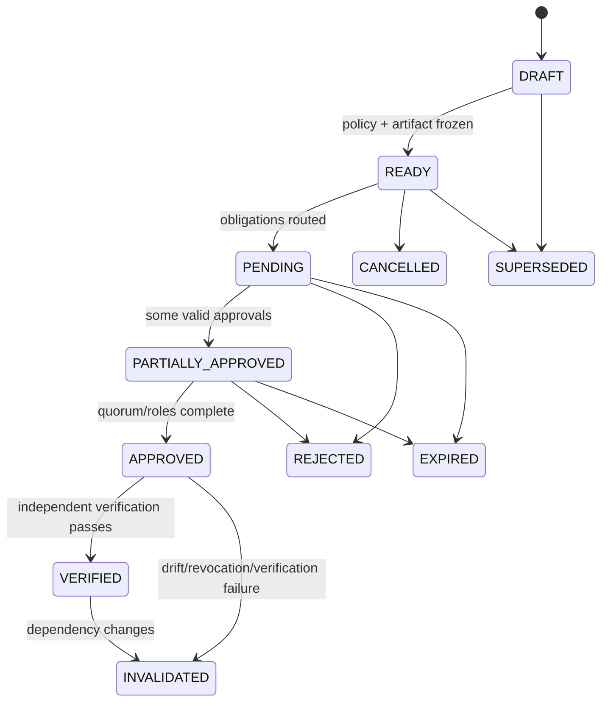

### Artifact

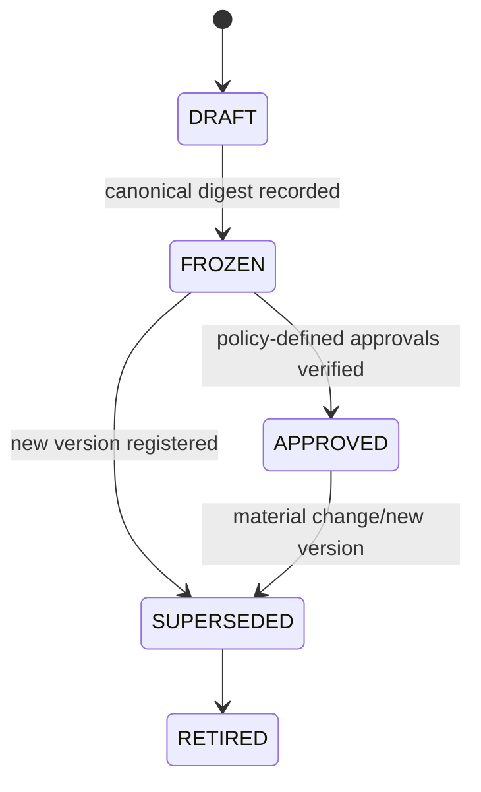

### Gate

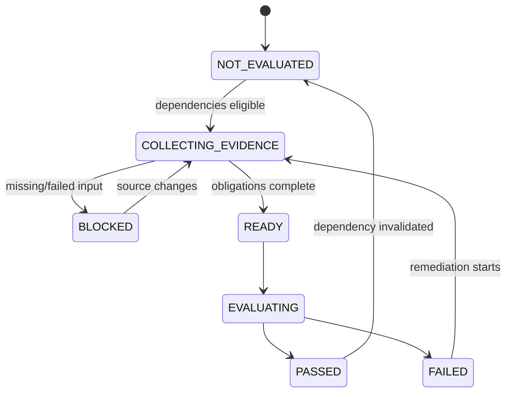

### Exception/waiver

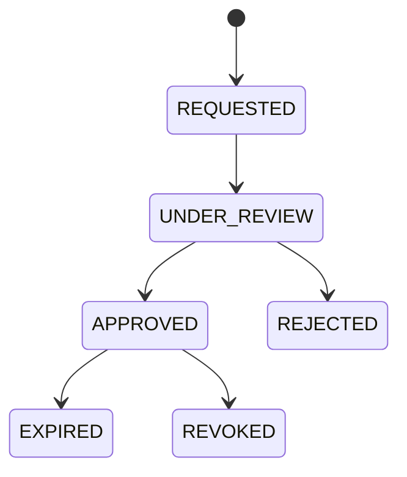

No state transition may be performed only in the browser. Each transition is a server transaction with actor, policy, source digest, idempotency and audit evidence.

## Proposed service and action contracts

Suggested bounded modules:

```text
services/assurance/artifacts/*
services/assurance/authority/*
services/assurance/policies/*
services/assurance/approvals/*
services/assurance/evidence-envelopes/*
services/assurance/verification/*
services/assurance/gates/*
services/assurance/adapters/*

actions/assurance/artifacts.actions.ts
actions/assurance/authority.actions.ts
actions/assurance/approvals.actions.ts
actions/assurance/verification.actions.ts
actions/assurance/gates.actions.ts
```

Representative commands:

- `registerArtifactVersion`
- `freezeArtifactVersion`
- `assignAuthority`
- `delegateAuthority`
- `revokeAuthority`
- `publishDecisionPolicy`
- `createApprovalRequest`
- `recordApprovalDecision`
- `verifyApprovalRequest`
- `runGateEvaluation`
- `invalidateControlEvidence`
- `exportEvidenceEnvelope`

Every mutation derives `organizationId` and actor identity from the trusted session. Inputs may contain resource IDs but never trusted tenant or approver identity.

## Business events

Minimum event catalog:

| Event | Purpose |
| --- | --- |
| `control.artifact.frozen` | Artifact digest and version become approval-eligible. |
| `control.artifact.superseded` | Triggers dependent invalidation. |
| `control.authority.assigned` | Records governed appointment. |
| `control.authority.revoked` | Invalidates future use and policy-defined active approvals. |
| `control.approval.requested` | Obligations become routable. |
| `control.approval.decided` | Records explicit approve/reject intent. |
| `control.approval.invalidated` | Preserves reason and prior envelope reference. |
| `control.evidence.envelope.created` | Makes canonical evidence digest available. |
| `control.verification.completed` | Publishes pass/fail reason codes. |
| `control.gate.evaluated` | Records gate input manifest and result. |
| `control.gate.invalidated` | Propagates dependency invalidation. |

Each event uses the existing organization-scoped idempotency and payload-hash pattern.

## G1 pilot design

### Policy expansion

The G1 policy imports D-01 through D-11 from the frozen contract and expands each `requiredApproverRoles` array into one obligation per role. The resulting key is deterministic:

```text
G1:0.2.0:<contract-sha256>:<decision-id>:<authority-code>
```

The 11 decisions must produce exactly 33 obligations. A mismatch is a policy-import blocker, not an approval shortage.

### Complete approval example

```json
{
  "schemaVersion": "1.0.0",
  "organizationId": "org-example",
  "approvalRequestId": "g1-d01-request",
  "decisionId": "D-01",
  "selectedOption": "DISABLE_HIDE_AND_REJECT_STORE_CREDIT",
  "artifactId": "STOQUIFY-POS-G1-CONTRACT-FREEZE-0.2.0-20260817",
  "artifactVersion": "0.2.0",
  "artifactSha256": "11434eb3e1af1826516426e90d2d53a2faa47ade361d91191b5f3e0c950a36db",
  "policyVersion": 1,
  "authorityCode": "PRODUCT_OWNER",
  "approverUserId": "verified-user-id",
  "authorityAssignmentId": "confirmed-authority-assignment",
  "decision": "APPROVED",
  "freshAuthenticatedAt": "2026-08-18T14:00:00.000Z",
  "approvedAt": "2026-08-18T14:02:00.000Z",
  "evidenceEnvelopeSha256": "example-generated-by-server"
}
```

This example is structural only and grants no approval credit because the example identities and envelope digest are not live evidence.

### Required failure examples

| Scenario | Detection | Result |
| --- | --- | --- |
| Incomplete D-07 | Product and finance present; qualified Cameroon reviewer missing | Request remains `PARTIALLY_APPROVED`; G1 blocker remains open. |
| Authority conflict | Candidate has application role but no active appointment, or two sources disagree | No approval request routed as authoritative; open `AUTHORITY_CONFLICT`. |
| Expired authentication | Approval occurs outside policy freshness window | Reject transaction with `FRESH_AUTH_REQUIRED`; create no approval entry. |
| Artifact drift | Recomputed contract digest differs from frozen digest | Invalidate affected approvals and verification; G1 returns to blocked. |
| SoD violation | Policy forbids same user satisfying two incompatible roles or verifier equals producer | Reject obligation/verification with `SEGREGATION_OF_DUTIES_VIOLATION`. |
| Existing handwriting image | Media exists without trusted envelope/audit evidence | Preserve as attachment with zero approval credit. |

### Gate handoff

The current G1 script should eventually consume a generated, read-only verified approval manifest rather than accept hand-edited approval JSON. During transition:

1. keep the current contract and fail-closed script;
2. generate a proposed register from runtime records;
3. independently compare it with the contract requirements;
4. make the script trust only `VERIFIED` envelopes and an exact manifest digest; and
5. retain a non-writing report mode for development and CI.

## Platform applicability

| Domain | Shared control-plane capability | Domain-owned truth that must remain separate |
| --- | --- | --- |
| POS releases | Gate dependencies, approvals, artifacts, evidence and blockers | Sale, tender, drawer and POS session rules |
| Destructive migrations | Candidate manifest, hashes, maker/checker, restore evidence | Migration execution and database history |
| Country packs | Qualification, provenance, review and expiry | Statutory rules and regulator sources |
| Payments/treasury | Payment-release authority and evidence envelopes | Provider state, settlement and bank truth |
| Reconciliation | Sign-off/quorum and certificate evidence | Matching, suspense and exception logic |
| Accounting close | Approval/waiver routing and exports | Ledger, periods, close calculations and certification |
| Inventory/write-offs | Authority, materiality policy and maker-checker | Stock movements, valuation and disposition |
| Purchasing/AP | Approval obligations and evidence | PO, receipt, invoice, supplier and payment workflow |
| Payroll/compensation | Authority, inbox and evidence | Employee, contract, compensation and payroll calculations |
| Module activation | Policy, approval and audit | Entitlement and provisioning state |
| Compliance | Evidence envelope and qualified review | Fiscal documents, submissions and authority responses |
| AI agents | Human approval boundary and activation evidence | Agent runtime, tool policy and evaluation results |
| Production release/rollback | Composite gate, artifacts and release decisions | CI/CD provider and infrastructure deployment truth |

## Security and abuse analysis

| Threat | Required control |
| --- | --- |
| Cross-tenant approval | Derive tenant from session; composite tenant keys; tenant-scoped lookups; negative tests. |
| Forged or client-edited approval payload | Reconstruct canonical payload server-side and compare version/anti-replay token. |
| Stale or fabricated authority | Appointment evidence, source digest, effective dates, revocation and conflict state. |
| UI bypass/direct API call | All controls in service/protected action; UI only presents state. |
| Replay or duplicate approval | Unique obligation key, idempotency key and request-digest conflict detection. |
| Artifact substitution | Registered immutable version, canonicalization profile and independent digest recomputation. |
| Requester/self-approver abuse | Policy-driven SoD, maker-checker and deny-wins rules. |
| Producer self-verification | Separate verifier capability/role and policy-enforced actor inequality. |
| Audit/evidence mutation | Append-oriented tables, restricted update paths, supersession events, backup/restore and optional hash-chain anchoring after review. |
| Secret or personal-data exposure | Store references and assurance metadata, not credentials; redact UI, logs, alerts and exports. |
| Clock manipulation | Server time, monitored clock synchronization and invalid future timestamps. |
| AI agent impersonation | Mark service/agent principals; prohibit them from human approval and risk-acceptance capabilities. |
| External provider spoofing | Signed webhook verification, allowlisted provider adapter, idempotency and final artifact/audit digest verification. |

## Observability and recovery

Metrics:

- pending obligations by gate/role and age;
- authority assignments nearing expiry;
- approval freshness failures;
- verification failures by reason code;
- artifact/policy drift invalidations;
- gate evaluation duration and blocked time;
- stuck runs, alerts and outbox messages;
- dead-letter recovery outcomes;
- cross-tenant and SoD denial counts.

Runbooks must cover:

- authority source unavailable;
- artifact storage unavailable;
- verifier backlog;
- partial transaction/outbox recovery;
- corrupted or mismatched evidence export;
- mistaken authority assignment;
- artifact supersession after approval;
- external-signature provider outage;
- restore and independent evidence reconciliation.

## Deployment recommendation

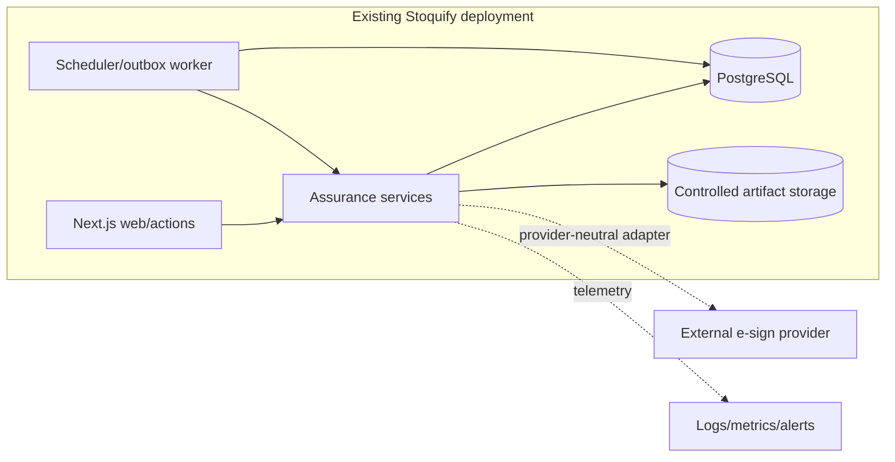

Start inside the existing deployment. Preserve internal module interfaces so artifact hashing, verification or external-signature integration can be extracted later if scale, independent administration, cryptographic key isolation or availability objectives justify it.

Extraction triggers should be evidence-based:

- materially different availability/SLO from the application;
- independent operations/security administration requirement;
- verification throughput that harms transactional workloads;
- regulated key-management isolation;
- multiple products consuming the service across deployment boundaries.

Until then, a separate microservice adds network failure, distributed transaction and operational costs without solving the primary governance gap.

## Architecture acceptance conditions

The target architecture is ready for Phase 0/1 implementation only when:

- governance approves the authority-source and delegation model;
- security approves authentication-assurance levels and sensitive permissions;
- data governance approves retention, redaction and export classes;
- G1 domain owners approve the imported decision/role policy;
- qualified-review requirements remain explicit and unfilled rather than guessed;
- the additive schema migration and rollback design are independently reviewed; and
- no implementation claims G1 approval or legal-signature validity by construction.
