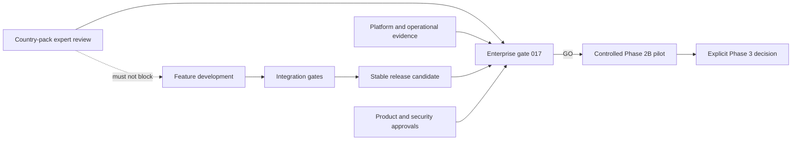

# Enterprise Release Blocker Unblocking Execution Plan

**Date:** 2026-07-27  
**Decision basis:** Skill 017 enterprise release gate and its referenced machine-readable evidence  
**Current production decision:** **NO-GO / REJECTED**  
**Development decision:** **GO**, provided production-only capabilities remain fail-closed

## Executive decision

Stoquify is not blocked from continuing product development. It is blocked from production promotion because the current candidate is not buildable, is not bound to a clean immutable artifact, lacks production infrastructure evidence, and has incomplete external statutory and operational approvals.

The shortest safe path is to run four independent lanes in parallel:

1. **Engineering stabilization:** repair the server-action build defect, restore payroll immutability verification, and keep the main branch continuously green.
2. **Platform readiness:** provision production-safe database targets, managed secrets, CI artifact identity, scheduler, alerting, and rotation evidence.
3. **Statutory review:** dispatch the already prepared Cameroon review packet to a qualified independent expert and a separate checker. This lane must not block unrelated development.
4. **Release governance:** assign accountable people and capture approvals only after a stable release candidate exists.

Country-pack production use must stay disabled until its two blockers pass. Development and integration should use the development/integration gates and a sandbox or inactive adapter; no production readiness flag, symbolic hash, approval, or signature may be fabricated.

## Readiness states

| State | Meaning | Current decision |
|---|---|---|
| Development-ready | Local and CI engineering can continue using non-production gates; unfinished statutory adapters remain inactive | Allowed after the build defect is fixed |
| Integration-ready | Cross-module behavior can be tested against sandbox fixtures without production statutory claims | Allowed when integration gates pass |
| Pilot-ready | One immutable artifact has passed gate 017, has assigned operators, production-like controls, and explicit pilot authorization | Not ready |
| Production-ready | Pilot exit is accepted and Phase 3 authority is recorded against the same artifact | Not ready |

## Architecture and control boundary

The repository architecture already separates tenant defence, RBAC/server-action security, ledger-backed controls, and enterprise error handling. Preserve those boundaries. Regulatory readiness is an adapter capability and release entitlement, not a global prerequisite for ordinary feature work.



Required isolation:

- Use `statutory:country-pack:dev:gate` and `statutory:country-pack:integration:gate` during development.
- Keep the Cameroon production adapter inactive and `productionUseAllowed=false` until authentic approval is ingested.
- Fail closed on statutory calculation, filing, declaration, or production payroll execution when no approved country pack is available.
- Do not bypass `statutory:country-pack:gate` inside `policy:gates` or `verify:release`.
- Keep release evidence immutable and bound by commit, manifest, artifact, deployment, and approval hashes.

## Critical path

1. Fix the production build.
2. Restore a green engineering baseline and dedicated payroll immutability runtime test.
3. Provision production-safe database and managed release secrets.
4. Complete the statutory review and operational platform evidence in parallel.
5. Select a clean release candidate only after the preceding implementation work stops changing.
6. Freeze, build, attest, and bind one immutable artifact.
7. Capture independent product/security approvals and operational ownership against that artifact.
8. Rerun gates 1–10, then gate 017.
9. If gate 017 returns GO, run the bounded Phase 2B pilot.
10. Record the separate Phase 3 decision after pilot exit.

Do not freeze early. The previous freeze became stale because 357 changes and eight runtime paths appeared after the attestation.

## Blocker register

### B01 — Production build failure

- **Root cause:** `actions/hris/operational-time.actions.ts` is a `"use server"` module, but `getOwnOperationalTimeAction` and `getManagedOperationalTimeInboxAction` are exported as non-`async` arrow functions.
- **Risk/capability blocked:** No production bundle; every downstream artifact and approval would bind to an invalid candidate.
- **Dependencies:** None.
- **Owner:** HRIS/payroll engineering owner.
- **Resolution:** Make both exported actions explicitly `async`, preserving the existing protected read functions and return types. Add or retain action contract tests. Run typecheck, focused tests, and the application build.
- **Verification:** `npm run typecheck`; focused operational-time action tests; `npm run build:app`.
- **Expected pass:** Next.js accepts every `"use server"` export and produces a build artifact.
- **Completion evidence:** Successful protected CI log bound to the commit SHA.
- **Rollback:** Revert only the two action wrappers if focused tests regress.
- **Blocking scope:** Development integration and all release stages.

### B02 — Payroll immutability runtime gate

- **Root cause:** Prisma migration deployment exited with code 1 in the dedicated runtime check; therefore 0/9 required database triggers were observed. The current report retained only the first diagnostic line, so the underlying database error must be captured from the full command output.
- **Risk/capability blocked:** Finalized payroll, payslip, payment, declaration, and employee-balance evidence lacks runtime mutation protection.
- **Dependencies:** A clearly non-production dedicated test database and valid migration credentials.
- **Owner:** Payroll engineering with database platform owner.
- **Resolution:** Provision/reset a dedicated immutability test database; run migration status; deploy all migrations; capture the complete Prisma error if deployment fails; correct only the failing migration or target configuration; rerun the runtime mutation suite.
- **Verification:** `npm run prisma:validate`; `npm run payroll:immutability:runtime`.
- **Expected pass:** 9/9 triggers present, 14 prohibited mutations blocked, 3 permitted lifecycle mutations allowed, zero blockers.
- **Completion evidence:** Updated `what-next/payroll/payroll-immutability-runtime-check.{md,json}` from protected CI.
- **Rollback:** Restore the dedicated test database from snapshot or recreate it; never test destructive mutations on production.
- **Blocking scope:** Payroll release and enterprise production, not unrelated feature development.

### B03 — Production database target absent or unsafe

- **Root cause:** Release migration preflight reports `database_url_missing`; no target is available for safety classification or migration deployment.
- **Risk/capability blocked:** Production schema cannot be verified or deployed; runtime evidence cannot represent the intended environment.
- **Dependencies:** Approved production environment, managed secret store, network access, database backup/restore procedure.
- **Owner:** Platform/database owner.
- **Resolution:** Create the production database target; store `DATABASE_URL` as a managed secret; grant least-privilege migration/runtime identities; validate target identity; capture backup and restore evidence; run migration preflight, then controlled deploy.
- **Verification:** `npm run prisma:migration:release:preflight`; `npm run prisma:migrate:deploy`; `npm run prisma:migrate:status`.
- **Expected pass:** `databaseConfigured=true`, `deploymentTargetIsSafe=true`, 41 migrations accounted for, no destructive finding, deploy/status successful.
- **Completion evidence:** Redacted target identity, migration run ID/log, backup reference, and post-deploy status.
- **Rollback:** Invoke the approved restore/forward-fix runbook; do not use ad-hoc destructive rollback SQL.
- **Blocking scope:** Production deployment only.

### B04 — Required production release secrets absent

- **Root cause:** Three independently generated secrets are absent: `PUBLIC_IDENTITY_ABUSE_HASH_SECRET`, `AQSTOQFLOW_RECEIPT_TOKEN_SECRET`, and `AQSTOQFLOW_HISTORY_CURSOR_SECRET`.
- **Risk/capability blocked:** Stable abuse hashing, receipt authenticity, and history cursor integrity cannot be trusted in production.
- **Dependencies:** Managed secret store and authorized security operator.
- **Owner:** Security/platform owner.
- **Resolution:** Generate high-entropy independent values in the secret manager; inject references into the deployment environment; verify minimum strength, distinctness, and non-reuse with auth secrets; restart workloads through the normal deployment process.
- **Verification:** `npm run release:secrets:preflight:release`, followed by the public identity, receipt-token, and release evidence gates.
- **Expected pass:** 8/8 secret preflight checks, with no value printed or committed.
- **Completion evidence:** Secret version references, creation/activation timestamps, workload deployment reference, and redacted gate output.
- **Rollback:** Restore the preceding secret version and deployment revision under incident/change control.
- **Blocking scope:** Production release only.

### B05 — Cameroon source-artifact hash binding

- **Root cause:** Seven `sourceEvidenceHash` values remain symbolic and are not bound to retained, independently verified source artifacts.
- **Risk/capability blocked:** The implementation cannot prove exactly which authoritative source supports each statutory rule.
- **Dependencies:** Qualified reviewer return and verified retained source artifacts.
- **Owner:** Qualified statutory reviewer; authorized engineering operator performs post-review ingestion.
- **Resolution:** Reviewer independently recomputes source hashes; records results in `source-hash-verification.json`; checker validates the return; after approval, replace only the seven symbolic values with matching `sha256:<64 lowercase hex>` values and update the manifest.
- **Verification:** `npm run statutory:country-pack:review:preflight`; `npm run statutory:country-pack:gate`.
- **Expected pass:** 7 declared, 7 valid, 7 bound; no hash mismatch.
- **Completion evidence:** Completed source verification, retained artifacts, manifest, code diff, and gate report.
- **Rollback:** Revert the post-review manifest/code binding and return the adapter to inactive status if any artifact or signature is invalidated.
- **Blocking scope:** Cameroon production statutory use only.

### B06 — Cameroon qualified expert approval

- **Root cause:** Reviewer identity, qualifications, independent four-family decisions, effective window, production authorization, signed artifact, and checker verification are absent.
- **Risk/capability blocked:** Stoquify cannot responsibly claim that the Cameroon rules are suitable for 2026 production use.
- **Dependencies:** An independent qualified Cameroon payroll/social-security expert and a different authorized checker.
- **Owner:** Compliance/legal owner appoints reviewer; reviewer owns the opinion; checker authenticates it.
- **Resolution:** Dispatch the existing review package; collect the seven required return artifacts; verify identity, qualifications, independence, signature, source hashes, four fixture-family tie-outs, effective dates, limitations, and explicit production authorization; ingest through the post-signature runbook.
- **Verification:** Signature verifier; fixture hash generator; review preflight; production country-pack gate.
- **Expected pass:** Country-pack gate 12/12 with `EXPERT_REVIEWED`. `REGULATOR_CONFIRMED` is optional and may be used only with actual regulator evidence.
- **Completion evidence:** Signed approval artifact, its SHA-256, completed `review-decision.json`, maker-checker record, signature-validation output, and manifest update.
- **Rollback:** Disable production use and revoke the approval binding if reviewer authority, source validity, or signature trust is later withdrawn.
- **Blocking scope:** Cameroon production statutory use only; does not block general development.

### B07 — Credential rotation and revocation evidence

- **Root cause:** All 15 credential classes are `UNRESOLVED`; 31 checks are blocked. Security authority and release-binding fields are empty.
- **Risk/capability blocked:** The release cannot prove that current credentials are controlled, rotated, activated, and that obsolete versions are revoked.
- **Dependencies:** Stable production-like deployment, named security authority, service owners, and B03/B04.
- **Owner:** Security owner with each service owner.
- **Resolution:** Assign authority; inventory every live reference; rotate each class through its provider; restart dependent workloads; prove the new version is active; revoke the old version; test old-version rejection; bind the evidence to the release artifact without storing secret values.
- **Verification:** `npm run agent:credential-rotation:evidence:apply`; `npm run agent:credential-rotation:gate`.
- **Expected pass:** 15/15 classes resolved, no old credential accepted, security approval present.
- **Completion evidence:** Provider version IDs, deployment/restart IDs, rejection tests, rotation register hash, approval reference.
- **Rollback:** Reactivate the prior version only through the incident runbook when supported; otherwise rotate forward.
- **Blocking scope:** Production release and pilot.

### B08 — Operational release evidence

- **Root cause:** 152 checks are blocked across release identity, CI, governance, approvals, owners, scheduler, alerting, and credential evidence. Activation remains unauthorized.
- **Risk/capability blocked:** No accountable or observable way to operate, recover, support, or audit the agent runtime.
- **Dependencies:** Stable artifact, platform environment, secrets, and named owners.
- **Owner:** Release manager coordinates; platform/SRE, security, product, and support own their sections.
- **Resolution:** Bind package/version/commit/artifact/deployment/manifest/evidence/browser hashes; capture protected CI; assign and obtain acceptance from all six operational roles; deploy inactive reconciler and five-minute scheduler; capture three unique healthy windows plus invalid-auth rejection; exercise alert delivery, acknowledgement, retry, dead letter, recovery, escalation, and secret rotation.
- **Verification:** Operational evidence apply commands, then `npm run agent:operational-release:gate`.
- **Expected pass:** 152/152 checks accepted and `activationAuthorized` remains false until the controlled ceremony.
- **Completion evidence:** Completed operational register, scheduler and alert run IDs, owner acceptances, CI attestation, and independent review.
- **Rollback:** Keep workload inactive; remove schedule/alert routes or revert deployment revision if readiness fails.
- **Blocking scope:** Agent pilot and production, not core application development.

### B09 — Stale Phase 2A freeze

- **Root cause:** The historical manifest has one mismatch, eight runtime files changed after freeze, and the worktree contained 357 changes; only 206/207 files matched.
- **Risk/capability blocked:** Approvals and tests would not describe the code being deployed.
- **Dependencies:** B01–B08 implementation work complete and a deliberate release-candidate cut.
- **Owner:** Release manager with independent reviewer.
- **Resolution:** Keep the current dirty worktree out of release input; review the eight runtime changes; reconcile the historical mismatch without rewriting history; cut a clean candidate; generate a new freeze manifest and immutable artifact; allow no post-freeze mutation.
- **Verification:** Phase 2A freeze gate, clean-tree check, protected CI, artifact digest verification.
- **Expected pass:** 207/207 or current manifest total matches, zero mismatch, zero runtime drift, clean source tree.
- **Completion evidence:** Commit SHA, freeze manifest hash, immutable artifact digest, CI run, and independent attestation.
- **Rollback:** Abandon the candidate and cut a new one; never edit the signed freeze evidence in place.
- **Blocking scope:** Pilot and production release only.

### B10 — Governance approvals and ownership

- **Root cause:** Product/security approvals and six primary/backup operational assignments are pending or null.
- **Risk/capability blocked:** No accountable authority exists for deployment, rollback, support, pilot operation, or incidents.
- **Dependencies:** A single frozen artifact and evidence bundle; approvals before freeze would become stale.
- **Owner:** Product authority, security authority, release manager.
- **Resolution:** Assign `ROLLOUT`, `ROLLBACK`, `SUPPORT`, `PILOT`, `SECURITY_INCIDENT`, and `ON_CALL_BACKUP`; record acceptance, coverage, escalation, and runbook references; obtain distinct product and security approvals bound to the same hashes.
- **Verification:** Governance evidence apply command and operational release gate.
- **Expected pass:** Every role has primary/backup coverage and every approval identity is real, distinct where required, and artifact-bound.
- **Completion evidence:** Authoritative directory IDs, acceptance timestamps, approval references/hashes, coverage and escalation records.
- **Rollback:** Revoke approval and block activation when ownership or scope changes.
- **Blocking scope:** Pilot and production.

### B11 — Phase 2B entry

- **Root cause:** 20 of 23 Phase 2B entry checks are blocked, including clean freeze, secrets, migration, statutory authority, operational readiness, promotion points 1–11, and gate 017 GO.
- **Risk/capability blocked:** An unsafe or unowned candidate could enter a real pilot.
- **Dependencies:** B01–B10 and gate 017.
- **Owner:** Release authority.
- **Resolution:** Do not remediate this as an independent technical defect. Satisfy its upstream evidence, rerun the entry gate, and perform a separately authorized activation ceremony with allowlisted tenants/roles.
- **Verification:** Phase 2B entry gate and activation evidence.
- **Expected pass:** 23/23 and explicit bounded-pilot authorization.
- **Completion evidence:** Entry report, allowlists, activation identity/time, monitoring and rollback readiness.
- **Rollback:** Execute pilot kill switch/rollback and preserve evidence.
- **Blocking scope:** Controlled pilot only.

### B12 — Phase 3 production decision

- **Root cause:** 33 of 34 checks are blocked because Phase 2B has not run and no pilot exit or Phase 3 authority exists.
- **Risk/capability blocked:** Production expansion without observed safety, operational performance, or accountable acceptance.
- **Dependencies:** Successful Phase 2B pilot.
- **Owner:** Product, security, finance-domain, and release authorities.
- **Resolution:** Complete observation window; assess incidents, rollback exercise, support evidence, scope compliance, and exit metrics; preserve approver segregation; record explicit artifact-bound Phase 3 GO/NO-GO.
- **Verification:** Phase 3 readiness gate and independent review.
- **Expected pass:** 34/34 and explicit GO; otherwise remain inactive.
- **Completion evidence:** Pilot exit report, incident register, operational metrics, approvals, and authority record.
- **Rollback:** Revoke Phase 3 authorization and return to inactive/pilot-safe state.
- **Blocking scope:** General production expansion only.

## Parallel workstreams

| Lane | Can start now | Must wait for | Deliverable |
|---|---:|---|---|
| Engineering stabilization | Yes | Nothing | Green build and core engineering gates |
| Payroll database verification | Yes | Dedicated safe test DB | 9/9 trigger runtime evidence |
| Production platform | Yes | Environment authority | Safe DB, managed secrets, deployment evidence |
| Cameroon expert review | Yes | Reviewer and checker appointment | Authentic 12/12 statutory evidence |
| Operational owner assignment | Yes | Named people | Accepted role roster and runbooks |
| Scheduler/alert deployment | After platform baseline | Managed environment/secrets | Three windows and alert lifecycle evidence |
| Credential rotation | After services stabilize | Final managed references | 15/15 rotation/revocation evidence |
| Release freeze and approvals | Last | All implementation-changing work | One clean immutable approved bundle |

## Sequenced execution

### First 24 hours

1. Assign one accountable release manager and owners for engineering, database/platform, security, statutory review, and operations.
2. Repair B01 and rerun typecheck, focused tests, and `build:app`.
3. Capture the full B02 migration error using the dedicated test database; do not infer the cause from the truncated report.
4. Open platform work items for the production database, three release secrets, scheduler, and alert transport.
5. Dispatch the existing Cameroon review package to a qualified expert and appoint a separate checker.
6. Declare the current tree a development tree, not a release candidate; postpone refreeze.

### Days 2–7

1. Restore the payroll runtime test to 9/9 triggers and zero blockers.
2. Complete production database safety evidence and secret preflight.
3. Run the statutory reviewer and checker workflow independently of engineering.
4. Assign the six operational roles and complete their runbook/coverage records.
5. Deploy the inactive scheduler/reconciler and alert transport; collect three windows and negative-auth evidence.
6. Rotate the 15 credential classes after endpoints and workloads are stable.
7. Keep feature development behind development/integration gates; merge only changes that preserve the green baseline.

### Final promotion sequence

1. Stop release-affecting changes and cut a candidate from a clean branch/worktree.
2. Run full tests, policy gates, build, migration checks, browser verification, and security evidence.
3. Create the freeze manifest and immutable artifact.
4. Bind deployment, CI, country-pack, credential, operational, and browser evidence to the same commit/artifact hashes.
5. Obtain product and security approvals after binding.
6. Rerun promotion points 1–10 and resolve discrepancies without editing signed evidence.
7. Rerun gate 017 for an independent GO/NO-GO.
8. Only on GO, authorize the bounded Phase 2B pilot.
9. Only after successful pilot exit, seek Phase 3 approval.

## Promotion ledger mapping

| Point | Existing state | Exit condition |
|---:|---|---|
| 1 | Blocked — review/refreeze required | Clean reviewed freeze, no mismatch or drift |
| 2 | Blocked | Protected CI and immutable artifact |
| 3 | Blocked | Product/security approvals bound to artifact |
| 4 | Blocked | Six accepted operational owner assignments |
| 5 | Blocked | Reconciler and scheduler authority deployed |
| 6 | Blocked | Managed scheduler/reconciler credentials |
| 7 | Blocked | Three consecutive healthy windows |
| 8 | Blocked | Production-like alert lifecycle evidence |
| 9 | Blocked | Credential rotation and revocation complete |
| 10 | Blocked | Statutory source hashes and expert approval |
| 11 | Executed NO-GO | Independent gate 017 GO |
| 12 | Not started | Controlled Phase 2B pilot complete |
| 13 | Not started | Explicit Phase 3 GO |
| 14 | Not started | Phase 3 agent work begins within approved scope |

## Final verification command order

Run commands from a clean release candidate in protected CI. Commands that mutate or contact a target must use the approved target and credentials.

```text
npm run prisma:validate
npm run typecheck
npm run lint
npm run build:app
npm test -- --runInBand
npm run payroll:immutability:runtime
npm run statutory:country-pack:review:preflight
npm run statutory:country-pack:gate
npm run release:secrets:preflight:release
npm run prisma:migration:release:preflight
npm run agent:credential-rotation:gate
npm run agent:operational-release:gate
npm run agent:phase2a:freeze:gate
npm run verify:release
npm run agent:phase2b:entry:gate
```

Gate 017 should be rerun using the repository's Skill 017 procedure only after promotion points 1–10 pass. A passing test bundle alone is not a production approval.

## Definition of done

The unblocking program is complete only when:

- the production build passes from a clean commit;
- payroll runtime immutability proves 9/9 triggers and all mutation expectations;
- the production database is identified, safe, backed up, migrated, and status-checked;
- all three release secrets pass 8/8 without disclosure;
- Cameroon evidence passes 12/12 through an authentic independent expert and checker;
- all 15 credential classes are rotated and old versions reject;
- all 152 operational checks pass;
- the new freeze has no mismatch or drift;
- product/security approvals and six owner roles are artifact-bound;
- gate 017 independently returns GO;
- Phase 2B and Phase 3 remain separate decisions with their own evidence.

Until then, the correct posture is: continue development, keep unapproved production capabilities inactive, and do not weaken or bypass the release controls.

