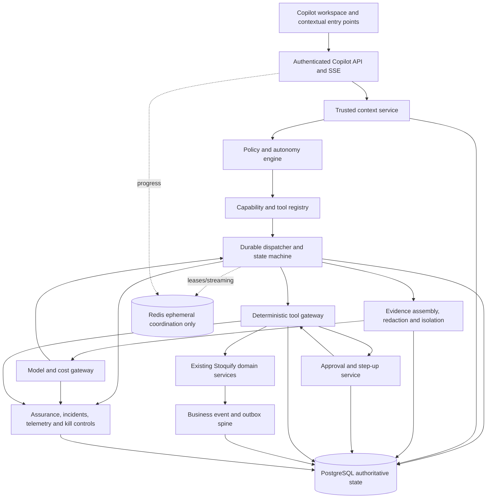

# Stoquify Executable Copilot Runtime Implementation Advisory Report

**Date:** 16 July 2026  
**Scope:** Evidence-based architecture, security, delivery, product and release review  
**Decision status:** Proceed conditionally with a narrow, read-only implementation slice  
**Production status:** Copilot definitions are structurally valid; the executable runtime and all 999 behavioral evaluations remain unimplemented or untested

## 1. Executive recommendation

Stoquify should proceed, but it should not begin by building a general chatbot, an autonomous agent swarm, or a separate AI microservice estate. The safest and fastest route is a **modular-monolith-first Copilot control plane and durable runtime inside the existing Stoquify codebase**, with a separate worker process using the same service modules and PostgreSQL database.

The first production objective should be a read-only, evidence-grounded operating brief and exception-navigation experience. It should use the installed Command Agent and a deliberately small subset of skills, but the runtime must enforce security and control decisions independently of model output.

The recommended order is:

1. Freeze the runtime contracts and lifecycle vocabulary.
2. Correct the trusted-context and entitlement gaps.
3. Add PostgreSQL-backed Copilot persistence, registry loading and a deterministic state machine.
4. Register a very small set of read-only tools over existing Stoquify read models.
5. Add evidence assembly, redaction and content-isolation adapters.
6. Add a provider-neutral model gateway with one approved regional deployment.
7. Expose a minimal Copilot API and embedded workspace.
8. Convert the relevant subset of the 999-case catalogue into executable fixtures.
9. Run offline evaluation, shadow mode and an internal pilot before any customer canary.
10. Postpone controlled writes until a durable approval service, exact tool binding, replay protection and operational rollback have passed release gates.

This programme is feasible because Stoquify already has valuable foundations: server-side RBAC, session assurance, module evaluation, sensitive-action policies, idempotent business events and outbox records, evidence grading and redaction, workflow assurance incidents, audit logs, release gates and bilingual application patterns. However, these are **reusable foundations, not an implemented Copilot runtime**.

The recommended decision is therefore:

> **GO for Phase 0 through the internal read-only pilot. NO-GO for production writes, broad tenant rollout, statutory claims or autonomous actions until the explicit gates in this report pass.**

## 2. Evidence base and review method

### 2.1 Material inspected

The review inspected:

- The installed source suite under `docs/copilot/stoquify-agent-skill-definition-suite/`.
- All nine agent definitions, 28 skill packages, shared contracts, registry, dependency DAG and evaluation catalogue.
- Completion, installation-validation, adversarial-review, first-slice and unresolved-question reports.
- Prior Copilot architecture, runtime-requirement and value reports under `docs/copilot/`.
- The repository architecture graph and graph report under `graphify-out/`.
- Security, session, RBAC, module-entitlement, sensitive-action and step-up services.
- Business events, outbox records, evidence services, redaction policies, workflow assurance and audit storage.
- Prisma persistence models, APIs, application surfaces, package dependencies and release-readiness reports.
- Current module-surface and API-route guard inventories.

The graph report contains 4,121 nodes and 5,321 edges across 135 communities, with explicit clusters for tenant defence, server-action security, ledger-first operations and workflow assurance. It is useful navigation evidence, but its main report is dated 14 June 2026 and therefore cannot override direct inspection of the current worktree.

### 2.2 Verification performed

- `validate_suite.py` returned `PASS`, with 0 errors, 9 agents, 28 skills, 37 registered capabilities and 999 catalogue cases.
- Registry inspection confirmed 9 agent and 28 skill records; inspected entries remain `source-candidate`, not production-active runtime capabilities.
- Evaluation inspection confirmed all 999 cases are marked `NOT_TESTED`: 185 nominal, 185 malformed, 185 access-control, 185 dependency/recovery, 185 adversarial, 37 bilingual and 37 evidence-trust cases.
- Repository search confirmed there is no `services/copilot/` directory and no Copilot API, UI or registered runtime persistence models.
- Repository search found Redis packages and `REDIS_URL`, but no application runtime use of Redis in the inspected `app/`, `services/`, `lib/` or `scripts/` paths.
- No current model-provider SDK or implemented model gateway was found in application code or dependencies.
- Focused Jest verification was attempted twice. The selected foundation suites did not finish within 124 seconds and then 184 seconds, and produced no bounded result. This is **INCONCLUSIVE**, not evidence of test failure or test success. The report therefore relies on source inspection and existing saved test/release evidence, not an unverified claim that those tests passed in this run.

### 2.3 Worktree qualification

The worktree contains substantial pre-existing modifications and untracked files. This review did not modify implementation code or overwrite those changes. Only this report was added.

## 3. Verified current-state inventory

| Area | Verified state | Classification | Recommendation |
|---|---|---|---|
| Agent and skill definitions | 9 agents, 28 skills and 37 registry entries validate structurally | Defined and installed; runtime behavior not tested | Reuse contracts after lifecycle and checksum freeze |
| Evaluation catalogue | 999 cases exist, all `NOT_TESTED` | Specification only | Build an executable fixture runner and release gate |
| Tenant/RBAC | Server-side organization checks and permission helpers exist in `lib/security/server-authz.ts:45-140` | Implemented foundation | Wrap in a Copilot context service; never copy authorization logic into agents |
| Session assurance | Database-backed session mirror and fresh-auth checks exist in `lib/security/auth-session.ts:91-157` | Implemented foundation with context gaps | Reuse; remove hard-coded module claims and add real branch/location scope |
| Session context | `branchIds` is empty and `modulesEnabled` is hard-coded in `lib/security/auth-session.ts:81-82` | Unsafe for Copilot trust decisions | Block Copilot launch until these values are server-derived |
| Module entitlement | Enforce mode exists, but `hardEnforcementEnabled` remains false and observation remains the platform posture (`services/modules/module-entitlement.service.ts:86-111`) | Partially implemented | Build durable entitlements and ratchet selected Copilot surfaces to enforcement |
| Module surface coverage | 354 surfaces; 41 unmapped, 19 missing permission, 330 enforcement candidates | Incomplete control coverage | Do not expose generic tool discovery; allowlist only verified read models |
| Sensitive actions | Risk tiers, permission, fresh-auth and self-approval controls exist (`services/controls/sensitive-action.service.ts:353-525`) | Strong reusable policy primitive | Map every future Copilot tool to an explicit sensitive-action policy |
| Step-up authentication | Password step-up, lockout and assurance persistence exist (`services/security/step-up-auth.service.ts`) | Implemented foundation | Reuse, but bind authorization to exact approval/action fingerprints |
| Durable Copilot approvals | JSON Schema exists; no generic persisted Copilot approval service/model was found | Contract only | Build before any controlled write |
| Business events/outbox | Idempotent transactional event recording exists (`services/events/business-event.service.ts:97-168`); DB uniqueness at `prisma/schema.prisma:5583` | Implemented foundation | Add versioned Copilot event types and consumers |
| Evidence | Proof trails, evidence grades, blockers, redactions and tenant-scoped reads exist | Implemented for bounded domain subjects | Add generic Copilot evidence references and minimum-data adapters |
| Content isolation | A retrieved-content isolation contract exists in the suite | Contract only | Implement prompt-injection detection and typed argument provenance before model use |
| Assurance/incidents | Definitions, runs, incidents, events, alerts and waivers exist (`prisma/schema.prisma:6038-6332`) | Strong reusable foundation | Register Copilot drift, cost, policy, evidence and runtime-health checks |
| Audit | Tenant-scoped `AuditLog` exists (`prisma/schema.prisma:6393-6415`) | Implemented but general-purpose | Use for security audit; add normalized Copilot operational tables for queryable traces |
| Runtime persistence | No Copilot capability/run/step/checkpoint/tool/model/outcome tables exist | Missing | Build in PostgreSQL |
| Registry loader | JSON registry exists; no runtime loader, promotion service or compatibility enforcement exists | Contract only | Build fail-closed loader with pinned versions and checksums |
| Dispatcher/state machine | Transition contract exists; no executable dispatcher or lease/checkpoint runtime exists | Contract only | Build deterministic state machine in application service layer |
| Tool gateway | Tool schema and domain inventory exist; exact service-function allowlists do not | Contract only | Build closed registry; begin with 4-6 read tools |
| Model gateway | Model/cost skill exists; provider, region, retention and cost decisions are unresolved | Contract only | Build provider-neutral gateway after governance decision |
| Redis/queue | Dependencies exist, but no inspected runtime integration was found | Available dependency, not a system | Do not make Redis authoritative; initially use PostgreSQL/outbox leases |
| Copilot API/streaming | No Copilot routes or genuine SSE implementation found | Missing | Build after runtime persistence and policy gates |
| Copilot UX | No Copilot or assistant components/routes found | Missing | Build embedded workspace after service-owned read contracts exist |
| Feature flags/kill switch | No generic runtime capability/model/tool kill-switch control plane found | Missing | Build before shadow or pilot traffic |
| Release infrastructure | CI configuration is reported ready; release evidence and secrets remain conditional | Strong general foundation | Add Copilot-specific gates without claiming whole-product readiness |

## 4. Gap assessment across the 20 required runtime capabilities

| # | Capability | Maturity | Principal gap | Release implication |
|---:|---|---|---|---|
| 1 | Capability registry and loader | Defined only | No executable loader, checksum verification, promotion or suspension | P0 blocker |
| 2 | Trusted tenant/RBAC/entitlement context | Partial | Hard-coded modules, empty branch scope, no immutable run snapshot | P0 blocker |
| 3 | Policy and autonomy engine | Partial primitives | No unified Copilot policy decision or tenant autonomy ceiling | P0 blocker |
| 4 | Durable dispatcher/state machine | Contract only | No persistence, leases, CAS transitions or recovery worker | P0 blocker |
| 5 | Checkpoint/retry/idempotency | Business-event precedent only | No Copilot checkpoint implementation | P0 blocker |
| 6 | Deterministic tool gateway | Schema only | No exact function allowlists or adapter registry | P0 blocker |
| 7 | Evidence retrieval/provenance | Partial | Bounded proof trails, not general Copilot evidence assembly | Pilot blocker |
| 8 | Redaction/disclosure | Implemented primitives | Not integrated at a model boundary | Pilot blocker |
| 9 | Model routing/provider abstraction | Definition only | No gateway or provider adapter | Pilot blocker |
| 10 | Privacy/residency/retention/cost | Decision only | No policy store or enforcement | Pilot blocker |
| 11 | Approval/step-up service | Partial primitives | No durable, one-time, fingerprint-bound approval | Write blocker |
| 12 | Event/workflow integration | Strong foundation | No Copilot events/cases/consumers | Pilot blocker |
| 13 | Runtime storage | Missing | No authoritative tables | P0 blocker |
| 14 | APIs/progress streaming | Missing | No routes or SSE | Pilot blocker |
| 15 | Command/workspace/approval inbox | Missing | No Copilot UX | Pilot blocker |
| 16 | Administrative control plane | Missing | No registry, policy, cost or incident administration | Canary blocker |
| 17 | Telemetry/budgets/flags/kill switches | Missing | No Copilot metrics or emergency controls | Shadow blocker |
| 18 | Shadow/canary/suspension/rollback | Contractual only | No traffic modes or tested rollback | Canary blocker |
| 19 | 999-case execution harness | Missing | Catalogue is not executable | Release blocker |
| 20 | Production release/post-release assurance | General framework only | No Copilot-specific checks, SLOs or evidence pack | Release blocker |

## 5. Recommended target architecture

### 5.1 Architecture choice

Use a **modular monolith with a dedicated worker deployment** for the first production generation:

- The Next.js application owns authenticated API and experience surfaces.
- `services/copilot/*` owns all Copilot control-plane and execution logic.
- Existing domain services remain authoritative and are reachable only through registered adapters.
- PostgreSQL owns runs, steps, approvals, evidence references, outcomes, policies and events.
- A worker process claims durable run steps using leases and optimistic concurrency.
- Redis may later support ephemeral streaming, rate limiting and distributed coordination, but never authoritative state.
- The model provider is accessible only through `services/copilot/models`.

This is preferable to Temporal, LangChain-style general orchestration, an agent swarm or early microservices because the immediate problem is not distributed scale. It is correct security composition, durable state, traceability and controlled product learning.

### 5.2 Component map

### 5.3 Ownership and trust boundaries

- **Identity boundary:** Better Auth and Stoquify RBAC create identity; Copilot never accepts identity, tenant, role or entitlement claims from prompts or clients.
- **Data boundary:** Domain services own business records; the model receives only redacted evidence envelopes.
- **Decision boundary:** Models may classify, summarize and recommend; deterministic policy decides what can run.
- **Write boundary:** Only registered tool adapters call existing service methods; no agent or model accesses Prisma.
- **Approval boundary:** Approval is a persisted state transition, not a chat response.
- **Provider boundary:** Only the model gateway can transmit data outside Stoquify.
- **Operations boundary:** Registry promotion, feature flags, budgets and kill switches remain human-controlled administrative actions.

### 5.4 Deterministic versus probabilistic responsibilities

Deterministic:

- Context, permissions, entitlements, feature flags and policy decisions.
- Capability compatibility and version selection.
- Run-state transitions, leases, retries and idempotency.
- Evidence retrieval, redaction, fingerprints and freshness rules.
- Tool eligibility, input validation, approvals and execution.
- Accounting, payroll, inventory, payment and statutory truth.
- Audit, cost limits, kill switches and release decisions.

Probabilistic but bounded:

- Intent classification among eligible capabilities.
- Summarization of authorized evidence.
- Explanation, prioritization and suggested alternatives.
- Draft plan generation using schema-constrained outputs.

## 6. Persistence and event model

### 6.1 New PostgreSQL models

Add normalized models rather than storing the runtime in one JSON column:

- `CopilotCapabilityVersion`: immutable manifest, checksum, owner, compatibility, lifecycle and promotion evidence.
- `CopilotToolVersion`: adapter ID, owner, schemas, operation class, permissions, entitlement, timeout, idempotency and status-query policy.
- `CopilotTenantPolicy`: enabled capabilities, pilot cohort, autonomy ceiling, provider policy, data classes, budgets and flags.
- `CopilotRun`: organization, actor, locale, request purpose, state, version, risk, policy snapshot hash, budget and cancellation.
- `CopilotRunStep`: dependency order, capability/tool/model reference, state, attempt, lease and timestamps.
- `CopilotCheckpoint`: run version, completed steps, evidence fingerprints, in-flight side-effect class and prior-checkpoint hash.
- `CopilotEvidenceReference`: source type/ID, source hash, classification, grade, freshness, redaction and citation route.
- `CopilotModelInvocation`: provider/deployment, request hash, token/cost/latency, structured-output result and retention policy reference.
- `CopilotToolInvocation`: tool version, arguments hash, idempotency key, authorization decision, dispatch and outcome reconciliation.
- `CopilotApprovalRequest`: exact plan/tool/arguments/evidence/policy binding, maker/checker, fresh auth, expiry, revocation and CAS consumption.
- `CopilotOutcome`: answer or action result, evidence coverage, confidence, feedback and measured business outcome.
- `CopilotEvaluationResult`: case, environment, exact versions, scores, artifacts and gate disposition.
- `CopilotIncident`: Copilot-specific containment and links to the existing workflow-assurance incident spine.

Every tenant-owned table should include `organizationId` and indexes beginning with the tenant key. Use composite unique keys for idempotency, lifecycle versions and one-time consumption.

### 6.2 State and concurrency

- Use the suite's existing state vocabulary as the normative starting point.
- Store an integer `runVersion`; every transition uses compare-and-set semantics.
- A step has at most one active lease with an expiry and owner.
- A worker may retry reads and explicitly retryable model calls within limits.
- A write dispatched without a confirmed response enters `unknown_outcome`; it is never automatically retried.
- Resume revalidates context, permission, entitlement, capability version, feature flag, evidence freshness and approval.
- Keep checkpoints immutable or hash-linked so recovery history is auditable.

### 6.3 PostgreSQL versus Redis

PostgreSQL owns:

- Every durable record listed above.
- Queue eligibility and authoritative lease state for the first slice.
- Business events and outbox messages.
- Approvals, budgets consumed, incidents and evaluations.

Redis may later own:

- Short-lived SSE fan-out.
- Non-authoritative presence and progress caches.
- Rate-limit counters and distributed wake-up signals.
- Ephemeral worker coordination when PostgreSQL polling becomes a measured bottleneck.

Redis loss must not lose, approve, duplicate or change the meaning of a run.

### 6.4 Event extensions

Extend the existing business-event gateway with versioned events such as:

- `copilot.run.created`, `started`, `blocked`, `completed`, `cancelled`.
- `copilot.step.started`, `checkpointed`, `failed`, `resumed`.
- `copilot.evidence.assembled`, `stale`, `contradictory`, `redacted`.
- `copilot.model.invoked`, `budget_blocked`, `provider_suspended`.
- `copilot.tool.proposed`, `authorized`, `dispatched`, `reconciled`.
- `copilot.approval.requested`, `approved`, `rejected`, `revoked`, `consumed`.
- `copilot.evaluation.completed` and `copilot.incident.opened`.

Events should carry references and fingerprints, not sensitive prompt bodies or secrets.

## 7. Security threat model

| Threat | Present exposure | Required prevention | Detection and recovery |
|---|---|---|---|
| Cross-tenant retrieval | Model orchestration could compose data incorrectly | Server-derived context; tenant-scoped adapters; deny before retrieval | Canary probes, audit joins, automatic global suspension on confirmed leak |
| RBAC/entitlement bypass | Session module list is hard-coded; surface inventory has gaps | Correct context claims; exact tool policies; entitlement enforcement | Denial metrics and negative evaluation cases |
| Client-supplied authority | API prompts can contain fake tenant/role claims | Ignore all such claims; derive context from session | Non-enumerating denial and security incident |
| Prompt injection | Retrieved text may contain executable-looking instructions | Content isolation; typed argument provenance; no dynamic tool names | Injection flags, quarantined evidence, adversarial evaluations |
| Excess disclosure | Broad evidence could reach provider or UI | Minimum-field queries, classification, redaction before provider | DLP-style telemetry, sampled privacy review, provider suspension |
| Tool abuse | Generic tool discovery could expose arbitrary services | Closed registry, exact adapter imports, schema validation | Tool-denial incidents and invocation audit |
| Arbitrary URL/SDK access | Agent definitions could suggest external calls | No network tool in agent context; provider access only through gateway | Egress controls and dependency scanning |
| Approval replay | Approval schema is not yet persisted or atomically consumed | Fingerprint-bound approval with expiry and CAS one-time use | Replay alert, approval revocation, incident |
| Self-approval/conflict | Domain controls exist but no universal Copilot approval service | Maker/checker inequality, delegation and conflict checks | Separation-of-duty evaluation suite |
| Parameter substitution | Plan or evidence may change after approval | Bind hashes for plan, tool, arguments, policy and evidence | Revalidation failure and approval revocation |
| Stale authorization | Long runs may outlive roles or sessions | Revalidate before consequential steps | Policy-denial event and blocked run |
| Provider leakage | Provider policy undecided | Regional approved deployment, no training, defined retention, encryption | Provider kill switch and incident runbook |
| Secret leakage | Prompts/logs may capture credentials | Secret classification; structured logging; prompt scrubbing | Secret scanning and credential rotation |
| Excess autonomy | Definitions include draft/execute modes | Platform policy ceiling overrides capability claims | Autonomy-denial metrics and kill switch |
| Runaway cost | No implemented budgets | Hard request/run/user/tenant budgets | Automatic suspension and cost incident |
| Denial of service | Expensive runs and retries | Rate limits, bounded depth, tool/model caps, queue quotas | Circuit breakers and tenant isolation |
| Supply-chain drift | Installed source can differ from approved source | Checksums, signed promotion record, pinned versions | Registry drift gate and rollback |
| Unsafe promotion | No runtime lifecycle control | Evaluation-bound promotion, two-person production approval | Immediate version suspension and pointer rollback |

## 8. Build-versus-reuse decisions

| Component | Decision | Why | Avoid |
|---|---|---|---|
| RBAC/session | Extend existing | Already server-side and database-backed | A second identity system |
| Module entitlement | Harden and extend | Existing vocabulary and evaluation are useful | Trusting hard-coded session modules |
| Sensitive-action policy | Extend | Mature risk, fresh-auth and self-approval patterns | Model-owned risk classification as authority |
| Business events/outbox | Reuse and extend | Proven idempotency and transactional storage | A separate Copilot event bus now |
| Evidence/redaction | Compose adapters over existing services | Preserves domain truth and proof trails | Initial vector database or document dump |
| Assurance/incidents | Extend | Existing definitions, runs, incidents and alerts | Separate AI incident subsystem |
| Audit | Reuse for security; add normalized operational records | AuditLog is useful but too generic for runtime analytics | One giant JSON audit record |
| Copilot persistence | Build internally | Core product control and tenant truth | Provider-hosted conversational state as truth |
| Registry/dispatcher | Build internally | Stoquify-specific controls and contracts | Uncontrolled agent framework |
| Queue | PostgreSQL first; reassess later | Lowest new operational burden | Temporal/Kafka/BullMQ before measured need |
| Model gateway | Build thin internal abstraction | Needed for privacy, budgets and portability | Provider SDK calls in domain services |
| Model hosting | Adopt one managed regional deployment | Faster pilot and enterprise controls | Self-hosting models before workload evidence |
| Tool gateway | Build internal closed registry | Direct link to Stoquify services and policies | Generic function discovery |
| Copilot UI | Build inside existing dashboard | Preserves role, locale and workflow continuity | Standalone chat application |
| Feature flags | Build a small durable policy layer or adopt existing deployment flags behind one interface | Required for canary and kill control | Scattered environment-variable checks |

## 9. Model-provider and cost-control strategy

### 9.1 Recommendation

Implement a provider-neutral `ModelGateway` interface, but approve only **one managed, enterprise regional deployment** for the first pilot. The selected deployment must provide contractual non-training of customer content, documented retention controls, encryption, regional processing acceptable to Stoquify, stable structured outputs and operational usage telemetry.

Do not add multi-provider failover initially. It doubles evaluation and incident complexity before the product has proven value. Maintain portability through the interface, canonical request/response envelopes and provider-independent evaluations.

### 9.2 Required routing policy

Route on:

- Data classification and permitted region.
- Capability and evaluation eligibility.
- Structured-output support.
- Complexity and context requirement.
- Latency class.
- Tenant and platform budgets.
- Current provider health and suspension state.

### 9.3 Hard controls

- Per-request input/output token ceilings.
- Per-run model-call and repair-attempt ceilings.
- Per-user daily and per-tenant monthly budgets.
- Platform emergency ceiling.
- Schema validation after every model response.
- At most one bounded repair for read-only structured output in the first slice.
- No fallback that violates sensitivity or region policy.
- Store request/response fingerprints and metrics; store raw content only when policy explicitly permits it.

### 9.4 Leadership approvals required

- Provider and deployment region.
- Data-processing agreement, retention and subprocessors.
- Allowed data classifications.
- Tenant disclosure and contractual terms.
- Budget ceilings and commercial packaging.
- Incident notification obligations.

## 10. Tool and approval architecture

### 10.1 First read-only tool set

Register only adapters that already have tenant-scoped, permissioned read models:

1. Daily operating snapshot/brief input.
2. Payment reconciliation exception summary.
3. Inventory risk and variance summary.
4. Evidence proof-trail resolution for supported subject types.
5. Workflow-assurance incident summary.
6. Navigation-link resolver for a permitted record or workflow.

Each adapter must import a named service function. A registry entry must never contain an arbitrary module path or function name supplied at runtime.

### 10.2 Required tool contract extensions

The existing schema is a good minimum but should also require:

- Tool version and checksum.
- Entitlement and data-class policies.
- Purpose and location scope.
- Timeout, retry and maximum-result rules.
- Evidence fields and citation mapping.
- Redaction policy.
- Status-query operation for ambiguous writes.
- Telemetry class and incident threshold.
- Explicit suspension status.

### 10.3 Approval service

Build the durable approval service before action tools. It must:

- Persist the suite's approval-request contract.
- Enforce maker/checker inequality atomically.
- Check delegation and conflicts.
- Bind exact tenant, scope, capability, plan, tool, arguments, evidence, policy and idempotency fingerprints.
- Require fresh authentication at decision and again when execution policy requires it.
- Expire and revoke on context, evidence or target-state change.
- Consume once using compare-and-set.
- Record rejection reasons without exposing unauthorized data.

Tier 4 statutory, destructive, RBAC, entitlement, payment-release, payroll-approval, posting, reversal, write-off and period-close actions should remain human-executed workflows, consistent with the existing risk policy.

## 11. API and user-experience recommendation

### 11.1 Minimal API

- `POST /api/copilot/runs`: create an authenticated, budgeted, read-only run.
- `GET /api/copilot/runs/{id}`: tenant-scoped status and outcome.
- `POST /api/copilot/runs/{id}/cancel`: authorized cancellation.
- `GET /api/copilot/runs/{id}/events`: SSE progress stream backed by durable state.
- `POST /api/copilot/outcomes/{id}/feedback`: structured usefulness/correction feedback.
- Administrative read endpoints for registry, evaluation and cost status.

Approval endpoints should be added only when the approval service exists.

### 11.2 Experience

The first experience should be embedded in the dashboard, not a blank chat page:

- A global command drawer for bounded questions.
- A Copilot workspace with run history and evidence.
- A daily operating brief with ranked exceptions.
- Evidence, freshness, confidence, limitations and source links.
- “Open workflow” navigation rather than action execution.
- Feedback controls: useful, incorrect, stale, missing evidence and unsafe.
- Administrator status for capability versions, budgets and suspensions.

### 11.3 Required states

Design English and French copy for loading, queued, running, stale, partial, blocked, denied, unavailable, provisional, approval-required, unknown-outcome, failed, cancelled, suspended and completed. Denied states must be non-enumerating.

## 12. Executing the 999-case evaluation programme

### 12.1 Current limitation

The catalogue is structurally valid but largely specification-level. The first sampled nominal cases use repeated scenario text and do not yet reference concrete fixtures, repository adapters, expected JSON paths or deterministic assertions. It cannot certify runtime behavior in its current form.

### 12.2 Fixture design

Each executable case should include:

- Immutable case ID and version.
- Required capability, tool, prompt and policy versions.
- Tenant, actor, roles, permissions, entitlements, locale and country pack.
- Seed fixture or deterministic mock references.
- Input and retrieved-content payloads.
- Expected state transitions and terminal state.
- Allowed tool/model calls and explicit prohibited calls.
- Expected evidence, redactions, cost and latency envelopes.
- Security assertions and database side-effect assertions.
- Cleanup and reproducibility metadata.

### 12.3 Test layers

1. Pure contract and state-transition tests.
2. Context, policy and tool-gateway integration tests with deterministic fakes.
3. PostgreSQL concurrency, lease, replay and approval tests.
4. Model-contract tests with recorded or deterministic provider responses.
5. Live-provider quality/cost tests in a non-production tenant.
6. Shadow comparison against existing workflows.
7. Tenant canary and rollback drills.

### 12.4 Promotion thresholds

Before internal pilot:

- 100% pass on cross-tenant, RBAC, entitlement, approval and prohibited-side-effect cases.
- 100% valid state transitions and schema outputs.
- No secret or restricted-field leakage.
- At least 95% evidence coverage for material recommendations.
- Cost and latency within approved envelopes.

Before tenant canary:

- All first-slice cases pass in English and French.
- Shadow outputs meet domain-review quality thresholds.
- Kill-switch and rollback drills pass.
- Incident and on-call ownership is active.

The remaining 999 catalogue cases may be implemented incrementally by capability, but no capability may be promoted on unexecuted cases that cover its material risks.

## 13. Release stages and gates

| Stage | Entry | Exit |
|---|---|---|
| Local | Frozen contracts and fixtures | Unit/contract tests pass; no illegal transitions |
| CI | Deterministic dependencies | Security, schema, state, migration and adapter gates pass |
| Integration | PostgreSQL and provider sandbox | Concurrency, recovery, evidence and budget tests pass |
| Shadow | Read-only runtime and kill switch | Reviewed quality, no boundary violations, acceptable cost |
| Internal pilot | Named users and support owner | Useful outcomes and stable operations for defined period |
| Tenant canary | Contractual consent and cohort flag | SLOs, security and business metrics pass; rollback proven |
| Limited production | Support/runbooks and release evidence | Repeatable value across multiple tenants and roles |
| General availability | Capacity, legal and commercial readiness | Continuous regression, incident and cost governance |

## 14. Dependency-aware implementation roadmap

Effort estimates are planning ranges, not commitments. They assume a core team of four to five engineers plus part-time product, security, SRE and domain reviewers. Several phases can overlap only after their dependencies are stable.

| Phase | Objective and scope | Verification/gate | Estimate | Definition of done |
|---|---|---|---:|---|
| 0 | Freeze states, schemas, lifecycle, events, first tools and provider decision criteria | Contract compilation and ADR approval | 1-2 weeks | Signed implementation package and decision register |
| 1 | Trusted context and policy plane; fix modules/location scope; tenant policy | Cross-tenant and entitlement negative tests | 2-3 weeks | Immutable context snapshot and fail-closed policy decision |
| 2 | Prisma models, migrations, registry loader, dispatcher, leases and checkpoints | Migration, CAS, duplicate and recovery tests | 3-5 weeks | Durable run completes without model or tool writes |
| 3 | Evidence adapters, redaction, provenance, freshness and injection isolation | Privacy and adversarial fixture pass | 2-4 weeks | Evidence envelope is safe and traceable |
| 4 | Model gateway and 4-6 read-only tools | Schema, budget, provider and adapter tests | 2-4 weeks | Read-only structured output is versioned and budgeted |
| 5 | API, SSE, workspace, daily brief and feedback | RBAC route tests, bilingual states, accessibility | 3-5 weeks | Internal users can complete an evidence-backed run |
| 6 | Executable evaluation harness and first-slice cases | CI release gate | 3-5 weeks, overlapping | First-slice risk cases execute reproducibly |
| 7 | Shadow operation and operational telemetry | Quality, cost, kill and recovery drill | 2-4 weeks | Shadow evidence supports or rejects pilot |
| 8 | Narrow internal/read-only tenant pilot | Pilot success metrics and incident readiness | 4-8 weeks | Go/no-go evidence for expansion |
| 9 | Durable approval service and draft-only actions | Replay, self-approval and stale binding tests | 4-6 weeks | Draft actions are safe; no execution authority yet |
| 10 | One controlled write at a time | Action-specific canary and compensation proof | Per action | Explicit promotion evidence and rollback |

Expected time to a credible internal read-only pilot: approximately **12-18 weeks**. Expected time to a limited customer pilot: approximately **16-26 weeks**, conditional on provider, legal, security and domain-review decisions. Broad action-capable production should be treated as a later programme, not included in the first-pilot promise.

## 15. Recommended first production slice

### 15.1 Scope

Include:

- Trusted Context Resolver and Permission/Entitlement Guard.
- Evidence retrieval, redaction, freshness and run-state skills required by the Command Agent.
- Read-only Command Agent.
- Daily Operating Brief.
- Cross-domain root-cause trace only for verified read adapters.
- Cash/reconciliation and inventory exception summaries as evidence sources, not autonomous agents with writes.

Exclude:

- All write-capable tools.
- Payroll personal data beyond explicitly approved, redacted summaries.
- Statutory conclusions or legal advice.
- General web retrieval and uploaded-document retrieval.
- Long-term conversational memory.
- Multi-provider routing.
- Proactive notifications until false-positive and interruption budgets are measured.

### 15.2 Pilot cohort

- Internal Stoquify operators first.
- Then 2-5 opt-in tenants with clean data and active inventory/payment-reconciliation usage.
- Roles: owner/administrator and accountant/finance manager with explicit permissions.
- One or two countries with verified country-pack ownership; otherwise use operational, non-statutory language.

### 15.3 Success metrics

- Zero cross-tenant or unauthorized disclosures.
- At least 95% evidence coverage for material recommendations.
- At least 70% user-rated useful or outcome-producing sessions.
- Below 10% material correction rate.
- At least 20% reduction in selected exception investigation time.
- Defined maximum cost per completed useful outcome.
- Kill switch, suspension and recovery within the approved operational target.

Suspend the pilot on any tenant leak, unauthorized tool access, restricted-data exposure, approval bypass, systemic hallucinated evidence or uncontrolled cost breach.

## 16. Staffing and ownership

| Accountability | Minimum ownership |
|---|---|
| Runtime and persistence | Principal backend/platform engineer |
| Context, RBAC, privacy and threat model | Security engineer |
| Model gateway and evaluation | AI runtime/evaluation engineer |
| Copilot workspace and bilingual UX | Senior frontend/product engineer |
| CI, worker deployment, observability and incidents | SRE/DevOps engineer |
| Cash, inventory and accounting truth | Finance/accounting domain reviewer |
| OHADA/country-pack statements | Named qualified country-pack owner |
| Pilot design and commercial packaging | Product lead with customer-success support |

Recommended governance:

- One technical design authority.
- One security release approver.
- One product owner for pilot scope and value metrics.
- Named domain reviewers per promoted capability.
- Named incident commander and on-call owner before canary.

## 17. Cost, complexity and risk assessment

### 17.1 Complexity

- **High:** context correctness, durable orchestration, tool authorization, approval binding and evaluation infrastructure.
- **Medium:** model gateway, evidence assembly, API and embedded workspace.
- **Low to medium:** initial read-only adapters where trusted read models already exist.

### 17.2 Major programme risks

1. Treating installed definitions as executable product readiness.
2. Letting the model compensate for incomplete module or permission enforcement.
3. Building too many capabilities before the first outcome is measurable.
4. Implementing generic tools or broad retrieval before exact data scopes exist.
5. Selecting a provider before privacy, region, retention and unit economics are approved.
6. Running a canary without kill switches, incident ownership and reproducible evaluations.
7. Adding action capability before a durable approval and unknown-outcome protocol exists.

### 17.3 Unit economics

Track cost per useful completed outcome, not cost per chat. The pilot budget must include model inference, worker compute, telemetry retention, evaluation runs, support and domain review. If users produce attractive engagement but do not complete valuable workflows, the programme is not commercially justified.

## 18. Commercial and strategic value

The backbone creates value only when it converts existing Stoquify truth into faster, safer completed work.

Short term:

- Makes existing inventory, reconciliation, assurance and dashboard capabilities easier to use.
- Reduces navigation and investigation effort.
- Creates a daily operating habit through evidence-backed briefs.
- Improves onboarding and support efficiency.

Medium term:

- Connects sale, stock, payment, reconciliation, ledger and close workflows.
- Increases module discovery and expansion through demonstrated outcomes.
- Standardizes operating discipline across roles and locations.

Long term:

- Builds outcome-labelled workflow data: anomaly, evidence, recommendation, decision, action and resolution.
- Strengthens OHADA and country-pack execution knowledge.
- Creates switching value through accumulated evidence and operating memory without data captivity.
- Enables a governed partner skill and connector ecosystem.

The moat is not the model or chat interface. It is the combination of trusted operational data, local controls, measured outcomes, safe workflow execution and reusable evidence.

## 19. Leadership decision register

| Decision | Recommended default | Owner | Needed by |
|---|---|---|---|
| Architecture | Modular monolith plus dedicated worker | CTO/architecture | Phase 0 |
| Durable state | PostgreSQL authoritative | Architecture/data | Phase 0 |
| Redis | Ephemeral only; defer queue authority | Architecture/SRE | Phase 2 |
| First provider | One managed enterprise regional deployment behind neutral gateway | Security/legal/CTO | Phase 0-4 |
| Data classes | Internal/confidential only initially; restricted data excluded by default | Security/legal | Phase 0 |
| First capability | Read-only Command Agent and Daily Operating Brief | Product/CTO | Phase 0 |
| Pilot cohort | Internal, then 2-5 opt-in tenants | Product/customer success | Phase 7 |
| Cost ceilings | Hard request/run/user/tenant/platform budgets | Finance/product | Phase 4 |
| Country packs | Named expert owner per supported jurisdiction | Compliance | Before claims |
| Incident model | Named on-call and severity/notification policy | SRE/security | Before shadow |
| Controlled writes | Postpone until approval service and gates pass | CTO/security | Phase 9 |

## 20. Prioritized next actions

1. Approve the conditional read-only strategy and name accountable owners.
2. Create ADRs for architecture, persistence, model provider, data classification and pilot scope.
3. Freeze the run-state, registry, tool, evidence, approval and event contracts as version 1.
4. Define the first 4-6 exact read-only tool adapters and their service owners.
5. Correct `branchIds` and `modulesEnabled` in the trusted session/context path.
6. Define durable tenant entitlements and pilot feature flags.
7. Produce the Prisma schema and migration plan for runtime records.
8. Implement the registry loader and state-machine kernel without a model.
9. Build executable tests for context denial, state transitions, idempotency and recovery.
10. Add evidence and model gateways only after the deterministic kernel passes.

## 21. Go/no-go conditions

### GO to implementation

- Leadership approves read-only scope, owners and provider-selection process.
- Context and entitlement gaps have funded remediation.
- PostgreSQL remains authoritative.
- First tools are exact named read adapters.

### GO to shadow

- Durable state, policy, evidence, model and tool gateways pass their executable gates.
- Global, tenant, capability, model and tool suspension controls exist.
- Cost and security telemetry is live.
- First-slice evaluation cases pass.

### GO to tenant canary

- Shadow quality and cost meet thresholds.
- English and French states pass review.
- Incident/on-call and rollback drills pass.
- Tenant consent and contractual data terms are complete.

### NO-GO

- Any unresolved tenant-isolation ambiguity.
- Hard-coded or client-derived authority in runtime context.
- Generic tool discovery or direct Prisma access.
- Provider terms that do not satisfy data policy.
- Missing kill switch or untested rollback.
- Unexecuted material-risk evaluations.
- Controlled writes without durable, bound and one-time approval.
- Product metrics that show engagement without valuable completed outcomes.

## 22. Unresolved questions and blockers

- Which provider and processing region satisfy Stoquify's legal, security and commercial requirements?
- What are the authoritative tenant entitlements after the current legacy/requested-module derivation?
- Which locations and branches may each role access, and where is that scope persisted?
- Which exact read-model functions are approved as the first tools?
- What production deployment will host the worker and how will it be scaled?
- What are the retention periods for prompts, outputs, evidence, model telemetry and evaluations?
- Which country packs have named expert owners and production support?
- What are the pilot subscription economics and maximum cost per useful outcome?
- Who owns security incident response and customer notification?
- Why did the focused Jest suites fail to complete within the bounded review windows, and what test/runtime configuration needs investigation?

## 23. Direct final recommendations

### What should Stoquify build first?

Build the trusted context/policy service, PostgreSQL runtime schema, fail-closed registry loader and deterministic run-state kernel. Prove them without a model before adding read-only evidence and model adapters.

### What should it reuse?

Reuse RBAC/session assurance, module evaluation after hardening, sensitive-action policies, step-up authentication, business events/outbox, evidence grades/redaction, workflow assurance incidents, audit logging, bilingual application patterns and existing domain read models.

### What should it postpone?

Postpone controlled writes, long-term memory, semantic/vector retrieval, multi-provider routing, proactive notifications, distributed microservices, external skill ecosystems and broad country-pack claims.

### What should it avoid entirely?

Avoid direct agent-to-Prisma access, arbitrary service or URL calls, client-supplied authority, model-owned policy decisions, conversation-based approvals, uncontrolled agent recursion and a standalone chatbot disconnected from workflows.

### What decisions must leadership make immediately?

Approve the architecture, read-only first slice, accountable team, provider-selection criteria, data classifications, pilot cohort, budget ceilings, country-pack ownership and incident/on-call model.

### What would make the programme unsafe or commercially unjustified?

It is unsafe if tenant, permission, entitlement, evidence, approval or kill controls are incomplete. It is commercially unjustified if a bounded pilot cannot produce measurable workflow outcomes at acceptable cost and support burden.

### What is the recommended next executable implementation task?

Create and validate a **Copilot Runtime Phase 0-2 implementation package** containing:

1. ADRs and frozen v1 contracts.
2. Prisma models and migration plan.
3. Trusted `CopilotContext` and `PolicyDecision` interfaces.
4. Registry loader interface and compatibility rules.
5. Pure state-transition kernel with CAS semantics.
6. The first 50-100 executable security, state and recovery cases selected from the 999-case catalogue.

No provider call or user-facing Copilot UI is required for that first task. Its success criterion is a deterministic, tenant-safe and testable runtime kernel ready to accept evidence and model adapters.

## Appendix A: Key evidence references

- `docs/copilot/stoquify-agent-skill-definition-suite/reports/completion-report.md`
- `docs/copilot/stoquify-agent-skill-definition-suite/reports/installation-validation-report.md`
- `docs/copilot/stoquify-agent-skill-definition-suite/reports/adversarial-review-report.md`
- `docs/copilot/stoquify-agent-skill-definition-suite/evaluations/evaluation-catalog.json`
- `docs/copilot/stoquify-agent-skill-definition-suite/contracts/run-state-transition-table.json`
- `docs/copilot/stoquify-agent-skill-definition-suite/contracts/risk-autonomy-policy.md`
- `docs/copilot/stoquify-agent-skill-definition-suite/contracts/tool-contract.schema.json`
- `docs/copilot/stoquify-agent-skill-definition-suite/contracts/approval-request.schema.json`
- `lib/security/server-authz.ts`
- `lib/security/auth-session.ts`
- `services/modules/module-entitlement.service.ts`
- `services/controls/sensitive-action.service.ts`
- `services/security/step-up-auth.service.ts`
- `services/events/business-event.service.ts`
- `services/evidence/`
- `services/security/redaction-policy.service.ts`
- `services/assurance/`
- `prisma/schema.prisma`
- `what-next/module-surface-inventory.md`
- `what-next/api-route-guard-inventory.md`
- `what-next/ci-release-readiness.md`
- `what-next/release-secret-preflight.md`
- `graphify-out/GRAPH_REPORT.md`

## Appendix B: Verification record

| Verification | Result |
|---|---|
| Copilot source-suite structural validator | PASS: 0 errors, 9 agents, 28 skills, 37 capabilities, 999 cases |
| Installed/source completion claims | Definitions complete; production runtime not tested |
| Evaluation catalogue execution status | 999/999 NOT_TESTED |
| Copilot service directory | Not found |
| Copilot API/UI search | No matching implementation found |
| Model-provider/runtime SDK search | No application provider implementation found |
| Redis runtime use search | Dependencies/config found; application use not found |
| Focused Jest foundation suites | INCONCLUSIVE: timed out twice without a bounded result |

