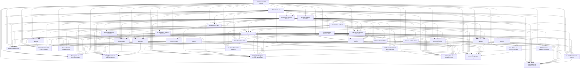

# Dependency DAG

```mermaid
graph TD
  S01["S01 Trusted Context Resolver"]
  S02["S02 Permission and Entitlement Guard"]
  S01 --> S02
  S03["S03 Evidence-Grounded Retrieval"]
  S01 --> S03
  S02 --> S03
  S04["S04 Safe Action Planner"]
  S01 --> S04
  S02 --> S04
  S03 --> S04
  S05["S05 Approval and Step-Up Coordinator"]
  S01 --> S05
  S02 --> S05
  S04 --> S05
  S06["S06 Idempotent Tool Executor"]
  S01 --> S06
  S02 --> S06
  S04 --> S06
  S05 --> S06
  S07["S07 Agent Evidence Recorder"]
  S01 --> S07
  S08["S08 Redaction and Disclosure Policy"]
  S01 --> S08
  S02 --> S08
  S09["S09 Freshness and Trust Evaluator"]
  S03 --> S09
  S07 --> S09
  S10["S10 Exception Prioritizer"]
  S01 --> S10
  S03 --> S10
  S09 --> S10
  S11["S11 Notification and Escalation Router"]
  S01 --> S11
  S02 --> S11
  S10 --> S11
  S12["S12 Agent Run State Machine"]
  S01 --> S12
  S13["S13 Model and Cost Router"]
  S01 --> S13
  S02 --> S13
  S07 --> S13
  S09 --> S13
  S14["S14 Explicit Preference Memory"]
  S01 --> S14
  S02 --> S14
  S08 --> S14
  S15["S15 Offline and Replay Awareness"]
  S03 --> S15
  S09 --> S15
  S16["S16 Country-Pack Provenance Resolver"]
  S01 --> S16
  S03 --> S16
  S09 --> S16
  S17["S17 Daily Operating Brief"]
  S01 --> S17
  S02 --> S17
  S03 --> S17
  S07 --> S17
  S08 --> S17
  S09 --> S17
  S10 --> S17
  S18["S18 Cross-Domain Root-Cause Trace"]
  S01 --> S18
  S02 --> S18
  S03 --> S18
  S07 --> S18
  S09 --> S18
  S19["S19 Cash Exception Triage"]
  S01 --> S19
  S02 --> S19
  S03 --> S19
  S08 --> S19
  S09 --> S19
  S10 --> S19
  S18 --> S19
  S20["S20 Reconciliation Match Suggestion"]
  S01 --> S20
  S02 --> S20
  S03 --> S20
  S07 --> S20
  S09 --> S20
  S19 --> S20
  S21["S21 Inventory Risk and Replenishment"]
  S01 --> S21
  S02 --> S21
  S03 --> S21
  S09 --> S21
  S15 --> S21
  S22["S22 Inventory Variance Investigation"]
  S01 --> S22
  S02 --> S22
  S03 --> S22
  S09 --> S22
  S15 --> S22
  S18 --> S22
  S23["S23 PO Receipt Invoice Variance"]
  S01 --> S23
  S02 --> S23
  S03 --> S23
  S04 --> S23
  S09 --> S23
  S18 --> S23
  S24["S24 Supplier Commitment and Payment Risk"]
  S01 --> S24
  S02 --> S24
  S03 --> S24
  S08 --> S24
  S09 --> S24
  S10 --> S24
  S23 --> S24
  S25["S25 Close Blocker Navigator"]
  S01 --> S25
  S02 --> S25
  S03 --> S25
  S07 --> S25
  S09 --> S25
  S10 --> S25
  S18 --> S25
  S26["S26 Compliance Readiness Explanation"]
  S01 --> S26
  S02 --> S26
  S03 --> S26
  S08 --> S26
  S09 --> S26
  S16 --> S26
  S25 --> S26
  S27["S27 Payroll Readiness and Variance"]
  S01 --> S27
  S02 --> S27
  S03 --> S27
  S08 --> S27
  S09 --> S27
  S16 --> S27
  S18 --> S27
  S25 --> S27
  S26 --> S27
  S28["S28 Adoption and Onboarding Coach"]
  S01 --> S28
  S02 --> S28
  S03 --> S28
  S07 --> S28
  S09 --> S28
  S13 --> S28
  S14 --> S28
  S17 --> S28
  A1["Stoquify Command Agent"]
  S01 --> A1
  S02 --> A1
  S03 --> A1
  S04 --> A1
  S07 --> A1
  S08 --> A1
  S09 --> A1
  S10 --> A1
  S11 --> A1
  S12 --> A1
  S17 --> A1
  S18 --> A1
  A2["Stoquify Exception and Action Orchestrator"]
  S01 --> A2
  S02 --> A2
  S03 --> A2
  S04 --> A2
  S05 --> A2
  S06 --> A2
  S07 --> A2
  S08 --> A2
  S09 --> A2
  S10 --> A2
  S11 --> A2
  S12 --> A2
  S13 --> A2
  S15 --> A2
  S16 --> A2
  A3["Stoquify Cash and Reconciliation Agent"]
  S01 --> A3
  S02 --> A3
  S03 --> A3
  S04 --> A3
  S05 --> A3
  S07 --> A3
  S08 --> A3
  S09 --> A3
  S10 --> A3
  S11 --> A3
  S12 --> A3
  S18 --> A3
  S19 --> A3
  S20 --> A3
  S25 --> A3
  A4["Stoquify Inventory and Replenishment Agent"]
  S01 --> A4
  S02 --> A4
  S03 --> A4
  S04 --> A4
  S05 --> A4
  S07 --> A4
  S08 --> A4
  S09 --> A4
  S10 --> A4
  S11 --> A4
  S12 --> A4
  S15 --> A4
  S18 --> A4
  S21 --> A4
  S22 --> A4
  S23 --> A4
  S24 --> A4
  A5["Stoquify Purchasing and Accounts Payable Agent"]
  S01 --> A5
  S02 --> A5
  S03 --> A5
  S04 --> A5
  S05 --> A5
  S07 --> A5
  S08 --> A5
  S09 --> A5
  S10 --> A5
  S11 --> A5
  S12 --> A5
  S16 --> A5
  S18 --> A5
  S23 --> A5
  S24 --> A5
  A6["Stoquify Close and Compliance Agent"]
  S01 --> A6
  S02 --> A6
  S03 --> A6
  S04 --> A6
  S05 --> A6
  S07 --> A6
  S08 --> A6
  S09 --> A6
  S10 --> A6
  S11 --> A6
  S12 --> A6
  S13 --> A6
  S16 --> A6
  S18 --> A6
  S19 --> A6
  S20 --> A6
  S23 --> A6
  S24 --> A6
  S25 --> A6
  S26 --> A6
  A7["Stoquify Platform Assurance Agent"]
  S01 --> A7
  S02 --> A7
  S03 --> A7
  S07 --> A7
  S08 --> A7
  S09 --> A7
  S10 --> A7
  S11 --> A7
  S12 --> A7
  S13 --> A7
  S16 --> A7
  A8["Stoquify Customer Success and Adoption Agent"]
  S01 --> A8
  S02 --> A8
  S03 --> A8
  S04 --> A8
  S07 --> A8
  S08 --> A8
  S09 --> A8
  S10 --> A8
  S11 --> A8
  S12 --> A8
  S13 --> A8
  S14 --> A8
  S17 --> A8
  S28 --> A8
  A9["Stoquify Payroll and Workforce Agent"]
  S01 --> A9
  S02 --> A9
  S03 --> A9
  S04 --> A9
  S05 --> A9
  S07 --> A9
  S08 --> A9
  S09 --> A9
  S10 --> A9
  S11 --> A9
  S12 --> A9
  S13 --> A9
  S16 --> A9
  S18 --> A9
  S25 --> A9
  S26 --> A9
  S27 --> A9
```

The validator checks skill dependency cycles separately. Agent compositions terminate at agents and do not feed back into skills.
