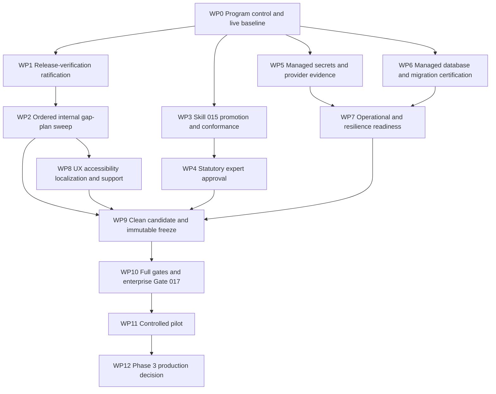

# Stoquify Production-Unblocking Execution Roadmap

**Date:** 22 August 2026  
**Workspace:** `E:\ohada saas\Focused projects\stoquify`  
**Current branch:** `codex/service-boundary-burndown`  
**Current commit:** `7736416bd57fc45d3b618ba397850d39320ac3e1`  
**Program posture:** Internal engineering may continue; pilot and production remain fail closed  
**Program controller:** One persistent Goal Agent with human-controlled statutory, infrastructure, security, operational, and release decisions

## 1. Executive decision

The production-unblocking prompt should be executed as a controlled evidence program, not as one broad implementation run.

The repository is materially closer to release than the prompt's initial blocker list suggests:

- The current Git worktree is clean at commit `7736416bd57fc45d3b618ba397850d39320ac3e1`. The inherited dirty-tree blocker must be revalidated and then closed as stale; it should not trigger reconstruction work without a new dirty-state finding.
- The current raw-error gate reports `0` active violations and `75` allowed findings. The earlier eight active findings are stale; this becomes a preservation ratchet, not a remediation work package.
- The application production build was previously recorded ready, but it must be rerun and bound to the final frozen candidate.
- The Country Adapter Pilot already passes `16/16`. Skill 015 must not rebuild the Cameroon sandbox adapter. Its remaining work is production promotion evidence.
- Statutory country-pack readiness is `11/12`; the sole current blocker is `source_artifact_expert_approval`.
- Migration readiness is `8/9`; thirteen destructive clauses in the accounting/auth baseline migration lack exact-hash approval.
- The enterprise release blocker report records B01, B02, and B05 as ready, while B03, B04, and B06–B12 remain blocked or not started.

The real critical path is therefore:

`live baseline -> remaining internal control sweep -> country-adapter external proof -> statutory approval + managed secrets + managed database -> operations/accessibility -> clean freeze -> enterprise gate -> controlled pilot -> final production decision`

## 2. Program rules

1. Only one code-changing work package may be active at a time.
2. External evidence collection may proceed in parallel, but it cannot promote the program independently.
3. A HIGH or CRITICAL invariant failure stops promotion.
4. The implementer cannot self-certify statutory, security, database, accessibility, operational, or final release approval.
5. Every gate must identify its source, environment, candidate commit, artifact hash, limitation, owner, and decision time.
6. Static, local, fixture, and sandbox evidence may support engineering readiness but cannot be renamed production proof.
7. Previously closed work stays closed unless a current regression is reproduced.
8. Historical reports are superseded with dated reports; they are never silently overwritten.

## 3. Approval states

| State | Meaning | Who may grant it |
|---|---|---|
| `INTERNAL_ENGINEERING_READY` | Code, tests, and internal gates are ready for continued development. | Engineering verification owner |
| `EXTERNAL_EVIDENCE_REQUIRED` | Internal implementation is ready, but qualified or environment-owned proof is missing. | Program controller records it; no production effect |
| `PRODUCTION_CONTROL_VERIFIED` | A named independent reviewer has validated the production-shaped control evidence. | Qualified reviewer for that control domain |
| `PILOT_AUTHORIZED` | A bounded tenant/country/capability pilot may run with rollback and monitoring. | Product, security, statutory, operations, and release authorities |
| `PRODUCTION_AUTHORIZED` | The exact frozen candidate may enter controlled production. | Final independent release authority only |

## 4. Required owner roster

WP0 must assign named people, backups, accepted-at dates, and escalation references for:

- program controller and executive sponsor;
- product owner;
- engineering/release manager;
- application-security authority;
- managed-secrets owner;
- database and migration owner;
- SRE/observability owner;
- rollout owner and backup;
- rollback owner and backup;
- support owner and backup;
- pilot owner and backup;
- security-incident owner and backup;
- statutory country-pack owner;
- qualified Cameroon statutory/authority reviewer;
- independent statutory checker;
- Cameroon DGI/provider relationship owner;
- accessibility/localization reviewer;
- independent final release reviewer.

Role labels are insufficient. The release gates require attributable identities and approval references.

## 5. Dependency roadmap



WP3–WP6 evidence gathering may overlap after WP0. WP9 is the hard merge point: no candidate freeze occurs until all required upstream controls are either verified or explicitly excluded from the bounded pilot scope by an authorized decision.

## 6. Work-package summary

| WP | Work package | Primary outcome | Depends on | Promotion gate |
|---|---|---|---|---|
| 0 | Program control and live baseline | Authoritative blocker/owner/evidence register | Current repository | G0 Baseline accepted |
| 1 | Release-verification ratification | Reusable migration, build, and authenticated-smoke proof | WP0 | G1 Verification foundation current |
| 2 | Ordered internal gap-plan sweep | Remaining product/control gaps closed without reopening completed work | WP1 | G2 Internal control suite ready |
| 3 | Skill 015 promotion and external conformance | Cameroon adapter remains fail closed but is ready for qualified/external assessment | WP0, WP1 | G3 Adapter conformance ready |
| 4 | Statutory expert approval | Valid version-bound expert decision and independent verification | WP3 | G4 Statutory authority verified |
| 5 | Managed secrets/provider evidence | Managed references, rotation, callbacks, external sandbox proof | WP0 | G5 Security/provider verified |
| 6 | Managed database/migration certification | Approved target, destructive-risk decisions, migration/restore proof | WP0 | G6 Database control verified |
| 7 | Operations and resilience | CI, schedulers, alerts, telemetry, runbooks, DR, owner acceptance | WP5, WP6 | G7 Operational readiness verified |
| 8 | UX, accessibility, localization, support | Authenticated EN/FR critical journeys and support readiness | WP2, WP7 environment | G8 Human-facing readiness verified |
| 9 | Clean immutable freeze | Exact candidate, manifest, hashes, clean tree, ownership | WP2, WP4–WP8 | G9 Freeze accepted |
| 10 | Full release verification and Gate 017 | Complete policy chain and enterprise decision on frozen candidate | WP9 | G10 `PILOT_AUTHORIZED` or `NO_GO` |
| 11 | Controlled pilot | Monitored bounded pilot with reconciliation and rollback proof | WP10 | G11 Pilot accepted |
| 12 | Phase 3 decision | Artifact-bound 34-check final decision | WP11 | G12 `PRODUCTION_AUTHORIZED` or `NO_GO` |

## 7. Detailed execution plan

### WP0 — Program control and live source baseline

**Objective:** Establish the authoritative production-unblocking register before changing code or requesting external evidence.

**Steps:**

1. Record branch, HEAD, upstream, worktree state, and ownership snapshot.
2. Read the current WP8 decision, enterprise blocker status, external-evidence intake report, statutory readiness, migration readiness, raw-error readiness, evidence index, package scripts, and graph report.
3. Create stable blocker IDs mapped to enterprise B01–B12.
4. For every blocker, record severity, business impact, existing evidence, missing evidence, technical owner, human approver, dependencies, closure test, rollback requirement, and status.
5. Assign the named owner roster and obtain owner acceptance references.
6. Reproduce the Windows generated-report lock. If absent in a clean runner, close it as an environment-specific stale blocker and retain the CI prevention control.
7. Re-run the raw-error and Git cleanliness checks. Close the earlier dirty/raw-error blockers only if the current clean/zero-active results reproduce.
8. Select the proposed pilot country and scope. The current technical candidate is Cameroon DGI, but steering approval must make that choice explicit.

**Artifacts:**

- `docs/production-readiness/stoquify-production-unblocking/EXECUTION_REGISTER.md`
- `docs/production-readiness/stoquify-production-unblocking/execution-register.json`
- `evidence/WP-00/ownership-snapshot.json`
- `evidence/WP-00/blocker-gate-map.json`
- `evidence/WP-00/owner-acceptance-register.json`
- dated WP0 decision report

**Exit criteria:**

- no unowned blocker;
- no ambiguous decision authority;
- current dirty-tree, raw-error, and file-lock truth recorded;
- pilot country/scope decision recorded;
- later packages remain unauthorized until G0 passes.

### WP1 — Release-verification foundation ratification

**Skill:** `aqstoqflow-release-verification-foundation`

**Current state:** A previous G0 report records `PASS_DEVELOPMENT_G0_PRODUCTION_BLOCKED`. Ratify it against the current commit instead of rebuilding the harness.

**Steps:**

1. Verify Prisma schema and current migration state.
2. Confirm a production-mode application build completes on the current tree.
3. Reuse the authenticated EN/FR Edge/Playwright tenant fixture for finance reconciliation, accounting close, owner war room, manager action center, Cash Command, compliance, payroll, and POS critical routes.
4. Verify permission-denied, no-active-organization, empty, error, degraded, and stale states.
5. Save report hashes and bind results to the current commit.

**Exit criteria:**

- authenticated smoke is real, not a redirect probe;
- build and migration checks are candidate-bound;
- the verification harness is reusable by every later UI/release package.

### WP2 — Ordered internal implementation-gap sweep

Run these skills in order. Each child skill must produce a dated `what-next/` report, files changed, focused tests, failures, residual risks, and next handoff.

#### WP2.1 — Reconciliation proof launcher

Skill: `aqstoqflow-reconciliation-proof-launcher`

- Add existing `payment.transaction` proof launch to reconciliation transaction rows.
- Reuse Cash Command proof contracts.
- Preserve `payments.reconciliation.read`, redaction, loading, unavailable, error, and denial states.
- Do not create a new proof domain.

#### WP2.2 — Close invalidation completion

Skill: `aqstoqflow-close-invalidation-completion`

- Do not reopen payroll approval/posting/payment-release invalidation already closed by Payroll Trust Spine unless regression evidence exists.
- Verify those hooks still pass.
- Complete only remaining compliance/fiscal, country-pack/statutory-version, and certify/export entitlement invalidation gaps.
- Add grouped stale-source visibility without changing close-pack truth semantics.

#### WP2.3 — Workflow assurance observe pilot

Skill: `aqstoqflow-workflow-assurance-observe-pilot`

- Register current definitions in the target test environment.
- Produce seeded incidents and prove runtime table presence.
- Keep enforcement disabled.
- Verify Control Tower and Manager Action Center with authenticated smoke.

#### WP2.4 — Access boundary hardening

Skill: `aqstoqflow-access-boundary-hardener`

- Verify or implement signed, expiring, revocation-ready public receipt access.
- Verify item APIs require `inventory.items.read`, not only organization membership.
- Preserve tenant scope and compatibility decisions.

#### WP2.5 — Provider health and reconciliation operations

Skill: `aqstoqflow-provider-health-recon-ops`

- Add or verify provider health, statement freshness, callback lag, credential/setup state, unresolved exceptions, and settlement status.
- Add reconciliation run dedupe/concurrency controls.
- Provide outage, duplicate, replay/tamper, stale-source, high-volume import, certificate-drift, and suspense-rollback fixtures/runbooks.
- Use partial-data envelopes so provider degradation cannot blank command surfaces.

#### WP2.6 — Dashboard daily-habit completion

Skill: `aqstoqflow-dashboard-daily-habit-completion`

- Complete stock-to-cash, close-readiness journey, and role-specific daily/weekly digest only after proof, invalidation, and provider read models exist.
- Minimize finance read models per route.
- Preserve role redaction, semantic tokens, bilingual copy, and truthful degraded states.

#### WP2.7 — Narrow enforcement preparation

Skill: `aqstoqflow-narrow-enforce-external-readiness`

- Prepare one workflow-assurance check and one module-entitlement surface for a tenant-ring pilot.
- Require seeded failure, owner, proof/source hash, corrective route, rollback, and authenticated browser evidence.
- Do not enable global hard enforcement.

**WP2 exit criteria:**

- all seven skill reports exist;
- no completed historical proposal was unnecessarily reopened;
- service boundaries, tenant isolation, RBAC, redaction, business events, evidence semantics, and release gates remain green;
- enforcement remains scoped and reversible.

### WP3 — Skill 015 Country Adapter promotion and conformance

**Skill:** `015-aqstoqflow-country-adapter-pilot`

**Current state:** Cameroon DGI sandbox pilot is internally ready at `16/16`; production authority certification is false.

**Do not rebuild:** shared adapter contract, sandbox registration, tenant isolation, fresh auth/RBAC, maker-checker, external credential references, redaction, expiry/rotation fields, disable control, fixtures, events, health panel, migration, and pilot runbook.

**Close the four live production blockers:**

1. `official_dgi_technical_contract_not_validated`
2. `independent_expert_production_review_not_attached`
3. `regulator_production_credentials_not_provisioned`
4. `external_sandbox_conformance_not_executed`

**Steps:**

1. Obtain the authoritative DGI technical contract through an official or contractually authorized channel.
2. Hash and register its version, date, source reference, effective date, authentication scheme, schemas, error codes, rate limits, test endpoints, callback rules, and change-notification process.
3. Compare it with the current `ComplianceAdapter` contract and produce a compatibility/gap matrix.
4. Implement only verified protocol deltas behind the existing adapter boundary.
5. Preserve production fail-closed behavior until WP4 and WP5 pass.
6. Run external sandbox acceptance, rejection, outage, timeout, rate-limit, duplicate, replay, invalid signature, and credential-expiry cases.
7. Capture request/response references with secrets and personal data redacted.
8. Verify tenant disablement does not affect POS, stock, cash, ledger, or receipt truth.

**Exit criteria:**

- official contract validated;
- adapter gap matrix closed;
- external sandbox conformance passed;
- no production credential value stored in repository evidence;
- adapter remains disabled for production pending expert/security approval.

### WP4 — Statutory expert-review packet and approval

**Current gate:** `11/12`; blocker `source_artifact_expert_approval`.

**Steps:**

1. Appoint a qualified Cameroon reviewer and an independent checker.
2. Record qualification, jurisdiction, appointment, scope, and conflict declaration.
3. Freeze the exact source artifact and country-pack version being reviewed.
4. Prepare source hashes, effective dates, interpretation table, parameter table, golden fixtures, edge cases, unsupported capabilities, and production limitations.
5. Require the reviewer to recompute the source digests rather than accept generated values blindly.
6. Record a decision for every required fixture family.
7. Obtain a signed approval artifact tied to the country-pack version, candidate commit, scope, and expiry.
8. Have the independent checker verify identity, signature, artifact hash, scope, consistency, and expiry.
9. Promote runtime authority only through the existing gate; never by editing a status flag manually.

**Cannot be automated:** reviewer qualification, legal interpretation, conflict assessment, signed decision, and final checker acceptance.

**Exit criteria:** production country-pack gate passes with a current, verified, version-bound approval; unsupported capabilities remain disabled.

### WP5 — Managed secrets, credentials, and provider/authority evidence

**Enterprise blockers:** B04 and B07 plus the DGI credential/conformance portions of Skill 015.

**Steps:**

1. Inventory every production secret and assign service/security owners.
2. Provision independent managed references for public identity, receipt signing, history cursor, statement delivery, accountant invite, authentication, database, Redis, OAuth, email, upload, monitoring, workflow assurance, and adapter credentials as applicable.
3. Record only vault/provider references and version IDs; never record values.
4. Prove environment separation, least privilege, activation, rotation, old-version rejection, revocation, and emergency rotation.
5. Verify public HTTPS application URL and live delivery-channel configuration.
6. Run signed callback, replay, invalid-auth, timeout, retry, dead-letter, acknowledgement, settlement, rejection, and reconciliation scenarios.
7. Obtain security-authority approval bound to the credential register hash.

**Exit criteria:** release-secret preflight passes; credential-rotation gate passes; provider/authority evidence is current and redacted; no secret values appear in artifacts.

### WP6 — Managed database and migration certification

**Current gate:** migration readiness `8/9`; thirteen exact-hash destructive findings remain unapproved.

**Steps:**

1. Assign database owner, runtime identity owner, migration executor, checker, and rollback owner.
2. Produce the exact-hash destructive-migration review packet for all thirteen findings in `20260611130000_accounting_auth_baseline_bridge`.
3. For each finding, document source/target semantics, retained data, consequence, backup, restore, rollback, and approval or redesign decision.
4. Prefer an additive bridge or verified archival/copy step if data loss cannot be independently accepted.
5. Provision an approved managed PostgreSQL target and record target attestation without exposing credentials.
6. Replay all migrations from empty.
7. Upgrade a sanitized production-shaped snapshot.
8. Verify tenant isolation, constraints, triggers, immutable history, monetary precision, indexes, transaction isolation, concurrency, idempotency, and failure rollback.
9. Verify migration history directly on the managed target.
10. Create and restore a backup; test point-in-time recovery where available; record RPO/RTO.
11. Reconcile row counts, balances, document hashes, journal/source links, and tenant partitions before and after migration.

**Exit criteria:** destructive findings are exact-hash approved or safely redesigned; production preflight and direct history health pass; backup/restore and reconciliation evidence are independently accepted.

### WP7 — Operational, observability, resilience, and DR readiness

**Enterprise blocker:** B08.

**Steps:**

1. Bind protected CI to the candidate branch and artifact.
2. Provision managed scheduler/workload identities and prove invalid-auth rejection.
3. Produce three successful scheduled execution windows with fresh heartbeats.
4. Verify metrics, structured logs, traces, queues, dead letters, latency, capacity, cost, and tenant-safe redaction.
5. Exercise alert delivery, acknowledgement, retry, escalation, dead-letter, recovery, and secret rotation.
6. Exercise provider outage, database degradation, worker failure, partial dependency failure, rollback, feature disablement, and disaster recovery.
7. Complete rollout, rollback, support, pilot, security-incident, and on-call runbooks.
8. Obtain primary and backup owner acceptance for each operational role.

**Exit criteria:** operational release gate passes; runbooks are executable; alert/scheduler evidence is production-shaped; DR and rollback meet approved RPO/RTO.

### WP8 — UX, accessibility, localization, and support readiness

**Steps:**

1. Define critical role journeys for owner, manager, accountant, cashier, payroll operator, compliance operator, support operator, and administrator.
2. Run authenticated English and French browser evidence for each in-scope journey.
3. Test keyboard path, focus management, screen-reader behavior, zoom, contrast, responsive layouts, errors, loading, empty, degraded, stale, retry, and permission-denied states.
4. Verify fresh-auth prompts and sensitive-data redaction.
5. Verify module/tenant denials are truthful and recoverable.
6. Prepare onboarding, training, known-limitations, operational help, and escalation documentation.
7. Obtain independent accessibility, localization, product, support, and security reviews.

**Exit criteria:** critical journeys pass saved authenticated browser/accessibility evidence; support materials and owner acceptance are complete.

### WP9 — Clean candidate and immutable freeze

**Enterprise blockers:** B09 and B10.

**Steps:**

1. Stop feature work for the candidate.
2. Confirm clean worktree and attributable history.
3. Rerun raw-error gate and require zero active violations.
4. Build the exact candidate and calculate source, manifest, artifact, browser-report, CI, and evidence-bundle hashes.
5. Create an immutable freeze manifest for every release-relevant file.
6. Verify no post-freeze runtime drift.
7. Obtain product and security approvals bound to the freeze hashes.
8. Bind six operational owner assignments and escalation references.

**Exit criteria:** clean frozen commit, reproducible artifact, zero unexplained drift, complete owner/governance approvals.

### WP10 — Full release verification and Enterprise Gate 017

**Steps:**

1. Run focused gates first and save their outputs to unique evidence paths.
2. Run the monolithic policy chain in a clean CI/release workspace.
3. Run `verify:release` with managed references and the managed database target.
4. Run build, migrations, direct history health, secrets, statutory, provider, workflow assurance, accessibility/browser, evidence integrity, rollback, and security gates on the frozen commit.
5. Submit the frozen evidence bundle to `017-aqstoqflow-enterprise-release-gate`.
6. Rerun the 23-check Phase 2B entry gate only after B01–B10 and Gate 017 pass.

**Decision:** `PILOT_AUTHORIZED`, `CONDITIONAL_PILOT`, or `NO_GO`. This is not yet the final production decision.

### WP11 — Controlled pilot

**Steps:**

1. Activate only the approved tenant, country, role, capability, and transaction allowlists.
2. Keep kill switches, adapter disablement, rollback, and manual fallback available.
3. Monitor adapter health, credential expiry, queue age, callbacks, rejects, retries, fiscal evidence, ledger/source links, exceptions, reconciliation, and close blockers.
4. Reconcile every pilot transaction and retain source/provider evidence.
5. Exercise at least one controlled disable/rollback rehearsal.
6. Record user/support feedback and incidents without widening the pilot.
7. Complete pilot acceptance with product, statutory, security, database, operations, finance, and support owners.

**Exit criteria:** successful bounded pilot, zero unresolved HIGH/CRITICAL incidents, complete reconciliation, tested rollback, accepted pilot report.

### WP12 — Phase 3 final production decision

**Steps:**

1. Freeze the post-pilot candidate and evidence bundle.
2. Re-run all release gates on the exact production candidate.
3. Run the artifact-bound 34-check Phase 3 decision.
4. Verify statutory approval and credentials have not expired or changed.
5. Verify migration target, backups, scheduler windows, alerts, owner assignments, and runbooks remain current.
6. Convene an independent final review.
7. Issue `GO`, `CONDITIONAL_GO`, or `NO_GO` with scope, conditions, expiry, rollback trigger, and named authorities.

Only `GO` may set `PRODUCTION_AUTHORIZED`.

## 8. Gate catalogue

| Gate | Type | What it proves | Cannot prove |
|---|---|---|---|
| G0 Baseline | Evidence/manual | Current blockers, owners, scope, and source truth | Product correctness |
| G1 Verification foundation | Automated + browser | Build, migrations, authenticated route behavior | Legal or provider approval |
| G2 Internal control suite | Automated/integration | Service, access, proof, invalidation, assurance, provider-read-model behavior | External authority conformance |
| G3 Adapter conformance | Contract/external sandbox | Current adapter matches official technical contract and sandbox behavior | Legal correctness or production authority |
| G4 Statutory authority | Qualified human | Country-pack interpretation and evidence are approved for defined scope | Infrastructure readiness |
| G5 Security/provider | Managed environment + human | Secrets, credentials, callbacks, rotation, and provider evidence | Database migration safety |
| G6 Database | Managed environment + human | Migration, backup/restore, rollback, history, and data integrity | Operational ownership |
| G7 Operations | Production-shaped rehearsal | CI, scheduler, alerting, observability, DR, runbooks, owners | Legal approval |
| G8 Human-facing readiness | Browser + qualified review | Accessibility, localization, recovery, support readiness | Back-end correctness by itself |
| G9 Freeze | Cryptographic/governance | Candidate immutability, ownership, hashes, approvals | Runtime pilot success |
| G10 Enterprise/pilot | Composite independent gate | Candidate is safe for a bounded pilot | General production readiness |
| G11 Pilot acceptance | Live bounded evidence | Real controlled behavior, reconciliation, support, rollback | Unbounded production safety |
| G12 Phase 3 | Final independent decision | Exact candidate is authorized for defined production scope | Future versions or expired approvals |

## 9. Evidence-acquisition methods

### Statutory evidence

- Use an official source register and immutable review packet.
- Require reviewer and checker independence.
- Bind signatures to source hashes, country-pack version, candidate commit, scope, and expiry.
- If no qualified reviewer is available, keep production authority disabled; do not replace expert review with AI analysis.

### Provider/authority evidence

- Use a named provider relationship owner.
- Obtain official technical documentation and sandbox access through authorized channels.
- Exercise externally observable acceptance and failure cases.
- Store redacted request/response references and provider acknowledgements.
- If the provider has no sandbox, negotiate a supervised certification window or keep the adapter disabled.

### Managed-infrastructure evidence

- Use provider-native references for databases, secrets, scheduler workloads, backups, alerts, and deployments.
- Require owner acceptance and independent verification.
- Keep credentials out of evidence artifacts.
- Use sanitized production-shaped data and explicit target validation.

### Operational evidence

- Produce runbook-driven rehearsals rather than screenshots alone.
- Capture run IDs, timestamps, alert acknowledgements, recovery references, and reconciliation results.
- Require primary and backup owners to accept their roles before release.

## 10. Standard verification ladder

Discover exact commands from `package.json` and save outputs to package-specific evidence paths.

```powershell
npm run prisma:validate
npm run typecheck
npm run build:app
npm run service:boundary:fail
npm run purchasing:ap:gate
npm run payroll:presence:gate
npm run payroll:trust-spine:gate
npm run country:adapter:pilot:gate
npm run statutory:country-pack:gate
npm run report:trust:export:gate
npm run offline:pos:replay:gate
npm run workflow:assurance:runtime-check
npm run workflow:assurance:release-gate
npm run release:secrets:preflight:release
npm run prisma:migration:release:preflight
npm run prisma:migration:history:health
npm run release:evidence:gate:release
npm run policy:gates
npm run verify:release
```

Each work package runs focused unit, integration, negative, tenant, RBAC, idempotency, concurrency, rollback, provider-contract, and browser/accessibility tests in proportion to its boundary before broad gates.

## 11. Evidence directory contract

```text
docs/production-readiness/stoquify-production-unblocking/
  EXECUTION_REGISTER.md
  execution-register.json
  evidence/
    WP-00/
    WP-01/
    ...
    WP-12/
  statutory/
  providers/
  infrastructure/
  migrations/
  operations/
  accessibility/
  pilot/
  final-release/
```

Every WP evidence folder must contain:

- decision markdown;
- machine-readable verification JSON;
- command/result manifest;
- artifact hashes;
- files changed;
- owner/reviewer references;
- failures, skipped checks, and limitations;
- next-package authorization or explicit block.

## 12. Stop conditions

Stop the active package or keep it design-only if any of the following occurs:

- unowned HIGH/CRITICAL blocker;
- cross-tenant read/write or client-controlled tenant/actor/permission/fresh-auth fact;
- secret value appears in source, output, logs, screenshots, or evidence;
- destructive database target is unverified or not explicitly approved;
- statutory source/version/reviewer/signature is missing, expired, or mismatched;
- provider sandbox result is absent or cannot be authenticated;
- real-money, legal, fiscal, payroll, email, or authority effect lacks explicit authorization;
- ledger/source link, idempotency, rollback, reconciliation, or close-invalidation evidence fails;
- authenticated browser/accessibility proof is replaced by unauthenticated redirects or static assertions;
- implementer attempts to self-certify an independent gate;
- post-freeze drift or evidence hash mismatch appears;
- rollback or support ownership is unavailable.

## 13. Final definition of done

The system is completely unblocked only when:

1. all live blockers have named owners, evidence contracts, closure tests, and signed decisions;
2. all required internal gap-plan skills have current passing reports;
3. the Cameroon adapter matches the validated official contract and passes external sandbox conformance;
4. the exact country-pack version has current qualified expert approval and independent checker verification;
5. production secrets and credentials are managed, rotated, least-privileged, and redacted;
6. the managed database passes migration, history, isolation, concurrency, rollback, backup/restore, and reconciliation certification;
7. CI, schedulers, alerts, telemetry, DR, runbooks, and named operational owners are proven;
8. authenticated EN/FR critical journeys pass accessibility, localization, permission, and recovery review;
9. the release candidate is clean, attributable, reproducible, hashed, and immutable;
10. the complete policy chain and `verify:release` pass on that exact candidate;
11. Enterprise Gate 017 and Phase 2B authorize a bounded pilot;
12. the pilot completes with full reconciliation, incident closure, support evidence, and rollback proof; and
13. the independent 34-check Phase 3 review issues `GO` for the exact production scope.

## 14. Immediate next action

Run WP0 only. Do not start new product implementation first.

WP0 should create the production-unblocking register, assign named owners, revalidate the clean-tree/raw-error/file-lock facts, approve Cameroon as the pilot country and capability scope, and issue the first explicit decision:

- `APPROVED_FOR_WP1_AND_EXTERNAL_EVIDENCE_COLLECTION`, or
- `BLOCKED` with exact unowned prerequisites.
