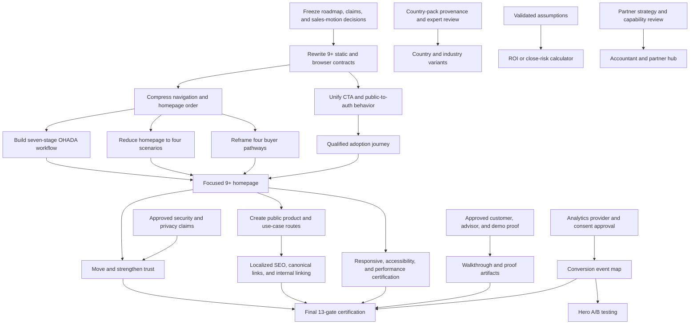

# Stoquify Landing Page Final 9+ Completion Plan

Date: 2026-07-20  
Status: Implementation-ready planning document  
Implementation changes in this pass: None

## Governing Sources

1. `docs/landing page/STOQUIFY_LANDING_PAGE_9_PLUS_ROADMAP_2026-07-19.md`
2. `docs/landing page/STOQUIFY_LANDING_PAGE_9_PLUS_COMPLETENESS_AUDIT_2026-07-20.md`
3. Current landing implementation under `app/[locale]/(home)` and `components/landing`
4. Current EN/FR public copy in `messages/en.json` and `messages/fr.json`
5. Existing landing tests, browser smokes, release reports, and Product Command evidence

## Executive Decision

The landing page can reach final 9+ status without another broad visual redesign. The remaining work is a controlled closure program focused on:

1. conversion truth;
2. information-architecture compression;
3. a simple sale-to-close workflow;
4. earlier and deeper trust;
5. public product-depth routes;
6. native-quality French;
7. localized SEO and privacy-safe measurement;
8. production-like accessibility and performance certification.

The page must not receive a 9+ label by averaging visual scores. A failed hard acceptance criterion remains a blocker even when the page looks polished.

Current closure position:

- **Complete roadmap items:** 4
- **Immediate, code-controlled items:** 11
- **Dependency-blocked items:** 7
- **Deferred optional experiments:** 2
- **Current hard-criteria readiness:** 6.5/10
- **Required final state:** all 13 hard acceptance criteria pass, with no Critical or High launch risk left open

## Closure Principles

- Subtract before adding.
- Preserve the current premium visual language and Product Command proof.
- Keep POS, inventory, purchasing, payments, reconciliation, OHADA accounting, and close as the acquisition core.
- Present HRIS/payroll, compliance, automation, production, and intelligence as controlled extensions.
- Permit `/register` only at the qualified adoption handoff until self-service is genuinely approved.
- Move depth to public product routes instead of hiding it or leaving it on the homepage.
- Publish only approved security, statutory, customer, advisor, or performance claims.
- Treat EN and FR as equal release surfaces.
- Keep each implementation slice independently testable and reversible.
- Do not certify 9+ while a hard gate is Partial, Missing, or supported only by stale evidence.

## Final Gap-Closure Matrix

| Roadmap item | Closure state | What must happen | Dependency / evidence |
| --- | --- | --- | --- |
| P0.1 Hero Category Reset | **Complete** | Preserve the current category-first hero and run the five-reader comprehension check | Representative reader results |
| P0.2 CTA And Sales-Motion Alignment | **Immediate** | Route the scenario CTA to adoption, replace workspace-creation language, and enforce one public conversion intent | No external dependency |
| P0.3 Public Proof Block | **Complete** | Preserve the early real screenshot and provenance | Existing Product Command evidence |
| P0.4 Sample And Demo Boundaries | **Complete** | Preserve sample and redacted-product labels; continue leakage review | Existing provenance and public-asset review |
| P0.5 Public-To-Auth Link Cleanup | **Immediate** | Inventory every public link, permit `/register` only in adoption, and prove the unauthenticated path | No external dependency |
| P0.6 First-Page Density Compression | **Immediate** | Reduce navigation, workflow, scenarios, and standalone deep sections; move depth to public routes | Product-page route skeleton |
| P0.7 Fresh Production Readiness | **Immediate** | Add full EN/FR tablet route evidence, reduced-motion proof, and rerun production build and browser checks | Stable production-like preview |
| P1.1 Buyer Pathways | **Immediate** | Use four paths with job, pain, outcome, proof, and CTA; include multi-branch leadership | Current implemented capabilities |
| P1.2 OHADA-Ready Workflow Visual | **Immediate** | Replace the 17-card module carousel with a seven-stage sale-to-close visual visible without interaction | Approved plain-business terminology |
| P1.3 Product Proof Upgrade | **Complete** | Keep the real screenshot responsive and unobstructed | Existing screenshot smoke |
| P1.4 Security, Privacy, Compliance Trust Path | **Dependency-Blocked** | Move trust earlier, add a public route, and publish only approved isolation, redaction, recovery, data-boundary, and support claims | Security, privacy, operations, and legal approval |
| P1.5 Adoption And Pricing Clarity | **Immediate** | Add the seven-step rollout journey and keep the quote-led/no-instant-activation boundary | Confirmed implementation process |
| P1.6 Use Case Compression | **Immediate** | Show four homepage scenarios and move the full library to `/use-cases` | Public use-case route |
| P1.7 Conversion Analytics Event Map | **Dependency-Blocked** | Approve provider, consent, retention, and payload policy; implement non-sensitive events | Privacy and analytics decisions |
| P2.1 Dedicated Product And Module Pages | **Immediate** | Create six localized product-depth routes with capability, buyer, proof, controls, readiness, and CTA | Current product truth and content ownership |
| P2.2 Guided Product Walkthrough | **Dependency-Blocked** | Produce a redacted 60-120 second sale-to-close walkthrough and lazy-load it | Approved demo tenant, script, media, privacy review |
| P2.3 Case Studies And Advisor Proof | **Dependency-Blocked** | Publish 1-3 permissioned proof artifacts | Customer/advisor permission and claim evidence |
| P2.4 Performance Budget | **Immediate** | Establish and pass desktop/mobile Lighthouse, LCP, CLS, asset, and JavaScript budgets | Production-like preview and performance tooling |
| P2.5 Francophone OHADA Copy Polish | **Dependency-Blocked** | Apply immediate mechanical fixes, then obtain a human Francophone OHADA review | Qualified reviewer sign-off |
| P2.6 SEO And Content Cluster | **Immediate** | Add localized metadata, canonical strategy, product-route keywords, sitemap/internal links, and truthful structured content | Product pages completed first |
| P3.1 Hero A/B Testing | **Dependency-Blocked** | Test only after one canonical CTA and privacy-safe analytics are stable | Traffic, analytics, and consent |
| P3.2 ROI Or Close-Risk Calculator | **Deferred** | Reconsider after validated finance assumptions and the base page reaches 9+ | Finance, legal, and compliance approval |
| P3.3 Country And Industry Variants | **Dependency-Blocked** | Create only for proven country packs and reviewed local claims | Country-pack provenance and expert approval |
| P3.4 Accountant And Partner Hub | **Deferred** | Validate partner strategy and actual collaboration capability before building | Channel decision and capability review |

## Dependency Graph



Critical path:

`Authority freeze -> test-contract reset -> CTA/density/workflow/scenario closure -> trust/product routes -> SEO/performance -> final certification`

External proof, analytics, country variants, calculator, and partner work must not block the first code-controlled closure slices, but unresolved hard trust or measurement gates must block public 9+ certification.

## Target Final Homepage

### Primary navigation

Exactly five section destinations:

1. Product
2. Workflow
3. Trust
4. Scenarios
5. Adoption

Language selection, login, and the primary rollout CTA remain utilities rather than content-navigation items.

### Section order

1. Hero
2. Problem
3. Controlled seven-stage workflow
4. Real product proof
5. Four buyer pathways
6. OHADA and trust
7. Four operating scenarios
8. Adoption and rollout journey
9. Final CTA

### Homepage removals and relocations

- Remove `PeopleToPay` as a standalone homepage section; reuse it on the HRIS/payroll product page.
- Remove `ModuleDeepDives` from the homepage; reuse its truthful content across product pages.
- Remove `AutomationSection` as a standalone homepage section; retain controlled automation as product-depth or adoption-extension content.
- Replace the 17-card workflow carousel with the seven-stage flow.
- Replace the 14-card homepage carousel with four visible scenarios.
- Retain the full scenario library on `/use-cases`.
- Keep Product Command evidence in the first four content sections.
- Move trust before scenarios and adoption.

## File-By-File Change Map

| File / area | Required change | Phase | Rollback boundary |
| --- | --- | --- | --- |
| `app/[locale]/(home)/page.tsx` | Reorder the nine final sections; unmount standalone PeopleToPay, deep dives, and automation | Final P0 | One page-composition commit; no component deletion |
| `app/[locale]/(home)/page.tsx` or home layout metadata | Add localized landing metadata generation | P2 | Metadata-only commit |
| `components/landing/landing-section-navigation.tsx` | Reduce the navigation contract to five destinations and simplify disclosure logic | Final P0 | Navigation-only commit with browser smoke |
| `components/landing/landing-header.tsx` | Preserve utilities and rollout CTA; add trust/product route links only after routes exist | Final P0 / P2 | Header link-map commit |
| `components/landing/hero.tsx` | Preserve category copy; add event attributes only after analytics approval | P1 | Copy and analytics changes separated |
| `components/landing/hero-dashboard.tsx` | Preserve sample-data labels and redaction-safe preview | Complete / guard | No change without proof review |
| `components/landing/connected-workflow.tsx` | Replace Embla module carousel with seven fixed business stages and responsive progression | Final P0 | Keep old component in git history; isolated replacement commit |
| `components/landing/product-gallery.tsx` | Preserve real screenshot, caption, classification, and responsive behavior | Complete / guard | Product proof gate must remain green |
| `components/landing/operations-map.tsx` | Implement four buyer pathways with job, pain, outcome, proof, and CTA | P1 | Pathway-content commit |
| `components/landing/trust-section.tsx` | Move earlier and expand only with approved claims and evidence references | P1 | Claims registry approval required before merge |
| `components/landing/use-cases.tsx` | Show four homepage scenarios without requiring carousel interaction; route CTA to adoption | Final P0 | Scenario count and CTA commit |
| `components/landing/pricing-section.tsx` | Add seven-step rollout journey; remain the only public `/register` handoff | P1 | Adoption journey isolated from package logic |
| `components/landing/final-cta.tsx` | Preserve qualified rollout intent and offer workflow alternative if approved | Final P0 | CTA-only commit |
| `components/landing/landing-footer.tsx` | Add public trust/privacy/terms/product links only when real routes exist | P1 / P2 | Additive link commit |
| `components/landing/people-to-pay.tsx` | Reuse on HRIS/payroll product route; do not delete until route passes | P2 | Add route first, unmount second |
| `components/landing/module-deep-dives.tsx` | Split/reuse content on relevant product routes | P2 | Preserve component until migration is verified |
| `components/landing/automation-section.tsx` | Reuse as controlled extension content, not a core homepage section | P2 | Unmount only; no immediate deletion |
| `app/[locale]/(home)/product/[slug]/page.tsx` | New allowlisted public product-depth route for six products | P2 | Additive route, independently removable |
| `app/[locale]/(home)/use-cases/page.tsx` | New localized full scenario library | Final P0 / P2 | Additive route |
| `app/[locale]/(home)/trust/page.tsx` | New public trust and evidence route | P1 | Additive route; claim approval gate |
| `messages/en.json` | CTA, pathway, workflow, trust, adoption, product-page, SEO, and scenario copy | All phases | Keep changes grouped by phase |
| `messages/fr.json` | Equal-scope native French copy and immediate terminology corrections | All phases | Human sign-off before final certification |
| `app/[locale]/(home)/landing.css` | Responsive workflow, text fit, reduced motion, and performance-safe styles | Final P0 / P2 | Visual changes tied to screenshot evidence |
| `app/layout.tsx` | Retain safe root metadata fallback; avoid duplicating localized home metadata | P2 | Metadata-only diff |
| `scripts/__tests__/landing-public-content.test.js` | Replace 14-scenario contract; enforce CTA inventory, four scenarios, workflow stages, and proof boundaries | Final P0 | Tests change in same commit as behavior |
| `scripts/__tests__/landing-navigation-localization.test.js` | Replace nine-destination contract; expand French terminology checks | Final P0 | Tests change with navigation/copy |
| `scripts/public-content-browser-smoke.js` | Replace 14-slide expectations; capture full home at mobile/tablet/desktop | Final P0 | Browser contract versioned in evidence |
| `scripts/landing-navigation-localization-browser-smoke.js` | Validate five destinations, CTA paths, scrollspy, and EN/FR fit | Final P0 | Browser contract versioned in evidence |
| `scripts/product-command-screenshot-browser-smoke.js` | Preserve as the product-proof regression gate | Complete / guard | No weakening |
| New `scripts/__tests__/landing-9-plus-contract.test.js` | Central hard-gate contract for all 13 criteria that can be statically verified | Final P0 / P1 | Additive focused gate |
| New landing performance gate | Measure Lighthouse/trace, LCP, CLS, asset size, and blocking JavaScript | P2 | Performance-only script |
| New public claims registry under `docs/landing page/` | Map claim, owner, evidence, approval, locale, and expiry/review date | P1 | Required before new trust/proof claims |
| `package.json` | Add focused 9+ content, browser, claims, and performance scripts | Each phase | Add scripts only when implementation exists |

Recommended product slugs:

- `pos-retail`
- `inventory-purchasing`
- `finance-reconciliation`
- `ohada-accounting-close`
- `compliance-evidence`
- `hris-payroll`

## Phased Execution Plan

### Phase A - Final P0 Corrections

#### A1. Conversion truth

Changes:

- Replace the scenario `/register` link with `/#pricing`.
- Change `Create your workspace` to the qualified rollout CTA in EN/FR.
- Inventory all public landing links.
- Permit `/register` only in `PricingSection`.
- Treat login as a separate utility, not a primary acquisition CTA.

Exit criteria:

- Every unauthenticated acquisition CTA has one stated intent.
- No direct registration link exists outside adoption.
- Browser click paths end at the expected public section or deliberate auth handoff.
- EN/FR CTA meaning is equivalent.

Rollback:

- CTA-only commit.
- Revert without touching layout, copy outside CTA keys, or registration behavior.

#### A2. Contract reset

Changes:

- Replace the nine-navigation and fourteen-scenario test expectations.
- Add static assertions for five nav destinations, four scenarios, seven workflow stages, and one allowed `/register` location.
- Add French checks for `àux`, `AP`, `RBAC`, `step-up`, and untranslated critical buyer terms.

Exit criteria:

- New tests fail against the old structure and pass only after the new structure is implemented.
- Existing proof, sample-label, accessibility, and Product Command assertions remain intact.

Rollback:

- Test changes ship with the behavior they govern.
- Never weaken a proof or privacy assertion to make the redesign pass.

#### A3. Information architecture compression

Changes:

- Reduce navigation to five items.
- Reorder the homepage to the nine-section final structure.
- Unmount PeopleToPay, ModuleDeepDives, and AutomationSection from home without deleting them.
- Preserve ProductGallery in the first four sections.

Exit criteria:

- Exactly five section-navigation destinations.
- Exactly nine major homepage sections.
- Core offer is understandable without tabs or carousels.
- No removed content loses its source component before public-depth migration.

Rollback:

- One composition/navigation commit.
- Restore previous page order without reverting unrelated copy or proof work.

#### A4. Workflow and scenario compression

Changes:

- Implement the seven-stage workflow:
  1. Sale
  2. Stock movement
  3. Purchase and receiving
  4. Payment
  5. Reconciliation
  6. OHADA posting
  7. Close evidence
- Show four scenarios mapped one-to-one to the four buyer pathways.
- Move the full scenario catalogue to an additive `/use-cases` route or keep its content unmounted until that route is ready.

Exit criteria:

- Workflow is visible without interaction.
- Mobile sequence remains understandable and keyboard-safe.
- Homepage has 3-5 scenarios, target four.
- No horizontal overflow or text collision at 390, 834, and 1440 widths.
- Product proof remains legible.

Rollback:

- Workflow and scenarios are separate commits.
- Restore either component independently.

### Phase B - P1 Trust And Conversion Completion

#### B1. Buyer pathways

Required paths:

1. Retail and POS operators
2. Inventory and purchasing teams
3. Finance/accounting close teams
4. Multi-branch leadership

Each path must include:

- job;
- pain;
- Stoquify outcome;
- proof point;
- OHADA relevance where applicable;
- next CTA.

Exit criteria:

- Every scenario maps to one path.
- Every path maps to one product proof or public product route.
- No path fragments into a module list.

#### B2. Trust path

Immediate structural work:

- Move trust before scenarios.
- Add the `/trust` route shell.
- Link trust from the homepage and footer.

Approval-controlled content:

- tenant isolation;
- RBAC and permission scope;
- audit trails;
- redaction;
- backups/recovery only if approved;
- demo/sample-data boundaries;
- support and implementation safeguards;
- incident and data-handling language only if documented.

Exit criteria:

- Every claim appears in the claims registry.
- Every claim has an owner, evidence source, locale parity, and approval state.
- No certification, uptime, legal guarantee, or recovery claim is inferred.
- Trust page and homepage summary pass security/content review.

Rollback:

- Route shell may remain with only approved content.
- Unapproved claims are removed individually without reverting the route.

#### B3. Adoption journey

Required seven steps:

1. Discovery call
2. Branch and process mapping
3. Data and import review
4. Pilot workspace setup
5. Training
6. Controls sign-off
7. Rollout decision

Exit criteria:

- The visitor knows what happens after registration/contact.
- No instant-provisioning implication remains.
- Package, dependency, service, and country/provider readiness language stays visible.
- The adoption section remains the only public registration handoff.

#### B4. Conversion analytics contract

Do not implement tracking until approved.

Required decisions:

- analytics provider;
- consent requirement;
- retention;
- environment separation;
- event taxonomy;
- prohibited payloads;
- opt-out behavior.

Required events:

- hero rollout CTA;
- workflow CTA;
- buyer-path selection;
- trust link;
- scenario CTA;
- adoption CTA;
- language switch;
- public-to-auth transition.

Exit criteria:

- No names, email addresses, financial values, tenant IDs, payroll data, receipt tokens, or free text in event payloads.
- Test/dev analytics are disabled or sandboxed.
- Privacy approval is recorded.

### Phase C - P2 Product Depth, SEO, Proof, And Performance

#### C1. Public product routes

Create six localized routes from one allowlisted product content model or equivalent local pattern.

Every page must include:

- buyer and operating job;
- capability summary;
- supported workflow;
- real proof;
- security/control boundary;
- implementation/readiness status;
- dependency statement;
- qualified CTA;
- localized metadata.

Exit criteria:

- All routes are public and do not link unexpectedly into protected dashboards.
- Homepage deep content has a truthful destination.
- Route smoke and metadata tests pass in EN/FR.
- HRIS/payroll and compliance pages preserve pilot/statutory boundaries.

#### C2. SEO and content cluster

Required:

- localized title and description;
- canonical URL;
- language alternates;
- Open Graph and social metadata;
- sitemap inclusion;
- internal links from home, product pages, trust, and use cases;
- keyword-to-route map;
- structured data only when truthful and supported.

Target clusters:

- OHADA accounting software
- POS inventory accounting
- retail inventory OHADA
- multi-branch POS accounting
- payment reconciliation
- close evidence
- HRIS/payroll as a controlled extension

Exit criteria:

- No keyword page overclaims readiness.
- EN/FR metadata is native and equivalent.
- Static route crawl finds no orphan or protected target.

#### C3. Performance certification

Required budgets:

- Lighthouse Performance 90+ desktop;
- Lighthouse Performance 85+ mobile, or approved waiver and remediation;
- LCP below 2.5 seconds;
- CLS below 0.1;
- no animation-driven layout shift;
- no avoidable above-fold JavaScript;
- responsive, lazy-loaded media;
- documented image and JavaScript budgets.

Exit criteria:

- Production-like run, not development mode.
- Three repeated runs with median reported.
- Mobile and desktop evidence saved.
- Any waiver names owner, cause, expiry, and remediation.

#### C4. French completion

Immediate corrections can ship earlier. Final certification requires:

- human Francophone business review;
- OHADA/SYSCOHADA terminology review;
- CTA and adoption-flow review;
- security/privacy terminology review;
- text-fit screenshots at mobile/tablet/desktop.

Exit criteria:

- No mojibake, English-first syntax, unexplained AP/RBAC/step-up terminology, or visible spelling defects.
- Reviewer and date recorded.

#### C5. External product proof

Guided demo and case studies remain dependency-blocked.

Exit criteria for a walkthrough:

- redacted/sample demo tenant;
- approved script;
- sale-to-close narrative;
- lazy loading;
- privacy and performance review.

Exit criteria for proof artifacts:

- permission;
- source evidence;
- claim owner;
- date and scope;
- no invented metrics, logos, certifications, or testimonials.

### Phase D - P3 Validated Growth Experiments

P3 does not block the base 9+ certification unless a P3 feature is publicly claimed.

Order:

1. analytics and consent stable;
2. sufficient qualified traffic;
3. hero A/B test;
4. country/industry variants with proven country packs;
5. partner hub after channel validation;
6. calculator only after approved assumptions.

Guardrails:

- maximum 2-3 hero variants;
- qualified rollout intent is the primary metric;
- OHADA positioning remains in every variant;
- no calculator savings promise without transparent assumptions;
- no country claim without provenance;
- no accountant-portal implication without production capability.

## Sprint Plan And Exit Gates

| Sprint | Scope | Exit gate | Rollback boundary |
| --- | --- | --- | --- |
| Sprint 0 | CTA truth, French mechanical fixes, link inventory tests | One conversion intent; one allowed `/register`; corrected critical French | Single narrow commit |
| Sprint 1 | Five-item nav, page order, stale-contract rewrite | Five destinations; nine sections; proof still early | Navigation/composition commit |
| Sprint 2 | Seven-stage workflow and four scenarios | No interaction required; responsive EN/FR proof | Workflow and scenarios in separate commits |
| Sprint 3 | Buyer pathways, trust placement, adoption journey | Four complete paths; trust before scenarios; seven adoption steps | Each section isolated |
| Sprint 4 | Trust route and claims registry | Every published trust claim approved and sourced | Additive route; claims individually removable |
| Sprint 5 | Product routes and use-case library | Six product routes plus full scenario library pass route/metadata smoke | Additive routes before homepage content removal |
| Sprint 6 | SEO, French sign-off, full accessibility and performance | Metadata crawl, human review, WCAG/responsive evidence, budgets pass | SEO/copy/performance commits separated |
| Sprint 7 | Approved walkthrough, external proof, analytics | Permissioned evidence and privacy-safe measurement | Feature flags/additive assets |
| Sprint 8 | Optional experiments | Proven prerequisite and experiment readout | Experiment-level rollback |

## Updated Testing And Browser Evidence

### Static tests

Create or update focused tests to verify:

- exactly five primary navigation destinations;
- exactly seven workflow stages;
- four homepage scenarios;
- all full-library scenarios remain available on `/use-cases`;
- only `PricingSection` contains the public `/register` handoff;
- no landing component links to protected dashboard routes;
- Product Command evidence remains byte-identical to its approved source until intentionally replaced;
- sample and redacted-product labels remain;
- buyer paths contain job, pain, outcome, proof, and CTA fields;
- trust claims exist in the claims registry;
- EN/FR key parity;
- French terminology guard;
- localized metadata and canonical links;
- no unsupported certification or instant-provisioning language.

### Browser smoke

Run EN and FR at:

- mobile: 390 x 844;
- tablet: 834 x 1112;
- desktop: 1440 x 1000 or larger.

Verify:

- five navigation destinations;
- scrollspy and hash behavior;
- every unauthenticated CTA destination;
- seven-stage workflow order;
- four scenario visibility;
- trust and adoption placement;
- screenshot load, legibility, classification, and redaction;
- keyboard focus;
- reduced motion;
- 200% and 400% zoom/text reflow where tooling permits;
- no overflow, overlap, clipping, hydration warning, page error, or failed critical request.

### Proposed focused commands

Existing commands to retain:

```powershell
npm run ui:gate:public-content
npm run ui:gate:landing-navigation-localization
npm run ui:gate:product-command-screenshot
npm run typecheck
npm run build:app
node scripts/public-content-browser-smoke.js --base-url http://localhost:3001
node scripts/landing-navigation-localization-browser-smoke.js --base-url http://localhost:3001
node scripts/product-command-screenshot-browser-smoke.js --base-url http://localhost:3001
npm run policy:gates
```

Proposed scripts to add as implementation lands:

```powershell
npm run ui:gate:landing-9-plus
npm run ui:gate:landing-claims
npm run ui:smoke:landing-9-plus
npm run ui:gate:landing-performance
```

Policy-gate failures caused by external statutory approval or deployment secrets must be reported accurately. They must not be hidden, bypassed, or incorrectly described as landing-code failures.

### Evidence layout

Save each certification run under:

`what-next/ui-ux/landing-9-plus/<YYYY-MM-DD>/`

Required artifacts:

- source revision identifier;
- static-test output summary;
- EN/FR screenshots at three viewports;
- CTA/link-map JSON;
- accessibility/reduced-motion result;
- claims-registry approval snapshot;
- Lighthouse/trace results;
- asset inventory;
- final 13-gate checklist;
- residual-risk and waiver record.

## Final 13-Criterion Release Checklist

| # | Hard criterion | Pass condition | Required evidence | Blocks 9+ |
| ---: | --- | --- | --- | --- |
| 1 | Category understood in 5-10 seconds | At least 5 representative readers identify POS, inventory, and OHADA accounting without coaching | Reader-test note and wording used | Yes |
| 2 | Core wedge precedes breadth | Hero and first flow show POS, inventory, and OHADA accounting before extensions | Source test and screenshots | Yes |
| 3 | CTA matches sales motion | One qualified rollout intent; `/register` only in adoption | Link inventory and click-path smoke | Yes |
| 4 | Real proof appears early | Approved product screenshot or equivalent appears within first four sections | Provenance and screenshots | Yes |
| 5 | Every public claim has evidence | Claims registry has owner, source, approval, locale, and review date | Registry snapshot | Yes |
| 6 | Sample/demo data is labelled | Every public non-live visual is labelled and redacted | Static scan and asset review | Yes |
| 7 | Public links are safe and deliberate | No protected dead end; auth transition is explicit | Full unauthenticated link-map smoke | Yes |
| 8 | EN/FR parity and quality | Equivalent meaning, native-quality French, and text fit | Automated parity plus human sign-off | Yes |
| 9 | Responsive quality | Mobile, tablet, and desktop have no overlap, clipping, or overflow | Full-route screenshots and metrics | Yes |
| 10 | Production build and browser smoke | Build, typecheck, and all focused public smokes pass | Command summary and revision | Yes |
| 11 | Performance budgets | Lighthouse, LCP, CLS, media, and JS budgets pass or approved remediation exists | Three-run median report | Yes |
| 12 | Depth without homepage overload | Five nav items, nine sections, seven workflow stages, four scenarios, and deep content on public routes | Source contract and full-page captures | Yes |
| 13 | OHADA/SYSCOHADA remains central | Core copy and routes preserve concrete OHADA evidence and qualified claims | EN/FR content review | Yes |

## Precise Definition Of 9+ Complete

The landing page is **9+ complete** only when:

1. all 13 hard criteria above are `PASS`;
2. all P0 and P1 items are `Complete`;
3. P2.1, P2.4, P2.5, and P2.6 are complete;
4. product proof is approved and at least one public evidence path is present;
5. no Critical or High launch risk remains open;
6. EN and FR receive the same certification;
7. production-like build, browser, accessibility, claims, and performance evidence all reference the same source revision;
8. any external statutory, security, privacy, customer-proof, or deployment dependency is explicitly recorded and does not contradict public copy;
9. no waiver is silent, indefinite, or ownerless;
10. the final certification report is saved under `what-next/`.

P2 guided media and case studies strengthen 9+ trust but may use the roadmap-approved implementation-proof alternative until permissioned external proof exists. P3 experiments are not prerequisites for the base 9+ certification and must not delay core closure.

No arithmetic average can override a failed hard gate.

## Smallest Safe Implementation Slice

Begin with **Sprint 0: Conversion Truth And Contract Guard**.

Exact scope:

1. Change `components/landing/use-cases.tsx` from `/register` to `/#pricing`.
2. Change the EN/FR use-case CTA from workspace creation to rollout planning.
3. Extend `landing-public-content.test.js` to inventory all public CTA targets and allow `/register` only in `PricingSection`.
4. Correct `Adapté àux` and the highest-risk unexplained French terms.
5. Extend `landing-navigation-localization.test.js` so those defects cannot return.
6. Run the two focused Jest gates.

Why this starts first:

- no external dependency;
- no layout migration;
- no route creation;
- very small rollback surface;
- closes the only Critical finding;
- establishes the contract required before structural compression.

## Final Recommendation

Execute the program in this order:

1. Sprint 0 conversion truth and contract guard.
2. Navigation, homepage order, workflow, and scenario compression.
3. Buyer pathways, trust placement, and adoption journey.
4. Trust, product, and use-case public routes.
5. Localized SEO, French sign-off, accessibility, and performance certification.
6. Approved proof and privacy-safe analytics.
7. Optional experiments only after final certification.

The shortest route to 9+ is disciplined removal and proof, not another round of homepage expansion.

