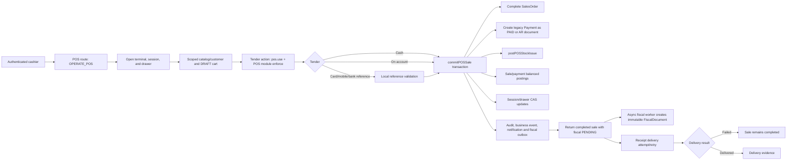
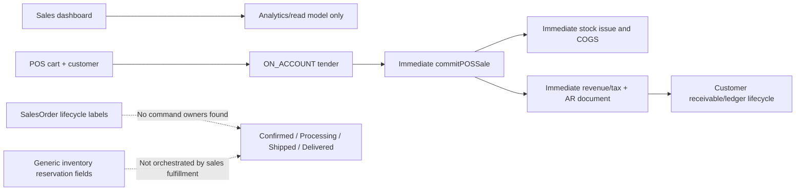
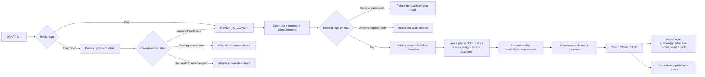
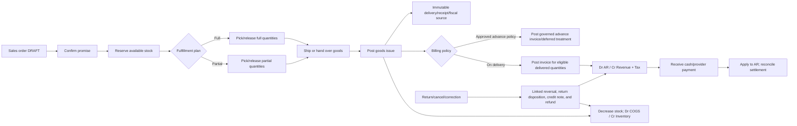
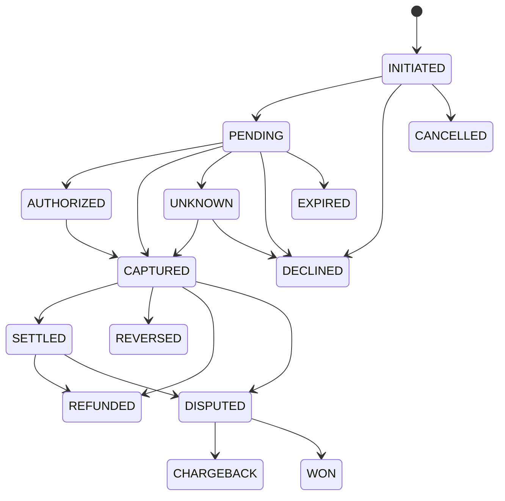

# Stoquify Enterprise Sales-to-Cash Audit and Modernization

Artifact date: 2026-08-16  
Audit execution date: 2026-08-17 (Europe/Paris)  
Classification: repository audit and target-state design; not a production, legal, accounting, PCI, security, or accessibility certification  
Overall readiness: **BLOCKED**

## 1. Executive verdict

Stoquify has a materially strong immediate online cash-sale kernel. The current `commitPOSSale` transaction is the one authoritative online finalizer and coordinates sale completion, payment rows, inventory issue, cash-session and drawer consequences, balanced accounting postings, audit evidence, business events, notification outbox, and fiscalization outbox. Refund and void paths use linked compensating records. Focused local verification passed.

The enterprise sales-to-cash system is nevertheless not ready for production release:

1. Electronic POS tenders can be recorded as `PAID` from operator-entered references without provider-authoritative authorization or capture truth.
2. Online POS has no tenant-scoped `clientCommitId` result registry. A retry after a lost response cannot deterministically return the original result.
3. A completed sale does not synchronously bind an immutable receipt/fiscal-source snapshot. Fiscal materialization is asynchronous, and production worker, authority, secret, and delivery proof are absent.
4. Delivery/on-account order-to-cash is not implemented as a controlled lifecycle. Status names exist, but there is no authoritative reservation, fulfillment, goods-issue, partial-delivery, invoice, AR, and correction workflow.
5. Permission and module-entitlement contracts are inconsistent across the route, navigation, reads, commands, offline actions, and seeded cashier roles.
6. Shift close exists, but business-day statement, blind tender declaration, X/Z reporting, manager sign-off, statement posting, provider settlement, and accounting close are not yet distinct complete aggregates.
7. Local tests and static gates do not prove PostgreSQL race behavior, production isolation, provider behavior, fiscal authority behavior, hardware, browser accessibility, offline field recovery, or operational readiness.

The correct modernization is not a second sale-finalization service. Keep the current immediate-POS finalizer, harden its idempotency/payment/receipt boundaries, and add a separate delivery/on-account orchestration that reuses the existing accounting, inventory, fiscal, payment, reconciliation, audit, and outbox kernels.

## 2. Scope, method, and evidence boundary

This run followed the `aqstoqflow-prompt-architect` execution contract and the attached audit prompt. It changed no application code, schema, migration, configuration, or test file. It created only the two requested artifacts.

Evidence reviewed:

- Current dirty-worktree source under `actions/pos`, `services/pos`, `services/inventory`, `services/accounting`, `services/payments`, `services/reconciliation`, receipt routes, sales/POS routes, UI hooks/components, and `prisma/schema.prisma`.
- Existing POS atomicity, receipt-assurance, UI/UX, accounting, inventory, payment, offline, country-pack, and release-readiness reports.
- Graphify architecture evidence in `graphify-out` and `services/graphify-out`.
- Focused local TypeScript, Prisma, Jest, runtime-table, and static truth gates.
- Dated official SAP, Microsoft, Oracle, Odoo, PCI SSC, and OWASP sources.

Evidence not available:

- Production database state, provider credentials, live/sandbox provider captures, provider statements, production traces, or settlement files.
- Production receipt-token signing secret or fiscal-authority access.
- Qualified country-pack legal review for receipt, tax, numbering, retention, or offline fiscal rules.
- PCI DSS assessment, penetration test, accessibility audit, load test, failover exercise, backup restore, browser certification, or device/hardware field test.
- A clean release commit. The inspected repository already contained extensive user-owned modified and untracked work.

Consequently, “implemented” in this report means present in the inspected local source. It never means production-proven or certified.

## 3. Dirty-worktree preservation and attribution

The baseline `git status --short` was captured before artifact creation. Existing user-owned changes included POS component/service/test work, payment statement and reconciliation work, `prisma/schema.prisma`, package and seed work, onboarding/settings work, readiness reports, two new migrations, and untracked POS evidence/UI audit material. Those changes were neither reverted nor rewritten.

The truth gates that normally overwrite dirty `what-next` readiness reports were invoked through their underlying read-only Node scripts with temporary outputs. The temporary files were inspected and removed. The module-surface inventory was likewise written to a dedicated temporary workspace directory and removed. This run owns only:

- `what-next/STOQUIFY_ENTERPRISE_SALES_TO_CASH_AUDIT_AND_MODERNIZATION_2026-08-16.md`
- `what-next/STOQUIFY_ENTERPRISE_SALES_TO_CASH_READINESS_2026-08-16.json`

## 4. Repository truth and ownership map

| Material transition | Current authoritative owner | Assessment |
| --- | --- | --- |
| POS route admission | `app/[locale]/(dashboard)/dashboard/pos/pos-route-data-access.ts` | Permission is `OPERATE_POS`; no module entitlement is declared at this boundary. |
| POS sale command | `actions/pos/tender.actions.ts::commitPOSSaleAction` | Protected by `pos.use` and POS module enforcement. |
| Immediate online finalization | `services/pos/pos.service.ts::commitPOSSale` | One transaction owns the final financial/stock result. Keep this owner. |
| Offline sale replay | `services/pos/offline-sync.service.ts` calling `commitPOSSale` | Correctly reuses the online finalizer rather than duplicating it. |
| POS stock issue | `services/inventory/inventory-stock-event.service.ts::postPOSStockIssue` | Idempotent, organization/location scoped, version checked, valuation aware. |
| Sale/payment/correction posting | `services/accounting/postings` | Balanced, source-linked, open-period aware, idempotent, close-invalidating. |
| POS AR document | `commitPOSSale` plus customer-receivable/ledger services | Implements immediate issue-on-account, not delivery order-to-cash. |
| Fiscal materialization | `services/compliance/fiscalization-outbox.service.ts` calling `createFiscalDocumentFromPostedSource` | Asynchronous owner exists, but no production worker/authority proof. |
| Receipt delivery | `services/pos/receipt.service.ts` and WhatsApp outbox | Delivery is post-commit; failures do not roll back the sale. Some channels remain placeholders. |
| Provider event ingestion | `services/payments/provider-event.service.ts` | Signed/replay-aware/redacted ingestion exists. |
| Provider transaction truth in POS | None | Critical gap: POS does not use `PaymentTransaction`/`ProviderEvent` to establish capture. |
| Statement matching and suspense | `services/payments` and `services/reconciliation` | Substantial infrastructure exists but is not the POS capture authority. |
| Session and drawer close | POS session/shift-close services | Implemented with variance and offline blocker evidence. |
| Business-day retail statement | None | Missing authoritative aggregate and posting lifecycle. |
| Delivery fulfillment | None | Missing; enum labels and analytics reads are not command ownership. |

### 4.1 Important source findings

- `services/pos/pos.service.ts` is approximately 3,262 lines; `components/pos/ProfessionalPOSSystem.tsx` is approximately 2,493 lines. Their size increases change risk, but decomposition should follow contract stabilization.
- `commitPOSSale` begins near line 1873 and calls `postPOSStockIssue` near line 2087 inside its database transaction.
- A `createPOSFiscalDocumentInTx` helper exists near line 277 but is not called. The active path emits a fiscalization outbox request and returns a pending fiscal watermark. This is an ownership ambiguity, not proof of synchronous fiscal materialization.
- `services/pos/pos.schemas.ts` has no `clientCommitId` in the commit contract.
- Non-credit POS payment rows are created with successful legacy payment status after local reference validation. This does not establish provider capture.
- The Prisma schema contains rich `ProviderEvent`, `PaymentTransaction`, statement, match, suspense, and reconciliation models. Their presence does not connect them to POS checkout.
- `PaymentTransactionState` currently has `PENDING`, `PROCESSING`, `CONFIRMED`, `SETTLED`, `FAILED`, `CANCELLED`, `REFUNDED`, `DISPUTED`, and `SUSPENSE`; the POS path does not own a normalized `UNKNOWN`, authorization, capture, reversal, or chargeback transition.
- The sales route renders an analytical sales dashboard. No authoritative confirm/reserve/pick/ship/deliver command path was found.
- `SalesOrderStatus` contains `CONFIRMED`, `PROCESSING`, `SHIPPED`, and `DELIVERED`, but repository searches found these states in read models/analytics rather than material transition commands.
- `end-of-day-close-readiness.service.ts` explicitly marks branch payment reconciliation and manager sign-off as `UNSUPPORTED`.

### 4.2 Graph evidence

The source and schema remain authoritative; graph evidence was used to test architectural relationships:

- `graph_actions.json`: POS cart actions cluster in community 78, session actions in 97, sync actions in 28, and tender action file in 133. Protected wrapper internals are not fully represented, so the graph alone would understate finalization ownership.
- `graph_components.json`: `ProfessionalPOSSystem.tsx` is a large community-1 hub; the offline status strip is separated in community 191; shift-close tests are in community 45.
- `graph_hooks.json`: `usePosOperations` community 1 combines locations, terminals, shift, catalog, cart, customers, receipt token, commit, refund, and void. Offline sync is a distinct community 20, matching the observed UI integration gap.
- `graph_app.json`: POS page community 140 is distinct from the sales page and sales-client analytical communities. This supports the conclusion that immediate POS and delivery order-to-cash are not currently one complete workflow.
- `services/graphify-out/graph.json` contains nodes for `commitPOSSale`, `postPOSStockIssue`, `createPOSFiscalDocumentInTx`, and `createFiscalDocumentFromPostedSource`, confirming the finalizer-to-stock seam and the competing fiscalization symbols.

## 5. Current-state workflows

### 5.1 Immediate online POS

The unsafe edge is `H -> G`: a locally plausible electronic reference is converted into a successful payment without provider-owned capture truth.

### 5.2 Current delivery/on-account behavior

The existing on-account tender is a goods-now/pay-later POS sale. It must not be described as a delivery/on-account order workflow.

## 6. Enterprise benchmark study

Sources were reviewed on 2026-08-17. Product documentation is used for reusable invariants, not for copying full-suite complexity.

| System | Verified process detail | Reusable Stoquify invariant | Complexity deliberately rejected |
| --- | --- | --- | --- |
| SAP S/4HANA | Sales order items drive outbound delivery; picking/packing precede goods issue; delivery supports partial fulfillment; billing can reference delivered quantities; goods issue has limited mutation and a reversal path. [SAP Sales Order Outbound Delivery Scenario](https://help.sap.com/docs/SAP_S4HANA_ON-PREMISE/25a41481f62e469ba0e61015a0d39d20/610fb16c6f8341e0a0725eeb3abb00ed.html) | Separate promise, reservation/fulfillment, goods issue, billing, and reversal. Inventory/COGS move on physical goods issue. | Full EWM, handling-unit, transportation, and broad SAP configuration surface. |
| Microsoft Dynamics 365 Commerce | Shifts are closed before statements; statement calculation groups tenders; counted declarations can feed statement lines; posting creates sales orders/invoices/payment journals and inventory consequences; business day may cross midnight. [Retail statements](https://learn.microsoft.com/en-us/dynamics365/commerce/retail-statements), [Financial reconciliation](https://learn.microsoft.com/en-us/dynamics365/commerce/fin-recon) | Keep shift close, tender declaration, business-day statement, financial posting, offline-sync validation, and accounting close distinct and observable. | Headquarters/channel replication architecture and every Dynamics statement method. |
| Oracle NetSuite | Sales orders are non-posting promises; fulfillment posts debit COGS/credit inventory; invoices post debit AR/credit revenue; assured immediate payment uses cash-sale semantics; advanced shipping separates fulfillment and billing. [Sales Transaction GL Impact](https://docs.oracle.com/en/cloud/saas/netsuite/ns-online-help/section_N1459773.html), [Order Fulfillment Overview](https://docs.oracle.com/en/cloud/saas/netsuite/ns-online-help/section_4737787881.html) | Do not post revenue, AR, COGS, or inventory merely because an order is confirmed. Use the physical and billing events. | Suite-wide forms, progress billing, cross-subsidiary, and every advanced shipping option. |
| Odoo | POS session open/close, counted cash, payment methods, receipt/invoice, stock registration, refunds with a linked credit note, and accounting journals are connected. Register close can enforce variance limits and manager intervention. [Odoo POS](https://www.odoo.com/documentation/18.0/applications/sales/point_of_sale.html), [Receipts and invoices](https://www.odoo.com/documentation/18.0/applications/sales/point_of_sale/receipts_invoices.html) | Preserve original sale/invoice, issue linked correction evidence, bind payment methods to journals/providers, and govern close variance. | Loyalty, restaurant, self-ordering, and every optional Odoo module. |

Cross-system invariant:

> An order promise, physical fulfillment, billing, payment, receipt/fiscal evidence, settlement reconciliation, and accounting close are linked but independently governed facts.

## 7. Capability and risk matrix

| Capability | Status | Risk | Local evidence | Required change/proof |
| --- | --- | --- | --- | --- |
| One online POS finalizer | Implemented | Medium | `commitPOSSale`; offline calls it | Preserve owner; prohibit a second finalizer. |
| Atomic POS consequences | Implemented, not production-proven | High | POS service/tests | Add real PostgreSQL races and failure injection. |
| Client-result idempotency | Missing | Critical | No `clientCommitId` | Tenant/terminal/client result registry. |
| Cash tender | Implemented, not field-proven | Medium | Drawer/session/payment/posting | Multi-terminal/device and recovery proof. |
| Electronic tender | Risky | Critical | Legacy `Payment` marked paid | Provider-authoritative state bridge. |
| Provider event ingestion | Implemented, not live-proven | High | Signature/replay/redaction tests | Sandbox/live replay, key rotation, outage drills. |
| Statement reconciliation | Implemented, not POS-integrated | High | Payment/reconciliation services/gate | Link POS provider transaction and ledger clearing. |
| Immutable fiscal document | Partial | Critical | Outbox and `FiscalDocument` | Bind immutable source at commit; prove worker/authority. |
| Receipt delivery | Partial | Medium | Post-commit and WhatsApp outbox | Durable print/email/SMS status and retry ownership. |
| Public receipt access | Local ready, release blocked | High | Token gate warning | Configure production signing secret and release gate. |
| Immediate inventory/COGS | Implemented | Medium | Stock-event service/gate/tests | PostgreSQL quantity/valuation race proof. |
| Reservation/fulfillment | Missing | Critical | Generic fields only | Delivery aggregate and commands. |
| Balanced postings | Implemented, not certified | High | Posting services/gate | Controller-approved mappings and production tie-out. |
| Refund/void | Partial | High | Compensating paths | Partial refund, returns, disputes, chargebacks. |
| Offline replay | Implemented, not field-proven | High | 16/16 gate; tests | Multi-device, expired policy, conflict runbook proof. |
| Shift close | Implemented, partial | High | Close tests/readiness | Blind count, sign-off, X/Z, statement boundary. |
| Business-day statement | Missing | Critical | Unsupported close checks | New authoritative aggregate. |
| Access control | Partial/inconsistent | Critical | Route/action/module inventory | Normalize permission, entitlement, fresh auth, SoD. |
| Cashier UX/accessibility | Partial | High | Existing UI audit | Recovery, handover, offline checkout, touch/focus/privacy. |
| Delivery/on-account O2C | Missing | Critical | No transition commands | Separate orchestrator reusing kernels. |

## 8. Target-state architecture

### 8.1 Immediate POS target

### 8.2 Delivery/on-account target

### 8.3 Shared kernels, separate orchestration

| Shared kernel | Immediate POS caller | Delivery/on-account caller |
| --- | --- | --- |
| Inventory stock event/valuation | Sale commit | Goods-issue command |
| Ledger posting/source link | Sale/payment/refund/void | Goods issue/invoice/payment/credit note |
| Provider event and reconciliation | Electronic tender | AR collection |
| Fiscal-source materialization | Completed immediate sale | Posted invoice/delivery per country pack |
| Receipt/document delivery | POS receipt | Invoice/delivery receipt |
| Audit/outbox/idempotency | POS result registry | Command registry per aggregate |
| Close invalidation | POS postings | Fulfillment/invoice/payment postings |

No shared kernel should own the end-user workflow. Orchestrators own state transitions; kernels own invariant-preserving consequences.

## 9. State contracts

### 9.1 Immediate sale and result registry

| Command | Actor and authorization | Preconditions | Transaction/idempotency boundary | Result/event | Recovery |
| --- | --- | --- | --- | --- | --- |
| Create/update cart | Cashier; canonical POS operate permission + entitlement | Active org/location/terminal/session; sellable items | Draft version/CAS | `pos.cart.updated` | Reload conflicting draft; do not overwrite. |
| Initiate electronic tender | Cashier; POS operate | Draft totals frozen; provider account ready | Provider idempotency key bound to cart/request hash | `payment.initiated` | Resume existing intent. |
| Observe provider result | Signed webhook/poller; provider boundary | Valid account, signature, timestamp, payload hash | Provider event unique ID + monotonic state rule | `payment.state.changed` | Quarantine replay/tamper; unknown remains non-success. |
| Commit sale | Cashier; POS operate + entitlement | Cash, approved on-account, or provider-captured tender; active session; inventory policy | Unique `(organizationId, terminalId, clientCommitId)` plus canonical request hash; one DB transaction | Immutable `CommitPOSSaleResult`, `pos.sale.completed` | Same request returns original result; conflict rejects. |
| Deliver receipt | Worker/operator with receipt-delivery authority | Immutable receipt source exists | Delivery-attempt key by document/channel/destination version | Delivered/failed evidence | Retry independently; never roll back sale. |

Required result-registry fields:

- `organizationId`, `locationId`, `terminalId`, `clientCommitId`
- canonical request hash and request schema version
- command status: `CLAIMED`, `COMPLETED`, `FAILED_RETRYABLE`, `FAILED_FINAL`
- authoritative `saleId`, receipt/fiscal source ID, payment transaction IDs, posting IDs, stock event IDs
- immutable redacted result envelope and result hash
- claimant, created/completed timestamps, correlation ID, retry counters

The registry must never store secrets, PAN, CVV, PIN, raw provider payloads, or unnecessary customer PII.

### 9.2 Provider payment lifecycle

Target canonical state machine:

Rules:

- Provider raw state is retained as redacted evidence; a versioned adapter maps it to canonical state.
- Only `CAPTURED`/provider-confirmed equivalent can satisfy an immediate electronic tender. `PENDING`, `UNKNOWN`, and a cashier-entered reference cannot.
- `SETTLED` is external cash proof and clears provider clearing to bank; it is not the same as sale completion.
- Late capture after cashier timeout creates an exception/suspense case; it must not silently create or duplicate a sale.
- State regressions, duplicate provider IDs, signature failures, amount/currency mismatches, and impossible transitions are quarantined and audited.
- Refund, reversal, dispute, and chargeback never mutate the original payment or journal.

### 9.3 Delivery sales order

Header states should summarize line facts, not substitute for fulfillment records:

- `DRAFT -> CONFIRMED -> PARTIALLY_FULFILLED -> FULFILLED -> CLOSED`
- `DRAFT/CONFIRMED -> CANCELLED` only for unfulfilled quantities under explicit permission.
- Returns and credits are linked aggregates; they do not rewrite `FULFILLED`.

`confirmOrder` requires customer, delivery location, terms/credit policy, price/tax snapshot, inventory policy, permission, entitlement, and a command idempotency key. Confirmation is normally non-posting.

### 9.4 Reservation

- `PROPOSED -> ACTIVE -> PARTIALLY_CONSUMED -> CONSUMED`
- `ACTIVE/PARTIALLY_CONSUMED -> RELEASED/EXPIRED`
- Reservation changes `available`, not `onHand`, and creates no COGS.
- Every reservation line binds organization, location, item/variant, quantity, UOM, optional lot/serial policy, source order line, expiry, and version.
- Confirmation must not promise unsupported negative stock, lot/serial, or UOM behavior.

### 9.5 Fulfillment and goods issue

- `DRAFT -> RELEASED -> PICKING -> PICKED -> SHIPPED/HANDED_OVER -> DELIVERED`
- Cancellation is allowed before goods issue under policy.
- Goods-issue reversal is a linked compensating stock event with approval and return/disposition evidence.
- `postGoodsIssue` is the inventory/COGS event. It consumes reservation and reduces on-hand exactly once.
- Partial fulfillment is line-quantity based and uses a command key and source hash.

### 9.6 Invoice and AR

- Draft invoice data may be prepared, but posting requires eligible delivered quantities or a controller-approved advance-billing policy.
- Posted invoice creates AR, revenue, and tax; it is immutable except through credit/debit notes.
- Customer payment applies cash/bank/provider-clearing to AR using explicit allocation records.
- Unapplied or mismatched payments go to customer/provider suspense, never to silent success.

### 9.7 Receipt/fiscal document

Receipt truth requires independent axes rather than one overloaded status:

| Axis | States |
| --- | --- |
| Source | `SOURCE_BOUND`, `SOURCE_INVALIDATED_BY_LINKED_CORRECTION` |
| Fiscalization | `NOT_REQUIRED`, `PENDING`, `PROVISIONAL`, `ISSUED`, `CERTIFIED`, `REJECTED`, `DEAD_LETTER` |
| Delivery | `NOT_REQUESTED`, `PENDING`, `DELIVERED`, `FAILED_RETRYABLE`, `FAILED_FINAL` |
| Correction | `ORIGINAL`, `CREDITED`, `VOIDED_BY_LINKED_DOCUMENT`, `REFUNDED_PARTIAL`, `REFUNDED_FULL` |

Legal numbers are never allocated by an offline device or generic shared code. They require country-pack authority and durable sequence evidence.

### 9.8 Shift, business day, statement, reconciliation, and close

| Aggregate | Purpose | Terminal evidence |
| --- | --- | --- |
| POS session | Operator/register responsibility | Open/close times, expected totals, counted cash, variance, offline blockers |
| Tender declaration | Blind or controlled physical/provider count | Denominations, counted totals, declarer, manager approval |
| Business day | Store trading boundary, possibly crossing midnight | Location/time-zone/calendar snapshot and included sessions |
| Retail statement | Immutable grouping and posting basis | Included transaction IDs/hashes, tender totals, X/Z report, approval |
| Provider settlement reconciliation | External cash proof | Provider events, statement lines, fees, suspense, sign-off |
| Accounting period close | Financial reporting certification | Posted journals, reconciliations, findings, close pack |

None of these closes may infer that the next is complete.

## 10. Command authorization and separation of duties

| Command | Minimum permission/module | Fresh authentication | Maker-checker |
| --- | --- | --- | --- |
| Operate POS/cart/checkout | Canonical `pos.operate`; POS entitlement | Session login plus inactivity re-auth policy | No, unless policy exception |
| Override price/discount/tax | Dedicated override permission | Required above threshold | Required above material threshold |
| Complete on-account sale | POS operate + customer credit permission | Required for credit-limit override | Checker for material override |
| Refund | Dedicated refund permission | Required | Checker for high value, stale, cross-location, or unusual frequency |
| Void | Dedicated void permission | Required | Checker after posting/material threshold |
| Cash in/out/payout | Dedicated drawer permission | Required | Checker above threshold |
| Close session | Session-close permission | Required | Independent declaration/sign-off where required |
| Approve close variance | Manager variance permission | Required | Approver cannot be original declarer above threshold |
| Reconcile provider/statement | Reconciliation permission/module | Required for manual match/override | Required for material/manual corrections |
| Assign fiscal number/certify | Country-pack/fiscal worker identity | Machine credential or fresh human auth | Country-pack policy |
| Post invoice/credit note | Accounting/sales billing permission | Required for manual override | Controller threshold policy |
| Reverse goods issue/write off | Inventory correction permission | Required | Maker-checker and reason/evidence |

Required normalization:

- Replace the unexplained `OPERATE_POS` versus `pos.use` split with a documented compatibility map and one canonical decision path.
- Enforce module entitlement at route, read, command, offline, receipt, report, and export boundaries; UI hiding is not enforcement.
- Scope every query and mutation by organization and, where material, authorized location.
- Deny cross-location receipt, sale, payment, stock, session, and reconciliation reads even when IDs are guessed.
- Seed cashier roles with least privilege and test negative capabilities.

## 11. Receipt and fiscal-source decision record

Decision: bind immutable source evidence during the sale transaction; perform legal numbering/certification asynchronously where required.

The source snapshot must contain:

- Organization/location/terminal/session identity snapshots.
- Sale ID/number, business timestamp, currency, totals, tender summaries, and customer identity only when legally or operationally required.
- Immutable line descriptions, quantities, unit prices, discounts, tax codes/rates/amounts, line totals, and source line IDs.
- Posting batch/source links, inventory source links, payment transaction references, country-pack version/hash, and certification policy snapshot.
- Canonical payload, canonical hash, idempotency key, schema version, and creation actor/correlation.

It must not rely on mutable product names, current customer data, current organization address, or recomputation from later prices/tax configuration.

Receipt delivery:

- Is a durable command with attempt history and a redacted destination fingerprint.
- Can be retried without changing sale, payment, inventory, ledger, or legal number.
- Shows “sale completed; receipt delivery pending/failed” rather than hiding the completed sale.
- Requires explicit consent/purpose for customer contact channels.
- Never logs full destination, secret tokens, PAN/CVV/PIN, or raw provider payload.

Country-pack boundary:

- Shared application code owns the generic fiscal-source contract, evidence hashes, idempotency, delivery, and correction links.
- A dated, versioned country pack owns required fields, tax/rounding rules, number scope, offline/provisional rules, authority submission, retention, correction documents, and qualified-human review.
- No country or statutory conclusion in this report is a certification.

## 12. Accounting posting matrix

Account symbols are policy-resolved posting roles, not hard-coded account numbers.

| Business event | Debit | Credit | Current state | Required control |
| --- | --- | --- | --- | --- |
| Immediate cash sale | Cash on hand; COGS | Revenue; tax payable; inventory | Implemented locally | Source links, exact rounding, open period, idempotency |
| Immediate provider-captured sale | Provider clearing; COGS | Revenue; tax payable; inventory | Posting kernel exists; capture authority missing | Post only on provider capture |
| On-account immediate POS | AR; COGS | Revenue; tax payable; inventory | Implemented locally | Customer/credit policy and source receivable |
| Delivery goods issue | COGS | Inventory | Missing workflow | Post at physical handover/shipment policy event |
| Delivery invoice | AR | Revenue; tax payable | Missing orchestration | Only eligible delivered quantities unless approved policy |
| Customer cash/bank receipt | Cash/bank/provider clearing | AR | Receivable services exist | Explicit allocation and unapplied suspense |
| Provider settlement | Bank; provider fee expense | Provider clearing | Reconciliation infrastructure partial | Statement/provider evidence, amount/currency/fee tie-out |
| Cash deposit | Bank | Cash in transit/on hand | Partial outside sale kernel | Deposit evidence and branch attribution |
| Refund/credit note | Revenue/tax/correction roles | Cash, provider clearing, or AR | Full POS correction partial | Linked original, reason, approval, provider truth |
| Return to sellable stock | Inventory | COGS/return variance | Partial | Inspection/disposition and valuation source |
| Write-off/damaged return | Loss/write-off expense | Inventory | Inventory controls exist | Maker-checker and evidence |
| Provider reversal/chargeback | Chargeback/receivable/suspense role | Bank/provider clearing | Incomplete POS lifecycle | Dispute evidence and linked correction |

Every posting must have:

- Organization/location/source type/source ID and immutable source hash.
- Posting-rule version, journal/batch IDs, period, correlation, actor, and close-invalidation evidence.
- Balanced debits and credits at commit.
- A unique idempotency key per business consequence.
- No edit/delete of a posted journal; only linked reversal/correction.

## 13. Inventory consequence matrix

| Event | `onHand` | `reserved` | `available` | Valuation/COGS | Current state |
| --- | ---: | ---: | ---: | --- | --- |
| POS draft cart | 0 | 0 | 0 | None | Correct: no stock move |
| Immediate POS completion | Decrease | 0 | Decrease | Dr COGS / Cr inventory | Implemented |
| Delivery order confirmation | 0 | Policy-dependent reservation | Decrease if reserved | None | Missing |
| Reservation release/expiry | 0 | Decrease | Increase | None | Generic primitives only |
| Partial goods issue | Decrease by issued qty | Consume issued qty | Recalculate | Dr COGS / Cr inventory | Missing sales workflow |
| Goods-issue reversal | Increase through compensating event | Policy | Recalculate | Reverse original cost with source link | Kernel primitives exist; workflow missing |
| Customer return pending inspection | Quarantine location/status | 0 | No sellable increase | No assumed recovery | Missing |
| Return to stock | Increase after disposition | 0 | Increase | Controller-approved cost basis | Partial primitives |
| Damaged/write-off return | No sellable increase | 0 | 0 | Loss/write-off | Inventory adjustment controls exist |

Do not claim POS support for serial, lot, expiry, alternative UOM, or batch selection until the checkout contract and browser flow select, validate, persist, and test those dimensions. Schema fields alone are not capability.

## 14. Payment failure, uncertainty, and reconciliation model

| Condition | Sale behavior | Payment behavior | Accounting/reconciliation behavior | Operator behavior |
| --- | --- | --- | --- | --- |
| Provider declined | Do not complete | Final failed/declined evidence | No successful clearing posting | Offer retry/other tender |
| Provider pending | Do not complete | Pending | No success posting | Show pending and safe resume |
| Provider timeout/unknown | Do not complete | Unknown; poll/webhook | No success posting; exception timer | Never ask cashier to “assume paid” |
| Late capture after timeout | Do not auto-duplicate sale | Captured evidence | Suspense/exception until linked | Manager resolution |
| Duplicate webhook | No duplicate sale | Return prior provider-event result | No duplicate posting | Invisible unless anomalous |
| Signature/replay failure | No state advance | Quarantine | Security exception | Escalate |
| Amount/currency mismatch | Do not complete | Suspense | No automatic match | Manager/provider review |
| Captured but sale commit fails | No completed sale | Captured orphan | Provider suspense/refund/retry policy | Visible urgent case |
| Sale completed but response lost | Return original result on retry | Reuse payment | No duplicate consequences | Recover receipt/result |
| Settlement shortfall/fee | Sale stays completed | Settlement evidence | Fee/suspense entry | Treasury review |
| Reversal/chargeback | Preserve original sale | Linked new state/event | Linked correction/suspense | Case workflow |

Reconciliation layers:

1. Internal result registry proves exactly one application command outcome.
2. Provider event proves authorization/capture state.
3. Provider statement proves settlement/fee/reversal cash movement.
4. Ledger source links prove accounting consequences.
5. Bank statement proves bank cash.
6. Reconciliation certificate binds all evidence and unresolved suspense.

## 15. Threat, fraud, and control matrix

| Threat/fraud | Preventive control | Detective/corrective control | Current assessment |
| --- | --- | --- | --- |
| Double sale from retry | Client result registry + unique key/hash | Duplicate/conflict audit and reconciliation | Missing online |
| Cashier invents electronic reference | Provider-authoritative capture | Orphan/mismatch suspense | Critical gap |
| Webhook forgery/replay | HMAC/public-key verification, timestamp, unique event ID | Quarantine and alert | Implemented locally |
| Cross-tenant/location IDOR | Scoped queries and command guards | Negative tests and audit | Partial/inconsistent boundaries |
| Unauthorized module use | Entitlement enforcement server-side | Surface inventory/ratchet | Many enforcement candidates |
| Refund/void abuse | Dedicated permission, fresh auth, threshold approval | Frequency/value anomaly and audit | Partial |
| Cash skimming | Blind tender count, independent sign-off, variance threshold | Session/business-day statement reconciliation | Incomplete |
| Stock theft/false return | Goods issue/return disposition, maker-checker | Stock-to-sale and count variance | Partial |
| Receipt tampering | Immutable payload hash and signed scoped token | Hash verification/revocation | Partial; release secret absent |
| Fiscal-number duplication | Country-pack sequence owner | Gap/duplicate certificate | Not authority-proven |
| Offline event tamper/reorder | Device signature, hash chain, sequence | Quarantine/conflict queue | Implemented locally |
| Offline false fiscal number | Provisional-only device policy | Server fiscalization and certificate | Implemented locally, not field-proven |
| Posted journal alteration | Append-only posting and compensating reversal | Source-link/close assurance | Implemented locally |
| Secret/PAN/CVV leakage | Provider-hosted/tokenized boundary; redaction | Log scan/DLP/incident response | No certification |
| Customer PII overexposure | Purpose limitation, masking, scoped receipt | Access audit/retention deletion policy | UI/privacy gaps remain |
| Maker-checker collusion | Separate identities, no self-approval, threshold policy | Review graph and exception monitoring | Needs explicit sales rules |

Security references:

- [PCI DSS v4.0.1 document library](https://www.pcisecuritystandards.org/document_library/) is the applicable assessment source for payment-account-data scope. Stoquify must minimize scope and must not store/log PAN, CVV, PIN, or unnecessary authentication data.
- [OWASP ASVS 5.0.0](https://github.com/OWASP/ASVS) is the recommended application verification baseline for authentication, authorization, sensitive-data handling, logging, input validation, and API controls.

Passing local tests is not a PCI DSS or ASVS certification.

## 16. Cashier, manager, support, and accessibility experience

Required cashier flow:

- A visible terminal/session/drawer identity and business date.
- Fast product search/scan with authoritative sellable availability.
- One cart version and deterministic recovery after reconnect.
- Payment UI that distinguishes initiated, waiting, unknown, captured, declined, and cancelled.
- A completed-sale screen that persists across refresh and can recover the original receipt.
- Explicit “receipt delivery failed; sale completed” status and retry.
- Inactivity lock and controlled cashier handover.
- Accessible keyboard order, focus management, live status announcements, touch targets, error summaries, and responsive cart.

Required manager flow:

- Approve overrides/refunds/voids/variance with fresh auth.
- Resolve captured-without-sale, late callback, offline conflict, stock shortage, receipt/fiscal dead letter, and close blocker cases.
- Blind-count cash where policy requires; see expected amount only after declaration.
- Sign business-day statement independently and see unresolved provider/stock/fiscal exceptions.

Required support flow:

- Search by redacted correlation, sale, receipt, provider, client commit, session, and statement IDs within tenant/location authority.
- View state timeline and evidence hashes without secrets or unnecessary PII.
- Retry delivery/workers safely, never by mutating completed records.
- Follow bounded runbooks for provider unknowns, fiscal dead letters, offline conflicts, and close drift.

Current UI audit limitations retained:

- Store credit appears as a selectable UI tender while the service rejects it.
- XAF fractional display/input behavior is not proven against currency minor-unit policy.
- Offline readiness is visually surfaced but checkout does not use the offline commit path.
- Hardware readiness is synthetic.
- Cart concurrency, mobile layout, touch target, focus, privacy, inactivity lock, handover, performance budget, and workflow recovery are incomplete.

## 17. Dependency-ordered implementation backlog

### P0 — financial/security truth before wider capability

#### P0-01: tenant-scoped `clientCommitId` result replay

Owner: POS transaction boundary  
Depends on: none  
Scope:

- Add an additive result-registry model/migration; no reset, destructive change, or rewrite of completed sales.
- Claim `(organizationId, terminalId, clientCommitId)` and canonical request hash.
- Persist immutable redacted result and source IDs in the existing transaction.
- Return the original result for identical retries; reject/audit payload conflicts.
- Add real PostgreSQL concurrent-commit and response-loss tests.

Done when one and only one sale, stock issue, payment/AR set, drawer/session consequence, journal set, fiscal source, and result exist under races.

#### P0-02: provider-authoritative electronic tender

Owner: payment provider boundary with POS orchestration adapter  
Depends on: P0-01  
Scope:

- Freeze a canonical provider state contract, including `UNKNOWN`.
- Create/link `PaymentTransaction` before sale commit.
- Ingest signed events idempotently and map provider states monotonically.
- Permit sale completion only at provider-confirmed capture.
- Post provider clearing, settlement, fees, reversals, disputes, chargebacks, and suspense through source-linked kernels.
- Add sandbox/webhook/poller/statement recovery tests.

Done when no operator-entered reference can create successful payment truth.

#### P0-03: immutable receipt/fiscal-source binding

Owner: POS transaction plus compliance kernel  
Depends on: P0-01  
Scope:

- Materialize the immutable source payload/hash inside sale commit.
- Keep legal numbering and authority submission asynchronous and country-pack controlled.
- Resolve the unused `createPOSFiscalDocumentInTx` ownership ambiguity.
- Make every delivery channel durable and retryable.
- Test catalog/customer mutation after sale, worker replay, dead letter, token revocation, and delivery failure.

Done when every completed sale has immutable source evidence even if fiscal authority or delivery is unavailable.

#### P0-04: POS access-boundary normalization

Owner: security/module control plane  
Depends on: none  
Scope:

- Freeze canonical permission and module contracts for route/read/cart/tender/offline/receipt/refund/void/session/close/report/export.
- Add organization/location negative tests and least-privilege cashier fixtures.
- Require fresh auth and maker-checker at documented thresholds.
- Ensure logs/evidence redact secrets, payment data, and unnecessary PII.

Done when navigation and UI are conveniences, while every server boundary independently enforces the same authority.

#### P0-05: release-proof package

Owner: release/SRE with domain reviewers  
Depends on: P0-01 through P0-04  
Scope:

- PostgreSQL race/failure-injection evidence.
- Production receipt-token secret enforcement.
- Provider sandbox and statement tie-out.
- Fiscal worker retries/dead-letter/country-pack authority evidence.
- Offline device conflict and close-blocker drills.
- Tenant/location, backup/restore, observability, rollback, browser, accessibility, and hardware evidence.

Done when a named release commit and environment pass the evidence package. This audit cannot mark it complete.

### P1 — complete enterprise sales-to-cash

#### P1-01: delivery/on-account order aggregate

Add explicit order confirmation, line promises, terms/credit policy, versioning, cancellation, and non-posting behavior. Reuse master data and tax/price snapshots; do not place fulfillment logic in `commitPOSSale`.

#### P1-02: reservation and fulfillment

Add scoped reservation, partial release/pick/ship/handover, goods issue, reservation consumption, backorder, cancellation, and goods-issue reversal. Reuse the inventory stock-event/valuation kernel.

#### P1-03: invoice, AR, payment, and corrections

Post eligible delivered quantities to invoice/AR; support partial invoices/payments, unapplied cash, credit notes, returns, refund disposition, provider collections, and source-linked corrections.

#### P1-04: business day and retail statement

Model business-day boundary, included sessions, blind tender declarations, variance approval, X report, final Z report, immutable statement, statement posting, provider reconciliation status, and accounting-close handoff.

#### P1-05: cashier/manager/support/browser completion

Connect offline checkout, hardware state, result recovery, receipt delivery, manager override, inactivity lock, handover, responsive cart, keyboard/screen-reader/touch behavior, localization, privacy, and support timelines.

#### P1-06: product/country capability contracts

Explicitly enable and test currency minor units, inclusive/exclusive tax, negative stock, UOM, lot/serial/expiry, returns, receipt/fiscal behaviors, and jurisdiction rules by configuration/country pack. Unsupported combinations must fail closed.

### P2 — maintainability and operations

- Decompose the POS component/service after state and command contracts are frozen.
- Add SLOs for checkout, provider callback, fiscal worker, delivery worker, offline replay, statements, and reconciliation.
- Add operational dashboards, dead-letter ownership, capacity/load budgets, recovery drills, and runbooks.
- Add analytics only from stable source events; do not create a second business truth.

### Deferred/non-goals

- CRM campaigns, loyalty, forecasting, recommendation engines, and generic analytics.
- Broad SAP/Dynamics/NetSuite/Odoo feature parity.
- Unsupported multi-currency, inclusive tax, UOM, lot/serial, electronic capture, or fiscal-certification claims.
- Hard-coded national receipt or tax law in shared code.
- Broad UI beautification unrelated to transaction truth.

## 18. Verification log

| Command | Result | Interpretation |
| --- | --- | --- |
| `git status --short` | Dirty before and after | User-owned work preserved; audit is not a clean-commit certification. |
| `npm run typecheck` | Passed, exit 0 | Current dirty worktree type-checks. |
| `npm run prisma:validate` | Passed, exit 0 | Current Prisma schema is valid. |
| Focused Jest command from prompt | 8/8 suites, 99/99 tests passed in 40.351 s | Local POS, shift, tender action, public receipt, offline, inventory, fiscal outbox, and provider event tests pass. |
| `npm run workflow:assurance:runtime-check` | Ready: 7/7 tables, 3/3 migration rows, 0 blockers | Local runtime-table evidence only. |
| Inventory valuation truth gate | Ready: 6/6, 0 blockers | Static/read-only gate; not runtime concurrency proof. |
| Payment/cash truth gate | Ready: 14/14, 0 blockers | Evidence/reconciliation controls; not POS provider capture proof. |
| Ledger close truth gate | Ready: 10/10, 0 blockers | Posting-to-close seams; not statutory mapping certification. |
| Offline replay gate | Ready: 16/16, 0 blockers | Internal static controls; not device/authority field proof. |
| Receipt token config gate | Ready: 4/4, 0 blockers, 1 warning | Production secret absent; release enforcement was off. |
| Module surface inventory | Report generated: 408 records | 292 enforcement-candidate and 79 missing-permission classifications require triage; inventory is not a release pass. |

Gate execution note: package scripts that write existing dirty readiness files were not invoked directly. Their underlying scripts were run in the same fail/report modes with disposable output paths. An initial module-inventory attempt using an absolute temporary path failed because the script joins output paths to the repository root; it was rerun successfully with a dedicated relative temporary directory. No application or existing report was changed.

## 19. Unresolved blockers

Every unresolved blocker identified by this audit:

1. No tenant-scoped online POS client-result replay.
2. No PostgreSQL concurrency evidence for sale-result, inventory, drawer/session, payment, posting, and fiscal-source uniqueness.
3. POS electronic tender converts manual references to paid status without provider capture.
4. No canonical provider `UNKNOWN`, authorization/capture, reversal, dispute, and chargeback state contract connected to POS.
5. No proof that provider event, statement, settlement, fee, and ledger clearing tie to the same POS payment.
6. No immutable receipt/fiscal-source record guaranteed within every completed-sale transaction.
7. Unused synchronous fiscal helper creates ownership ambiguity.
8. No production fiscal worker, authority, numbering, retry, or dead-letter proof.
9. Production public receipt token signing secret is absent in the audited environment.
10. Print, email, and SMS receipt delivery are not all durable production providers.
11. No qualified, dated country-pack approval for tax, receipt, numbering, correction, retention, or offline rules.
12. No delivery/on-account confirm/reserve/fulfill/goods-issue/invoice/AR/correction workflow.
13. No authoritative partial fulfillment, backorder, return disposition, partial invoice, or partial refund contract.
14. No explicit POS UOM/lot/serial/expiry selection proof; no permission to imply support.
15. No business-day, blind tender declaration, X/Z report, immutable retail statement, and statement-posting aggregate.
16. End-of-day branch reconciliation and manager sign-off are explicitly unsupported.
17. Route/action/navigation/offline/receipt/session permission and entitlement contracts are inconsistent.
18. Module inventory reports broad enforcement candidates and missing-permission classifications.
19. Least-privilege cashier seed, inactivity lock, controlled handover, and high-risk maker-checker rules are incomplete.
20. Store-credit UI/service behavior is contradictory.
21. XAF minor-unit/rounding behavior is not country-pack proven.
22. Offline checkout is not fully connected to the displayed UI readiness state.
23. Hardware readiness is synthetic; no scanner/printer/drawer/terminal field proof.
24. Cashier mobile layout, keyboard/focus/screen-reader/touch, privacy, and recovery workflows are incomplete.
25. No production tenant-isolation, authorization, redaction, secrets, load, restore, failover, observability, or incident evidence.
26. No PCI DSS, security, accessibility, legal, accounting, or production certification.
27. The inspected worktree is dirty and cannot be tied to one release commit.

## 20. Success-criteria assessment

| Criterion | Assessment |
| --- | --- |
| Every material transition has one owner and state contract | Not met; target contracts supplied here. |
| Immediate POS and delivery/on-account separated without kernel duplication | Partial; target architecture supplied, delivery flow missing. |
| Sale retry returns original result | Not met. |
| Provider-owned pending/unknown/captured/settled | Not met in POS. |
| Immutable receipt/fiscal source independent of delivery | Not met for every completed sale. |
| Quantity and COGS move at physical event | Met locally for immediate POS; missing for delivery. |
| Cash/clearing/AR/revenue/tax/COGS/inventory/fees/refunds/settlement balanced and linked | Partial; core postings strong, provider lifecycle incomplete. |
| Refunds/voids/returns preserve history | Partial; full POS corrections exist, broader returns incomplete. |
| Shift, statement, reconciliation, and accounting close distinct | Partial; statement/sign-off missing. |
| Offline signed/ordered/replay-safe/conflict-aware/resolvable | Implemented locally; not field-proven. |
| Isolation/RBAC/entitlement/fresh auth/redaction/audit/SoD tested | Partial. |
| Local evidence distinguished from production proof | Met by this report. |
| Future phased execution without guessing | Met by backlog and prompts below. |

## 21. Required reviewer decisions

| Reviewer | Decision required before implementation/release |
| --- | --- |
| Product | Supported immediate/delivery flows, partial fulfillment, invoice timing, tender types, refunds, and exception UX |
| Accounting controller | Posting roles, tax timing, AR/clearing/fee/chargeback rules, corrections, variance, statement and close gates |
| Inventory controller | Reservation, availability, goods issue, negative stock, valuation, return disposition, UOM/lot/serial policy |
| Payments/treasury | Provider mapping, unknown handling, capture/settlement semantics, tolerance, suspense, fees, disputes, chargebacks |
| Security | RBAC/entitlement map, fresh-auth thresholds, maker-checker, provider trust, PCI scope, redaction, evidence retention |
| Qualified country-pack human | Dated tax/receipt/fiscal/numbering/offline/correction/retention conclusions |
| Operations/support | Close, handover, offline conflict, late capture, dead-letter, receipt retry, incident and recovery runbooks |
| Accessibility | Keyboard, focus, screen reader, touch, responsive, error, recovery, and delivery workflows |
| SRE/release | SLOs, monitoring, load, failover, restore, rollout/rollback, secrets, environment and release evidence |
| AI governance | No AI-owned financial transition is needed; any future AI help remains advisory/evidence-bounded with human approval |

## 22. Surgical follow-up implementation prompts

### Prompt 1 — POS result replay

> Implement tenant-scoped POS `clientCommitId` result replay using an additive PostgreSQL model and the existing `commitPOSSale` finalizer. Preserve all dirty-worktree changes. Do not add a second finalizer or use destructive migrations. Key by organization, terminal, and client commit ID; store canonical request hash and immutable redacted result. Identical retries must return the original result; payload conflicts must reject and audit. Prove one sale/payment-or-AR/stock/drawer-session/journal/fiscal-source/result under real PostgreSQL concurrency and response-loss retries. Keep all reads/writes organization- and location-scoped and enforce POS RBAC/module entitlement.

### Prompt 2 — electronic tender truth

> Connect POS electronic tenders to the existing `ProviderEvent`, `PaymentTransaction`, suspense, statement, reconciliation, and ledger kernels. Define versioned provider mappings for initiated, pending, authorized, captured/confirmed, unknown, declined, cancelled, expired, settled, reversed, refunded, disputed, and chargeback states. Never translate pending, unknown, timeout, or a cashier-entered reference into successful payment. Use signed idempotent webhooks/polling, quarantine invalid transitions, and post provider clearing/settlement/fees/corrections with source links. Add provider sandbox and failure-recovery tests without logging secrets, PAN, CVV, PIN, or unnecessary PII.

### Prompt 3 — immutable receipt/fiscal source

> Make every completed POS sale bind an immutable receipt/fiscal-source snapshot and hash within the existing sale transaction while keeping legal-number allocation and authority submission asynchronous and country-pack controlled. Resolve the unused `createPOSFiscalDocumentInTx` ownership ambiguity without creating a second finalizer. Make receipt delivery durable for each supported channel, and prove delivery failure never rolls back or hides the sale. Add replay, mutable-master-data, worker retry/dead-letter, token expiry/revocation, release-secret, correction-document, and country-pack fail-closed tests. Do not claim fiscal certification.

### Prompt 4 — governed business-day close

> Implement distinct additive aggregates and commands for business day, blind tender declaration, manager variance approval, X report, final Z report, immutable retail statement, statement posting, provider settlement reconciliation status, and accounting-close handoff. Reuse existing POS session/drawer, payment reconciliation, accounting posting, close invalidation, audit, and outbox services. Offline unresolved events and conflicts must block false finality. Require explicit RBAC, module entitlement, fresh authentication, and maker-checker approval at material thresholds. Preserve session, sale, payment, stock, receipt, journal, and audit history.

### Prompt 5 — delivery/on-account order-to-cash

> Implement a delivery/on-account sales-order orchestration separate from immediate `commitPOSSale`, reusing existing inventory, accounting, payment, receipt/fiscal, reconciliation, audit, and outbox kernels. Add explicit confirm, reservation, partial release/pick/ship/handover, goods issue, invoice, AR, partial payment, cancellation, goods-issue reversal, return disposition, credit note, refund, and close-invalidation contracts. Sales-order confirmation is non-posting; reservation changes availability only; physical goods issue moves quantity and COGS; posted invoice creates AR/revenue/tax. Use additive migrations, immutable source links, command idempotency, organization/location scope, RBAC/entitlement/fresh auth/maker-checker, and real PostgreSQL concurrency tests.

## 23. Final classification

The immediate POS cash-sale kernel is **implemented but not production-proven**. The broader enterprise sales-to-cash capability is **blocked** until P0 payment truth, result replay, immutable fiscal-source evidence, access-boundary normalization, and release proof are complete. Delivery/on-account fulfillment and governed business-day statements are P1 capability work that must reuse—not fork—the proven transaction kernels.

No statement in this report certifies legal compliance, accounting correctness, PCI DSS compliance, security, accessibility, or production readiness.
