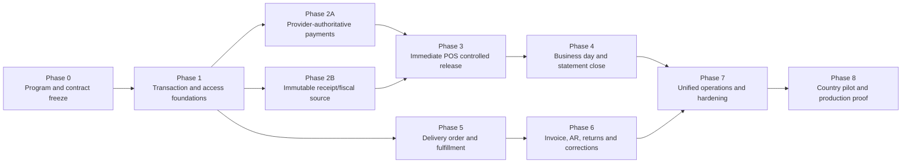
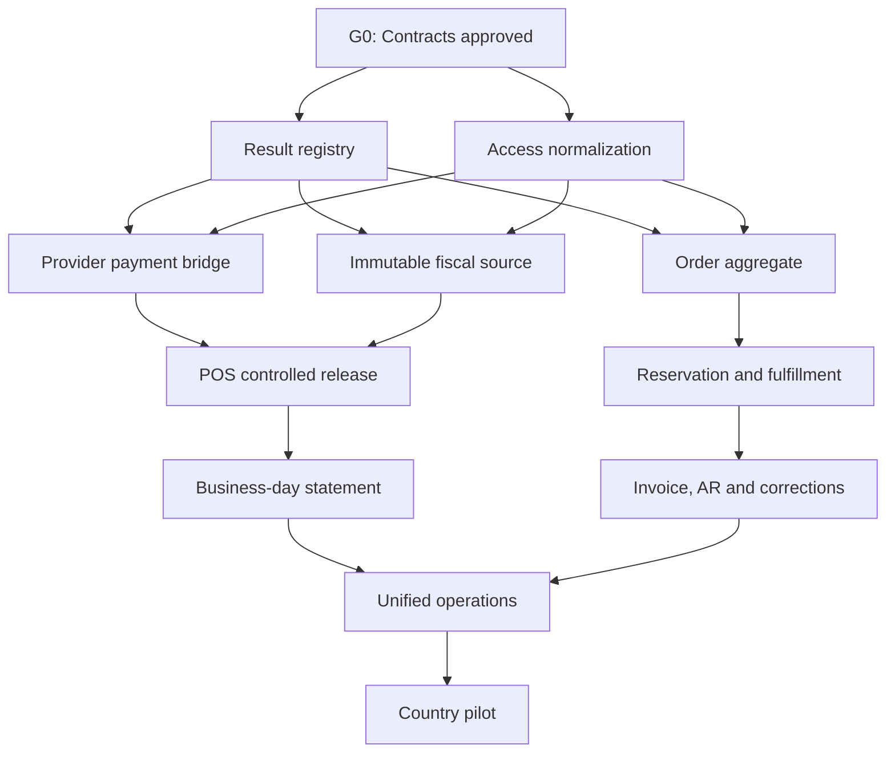

# Stoquify Enterprise Sales-to-Cash Implementation Roadmap

Roadmap date: 2026-08-17  
Source: `STOQUIFY_ENTERPRISE_SALES_TO_CASH_AUDIT_AND_MODERNIZATION_2026-08-16`  
Current program status: **BLOCKED — implementation and production proof required**  
Planning horizon: 32–40 weeks with two dedicated delivery squads and shared control reviewers  
Classification: implementation program; not a legal, accounting, PCI, security, accessibility, or production certification

> **Gate-numbering notice:** This roadmap predates the verifiable-baseline gate added by the canonical `STOQUIFY_POS_AND_SALES_TO_CASH_MASTER_IMPLEMENTATION_ROADMAP_2026-08-17.md`. Use the master roadmap for execution and approvals. The mapping is: this document's `G0 → canonical G1`, `G1 → G2`, `G2A → G3A`, `G2B → G3B`, `G3 → G4`, `G4 → G5`, `G5 → G6`, `G6 → G7`, `G7 → G8`, and `G8 → G9`. In particular, the requested D-01–D-11 architecture/control freeze is canonical **G1**, not this document's legacy G0.

## 1. Roadmap decision

Stoquify should modernize sales-to-cash through two coordinated product paths:

1. Harden the existing immediate POS path until cash, electronic tender, stock, accounting, receipt/fiscal evidence, offline replay, shift close, and reconciliation are trustworthy under concurrency and failure.
2. Build a separate delivery/on-account order-to-cash orchestrator for promise, reservation, fulfillment, goods issue, invoicing, AR, collection, returns, and corrections.

Both paths must reuse the same inventory, valuation, accounting, provider-event, reconciliation, receipt/fiscal, audit, close-invalidation, and outbox kernels. The program must not create a second immediate-sale finalizer.

The implementation sequence is:

No phase is complete because code exists. It is complete only when its state contract, migrations, runtime behavior, negative authorization tests, accounting/inventory tie-outs, recovery behavior, operational evidence, and reviewer decisions pass the named exit gate.

## 2. Ambition and measurable outcomes

The completed program must provide:

- One authoritative owner for every material sales transition.
- Exactly-once observable outcomes for retries without pretending distributed processing is globally exactly once.
- Provider-owned electronic payment truth from initiation through settlement, reversal, dispute, and chargeback.
- Immutable receipt/fiscal-source evidence for every completed sale, independent of delivery success.
- Correct inventory quantity and COGS movement at the physical goods-issue event.
- Balanced, source-linked accounting for cash, provider clearing, AR, revenue, tax, COGS, inventory, fees, refunds, settlements, disputes, and corrections.
- Delivery/on-account order processing with reservation, partial fulfillment, invoicing, collection, return, and correction.
- Distinct and observable session close, tender declaration, business-day statement, provider reconciliation, and accounting close.
- Signed, ordered, replay-safe, conflict-aware, and operationally resolvable offline events.
- Consistent tenant/location isolation, RBAC, module entitlement, fresh authentication, redaction, audit, and separation of duties.
- Accessible cashier, manager, accountant, inventory, treasury, and support workflows.
- A release evidence pack tied to one commit, one environment, one provider configuration, and one qualified country pack.

### 2.1 Program-level acceptance metrics

| Measure | Required outcome before controlled production |
| --- | --- |
| Completed-sale result coverage | 100% of completed sales have an immutable result-registry record |
| Retry behavior | 100% identical retries return the original result; all conflicting payloads reject and audit |
| Duplicate consequences | Zero duplicates in repeated PostgreSQL race and response-loss tests |
| Electronic payment truth | Zero sale completions from pending, unknown, timed-out, or operator-reference-only payment states |
| Receipt/fiscal source | 100% of completed sales have an immutable source payload/hash before response |
| Stock/accounting tie-out | Every sale, fulfillment, correction, and return ties source quantity/cost to postings |
| Ledger balance | Every posting batch balances; posted history is corrected only through linked records |
| Provider reconciliation | 100% of captured funds are settled, reversed, refunded, disputed, or in owned suspense |
| Close integrity | No final business-day statement with unresolved offline, drawer, provider, fiscal, or posting blockers |
| Isolation | Zero cross-tenant and unauthorized cross-location access in the full negative matrix |
| Sensitive data | Zero PAN/CVV/PIN/secrets or unnecessary customer PII in application logs and evidence |
| Accessibility | Critical cashier/manager tasks pass the approved keyboard, focus, screen-reader, touch, and responsive matrix |
| Recovery | Every queued, unknown, conflict, and dead-letter state has a tested owner and runbook |

## 3. Non-negotiable implementation constraints

- No destructive database reset or destructive migration.
- No mutation or deletion of completed sales, payments, stock movements, receipts, fiscal documents, journals, reconciliation evidence, or audit records.
- Financial and stock corrections use linked compensating records.
- All reads and writes remain organization-scoped and location-scoped where the business fact is location-bound.
- All critical commands enforce explicit RBAC and module entitlement on the server.
- High-risk commands require fresh authentication and maker-checker approval where material.
- Receipt delivery failure never rolls back or conceals a completed sale.
- Provider uncertainty never becomes successful payment.
- Offline clients never allocate final fiscal numbers without country-pack authority.
- Logs and evidence exclude secrets, PAN, CVV, PIN, raw provider payloads, and unnecessary customer PII.
- Shared code contains no hard-coded national tax, receipt, numbering, or retention law.
- Country-pack conclusions require dated, versioned, qualified-human review.
- Existing dirty-worktree changes must be preserved and attributed.
- `commitPOSSale` remains the only immediate-sale finalizer.
- Analytics, loyalty, CRM, forecasting, and recommendation work remains deferred until transaction truth is complete.

## 4. Delivery model and capacity assumptions

The 32–40 week horizon assumes:

- Squad A — Transaction Trust and Payments: POS finalization, idempotency, provider state, receipts, offline, and close.
- Squad B — Order-to-Cash and Store Operations: order, reservation, fulfillment, invoice, AR, returns, business day, and operator experience.
- Shared reviewers — accounting controller, inventory controller, payments/treasury, security, country-pack expert, accessibility, operations/support, SRE/release, and product.
- A real PostgreSQL integration environment and at least one provider sandbox are available by Phase 2.
- One pilot country, currency, provider set, and receipt/fiscal configuration are chosen by Phase 0.
- Hardware profiles for scanner, printer, drawer, and terminal are available by Phase 3.

If only one delivery squad is available, plan 48–60 weeks. Adding developers without dedicated controller, security, provider, country-pack, accessibility, and SRE decisions will not shorten the critical path.

## 5. Program workstreams

| Workstream | Scope | Accountable owner | Principal dependencies |
| --- | --- | --- | --- |
| WS-01 Transaction integrity | Client result registry, canonical hashes, concurrency, recovery | Principal backend/POS engineer | Architecture and migration policy |
| WS-02 Access and fraud controls | Permission vocabulary, entitlement, fresh auth, maker-checker, redaction | Security architect | Product risk thresholds |
| WS-03 Payments and treasury | Provider state, webhook/polling, clearing, settlement, fees, suspense, disputes | Payments lead/treasury | WS-01, provider sandbox |
| WS-04 Receipt and fiscal evidence | Immutable source, country adapter, numbering, delivery, correction documents | Compliance engineering lead | WS-01, country-pack reviewer |
| WS-05 Inventory and fulfillment | Reservation, availability, pick/ship, goods issue, valuation, returns | Inventory domain lead | Order contract and product policy |
| WS-06 Accounting and AR | Posting rules, invoices, AR, allocation, credit notes, close invalidation | Accounting engineering lead/controller | WS-03, WS-05 |
| WS-07 Store close and reconciliation | Session, declaration, business day, statement, X/Z, sign-off, handoff | Store operations lead | WS-03, offline evidence |
| WS-08 Cashier and manager experience | Checkout, recovery, hardware, offline, accessibility, privacy, handover | Product/UI lead | Frozen domain contracts |
| WS-09 Reliability and release | Observability, SLOs, load, restore, rollout, rollback, evidence pack | SRE/release lead | All workstreams |

## 6. Critical path and parallelization

Critical path:

1. Contract and control freeze.
2. Result idempotency and access normalization.
3. Provider-authoritative payment and immutable receipt source.
4. Immediate POS controlled release evidence.
5. Business-day statement and reconciliation.
6. Unified operational hardening.
7. Country pilot and production proof.

Delivery/on-account can begin after Phase 1 and run in parallel with store-close work:

Parallel work is allowed only when teams own disjoint files or interfaces and consume frozen contracts. Two teams must not independently change sale finalization, payment-state normalization, posting rules, or fiscal-source contracts.

## 7. Phase plan

## Phase 0 — Program control and contract freeze

Indicative duration: weeks 1–2  
Entry: audit accepted as the planning baseline  
Exit gate: G0 Architecture and Control Freeze

### Objectives

- Convert audit decisions into versioned implementation contracts.
- Select the first pilot country, currency, locations, provider(s), and hardware profile.
- Establish a clean program baseline without discarding the current dirty worktree.
- Define evidence ownership and stop/go authority.

### Work packages

| ID | Deliverable |
| --- | --- |
| FND-01 | Program charter, scope, non-goals, decision register, dependency register, and named owners |
| FND-02 | State-transition catalog for sale, provider payment, receipt/fiscal source, session, statement, order, reservation, fulfillment, invoice, payment allocation, return, and correction |
| FND-03 | Command contract template: actor, permission, entitlement, precondition, transaction, idempotency, event, accounting, inventory, audit, recovery, terminal state |
| FND-04 | Additive migration and backfill policy; rollback through feature flags/shadow paths rather than data destruction |
| FND-05 | Canonical money, currency minor-unit, tax snapshot, date/time/business-day, and location rules |
| FND-06 | Evidence index and release-gate ownership |
| FND-07 | Dirty-worktree attribution and branch/worktree coordination plan |

### Mandatory decisions

- Product: immediate tender types, on-account policy, delivery flow, partial fulfillment, return/refund scope.
- Accounting: posting roles, recognition timing, clearing, AR, fees, tax, corrections, close.
- Inventory: availability, reservation, goods issue, negative stock, valuation, return disposition.
- Payments: provider canonical-state mapping, unknown handling, settlement and dispute policy.
- Country pack: required receipt/fiscal fields, numbering, offline/provisional behavior, retention, corrections.
- Security: permission vocabulary, high-risk thresholds, maker-checker rules, evidence retention.

### G0 exit criteria

- Every material transition has one proposed authoritative owner.
- State and command contracts are approved by the relevant controller.
- The first country/provider/hardware pilot scope is explicit.
- Unsupported multi-currency, tax, UOM, lot/serial, provider, and fiscal combinations fail closed.
- A clean named implementation baseline is available; unrelated user changes remain preserved.

## Phase 1 — Transaction and access foundations

Indicative duration: weeks 3–6  
Entry: G0 passed  
Exit gate: G1 Transaction Trust

### Stream 1A: tenant-scoped POS result registry

| ID | Implementation slice |
| --- | --- |
| TRN-01 | Add result-registry schema keyed by organization, terminal, and `clientCommitId` |
| TRN-02 | Add canonical request hashing and schema version |
| TRN-03 | Claim/result lifecycle with immutable redacted result envelope |
| TRN-04 | Integrate into the existing `commitPOSSale` transaction |
| TRN-05 | Return the original result for identical retries; reject and audit payload conflicts |
| TRN-06 | Add real PostgreSQL race, response-loss, timeout, rollback, and replay tests |
| TRN-07 | Bind sale, payment/AR, stock, journal, fiscal source, outbox, and result IDs |

### Stream 1B: access-boundary normalization

| ID | Implementation slice |
| --- | --- |
| SEC-01 | Freeze canonical POS/sales/payment/close permission vocabulary and compatibility aliases |
| SEC-02 | Enforce module entitlement at route, page-data, read, command, offline, receipt, report, export, and API boundaries |
| SEC-03 | Add organization/location negative test matrix |
| SEC-04 | Replace over-privileged cashier seed behavior with least-privilege fixtures |
| SEC-05 | Add fresh-auth and maker-checker policies for refunds, voids, overrides, payouts, variances, manual matches, goods-issue reversals, and credit notes |
| SEC-06 | Add sensitive-data redaction and evidence-retention tests |
| SEC-07 | Ratchet module-surface findings to prevent new unmapped or unenforced surfaces |

### G1 exit criteria

- Concurrent identical attempts create exactly one authoritative sale result and consequence set.
- Conflicting uses of the same client ID fail closed and audit.
- Failed transactions leave no completed registry result or partial financial/stock consequence.
- Navigation, reads, commands, offline actions, receipt actions, reports, and exports enforce approved authority.
- Cross-tenant and unauthorized cross-location tests pass.
- No destructive migration and no mutation of completed history.

## Phase 2A — Provider-authoritative electronic payments

Indicative duration: weeks 7–12  
Entry: G1 passed and provider sandbox available  
Exit gate: G2A Payment Truth

### Work packages

| ID | Implementation slice |
| --- | --- |
| PAY-01 | Versioned mapping from each provider state to canonical initiated, pending, authorized, captured, unknown, declined, cancelled, expired, settled, reversed, refunded, disputed, and chargeback states |
| PAY-02 | Payment-intent command with provider and internal idempotency |
| PAY-03 | Signed webhook and polling ingestion with timestamp, replay, signature, payload-hash, and monotonic-transition controls |
| PAY-04 | POS checkout bridge that completes only after provider-authoritative capture |
| PAY-05 | Captured-without-sale and late-capture exception/suspense workflows |
| PAY-06 | Provider clearing, settlement, fee, reversal, refund, dispute, and chargeback postings |
| PAY-07 | Statement import and match linkage to the same POS payment transaction and ledger source |
| PAY-08 | Provider outage, duplicate callback, mismatch, key rotation, delayed statement, and retry runbooks |

### G2A exit criteria

- Pending, unknown, timeout, and manual reference never complete a sale.
- Duplicate webhooks and polls do not duplicate payment, sale, posting, or receipt consequences.
- Amount/currency mismatch and impossible state changes quarantine.
- Captured-without-sale, sale-without-settlement, settlement shortfall, fee, reversal, dispute, and chargeback remain visible until terminal resolution.
- Provider events, internal transaction, sale, clearing posting, statement line, and reconciliation certificate share traceable source links.
- Sandbox evidence covers success and all named failure paths.

## Phase 2B — Immutable receipt and fiscal-source truth

Indicative duration: weeks 7–11, parallel with Phase 2A  
Entry: G1 passed and country-pack review initiated  
Exit gate: G2B Document Truth

### Work packages

| ID | Implementation slice |
| --- | --- |
| FIS-01 | Canonical immutable receipt/fiscal-source payload and schema version |
| FIS-02 | Source materialization and hash inside the existing sale transaction |
| FIS-03 | Resolve unused synchronous fiscal helper; retain one fiscalization owner |
| FIS-04 | Country-pack-governed legal number allocation and authority submission |
| FIS-05 | Worker lease, retry, backoff, dead-letter, replay, and operator recovery |
| FIS-06 | Durable print, email, SMS, WhatsApp, and public-token delivery states for supported channels |
| FIS-07 | Token signing, expiry, scope, revocation, rotation, and release-secret enforcement |
| FIS-08 | Linked credit/void/correction fiscal documents without rewriting originals |

### G2B exit criteria

- Every completed sale has immutable source evidence before its result returns.
- Later catalog, price, tax, customer, organization, or location edits do not change the receipt source.
- Legal numbering remains unavailable offline and fails closed without country-pack authority.
- Delivery failure is visible but never changes completed financial truth.
- Worker retry and dead-letter drills preserve one document/number per authorized scope.
- Production-secret configuration passes in release mode.
- Qualified country-pack review is dated and versioned; no shared code hard-codes national law.

## Phase 3 — Immediate POS controlled-release completion

Indicative duration: weeks 13–16  
Entry: G2A and G2B passed  
Exit gate: G3 Immediate POS Release Candidate

### Work packages

| ID | Implementation slice |
| --- | --- |
| POS-01 | Remove or disable UI tender methods the service cannot truthfully support |
| POS-02 | Apply country/currency minor-unit and rounding contract to display, input, receipt, posting, and tests |
| POS-03 | Connect offline checkout to the signed offline event and result-recovery flow |
| POS-04 | Integrate supported scanner, receipt printer, cash drawer, and terminal health contracts |
| POS-05 | Add inactivity lock, cashier handover, controlled session recovery, and safe refresh/resume |
| POS-06 | Complete refund/void/receipt recovery and manager-approval interfaces |
| POS-07 | Complete mobile cart, keyboard, focus, screen-reader announcements, touch targets, localization, privacy masking, and error recovery |
| POS-08 | Add end-to-end telemetry with redacted correlation IDs and operator-safe messages |

### G3 exit criteria

- Cash and supported electronic tenders pass browser, device, concurrency, failure, and recovery scenarios.
- Unsupported tender/currency/tax/hardware capabilities are not displayed as available.
- Sale completion can always recover its immutable original result and receipt source.
- Offline conflict cannot create silent duplicate finalization or final fiscal numbering.
- Critical cashier and manager flows pass accessibility and responsive review.
- No secrets, PAN/CVV/PIN, or unnecessary PII appear in logs, support views, receipts, or screenshots.

## Phase 4 — Governed business day, statements, and close

Indicative duration: weeks 17–22  
Entry: G3 passed; provider reconciliation and offline evidence available  
Exit gate: G4 Store Financial Close

### Work packages

| ID | Implementation slice |
| --- | --- |
| CLS-01 | Location/time-zone-aware business-day aggregate supporting cross-midnight trading |
| CLS-02 | Session inclusion and immutable source-manifest hash |
| CLS-03 | Blind cash/tender declaration with denomination evidence |
| CLS-04 | Variance threshold, fresh-auth approval, and no-self-approval rules |
| CLS-05 | X report for interim review and immutable final Z report |
| CLS-06 | Retail statement calculation from included completed transactions |
| CLS-07 | Statement posting status and source-linked journal evidence |
| CLS-08 | Provider settlement/reconciliation and suspense status |
| CLS-09 | Fiscal, offline, stock, receipt, and posting blocker aggregation |
| CLS-10 | Accounting-close handoff and invalidation after late postings/corrections |

### G4 exit criteria

- Session close, declaration, business day, statement, provider reconciliation, and accounting close have separate states and owners.
- A final Z/statement cannot omit accepted offline events or unresolved replay conflicts.
- Declared, system, provider, ledger, and bank totals are explainably tied or in owned suspense.
- Manager sign-off is supported, attributable, fresh-authenticated, and separation-of-duties compliant.
- Corrections after statement or close create linked evidence and invalidate affected readiness.
- X/Z naming and legal meaning are country-pack reviewed rather than assumed.

## Phase 5 — Delivery/on-account order and fulfillment

Indicative duration: weeks 17–24, parallel with Phase 4  
Entry: G1 passed; order/inventory/accounting contracts approved  
Exit gate: G5 Physical Fulfillment Truth

### Work packages

| ID | Implementation slice |
| --- | --- |
| OTC-01 | Add explicit order header/line version, terms, delivery location, price/tax snapshot, credit policy, and command idempotency |
| OTC-02 | Confirm order as a non-posting promise |
| INV-01 | Add reservation aggregate with active, partial, consumed, released, and expired states |
| INV-02 | Calculate sellable availability from on-hand, reserved, policy, and location |
| FUL-01 | Add fulfillment aggregate and partial release/pick/pack/ship/handover states |
| FUL-02 | Post goods issue through the existing inventory stock-event/valuation kernel |
| FUL-03 | Consume reservation exactly once and preserve backorder quantities |
| FUL-04 | Add cancellation before goods issue and linked goods-issue reversal afterward |
| FUL-05 | Add delivery evidence, proof of handover, and operator recovery |
| CAP-01 | Fail closed for unimplemented UOM, lot, serial, expiry, negative-stock, or multi-location combinations |

### G5 exit criteria

- Order confirmation posts no revenue, AR, COGS, or inventory.
- Reservation changes reserved/available but not on-hand or COGS.
- Physical goods issue changes quantity and posts COGS/inventory exactly once.
- Partial fulfillment, backorder, cancellation, and reversal preserve original line history.
- Every stock event links to order line, fulfillment line, location, valuation evidence, actor, and command key.
- Concurrent reservation and goods-issue tests prove no oversell beyond approved policy.

## Phase 6 — Invoice, AR, collections, returns, and corrections

Indicative duration: weeks 25–30  
Entry: G5 passed; controller billing policy approved  
Exit gate: G6 Financial Order-to-Cash

### Work packages

| ID | Implementation slice |
| --- | --- |
| AR-01 | Build invoice eligibility from delivered quantities or explicit approved advance policy |
| AR-02 | Post immutable invoice with AR, revenue, tax, posting rule, fiscal source, and source links |
| AR-03 | Support partial invoices, due dates, allocations, partial payments, and unapplied cash |
| AR-04 | Connect provider collections to the Phase 2 payment/reconciliation kernel |
| COR-01 | Add return authorization and received/inspected/disposition states |
| COR-02 | Add restock, quarantine, damaged, and write-off inventory consequences |
| COR-03 | Add source-linked credit notes, refunds, AR adjustments, and goods-issue reversals |
| COR-04 | Add disputes, chargebacks, and recovery cases without rewriting original sale/invoice/payment |
| AR-05 | Add customer statement, aging, collection evidence, and accounting-close invalidation |

### G6 exit criteria

- Only eligible quantities are invoiced and no line is billed twice.
- Invoice posting balances AR/revenue/tax and binds immutable source/fiscal evidence.
- Customer payments allocate explicitly; unapplied or mismatched funds remain visible.
- Returns require disposition before sellable stock increases.
- Credit note, refund, stock correction, provider correction, and journal reversal all link to the original fact.
- Partial fulfillment/invoice/payment/return scenarios tie order, stock, AR, provider, and ledger quantities/amounts.

## Phase 7 — Unified operations, maintainability, and hardening

Indicative duration: weeks 31–34  
Entry: G4 and G6 passed  
Exit gate: G7 Operational Readiness Candidate

### Work packages

| ID | Implementation slice |
| --- | --- |
| OPS-01 | SLOs for checkout, provider callback, fiscal worker, delivery, offline replay, statement posting, reconciliation, fulfillment, invoicing, and receipt delivery |
| OPS-02 | Redacted dashboards, alert routing, dead-letter queues, suspense aging, and ownership |
| OPS-03 | Runbooks for every non-terminal/unknown/conflict state |
| OPS-04 | Load, soak, concurrency, network-loss, provider-outage, queue-backlog, and recovery tests |
| OPS-05 | Backup/restore, point-in-time recovery, failover, and evidence restoration drill |
| OPS-06 | Decompose oversized POS component/service behind frozen contracts without changing business ownership |
| OPS-07 | Accessibility regression, browser/device matrix, visual regression, performance budgets, and localization |
| OPS-08 | Security scan, threat-model review, abuse tests, secret rotation, log/evidence review, and retention controls |
| OPS-09 | Support timelines linking sale, result, receipt, payment, stock, journal, fulfillment, statement, and correction evidence |

### G7 exit criteria

- Every alert has an owner, severity, response time, runbook, and terminal resolution.
- Backup/restore and failure drills preserve immutable/source-linked evidence.
- Performance and queue backlogs remain within approved budgets under expected peak and degraded-provider load.
- Decomposition does not introduce a second finalizer or divergent posting/stock/fiscal logic.
- No unresolved critical security, isolation, accessibility, accounting, inventory, payment, or recovery finding.

## Phase 8 — Country pilot and production proof

Indicative duration: weeks 35–40  
Entry: G7 passed and qualified country/provider approvals available  
Exit gate: G8 Production Expansion Decision

### Rollout stages

| Stage | Cohort | Entry evidence | Automatic rollback/stop condition |
| --- | --- | --- | --- |
| R0 | Local and CI | All focused unit/integration/gate suites | Any invariant failure |
| R1 | Staging with provider/fiscal sandbox | Full end-to-end and recovery matrix | Duplicate consequence, unexplained posting/stock mismatch |
| R2 | Internal staff/demo organization | Controlled hardware and store day | False payment success, cross-tenant access, unrecoverable close |
| R3 | One design partner, one country/provider/location set | Human approvals and daily evidence review | Any critical financial, fiscal, security, stock, or privacy issue |
| R4 | Up to 5% eligible cohort | Stable SLOs and no unresolved material suspense | Threshold breach or unexplained cohort divergence |
| R5 | Up to 25% eligible cohort | Two stable business-day/settlement cycles minimum | Close/reconciliation drift, support overload, material accessibility regression |
| R6 | General availability by eligible country/package | Formal G8 decision and rollback readiness | Ongoing error-budget or control breach |

### Production evidence pack

- Named commit, build, environment, configuration, migration hashes, and deployed country-pack/provider versions.
- Additive migration status, backfill/reconciliation certificate, and rollback/disable plan.
- PostgreSQL concurrency and failure-injection evidence.
- Provider sandbox/live pilot webhook, poll, capture, settlement, fee, refund, reversal, dispute, and statement evidence.
- Receipt/fiscal worker, legal number, delivery, token secret, retry, dead-letter, and correction evidence.
- Inventory quantity/valuation/COGS tie-outs.
- Cash, clearing, AR, revenue, tax, COGS, inventory, fee, refund, settlement, and correction ledger tie-outs.
- Session, tender declaration, business-day, X/Z, statement, provider reconciliation, and accounting-close evidence.
- Tenant/location isolation, RBAC, entitlement, fresh auth, maker-checker, redaction, and audit evidence.
- Browser, accessibility, supported hardware, offline, performance, restore, failover, monitoring, and incident evidence.
- Dated reviewer decisions and explicit remaining limitations.

### G8 exit decision

G8 can authorize only the tested country, currency, provider, hardware, tax, receipt/fiscal, inventory, and product combination. It must not imply support for an untested combination or certify PCI, legal, accounting, security, or accessibility status without the relevant qualified assessment.

## 8. Stage-gate governance

| Gate | Decision | Required approvers | May not self-certify |
| --- | --- | --- | --- |
| G0 | Architecture/control freeze | Product, architecture, accounting, inventory, payments, security, country-pack | Implementing engineer |
| G1 | Transaction trust | POS/backend, DBA, security, accounting/inventory reviewers | Result-registry author alone |
| G2A | Payment truth | Payments, treasury, accounting, security | Provider adapter author alone |
| G2B | Document truth | Compliance engineering, country-pack expert, accounting, security | Shared-code author alone |
| G3 | Immediate POS release candidate | Product, operations, accessibility, security, SRE | POS squad alone |
| G4 | Store financial close | Store operations, treasury, accounting controller | Cashier/declarer |
| G5 | Fulfillment truth | Inventory controller, product, accounting | Fulfillment squad alone |
| G6 | Financial O2C | Accounting controller, treasury, inventory, product | O2C squad alone |
| G7 | Operational candidate | SRE, security, accessibility, support, all controllers | Release engineer alone |
| G8 | Production expansion | Executive product owner plus all material domain approvers | Any single function |

At each gate, the decision must be `PASS`, `PASS WITH EXPLICIT LIMITED SCOPE`, or `BLOCKED`. “Code complete,” “tests mostly pass,” and “works locally” are not gate outcomes.

## 9. Additive migration and legacy-data strategy

### 9.1 Migration rules

- Add new tables/columns/indexes without resetting or rewriting transaction history.
- Use expand/backfill/verify/enforce/contract sequencing.
- Introduce uniqueness only after duplicates and nulls are measured and resolved through evidence-backed records.
- Backfills must be resumable, idempotent, organization-scoped, chunked, observable, and hash-certified.
- New code must tolerate old and new rows during rollout.
- Rollback disables new writers/read paths; it does not delete new evidence or restore old mutable behavior.

### 9.2 Legacy truth classification

| Legacy fact | Migration treatment |
| --- | --- |
| Completed sale without result registry | Create a historical result-reference record from existing immutable IDs/hashes; do not pretend it proves original client retry |
| Electronic payment with only operator reference | Classify as legacy/unverified or reconciled-by-evidence; never backfill as provider-captured without provider proof |
| Sale without `FiscalDocument` | Materialize from the best preserved source only if provenance is sufficient; otherwise mark evidence gap |
| Mutable receipt presentation | Preserve original available evidence and mark confidence; do not reconstruct legal facts silently |
| Existing journals/stock events | Link through additive source references; never rewrite or delete |
| Sales order lifecycle labels without transitions | Do not synthesize fulfillment history without evidence |
| Existing close/reconciliation reports | Preserve and version; do not retroactively certify unsupported sign-off |

## 10. Test and evidence strategy

### 10.1 Test pyramid by consequence

| Layer | Required coverage |
| --- | --- |
| Contract/unit | State transitions, money/tax rounding, permission decisions, provider mappings, hashes, redaction |
| Service integration | Real PostgreSQL transactions, unique constraints, CAS, rollback, source links, balanced postings |
| Concurrency/chaos | Duplicate clicks, response loss, simultaneous terminals, webhook/poll races, queue retries, worker lease expiry |
| Cross-domain scenario | Sale/payment/stock/ledger/receipt; order/fulfillment/invoice/AR; statement/reconciliation/close |
| Browser/accessibility | Cashier, manager, support, keyboard, focus, screen reader, touch, responsive, recovery |
| Provider/hardware | Sandbox/live pilot, scanner, printer, drawer, network loss, delayed callback, offline replay |
| Operations | Load/soak, backup/restore, failover, dead-letter, suspense, incident, rollback |

### 10.2 Mandatory negative scenarios

- Cross-tenant and unauthorized cross-location ID guesses.
- Missing/expired module entitlement.
- Stale authentication and self-approval.
- Same client ID with different payload.
- Provider pending/unknown/timeout/late capture/duplicate/replayed/forged callback.
- Amount/currency/provider-account mismatch.
- Sale commit failure after provider capture.
- Fiscal worker unavailable or authority rejects.
- Receipt delivery provider unavailable.
- Offline device revoked, signature invalid, sequence gap, expired policy, conflicting payload.
- Concurrent stock reservation/issue and negative availability.
- Partial delivery, partial invoice, partial payment, partial return, and duplicate correction.
- Close attempted with open session, open drawer, offline conflict, unresolved provider suspense, fiscal dead letter, or unposted journal.
- Recovery after browser refresh, process crash, network loss, worker restart, and database retry.

### 10.3 Evidence quality

Every gate artifact must distinguish:

- Static source evidence.
- Unit/mock evidence.
- Real database/runtime evidence.
- Provider/hardware/browser evidence.
- Staging proof.
- Production pilot proof.
- Qualified-human review.

Evidence must include commit/configuration/environment identifiers, timestamps, commands, outputs, source hashes, redaction confirmation, unresolved limitations, and reviewer identity.

## 11. Requirement-to-phase traceability

| Audit blocker | Owning phase(s) |
| --- | --- |
| 1. No client-result replay | Phase 1 |
| 2. No PostgreSQL concurrency proof | Phases 1, 7, 8 |
| 3. Manual reference becomes paid | Phase 2A |
| 4. Incomplete provider canonical state | Phase 2A |
| 5. No provider-to-statement-to-ledger proof | Phases 2A, 4, 8 |
| 6. No immutable source in every completed sale | Phase 2B |
| 7. Fiscal helper ownership ambiguity | Phase 2B |
| 8. No production fiscal worker/authority proof | Phases 2B, 8 |
| 9. Production receipt token secret absent | Phases 2B, 8 |
| 10. Incomplete durable receipt channels | Phases 2B, 3 |
| 11. No qualified country-pack approval | Phases 0, 2B, 8 |
| 12. No delivery order-to-cash workflow | Phases 5, 6 |
| 13. No partial fulfillment/invoice/refund contract | Phases 5, 6 |
| 14. No UOM/lot/serial/expiry POS proof | Phases 0, 5; unsupported until proven |
| 15. No business-day/X/Z/statement aggregate | Phase 4 |
| 16. Reconciliation/sign-off unsupported | Phase 4 |
| 17. Inconsistent permissions/entitlements | Phase 1 |
| 18. Broad module enforcement candidates | Phases 1, 7 |
| 19. Cashier least privilege/handover/SoD incomplete | Phases 1, 3, 4 |
| 20. Store-credit UI/service contradiction | Phase 3 |
| 21. XAF minor-unit policy unproven | Phases 0, 3, 8 |
| 22. Offline checkout not connected to UI | Phase 3 |
| 23. Hardware readiness synthetic | Phases 3, 8 |
| 24. Mobile/accessibility/privacy/recovery gaps | Phases 3, 7, 8 |
| 25. No production isolation/load/restore/observability proof | Phases 7, 8 |
| 26. No formal certifications | External qualified assessments after G7; never self-certified |
| 27. Dirty worktree not tied to release commit | Phases 0, 8 |

All 27 audit blockers have an owning phase. A phase cannot close while its blocker remains unowned, silently deferred, or relabeled as complete without evidence.

## 12. Program risk register

| Risk | Early warning | Mitigation | Owner |
| --- | --- | --- | --- |
| Provider semantics differ from assumed canonical states | Manual exceptions or state regressions increase | Versioned adapter, raw redacted evidence, quarantine, provider sandbox contract tests | Payments lead |
| Country-pack decision arrives late | Shared code starts accumulating jurisdiction logic | Choose pilot country at Phase 0; block fiscal claims; use fail-closed adapter | Product/compliance |
| Existing dirty changes collide with core work | Unattributed diffs or failing baselines | Named baseline, file ownership, narrow worktrees, frequent status attribution | Program lead |
| POS service remains a change hotspot | Merge conflicts and regression frequency | Freeze contracts, extract behind tests only after G3 | Architecture lead |
| Backfill invents historical truth | Synthetic captured/fiscal/fulfillment states | Confidence classification, evidence gaps, no unsupported reconstruction | Data/accounting |
| O2C duplicates POS kernels | New posting/stock/receipt code appears in orchestrator | Architecture gate and dependency rules | Architecture/controller |
| Scope expands to full ERP parity | Phase deliverables grow without closing blockers | Non-goals and gate-owned change control | Product |
| Hardware/provider access blocks proof | Tests remain mocked late in program | Secure devices/sandboxes in Phase 0 | Operations/payments |
| Maker-checker blocks small-business usability | Excessive approvals and abandonment | Materiality thresholds, role-aware policy, measured pilot | Product/security/controller |
| Evidence contains sensitive data | Raw callbacks or customer data appear in logs | Redaction schema, test fixtures, secret/DLP scanning | Security |
| Team optimizes for passing static gates | Runtime failures remain undiscovered | Evidence taxonomy and real PostgreSQL/provider/browser gates | Release/SRE |

## 13. Operating metrics after launch

### Transaction integrity

- Sale attempts, registry claims, original-result replays, payload conflicts, and abandoned claims.
- Duplicate-consequence detector count: target zero.
- Commit latency and rollback/error rate by tender/location/terminal.

### Payments and treasury

- Pending/unknown age, late captures, captured-without-sale cases, provider callback latency.
- Settlement match rate, fee variance, suspense count/value/age, disputes, and chargebacks.
- Every amount is measured by organization, provider account, currency, and business date.

### Receipt/fiscal

- Completed-sale source coverage, fiscal queue age, authority rejection, dead letters.
- Delivery success/retry/failure by channel without exposing destination PII.
- Sequence gaps/duplicates and country-pack version distribution.

### Inventory and O2C

- Reservation aging, oversell attempts, partial fulfillment, backorder age.
- Goods-issue-to-invoice lag, stock/COGS tie-out, return disposition age, write-off approvals.
- Order-to-cash cycle time and AR aging.

### Store close

- Sessions closed on time, variance value/frequency, pending approvals.
- Business days blocked, blocker age, statement-posting lag, reconciliation completion.
- Late corrections and close invalidations.

### Experience and reliability

- Checkout completion/recovery, offline conflicts, hardware failure, receipt recovery.
- Accessibility task success and critical regression count.
- SLO/error-budget, worker backlog, restore/failover results, support case resolution.

Metrics must support action and control; they must not become a second transaction truth.

## 14. Future Codex execution sequence

Each execution should be a bounded slice with its own ownership, baseline, tests, evidence, and handoff. Recommended sequence:

1. Freeze sales-to-cash state, command, permission, money, and country-capability contracts.
2. Implement tenant-scoped POS client-result registry and real PostgreSQL concurrency proof.
3. Normalize POS RBAC/module entitlement, least-privilege roles, fresh auth, and maker-checker.
4. Implement canonical provider state and signed event/poll ingestion.
5. Connect POS electronic tender to provider capture, clearing, suspense, and result replay.
6. Implement immutable receipt/fiscal source in the sale transaction and durable delivery.
7. Complete immediate POS offline/hardware/recovery/accessibility experience.
8. Implement business day, blind declaration, X/Z, statement, reconciliation, and sign-off.
9. Implement delivery order confirmation and reservation.
10. Implement partial fulfillment, physical goods issue, reversal, and delivery evidence.
11. Implement invoice, AR, allocations, returns, credit notes, refunds, and disputes.
12. Implement unified observability, support timelines, SLOs, chaos, restore, and release evidence.
13. Run the limited country/provider/hardware pilot and close every blocker before expansion.

Every run must:

- Re-read this roadmap and the audit.
- Capture `git status --short` before work.
- Declare exact files and transitions owned.
- Avoid destructive migrations and preserve existing evidence.
- Add only the smallest additive schema required for the slice.
- Reuse existing kernels and reject second-owner designs.
- Run focused tests plus the relevant global gates.
- Produce a dated implementation/evidence report with local versus production proof.
- Leave unresolved decisions as explicit blockers rather than assumptions.

## 15. Definition of complete

The sales-to-cash ambition is fulfilled only when:

1. All G0–G8 decisions are passed for an explicit supported scope.
2. All 27 audit blockers are closed, deliberately unsupported with fail-closed behavior, or assigned to an externally qualified assessment.
3. Immediate POS and delivery/on-account workflows share kernels without sharing an overloaded lifecycle.
4. Every terminal financial, inventory, receipt/fiscal, payment, settlement, statement, and correction fact is immutable, source-linked, idempotent, scoped, authorized, auditable, and operationally recoverable.
5. The production evidence pack is bound to the deployed commit and environment.
6. Remaining limitations are visible to operators and customers and are not marketed as supported capability.

Until then, the appropriate status remains **implementation in progress — not production certified**.
