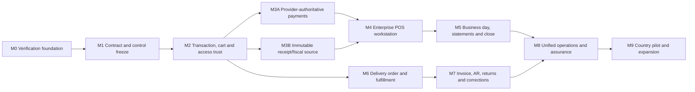

# Stoquify POS and Sales-to-Cash Master Implementation Roadmap

Roadmap date: 2026-08-17  
Program status: BLOCKED — implementation and production evidence required  
Planning horizon: 40–44 weeks with two dedicated squads; 52–64 weeks with one squad  
Scope: immediate POS, electronic tenders, receipts/fiscal evidence, store close, delivery/on-account order-to-cash, controls, operations, and release proof  
Classification: implementation program; not a legal, accounting, PCI, security, accessibility, fiscal, or production certification

## 1. Purpose and roadmap authority

This document consolidates the current POS audit, enterprise Sales-to-Cash audit, readiness assessment, implementation roadmap, evidence record, and the historical AqStoqFlow implementation-gap sequence into one implementation program.

It does not replace the underlying reports. It provides the execution order, work packages, ownership, dependencies, migrations, gates, acceptance evidence, and stop conditions needed to implement their proposals without architectural guesswork.

Primary sources:

- STOQUIFY_POS_ENTERPRISE_GRADE_AUDIT_2026-08-16.md
- STOQUIFY_POS_ENTERPRISE_GRADE_AUDIT_EVIDENCE_2026-08-16.md
- STOQUIFY_ENTERPRISE_SALES_TO_CASH_AUDIT_AND_MODERNIZATION_2026-08-16.md
- STOQUIFY_ENTERPRISE_SALES_TO_CASH_READINESS_2026-08-16.md
- STOQUIFY_ENTERPRISE_SALES_TO_CASH_IMPLEMENTATION_ROADMAP_2026-08-17.md
- Historical AQSTOQFLOW_JUNE_23_24_IMPLEMENTATION_GAP_PLAN_2026-06-24.md and its skills-suite proposal, used only for sequencing and evidence discipline
- graphify-out component, action, app, and hook topology used by the source audits

Where sources disagree, the newer repository-backed Sales-to-Cash reports govern current product truth. Completed controls stay closed unless a regression is reproduced. The historical gap plan governs verification-first sequencing and enforcement discipline, not stale implementation status.

## 2. Program decision

Stoquify will deliver two coordinated product paths:

1. Harden the existing immediate POS path until sale result, cash/electronic tender, stock, accounting, receipt/fiscal source, shift close, offline recovery, devices, and operator experience remain trustworthy under concurrency and failure.
2. Build a separate delivery/on-account order-to-cash orchestrator for promise, reservation, fulfillment, physical goods issue, invoicing, AR, collections, returns, and corrections.

Both paths reuse the existing inventory stock-event/valuation, accounting posting, payment/provider, reconciliation, receipt/fiscal, audit, close-invalidation, and outbox kernels.

The following are architectural invariants:

- services/pos/pos.service.ts::commitPOSSale remains the only immediate-sale finalizer.
- Offline replay enters the same finalizer and never creates a parallel sale kernel.
- Delivery order confirmation is non-posting.
- Reservation changes available quantity, not on-hand quantity or COGS.
- Physical goods issue moves inventory and COGS exactly once.
- Invoice eligibility and AR follow the approved billing event, not an arbitrary status label.
- Provider pending, unknown, timeout, or operator-entered reference never becomes successful payment.
- A completed sale binds immutable receipt/fiscal-source evidence before returning its result.
- Receipt delivery failure never reverses or conceals financial completion.
- Original financial, stock, receipt, fiscal, and audit facts are corrected with linked compensating records, never mutation.
- Client previews never own price, tax, discount, stock, tender, refund, or cash truth.

## 3. Definition of ambition fulfilled

The system ambition is fulfilled only when all of the following are true for an explicitly supported country, currency, provider, hardware, tax, inventory, and receipt/fiscal configuration:

1. Every material transition has one authoritative owner and versioned state contract.
2. Identical retries return one immutable original result; conflicting retries fail closed and audit.
3. Every electronic payment is provider-authoritative from initiation through settlement, reversal, dispute, and chargeback.
4. Every completed sale has immutable receipt/fiscal-source evidence independent of delivery availability.
5. Immediate POS and delivery/on-account workflows reuse kernels without sharing one overloaded lifecycle.
6. Stock quantity, reservation, valuation, COGS, revenue, tax, clearing, AR, fees, refunds, and corrections occur at approved events and tie out.
7. Shift close, tender declaration, business-day statement, provider reconciliation, and accounting close are distinct, observable, and governed.
8. Navigation, route data, reads, writes, offline commands, receipts, reports, exports, and APIs enforce consistent tenant, location, RBAC, and entitlement policy.
9. Cashier, manager, accountant, inventory, treasury, support, and approver workflows are recoverable, bilingual, responsive, accessible, and privacy-minimized.
10. Offline, hardware, browser, provider, fiscal worker, concurrency, load, restore, and failure behavior are proven in the named release environment.
11. Every gate is bound to one commit, migrations, configuration, environment, evidence index, and reviewer decision.
12. Unsupported combinations fail closed and are not marketed as supported capability.

## 4. Delivery model

### 4.1 Teams

| Team | Primary ownership |
| --- | --- |
| Squad A — Transaction Trust and Payments | Result registry, cart concurrency, payment/provider bridge, receipts/fiscal source, reconciliation, immediate-sale backend |
| Squad B — Store Operations and Order-to-Cash | POS workstation, shift/business day, reservation, fulfillment, invoice/AR, returns, operator workflows |
| Shared Platform | RBAC/entitlement, module control, country packs, design system, telemetry, CI/release, migration tooling |
| Control Review Board | Product, accounting, inventory, treasury/payments, security, country-pack, accessibility, operations/support, SRE/release |

### 4.2 Capacity assumptions

- Two squads of 5–7 engineers each, including a senior backend owner and senior frontend owner.
- Dedicated product manager and program manager.
- Named accounting and inventory controllers with scheduled weekly decision capacity.
- Security, accessibility, SRE, country-pack, and payments/provider reviewers are available at defined gates.
- Real PostgreSQL integration environment is ready in Mobilization.
- Provider sandbox, supported hardware, and selected pilot country configuration are secured before their dependent phases.

Adding developers without decision capacity, realistic environments, and controller review will not shorten the critical path.

## 5. Program governance

### 5.1 Required registers

Maintain these versioned artifacts from week 1:

- Decision register and architecture decision records.
- Requirement and finding traceability matrix.
- State-transition and command catalog.
- Migration/backfill register.
- Permission, entitlement, fresh-auth, and maker-checker matrix.
- Country/provider/hardware capability matrix.
- Risk and dependency registers.
- Evidence index tied to commit, environment, configuration, and gate.
- Runbook and operational ownership catalog.
- Release cohort and rollback register.

### 5.2 Change and evidence rules

- Use bounded implementation slices with declared file ownership.
- Capture git status before every slice and preserve unrelated dirty-worktree changes.
- Use additive expand/backfill/verify/enforce/contract migrations; never reset business data.
- Every slice leaves a dated run report under what-next with files changed, tests, failures, residual risk, and next handoff.
- Static/source evidence, unit/mock evidence, database/runtime evidence, provider/hardware/browser evidence, staging evidence, pilot evidence, and qualified-human review remain visibly distinct.
- A gate outcome is PASS, PASS WITH EXPLICIT LIMITED SCOPE, or BLOCKED. “Code complete” is not a gate outcome.
- No enforcement or external-readiness claim advances without rollback and authenticated runtime evidence.

### 5.3 Remedy classification

| Classification | Program use |
| --- | --- |
| Surgical repair | XAF precision, seed least privilege, unsupported tender visibility, localized copy, privacy masking |
| Additive refactor | Result registry, cart version/idempotency, permission normalization, immutable source, correlation contract |
| Bridge/adapter | POS-to-provider payment, device adapters, country-pack fiscal adapter, offline command integration |
| New aggregate/rebuild | Business day/statement, delivery order, reservation, fulfillment, invoice/AR orchestration |
| Controlled UI rebuild | POS workstation structure behind frozen server contracts |
| Hardening/refactor | Component/service decomposition, SLOs, runbooks, partial-data envelopes, load/restore evidence |
| Blocked | Provider live proof, country-pack conclusions, physical device proof, certifications without required external evidence |
| Preserve/no-op | Existing one-transaction sale finalizer, accounting posting kernel, inventory stock-event kernel, full refund/void compensation, offline replay kernel, audit/outbox, signed receipt-token foundation unless regression appears |

## 6. Dependency roadmap



Critical path: M0 → M1 → M2 → M3A/M3B → M4 → M5 → M8 → M9.

M6 may begin after M2 and run in parallel with M3–M5. M7 follows M6. Parallel work is allowed only across frozen interfaces and disjoint ownership. Teams must not independently change sale finalization, payment-state mapping, stock-event semantics, posting rules, or fiscal-source ownership.

## 7. Milestone plan

## M0 — Verification foundation and program mobilization

Indicative duration: weeks 1–2  
Primary classification: surgical repair and test infrastructure  
Gate: G0 Verifiable Baseline

### Objectives

- Make every later slice testable against real database/runtime behavior.
- Establish a clean, attributable implementation baseline without discarding user work.
- Name decision owners, environments, pilot scope, and evidence standards.

### Work packages

| ID | Deliverable | Owner |
| --- | --- | --- |
| M0-01 | Program charter, named owners, scope/non-goals, risk/dependency register | Program lead |
| M0-02 | Clean named implementation baseline or isolated worktree; dirty-worktree attribution | Release lead |
| M0-03 | Reusable PostgreSQL integration and concurrency harness | DBA + backend lead |
| M0-04 | Authenticated EN/FR browser harness for POS, reconciliation, close, owner, manager, and Cash Command | QA lead |
| M0-05 | Responsive viewport, keyboard, accessibility, and non-sensitive screenshot harness | Accessibility + QA |
| M0-06 | Migration/runtime-table verification and fail-fast release check | DBA + SRE |
| M0-07 | Evidence taxonomy, artifact schema, redaction scan, and immutable result storage for gates | SRE + security |
| M0-08 | Baseline typecheck, build, focused tests, policy gates, graph snapshot, and current failures | Release lead |
| M0-09 | Select pilot country, XAF currency profile, provider sandbox, locations, terminal and hardware set | Product + operations |

### G0 exit criteria

- Full build and baseline gates complete or every failure has an owner and blocker record.
- Authenticated browser smoke reaches the named tenant routes; unauthenticated redirects are not accepted as smoke proof.
- PostgreSQL concurrency tests can run without destructive database operations.
- Required runtime tables/migrations are verified by normal tooling or a documented guarded checker.
- Evidence artifacts identify commit, environment, configuration, timestamp, command, output, and redaction status.
- Pilot country/provider/hardware scope and required reviewers are named.

### Stop conditions

Do not begin schema enforcement, provider integration, module hard enforcement, or external-readiness claims if the migration, database, browser, and build foundations are not reproducible.

## M1 — Contract, capability, and control freeze

Indicative duration: weeks 3–4  
Primary classification: design and policy freeze  
Gate: G1 Architecture and Control Freeze

### Work packages

| ID | Deliverable | Owner |
| --- | --- | --- |
| M1-01 | Versioned state catalog for sale, cart, provider payment, receipt/fiscal source, session, business day, statement, order, reservation, fulfillment, invoice, allocation, return, and correction | Architecture |
| M1-02 | Command template covering actor, permission, entitlement, precondition, transaction, idempotency, event, stock/accounting consequence, audit, recovery, and terminal result | Architecture + controls |
| M1-03 | Canonical XAF/minor-unit, rounding, tax snapshot, quantity precision, date/time, and business-day contract | Money + country-pack |
| M1-04 | Tender capability matrix with method-specific fields, provider requirement, overpay policy, reconciliation and availability reason | Payments + product |
| M1-05 | Sellable availability, reservation, negative-stock, UOM, lot/serial/expiry and valuation policy | Inventory controller |
| M1-06 | Permission/entitlement/fresh-auth/maker-checker matrix for every POS and Sales-to-Cash command/surface | Security + product |
| M1-07 | Receipt/fiscal-source, numbering, correction, offline/provisional and retention contract | Country-pack + accounting |
| M1-08 | Device readiness and offline-support capability matrix; unknown is the default | Operations + platform |
| M1-09 | SLO, privacy-minimization, log redaction, evidence retention and support ownership contract | SRE + security |

### G1 exit criteria

- Every material transition has one owner and permitted predecessor/successor states.
- All money and quantity fields have authoritative precision and rounding rules.
- Supported tenders, currencies, tax modes, inventory modes, devices, receipt channels and offline commands are explicit.
- Unsupported combinations fail closed.
- Accounting, inventory, payments, security, product, country-pack and operations approve their contracts.
- No national legal rule is hard-coded into shared domain code.

## M2 — Transaction, cart, inventory, and access trust

Indicative duration: weeks 5–8  
Primary classification: additive refactor and surgical security repair  
Gate: G2 Transaction and Access Trust

### Workstream A — sale result and cart concurrency

| ID | Implementation slice | Owner |
| --- | --- | --- |
| M2-A01 | Add tenant/terminal-scoped clientCommitId result-registry schema with canonical request hash and schema version | POS backend |
| M2-A02 | Claim → commit/result lifecycle with immutable redacted result envelope | POS backend |
| M2-A03 | Integrate result claim and result persistence into the existing commitPOSSale transaction | POS backend |
| M2-A04 | Return original result for identical retries; reject and audit key/payload conflicts | POS backend |
| M2-A05 | Add one-active-draft identity invariant and unique cart-line identity after measuring existing data | POS backend + DBA |
| M2-A06 | Add cart version and commandId to create/add/update/remove commands | POS backend + frontend |
| M2-A07 | Return authoritative cart and typed stale/conflict result after every mutation | POS backend |
| M2-A08 | Replace silent quantity clamping with sellable-availability conflict and refreshed version | Inventory + POS |
| M2-A09 | Add real PostgreSQL races for duplicate commit, duplicate scan, concurrent cart edits, stock reservation/issue, response loss, rollback, and replay | QA + DBA |

### Workstream B — access, roles, privacy, and direct boundaries

| ID | Implementation slice | Owner |
| --- | --- | --- |
| M2-B01 | Define one POSSurfaceAccess descriptor consumed by sidebar, route, page data, reads, writes, offline, receipt, report, export, and API boundaries | Security platform |
| M2-B02 | Reconcile sales versus pos module vocabulary and migrate entitlement data before enforcement | Module platform |
| M2-B03 | Replace substring-based cashier seed permissions with explicit least-privilege allowlist and negative assertions | Identity + seed data |
| M2-B04 | Add organization/location/terminal assignment and cross-tenant/cross-location negative matrix | Security + QA |
| M2-B05 | Enforce fresh auth and maker-checker for refund, void, override, payout, material variance, price/discount exception, manual match, reversal, and credit note | Security + domain owners |
| M2-B06 | Create cashier-minimized customer and receipt DTOs; mask contact data, remove revenue, and replace raw URLs with actions | Privacy + POS |
| M2-B07 | Verify signed/expiring/revocable receipt-token foundation and configure release-secret enforcement; do not rebuild it unless regression is found | Security + release |
| M2-B08 | Harmonize any membership-only item/API read paths with explicit read permission | API + security |
| M2-B09 | Add redaction, evidence-retention, abuse/repeated-submission, and safe-error tests | Security |

### Additive migration sequence

1. Measure duplicate/null draft and line candidates without changing data.
2. Add nullable result/cart-version/command metadata and new registry tables.
3. Deploy tolerant readers and shadow result/cart writes.
4. Backfill only evidence-supported references; mark unverifiable legacy facts explicitly.
5. Verify counts, hashes, uniqueness candidates, tenant scope, and rollback behavior.
6. Enable new writers per internal cohort.
7. Add uniqueness/not-null enforcement only after verification.
8. Retain compatibility reads until the final pilot gate; never delete immutable evidence during rollback.

### G2 exit criteria

- Concurrent identical commit requests create one sale, payment/AR set, stock consequence, drawer/session consequence, journal set, receipt/fiscal source reference, and immutable result.
- A repeated identical request returns the original result; a conflicting payload rejects and audits.
- Concurrent cart mutations either serialize by version or return a typed conflict; no silent lost update.
- Catalog, add, update, preflight, and commit use one sellable-availability contract while final stock CAS remains the last defense.
- Route, navigation, reads, commands, offline, receipts, reports, exports and APIs reach the same permission/entitlement decision.
- Seeded cashier has no accounting posting, supplier payment, administration, payroll, or unapproved sensitive permission.
- Negative tenant/location/terminal and stale-auth tests pass.
- Public/customer data is minimized and no secret or unnecessary PII appears in logs/evidence.

## M3A — Provider-authoritative electronic payments

Indicative duration: weeks 9–14  
Primary classification: bridge/adapter  
Gate: G3A Payment Truth

### Work packages

| ID | Implementation slice | Owner |
| --- | --- | --- |
| M3A-01 | Versioned provider-to-canonical state mapping including initiated, pending, authorized, captured, unknown, declined, cancelled, expired, settled, reversed, refunded, disputed and chargeback | Payments |
| M3A-02 | Payment-intent command with internal and provider idempotency | Payments |
| M3A-03 | Signed webhook and polling ingestion with timestamp, replay, payload-hash, redaction and monotonic-state controls | Payments + security |
| M3A-04 | POS tender capability/read model returning enabled methods, disabled reason, required fields and provider choices | Payments + POS |
| M3A-05 | Mobile Money provider and transaction-reference UI/service contract | Payments + POS UI |
| M3A-06 | Hide or explicitly disable Store Credit until liability ledger, balance ownership and correction rules pass their gate | Product + accounting |
| M3A-07 | Checkout bridge that completes sale only after provider-authoritative capture | Payments + POS |
| M3A-08 | Captured-without-sale, late-capture, duplicate, mismatch and unknown-payment case workflow | Treasury + support |
| M3A-09 | Provider clearing, settlement, fee, reversal, refund, dispute, chargeback and suspense postings | Accounting + payments |
| M3A-10 | Link provider event, payment transaction, POS sale, ledger source, statement line, match and reconciliation certificate | Payments + reconciliation |
| M3A-11 | Add payment.transaction proof launch in the reconciliation workbench using existing proof contracts | Reconciliation UI |
| M3A-12 | ProviderAccountHealth read model for credential/setup state, callback lag, statement freshness, unresolved exceptions and settlement account | Payments + SRE |
| M3A-13 | Run dedupe/concurrency guard and outage/replay/tamper/stale/high-volume runbooks | Payments + operations |

### G3A exit criteria

- Pending, unknown, timeout and manual reference never complete a sale.
- Amount, currency, provider account, signature, timestamp and impossible state-transition mismatches quarantine safely.
- Duplicate webhook, poll, callback, user retry and response loss do not duplicate payment, sale, posting or receipt consequences.
- Captured-without-sale, sale-without-settlement, settlement shortfall, fee, reversal, dispute and chargeback remain visible until an owned terminal state.
- Mobile Money captures include provider identity and provider transaction reference.
- Unsupported Store Credit cannot enter commit.
- Provider sandbox evidence covers success, decline, timeout, unknown, duplicate, late capture, reversal, refund, dispute, chargeback, settlement and statement mismatch.
- Reconciliation workbench proof respects read permission, redaction, unavailable, loading and error states.

## M3B — Immutable receipt and fiscal-source truth

Indicative duration: weeks 9–13, parallel with M3A  
Primary classification: additive refactor and country-pack adapter  
Gate: G3B Document Truth

### Work packages

| ID | Implementation slice | Owner |
| --- | --- | --- |
| M3B-01 | Versioned immutable receipt/fiscal-source payload covering seller, location, terminal, cashier, lines, prices, taxes, tenders, customer consent and source IDs | Compliance engineering |
| M3B-02 | Materialize and hash source inside the existing sale transaction before result completion | POS + compliance |
| M3B-03 | Resolve the unused synchronous fiscal helper and retain one fiscalization owner | Architecture |
| M3B-04 | Country-pack-governed legal-number allocation and authority submission | Country-pack |
| M3B-05 | Fiscal worker lease, idempotency, retry, backoff, dead-letter, replay and operator recovery | Compliance + SRE |
| M3B-06 | Durable delivery states for each supported print, email, SMS, WhatsApp and public-token channel | Communications + POS |
| M3B-07 | Production token signing secret, scope, expiry, revocation, rotation and release gate | Security + release |
| M3B-08 | Linked void, credit and correction documents that never rewrite the original | Accounting + compliance |
| M3B-09 | POS receipt-recovery UI using actions rather than raw URLs | POS UI |

### G3B exit criteria

- Every completed sale has immutable source payload/hash before its result returns.
- Later catalog, price, tax, customer, organization or location changes cannot alter historical source truth.
- Legal numbering and authority submission fail closed without a qualified country-pack and remain unavailable for unsupported offline allocation.
- Worker retry, dead-letter and replay produce one document/number per authorized scope.
- Delivery failure is visible and recoverable but never changes sale/payment/stock/accounting completion.
- Release-secret enforcement is green; no token, destination, payment secret or unnecessary PII appears in evidence.
- Country-pack decisions are dated, versioned and approved by a qualified human.

## M4 — Enterprise POS workstation and cashier operations

Indicative duration: weeks 15–20  
Primary classification: controlled UI rebuild and workflow completion behind frozen contracts  
Gate: G4 Immediate POS Release Candidate

### Workstream A — authoritative surface state

| ID | Implementation slice | Owner |
| --- | --- | --- |
| M4-A01 | POSSurfaceContext read model combining access, location/terminal assignment, shift custody, currency scale, tender capability, device capability and allowed commands | POS backend |
| M4-A02 | Exact barcode lookup separated from debounced text search; both return sellable availability and inventory version | POS + inventory |
| M4-A03 | Preflight command for server totals, stock conflicts, credit rules, receipt readiness and approval requirements | POS backend |
| M4-A04 | Typed command/result envelopes with correlation ID, command ID, aggregate version, financial state, inventory state, payment state, receipt state and safeRetry | POS backend |
| M4-A05 | Replace global POS cache invalidations with targeted authoritative aggregate updates | POS frontend |

### Workstream B — cashier and exception workflow

| ID | Implementation slice | Owner |
| --- | --- | --- |
| M4-B01 | Rebuild layout around persistent custody/readiness bar, dominant sell surface, continuously visible cart/total/blocker and secondary diagnostics | Product design + UI |
| M4-B02 | Desktop persistent cart rail, tablet split/collapsible pane and mobile sticky Review/Charge plus full-height cart/tender sheet | POS UI |
| M4-B03 | Method-aware tender panel that shows required metadata and never implies payment success before server/provider confirmation | POS UI + payments |
| M4-B04 | Implement or honestly disable park/resume, cancellation, manager override, refund, void and receipt recovery | Product + POS |
| M4-B05 | Inactivity lock, quick re-auth, suspend/handover, pending-cart policy and authorized recovery | Identity + POS |
| M4-B06 | Customer/receipt privacy masking and role-aware secondary detail | Privacy + POS |
| M4-B07 | Clear result states: not committed, committed, provider unknown, receipt retry required, stock conflict, stale cart, permission denied and service unavailable | UX + POS |

### Workstream C — offline and devices

| ID | Implementation slice | Owner |
| --- | --- | --- |
| M4-C01 | Until certified, replace offline-ready language with truthful online-required/degraded states | POS UI |
| M4-C02 | If offline selling is in pilot scope, connect supported commands to signed, ordered, idempotent queue/replay and conflict workbench | Offline platform |
| M4-C03 | Define encrypted local retention, session expiry, device revocation, terminal sequence and provisional receipt policy | Security + offline |
| M4-C04 | Device adapter contract with unknown, connected, ready, degraded, disconnected, stale and last-seen states | Device platform |
| M4-C05 | Supported scanner, printer and drawer adapters with test, retry, fallback and operator guidance | Device platform + operations |

### Workstream D — accessibility, localization, performance and telemetry

| ID | Implementation slice | Owner |
| --- | --- | --- |
| M4-D01 | Programmatic names, pressed/selected semantics, 44×44 targets, visible focus and deterministic dialog focus restore | Accessibility + UI |
| M4-D02 | Live announcements for scan, cart delta, blocker, payment, receipt, offline and device state without excessive chatter | Accessibility + UI |
| M4-D03 | 200% zoom, 320px reflow, reduced motion, non-color status and bright-environment contrast | Design system |
| M4-D04 | Move every POS/offline/device string into EN/FR catalogs and obtain professional French review | Localization |
| M4-D05 | Currency/date/time/quantity formatting from organization and country-pack contracts; XAF inputs accept no fractional francs | Money + UI |
| M4-D06 | Cursor pagination/virtualization, lazy image fallback, precise caching, visibility-aware polling and measured performance budgets | Frontend + API |
| M4-D07 | End-to-end redacted telemetry for scan/search/cart/preflight/approval/tender/commit/receipt/offline/device with safe-retry semantics | SRE + POS |

### G4 exit criteria

- Cash and every supported electronic tender pass EN/FR browser, database, device, concurrency, failure and recovery scenarios.
- Unsupported tender, currency, tax, stock, offline and hardware capability is hidden or clearly unavailable with a reason.
- XAF values are integer-only from input through storage, posting, receipt and variance.
- Cart total, blocker and next action remain reachable at 1440×1000, 1024×768, 768×1024, 390×844 and 320px/200% zoom.
- Keyboard, screen-reader, touch, focus, contrast and reduced-motion evidence passes the agreed WCAG 2.2 AA target matrix; this remains evidence, not self-certification.
- Lock/handover preserves cashier and cash responsibility; queued data and customer detail are protected.
- Device health comes from adapters with freshness; unknown is never rendered as ready.
- Offline duplicate/conflict cannot silently finalize twice or allocate unsupported final fiscal numbers.
- No secrets, PAN/CVV/PIN, raw provider payloads, raw receipt URLs or unnecessary PII appear in UI, logs, screenshots or support evidence.

## M5 — Governed business day, statements, reconciliation, and close

Indicative duration: weeks 21–26  
Primary classification: new aggregate and bridge to existing close/reconciliation kernels  
Gate: G5 Store Financial Close

### Work packages

| ID | Implementation slice | Owner |
| --- | --- | --- |
| M5-01 | Location/time-zone-aware BusinessDay aggregate supporting cross-midnight trading | Store operations + backend |
| M5-02 | Included-session manifest and immutable source hash | POS close + audit |
| M5-03 | Blind cash/tender declaration with denomination and evidence contract | Store operations |
| M5-04 | Variance thresholds, reason codes, fresh-auth approval and no-self-approval | Security + controller |
| M5-05 | Interim X report and immutable final Z report under country-pack terminology | POS close + country-pack |
| M5-06 | Retail statement calculation from included completed transaction/result records | Accounting + POS close |
| M5-07 | Statement posting with source-linked journal evidence and status | Accounting |
| M5-08 | Provider settlement/reconciliation and suspense status in close readiness | Treasury + reconciliation |
| M5-09 | Aggregate fiscal, offline, stock, receipt, posting, entitlement and assurance blockers | Close assurance |
| M5-10 | Accounting-close handoff and invalidation after late posting/correction | Close assurance |
| M5-11 | Complete remaining payroll, compliance, country-pack and entitlement close-invalidation rings | Close assurance + domain owners |
| M5-12 | Compact stale-source drawer and close-readiness journey grouped by typed source | Accounting UI |

### G5 exit criteria

- Shift/session close, declaration, business day, retail statement, provider reconciliation and accounting close have distinct states, permissions and owners.
- Final statement/Z cannot omit accepted offline events or unresolved conflicts.
- Declared, system, provider, ledger and bank values tie or remain in owned suspense with reason and age.
- Manager approval is attributable, fresh-authenticated and separation-of-duties compliant.
- Late corrections or authority changes invalidate affected evidence and show the typed source.
- X/Z naming, numbering, tax and retention semantics have qualified country-pack review.

## M6 — Delivery/on-account order, reservation, and fulfillment

Indicative duration: weeks 21–28, parallel with M5  
Primary classification: new orchestration aggregates reusing existing kernels  
Gate: G6 Physical Fulfillment Truth

### Work packages

| ID | Implementation slice | Owner |
| --- | --- | --- |
| M6-01 | Versioned SalesOrder aggregate with terms, delivery location, price/tax snapshot, credit policy and command idempotency | O2C backend |
| M6-02 | Confirm/cancel commands; confirmation remains non-posting | O2C backend |
| M6-03 | Reservation aggregate with active, partial, consumed, released and expired states | Inventory |
| M6-04 | Authoritative sellable availability from on-hand, reserved, policy and location | Inventory |
| M6-05 | Fulfillment aggregate with partial release, pick, pack, ship/handover and delivery evidence | Fulfillment |
| M6-06 | Physical goods issue through the existing inventory stock-event/valuation kernel | Inventory + fulfillment |
| M6-07 | Consume reservation exactly once and preserve backorder quantities | Inventory |
| M6-08 | Cancellation before issue and linked goods-issue reversal after issue | Fulfillment + accounting |
| M6-09 | Operator workbench for exception, partial, damaged, delayed and recovery states | Operations UX |
| M6-10 | Fail closed for unimplemented UOM, lot, serial, expiry, negative-stock or multi-location combinations | Product + inventory |

### G6 exit criteria

- Order confirmation posts no revenue, AR, COGS or inventory.
- Reservation changes reserved/available but not on-hand or COGS.
- Physical goods issue changes quantity and posts COGS/inventory exactly once.
- Partial fulfillment, backorder, cancellation and reversal preserve original line history.
- Every stock event links order line, fulfillment line, location, valuation evidence, actor and command key.
- Concurrent reservation and issue tests prove no oversell beyond approved policy.
- Unsupported inventory combinations fail closed and are visible to the operator before confirmation.

## M7 — Invoice, AR, collections, returns, and corrections

Indicative duration: weeks 29–34  
Primary classification: new orchestration reusing accounting/payment/fiscal kernels  
Gate: G7 Financial Order-to-Cash

### Work packages

| ID | Implementation slice | Owner |
| --- | --- | --- |
| M7-01 | Invoice eligibility from delivered quantity or explicit approved advance policy | Accounting + product |
| M7-02 | Immutable invoice source/fiscal evidence and AR/revenue/tax posting | Accounting |
| M7-03 | Partial invoices, due dates, payment allocations, partial payment and unapplied cash | AR team |
| M7-04 | Provider collections through the M3A payment/reconciliation kernel | Payments + AR |
| M7-05 | Return authorization with received, inspected and disposition states | Returns + inventory |
| M7-06 | Restock, quarantine, damaged and write-off inventory consequences | Inventory controller |
| M7-07 | Source-linked credit note, refund, AR adjustment and goods-issue reversal | Accounting + returns |
| M7-08 | Dispute, chargeback and recovery case without rewriting original transaction | Treasury + support |
| M7-09 | Customer statement, aging, collection evidence and close invalidation | AR + close assurance |
| M7-10 | Role-separated approval UI and evidence timeline for corrections | Product + security |

### G7 exit criteria

- No quantity is billed twice and only eligible quantity is invoiced.
- Invoice posting balances AR/revenue/tax and binds immutable source/fiscal evidence.
- Customer funds allocate explicitly; unapplied or mismatched cash remains visible.
- Return disposition is approved before sellable stock increases.
- Credit note, refund, stock correction, provider correction and journal reversal link to the original fact.
- Partial fulfillment, invoice, payment and return scenarios tie order, stock, AR, provider and ledger quantities/amounts.
- Maker-checker and fresh-auth policies pass positive and negative tests.

## M8 — Unified operations, assurance, maintainability, and hardening

Indicative duration: weeks 35–38  
Primary classification: hardening, controlled refactor and observe-mode assurance  
Gate: G8 Operational Readiness Candidate

### Work packages

| ID | Implementation slice | Owner |
| --- | --- | --- |
| M8-01 | SLOs/error budgets for checkout, provider callback, fiscal/receipt workers, offline replay, close, reconciliation, fulfillment and invoice | SRE |
| M8-02 | Redacted dashboards, alert routes, dead-letter/suspense aging and named ownership | SRE + support |
| M8-03 | Runbook for every queued, unknown, conflict, partial-success and dead-letter state | Operations |
| M8-04 | Load, soak, concurrency, network-loss, provider-outage, worker-backlog and recovery tests | Performance + QA |
| M8-05 | Backup/restore, point-in-time recovery, failover and evidence-restoration drill | DBA + SRE |
| M8-06 | Decompose ProfessionalPOSSystem and pos.service behind frozen state/command contracts; prohibit a second finalizer | Architecture + POS |
| M8-07 | Browser/device/accessibility/visual/performance/localization regression suite | QA + accessibility |
| M8-08 | Security scan, threat-model review, abuse tests, secret rotation, log/evidence and retention review | Security |
| M8-09 | Support timeline linking result, sale, receipt, payment, stock, journal, session, statement, fulfillment, invoice and correction | Support platform |
| M8-10 | Workflow Assurance live observe pilot with seeded incidents, action routes, proof/source hashes and missing-table gate | Assurance platform |
| M8-11 | Finance/command-surface partial-data envelopes and minimized read models | Platform + frontend |
| M8-12 | Stock-to-cash, close-readiness and role-specific daily-habit surfaces grounded in real evidence | Product + analytics |
| M8-13 | Provider health cards and reconciliation runbooks integrated into operations | Payments + SRE |

### G8 exit criteria

- Every alert has owner, severity, response time, runbook and terminal resolution.
- Restore/failure drills preserve immutable source-linked evidence.
- Performance budgets hold under reference peak and degraded-provider load.
- The decomposed UI/service retains one finalizer and one stock/accounting/fiscal owner per fact.
- One slow non-critical source cannot blank a command surface.
- Observe mode produces real tenant incidents and missing runtime tables fail a release gate rather than a dashboard request.
- Accessibility, localization, supported browser/device, security and privacy regressions are green for the named scope.
- No unresolved critical financial, inventory, payment, isolation, security, accessibility or recovery defect remains.

## M9 — Country pilot, narrow enforcement, and production expansion

Indicative duration: weeks 39–44  
Primary classification: controlled rollout and evidence-based enforcement  
Gate: G9 Production Expansion Decision

### Rollout stages

| Stage | Cohort | Required entry evidence | Automatic stop/rollback condition |
| --- | --- | --- | --- |
| R0 | Local and CI | Focused suites, database races, global gates | Any invariant failure |
| R1 | Staging with provider/fiscal sandbox | Full E2E, recovery, accessibility and load matrix | Duplicate consequence or unexplained posting/stock mismatch |
| R2 | Internal staff/demo organization | Supported hardware and controlled business day | False payment success, cross-tenant access or unrecoverable close |
| R3 | One design partner; one country/provider/location set | Qualified approvals and daily evidence review | Any critical financial, fiscal, stock, security, privacy or accessibility issue |
| R4 | Up to 5% eligible cohort | Stable SLOs and no unresolved material suspense | Error-budget, close or support threshold breach |
| R5 | Up to 25% eligible cohort | At least two stable business-day and settlement cycles | Reconciliation drift, evidence loss or support overload |
| R6 | General availability for the explicitly eligible package | Formal G9 decision, support capacity and rollback readiness | Ongoing control or error-budget breach |

### Enforcement progression

1. Continue module/workflow decisions in observe mode during R0–R2.
2. Measure would-block decisions and eliminate false positives.
3. Select one workflow-assurance check and one POS module surface for a tenant-ring enforcement pilot.
4. Prove seeded failure, owner, corrective route, evidence source/hash, authenticated browser behavior and rollback.
5. Enable only for R3 pilot tenants under feature/ring control.
6. Expand only when denial, correction, support and rollback metrics are stable.
7. Never globally enable broad module enforcement from static inventory alone.

### Production evidence pack

- Named commit, build, environment, configuration, migration hashes and deployed country/provider versions.
- Additive migration status, backfill/reconciliation certificates and rollback/disable plan.
- PostgreSQL concurrency, response-loss and failure-injection evidence.
- Provider capture, settlement, fee, reversal, refund, dispute, chargeback and statement proof.
- Receipt/fiscal source, authority, numbering, delivery, secret, retry, dead-letter and correction proof.
- Inventory quantity/valuation/COGS and accounting tie-outs.
- Session, declaration, business day, X/Z, statement, reconciliation and accounting-close proof.
- Tenant/location isolation, RBAC, entitlement, fresh auth, maker-checker, redaction, audit and abuse evidence.
- Browser, accessibility, hardware, offline, performance, restore, failover, monitoring and incident evidence.
- Dated reviewer decisions and explicit limitations.

### G9 exit decision

G9 may authorize only the tested country, currency, provider, device, tax, receipt/fiscal, inventory and product combination. It cannot imply support for untested combinations or certify legal, accounting, PCI, security or accessibility status without the relevant qualified assessment.

## 8. Gate governance and approvers

| Gate | Decision | Required approvers | May not self-certify |
| --- | --- | --- | --- |
| G0 | Verifiable baseline | Program, release, DBA, QA | Implementing squad |
| G1 | Architecture/control freeze | Product, architecture, accounting, inventory, payments, security, country-pack, operations | Implementing engineer |
| G2 | Transaction/access trust | POS/backend, DBA, security, accounting/inventory reviewers | Result-registry author |
| G3A | Payment truth | Payments, treasury, accounting, security | Provider adapter author |
| G3B | Document truth | Compliance engineering, country-pack expert, accounting, security | Fiscal-source author |
| G4 | Immediate POS release candidate | Product, store operations, accessibility, security, SRE | POS squad |
| G5 | Store financial close | Store operations, treasury, accounting controller, country-pack | Cashier/declarer |
| G6 | Fulfillment truth | Inventory controller, product, accounting | Fulfillment squad |
| G7 | Financial O2C | Accounting controller, treasury, inventory, product | O2C squad |
| G8 | Operational candidate | SRE, security, accessibility, support and controllers | Release engineer |
| G9 | Production expansion | Executive product owner and all material domain approvers | Any one function |

## 9. Migration, backfill, and rollback strategy

### 9.1 Standard migration sequence

```text
measure → expand → shadow-write → backfill → reconcile → verify → pilot-read → enforce → contract
```

- New tables, columns and indexes are additive.
- Backfills are resumable, idempotent, organization-scoped, chunked, observable and hash-certified.
- New code tolerates old and new rows during rollout.
- Uniqueness and not-null constraints follow duplicate/null measurement and evidence-backed resolution.
- Rollback disables new writers/read paths or returns a cohort to observe mode; it does not delete new evidence.
- Immutable financial, stock, receipt, fiscal, reconciliation and audit history is never rewritten.

### 9.2 Legacy truth handling

| Legacy condition | Treatment |
| --- | --- |
| Completed sale without result registry | Create historical result-reference from preserved immutable IDs/hashes; do not claim original retry proof |
| Electronic payment with only operator reference | Mark legacy/unverified or reconciled-by-evidence; never backfill provider capture without provider proof |
| Sale without immutable fiscal document/source | Materialize only when preserved source provenance is sufficient; otherwise retain explicit evidence gap |
| Existing journals and stock events | Add source links; never rewrite/delete |
| Sales-order lifecycle label without transition evidence | Do not synthesize fulfillment history |
| Existing close/reconciliation report | Preserve and version; do not retroactively certify unsupported sign-off |
| Fractional historical XAF | Detect, quantify and quarantine for controller-approved remediation; do not silently round history |

## 10. Verification and evidence strategy

### 10.1 Test pyramid by consequence

| Layer | Required coverage |
| --- | --- |
| Contract/unit | State transitions, currency/tax/quantity rules, permissions, provider mappings, hashes, redaction, UI state contracts |
| Service/database integration | Real PostgreSQL transactions, unique constraints, CAS, rollback, source links and balanced postings |
| Concurrency/chaos | Duplicate click, response loss, simultaneous terminal, webhook/poll race, queue retry, lease expiry and stale aggregate |
| Cross-domain scenarios | Sale/payment/stock/journal/receipt; order/reservation/fulfillment/invoice/AR; statement/reconciliation/close |
| Browser/accessibility | Cashier, manager, accountant, support, keyboard, focus, screen reader, touch, responsive, EN/FR and recovery |
| Provider/hardware | Sandbox/pilot, scanner, printer, drawer, network loss, callback delay and offline replay |
| Operations | Load/soak, backup/restore, failover, dead-letter, suspense, incident, rollback and cohort expansion |

### 10.2 Mandatory negative scenarios

- Cross-tenant and unauthorized cross-location/terminal identifiers.
- Missing/expired permission, entitlement, assignment, session or fresh authentication.
- Self-approval and expired manager approval.
- Same command/client ID with a different payload.
- Provider pending, unknown, timeout, late capture, duplicate, replayed or forged callback.
- Provider amount, currency or account mismatch.
- Sale transaction failure after provider capture.
- Fiscal worker/authority unavailable, rejected or replayed.
- Receipt delivery unavailable after financial commit.
- Offline revoked device, invalid signature, sequence gap, expired policy or payload conflict.
- Concurrent cart, reservation, goods issue and negative availability.
- Partial delivery, invoice, payment, return and duplicate correction.
- Close with open session/drawer, offline conflict, provider suspense, fiscal dead letter or unposted journal.
- Recovery after browser refresh, process crash, network loss, worker restart, database retry and failover.

### 10.3 Performance budgets

| Journey | Release budget |
| --- | --- |
| Local input/touch feedback | p95 ≤100ms |
| Exact scan to acknowledged cart command | p95 ≤300ms online; p99 ≤750ms |
| Text search first useful result | p95 ≤500ms after 150–250ms debounce |
| Cart mutation acknowledgement | p95 ≤500ms |
| Tender preflight | p95 ≤750ms excluding provider |
| Financial commit | p95 ≤2s excluding provider authorization |
| Receipt outcome | p95 ≤3s; otherwise explicit retry-required without recharging |
| Initial interactive POS shell | p75 ≤2.5s on reference device/network |
| Refresh recovery | Authoritative shift/cart state ≤2s after shell readiness |
| Catalog DOM | Bounded/virtualized, never proportional to the full catalog |

### 10.4 Standard implementation verification ladder

Run the narrowest focused tests first. At each release-shaped slice, run the applicable equivalent of:

```powershell
npm run typecheck
npm run prisma:validate
npm run service:boundary:fail
npm run policy:gates
node scripts/kontava-moat-release-gate.js --mode fail
npm run build:app
```

Route-facing slices also run the authenticated EN/FR browser matrix. Database migrations and concurrency slices run the real PostgreSQL harness. Provider/device/offline slices run their external/sandbox/reference-hardware suites.

## 11. POS audit finding traceability

| Finding | Implementation ownership | Closure evidence |
| --- | --- | --- |
| POS-01 Tender contract contradiction | M1-04; M3A-04 through M3A-07; M4-B03 | Method-contract tests, provider sandbox and browser tender matrix |
| POS-02 Fractional XAF | M1-03; M4-D05; legacy check in 9.2 | Schema/service/database/UI property tests and controller review |
| POS-03 Disconnected offline claim | M1-08; M4-C01 through M4-C03; M8/M9 field proof | Truthful containment, replay/conflict tests and device field evidence |
| POS-04 Synthetic hardware readiness | M1-08; M4-C04/M4-C05; M9 | Adapter tests, freshness states and reference-store hardware evidence |
| POS-05 Over-privileged cashier seed | M2-B03 | Allowlist snapshot and denied-action tests |
| POS-06 Entitlement inconsistency | M1-06; M2-B01/M2-B02; M9 enforcement pilot | Permission × entitlement × location matrix and browser denied states |
| POS-07 Draft/cart concurrency | M2-A05 through M2-A07 | Real PostgreSQL duplicate/replay/stale-version races |
| POS-08 Inconsistent stock availability | M1-05; M2-A08; M4-A02/M4-A03 | Reserved-stock and concurrent-sale integration/browser tests |
| POS-09 Incomplete exception workflows | M4-B04/M4-B05; M5; M7 | Role-separated E2E for hold, override, refund, void, handover and correction |
| POS-10 Tablet/mobile cart priority | M4-B01/M4-B02 | EN/FR viewport, touch, orientation and virtual-keyboard evidence |
| POS-11 Accessibility/touch gaps | M4-D01 through M4-D04; M8-07 | Automated checks plus keyboard, NVDA, zoom, touch and contrast review |
| POS-12 Missing inactivity lock/handover | M4-B05 | Timer, multi-user, offline, stale-membership and attribution tests |
| POS-13 Excess customer/receipt exposure | M2-B06; M4-B06/M4-B07 | DTO, role, masking, log and screenshot redaction tests |
| POS-14 Missing performance budget | M4-A02/M4-A05; M4-D06; M8-04 | Browser traces, query counts, load/soak and database plans |
| POS-15 Oversized component/service | M8-06 | Characterization tests, graph delta and unchanged domain ownership |
| POS-16 Local/offline translation drift | M4-D04 | Literal scan, key parity, pseudo-localization and FR review |
| POS-17 Dense visual hierarchy | M4-B01/M4-B02; M4-D03 | Cashier task-time, bright-environment and visual-regression review |
| POS-18 Incomplete observability/certification | M0; M4-D07; M8; M9 | Correlated traces, SLOs, failure injection and immutable release pack |

All 18 findings are owned. None may be closed merely because a component was restyled or a unit test was added.

## 12. Sales-to-Cash blocker traceability

| Blocker | Owning milestone(s) |
| --- | --- |
| 1. No client-result replay | M2 |
| 2. No PostgreSQL concurrency proof | M0, M2, M8, M9 |
| 3. Manual electronic reference becomes paid | M3A |
| 4. Incomplete canonical provider lifecycle | M1, M3A |
| 5. Provider/statement/settlement/ledger proof not tied to POS | M3A, M5, M9 |
| 6. No immutable receipt/fiscal source in every sale | M3B |
| 7. Fiscal helper ownership ambiguity | M3B |
| 8. No production fiscal worker/authority proof | M3B, M9 |
| 9. Production receipt-token signing secret absent | M2, M3B, M9 |
| 10. Incomplete durable receipt channels | M3B, M4 |
| 11. No qualified country-pack approval | M1, M3B, M5, M9 |
| 12. Delivery/on-account workflow missing | M6, M7 |
| 13. Partial fulfillment/invoice/refund contracts missing | M6, M7 |
| 14. UOM/lot/serial/expiry support unproven | M1, M6; unsupported until proven |
| 15. Business day/X/Z/statement aggregate missing | M5 |
| 16. Branch reconciliation/sign-off unsupported | M5 |
| 17. Inconsistent permission/entitlement contracts | M1, M2 |
| 18. Broad module enforcement candidates/missing classifications | M2 triage, M8 observe, M9 narrow enforce |
| 19. Least privilege, inactivity, handover and maker-checker incomplete | M2, M4, M5, M7 |
| 20. Store Credit contradiction | M3A, M4 |
| 21. XAF minor-unit policy unproven | M1, M4, M9 |
| 22. Offline checkout not connected to UI | M4, M8, M9 |
| 23. Synthetic hardware readiness | M4, M8, M9 |
| 24. Mobile/accessibility/privacy/recovery incomplete | M2, M4, M8, M9 |
| 25. No production isolation/load/restore/observability proof | M8, M9 |
| 26. No formal certification | External qualified assessments after G8; never self-certified |
| 27. Dirty worktree not tied to a release commit | M0, M9 |

All 27 blockers remain visible until closed, deliberately unsupported with fail-closed behavior, or assigned to an externally qualified assessment.

## 13. Historical gap-plan alignment

The historical gap-plan suite remains useful as a platform dependency sequence. Its implementation status must be revalidated against current source before any skill runs.

| Historical gap-plan item | Master-roadmap integration |
| --- | --- |
| Release verification foundation | M0; hard prerequisite for every later gate |
| Reconciliation proof launcher | M3A-11 |
| Close invalidation completion | M5-11/M5-12 |
| Workflow Assurance observe pilot | M8-10 |
| Public receipt/API access hardening | M2-B07/M2-B08; verify current signed-token implementation rather than rebuilding it |
| Provider health/reconciliation operations | M3A-12/M3A-13 and M8-13 |
| Dashboard daily habit/read-model minimization | M8-11/M8-12 |
| Narrow module/workflow enforcement | M9 enforcement progression |

If those installed skills are used, retain their prescribed order: gap-plan orchestrator → release verification → reconciliation proof → close invalidation → workflow assurance observe pilot → access boundary hardener → provider health → dashboard daily habit → narrow enforcement. POS-specific access normalization in M2 is a separate current critical-path requirement and must not wait for the broader historical API/receipt hardening skill.

## 14. Execution packet sequence

Each packet is intended to be independently implementable, reviewable, and evidence-producing.

| Order | Packet | Milestone | Required output |
| ---: | --- | --- | --- |
| 1 | Verification harness and baseline | M0 | Auth browser, PostgreSQL, migration, build and evidence harness report |
| 2 | State/command/money/capability freeze | M1 | Approved contracts and ADRs |
| 3 | POS result registry | M2 | Additive schema, finalizer integration and concurrency proof |
| 4 | Cart aggregate version/idempotency | M2 | Draft/line invariants and stale-conflict proof |
| 5 | POS access and least privilege | M2 | Unified access descriptor and negative matrix |
| 6 | Provider canonical lifecycle | M3A | Versioned adapter and provider-ingestion proof |
| 7 | POS provider capture bridge | M3A | Method-aware checkout, clearing/suspense and recovery proof |
| 8 | Immutable receipt/fiscal source | M3B | In-transaction source plus worker/delivery evidence |
| 9 | POS authoritative read model and preflight | M4 | POSSurfaceContext, sellability and result contracts |
| 10 | POS workstation, exception, lock and handover | M4 | EN/FR responsive/accessibility workflow evidence |
| 11 | Offline and device integration | M4 | Truthful containment or certified queue/adapters |
| 12 | Business day, declaration, X/Z and statement | M5 | Close aggregate and provider/accounting handoff proof |
| 13 | Delivery order/reservation | M6 | Non-posting promise and availability proof |
| 14 | Fulfillment/goods issue | M6 | Partial fulfillment and inventory/COGS proof |
| 15 | Invoice/AR/returns/corrections | M7 | Financial O2C and compensating-record proof |
| 16 | Operations, assurance and decomposition | M8 | SLOs, runbooks, chaos/restore, observe pilot and graph delta |
| 17 | Country/provider/hardware pilot | M9 | Named production-evidence pack and gate decision |

No packet may silently absorb a later packet’s scope. A blocked packet leaves a blocker report and does not self-approve a workaround.

## 15. First 90-day delivery plan

Assuming two-week sprints and two squads:

| Sprint | Squad A | Squad B | Shared/control outcome |
| --- | --- | --- | --- |
| 1 | PostgreSQL and result-race harness | Authenticated browser/accessibility harness | G0 registers, pilot scope and baseline evidence |
| 2 | Result/state contract design | POS surface/shift/order contract design | G1 contract freeze |
| 3 | Result-registry additive schema/shadow write | POS access descriptor and cashier role repair | Migration and authorization review |
| 4 | Finalizer result replay and response-loss tests | Cart identity/version/idempotent commands | G2 transaction review part 1 |
| 5 | Provider canonical state adapter | Inventory sellability/preflight contract | Provider sandbox and stock policy ready |
| 6 | Webhook/poll idempotency and payment intent | POSSurfaceContext and privacy-minimized DTO | Security/provider review |
| 7 | POS capture bridge and clearing/suspense | Responsive workstation skeleton behind existing commands | Method and UI contract E2E |
| 8 | Immutable receipt/fiscal source integration | Shift lock/handover and exception-state UI | Country-pack/receipt review |
| 9 | Provider reconciliation/proof and failure cases | Accessibility/localization/device/offline containment | G3A/G3B readiness assessment |

At day 90, the target is not production release. The required outcome is G0–G2 passed, G3A/G3B substantially implemented in sandbox, and the new POS shell consuming frozen contracts without weakening the existing cash-sale kernel.

## 16. Program risk register

| Risk | Early warning | Mitigation | Owner |
| --- | --- | --- | --- |
| Provider semantics differ from assumptions | State regressions/manual exceptions | Versioned adapter, redacted raw evidence, quarantine and sandbox contract tests | Payments lead |
| Country-pack decision arrives late | Jurisdiction logic leaks into shared code | Select pilot country in M0; fail closed; block fiscal claims | Product/compliance |
| Dirty changes collide with core work | Unattributed diff/unstable baseline | Named isolated baseline, file ownership and frequent attribution | Program lead |
| POS service remains a hotspot | Merge conflicts/regressions | Freeze contracts first; bounded changes; decompose only in M8 | Architecture |
| Backfill invents history | Synthetic captured/fiscal/fulfillment states | Confidence classifications and explicit evidence gaps | Data/controller |
| O2C duplicates POS kernels | New posting/stock/fiscal finalizer appears | Architecture dependency gate and controller review | Architecture |
| Module enforcement locks valid tenants | Would-block volume/support spike | Observe, clean false positives, narrow cohort and tested rollback | Module platform |
| Offline breadth outruns control | Duplicate/provisional/fiscal conflicts | Narrow supported commands and field proof before claims | Offline lead |
| Device readiness remains cosmetic | Unknown device failures appear as ready | Adapter freshness contract and hardware pilot | Device lead |
| Maker-checker harms small-store flow | Abandonment/credential sharing | Materiality thresholds and measured pilot | Product/security |
| Evidence leaks sensitive data | Raw callback/customer/payment data in logs | Redaction schemas, fixtures, DLP/secret scan | Security |
| Static gates mask runtime failures | CI green but staging incidents | Evidence taxonomy and required real database/provider/browser gates | Release/SRE |
| Scope expands to generic ERP | Gate durations and backlog grow | Non-goals, change control and outcome-owned milestones | Product |
| Accessibility deferred to polish | Late layout/workflow rework | Accessibility contract and tests begin in M0/M1, not M8 | Accessibility lead |

## 17. Operating metrics

### Transaction integrity

- Sale attempts, registry claims, original-result replays, payload conflicts and abandoned claims.
- Duplicate-consequence detector: target zero.
- Commit latency and rollback/error rate by tender, location and terminal.

### Payments and treasury

- Pending/unknown age, late capture and captured-without-sale cases.
- Callback latency, settlement match rate, fee variance, suspense value/age, dispute and chargeback counts.
- All amounts segmented by organization, provider account, currency and business date.

### Receipt/fiscal

- Completed-sale immutable-source coverage: target 100%.
- Fiscal queue age, rejection, dead letters and sequence gaps/duplicates.
- Delivery success/retry/failure by channel without destination PII.

### Inventory and O2C

- Stale-stock conflicts, reservation aging, oversell attempts, partial fulfillment and backorder age.
- Goods-issue-to-invoice lag, stock/COGS tie-out and return-disposition age.
- Order-to-cash cycle and AR aging.

### Store close

- Sessions closed on time, variance frequency/value and pending approvals.
- Business-day blocker age, statement-posting lag and reconciliation completion.
- Late correction and close-invalidation frequency.

### Experience and reliability

- Scan/search/cart/preflight/commit latency and recovery completion.
- Offline conflict and device-failure rate.
- Critical accessibility regression count and cashier task success.
- SLO/error-budget, worker backlog, restore/failover and support-case resolution.

Metrics explain and route work; they never become a second financial or stock truth.

## 18. Program stop/go rules

Stop the affected cohort or phase when any of the following occurs:

- Duplicate financial, stock, receipt/fiscal, statement or result consequence.
- False successful payment from pending/unknown/timeout/manual evidence.
- Cross-tenant or unauthorized cross-location/terminal access.
- Unbalanced or unexplained posting/stock/provider/statement difference.
- Lost immutable source, audit or reconciliation evidence.
- Unrecoverable offline/device/provider/fiscal/close conflict.
- Sensitive payment data, secrets or unnecessary customer PII in logs/evidence.
- Critical accessibility barrier in a supported cashier/approval workflow.
- Migration/backfill cannot reconcile or rollback safely.
- Error-budget, support-capacity or suspense-aging threshold breach.

Restart requires root-cause evidence, corrective change, focused regression, full affected gate rerun and explicit approver decision.

## 19. Definition of complete

The master roadmap is complete only when:

1. G0–G9 pass for an explicitly bounded supported configuration.
2. All 18 POS findings and 27 Sales-to-Cash blockers are closed, fail-closed unsupported, or assigned to qualified external assessment.
3. The historical gap-plan dependencies used by this program are either revalidated as complete or closed with current evidence.
4. Immediate POS and delivery/on-account orchestration reuse kernels without duplicate finalizers or posting/stock/fiscal owners.
5. Every terminal financial, inventory, payment, receipt/fiscal, statement, fulfillment and correction fact is immutable, source-linked, scoped, authorized, idempotent, auditable and recoverable.
6. The release evidence pack is bound to the deployed commit, migrations, configuration and environment.
7. Operators can see unsupported, degraded, stale, blocked and recovery states without false readiness.
8. Remaining limitations are visible in product packaging, support documentation and customer communication.

Until those conditions are met, the correct program status is:

**Implementation in progress — not production certified.**
