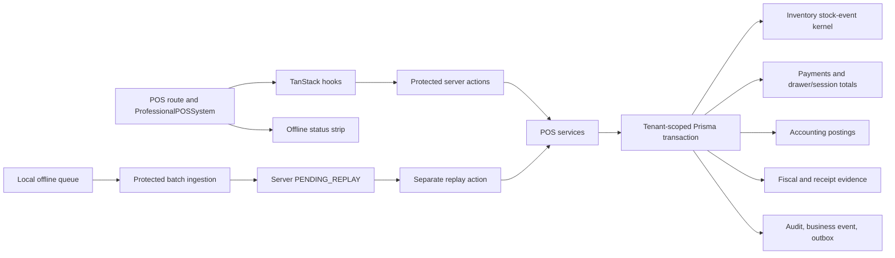

# Stoquify POS 9+ Evaluation and Roadmap

Date: 2026-07-20

Evaluation mode: read-only product evaluation and planning. No product code was changed.

## 1. Executive verdict

Stoquify POS is a credible, finance-aware online workstation with a stronger transaction kernel than its current cashier experience communicates. The normal sale path atomically claims the draft and active cashier session, validates tender arithmetic, issues stock through the inventory kernel, updates cash/session state, creates payment rows, posts balanced accounting entries, produces fiscal evidence, and records audit/business events. Shift close, signed public receipt access, receipt-token revocation, and tenant-derived server actions are also substantial strengths.

The complete advertised workflow is nevertheless **NO-GO for 9+ and NO-GO for production offline selling**. Overall score: **5.8/10, Medium-High confidence**. The score is capped by unresolved P0 controls rather than averaged upward by visual polish or passing unit tests.

### Strongest current capabilities

- **Code-confirmed:** one canonical route and service/action/hook/UI boundary: `app/[locale]/(dashboard)/dashboard/pos`, `components/pos`, `hooks/posHooks`, `actions/pos`, and `services/pos`.
- **Code-confirmed:** atomic normal-sale stock, payment, drawer, accounting, fiscal, audit, and outbox effects in `services/pos/pos.service.ts:1687-2248`.
- **Code-confirmed:** cash change and split-tender arithmetic, on-account credit checks, external-reference normalization, optimistic stock claims, and balanced-journal assertions.
- **Code-confirmed:** hardened, idempotent, evidence-rich shift close in `services/pos/pos.service.ts:1086-1334`.
- **Code-confirmed:** tenant-scoped signed public receipt tokens, revocation, and public-data redaction in `services/pos/receipt.service.ts` and `actions/pos/receipt-token.actions.ts`.
- **Test-confirmed this run:** repository typecheck passed; 11 focused POS suites passed 67/67 tests; all seven POS action suites passed 43/43 tests; the offline specialist run passed 29/29 tests across four suites.

### P0 release constraints

1. `STORE_CREDIT` can complete a sale without an authoritative customer/store-credit balance or atomic redemption.
2. Shift opening is not concurrency-safe and lacks a database-enforced one-active-session-per-terminal invariant.
3. Electronic tenders are immediately marked paid from operator-entered references; no provider acknowledgement proves capture.
4. Electronic refunds/voids have no provider reversal and cannot be honestly represented as completed external money movement.
5. The cashier charge flow has no offline capture fallback even though the UI reports an armed degraded path.
6. Offline transport errors can strand local events in `SYNCING`, and accepted local evidence is pruned before replay reaches a terminal accounting outcome.
7. Offline device signatures are persisted but not cryptographically verified.
8. Offline conflicts can block close but have no supported acknowledge/resolve/retry workflow.

## 2. Scope and methodology

### Target

- Route: `/[locale]/dashboard/pos`
- Entry: `app/[locale]/(dashboard)/dashboard/pos/page.tsx`
- Main UI: `components/pos/ProfessionalPOSSystem.tsx`
- Adjacent surfaces: terminal management, cash drawer, cash-payment history, public receipts, inventory, reconciliation, accounting, and close assurance.

### Personas

Cashier, shift supervisor, returns/refund/void approver, branch manager, accountant, owner, and support/operator.

### Method

The coordinating review applied:

- `$stoquify-workflow-uiux-evaluator`
- `aqstoqflow-uiux-00-orchestrator`
- `007-aqstoqflow-pos-ledger-controls`
- `014-aqstoqflow-offline-pos-sync`

Three bounded read-only specialist agents reviewed: (1) cashier UX/frontend/accessibility/market fit, (2) transaction truth/security/accounting, and (3) offline reliability/tests/release readiness. The coordinator reconciled current source, graphs, historical reports, focused test execution, typecheck, current official competitor documentation, and a local authenticated-browser attempt.

Evidence labels: **Code-confirmed**, **Test-confirmed**, **Browser-observed**, **Report-derived**, **Externally sourced**, **Inference**, and **Untested gap**.

## 3. Agent assignments and synthesis

| Review lens | Result |
| --- | --- |
| POS UX/frontend | Desktop/tablet workstation is credible; device/network truth, offline continuity, robust query states, accessibility certification, and performance measurement are missing. |
| Business truth/security | Normal sale/close kernel is strong; store credit, shift-open race, provider capture/reversal, correction scope, module gates, and stubs block release claims. |
| Offline/tests | Server replay spine is serious; cashier offline selling is unwired and queue/outcome/signature/conflict lifecycle is unsafe. Offline score: 3.0/10. |

Conflicts were resolved against current source. Historical reports and graph artifacts were treated as leads, not implementation truth.

## 4. Evidence reviewed and verification

### Current source and required evidence

The review traced the route, `ProfessionalPOSSystem`, POS hooks/actions/services, offline queue and sync service, receipt services, RBAC mappings, Prisma models, accounting posting rules, inventory stock-event boundaries, messages, global styles, and related tests.

Required reports included the UI/UX honest review, revamp roadmap, constitution, review checklist, route maturity matrix, offline POS roadmap, July offline functionality report, POS implementation reports, sale-truth and offline-replay assurance reports, and current `what-next/` release evidence.

Graph evidence included `graphify-out/GRAPH_REPORT.md`, `graphify-out/graph.json`, and `graphify-out/ordered-code-graph.json`. The ordered graph is dated 2026-07-14 and is structurally useful but stale relative to the current dirty worktree; source wins where they disagree.

### Commands executed

| Command | Result | Interpretation |
| --- | --- | --- |
| `npm run typecheck` | Passed, exit 0, 167.4s | Current TypeScript workspace compiles without emit. |
| Focused route/component/hook/action/service/receipt tests | 11/11 suites, 67/67 tests passed | Substantial online POS, shift-close, receipt, and UI contract coverage. |
| `npm test -- --runInBand actions/pos/__tests__` | 7/7 suites, 43/43 tests passed | Current action-layer RBAC/result wiring covered by those suites. |
| Offline queue/sync/action/static-gate suite | 4/4 suites, 29/29 tests passed | Tested offline kernel behavior, not cashier offline readiness. |

Passing tests do not cover unbacked store credit, concurrent shift opening, provider acknowledgement/reversal, real-database replay races, offline cashier fallback, stale `SYNCING` recovery, per-event outcome mapping, signature verification, physical hardware, or authenticated EN/FR browser completion.

## 5. Current architecture and trust boundaries

### Trust-boundary assessment

- **Code-confirmed:** the route checks `OPERATE_POS`; write actions derive organization/user from authenticated context.
- **Code-confirmed:** refund/void require dedicated permissions and authentication freshness no older than five minutes.
- **Code-confirmed:** normal sale commit reasserts tenant, location, terminal, session, creator, and draft-state ownership.
- **Code-confirmed:** module-entitlement enforcement is inconsistent: receipt-token actions enforce it, tender writes omit it, and some catalog/session gates remain observe-only.
- **Inference:** cash-drawer ownership is currently inferred through tenant-owned terminal/location/session relations; explicit tenant ownership would improve defense in depth.

## 6. Persona and job-to-be-done matrix

| Persona | Primary job | Current support | Principal gap |
| --- | --- | --- | --- |
| Cashier | Open register, find items, take payment, give receipt | Strong online happy path with hotkeys, split tender, change, and proof | Misleading device/network state, no scanner pipeline, no offline charge fallback, dense secondary administration |
| Supervisor | Resolve exceptions and authorize corrections | Dedicated refund/void services with fresh auth | No correction UI; original active-session restriction prevents ordinary post-shift returns |
| Manager | Control sessions, drawers, replay, and exceptions | Terminal/drawer dashboards and evidence-rich close | Shift-open race; no conflict resolver; manager override is a placeholder |
| Accountant | Trust stock, payment, ledger, receipt, and close evidence | Strong normal-sale/posting/fiscal evidence | Store-credit liability unsupported; provider capture/reversal unverified; replay may outlive local evidence |
| Owner | See branch operational truth | Session totals, drawer state, business events | No integrated settlement/replay/exception command view |
| Support | Diagnose sync/device/provider failures | Server conflict and blocker evidence exists | No supported resolution workbench or support bundle |

## 7. End-to-end workflow assessment

| Journey | Current state and boundaries | Recovery/evidence | Verdict |
| --- | --- | --- | --- |
| Enter POS | Route checks `OPERATE_POS`, component fetches locations/terminals/session | Permission denial stops before render | Strong server gate; module gating inconsistent |
| Select location/terminal | Defaults first valid location/terminal | Query failures often collapse into empty/default UI | Refine robust states and switching safety |
| Open shift | Precheck then transaction creates session/drawer state | Action notifications | **P0:** concurrent opens can both pass precheck |
| Find/scan item | Search, categories, favorites/recent, stock badges | Ctrl/Cmd+K focuses search | Un-debounced; no scan terminator/auto-add |
| Edit cart | Add/update/remove with stock-aware clamping | Rollback/refetch and notifications | Strong basics; no undo, controlled discount, park/resume |
| Attach customer | Walk-in/customer search, credit warning | Client-side filtering | Add paging, masking, quick create, privacy controls |
| Cash/split tender | Change, exact/quick cash, multiple tenders | UI blockers and server arithmetic | Strong arithmetic; method-policy gaps |
| Card/mobile money/bank | Reference required and duplicate-checked | Immediately marked paid/posted | **P0:** evidence entry is not provider-confirmed capture |
| Store credit | Selectable tender and accounting mapping | No backing balance/redemption | **P0:** disable until authoritative instrument exists |
| Commit sale | Online mutation calls atomic service | Pending lock, error notification, post-sale proof | Strong online kernel; no offline fallback |
| Receipt | Signed public receipt/token controls; selectable channels | Delivery adapters return `PENDING` stubs | Hide/label unavailable channels |
| Network loss before charge | Online mutation fails | Manual retry only | **P0:** no provisional capture |
| Offline ingest | Validates scope/hash/sequence and stores `PENDING_REPLAY` | Certificate/conflict evidence | Good foundation; client mapping unsafe |
| Offline replay | Separate protected action reuses normal finalizer | Replay/blocker evidence transactional | No production trigger/worker/operator flow |
| Duplicate replay | Status checks and completed-sale lookup | Unit-covered | Require real Postgres race proof |
| Conflict | Server records conflict and close blocker | Read-only visibility | **P0:** no acknowledge/resolve/retry |
| Close shift | Serializable, idempotent, variance/evidence protected | Unit and Postgres concurrency coverage | Strong; must include provider/offline blockers |
| Refund/void/return | Atomic full-sale services exist | Fresh auth and accounting evidence | No UI, partial return, cross-shift flow, provider reversal |

## 8. Browser, accessibility, and hardware limitations

An authenticated browser sweep was attempted on 2026-07-20 against an isolated local Next.js server. The POS route compiled and returned HTTP 200 before session resolution redirected to login. Better Auth could not validate the stored tenant session because Prisma rejected the configured datasource URL with `P6001` in that runtime.

Consequently:

- No authenticated EN/FR POS screenshot is claimed.
- No axe result, screen-reader result, complete keyboard-only checkout, or measured authenticated overflow is claimed.
- No business state was mutated.
- The isolated server, port, build directory, and Next-added `tsconfig` include entry were removed.

Physical barcode scanner, printer, drawer, payment terminal, mobile-money provider, network-loss, browser-restart, and field-device evidence are unavailable. Accessibility, responsiveness, performance, and hardware scores therefore remain below High confidence.

## 9. Current competitive benchmark

Official documentation was reviewed on 2026-07-20. The relevant standard is operational transparency and recoverability, not imitation.

| Product | Documented principle | Transferable requirement |
| --- | --- | --- |
| [Square](https://squareup.com/help/us/en/article/7777-process-card-payments-with-offline-mode) | Configured offline modes, supported/unsupported matrix, disruption detection, countdown, pending history, upload window, merchant risk | Show real state, limits, pending age, risk, and recovery outcome |
| [Shopify POS](https://help.shopify.com/en/manual/sell-in-person/shopify-pos/selling-offline/offline-payments) | Staff permission, compatible readers, limits, explicit offline checkout, pending/paid/declined badges | Make eligibility, device support, authority, and terminal outcomes explicit |
| [Lightspeed Retail](https://x-series-support.lightspeedhq.com/hc/en-us/articles/25534272395163-Selling-in-offline-mode) | Constrained offline surfaces and unsynced-sale retry visibility | Provide an operator workbench, not only an aggregate strip |
| [Toast](https://support.toasttab.com/en/article/Using-Toast-in-Offline-Mode) | Cause-aware offline banner and documented local-device limitations | State exactly what continues during each outage |
| [Odoo POS](https://www.odoo.com/app/point-of-sale-features) | Device portability, peripherals, split payments, accounting integration | Certify a concrete device matrix while retaining ledger integration |
| [Clover](https://docs.clover.com/dev/docs/handling-offline-payments) | Configurable offline risk controls and queued handling | Add tender policy, limits, and explicit liability |
| [Yoco](https://www.yoco.com/za/point-of-sale/handheld-pos/) | African-market handheld/counter hardware, connectivity, payments, stock, reporting | Validate field hardware, connectivity, and local ergonomics |

## 10. Dimension-by-dimension scorecard

| # | Dimension | Current | Confidence | Main gap | Objective 9+ condition |
| ---: | --- | ---: | --- | --- | --- |
| 1 | Cashier speed and efficiency | 6.5 | Medium | No scan-to-add proof; dense secondary content; broad refetches | Measured scan-to-cart and cart-to-paid budgets pass under peak load |
| 2 | Visual hierarchy and density | 7.0 | Medium | Setup, proof, receipt history, and tender compete on one 2,305-line screen | Checkout remains primary; secondary proof/admin moves to drawers/workbenches |
| 3 | Catalog search and scanning | 6.0 | Medium | Un-debounced search; no scanner buffer/terminator | Certified scanner flow and large-catalog latency budget |
| 4 | Cart accuracy/editability | 7.0 | Medium-High | No controlled discount/override, park/resume, undo, notes | Complete permissioned edit/exception model with tests |
| 5 | Customer usability/data safety | 6.5 | Medium | Whole dataset fetch; unmasked contact/revenue exposure | Server paging, minimization/masking, purpose-based reveal |
| 6 | Tender, split, cash, change | 5.5 | High | Unbacked store credit; unverified electronic capture | Authoritative tender policy and full matrix tests |
| 7 | Shift and drawer control | 6.5 | High | Concurrent shift opening can race | Atomic station claim and DB-enforced one-active-session invariant |
| 8 | Receipt and fiscal evidence | 6.0 | High | Delivery stubs; offline receipt absent | Real adapters and truthful provisional/final delivery state |
| 9 | Refund/void/return safety | 4.0 | High | No UI, partial/cross-shift flow, or provider reversal | Permissioned post-shift/partial correction with tender disposition |
| 10 | Offline resilience/recovery | 3.0 | High | No cashier fallback; unsafe queue lifecycle/signatures/conflicts | Field-proven capture through exact-once replay and final receipt |
| 11 | Robust and conflict states | 5.0 | High | Query failures collapse; `SYNCING` can strand; no resolver | Every state has truthful recovery, owner, SLA, terminal outcome |
| 12 | Keyboard/touch/scanner | 5.5 | Medium | Partial hotkeys/touch sizing; fabricated readiness | Keyboard-only checkout and certified device matrix |
| 13 | Accessibility | 5.5 | Low-Medium | Missing accessible names/announcements and current audit | Zero critical/serious axe issues plus keyboard/screen-reader completion |
| 14 | Responsiveness | 6.0 | Low-Medium | Mobile stacking/density unverified | Certified target viewports with no overflow or unsafe reordering |
| 15 | Performance posture | 5.0 | Medium | Monolith, un-debounced queries, broad invalidation, no budget | p95 search/add/charge and large-catalog budgets pass |
| 16 | Localization/currency/tax/rounding | 6.5 | Medium | Unaccented French; USD fallback; `0.01` assumptions for XAF | Reviewed EN/FR and country-pack-derived minor-unit/cash rounding |
| 17 | Security/RBAC/tenant isolation | 6.5 | High | Inconsistent module gates; no offline authenticity; capability-blind UI | Uniform entitlement/RBAC/fresh-auth and cryptographic device identity |
| 18 | Inventory/accounting truth | 6.5 | High | Strong normal path; store-credit/provider/offline truth incomplete | All tender/correction/offline paths reconcile and post atomically |
| 19 | Manager observability/audit | 5.0 | High | No correction/replay/provider exception workbench | Manager can explain, resolve, approve, evidence every blocker |
| 20 | Test and release readiness | 5.0 | High | Many tests pass; key real-DB/browser/device/provider journeys absent | Full gate matrix passes in intended environment |
| 21 | OHADA/target-market fit | 6.5 | Medium | French, XAF, mobile money, offline, provider claims unverified | Country-pack and bilingual field acceptance passes |
| 22 | Competitive differentiation | 6.0 | Medium-Low | Accounting proof leads; continuity/hardware/returns lag | Finance moat plus competitor-grade continuity and device truth |

Unweighted mean is approximately 5.8. Critical P0 controls cap the verdict regardless of arithmetic averaging.

## 11. UX and visual-system findings

### What works

- **Code-confirmed:** coherent authenticated dark dashboard tokens and a desktop catalog/checkout split at components/pos/ProfessionalPOSSystem.tsx:1051-1122.
- **Code-confirmed:** location/terminal setup, shift state, product discovery, cart, tender, last-sale proof, and offline status exist in one canonical surface.
- **Code-confirmed:** Ctrl/Cmd+K, F4, F8, and Escape support fast focus movement at ProfessionalPOSSystem.tsx:540-563.
- **Code-confirmed:** exact-cash/quick-cash, grid/list, favorites/recent, touch toggle, stock visibility, split tender, and receipt selection are present.

### Main friction

- **Code-confirmed:** ProfessionalPOSSystem.tsx is approximately 2,305 lines and owns query orchestration, transaction interaction, receipt administration, local favorites/recent state, shortcuts, dialogs, and full page rendering.
- **Code-confirmed:** receipt-token history occupies cashier checkout space even though it is a permissioned administrative task.
- **Code-confirmed:** park sale and manager override are clickable backend-gated placeholders at ProfessionalPOSSystem.tsx:1309-1316.
- **Code-confirmed:** catalog search changes the query on every keystroke without a debounce; customer data is fetched broadly then filtered client-side.
- **Code-confirmed:** favorites/recent exist only in component memory and reset with the session/page.
- **Inference:** high information density supports trained operators but burdens first-run cashiers and narrow screens because setup, proof, and exception administration compete with the selling loop.

## 12. Accessibility, responsive, keyboard, touch, and hardware findings

- **Code-confirmed:** visible labels, dialog primitives, aria-invalid, a variance alert, focus restoration, numeric input modes, and several keyboard accelerators are positive foundations.
- **Code-confirmed:** the cart delete action is icon-only without an explicit accessible name at ProfessionalPOSSystem.tsx:1691-1700; other icon actions rely on title.
- **Code-confirmed:** catalog skeletons do not expose aria-busy/status announcements, and many query failures have no inline recovery.
- **Code-confirmed:** touch mode enlarges selected controls, not a governed end-to-end touch target system.
- **Code-confirmed:** network status is always rendered online and scanner readiness is inferred from canSell at ProfessionalPOSSystem.tsx:609-614; the header separately announces scanner readiness without detection at 1075-1079.
- **Untested gap:** no authenticated axe, screen-reader, contrast, focus-order, physical scanner, printer, drawer, payment terminal, or measured mobile/tablet test completed in this run.

The product must either certify supported phone/tablet/device modes or state unsupported configurations explicitly.

## 13. Business-truth and accounting-control findings

### Strong normal-sale kernel

- **Code-confirmed:** tender arithmetic rejects short payment and non-cash overpayment while calculating cash change at services/pos/pos.service.ts:355-399.
- **Code-confirmed:** commit uses a transaction and compare-and-set claims on the draft/session at services/pos/pos.service.ts:1687-1825.
- **Code-confirmed:** on-account sales require a customer and enforce credit limits at 1827-1851.
- **Code-confirmed:** tracked stock issues use the inventory stock-event kernel at 1854-1885.
- **Code-confirmed:** cash updates shift/drawer truth and writes drawer transactions at 1888-1975.
- **Code-confirmed:** sale/payment postings and balanced-journal assertions occur inside the transaction at 2031-2080.
- **Code-confirmed:** fiscal document, audit, and business-event/outbox evidence are created at 2082-2175.

### Financial release blockers

- **P0 - store credit:** the UI and schema accept STORE_CREDIT, and commit creates a paid payment/liability posting, but there is no authoritative instrument, balance lookup, redemption, decrement, or reversal.
- **P0 - electronic capture semantics:** card/mobile-money/bank references are normalized and duplicate-checked, but no provider is contacted. These are externally confirmed/manual evidence, not verified capture.
- **P0 - provider reversal:** refund and void update internal rows, stock, cash, and accounting but do not call a card/mobile-money/bank reversal adapter.
- **P0/P1 - correction scope:** full-sale refund/void requires the original session to remain active and owned by the current cashier; ordinary post-shift supervisor returns are blocked.
- **P1 - receipt delivery:** print/email/SMS/WhatsApp adapters are stubs returning PENDING; the public signed receipt itself is real.
- **P1 - cash refunds:** add an explicit cash-availability/drawer-authority check for large cash refunds.

## 14. Security, RBAC, privacy, and tenant-isolation findings

### Strengths

- Tenant and actor identity come from protected action context.
- Sale/session/location/terminal queries reapply organization and user boundaries.
- Refund/void require dedicated permissions and fresh authentication.
- Receipt-token search/list/revoke is tenant-scoped; public receipts redact customer contact data.
- Offline server actions derive org/user and assert active device/terminal/location scope.

### Gaps

- **P0:** sale/session/catalog module-entitlement enforcement is missing or observe-only while receipt-token actions enforce it.
- **P1:** the shared UI renders shift/correction-like controls without a proven capability model; server denial remains safe but creates avoidable operator failure.
- **P0 offline:** signature fields exist but ingestion does not verify a device signature/public key.
- **P1 privacy:** cashier customer search exposes phone/email/lifetime revenue without a demonstrated field-minimization or masking policy.
- **P2 defense in depth:** cash drawer has no explicit organizationId; ownership is indirect through terminal/location/session.

## 15. Offline reliability and recovery findings

Backend replay controls are much stronger than the cashier journey, but the current workflow is not usable offline.

1. **No cashier fallback:** ProfessionalPOSSystem.tsx:870-909 calls only online commitSale.mutateAsync; no production consumer wires useEnqueueOfflinePOSEvent into charge.
2. **Stranded SYNCING:** useOfflineSync.ts:214-223 marks entries before awaiting transport; a thrown transport error bypasses failure update. The selector retries only QUEUED/FAILED.
3. **Premature local pruning:** successful ingest stores server events as PENDING_REPLAY, yet the hook marks all local events SYNCED and prunes when aggregate conflicts are zero without invoking replay.
4. **No per-event outcome:** mixed batches receive aggregate counts, so accepted and conflicted local entries cannot be mapped safely.
5. **No signature verification:** payload/hash-chain checks exist, but persisted signatures are not cryptographically verified.
6. **Fragile durability:** plain localStorage, silent reset on malformed content, read-modify-write without multi-tab locking, and no quota/corruption recovery.
7. **No conflict resolution:** models and read views support conflict state, but no production acknowledge/resolve/retry operation exists.
8. **Misleading readiness:** the strip announces the degraded path as armed without charge fallback, replay trigger, readiness snapshots, signature validation, or conflict resolution.

### Offline strengths

- Stable JSON hashing and SHA-256 hash-chain continuity.
- Device sequence, idempotency, previous-hash, payload-hash, and scope checks.
- Provisional-only fiscal guard.
- Replay reuses commitPOSSale, blocks failures with evidence, and recovers already-completed sales.
- Server replay/blocker evidence is transactional.
- Close assurance can detect pending/conflicted replay evidence.

## 16. State and failure-mode matrix

| State/event | Current behavior | Required recovery |
| --- | --- | --- |
| Loading catalog | Skeleton cards | Add aria-busy, preserved last-safe data, timeout/retry |
| Empty/no shift | Guided empty state | Keep; clarify setup owner and permission |
| Query failure | Often empty/default UI | Inline cause, retry, stale indicator, escalation |
| Permission denied | Server rejects | Capability-aware UI plus intentional denied state |
| Sale pending | Charge disabled and notification shown | Add idempotency/retry outcome reference |
| Sale business-rule failure | Error notification | Preserve cart/tender and guide correction |
| Network failure | Online mutation error | Classify eligible outage vs business denial; provisional capture only when safe |
| Local QUEUED | Eligible for flush | Show age, attempts, device/session/tender risk |
| Local SYNCING | Not retry-eligible if stranded | Lease/timeout recovery to FAILED |
| Local SYNCED | Pruned after ingest | Retain until replay terminal state/reconciliation |
| Local CONFLICT | Retained | Supported acknowledge/resolve/retry with audit |
| Server PENDING_REPLAY | Close blocker | Worker/operator trigger, SLA, ownership |
| Server replayed/duplicate | Terminal economic state | Link sale, receipt, posting, document hash |
| Blocked/quarantined | Evidence retained | Actionable reason, remediation, approval, retry/terminal close |
| Receipt delivery pending | Stub-provider response | Truthful unavailable/pending state and provider retry |
| Shift variance | Explanation required | Keep; add threshold policy/approval where needed |

## 17. Test coverage and evidence-gap matrix

| Area | Current evidence | Missing release evidence |
| --- | --- | --- |
| Route permission | Focused test passed | Authenticated browser allow/deny with module entitlement |
| Cart/tender/commit | Service/UI unit coverage passed | Full split-tender matrix, duplicate click, provider failure, large catalog |
| Shift close | Unit and existing Postgres concurrency tests | Intended deployment DB execution in this run |
| Shift open | Basic action/service coverage | Concurrent open and duplicate drawer Postgres tests |
| Receipt tokens | Component/action/service coverage passed | Authenticated receipt lifecycle and real delivery adapters |
| Refund/void | Atomic service/accounting tests exist | UI, cross-shift manager, partial/line return, provider reversal |
| Offline queue/sync | 29 focused tests passed | Hook rejection, stale SYNCING, corruption, quota, multi-tab, mixed ACK |
| Replay | Service mock coverage | Real Postgres exact-once concurrent replay and rollback |
| Signature | Schema/status vocabulary | Signing, invalid signature, rotation/revocation |
| Accessibility/responsive | Source inspection only | Authenticated axe, keyboard, screen reader, target viewports |
| Hardware/provider | Labels/stubs only | Certified scanner/printer/drawer/terminal/mobile-money field runs |
| Performance | Memoization/query caching | p95 interaction, catalog scale, low-network, offline volume budgets |

The current static offline readiness artifact reports ready, but its gate is primarily source-string inspection and does not prove these runtime behaviors.

## 18. Keep / Refine / Split / Move / Replace / Remove

| Decision | Target | Rationale |
| --- | --- | --- |
| Keep | Atomic commitPOSSale, compare-and-set claims, inventory kernel, posting rules, fiscal/audit/outbox evidence | Strongest product/control foundation |
| Keep | Hardened shift close and signed receipt registry | Evidence-rich, idempotent patterns worth reusing |
| Refine | Tender policy, robust states, permissions, localization, invalidation, touch targets | Foundations exist; controls/ergonomics incomplete |
| Refine | Shift open | Add serialized station claim and one-active invariant |
| Split | ProfessionalPOSSystem | Separate register shell, catalog, cart/tender, proof, and admin without moving truth client-side |
| Move | Receipt-token history | Permissioned receipt/history workspace or secondary drawer |
| Move | Returns/refunds/voids | Supervisor correction workbench with fresh auth and original-tender disposition |
| Replace | StubReceiptDeliveryProvider | Cannot support delivery claims |
| Replace | localStorage queue | IndexedDB transactional store with leases, corruption handling, recovery |
| Remove/disable | Store credit until backed | Current option can create unsupported liability |
| Relabel | Scanner/network/offline readiness | Never claim readiness without objective detection |

## 19. Ideal future POS page anatomy

1. **Register status bar:** tenant/location/terminal/cashier/shift, actual network/device state, offline eligibility, pending replay age.
2. **Primary selling workspace:** scanner/search, categories, product grid/list, stock truth, fast cart manipulation.
3. **Checkout sidecar:** customer, totals, tender policy, change, receipt choice, one decisive charge action.
4. **Exception layer:** inline validation, stale/conflict status, permission-safe supervisor escalation.
5. **Post-sale proof drawer:** sale number, tender disposition, stock event, journal entries, fiscal/receipt status.
6. **Separate supervisor workbenches:** returns/corrections; receipt history/token governance; offline replay/conflicts; X/Z and close readiness.
7. **Shared robust states:** loading, empty, denied, locked, stale, partial, offline, retrying, replayed, blocked, and terminal outcomes.

## 20. Prioritized P0-P3 implementation roadmap

### P0 — release blockers

| Initiative | Problem and evidence | User/business impact | Effort / dependency / owner | Acceptance criteria and verification | Rollback boundary |
|---|---|---|---|---|---|
| Enforce tender truth | STORE_CREDIT is selectable but no balance or liability subledger is enforced; electronic tenders can become PAID from operator-entered references. | False settlement, misstated liabilities, fraud exposure. | L / payment and accounting domains / Payments + Accounting. | Disable unsupported tender until a reserve ledger exists; electronic PAID requires signed provider acknowledgement or an explicit controlled pending/manual-settlement state. Unit, integration, reconciliation, and negative authorization tests pass. | Feature flags per tender; preserve cash sales. |
| Serialize shift opening | Application checks do not create a database-level one-active-session invariant. | Concurrent drawers and ambiguous accountability. | M / schema migration / POS backend. | Concurrent open attempts yield exactly one active session; losing request returns a recoverable conflict; migration and race test prove invariant. | Migration must be reversible; retain prior sessions unchanged. |
| Implement provider reversal truth | Refund/void paths do not execute or prove processor reversals. | Customer can be promised money that was not returned. | L / provider adapters and reconciliation / Payments. | Refund state separates requested, accepted, settled, failed; provider reference and evidence are immutable; void/refund cannot finalize without eligible reversal or approved exception. | Adapter flag and manual exception workflow; never erase evidence. |
| Make offline selling real and bounded | Active checkout has no offline charge fallback. | Connectivity loss stops selling despite offline claims. | XL / tender policy and device capability / POS + Payments. | Eligibility is tender/device/country/risk aware; operator sees limits before charging; offline transaction is durable before confirmation; unsupported paths fail closed. Scenario, device-loss, and power-loss tests pass. | Global kill switch plus per-store limits. |
| Repair offline queue lifecycle | Transport failure can strand SYNCING; client prunes after ingestion before terminal replay; localStorage queue lacks leases and robust corruption recovery. | Silent loss, duplicate attempts, unrecoverable limbo. | XL / IndexedDB schema and replay API / Offline platform. | Durable per-event states; stale leases recover; acknowledgement is terminal-event-specific; items remain until applied/rejected; idempotent multi-tab and restart tests pass. | Dual-read migration and queue export; old queue remains readable during rollout. |
| Verify device authenticity | Signature fields exist but service verifies hashes rather than cryptographic device signatures. | Forged offline events may be accepted. | L / device key lifecycle / Security + Offline. | Registered device key verifies canonical payload; replay/expired/revoked keys fail; rotation and audit trails tested. | Verification enforcement shadow mode, then staged fail-closed. |
| Add conflict resolution | No cashier/manager acknowledge-resolve-retry flow exists. | Conflicts remain operationally stuck. | L / replay outcome model / POS UX + Offline. | Every conflict has reason, owner, permitted action, audit record, and terminal outcome; retry is idempotent. | Read-only diagnostics remain available if actions are disabled. |
| Normalize module entitlements | POS entry and subordinate surfaces do not consistently prove the same entitlement boundary. | Unauthorized use and packaging leakage. | M / module policy / Platform + Security. | Route, action, service, offline replay, and navigation all deny consistently; tenant isolation and negative tests pass. | Central gate flag; no destructive data changes. |

### P1 — operational completeness

| Initiative | Outcome | Effort / owner | Acceptance criteria |
|---|---|---|---|
| Supervisor returns workbench | Partial, cross-shift, tender-aware returns with cash-availability and approval controls. | XL / POS + Accounting. | Original quantities and prior refunds cap eligibility; cash shortage and provider failure are explicit; audit and ledger tie out. |
| Device adapter layer | Real scanner, printer, cash-drawer, and terminal state instead of hard-coded indicators. | L / POS platform. | Capability detection, connect/reconnect, degraded modes, and test harness cover supported devices. |
| Resilient cashier shell | Clear loading, empty, denial, retry, and failure states with robust query/error handling. | M / Frontend. | No ambiguous blank states; failed mutations preserve cart; retry is safe; keyboard and screen-reader checks pass. |
| Decompose the monolith | Split the 2,305-line POS component by domain and move history/administration out of the selling path. | L / Frontend. | Behavioral parity tests pass; sell path bundle and render latency do not regress. |
| Receipt delivery truth | Use real providers or hide unavailable email/SMS choices; support retry and proof. | M / Notifications. | UI reflects provider capability; delivery outcomes and retries are observable and audited. |
| Locale and money correctness | Country-specific minor units, rounding, tax labels, and complete French copy. | M / Localization + Accounting. | Golden-money tests and locale review pass for each enabled country pack. |
| Offline operations workbench | Surface queue, replay, close dependencies, conflicts, and escalation to authorized staff. | L / POS UX. | Operators can explain every queued item and recover without database access. |

### P2 — scale and assurance

| Initiative | Outcome | Acceptance criteria |
|---|---|---|
| Provider reconciliation automation | Settlement, fees, refunds, and exceptions tie to ledger evidence. | Daily reconciliation produces explained variance and close blockers. |
| Field certification matrix | Supported browser, device, printer, terminal, and network combinations are evidence-backed. | Each supported combination has repeatable certification artifacts. |
| POS observability and SLOs | Latency, decline, retry, queue age, replay, conflict, and fiscal failure are measurable. | Dashboards and alerts have owners, thresholds, and runbooks. |
| Explicit drawer tenancy | Drawer/device ownership is modeled rather than inferred. | Cross-terminal concurrency and handover tests pass. |

### P3 — differentiation

| Initiative | Outcome | Guardrail |
|---|---|---|
| Handheld workflow | Purpose-built compact selling and line-busting experience. | Do not ship until device certification and offline boundaries are complete. |
| Operational analytics | Shift, product, tender, and exception insights for managers. | Analytics must derive from trusted states, not UI events. |
| Anomaly assistance | Explain suspicious refunds, overrides, or queue patterns. | Advisory only; human decision, evidence, and appeal remain visible. |

## 21. Implementation sequence and dependencies

Freeze claims and unsupported tenders → shift and entitlement invariants → provider acknowledgement/reversal plus durable offline queue/device identity → offline tender policy and conflict workbench → returns workbench and field certification → reconciliation and close assurance → 9+ release candidate.

Recommended execution order:

1. Stop overstating capability: hide unsupported store credit, mark hard-coded device states honestly, and document the current online-only sell boundary.
2. Establish database and entitlement invariants before adding UI breadth.
3. Model provider acknowledgements, reversals, and reconciliation outcomes.
4. Replace the offline queue lifecycle and implement device-key verification.
5. Wire bounded offline tender capture and conflict recovery.
6. Build supervisor returns, receipt delivery, and device adapters.
7. Complete accessibility, localization, performance, field-device, and close-assurance certification.

## 22. Verification plan and evidence requirements

| Layer | Required proof |
|---|---|
| Static and unit | Typecheck; money, tax, tender, authorization, reducer, and state-machine tests. |
| Database | Concurrent shift-open test; tenant isolation; uniqueness; idempotency; migration forward/backward rehearsal. |
| Service integration | Sale atomicity, provider acknowledgement, reversal, stock, cash, ledger, fiscal, outbox, and reconciliation tests. |
| Offline chaos | Power loss, browser kill, multi-tab races, malformed storage, expired lease, duplicate replay, reordered events, revoked key, intermittent network, and server restart. |
| Browser UX | Authenticated Chromium/WebKit/Firefox runs at desktop and compact widths; loading/empty/error/denied/offline/conflict states; cart preservation. |
| Accessibility | Automated axe plus manual keyboard, focus order, visible focus, screen-reader names, contrast, zoom/reflow, and error-announcement evidence. |
| Hardware | Certified scanner, printer, drawer, and payment terminal matrix with disconnect/reconnect and paper/device-failure scenarios. |
| Financial assurance | Golden journal fixtures, refund/void settlement evidence, inventory movement tie-out, drawer close, fiscal numbering, and provider settlement reconciliation. |
| Operations | SLO dashboards, alert drills, incident runbooks, queue export/recovery, rollback rehearsal, and named owners. |

Current passing tests are regression evidence for the existing implementation; they are not evidence that the missing P0 capabilities exist.

## 23. Release gates and no-go conditions

### Current decision

**NO-GO for a Stoquify POS 9+ claim and NO-GO for production offline selling.** The online cash-ledger-stock-fiscal kernel may continue through controlled internal testing, but broad production claims must remain bounded to proven capabilities.

### Mandatory gates

- **G1 — Money truth:** no unsupported tender; provider-confirmed payment and reversal states; reconciliation proof.
- **G2 — Session truth:** database-enforced single active session per declared drawer/store boundary.
- **G3 — Offline durability:** restart-safe durable queue, leases, per-event terminal acknowledgement, idempotent replay, and conflict resolution.
- **G4 — Device trust:** cryptographic signature verification, key rotation/revocation, and tenant/device authorization.
- **G5 — Access truth:** consistent module entitlement, fresh authorization for privileged actions, and negative tenant tests.
- **G6 — Accounting truth:** sale/refund/void/close journals and stock movements tie out with no unexplained suspense.
- **G7 — Operator safety:** authenticated browser evidence for all state classes, accessibility checks, and certified hardware recovery.
- **G8 — Operability:** telemetry, alert ownership, runbooks, rollback rehearsal, and support escalation are ready.

Any failed mandatory gate is a release blocker. A high aggregate score cannot compensate for a failed financial, offline, security, or tenant-isolation gate.

## 24. Residual risks, limitations, and open decisions

- Authenticated browser and assistive-technology evidence is missing because the isolated audit environment could not establish the required database session. Visual and accessibility observations are therefore code-evidence-based and carry lower confidence.
- The intended scope of STORE_CREDIT must be decided: remove it, integrate an external wallet, or implement a controlled liability ledger.
- The supported offline tender set, amount/time caps, country rules, device ownership, and risk acceptance require explicit product and compliance decisions.
- Define whether the one-active-session invariant belongs to tenant/store, register, drawer, device, or cashier; the database constraint must match the chosen physical-control model.
- Define refund policy for partial quantities, cross-location returns, cash availability, provider outages, fees, foreign currency, and fiscal documents.
- Choose supported printers, scanners, terminals, browsers, and compact devices before claiming compatibility.
- Current benchmark comparisons are directional: vendor capabilities vary by country, hardware, processor, configuration, and plan.

## 25. Recommended next prompt

> Execute only the P0 hardening program from the Stoquify POS 9+ evaluation dated 2026-07-20. Begin with a read-only evidence refresh and convert each P0 item into an implementation-ready work package with exact files, schema changes, API/state contracts, security boundaries, migration and rollback plans, acceptance tests, and release evidence. Use separate agents for payment/accounting truth, offline durability/device identity, shift/session concurrency, module entitlement, and POS UX recovery. Do not implement until dependencies and ownership are reconciled into one approved sequence. Preserve unrelated working-tree changes, prohibit destructive Git operations, and treat any failed money, tenant, authorization, device-signature, replay-idempotency, or reconciliation test as a no-go.

---

**Bottom line:** Stoquify already has a credible transactional core, but it is not yet a trustworthy 9+ POS. The fastest path is to narrow claims, close the payment/session/offline trust gaps, and certify recovery behavior before adding breadth or visual polish.

