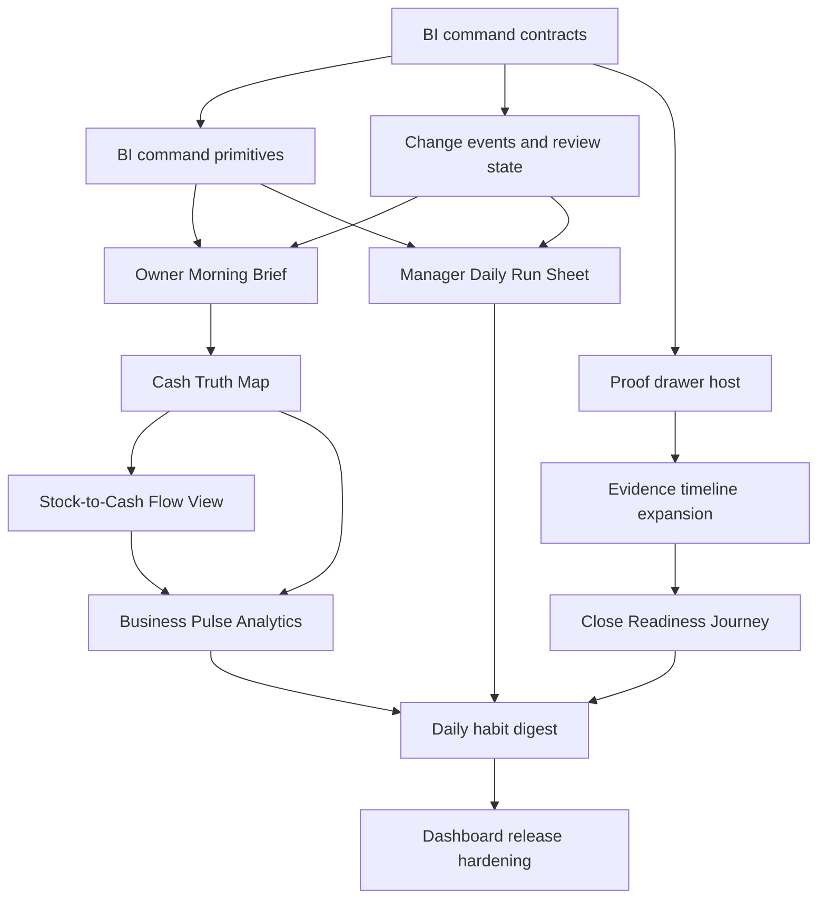

# Kontava Dashboard Experience Execution Blueprint

Date: 2026-06-22  
Source document: `innovation/KONTAVA_DASHBOARD_EXPERIENCE_INNOVATION_RUN_REPORT_2026-06-22.md`  
Purpose: turn the dashboard experience innovation proposal into a skill-executable implementation roadmap.

## Executive Summary

Kontava can execute the full dashboard experience innovation proposal safely if the work is treated as a staged command-experience program, not as scattered page redesigns. The target is a unified BI command language across Owner War Room, Manager Action Center, Cash Command, Analytics, Accounting, Assurance, and future dashboard surfaces.

The core implementation idea is simple:

1. Build shared BI command contracts first.
2. Build reusable dashboard command primitives second.
3. Recompose Owner War Room first because it already has the strongest cross-module evidence foundation.
4. Recompose Manager Action Center second because it already has action queue, permission filtering, due state, and assurance incident blending.
5. Extend into Cash Command, Analytics, Accounting, Assurance, proof timelines, stock-to-cash, and daily digests only after the shared language is stable.

The roadmap below is designed so every phase can be turned into a Codex skill with precise inspection rules, allowed file areas, validation commands, and completion criteria.

## Proposal Inventory

| Proposal | Meaning | Why It Matters | Existing Foundation | Main Stakeholders | Affected Surfaces | Must Exist First |
| --- | --- | --- | --- | --- | --- | --- |
| Kontava Daily Command Environment | Unified dashboard pattern centered on state, change, risk, proof, and action. | Makes Kontava feel like a daily operating system, not a reporting page. | `services/bi/**`, `components/bi/**`, snapshots, signals, proof trail. | Owner, manager, accountant, finance. | All BI surfaces. | Shared BI command contracts and primitives. |
| Command Brief Strip | Top band that states the business truth, freshness, trust, period, and mode. | Users understand the page before scanning cards. | `BIEvidenceBadgeRow`, `BIStateBadge`, dashboard theme tokens. | All roles. | Owner War Room, Manager Action Center, Finance, Analytics, Accounting, Assurance. | `BICommandBrief` contract. |
| What Changed Since Last Review | Delta list comparing current and prior trusted state. | Creates daily habit and business movement awareness. | Snapshots and source hashes. | Owner, manager, accountant, finance. | Owner War Room, Analytics, Finance, Close. | `BIChangeEvent`, review state or previous snapshot comparison. |
| What Needs Action Today | Priority action board above generic KPIs. | Makes Kontava operational, not passive. | `services/signals/action-queue.service.ts`. | Managers, owners, finance, stockkeepers. | Manager Action Center, Owner War Room, Cash Command. | Reusable action board and server-side permission filtering. |
| Business Truth Zones | Group insights by business question, not module table. | Makes SMB users understand cash, stock, close, payroll, supplier, and compliance state quickly. | Existing snapshots and KPI cards. | Owners and managers. | All command dashboards. | `BICommandZone` and `BICommandSection`. |
| Proof Drawer and Evidence Timeline | Contextual proof drawer and timeline from insight to source. | Builds accountant, auditor, and enterprise trust. | `ProofTrailDrawer`, `services/evidence/**`. | Accountants, auditors, owners. | All evidence-backed BI surfaces. | Expanded proof subjects and proof drawer host. |
| Owner Morning Brief | Owner-first first screen with top risks, cash trust, and changes. | Makes Owner War Room habit-forming. | `getOwnerWarRoomData`, snapshots, action queue, module control. | Owners, CEOs. | Owner War Room. | Command brief, action board, risk radar. |
| Manager Daily Run Sheet | Manager-first work queue grouped by urgency. | Makes the product a daily work surface. | `ManagerActionCenterData`, action queue, due states. | Managers, branch supervisors. | Manager Action Center. | Action priority board and due grouping. |
| Cash Truth Map | Flow from collected cash to pending, suspense, reconciled, posted, certified. | Solves high-value SMB cash trust problem. | Payment truth snapshot, reconciliation workbench. | Owner, finance, accountant. | Finance, reconciliation, Owner War Room. | Flow-step contracts and proof subjects. |
| Risk and Opportunity Radar | Ranked list of risks and opportunities by money impact, urgency, evidence. | Moves BI from charts to judgment. | Business signals, severity score. | Owner, manager, finance. | Owner War Room, Analytics, Manager Action Center. | `BIRiskRank` and signal scoring conventions. |
| Evidence-Backed Insight Timeline | Time-ordered narrative of business changes and proof links. | Converts Kontava into an evidence system. | Business events, proof trail, source links. | Accountants, auditors, owners. | Accounting, Assurance, Owner War Room. | Proof subject expansion and event normalization. |
| Stock-to-Cash Flow View | Shows purchase, receiving, stock, sale, payment, reconciliation, ledger flow. | Reveals money trapped in stock. | Inventory cash snapshot, purchase orders, POS, payments. | Owner, stockkeeper, purchasing, finance. | Inventory, Finance, Owner War Room. | Flow-step contract and source-link consistency. |
| Close Readiness Journey | Checkpoint journey from operational data to certified close. | Makes OHADA close understandable and trustworthy. | Close readiness snapshot, accounting close services. | Accountant, owner, auditor. | Accounting close, Assurance. | Close proof subjects and readiness journey UI. |
| Daily Habit Loops | Morning brief, daily run sheet, cash review, close review, stock review, end-of-day pulse, weekly digest. | Drives retention and organic usage. | Signals, notifications, snapshots. | All operational roles. | Dashboard shell, notification center, BI pages. | Review state, digest state, notification routing. |
| Shared BI Command Primitives | Reusable components and contracts under `components/bi/**` and `services/bi/**`. | Prevents one-off dashboards and bloat. | Existing `BIKpiCard`, `BIEvidenceBadgeRow`, `BIStateBadge`. | Product, engineering, design. | All BI surfaces. | Contract-first implementation. |
| Anti-Bloat Rules | Delay warehouses, AI, decorative widgets, and mini-apps. | Keeps platform fast, coherent, and SMB-useful. | Existing service boundaries. | Product and engineering. | All phases. | Release gate discipline. |
| Release Gates | Typecheck, lint, tests, security, screenshots, performance, release scripts. | Prevents dashboard innovation from weakening the system. | `npm run typecheck`, `npm run lint`, Jest, `scripts/kontava-moat-release-gate.js`. | Engineering, QA. | All phases. | Phase-specific tests. |

## Dependency Map



Strict sequence:

1. BI command contracts.
2. BI command primitives.
3. Owner Morning Brief MVP.
4. Manager Daily Run Sheet MVP.
5. Proof drawer host standardization.

Parallel after the first five:

- Cash Truth Map.
- Business Pulse Analytics.
- Close Readiness Journey.
- Stock-to-Cash Flow View, if stock/payment/source-link data is sufficient.

Must wait:

- Daily digest automation.
- AI-assisted dashboard narration.
- Full evidence graph.
- Advanced partner APIs.

## Full Implementation Roadmap

### Phase 0: BI Command UX Foundation

Objective:

- Establish the shared BI command contract and execution rules before changing major dashboards.

Business reason:

- Prevents dashboard redesign from becoming isolated UI work.

Technical reason:

- Every future command surface needs the same vocabulary for brief, trust, freshness, state, change, risk, action, proof, and redaction.

UX outcome:

- All dashboard pages can state business truth consistently.

Likely files:

- `services/bi/bi-contracts.ts`
- `services/bi/bi-evidence-adapter.service.ts`
- `services/bi/__tests__/bi-evidence-adapter.service.test.ts`
- `components/bi/index.ts`

Implementation sequence:

1. Inspect existing `BIKpiCard`, `BIInsight`, `BIFreshness`, `BIProvenance`, `BIActionLink`, `BIDrillThrough`, and `BITrustState`.
2. Add contract-only types for `BICommandBrief`, `BICommandMode`, `BICommandZone`, `BICommandSection`, `BIChangeEvent`, `BIReviewState`, `BIDailyDigest`, `BIFlowStep`, `BIRiskRank`, and `BIProofDrawerSubject`.
3. Add normalizers that convert KPI cards, insights, action items, and snapshots into command-zone inputs.
4. Add focused tests for state mapping, redaction preservation, blocked/partial/stale behavior, and trust-state normalization.
5. Export new contracts from `components/bi/index.ts` only when components exist.

Delay:

- Database migrations.
- New dashboards.
- Persistent review state.

Do not break:

- Existing `BIKpiCard` consumers.
- Evidence grade semantics.
- Snapshot state mapping.

Validation:

- `npm run typecheck`
- `npm run lint`
- `npm test -- services/bi/__tests__/bi-evidence-adapter.service.test.ts --runInBand`

Completion criteria:

- Contract types exist, compile, and are tested without changing current UI behavior.

### Phase 1: Shared BI Command Primitives

Objective:

- Build reusable UI primitives for command dashboards.

Business reason:

- Creates a unified Kontava visual language that feels distinct and professional.

Technical reason:

- Prevents every page from hand-building its own command header, action board, state surfaces, and proof host.

UX outcome:

- The user sees the same trust, action, stale, redacted, and proof semantics everywhere.

Likely files:

- `components/bi/BICommandBriefHeader.tsx`
- `components/bi/BICommandModeTabs.tsx`
- `components/bi/BIWhatChangedStrip.tsx`
- `components/bi/BIActionPriorityBoard.tsx`
- `components/bi/BIBusinessTruthZone.tsx`
- `components/bi/BIRiskOpportunityRadar.tsx`
- `components/bi/BIProofDrawerHost.tsx`
- `components/bi/BITrustLegend.tsx`
- `components/bi/BIStateSurface.tsx`
- `components/bi/index.ts`
- `components/finance/finance-dashboard-theme.ts`
- `app/globals.css` only if a reusable style token is missing.

Implementation sequence:

1. Inspect existing `BIKpiCard`, `BIEvidenceBadgeRow`, `BIStateBadge`, `BIEmptyState`, and `ProofTrailDrawer`.
2. Build `BICommandBriefHeader` around existing dashboard classes and badges.
3. Build `BICommandModeTabs` with `brief`, `command`, and `investigate`, defaulting to read-only UI state.
4. Build `BIWhatChangedStrip` with empty, stale, partial, blocked, redacted, and permission-denied states.
5. Build `BIActionPriorityBoard` that accepts already permission-filtered action items.
6. Build `BIProofDrawerHost` that hosts proof-only and route-and-proof drill-through without changing authorization rules.
7. Add component tests for all visual states.

Delay:

- Animations except minimal state transitions.
- Page-level redesigns.

Do not break:

- Existing dashboard color semantics.
- Button and card dimensions.
- Mobile text fit.

Validation:

- `npm run typecheck`
- `npm run lint`
- `npm test -- components/bi --runInBand` if component tests are available, otherwise add focused tests.

Completion criteria:

- Reusable primitives render from contract data and can be adopted by Owner War Room without one-off UI.

### Phase 2: Owner War Room Recomposition

Objective:

- Recompose Owner War Room into the flagship Owner Morning Brief.

Business reason:

- Owners are the strongest buyer and referral driver. This page should demonstrate the Kontava moat immediately.

Technical reason:

- Owner War Room already composes tenant operating, payment truth, inventory cash, close readiness, module control, proof subjects, and action queue.

UX outcome:

- Owner sees business conclusion, top risks, changed signals, action board, and proof access before scanning metric cards.

Likely files:

- `components/owner-war-room/OwnerWarRoomDashboard.tsx`
- `services/owner-war-room/owner-war-room-contracts.ts`
- `services/owner-war-room/owner-war-room.service.ts`
- `actions/owner-war-room/owner-war-room.actions.ts`
- `services/owner-war-room/__tests__/owner-war-room.service.test.ts`
- `actions/owner-war-room/__tests__/owner-war-room.actions.test.ts`
- `components/bi/**`

Implementation sequence:

1. Add `OwnerMorningBrief` composition data to the service contract without removing existing cards.
2. Derive top three risks from action queue, payment truth, close readiness, inventory cash, and module observe state.
3. Add `BICommandBriefHeader` at the top of the page.
4. Add `BIWhatChangedStrip` with placeholder contract-backed empty state if review state is not yet persisted.
5. Add `BIActionPriorityBoard` above KPI grid.
6. Convert current top card grid into `BIBusinessTruthZone` groups: Cash Truth, Stock-to-Cash, Close Readiness, Payroll Exposure, Supplier Commitments, Module State.
7. Move proof buttons into contextual zone actions using `BIProofDrawerHost`.
8. Keep the legacy card data visible in command or investigate mode until confidence is high.

Delay:

- AI narration.
- Full branch health map.
- Full Business Evidence Graph.

Do not break:

- Read-only posture.
- Module observe mode.
- Proof drawer access.
- Existing card IDs and summary counts.

Validation:

- `npm run typecheck`
- `npm run lint`
- `npm test -- services/owner-war-room/__tests__/owner-war-room.service.test.ts --runInBand`
- `npm test -- actions/owner-war-room/__tests__/owner-war-room.actions.test.ts --runInBand`
- Manual route check: `/en/dashboard/owner-war-room`

Completion criteria:

- Owner War Room first viewport answers: what changed, what matters, what is risky, what is proven, and what to do next.

### Phase 3: Manager Action Center Recomposition

Objective:

- Recompose Manager Action Center into a Manager Daily Run Sheet.

Business reason:

- Managers need a daily work surface, not a passive report.

Technical reason:

- The existing service already sorts actions by severity, due state, permission, and assurance incidents.

UX outcome:

- Managers see critical, overdue, due today, blocked, assigned, and waiting items first.

Likely files:

- `components/manager-action-center/ManagerActionCenterDashboard.tsx`
- `services/manager-action-center/manager-action-center-contracts.ts`
- `services/manager-action-center/manager-action-center.service.ts`
- `actions/manager-action-center/manager-action-center.actions.ts`
- `services/manager-action-center/__tests__/manager-action-center.service.test.ts`
- `actions/manager-action-center/__tests__/manager-action-center.actions.test.ts`
- `services/signals/action-queue.service.ts`
- `services/signals/__tests__/action-queue.service.test.ts`
- `components/bi/**`

Implementation sequence:

1. Add run-sheet groups to the manager contract: overdue, critical, due today, blocked, waiting, assigned, routine.
2. Reuse `BICommandBriefHeader` to state the operational day status.
3. Promote `BIActionPriorityBoard` above KPI cards.
4. Add grouped action lanes with due state, role, permission, evidence grade, blockers, and route action.
5. Add end-of-day review placeholder state if durable review state is not ready.
6. Keep current KPI cards under command or investigate mode.
7. Add tests for sorting, grouping, permission filtering, and assurance incident merging.

Delay:

- Assignment workflow changes unless already supported.
- Background notification changes.

Do not break:

- Server-side permission filtering.
- Assurance incident blending.
- Existing action routes.

Validation:

- `npm run typecheck`
- `npm run lint`
- `npm test -- services/manager-action-center/__tests__/manager-action-center.service.test.ts --runInBand`
- `npm test -- actions/manager-action-center/__tests__/manager-action-center.actions.test.ts --runInBand`
- `npm test -- services/signals/__tests__/action-queue.service.test.ts --runInBand`
- Manual route check: `/en/dashboard/manager-action-center`

Completion criteria:

- Manager sees what to do first without scanning generic KPI cards.

### Phase 4: Cash Command Intelligence

Objective:

- Turn finance and reconciliation surfaces into a cash truth command surface.

Business reason:

- Cash trust is one of the highest-value SMB problems in OHADA-zone operations.

Technical reason:

- Payment truth snapshots, reconciliation services, and reconciliation workbench already exist.

UX outcome:

- Finance users see collected, pending, suspense, exception, reconciled, posted, and certified cash as a trust flow.

Likely files:

- `components/finance/FinanceCommandCenterDashboard.tsx`
- `components/finance/PaymentReconciliationWorkbench.tsx`
- `components/finance/FinanceSpecializedLedgerSurfaces.tsx`
- `services/finance/finance-dashboard.service.ts`
- `services/finance/finance-dashboard.schemas.ts`
- `services/snapshots/payment-truth-snapshot.service.ts`
- `services/reconciliation/**`
- `services/payments/**`
- `actions/payments/**`
- `components/bi/**`

Implementation sequence:

1. Add `BICashTruthMap` primitive using `BIFlowStep`.
2. Normalize payment truth snapshot into collected, pending, suspense, exception, reconciled, posted, certified steps.
3. Add suspense aging and provider evidence lanes.
4. Add finance action board for suspense, duplicate provider refs, pending transactions, and signing/export readiness.
5. Add proof drawer links to reconciliation run, suspense item, provider transaction, and ledger entry where available.
6. Keep existing finance filters and workbench tables in investigate mode.

Delay:

- New payment provider adapters.
- Automated suspense resolution beyond existing services.
- Partner evidence APIs.

Do not break:

- Reconciliation run signing.
- Certificate export.
- Export safety.
- Payment reconciliation tests.

Validation:

- `npm run typecheck`
- `npm run lint`
- `npm test -- services/snapshots/__tests__/payment-truth-snapshot.service.test.ts --runInBand`
- `npm test -- services/reconciliation/__tests__/payment-reconciliation-run.service.test.ts --runInBand`
- `npm test -- services/payments/__tests__/payment-reconciliation-workbench.service.test.ts --runInBand`
- Manual route checks: `/en/dashboard/finance`, `/en/dashboard/finance/payments`

Completion criteria:

- Finance first viewport makes cash trust and cash blockers obvious.

### Phase 5: Business Pulse Analytics

Objective:

- Move analytics from conventional KPI/chart reporting into a Business Pulse surface.

Business reason:

- Analytics should explain movement, risk, opportunity, and action, not just show charts.

Technical reason:

- Analytics already uses dashboard theme tokens but lacks evidence and command semantics.

UX outcome:

- Users see what changed, which sales/cash/product signals matter, and what action to take.

Likely files:

- `app/[locale]/(dashboard)/dashboard/analytics/page.tsx`
- `components/analytics/CompleteIntegratedDailySalesDashboard.tsx`
- `components/analytics/dashboard/**`
- `actions/analytics/**`
- `services/analytics/**`
- `services/bi/**`
- `components/bi/**`

Implementation sequence:

1. Replace generic analytics header with `BICommandBriefHeader`.
2. Add Business Pulse summary: revenue movement, cash movement, stock movement, margin/risk movement.
3. Add `BIWhatChangedStrip` using real data or safe empty states.
4. Add `BIRiskOpportunityRadar` driven by business signals.
5. Move revenue chart, top products, cashier performance, and recent transactions to command/investigate sections.
6. Remove hard-coded/demo-like goals unless they come from settings or a documented fallback.
7. Add trust and freshness labels to analytics cards.

Delay:

- Predictive analytics.
- AI insight generation.
- Decorative charts.

Do not break:

- Existing analytics route.
- Current server actions and data fetch behavior.

Validation:

- `npm run typecheck`
- `npm run lint`
- Focused tests for analytics service/action touched.
- Manual route check: `/en/dashboard/analytics`

Completion criteria:

- Analytics first viewport explains business movement and priority, not just performance stats.

### Phase 6: Accounting, Assurance, And Close Journey

Objective:

- Express accounting, assurance, and close as one evidence-backed control journey.

Business reason:

- Accountants and owners need clarity on whether the business can close, certify, and defend numbers.

Technical reason:

- Accounting Control Center, Close Assurance Center, and Assurance Control Tower already expose blockers, incidents, sensitive actions, and proof state.

UX outcome:

- The user sees the path from operational data to ledger posting to reconciliation to certified close.

Likely files:

- `components/accounting/AccountingControlCenter.tsx`
- `components/accounting/CloseAssuranceCenter.tsx`
- `components/accounting/AccountantPortal.tsx`
- `components/assurance/AssuranceControlTowerDashboard.tsx`
- `components/assurance/AssuranceIncidentDetailView.tsx`
- `services/accounting/**`
- `services/assurance/**`
- `actions/accounting/**`
- `actions/assurance/**`
- `components/bi/**`

Implementation sequence:

1. Add `BICloseReadinessJourney` primitive or compose it from `BIFlowStep`.
2. Map operational readiness, reconciliation proof, ledger posting, close findings, certification, and export readiness into journey checkpoints.
3. Add assurance incident proof drawer links.
4. Add evidence-backed timeline for close blockers and control incidents.
5. Keep existing tables/checklists available in investigate mode.
6. Add tests for close journey mapping and blocked/certified states.

Delay:

- Automated close autopilot actions beyond existing close services.
- Broad compliance radar until country-pack evidence is stronger.

Do not break:

- Sensitive-action controls.
- Accounting setup lock.
- Ledger posting and close assurance tests.

Validation:

- `npm run typecheck`
- `npm run lint`
- `npm test -- services/accounting/__tests__/close-assurance.service.test.ts --runInBand`
- `npm test -- services/assurance/__tests__/assurance-control-tower.service.test.ts --runInBand`
- Manual route checks: `/en/dashboard/accounting/control-center`, `/en/dashboard/accounting/close`, `/en/dashboard/assurance/control-tower`

Completion criteria:

- Close and assurance surfaces communicate progress, blockers, proof, and next action as a journey.

### Phase 7: Proof Drawer And Evidence Timeline Expansion

Objective:

- Make proof available from every serious BI insight, action, KPI, flow, and timeline event.

Business reason:

- Evidence is Kontava's trust moat.

Technical reason:

- Current proof subjects are useful but too narrow for dashboard-wide command intelligence.

UX outcome:

- Users can move from insight to proof to source record without losing context.

Likely files:

- `services/evidence/evidence-contracts.ts`
- `services/evidence/proof-trail.service.ts`
- `services/evidence/evidence-redaction.service.ts`
- `components/evidence/ProofTrailDrawer.tsx`
- `actions/evidence/proof-trail.actions.ts`
- `services/accounting/source-link.service.ts`
- `services/events/business-event.service.ts`
- `components/bi/BIProofDrawerHost.tsx`
- `components/bi/BIEvidenceTimeline.tsx`

Implementation sequence:

1. Expand `PROOF_TRAIL_SUBJECT_TYPES` cautiously with one domain at a time.
2. Start with payment transaction, suspense item, purchase order, stock movement, and assurance incident.
3. Add service-level proof builders with tenant scope, RBAC, redaction, and audit.
4. Add `BIEvidenceTimeline` that consumes proof trail and business event summaries.
5. Add server action tests for direct access denial and redaction.
6. Add component tests for proof-only, route-only, route-and-proof, unavailable, redacted, and blocked states.

Delay:

- Full graph visualization.
- Partner-visible evidence API.
- AI explanations.

Do not break:

- Existing proof subjects.
- Existing proof drawer behavior.
- Audit logging.

Validation:

- `npm run typecheck`
- `npm run lint`
- `npm test -- services/evidence/__tests__/proof-trail.service.test.ts --runInBand`
- `npm test -- actions/evidence/__tests__/proof-trail.actions.test.ts --runInBand`
- `npm test -- services/security/__tests__/redaction-policy.service.test.ts --runInBand`

Completion criteria:

- New proof subjects can be opened safely from BI surfaces and preserve tenant/RBAC/redaction rules.

### Phase 8: Stock-to-Cash Flow View

Objective:

- Show how cash moves from purchasing to stock to sale to payment to reconciliation to ledger.

Business reason:

- It reveals trapped cash, stock loss, and receiving/payment gaps that ordinary SMB tools rarely explain.

Technical reason:

- Inventory, purchasing, POS, payments, accounting source links, and snapshots already exist, but need a shared flow view.

UX outcome:

- Owners and operators see where money is trapped or leaking.

Likely files:

- `services/snapshots/inventory-cash-snapshot.service.ts`
- `services/inventory/**`
- `services/purchase-order/**`
- `services/purchasing/**`
- `services/pos/**`
- `services/payments/**`
- `services/accounting/source-link.service.ts`
- `components/bi/BIStockToCashFlow.tsx`
- `components/inventory/**`
- `components/purchasing/**`
- `components/finance/**`

Implementation sequence:

1. Add contract-only `BIStockToCashFlowData`.
2. Map existing inventory cash metrics into stock-held, low/zero/negative pressure, and transaction pressure steps.
3. Add purchase order receiving delay signals as a flow blocker.
4. Add payment/reconciliation step only where source links are trustworthy.
5. Add proof drill-through for stock movement, purchase order, payment, and ledger entry when supported.
6. Add a read-only MVP first in Owner War Room or Finance, then extend to inventory.

Delay:

- Full digital twin.
- Forecasting.
- Automated purchasing recommendations.

Do not break:

- Inventory stock projection rebuilds.
- Purchase order receiving.
- Payment reconciliation.
- Ledger source links.

Validation:

- `npm run typecheck`
- `npm run lint`
- `npm test -- services/snapshots/__tests__/tenant-operating-snapshot.service.test.ts --runInBand`
- `npm test -- services/inventory/__tests__/inventory-stock-event.service.test.ts --runInBand`
- `npm test -- services/purchase-order/__tests__/purchase-order.service.test.ts --runInBand`

Completion criteria:

- Stock-to-cash flow explains stock cash exposure and source trust without duplicating module data.

### Phase 9: Daily Habit Loops And Digest System

Objective:

- Make Kontava a daily go-to platform.

Business reason:

- Habit loops drive retention, referrals, and operational dependency.

Technical reason:

- Signals, action queues, snapshots, notifications, and review state can power digest workflows.

UX outcome:

- Users get morning, daily, end-of-day, and weekly review surfaces that drive action.

Likely files:

- `services/bi/**`
- `services/signals/**`
- `services/snapshots/**`
- `services/notifications/**` if present, otherwise `components/notifications/**`
- `services/signals/signal-notification.service.ts`
- `components/notifications/**`
- `components/bi/BIDailyDigestPanel.tsx`
- Prisma schema only if persistent review/digest state is justified.

Implementation sequence:

1. Add contract-only `BIReviewState` and `BIDailyDigest`.
2. Add read-only daily digest panel using current snapshot and signal data.
3. Add per-role digest layouts: owner, manager, finance, accountant, stockkeeper.
4. Persist review state only after read-only MVP proves useful.
5. Integrate notifications only after digest content is stable and redaction-safe.
6. Add digest tests for tenant, role, permission, redaction, stale, and blocked behavior.

Delay:

- Email digests.
- Scheduled automation.
- AI-generated commentary.

Do not break:

- Notification provider.
- Signal notification service.
- Tenant isolation.

Validation:

- `npm run typecheck`
- `npm run lint`
- `npm test -- services/signals/__tests__/signal-notification.service.test.ts --runInBand`
- Focused digest service tests.

Completion criteria:

- Daily digest can be rendered safely, role-specifically, and without leaking redacted data.

### Phase 10: Release Hardening And Rollout

Objective:

- Validate the full dashboard command program before broad release.

Business reason:

- Kontava is mission-critical; dashboard innovation must increase trust, not destabilize workflows.

Technical reason:

- Cross-module surfaces can accidentally bypass RBAC, module entitlements, redaction, or proof trust.

UX outcome:

- Stable, consistent, fast, responsive command dashboards.

Likely files:

- `scripts/kontava-moat-release-gate.js`
- `scripts/workflow-assurance-release-gate.js`
- `services/**/__tests__/**`
- `actions/**/__tests__/**`
- E2E or Playwright tests if present or added.

Implementation sequence:

1. Add dashboard command release checklist.
2. Add focused gate cases for BI contracts, command primitives, proof drawer, redaction, module entitlement, route denial, and direct server action denial.
3. Add screenshot checks for mobile and desktop for Owner War Room and Manager Action Center first.
4. Add performance budgets for command services and first-page render.
5. Roll out behind read-only mode and feature flag/observe mode if feature flags exist.
6. Only enforce or remove old layouts after two successful release cycles.

Validation:

- `npm run prisma:validate`
- `npm run typecheck`
- `npm run lint`
- `npm test -- --runInBand`
- `node scripts/kontava-moat-release-gate.js --mode fail`
- `npm run verify:repo` before production release.

Completion criteria:

- New command dashboards pass functional, security, redaction, performance, and visual checks.

## Skill Suite

Recommended execution order:

1. `kontava-bi-command-foundation`
2. `kontava-bi-command-primitives`
3. `kontava-owner-morning-brief`
4. `kontava-manager-daily-run-sheet`
5. `kontava-cash-truth-map`
6. `kontava-business-pulse-analytics`
7. `kontava-proof-evidence-timeline`
8. `kontava-stock-to-cash-flow-view`
9. `kontava-close-readiness-journey`
10. `kontava-daily-habit-digest`
11. `kontava-dashboard-release-gates`

## Skill Specifications And Prompts

### 1. `kontava-bi-command-foundation`

Purpose:

- Establish shared BI command contracts before any page redesign.

Trigger:

- Use when adding command dashboard contracts, review/change/digest contracts, or shared command data normalizers.

Inspect first:

- `services/bi/bi-contracts.ts`
- `services/bi/bi-evidence-adapter.service.ts`
- `services/snapshots/snapshot-contracts.ts`
- `services/signals/business-signal-contracts.ts`
- `services/evidence/evidence-contracts.ts`
- `services/modules/module-control-contracts.ts`

Allowed areas:

- `services/bi/**`
- focused tests under `services/bi/__tests__/**`

Forbidden areas:

- Page redesigns.
- Prisma migrations in MVP.
- New persisted BI tables.

Workflow:

1. Inspect existing BI contracts and tests.
2. Add contract-only types for command brief, mode, zone, section, change event, review state, digest, flow step, risk rank, and proof drawer subject.
3. Add lightweight normalizers only where they reuse existing BI/snapshot/signal contracts.
4. Add focused tests.
5. Save run report in `innovation/` if requested.

Validation:

- `npm run typecheck`
- `npm run lint`
- `npm test -- services/bi/__tests__/bi-evidence-adapter.service.test.ts --runInBand`

Completion:

- Contracts compile and existing consumers are not broken.

Full skill prompt:

```markdown
Create or update the Codex skill `kontava-bi-command-foundation`.

Mission: establish the shared BI command contract foundation for Kontava's Daily Command Environment before any dashboard redesign. Inspect `services/bi/**`, `services/snapshots/**`, `services/signals/**`, `services/evidence/**`, and `services/modules/**`. Add contract-only TypeScript types for `BICommandBrief`, `BICommandMode`, `BICommandZone`, `BICommandSection`, `BIChangeEvent`, `BIReviewState`, `BIDailyDigest`, `BIFlowStep`, `BIRiskRank`, and `BIProofDrawerSubject`. Preserve existing `BIKpiCard`, `BIInsight`, `BIFreshness`, `BIProvenance`, `BIDrillThrough`, `BIActionLink`, evidence grade, trust state, freshness, blockers, redactions, tenant scope, RBAC, module entitlement, and ledger-first semantics.

Do not redesign pages, add database migrations, or create a BI warehouse. Add focused service tests for normalization and state preservation. Validate with `npm run typecheck`, `npm run lint`, and focused BI tests. Completion means command contracts exist, compile, are tested, and no existing BI consumer is broken.
```

### 2. `kontava-bi-command-primitives`

Purpose:

- Build reusable command dashboard components.

Trigger:

- Use when creating or changing shared BI command UI components.

Inspect first:

- `components/bi/**`
- `components/evidence/ProofTrailDrawer.tsx`
- `components/finance/finance-dashboard-theme.ts`
- `app/globals.css`

Allowed areas:

- `components/bi/**`
- `components/finance/finance-dashboard-theme.ts` only for shared helper reuse.
- `app/globals.css` only for missing shared tokens.

Forbidden areas:

- Page-specific redesign before primitives are stable.
- Decorative effects with no decision value.

Workflow:

1. Reuse existing dashboard theme tokens and BI components.
2. Build `BICommandBriefHeader`, `BICommandModeTabs`, `BIWhatChangedStrip`, `BIActionPriorityBoard`, `BIBusinessTruthZone`, `BIRiskOpportunityRadar`, `BIProofDrawerHost`, `BITrustLegend`, and state surfaces.
3. Export components from `components/bi/index.ts`.
4. Add focused component tests where the test stack supports them.

Validation:

- `npm run typecheck`
- `npm run lint`
- Focused component tests.

Completion:

- Components render safe states consistently and can be adopted by Owner War Room.

Full skill prompt:

```markdown
Create or update the Codex skill `kontava-bi-command-primitives`.

Mission: build reusable, enterprise-grade BI command UI primitives for Kontava dashboards. Inspect `components/bi/**`, `components/evidence/ProofTrailDrawer.tsx`, `components/finance/finance-dashboard-theme.ts`, and `app/globals.css`. Reuse existing dashboard color semantics and components. Implement shared primitives such as `BICommandBriefHeader`, `BICommandModeTabs`, `BIWhatChangedStrip`, `BIActionPriorityBoard`, `BIBusinessTruthZone`, `BIRiskOpportunityRadar`, `BIProofDrawerHost`, `BITrustLegend`, and safe state surfaces for stale, partial, blocked, redacted, permission-denied, module-unavailable, and empty states.

Do not create a new visual system, decorative dashboard effects, or page-specific one-offs. Preserve text fit on mobile and desktop. UI must receive trust, redaction, evidence, and permission state from server-side data. Validate with `npm run typecheck`, `npm run lint`, and focused component tests. Completion means shared primitives can be used by Owner War Room and Manager Action Center without special-case UI.
```

### 3. `kontava-owner-morning-brief`

Purpose:

- Recompose Owner War Room into the flagship owner command surface.

Trigger:

- Use when changing Owner War Room service, contracts, actions, or UI.

Inspect first:

- `components/owner-war-room/OwnerWarRoomDashboard.tsx`
- `services/owner-war-room/**`
- `actions/owner-war-room/**`
- `components/bi/**`
- `services/snapshots/**`
- `services/signals/**`
- `services/modules/**`
- `services/evidence/**`

Allowed areas:

- Owner War Room service, contracts, components, tests.
- Shared BI primitives only when needed.

Forbidden areas:

- Mutating workflows from Owner War Room.
- AI narration.
- Full branch map.

Workflow:

1. Add owner brief data to service contract.
2. Derive top risks and business conclusion.
3. Add command brief, changed strip, action priority board, truth zones, and proof host.
4. Preserve existing cards under command/investigate mode.
5. Test service composition and permission behavior.

Validation:

- `npm run typecheck`
- `npm run lint`
- Owner War Room service/action tests.

Completion:

- Owner first viewport answers the five command questions.

Full skill prompt:

```markdown
Create or update the Codex skill `kontava-owner-morning-brief`.

Mission: transform Owner War Room into Kontava's flagship Owner Morning Brief while preserving read-only, evidence-backed, permission-filtered behavior. Inspect `components/owner-war-room/**`, `services/owner-war-room/**`, `actions/owner-war-room/**`, `components/bi/**`, `services/snapshots/**`, `services/signals/**`, `services/modules/**`, and `services/evidence/**`. Reuse shared BI command primitives to add a command brief, top three owner risks, what changed strip, action priority board, business truth zones, and contextual proof drawer access.

Do not add mutations, AI narration, full evidence graph, or branch map in MVP. Preserve module observe mode, proof trail access, redactions, stale/blocked states, card IDs, summary counts, tenant isolation, RBAC, and ledger-first trust labels. Validate with typecheck, lint, Owner War Room tests, and manual route checks. Completion means the first viewport tells the owner what changed, what matters, what is risky, what is proven, and what to do next.
```

### 4. `kontava-manager-daily-run-sheet`

Purpose:

- Turn Manager Action Center into a daily operational run sheet.

Trigger:

- Use when changing Manager Action Center service, contracts, actions, or UI.

Inspect first:

- `components/manager-action-center/**`
- `services/manager-action-center/**`
- `actions/manager-action-center/**`
- `services/signals/**`
- `services/assurance/**`
- `components/bi/**`

Allowed areas:

- Manager Action Center service, contracts, components, tests.
- Action queue display components.

Forbidden areas:

- Client-side permission filtering.
- New assignment persistence unless explicitly scoped.

Workflow:

1. Add action groups by overdue, critical, due today, blocked, waiting, assigned, routine.
2. Promote action board before KPIs.
3. Add daily run-sheet layout.
4. Preserve current KPIs in command/investigate mode.
5. Test grouping, sorting, permission filtering, and assurance incidents.

Validation:

- `npm run typecheck`
- `npm run lint`
- Manager Action Center and action queue tests.

Completion:

- Manager can see what to do first without scanning cards.

Full skill prompt:

```markdown
Create or update the Codex skill `kontava-manager-daily-run-sheet`.

Mission: recompose Manager Action Center into a Manager Daily Run Sheet that prioritizes the work managers can actually act on today. Inspect `components/manager-action-center/**`, `services/manager-action-center/**`, `actions/manager-action-center/**`, `services/signals/**`, `services/assurance/**`, and `components/bi/**`. Add service contract support for urgency groups such as overdue, critical, due today, blocked, waiting, assigned, and routine. Use `BICommandBriefHeader` and `BIActionPriorityBoard` to place action-first workflows above generic KPIs.

Do not bypass server-side permission filtering, weaken RBAC, or create client-computed trust. Preserve assurance incident blending, due-state logic, action routes, evidence grades, blockers, and redactions. Validate with typecheck, lint, Manager Action Center tests, action queue tests, and route checks. Completion means managers see a daily run sheet with the correct priority, trust, proof, redaction, and next action.
```

### 5. `kontava-cash-truth-map`

Purpose:

- Build cash truth and reconciliation confidence surfaces.

Trigger:

- Use when changing finance dashboard, payment truth, reconciliation, or payment command surfaces.

Inspect first:

- `components/finance/**`
- `services/finance/**`
- `services/snapshots/payment-truth-snapshot.service.ts`
- `services/reconciliation/**`
- `services/payments/**`
- `actions/payments/**`
- `components/bi/**`

Allowed areas:

- Finance, payment truth, reconciliation, shared BI flow components.

Forbidden areas:

- New provider adapters.
- Partner APIs.
- Automated suspense resolution beyond existing scope.

Workflow:

1. Add `BICashTruthMap` using `BIFlowStep`.
2. Map cash flow states: collected, pending, suspense, exception, reconciled, posted, certified.
3. Add suspense/provider evidence lanes.
4. Add proof drawer links where proof subjects exist.
5. Preserve tables in investigate mode.

Validation:

- Typecheck, lint, payment truth snapshot tests, reconciliation tests, payment workbench tests.

Completion:

- Finance first viewport communicates trusted cash and blockers.

Full skill prompt:

```markdown
Create or update the Codex skill `kontava-cash-truth-map`.

Mission: implement the Cash Truth Map as a read-only, evidence-backed command surface for finance, reconciliation, and owner cash confidence. Inspect `components/finance/**`, `services/finance/**`, `services/snapshots/payment-truth-snapshot.service.ts`, `services/reconciliation/**`, `services/payments/**`, `actions/payments/**`, and `components/bi/**`. Build a `BICashTruthMap` flow from cash collected to pending, suspense, exceptions, reconciled, posted, and certified cash. Add suspense aging, provider evidence, trust labels, and action links to existing finance/reconciliation workflows.

Do not add new provider adapters, partner APIs, or broad automated resolution in MVP. Preserve signing, certification, export safety, tenant isolation, RBAC, redaction, and reconciliation tests. Validate with typecheck, lint, payment truth snapshot tests, reconciliation tests, and payment workbench tests. Completion means finance users can see how much cash is trusted and what blocks trust.
```

### 6. `kontava-business-pulse-analytics`

Purpose:

- Reposition analytics into Business Pulse and What Changed.

Trigger:

- Use when changing analytics dashboard first viewport, analytics BI cards, or sales pulse components.

Inspect first:

- `app/[locale]/(dashboard)/dashboard/analytics/**`
- `components/analytics/**`
- `actions/analytics/**`
- `services/analytics/**`
- `components/bi/**`
- `services/bi/**`

Allowed areas:

- Analytics pages/components/actions/services.
- Shared BI components as needed.

Forbidden areas:

- Predictive analytics.
- AI insight generation.
- Demo goals without real configuration.

Workflow:

1. Add command brief.
2. Add Business Pulse summary.
3. Add What Changed strip and risk/opportunity radar.
4. Move charts and tables below command/investigate mode.
5. Replace generic live-data language with evidence/freshness language.

Validation:

- Typecheck, lint, focused analytics tests, manual route check.

Completion:

- Analytics first viewport explains business movement and priority.

Full skill prompt:

```markdown
Create or update the Codex skill `kontava-business-pulse-analytics`.

Mission: transform Kontava analytics from a conventional KPI/chart page into a Business Pulse command surface. Inspect `app/[locale]/(dashboard)/dashboard/analytics/**`, `components/analytics/**`, `actions/analytics/**`, `services/analytics/**`, `components/bi/**`, and `services/bi/**`. Add command brief, what changed strip, risk and opportunity radar, and evidence/freshness labels. Move charts, top products, cashier performance, quick actions, alerts, and transactions into command or investigate sections.

Do not add predictive analytics, AI insights, decorative charts, or hard-coded/demo goals. Preserve existing route behavior and dashboard color semantics. Validate with typecheck, lint, focused analytics tests, and route checks. Completion means analytics starts with movement, risk, proof, and action rather than ordinary metric cards.
```

### 7. `kontava-proof-evidence-timeline`

Purpose:

- Expand proof subjects and standardize evidence timeline usage.

Trigger:

- Use when adding proof subjects, proof drawer host behavior, or evidence timelines.

Inspect first:

- `services/evidence/**`
- `actions/evidence/**`
- `components/evidence/**`
- `components/bi/BIProofDrawerHost.tsx`
- `services/accounting/source-link.service.ts`
- `services/events/business-event.service.ts`
- `services/security/**`

Allowed areas:

- Evidence services/actions/components.
- BI proof host and timeline components.

Forbidden areas:

- Full graph visualization.
- Partner Evidence API.
- AI explanations.

Workflow:

1. Expand proof subjects one domain at a time.
2. Add proof builders with tenant/RBAC/redaction/audit checks.
3. Add timeline component consuming proof and event summaries.
4. Add action tests for access denial and redaction.

Validation:

- Typecheck, lint, proof trail tests, evidence action tests, redaction tests.

Completion:

- BI surfaces can safely open proof for expanded subjects.

Full skill prompt:

```markdown
Create or update the Codex skill `kontava-proof-evidence-timeline`.

Mission: expand Kontava proof drawer and evidence timeline capabilities so serious KPIs, signals, actions, and flow steps can drill into proof safely. Inspect `services/evidence/**`, `actions/evidence/**`, `components/evidence/**`, `components/bi/**`, `services/accounting/source-link.service.ts`, `services/events/business-event.service.ts`, and `services/security/**`. Add proof subjects incrementally, starting with high-value domains such as payment transaction, suspense item, purchase order, stock movement, and assurance incident. Ensure tenant isolation, RBAC, redaction, audit logging, freshness, blockers, and next actions are preserved.

Do not build a full graph UI, partner API, or AI explanation layer. Validate with typecheck, lint, proof trail tests, evidence action tests, and redaction tests. Completion means expanded proof subjects are safe to open from command dashboards.
```

### 8. `kontava-stock-to-cash-flow-view`

Purpose:

- Build read-only stock-to-cash flow view.

Trigger:

- Use when connecting inventory, purchasing, POS, payments, reconciliation, and ledger source links into BI flow surfaces.

Inspect first:

- `services/snapshots/inventory-cash-snapshot.service.ts`
- `services/inventory/**`
- `services/purchase-order/**`
- `services/purchasing/**`
- `services/pos/**`
- `services/payments/**`
- `services/accounting/source-link.service.ts`
- `components/bi/**`

Allowed areas:

- Contract-only BI flow first.
- Read-only source adapters.
- Focused flow component.

Forbidden areas:

- Digital twin forecasting.
- Automated replenishment.
- Broad schema duplication.

Workflow:

1. Add stock-to-cash flow contract.
2. Map inventory cash and purchasing metrics into flow steps.
3. Add receiving delay and stock risk blockers.
4. Add proof links only where evidence exists.
5. Render read-only MVP in a command surface.

Validation:

- Typecheck, lint, inventory snapshot tests, inventory event tests, purchase order tests.

Completion:

- Users can see where cash is trapped between purchase, stock, sale, payment, and ledger.

Full skill prompt:

```markdown
Create or update the Codex skill `kontava-stock-to-cash-flow-view`.

Mission: implement a read-only Stock-to-Cash Flow View that explains where money is trapped across purchasing, receiving, inventory, POS sales, payments, reconciliation, and ledger posting. Inspect `services/snapshots/inventory-cash-snapshot.service.ts`, `services/inventory/**`, `services/purchase-order/**`, `services/purchasing/**`, `services/pos/**`, `services/payments/**`, `services/accounting/source-link.service.ts`, and `components/bi/**`. Start with contracts and read-only adapters, then render a flow using existing BI primitives.

Do not build forecasting, automated replenishment, a full digital twin, or duplicate module source data. Preserve stock projection rebuilds, purchase order receiving, payment reconciliation, and ledger source links. Validate with typecheck, lint, inventory snapshot tests, inventory event tests, and purchase order tests. Completion means the view explains stock cash exposure with evidence and blockers.
```

### 9. `kontava-close-readiness-journey`

Purpose:

- Turn accounting and assurance into a close/control journey.

Trigger:

- Use when changing close readiness, accounting control, accountant portal, or assurance dashboard experience.

Inspect first:

- `components/accounting/**`
- `components/assurance/**`
- `services/accounting/**`
- `services/assurance/**`
- `actions/accounting/**`
- `actions/assurance/**`
- `components/bi/**`

Allowed areas:

- Accounting/assurance UI and service composition.
- Shared close journey BI component.

Forbidden areas:

- Auto-close mutation features.
- Compliance radar beyond current evidence.

Workflow:

1. Add close journey flow steps.
2. Map readiness, reconciliation, posting, findings, certification, and export readiness.
3. Add assurance proof links and evidence timeline.
4. Keep checklists/tables in investigate mode.

Validation:

- Typecheck, lint, close assurance tests, assurance control tower tests.

Completion:

- Close and assurance are presented as a clear pathway to certified trust.

Full skill prompt:

```markdown
Create or update the Codex skill `kontava-close-readiness-journey`.

Mission: reframe accounting, close assurance, and workflow assurance as a Close Readiness Journey from operational source data to reconciled cash, posted ledger, close findings, certification, and safe export. Inspect `components/accounting/**`, `components/assurance/**`, `services/accounting/**`, `services/assurance/**`, `actions/accounting/**`, `actions/assurance/**`, and `components/bi/**`. Build a journey view with evidence grades, blockers, redactions, proof links, and next actions while preserving existing checklists in investigate mode.

Do not add auto-close mutation workflows or broad compliance radar in MVP. Preserve sensitive-action controls, ledger posting, close assurance, auditability, OHADA semantics, and export safety. Validate with typecheck, lint, close assurance tests, and assurance control tower tests. Completion means users understand what blocks certified close and how to resolve it.
```

### 10. `kontava-daily-habit-digest`

Purpose:

- Add daily and weekly role-specific command digest surfaces.

Trigger:

- Use when adding review state, digest panels, morning brief, end-of-day pulse, or weekly digest.

Inspect first:

- `services/bi/**`
- `services/signals/**`
- `services/snapshots/**`
- `services/signals/signal-notification.service.ts`
- `components/notifications/**`
- `components/bi/**`

Allowed areas:

- Contract-only digest first.
- Read-only digest panels.
- Notification integration only after content is stable.

Forbidden areas:

- Email automation in MVP.
- AI commentary.
- Persistent state before usefulness is proven.

Workflow:

1. Add `BIReviewState` and `BIDailyDigest` service contract.
2. Render digest panel from current data.
3. Add role-specific digest layouts.
4. Add persistence only after MVP validation.
5. Add notification integration after redaction review.

Validation:

- Typecheck, lint, signal notification tests, digest service tests.

Completion:

- Daily digest is safe, useful, and role-specific.

Full skill prompt:

```markdown
Create or update the Codex skill `kontava-daily-habit-digest`.

Mission: make Kontava a daily go-to platform by building read-only role-specific digest surfaces before automation. Inspect `services/bi/**`, `services/signals/**`, `services/snapshots/**`, `services/signals/signal-notification.service.ts`, `components/notifications/**`, and `components/bi/**`. Add `BIReviewState` and `BIDailyDigest` contracts, then build owner morning brief, manager daily run sheet summary, finance cash truth review, accountant close readiness review, stockkeeper stock-risk review, end-of-day pulse, and weekly digest panels.

Do not add email automation, AI commentary, or persistent review state in the first slice unless explicitly justified. Preserve tenant isolation, RBAC, module entitlements, redaction, stale/blocked states, and notification safety. Validate with typecheck, lint, signal notification tests, and digest tests. Completion means each role can return daily to a useful, safe, evidence-backed summary.
```

### 11. `kontava-dashboard-release-gates`

Purpose:

- Harden and verify the full dashboard command program.

Trigger:

- Use before merging or releasing any major dashboard command phase.

Inspect first:

- `scripts/kontava-moat-release-gate.js`
- `scripts/workflow-assurance-release-gate.js`
- `package.json`
- Touched service/action/component tests.
- Relevant routes.

Allowed areas:

- Tests, gate scripts, release reports, focused fixes.

Forbidden areas:

- Broad refactors.
- Deleting old dashboards without staged rollout.

Workflow:

1. Run focused phase tests.
2. Run typecheck and lint.
3. Run security/redaction/module/proof checks.
4. Run release gate script.
5. Run screenshot and route checks where available.
6. Produce release readiness report.

Validation:

- `npm run prisma:validate`
- `npm run typecheck`
- `npm run lint`
- `npm test -- --runInBand`
- `node scripts/kontava-moat-release-gate.js --mode fail`
- `npm run verify:repo` before production.

Completion:

- Phase passes release gates or has documented blockers and rollback.

Full skill prompt:

```markdown
Create or update the Codex skill `kontava-dashboard-release-gates`.

Mission: verify and harden every Kontava dashboard command phase before release. Inspect `scripts/kontava-moat-release-gate.js`, `scripts/workflow-assurance-release-gate.js`, `package.json`, touched service/action/component tests, and relevant routes. Run focused tests, typecheck, lint, proof/redaction/module entitlement checks, route checks, screenshot checks where available, and release gate scripts. Produce a saved release readiness report with pass/fail status, blockers, risks, and rollback guidance.

Do not perform broad refactors or remove legacy dashboard layouts without staged approval. Preserve tenant isolation, RBAC, module entitlements, redaction, proof trails, auditability, ledger-first semantics, OHADA compliance, and existing workflows. Completion means the phase is either release-ready or clearly blocked with exact remediation steps.
```

## Technical Work Plan By Layer

Services:

- Extend `services/bi/**` first.
- Reuse `services/snapshots/**` as source of truth.
- Reuse `services/signals/**` for action priority and risk radar.
- Expand `services/evidence/**` incrementally.
- Keep `services/security/**` as redaction/export guardrail.
- Keep `services/modules/**` as entitlement guardrail.

Actions:

- Add or change server actions only after service contracts stabilize.
- All actions must use server-side tenant, RBAC, module, redaction, and audit checks.
- No client-side trust computation.

Components:

- Build shared primitives in `components/bi/**`.
- Owner, manager, finance, analytics, accounting, and assurance components should consume shared BI contracts.
- `app/globals.css` changes should be minimal and token-based.

Tests:

- Add focused service tests for every data transformation.
- Add action tests for direct access denial.
- Add component tests for state rendering.
- Add release gate checks before broad rollout.

## UX Work Plan

First-screen evolution:

- Replace generic title plus KPI grid with command brief plus top risks/actions.
- Keep KPI grids under command or investigate mode.
- Give every page a primary business question.

Mode model:

- `Brief`: summary, top changes, top risks, top actions.
- `Command`: zones, queues, flows, drill-through.
- `Investigate`: tables, raw records, charts, detailed workbenches.

State model:

- Ready: show trusted value.
- Stale: show value with freshness warning.
- Partial: show what is known and what is missing.
- Blocked: show blocker and next action.
- Redacted: show protected label and policy reason.
- Permission denied: show safe explanation without leaking hidden data.
- Module unavailable: show owner/admin upgrade path only through controlled surfaces.

Role model:

- Owner: low-reading, money/risk/action first.
- Manager: dense daily action queue.
- Accountant: proof, close, ledger trust, exports.
- Finance: cash truth, suspense, reconciliation.
- Stockkeeper: stock risk and stock-to-cash.
- Payroll: redacted exposure and approvals.
- Branch supervisor: branch exceptions and local actions.

## Security And Compliance Plan

Every phase must preserve:

- Tenant isolation.
- RBAC.
- Module entitlements.
- Redaction policy.
- Audit logging.
- Proof trail integrity.
- Ledger-first accounting.
- OHADA compliance semantics.
- Sensitive-action controls.
- Export safety.

Hard rules:

- Admin wildcard permissions must not bypass module subscription, redaction, or proof safety.
- UI must not compute trust state.
- Redacted data must not be inferable from counts, labels, or hidden layout behavior.
- Direct URL, API, server action, export, and proof drawer access must be protected server-side.

## Anti-Bloat Rules

Do not build:

- BI warehouse in early phases.
- AI copilot before evidence and redaction maturity.
- Decorative animated dashboards.
- Full graph visualization before proof subject expansion.
- Partner Evidence API before internal evidence stability.
- Persistent review/digest state before read-only digest proves useful.
- Separate mini-apps for each dashboard.

Prefer:

- Contract-first implementation.
- Read-only MVPs.
- Shared components.
- Existing snapshots and signals.
- Proof-backed drill-through.
- Staged rollout with legacy layout fallback.

## Testing And Release Gates

Baseline commands:

- `npm run prisma:validate`
- `npm run typecheck`
- `npm run lint`
- `npm test -- --runInBand`
- `node scripts/kontava-moat-release-gate.js --mode fail`
- `npm run verify:repo` before production release.

Focused gates by phase:

- BI command foundation: BI contract and adapter tests.
- Command primitives: component state tests and screenshot checks.
- Owner Morning Brief: Owner War Room service/action tests.
- Manager Daily Run Sheet: Manager Action Center and action queue tests.
- Cash Truth Map: payment truth, reconciliation, and payment workbench tests.
- Business Pulse Analytics: analytics service/action tests.
- Proof Timeline: proof trail, evidence actions, redaction tests.
- Stock-to-Cash: inventory, PO, payment, source-link tests.
- Close Journey: accounting close and assurance tests.
- Daily Digest: signal notification and digest tests.

Visual gates:

- Desktop 1440px.
- Wide desktop 1920px.
- Tablet width.
- Mobile width.
- No text overflow.
- No overlapping badges/buttons.
- Empty, stale, blocked, redacted, permission-denied, and module-unavailable states visible.

Performance gates:

- Command services should avoid live cross-module joins when snapshots exist.
- Persist only hot/high-value snapshots.
- First viewport should render without waiting on low-priority investigative data.

## Risk Register

| Risk | Severity | Why It Matters | Mitigation |
| --- | --- | --- | --- |
| One-off dashboard redesigns | High | Creates inconsistent UX and maintenance cost. | Build shared contracts/primitives first. |
| Client-side trust calculation | Critical | Can mislead users and weaken compliance. | Trust state must come from services. |
| Redaction leaks | Critical | Payroll, supplier, payment, proof data can leak. | Redaction policy tests and safe UI states. |
| Module entitlement bypass | High | Subscribed modules may be exposed incorrectly. | Server-side module checks and observe/enforce states. |
| Slow cross-module BI pages | High | Daily command surfaces must be fast. | Snapshot/read-model strategy and performance budgets. |
| Premature persistence | Medium | Adds schema complexity before demand is proven. | Contract-only first, persist only hot snapshots. |
| Too much visual novelty | Medium | Can look gimmicky and reduce trust. | Decision-first visual rule. |
| Removing old layouts too early | Medium | Breaks existing workflows. | Keep old sections in investigate mode during rollout. |
| Proof subject expansion too broad | High | Increases security/audit complexity. | Add proof subjects one domain at a time. |
| Digest automation too early | Medium | Risks noisy notifications and redaction issues. | Read-only digest first. |

## Rollback Strategy

Use staged rollback by phase:

1. Keep old dashboard sections available in command or investigate mode until the new pattern passes release gates.
2. Add new command data as additive contract fields.
3. Avoid destructive schema changes in early phases.
4. Use feature flags or observe-mode switches where available.
5. If a page fails, revert only the page composition while preserving shared contracts/components if they remain tested.
6. If shared primitives fail, revert the importing page before removing primitives.
7. Keep proof subject expansion domain-specific so one broken subject does not disable all proof trails.
8. Save run and release reports in `innovation/` for traceability.

## First Skill To Create And Execute

Create and execute `kontava-bi-command-foundation` first.

Reason:

- Every other skill depends on the shared command vocabulary.
- It is contract-first and low-risk.
- It avoids page churn.
- It protects BI trust, evidence, redaction, freshness, blocker, and action semantics before visual work begins.

Second skill:

- `kontava-bi-command-primitives`.

First product-facing skill:

- `kontava-owner-morning-brief`.

That sequence gives Kontava the fastest visible moat while protecting the architecture.
