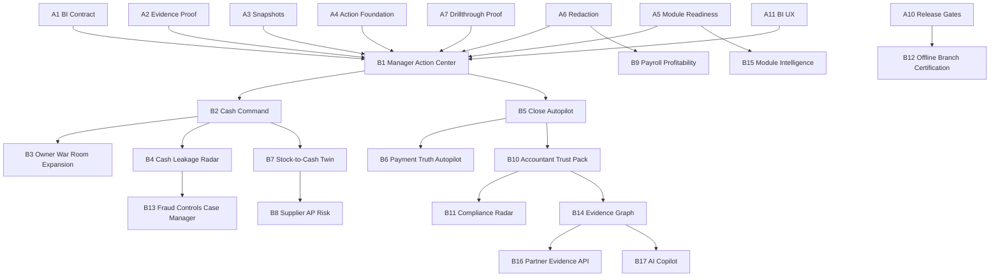

# Kontava Moat Skill Suite Development Blueprint

Generated: 2026-06-20

Primary source: `moat proposals/KONTAVA_TWO_GROUP_MOAT_ACTION_PLAN_2026-06-20.md`

Secondary context inspected:

- `package.json`
- `scripts/kontava-moat-release-gate.js`
- `services/evidence/**`
- `services/snapshots/**`
- `services/signals/**`
- `services/modules/**`
- `services/security/**`
- `services/owner-war-room/**`
- `services/reconciliation/**`
- `services/payments/**`
- `services/accounting/**`
- `services/inventory/**`
- `services/purchase-order/**`
- `services/payroll/**`
- `services/compliance/**`
- `actions/**`
- `components/evidence/**`
- `components/owner-war-room/**`
- `components/analytics/**`
- `components/payroll/**`
- `components/compliance/**`
- `app/[locale]/(dashboard)/dashboard/**`

Purpose: convert the two-group moat action plan into a disciplined Codex skill-suite development blueprint. The suite is designed to guide Kontava from foundation hardening into full cross-boundary moat execution without bloating the platform or destabilizing existing accounting, POS, inventory, purchasing, payroll, finance, compliance, reconciliation, RBAC, audit, tenant isolation, module entitlement, redaction, or ledger-first workflows.

## Executive Summary

Kontava should build two skill suites:

1. Suite A: Foundation Skills. These harden the shared platform spine: BI contracts, evidence, snapshots, action queues, module gates, redaction, proof drawers, source links, seeds, release gates, UX primitives, and performance.
2. Suite B: Moat Build Skills. These deliver the business capabilities from the proposal in the correct order: Manager Action Center, Cash Command, Owner War Room expansion, leakage radar, close autopilot, payment truth, stock-to-cash, supplier risk, payroll profitability, accountant trust, compliance radar, offline branch certification, fraud cases, evidence graph, module intelligence, partner API, and AI copilot.

The suite should not be one giant all-purpose skill. The right architecture is a narrow, sequenced set of skills that each owns a meaningful slice, has clear source areas to inspect, protects the ledger-first and tenant-safe backbone, and has explicit release gates.

Recommended first skill to create:

`kontava-bi-contract-foundation`

Why: every downstream moat surface needs the same KPI, evidence, freshness, blocker, redaction, drill-through, permission, module, and action-link contract. Without this contract, later dashboards become inconsistent and expensive to maintain.

Recommended first skill to execute:

`kontava-bi-contract-foundation`

Why: it unlocks Manager Action Center, Cash Command Intelligence, Owner War Room expansion, Cash Leakage Radar, Close Autopilot, Accountant Trust Pack, and evidence-backed AI later, while remaining low risk and mostly contract/service/UI primitive work.

## Skill Suite Design Rules

Every skill must follow these rules:

- Inspect before editing.
- Prefer existing service, action, hook, and component patterns.
- Keep changes surgical and phase-based.
- Preserve tenant isolation, RBAC, module entitlements, audit logs, evidence grades, proof trails, source links, ledger-first accounting, OHADA compliance, redaction, and current workflows.
- Use server-side services and server actions for trust decisions. UI may present states, but must not be the source of authorization, evidence, or module enforcement.
- Keep module enforcement in observe mode until release gates prove route, action, API, report, export, and job coverage.
- Keep sensitive workflows read-only until fresh-auth, maker-checker, audit, and rollback controls exist.
- Do not create heavy persistent models unless snapshots, action queues, graph queries, or historical use cases justify them.
- Build read-only before mutation.
- Build action before visualization.
- Reuse existing services before adding new schemas.
- Persist only hot, historical, or expensive read models.
- Add tests proportional to blast radius.
- Save all generated run reports in `moat proposals`.

## Shared Validation Commands

Each skill should select the smallest useful validation set, then broaden only when the blast radius requires it.

Core commands:

```powershell
npm run prisma:validate
npm run typecheck
npm run lint
npm test -- --runInBand
node scripts/kontava-moat-release-gate.js --mode fail
```

Focused test pattern:

```powershell
npm test -- --runTestsByPath <test-file-1> <test-file-2> --runInBand
```

Full release command when a phase touches multiple platform boundaries:

```powershell
npm run verify:repo
```

## Shared Source Areas

All skills should begin by checking the relevant subset of these files and folders:

| Area | Existing source areas |
| --- | --- |
| Shared action safety | `services/_shared/**`, `actions/_shared/**` |
| Evidence and proof | `services/evidence/**`, `actions/evidence/**`, `components/evidence/**` |
| Snapshots and read models | `services/snapshots/**`, `actions/snapshots/**` |
| Signals and actions | `services/signals/**`, `actions/signals/**` |
| Module control | `services/modules/**`, `actions/modules/**`, `app/[locale]/(dashboard)/dashboard/settings/modules/page.tsx` |
| Security and redaction | `services/security/**`, `services/controls/**` |
| Owner War Room | `services/owner-war-room/**`, `actions/owner-war-room/**`, `components/owner-war-room/**`, `app/[locale]/(dashboard)/dashboard/owner-war-room/page.tsx` |
| Analytics and BI | `services/analytics/**`, `actions/analytics/**`, `components/analytics/**`, `app/[locale]/(dashboard)/dashboard/analytics/**`, `app/[locale]/(dashboard)/dashboard/finance/analytics/page.tsx` |
| Reconciliation and payments | `services/reconciliation/**`, `services/payments/**`, `actions/payments/**`, `app/[locale]/(dashboard)/dashboard/finance/reconciliation/page.tsx` |
| Accounting and close | `services/accounting/**`, `actions/accounting/**`, `app/[locale]/(dashboard)/dashboard/accounting/close/**` |
| Inventory | `services/inventory/**`, `actions/inventory/**`, `components/inventory/**`, `app/[locale]/(dashboard)/dashboard/inventory/**` |
| Purchasing and AP | `services/purchase-order/**`, `actions/purchasing/**`, `actions/purchaseOrderWorkflow/**`, `components/purchase-orders/**`, `app/[locale]/(dashboard)/dashboard/purchase-orders/**`, `app/[locale]/(dashboard)/dashboard/purchases/**` |
| Payroll | `services/payroll/**`, `actions/payroll/**`, `components/payroll/**`, `app/[locale]/(dashboard)/dashboard/payroll/page.tsx` |
| Compliance | `services/compliance/**`, `actions/compliance/**`, `components/compliance/**`, `app/[locale]/(dashboard)/dashboard/compliance/page.tsx` |
| Prisma and seeds | `prisma/schema.prisma`, `prisma/seed.ts`, `prisma/comprehensive-seed.ts`, `prisma/production-seed.ts`, `prisma/migrations/**` |
| Release gates | `scripts/kontava-moat-release-gate.js`, `scripts/__tests__/kontava-moat-release-gate.test.js`, `package.json` |

## Suite A: Foundation Skills

Suite A converts every Group 1 prerequisite into a focused implementation skill.

### Suite A Skill Index

| Order | Skill name and folder | Foundation | Safe now | Migration likely |
| ---: | --- | --- | --- | --- |
| A1 | `kontava-bi-contract-foundation` | BI Baseline Contract | Yes | No at first |
| A2 | `kontava-evidence-proof-hardener` | Evidence Grade and Proof Trail Hardening | Yes | Later optional |
| A3 | `kontava-snapshot-read-models` | Snapshot and Read-Model Expansion | Yes | Maybe |
| A4 | `kontava-manager-action-center-foundation` | Manager Action Center and Durable Action Queue | Yes read-only | Later likely |
| A5 | `kontava-module-entitlement-readiness` | Module Entitlement Observe and Enforcement Readiness | Yes observe-only | Maybe |
| A6 | `kontava-redaction-surface-policy` | Redaction and Sensitive-Surface Policy | Yes | No at first |
| A7 | `kontava-drillthrough-proof-standard` | Drill-Through and Proof Drawer Standardization | Yes | No |
| A8 | `kontava-data-quality-event-links` | Data Quality, Source Links, and Business Event Consistency | Yes | Maybe |
| A9 | `kontava-seed-backfill-readiness` | Seed, Demo, and Backfill Readiness | Yes | Maybe |
| A10 | `kontava-release-observability-rollback` | Testing, Release Gates, Observability, and Rollback | Yes | No |
| A11 | `kontava-dashboard-bi-ux-primitives` | Dashboard and BI UX Primitives | Yes | No |
| A12 | `kontava-performance-rebuild-strategy` | Performance Budgets and Background Rebuild Strategy | Yes design/guard first | Later likely |

### A1. `kontava-bi-contract-foundation`

Purpose: establish the shared BI contract for every future dashboard, action center, owner surface, and proof-backed KPI.

Trigger: use when creating or changing BI cards, BI sections, Manager Actions, Owner War Room cards, Cash Command cards, proof-linked KPI surfaces, analytics dashboards, or cross-module insight surfaces.

Inspect:

- `services/analytics/**`
- `services/snapshots/**`
- `services/evidence/**`
- `services/owner-war-room/**`
- `services/signals/**`
- `components/analytics/**`
- `components/owner-war-room/**`
- `actions/analytics/**`
- `actions/owner-war-room/**`

Technical responsibilities:

- Create or refine `services/bi/bi-contracts.ts`.
- Define contracts for `BIKpiCard`, `BIKpiGroup`, `BIInsight`, `BIBlocker`, `BIDrillThrough`, `BIProvenance`, `BIActionLink`, `BITrustState`, and `BIFreshness`.
- Add a BI evidence adapter that normalizes snapshots, analytics, proof trails, and action signals into one shape.
- Add server action patterns under `actions/bi/**` only after the service contract is stable.
- Ensure every KPI declares organization, module slug, required permission, evidence grade, freshness, blockers, source modules, redaction state, and drill-through availability.

Allowed code areas:

- `services/bi/**`
- `actions/bi/**`
- `components/bi/**`
- focused consumers in analytics and Owner War Room
- focused tests

Must never break:

- existing analytics pages
- Owner War Room route
- evidence grade semantics
- snapshot services
- tenant isolation
- ledger-first report trust labels

Schema or contract work:

- Prefer TypeScript contracts first.
- No database migration in MVP.
- Add persistent BI read models only if measured response time or history needs justify them.

Required services and actions:

- `bi-contracts.ts`
- `bi-evidence-adapter.service.ts`
- guarded server actions for BI surfaces when UI consumes the service

Required UI/UX primitives:

- BI KPI card
- evidence badge row
- stale/partial/blocked/redacted labels
- drill-through button
- safe empty state
- permission denied state

Security requirements:

- Server-side tenant, RBAC, module observe/enforcement, redaction, evidence, and ledger trust checks.
- UI must not compute trust.
- Ledger-sensitive KPIs must state whether they are operational, posted, reconciled, certified, or blocked.

Validation:

- `npm run typecheck`
- `npm run lint`
- focused service tests for BI contract normalization
- focused action tests for tenant/RBAC/module checks
- `node scripts/kontava-moat-release-gate.js --mode fail`

Completion criteria:

- All new BI values use the shared contract.
- Each KPI has evidence metadata.
- Blocked, stale, redacted, partial, and permission-denied states render consistently.

Anti-bloat:

- Do not create a BI data warehouse.
- Do not add dashboards before the contract exists.
- Do not persist BI cards unless necessary.

Deliverables:

- BI contracts
- BI adapter
- tests
- saved run report in `moat proposals`

### A2. `kontava-evidence-proof-hardener`

Purpose: harden evidence grades and proof trails so every future moat claim can be explained, redacted, and audited.

Trigger: use when adding proof support for new subject types, expanding proof drawers, changing evidence grade logic, or creating evidence-backed dashboards, APIs, exports, close packs, accountant views, or AI answers.

Inspect:

- `services/evidence/**`
- `actions/evidence/**`
- `components/evidence/**`
- `services/accounting/**`
- `services/reconciliation/**`
- `services/compliance/**`
- `services/inventory/**`
- `services/purchase-order/**`
- `services/payroll/**`

Technical responsibilities:

- Extend proof subject registry for sale, payment, stock movement, purchase order, supplier invoice, payroll run, fiscal document, compliance submission, close run, reconciliation run, and journal entry.
- Add subject resolver services where they do not exist.
- Add source route metadata and drill-through support.
- Add unsupported-proof states instead of pretending proof exists.
- Keep evidence grades conservative: raw, operational, posted, reconciled, certified, blocked.

Allowed code areas:

- `services/evidence/**`
- `actions/evidence/**`
- `components/evidence/**`
- focused subject module adapters

Must never break:

- existing proof drawer
- existing evidence grade tests
- reconciliation and close proof
- audit logs
- tenant isolation

Schema or contract work:

- Extend contracts first.
- Persist `EvidenceSnapshot`, `EvidenceNode`, or `EvidenceEdge` only after graph/history/performance needs are proven.

Required services and actions:

- proof trail subject resolver map
- proof trail service adapters
- guarded proof trail action

Required UI/UX primitives:

- evidence grade badge
- proof drawer source list
- proof unavailable state
- redacted proof segment
- source route link state

Security requirements:

- Subject-level permission map.
- Module entitlement check per subject.
- Redaction before payload leaves service.
- Audit sensitive proof access.
- No hidden IDs or cross-tenant proof leakage.

Validation:

- focused proof trail service tests
- proof action tests
- redaction payload tests
- cross-tenant denial tests
- `node scripts/kontava-moat-release-gate.js --mode fail`

Completion criteria:

- New subject types resolve proof safely.
- Unsupported subjects return controlled blocked/unavailable states.
- Redaction and RBAC are tested.

Anti-bloat:

- Do not build full evidence graph yet.
- Do not mark inferred legacy facts as certified.

Deliverables:

- proof subject map
- resolver services
- proof drawer updates
- tests
- saved run report

### A3. `kontava-snapshot-read-models`

Purpose: expand tenant, branch, cash, payment, inventory, close, receivables, payables, payroll, compliance, and manager read models without relying on expensive live cross-module joins.

Trigger: use when a new dashboard needs cross-module data, when a BI surface gets slow, or when a feature needs durable freshness, blockers, source hash, or background rebuild support.

Inspect:

- `services/snapshots/**`
- `actions/snapshots/**`
- `services/owner-war-room/**`
- `services/reconciliation/**`
- `services/inventory/**`
- `services/accounting/**`
- `services/payroll/**`
- `services/compliance/**`
- `prisma/schema.prisma`

Technical responsibilities:

- Add snapshot contracts before tables.
- Extend snapshot contracts for receivables, AP risk, payroll profitability, compliance readiness, cash command, and manager action center when justified.
- Ensure every snapshot carries `organizationId`, source modules, source hash, generated time, freshness, blockers, redactions, and partial state.
- Add rebuild idempotency and fallback behavior.

Allowed code areas:

- `services/snapshots/**`
- `actions/snapshots/**`
- limited module services used as source adapters
- `prisma/schema.prisma` only when persistence is justified

Must never break:

- existing tenant, branch, payment truth, inventory cash, and close readiness snapshots
- Owner War Room
- release gate readiness

Schema or contract work:

- Contract-only first.
- Persist only hot/high-value snapshots.
- Every persisted snapshot needs unique tenant/period/key constraints, source hash, freshness, and rebuild metadata.

Required services and actions:

- snapshot builder service
- snapshot rebuild service extension
- guarded snapshot actions only where needed

Required UI/UX primitives:

- stale state
- partial state
- blocked state
- "last rebuilt" display

Security requirements:

- Tenant-scoped rebuild.
- Redact sensitive fields.
- Never publish failed/partial rebuilds as trusted.

Validation:

- snapshot service tests
- rebuild idempotency tests
- fallback tests
- performance budget checks for hot snapshots

Completion criteria:

- New snapshots are contract-backed, tenant-scoped, stale-aware, redaction-safe, and tested.

Anti-bloat:

- Avoid persisted tables for low-use dashboards.
- Do not duplicate module source data inside BI tables.

Deliverables:

- snapshot contracts
- snapshot builders
- rebuild tests
- saved run report

### A4. `kontava-manager-action-center-foundation`

Purpose: turn BI and signals into daily, role-filtered actions before adding complex workflow automation.

Trigger: use when building Manager Action Center, action cards, daily action queues, signal-to-action conversion, assignment, status, digest, or role-specific operating lists.

Inspect:

- `services/signals/**`
- `actions/signals/**`
- `services/owner-war-room/**`
- `components/owner-war-room/**`
- `services/bi/**`
- `prisma/schema.prisma`

Technical responsibilities:

- Start read-only from existing `BusinessSignal` and `ActionQueueResult` contracts.
- Normalize signal-to-action data with severity, evidence grade, source module, required permission, due date, stale state, and recommended next step.
- Add durable `ActionItem` and `ActionItemEvent` only after read-only usage is proven.
- Add assignment, comments, digest, status, and SLA later.

Allowed code areas:

- `services/signals/**`
- `actions/signals/**`
- `services/bi/**`
- `components/manager-action-center/**`
- focused dashboard route

Must never break:

- Owner War Room action queue
- business signal rules
- notification service
- existing role visibility

Schema or contract work:

- MVP: TypeScript contracts only.
- Later: `BusinessSignal`, `ActionItem`, `ActionItemEvent`, digest preferences.

Required services and actions:

- manager action center service
- guarded action center server actions
- signal dedupe service

Required UI/UX primitives:

- action card
- severity label
- evidence badge
- due/stale state
- blocked state
- redacted state

Security requirements:

- Permission-filtered actions.
- Module-filtered actions.
- No destructive one-click action from BI.
- Sensitive actions must route through guarded services.

Validation:

- action queue service tests
- signal rule tests
- RBAC/module visibility tests
- stale/expired signal tests

Completion criteria:

- Managers see only actions they are allowed to see.
- Every action has evidence and source context.
- No action performs sensitive mutation in MVP.

Anti-bloat:

- Do not build a project management system.
- Do not add workflow automation until daily action usage is proven.

Deliverables:

- manager action contract
- read-only service and route
- tests
- saved report

### A5. `kontava-module-entitlement-readiness`

Purpose: prepare module-oriented SaaS enforcement across routes, server actions, APIs, reports, exports, background jobs, and BI surfaces.

Trigger: use when adding module gates, observing module usage, designing subscription plans, changing module control center, or preparing staged enforcement.

Inspect:

- `services/modules/**`
- `actions/modules/**`
- `app/[locale]/(dashboard)/dashboard/settings/modules/page.tsx`
- dashboard layouts and navigation
- services/actions for target modules
- reports/export code

Technical responsibilities:

- Keep observe mode during early moat phases.
- Add module guard helper for BI, report, action, export, and job surfaces.
- Add would-block reports.
- Add module unavailable state and upgrade request panel.
- Prepare hard enforcement only after coverage reports are clean.

Allowed code areas:

- `services/modules/**`
- `actions/modules/**`
- dashboard navigation and settings module page
- target service/action guards

Must never break:

- admin wildcard RBAC semantics, except wildcard must not bypass entitlement rules
- legacy tenant access during observe mode
- tenant isolation
- login/register flows

Schema or contract work:

- Use existing module catalog and entitlement decision contracts first.
- Later add plan/subscription persistence, usage signals, upgrade requests, enforcement decision logs.

Required services and actions:

- module guard service
- entitlement decision logger
- upgrade request action
- would-block report action

Required UI/UX primitives:

- module unavailable state
- upgrade request panel
- owner/admin-only upgrade prompt
- observe-mode admin report

Security requirements:

- RBAC and entitlement are separate checks.
- Wildcard permission must not bypass module subscription.
- Suspended/read-only tenants must remain safe.

Validation:

- module entitlement tests
- action guard tests
- route direct-access tests when E2E is available
- export/job guard tests where relevant

Completion criteria:

- Observe mode reports what would be blocked without breaking tenants.
- Every new BI/moat surface declares required module.

Anti-bloat:

- Do not hide features only in navigation.
- Do not hard-enforce before coverage is proven.

Deliverables:

- guard helpers
- would-block reporting
- UI states
- tests
- saved report

### A6. `kontava-redaction-surface-policy`

Purpose: standardize redaction for sensitive cross-module surfaces before payroll, supplier bank, provider, partner, close, and export data appear in BI.

Trigger: use when a feature exposes payroll, supplier bank, payment provider, close certification, partner export, proof trail, BI, Owner War Room, Cash Radar, AP Shield, or AI data.

Inspect:

- `services/security/**`
- `services/controls/**`
- `services/evidence/evidence-redaction.service.ts`
- `components/evidence/**`
- sensitive source modules

Technical responsibilities:

- Define `SensitiveSurfacePolicy`.
- Register sensitive surfaces and fields.
- Apply policy to service payloads before returning to actions/UI.
- Add fresh-auth and maker-checker metadata where applicable.
- Add export safety metadata.

Allowed code areas:

- `services/security/**`
- `services/controls/**`
- redaction adapters in relevant services
- UI redaction components

Must never break:

- current proof drawer
- payroll service behavior
- supplier/payment workflows
- close certification access

Schema or contract work:

- Contract first.
- Schema only if auditable redaction/access events are not already covered by audit logs.

Required services and actions:

- redaction policy service
- sensitive surface registry
- export safety helpers
- fresh-auth/maker-checker metadata adapters

Required UI/UX primitives:

- redaction chip
- redacted field state
- sensitive action blocked state
- fresh-auth required state

Security requirements:

- Person-level payroll redacted outside payroll permission.
- Supplier bank/provider identifiers redacted by default.
- Partner data shown only with consent.
- Close evidence shown only to close/audit roles.

Validation:

- redaction policy tests
- payload snapshot tests
- export safety tests
- fresh-auth requirement tests

Completion criteria:

- Sensitive fields are redacted at service boundary.
- UI explains redaction without leaking the value.

Anti-bloat:

- Do not create one-off redaction logic per dashboard.
- Do not rely on CSS hiding.

Deliverables:

- policy contract
- registry
- service adapters
- UI states
- tests

### A7. `kontava-drillthrough-proof-standard`

Purpose: standardize how every KPI, signal, action, document, and dashboard lets users inspect the source of a number.

Trigger: use when adding proof drawer access, KPI drill-through, source route links, audit-friendly evidence panels, or BI-to-module navigation.

Inspect:

- `components/evidence/ProofTrailDrawer.tsx`
- `components/evidence/EvidenceGradeBadge.tsx`
- `services/evidence/**`
- `actions/evidence/**`
- routes for source modules
- planned `services/bi/**`

Technical responsibilities:

- Define `MoatDrillThrough` contract.
- Build source route registry.
- Add proof availability checks.
- Add disabled state when proof is unsupported.
- Ensure target route repeats tenant/RBAC/module checks.

Allowed code areas:

- `services/evidence/**`
- `actions/evidence/**`
- `components/evidence/**`
- `components/bi/**`
- source route registry

Must never break:

- existing proof drawer behavior
- source record pages
- direct URL security

Schema or contract work:

- Contract only in MVP.
- No persistence required.

Required services and actions:

- drill-through registry service
- proof availability service
- guarded proof action

Required UI/UX primitives:

- drill-through button
- proof drawer launcher
- proof unavailable state
- source route disabled state

Security requirements:

- Recheck authorization at target route/service.
- Avoid raw sensitive ID exposure.
- Audit sensitive proof access.

Validation:

- proof action tests
- route denial tests
- UI disabled/enabled tests
- cross-tenant denial tests

Completion criteria:

- Every BI/action KPI can state whether proof exists and why it is blocked if not.

Anti-bloat:

- Do not build graph explorer yet.
- Do not create duplicated source pages.

Deliverables:

- drill-through contract
- route registry
- proof drawer integration
- tests

### A8. `kontava-data-quality-event-links`

Purpose: make operational facts trustworthy by standardizing source links, business events, outbox consistency, and backfill classification.

Trigger: use when adding or auditing workflows that should emit accounting source links, business events, audit logs, outbox events, source coverage, or data quality reports.

Inspect:

- `prisma/schema.prisma`
- services that create financial/operational facts
- `services/accounting/**`
- `services/inventory/**`
- `services/reconciliation/**`
- `services/purchase-order/**`
- `services/payroll/**`
- `services/compliance/**`
- release gate script

Technical responsibilities:

- Map major workflows to required source links/events.
- Add tests for missing source links.
- Classify legacy/backfilled data as trusted, partial, stale, inferred, or blocked.
- Add coverage reports.
- Prevent unsupported legacy data from becoming certified.

Allowed code areas:

- module services
- shared event/source-link helpers
- release gate scripts
- tests

Must never break:

- existing accounting source links
- audit log behavior
- business event outbox behavior
- ledger posting invariants

Schema or contract work:

- Use existing `AccountingSourceLink`, `BusinessEvent`, `BusinessEventOutbox`, and `AuditLog` first.
- Schema changes only for missing coverage metadata or backfill reports.

Required services and actions:

- source-link coverage service
- event quality checker
- backfill classifier

Required UI/UX primitives:

- data quality status
- blocked evidence state
- source coverage summary

Security requirements:

- Audit automated reclassification.
- Never certify inferred data.
- Preserve tenant boundaries in coverage reports.

Validation:

- source-link coverage tests
- business event tests
- backfill idempotency tests
- release gate update tests

Completion criteria:

- Major workflows have source-link/event expectations and coverage checks.

Anti-bloat:

- Do not rebuild every workflow at once.
- Start with high-value workflows that feed BI and close evidence.

Deliverables:

- workflow map
- coverage checker
- tests
- saved report

### A9. `kontava-seed-backfill-readiness`

Purpose: provide realistic, idempotent demo and test scenarios for every foundation and moat phase.

Trigger: use when a new skill needs seeded tenants, demo evidence, limited-module cases, suspended/read-only cases, accountant/partner scenarios, or backfill dry runs.

Inspect:

- `prisma/seed.ts`
- `prisma/comprehensive-seed.ts`
- `prisma/production-seed.ts`
- `prisma/seed-integrated-rbac.ts`
- `scripts/kontava-moat-release-gate.js`
- seed/backfill reports in `moat proposals`

Technical responsibilities:

- Add scenario markers per moat phase.
- Keep seeds idempotent.
- Create tenants for full-suite, limited-module, trial, suspended, read-only, partner/accountant, cash leakage, close blocker, AP risk, payroll redaction, and compliance readiness scenarios.
- Add dry-run backfill reports before writes.

Allowed code areas:

- seed files
- test fixtures
- release gate scripts
- backfill scripts

Must never break:

- existing seed reset behavior
- tenant isolation
- RBAC fixture correctness
- release gate readiness

Schema or contract work:

- Use existing models first.
- Migrations only when a skill's approved schema requires seed support.

Required services and actions:

- seed helpers
- backfill dry-run helper
- scenario readiness reporter

Required UI/UX primitives:

- none required, except demo routes must have valid states.

Security requirements:

- Demo data must not weaken tenant boundaries.
- No production reset/reseed as normal feature work.

Validation:

- `npm run prisma:validate`
- seed dry run where supported
- release gate
- focused tests for new fixture assumptions

Completion criteria:

- Seed scenarios prove module visibility, proof, redaction, action center, and BI states.

Anti-bloat:

- Do not create unrealistic perfect data only.
- Include blocked, partial, stale, and redacted cases.

Deliverables:

- seed scenarios
- backfill plan/report
- release gate entries
- saved report

### A10. `kontava-release-observability-rollback`

Purpose: give every moat phase clear gates, diagnostics, logs, and rollback instructions.

Trigger: use before promoting a foundation or moat feature beyond design/read-only mode, or whenever release gates are missing for a new cross-module surface.

Inspect:

- `scripts/kontava-moat-release-gate.js`
- `scripts/__tests__/kontava-moat-release-gate.test.js`
- `package.json`
- service/action tests for touched areas
- any observability/logging helpers

Technical responsibilities:

- Add phase-specific gates.
- Add structured diagnostics for snapshot rebuilds, signal generation, redaction, proof access, module would-block decisions, and release readiness.
- Add rollback notes per phase.
- Require saved run reports.

Allowed code areas:

- `scripts/**`
- tests
- diagnostics helpers
- report files

Must never break:

- existing release gate output format
- package scripts
- existing test command compatibility

Schema or contract work:

- No schema in MVP.
- Add persistent diagnostics only after clear operational need.

Required services and actions:

- release gate extensions
- diagnostics helpers

Required UI/UX primitives:

- optional support diagnostics page only after product need is clear.

Security requirements:

- Diagnostics must not log sensitive data.
- Audit denied sensitive actions and partner/export access.

Validation:

- release gate tests
- `node scripts/kontava-moat-release-gate.js --mode fail`
- relevant focused tests

Completion criteria:

- Each phase has pass/fail criteria and rollback notes.

Anti-bloat:

- Do not build an observability platform.
- Keep diagnostics focused on support and release readiness.

Deliverables:

- gate updates
- tests
- rollback checklist
- saved report

### A11. `kontava-dashboard-bi-ux-primitives`

Purpose: create reusable enterprise-grade BI and action UI primitives that blend with Kontava dashboard color semantics.

Trigger: use when building BI cards, action cards, proof drawers, dashboard states, module unavailable states, upgrade prompts, redacted states, or analytics/Owner War Room visual updates.

Inspect:

- `components/analytics/**`
- `components/owner-war-room/**`
- `components/evidence/**`
- dashboard page routes
- dashboard theme files
- global styles and shared UI components

Technical responsibilities:

- Create shared BI components.
- Standardize loading, empty, stale, blocked, redacted, permission denied, module unavailable, safe error, and proof unavailable states.
- Use existing dashboard theme tokens and color semantics.
- Ensure accessibility, locale formatting, and responsive behavior.

Allowed code areas:

- `components/bi/**`
- `components/evidence/**`
- `components/analytics/**`
- focused dashboard pages

Must never break:

- dashboard layout
- analytics route rendering
- Owner War Room
- accessibility basics

Schema or contract work:

- None.

Required services and actions:

- consume only existing/approved services.

Required UI/UX primitives:

- KPI card
- action card
- evidence row
- proof launcher
- blocked state
- redacted state
- module unavailable state
- upgrade prompt
- stale freshness label

Security requirements:

- UI must label operational vs ledger-backed vs certified.
- UI must not hide server failures as success.
- Redacted states must not leak values.

Validation:

- component tests where available
- route smoke tests
- lint/typecheck
- manual screenshot checks when visual change is significant

Completion criteria:

- New BI/moat pages feel like one system and expose safe states consistently.

Anti-bloat:

- Do not create separate design systems per feature.
- Do not add decorative dashboards that do not create decisions/actions.

Deliverables:

- component primitives
- examples in one route
- tests
- saved report

### A12. `kontava-performance-rebuild-strategy`

Purpose: set performance budgets and background rebuild patterns for cross-module intelligence.

Trigger: use before adding expensive snapshots, read models, evidence graph queries, Cash Command aggregation, or dashboards that join several modules.

Inspect:

- `services/snapshots/**`
- `services/owner-war-room/**`
- `services/analytics/**`
- `scripts/kontava-moat-release-gate.js`
- Prisma models and indexes used by hot queries

Technical responsibilities:

- Define response-time budgets for BI endpoints, snapshots, proof lookup, and graph candidates.
- Add background rebuild runner design.
- Add idempotency keys and source hashes.
- Persist only hot, expensive, or historical read models.
- Add stale state fallback.

Allowed code areas:

- snapshot services
- rebuild services
- background job scripts
- performance tests
- schema only when persistence is approved

Must never break:

- existing live dashboards
- snapshot rebuild tests
- tenant boundaries in background jobs

Schema or contract work:

- Add persisted read model tables only with unique tenant keys, source hash, freshness, status, and rebuild metadata.

Required services and actions:

- rebuild runner
- performance budget checker
- stale-state contract

Required UI/UX primitives:

- stale state
- last rebuilt display
- rebuild pending state

Security requirements:

- Background jobs tenant-scoped.
- Failed jobs must not publish partial facts as trusted.

Validation:

- rebuild retry tests
- idempotency tests
- performance checks
- release gate

Completion criteria:

- Hot cross-module views have measured budgets and safe stale behavior.

Anti-bloat:

- Do not add queues or warehouses until the first hot paths prove the need.

Deliverables:

- performance budget document or constants
- rebuild strategy
- tests
- saved report

## Suite B: Moat Build Skills

Suite B converts every Group 2 proposal phase into an execution skill. These skills should run only after their Suite A dependencies have passed.

### Suite B Skill Index

| Order | Skill name and folder | Proposal advanced | Safe posture |
| ---: | --- | --- | --- |
| B1 | `kontava-bi-manager-action-center` | BI Baseline and Manager Daily Action Center | Read-only first |
| B2 | `kontava-cash-command-intelligence` | Cash Command Intelligence | Read-only first |
| B3 | `kontava-owner-war-room-expansion` | Owner War Room Expansion | Read-only first |
| B4 | `kontava-cash-leakage-radar` | Cash Leakage Radar MVP | Read-only flags first |
| B5 | `kontava-ohada-close-autopilot` | OHADA Close Autopilot MVP | Read-only blockers first |
| B6 | `kontava-payment-truth-autopilot` | Payment Truth and Suspense Autopilot | Suggested actions first |
| B7 | `kontava-stock-to-cash-twin` | Stock-to-Cash Digital Twin | Read-only first |
| B8 | `kontava-supplier-ap-risk-shield` | Supplier Trust and AP Risk Shield | Read-only first |
| B9 | `kontava-payroll-profitability` | Payroll-to-Profitability Engine | Aggregated/redacted first |
| B10 | `kontava-accountant-trust-pack` | Accountant Trust Pack | Internal preview first |
| B11 | `kontava-compliance-radar` | Compliance Readiness Radar | Read-only blockers first |
| B12 | `kontava-offline-branch-certification` | Offline Branch Certification | Certificate viewer first |
| B13 | `kontava-fraud-controls-case-manager` | Fraud and Controls Case Manager | Candidate cases first |
| B14 | `kontava-business-evidence-graph` | Business Evidence Graph | Design/limited graph first |
| B15 | `kontava-module-intelligence-maturity` | Module Intelligence and Entitlement Control Plane Maturity | Observe reports first |
| B16 | `kontava-fintech-evidence-api` | Fintech Partner Evidence API | Design/internal preview first |
| B17 | `kontava-ai-operating-copilot` | AI Operating Copilot with Accounting Guardrails | Read-only cited answers first |

### B1. `kontava-bi-manager-action-center`

Purpose: deliver the first visible daily operating surface by combining BI contract output with Manager Actions.

Advances:

- BI Baseline
- Manager Daily Action Center
- Owner War Room readiness
- Cash Command readiness

Depends on:

- A1 BI contract
- A2 evidence proof
- A3 snapshots
- A4 action center foundation
- A5 module observe
- A6 redaction
- A11 dashboard BI UX

Inspect:

- `services/bi/**`
- `services/signals/**`
- `actions/signals/**`
- `components/analytics/**`
- `components/owner-war-room/**`
- analytics/dashboard routes

MVP scope:

- Read-only manager actions generated from existing BusinessSignal rules.
- Action cards with severity, evidence grade, source module, permission, freshness, due date, and next action.

Production-grade scope:

- Durable action persistence, assignment, status, comments, digest preferences, and role-specific daily queues.

Full moat-level scope:

- Closed-loop daily operating system where actions link to evidence, owner outcomes, close readiness, cash control, and module upgrade signals.

Explicit exclusions:

- No chat assistant.
- No advanced automation.
- No one-click sensitive action.

Technical responsibilities:

- Add Manager Action Center service and guarded server actions.
- Compose BI contract and BusinessSignal output.
- Add route or panel using shared BI/action UI primitives.
- Add permission/module/redaction filtering.

Security and compliance:

- Every action tenant-scoped, permission-filtered, module-aware, evidence-graded, redaction-safe, and audited when sensitive.

UI/UX requirements:

- Action cards, proof launchers, blocked states, stale states, redacted states, role-specific empty states.

Validation:

- action queue tests
- server action tests
- redaction tests
- route smoke/E2E if available
- release gate

Completion criteria:

- Managers can see a useful daily action list without any sensitive mutation.

Business value:

- Creates daily usage habit.

Moat value:

- Turns Kontava from reporting software into an operating assistant.

Deliverables:

- service, action, route/component, tests, run report.

### B2. `kontava-cash-command-intelligence`

Purpose: give owners a reliable cash command view across POS cash, payments, suspense, supplier commitments, payroll exposure, tax/close readiness, and ledger trust.

Advances:

- Cash Command Intelligence
- Owner War Room
- Payment Truth
- Cash Leakage Radar

Depends on:

- A1, A2, A3, A6, A7, A11, A12

Inspect:

- `services/snapshots/payment-truth-snapshot.service.ts`
- `services/snapshots/tenant-operating-snapshot.service.ts`
- `services/reconciliation/**`
- `services/payments/**`
- `services/accounting/**`
- `services/payroll/**`
- `services/purchase-order/**`
- Owner War Room and analytics surfaces

MVP scope:

- Read-only cash command cards: cash position, open suspense, payment truth, supplier commitments, payroll exposure, tax/close blockers, and freshness.

Production-grade scope:

- Cash forecast, receivable/payable timing, branch cash drill-through, and action recommendations.

Full moat-level scope:

- Evidence-backed cash intelligence combining sales, bank/mobile money, purchasing, payroll, reconciliation, close, and ledger status.

Explicit exclusions:

- No predictive cash forecasting until historical data quality is proven.
- No automatic payment or posting.

Technical responsibilities:

- Build `cash-command-intelligence.service.ts`.
- Map all cards to BI contract.
- Add proof and drill-through.
- Add Owner War Room integration.

Security and compliance:

- Redact sensitive payroll/supplier/provider details.
- Recheck permissions for drill-through.
- Mark cash as operational, reconciled, posted, or blocked.

UI/UX requirements:

- Cash command cards, blocker stack, source/freshness row, proof launcher, branch filter if source data supports it.

Validation:

- cash service tests
- proof tests
- redaction tests
- performance budget checks

Completion criteria:

- No cash KPI appears without source, freshness, evidence, blockers, and permission metadata.

Business value:

- Owners know whether obligations can be met.

Moat value:

- Connects cash, stock, payments, purchases, payroll, compliance, and ledger evidence.

Deliverables:

- service, action, UI integration, tests, run report.

### B3. `kontava-owner-war-room-expansion`

Purpose: make Owner War Room the visible daily command surface for BI, cash, manager actions, proof, and module-aware upgrade moments.

Advances:

- Owner War Room
- Manager Action Center
- Module Intelligence
- Cash Command

Depends on:

- B1
- B2
- A5
- A7
- A11

Inspect:

- `services/owner-war-room/**`
- `actions/owner-war-room/**`
- `components/owner-war-room/**`
- `app/[locale]/(dashboard)/dashboard/owner-war-room/page.tsx`
- BI/action/cash services

MVP scope:

- Read-only extension with BI and Cash Command panels, Manager Action panel, proof coverage, and module-aware unavailable states.

Production-grade scope:

- User preferences, digest, role-specific layouts, and action follow-through.

Full moat-level scope:

- Daily owner command center with evidence-backed action, risk, cash, close, and growth intelligence.

Explicit exclusions:

- No custom dashboard builder.
- No AI.
- No partner widgets.

Technical responsibilities:

- Extend Owner War Room service contract.
- Compose BI, Cash Command, and Manager Actions.
- Add route components using shared BI primitives.
- Add module upgrade prompts only for owners/admins.

Security and compliance:

- Server-side filtering by tenant/RBAC/module/redaction.
- No hidden sensitive values.
- No mutation in MVP.

UI/UX requirements:

- Enterprise command layout, proof drawers, redacted states, blocked states, upgrade prompts, compact owner-ready cards.

Validation:

- Owner War Room service tests
- action tests
- E2E smoke for route/proof/redaction/permission denial when available
- release gate

Completion criteria:

- Owner War Room becomes the default trusted operating surface without adding disconnected dashboards.

Business value:

- One screen for what owners need today.

Moat value:

- Makes cross-module evidence visible and memorable.

Deliverables:

- service/action/component updates, tests, run report.

### B4. `kontava-cash-leakage-radar`

Purpose: detect cash leakage risk from drawer variance, open suspense, exceptions, duplicate provider references, refund/void spikes, and branch/payment anomalies.

Advances:

- Cash Leakage Radar
- Fraud and Controls Case Manager
- Payment Truth

Depends on:

- B1
- B2
- A2
- A6
- A7
- A8

Inspect:

- `services/signals/**`
- `services/reconciliation/**`
- `services/payments/**`
- `actions/pos/**`
- POS drawer/session/tender services
- analytics routes

MVP scope:

- Read-only radar flags with safe wording and "why flagged" proof.

Production-grade scope:

- Assign/resolve investigation actions through Manager Action Center.

Full moat-level scope:

- Evidence-backed cash-control radar feeding cases, close readiness, and owner dashboards.

Explicit exclusions:

- No predictive staff fraud scoring.
- No public accusations.
- No automatic disciplinary workflow.

Technical responsibilities:

- Add cash leakage signal rules.
- Add radar service and guarded action.
- Add branch/payment method/terminal grouping only where data quality supports it.

Security and compliance:

- Safe language: "requires review", not accusation.
- Redact staff/person data unless permissioned.
- Audit sensitive proof access.

UI/UX requirements:

- Risk cards, evidence drawer, severity, branch filters, blocked state, action link.

Validation:

- signal rule tests
- false-positive/safe-wording tests
- redaction tests
- proof tests

Completion criteria:

- Every flag has source, evidence, and controlled wording.

Business value:

- Reduces cash loss and owner anxiety.

Moat value:

- Uses integrated POS, payment, reconciliation, audit, and ledger evidence.

Deliverables:

- rules, service, UI, tests, run report.

### B5. `kontava-ohada-close-autopilot`

Purpose: convert close readiness into a practical close blocker and action surface for owners and accountants.

Advances:

- OHADA Close Autopilot
- Accountant Trust Pack
- Compliance Radar

Depends on:

- A2
- A3 close readiness
- A4
- A7
- A8
- B1

Inspect:

- `services/accounting/close-assurance.service.ts`
- `services/accounting/close-assurance-pack.service.ts`
- `actions/accounting/close-assurance.actions.ts`
- close routes
- evidence/proof services

MVP scope:

- Read-only close blocker dashboard and action cards.

Production-grade scope:

- Assignment, waiver workflow, close task workflow, controlled signoff.

Full moat-level scope:

- Period close autopilot that turns daily evidence into close-ready accounting and compliance evidence.

Explicit exclusions:

- No auto-certification.
- No close reopening automation.

Technical responsibilities:

- Add close blocker queue service.
- Map blockers to action center.
- Add proof links to close evidence.
- Add BI close readiness cards.

Security and compliance:

- No certified claims without close controls.
- Fresh-auth/maker-checker for close override/signoff.
- Audit close-sensitive actions.

UI/UX requirements:

- Close blocker board, proof links, period selector, accountant/owner role states.

Validation:

- close service tests
- proof tests
- sensitive-action tests
- release gate

Completion criteria:

- Close blockers are visible, actionable, and proof-backed without auto-certifying anything.

Business value:

- Less month-end chaos.

Moat value:

- Turns daily operations into close-ready evidence.

Deliverables:

- service/action/UI/tests/report.

### B6. `kontava-payment-truth-autopilot`

Purpose: guide suspense resolution, matching proposals, exception assignment, and reconciliation proof without unsafe automatic posting.

Advances:

- Payment Truth and Suspense Autopilot
- Cash Leakage Radar
- Close Autopilot
- Partner Evidence later

Depends on:

- payment reconciliation foundation
- A2
- A4
- A6
- A7
- B2
- B5

Inspect:

- `services/reconciliation/**`
- `services/payments/**`
- `actions/payments/**`
- `app/[locale]/(dashboard)/dashboard/finance/reconciliation/page.tsx`
- evidence and sensitive action services

MVP scope:

- Read-only suspense queue with suggested next actions.

Production-grade scope:

- Match approval, suspense posting, exception assignment, signoff.

Full moat-level scope:

- Payment truth engine across cash, bank, mobile money, card, POS, invoice, and ledger.

Explicit exclusions:

- No automatic posting without approval.
- No silent match override.

Technical responsibilities:

- Add guided suspense service.
- Link suspense exceptions to Manager Actions.
- Add proof coverage for match suggestions.
- Add fresh-auth/maker-checker for approval/posting.

Security and compliance:

- Approval/posting requires audit, fresh auth, and maker-checker where applicable.
- Redact provider identifiers as policy requires.

UI/UX requirements:

- Suspense queue, suggested action, evidence drawer, match confidence explanation, approval blocked state.

Validation:

- payment suspense tests
- reconciliation run tests
- sensitive action tests
- redaction tests

Completion criteria:

- Finance users can understand and prioritize suspense without unsafe automation.

Business value:

- Faster cash close.

Moat value:

- Deep payment evidence across operations, providers, bank/mobile money, and ledger.

Deliverables:

- service/action/UI/tests/report.

### B7. `kontava-stock-to-cash-twin`

Purpose: show owners where cash is trapped in inventory and how stock movement affects cash, supplier commitments, and sales.

Advances:

- Stock-to-Cash Digital Twin
- Supplier AP Risk Shield
- Owner War Room

Depends on:

- A1
- A3 inventory cash snapshot
- A7
- B2
- purchasing commitments

Inspect:

- `services/inventory/**`
- `services/snapshots/inventory-cash-snapshot.service.ts`
- `services/purchase-order/**`
- `actions/inventory/**`
- inventory routes/components

MVP scope:

- Read-only inventory cash exposure, dead stock, stockout risk, reorder affordability.

Production-grade scope:

- Scenario planning and affordability recommendations.

Full moat-level scope:

- Digital twin linking stock, cash, purchasing, sales velocity, supplier exposure, and ledger valuation.

Explicit exclusions:

- No automatic purchase generation.
- No speculative forecasting until data quality is proven.

Technical responsibilities:

- Add stock-to-cash service.
- Map inventory cash snapshot and purchasing commitments to BI contract.
- Add proof links for valuation and movement sources.

Security and compliance:

- Valuation must be accurate, stale-aware, and ledger-aligned.
- Tenant/module/RBAC guard all source drill-through.

UI/UX requirements:

- inventory capital cards, trapped cash list, reorder affordability card, source/proof drawer.

Validation:

- inventory snapshot tests
- stock valuation tests
- proof tests
- performance checks

Completion criteria:

- Owners can see cash tied in stock with evidence and safe stale states.

Business value:

- Better buying decisions and reduced dead stock.

Moat value:

- Connects inventory, purchasing, cash, sales, and ledger evidence.

Deliverables:

- service/action/UI/tests/report.

### B8. `kontava-supplier-ap-risk-shield`

Purpose: surface supplier commitments, delayed receiving, duplicate invoice/payment risk, bank-change risk, and AP exceptions.

Advances:

- Supplier Trust and AP Risk Shield
- Stock-to-Cash
- Cash Command

Depends on:

- A1
- A4
- A6
- A7
- A8
- B2

Inspect:

- `services/purchase-order/**`
- `actions/purchasing/**`
- `actions/purchaseOrderWorkflow/**`
- `services/supplier/**`
- `services/accounting/**`
- purchase routes/components

MVP scope:

- Read-only supplier/AP risk dashboard.

Production-grade scope:

- Bank-change approval, payment approval, duplicate resolution workflow.

Full moat-level scope:

- AP risk shield connecting supplier identity, receiving, invoices, payments, cash, ledger, and audit evidence.

Explicit exclusions:

- No payment release from dashboard until maker-checker is proven.
- No raw supplier bank visibility outside permission.

Technical responsibilities:

- Add AP risk service.
- Add risk rules for delayed receiving, duplicate invoice/payment, bank changes, open commitments.
- Link severe risks to action center.

Security and compliance:

- Supplier bank fields redacted and fresh-auth protected.
- Maker-checker for bank/payment changes.
- Audit all sensitive AP events.

UI/UX requirements:

- AP risk cards, supplier risk table, evidence drawer, redaction chips, maker-checker blocked state.

Validation:

- purchase/AP service tests
- redaction tests
- sensitive action tests
- proof tests

Completion criteria:

- AP risks are visible, safe, and evidence-backed without enabling unsafe payment mutation.

Business value:

- Prevents supplier payment loss and AP close blockers.

Moat value:

- Combines supplier, receiving, invoice, payment, ledger, and audit evidence.

Deliverables:

- service/action/UI/tests/report.

### B9. `kontava-payroll-profitability`

Purpose: connect payroll exposure and labor cost to branch/period profitability while protecting employee privacy.

Advances:

- Payroll-to-Profitability Engine
- Owner War Room
- Cash Command

Depends on:

- payroll foundation
- A1
- A3
- A6
- A7
- B2

Inspect:

- `services/payroll/**`
- `actions/payroll/**`
- `components/payroll/**`
- `app/[locale]/(dashboard)/dashboard/payroll/page.tsx`
- accounting and analytics services

MVP scope:

- Aggregated/redacted payroll exposure and branch-level labor ratios.

Production-grade scope:

- Labor-adjusted margin by branch, product, production batch, or period where source quality supports it.

Full moat-level scope:

- Payroll-to-profitability engine connecting payroll, attendance, sales, production, finance, and ledger.

Explicit exclusions:

- No person-level pay outside payroll permissions.
- No individual performance scoring from payroll.

Technical responsibilities:

- Add payroll profitability service.
- Aggregate before returning data to BI.
- Add proof and source quality labels.

Security and compliance:

- Strong redaction.
- Payroll permission required for person-level data.
- Audit sensitive payroll proof access.

UI/UX requirements:

- aggregate payroll cards, branch ratios, redacted states, source quality labels.

Validation:

- payroll service tests
- redaction payload tests
- proof tests
- permission tests

Completion criteria:

- Owners understand labor impact without seeing restricted payroll data.

Business value:

- Better labor cost control.

Moat value:

- Connects payroll, sales, production, finance, and ledger evidence.

Deliverables:

- service/action/UI/tests/report.

### B10. `kontava-accountant-trust-pack`

Purpose: create an accountant-ready review workspace and evidence pack preview before opening external collaboration broadly.

Advances:

- Accountant Trust Pack
- Close Autopilot
- Evidence Graph
- Partner Evidence later

Depends on:

- A2
- A6
- A7
- A8
- B5
- B6

Inspect:

- `services/accounting/**`
- `actions/accounting/**`
- `services/evidence/**`
- close and reconciliation routes
- access/RBAC services

MVP scope:

- Internal read-only accountant trust pack preview.

Production-grade scope:

- Scoped accountant access, comments, evidence requests, revocation.

Full moat-level scope:

- Accountant-led collaboration channel with evidence packs, close packs, reconciliation proof, and client issue resolution.

Explicit exclusions:

- No broad external access until consent/scopes exist.
- No export of sensitive data without export safety.

Technical responsibilities:

- Add trust pack service.
- Compose close, reconciliation, source-link, and ledger evidence.
- Add scoped access design before external release.

Security and compliance:

- Scoped, audited, revocable access.
- Redaction policy applied to pack content.
- Fresh-auth for granting/revoking access.

UI/UX requirements:

- trust pack preview, evidence checklist, missing proof list, export blocked state.

Validation:

- service tests
- redaction tests
- access scope tests
- export safety tests

Completion criteria:

- Internal users can preview accountant evidence without exposing external access risk.

Business value:

- Less accountant cleanup time.

Moat value:

- Drives accountant-led adoption.

Deliverables:

- service/action/UI/tests/report.

### B11. `kontava-compliance-radar`

Purpose: surface fiscal sequence warnings, compliance submission blockers, payroll declaration readiness, and country-pack evidence gaps.

Advances:

- Compliance Readiness Radar
- OHADA Close Autopilot
- Accountant Trust Pack

Depends on:

- country packs
- fiscal docs
- payroll declarations
- close evidence
- A1
- A2
- A6
- A7

Inspect:

- `services/compliance/**`
- `actions/compliance/**`
- `components/compliance/**`
- `app/[locale]/(dashboard)/dashboard/compliance/page.tsx`
- payroll and close services

MVP scope:

- Read-only blocker dashboard by period and country pack.

Production-grade scope:

- Guided remediation and authority adapter status.

Full moat-level scope:

- Compliance readiness engine that tracks operational, payroll, fiscal, close, and country-pack evidence.

Explicit exclusions:

- No regulator-facing claims before legal review.
- No automated authority submission from BI surface.

Technical responsibilities:

- Add compliance radar service.
- Map blockers to BI contract and action center.
- Add jurisdiction/country-pack context to each claim.

Security and compliance:

- No compliance claim without evidence and jurisdiction context.
- Audit close/compliance-sensitive access.

UI/UX requirements:

- compliance blocker cards, country/period selector, evidence drawer, legal review warning where needed.

Validation:

- compliance service tests
- country-pack tests
- proof tests
- redaction tests

Completion criteria:

- Users can see compliance readiness and blockers without unproven regulatory claims.

Business value:

- Avoids late compliance surprises.

Moat value:

- Encodes OHADA and country-specific operating knowledge.

Deliverables:

- service/action/UI/tests/report.

### B12. `kontava-offline-branch-certification`

Purpose: show trust status for offline branch replay, sync conflicts, hash verification, and branch activity certification.

Advances:

- Offline Branch Certification
- Business Evidence Graph
- Close evidence

Depends on:

- offline POS replay foundation
- audit/hash chain
- A2
- A7
- A10

Inspect:

- `actions/pos/sync.actions.ts`
- POS sync/replay services if present
- audit services
- evidence services
- branch/tenant snapshot services

MVP scope:

- Read-only offline replay certificate viewer.

Production-grade scope:

- Conflict workflow and branch certification pack.

Full moat-level scope:

- Branch trust certification that proves offline data replay integrity, conflicts, and close readiness impact.

Explicit exclusions:

- No complex offline command center until multi-branch/offline usage proves need.

Technical responsibilities:

- Add certificate read model/service.
- Link replay results to evidence/proof drawer.
- Add branch trust status.

Security and compliance:

- Tenant/branch scoped.
- Hash verification and replay idempotency required.
- Audit conflict resolution.

UI/UX requirements:

- certificate viewer, sync trust badge, conflict evidence list, stale state.

Validation:

- sync/replay tests
- hash verification tests
- proof tests
- release gate

Completion criteria:

- Branch offline replay trust can be inspected without changing replay behavior.

Business value:

- Owners trust branch activity after disconnection.

Moat value:

- Hard-to-copy branch evidence.

Deliverables:

- service/action/UI/tests/report.

### B13. `kontava-fraud-controls-case-manager`

Purpose: turn severe risk signals into safe, evidence-backed control case candidates and workflows.

Advances:

- Fraud and Controls Case Manager
- Cash Leakage Radar
- Supplier/AP Risk

Depends on:

- B1
- B4
- B8
- A6
- A7
- A10

Inspect:

- `services/signals/**`
- cash radar service
- supplier/AP risk service
- `services/security/**`
- `services/evidence/**`

MVP scope:

- Read-only case candidates from severe signals.

Production-grade scope:

- Case workflow with status, comments, owner, SLA, and resolution audit.

Full moat-level scope:

- Enterprise controls case manager adapted for SMBs, linked to cash, AP, inventory, payroll, close, and audit evidence.

Explicit exclusions:

- No predictive fraud allegations.
- No black-box risk scoring.
- No punitive staff workflow.

Technical responsibilities:

- Add case candidate service.
- Add controlled wording and evidence timeline.
- Add assignment/status only after MVP proof.

Security and compliance:

- Safe language.
- Audit all case access and status changes.
- Redact person-sensitive evidence.

UI/UX requirements:

- case candidate board, evidence timeline, safe wording, blocked/redacted states.

Validation:

- case service tests
- wording tests
- redaction tests
- audit tests

Completion criteria:

- Severe signals can be reviewed as controlled cases without accusations or privacy leaks.

Business value:

- Exceptions become managed investigations.

Moat value:

- Makes enterprise controls practical for SMBs.

Deliverables:

- service/action/UI/tests/report.

### B14. `kontava-business-evidence-graph`

Purpose: persist and query relationships between business facts so users can trace numbers and documents across operations, payments, ledger, close, compliance, and partners.

Advances:

- Business Evidence Graph
- Accountant Trust Pack
- Partner Evidence API
- AI Copilot

Depends on:

- A2
- A7
- A8
- A12
- B1
- B2
- B5
- B6
- B10

Inspect:

- `services/evidence/**`
- `prisma/schema.prisma`
- source-link/business-event models
- proof trail usage reports
- accountant/close/payment services

MVP scope:

- Limited graph for sale, payment, journal, reconciliation, and close.

Production-grade scope:

- Persisted graph snapshots, indexed queries, graph-backed drill-through.

Full moat-level scope:

- Business evidence layer connecting every material operating fact with audit-grade provenance.

Explicit exclusions:

- No full visual graph for every object immediately.
- No graph warehouse before query patterns are proven.

Technical responsibilities:

- Design graph contracts.
- Add limited persisted graph only for proven high-value paths.
- Add node/edge APIs behind tenant/RBAC/module/redaction guards.

Security and compliance:

- Tenant isolation at every node/edge.
- Redaction-aware graph expansion.
- Audit graph access for sensitive subjects.

UI/UX requirements:

- limited evidence path view, proof drawer integration, no overwhelming visual graph in MVP.

Validation:

- graph tenant isolation tests
- performance tests
- proof consistency tests
- redaction tests

Completion criteria:

- Users can trace key cash/close/payment paths without broad graph bloat.

Business value:

- Trust every important number and document.

Moat value:

- Proprietary operating evidence competitors cannot copy quickly.

Deliverables:

- design, limited schema if approved, service/API/UI/tests/report.

### B15. `kontava-module-intelligence-maturity`

Purpose: mature module control from static entitlement decisions into usage-informed module intelligence and staged enforcement.

Advances:

- Module Intelligence
- Module-oriented SaaS
- Pricing and packaging

Depends on:

- A5
- A10
- B1/B2/B3 usage surfaces

Inspect:

- `services/modules/**`
- `actions/modules/**`
- module settings page
- BI and action center module metadata
- release gate reports

MVP scope:

- Usage and would-block reports.

Production-grade scope:

- Upgrade recommendations, enforcement coverage reports, staged hard enforcement with rollback.

Full moat-level scope:

- Module-aware control plane that supports packaging, upsell, partner bundles, and clean tenant-specific product experience.

Explicit exclusions:

- No sudden module hiding for legacy tenants.
- No hard enforcement without dry-run evidence.

Technical responsibilities:

- Add module usage signal collection.
- Add upgrade recommendation service.
- Add enforcement readiness report.

Security and compliance:

- RBAC cannot bypass entitlements.
- Module checks apply to routes, actions, APIs, reports, exports, jobs.
- Suspended/read-only tenants protected.

UI/UX requirements:

- admin reports, owner upgrade request, module unavailable state, usage insight.

Validation:

- module entitlement tests
- direct access tests
- export/job guard tests
- release gate

Completion criteria:

- Enforcement dry-run is clean for target tenants.

Business value:

- Supports modular pricing and upsell.

Moat value:

- Product grows around real SMB usage.

Deliverables:

- service/action/UI/gate/tests/report.

### B16. `kontava-fintech-evidence-api`

Purpose: prepare controlled partner evidence sharing for financing, payment, and fintech partnerships.

Advances:

- Fintech Partner Evidence API
- Data moat
- Financing partnerships

Depends on:

- B14
- B10
- A6
- A10
- consent/export security

Inspect:

- evidence graph services
- accountant trust pack
- export safety services
- auth/RBAC services
- audit logs
- Prisma schema

MVP scope:

- Internal consent/export design and watermarked pack preview.

Production-grade scope:

- Scoped partner API with credentials, consent grants, revocation, audit, watermarking, and rate limits.

Full moat-level scope:

- Kontava as trusted evidence infrastructure for lenders, payment partners, and advisors.

Explicit exclusions:

- No open API before legal/security review.
- No partner access without consent and revocation.

Technical responsibilities:

- Design `ConsentGrant`, `PartnerCredential`, `PartnerEvidenceExport`, and audit contracts.
- Build internal preview first.
- Add external API only after security review.

Security and compliance:

- Consent, revocation, audit, rate limits, watermarking, least privilege, redaction, tenant isolation.
- Revoked credentials must access nothing.

UI/UX requirements:

- consent preview, export watermark, revoke access, partner access log.

Validation:

- credential revocation tests
- export redaction tests
- audit tests
- rate limit/security tests

Completion criteria:

- Internal evidence export preview is safe and legally reviewable.

Business value:

- Helps SMBs access financing and better payment services.

Moat value:

- Turns Kontava evidence into partner infrastructure.

Deliverables:

- design report, internal preview, tests, security checklist.

### B17. `kontava-ai-operating-copilot`

Purpose: create a read-only, source-cited AI assistant with accounting guardrails after evidence, BI, redaction, and graph foundations mature.

Advances:

- AI Operating Copilot with Accounting Guardrails
- Owner productivity
- Accountant guidance

Depends on:

- B14
- A1
- A2
- A6
- A7
- A10
- evidence retrieval

Inspect:

- evidence graph
- BI services
- proof trail services
- redaction policy
- auth/RBAC/module controls
- AI guardrail skills/docs if used later

MVP scope:

- Read-only question answering over safe evidence with citations.

Production-grade scope:

- Draft action recommendations, cited explanations, accounting-safe summaries, answer audit.

Full moat-level scope:

- Evidence-bound operating copilot that helps owners, accountants, and managers understand and act without bypassing controls.

Explicit exclusions:

- No mutation execution.
- No uncited answers.
- No certified claims without evidence.
- No bypass of RBAC/module/redaction.

Technical responsibilities:

- Design retrieval contract.
- Filter all retrieved evidence by tenant/RBAC/module/redaction.
- Store answer audit.
- Add refusal/blocked states.

Security and compliance:

- Prompt injection tests.
- Citation required.
- Redaction enforced before model context.
- No sensitive mutation.

UI/UX requirements:

- cited answer panel, evidence drawer, cannot-answer state, redacted/blocked answer state.

Validation:

- citation tests
- RBAC/redaction retrieval tests
- prompt injection tests
- answer audit tests

Completion criteria:

- AI answers are read-only, cited, permission-filtered, and redaction-safe.

Business value:

- Makes Kontava easier to understand and operate.

Moat value:

- AI becomes evidence-bound, not generic.

Deliverables:

- design, retrieval prototype, guardrail tests, report.

## Recommended `SKILL.md` Frontmatter Descriptions

Use each folder name exactly as the skill name.

| Skill | Frontmatter description |
| --- | --- |
| `kontava-bi-contract-foundation` | Use when standardizing Kontava BI KPI, evidence, freshness, blocker, redaction, module, permission, and drill-through contracts before building BI, Manager Action Center, Owner War Room, or Cash Command surfaces. |
| `kontava-evidence-proof-hardener` | Use when expanding or hardening Kontava evidence grades, proof trails, proof subject resolvers, proof drawers, source route metadata, and redaction-safe evidence access. |
| `kontava-snapshot-read-models` | Use when designing or implementing Kontava tenant, branch, cash, payment, inventory, close, receivable, payable, payroll, compliance, or manager read models and snapshot rebuild behavior. |
| `kontava-manager-action-center-foundation` | Use when turning Kontava business signals and BI facts into role-filtered, evidence-backed Manager Actions before durable workflow automation. |
| `kontava-module-entitlement-readiness` | Use when preparing Kontava module observe mode, would-block reports, module guards, upgrade prompts, and staged entitlement enforcement across routes, actions, reports, exports, APIs, and jobs. |
| `kontava-redaction-surface-policy` | Use when defining or enforcing redaction and sensitive-surface policy for payroll, supplier bank, provider, partner, proof, export, close, BI, or cross-module dashboard data. |
| `kontava-drillthrough-proof-standard` | Use when standardizing Kontava KPI drill-through, proof drawer launchers, source route registries, proof availability checks, and disabled proof states. |
| `kontava-data-quality-event-links` | Use when auditing or implementing Kontava source links, business events, outbox consistency, data-quality classification, source coverage, and backfill trust rules. |
| `kontava-seed-backfill-readiness` | Use when creating Kontava seed scenarios, demo tenants, fixture data, backfill dry runs, and release-gate scenario validation for moat foundations or build phases. |
| `kontava-release-observability-rollback` | Use when adding Kontava release gates, diagnostics, observability, rollback notes, and phase promotion criteria for moat foundation or build work. |
| `kontava-dashboard-bi-ux-primitives` | Use when creating or standardizing Kontava dashboard BI cards, action cards, proof states, redacted states, blocked states, module unavailable states, and enterprise dashboard UX primitives. |
| `kontava-performance-rebuild-strategy` | Use when setting performance budgets, background rebuild strategy, idempotency, source hashes, stale behavior, and persisted read-model rules for cross-module intelligence. |
| `kontava-bi-manager-action-center` | Use when building the Kontava BI Baseline and Manager Daily Action Center as a read-only, evidence-backed, role-filtered daily operating surface. |
| `kontava-cash-command-intelligence` | Use when building Kontava Cash Command Intelligence across cash, payment truth, suspense, supplier commitments, payroll exposure, tax, close, and ledger evidence. |
| `kontava-owner-war-room-expansion` | Use when expanding Kontava Owner War Room with BI contracts, Cash Command, Manager Actions, proof drawers, and module-aware upgrade states. |
| `kontava-cash-leakage-radar` | Use when building Kontava Cash Leakage Radar from drawer variance, suspense, payment exceptions, duplicate references, refunds, voids, and branch cash risk signals. |
| `kontava-ohada-close-autopilot` | Use when building Kontava OHADA Close Autopilot MVP with close blockers, action cards, proof links, readiness domains, and accountant/owner close workflows. |
| `kontava-payment-truth-autopilot` | Use when building Kontava Payment Truth and Suspense Autopilot with guided suspense resolution, match proposals, exception actions, proof, fresh auth, and maker-checker. |
| `kontava-stock-to-cash-twin` | Use when building Kontava Stock-to-Cash Digital Twin for inventory cash exposure, dead stock, stockout risk, reorder affordability, supplier commitments, and evidence-backed valuation. |
| `kontava-supplier-ap-risk-shield` | Use when building Kontava Supplier Trust and AP Risk Shield for supplier commitments, delayed receiving, duplicate invoice/payment risk, bank-change risk, and AP exceptions. |
| `kontava-payroll-profitability` | Use when building Kontava Payroll-to-Profitability with aggregated payroll exposure, branch labor cost, payroll-to-ledger status, redaction, and labor-adjusted profitability. |
| `kontava-accountant-trust-pack` | Use when building Kontava Accountant Trust Pack with evidence pack preview, close/reconciliation/source-link review, scoped access, comments, requests, revocation, and export safety. |
| `kontava-compliance-radar` | Use when building Kontava Compliance Readiness Radar across fiscal sequences, submissions, payroll declarations, country-pack evidence gaps, close readiness, and OHADA compliance blockers. |
| `kontava-offline-branch-certification` | Use when building Kontava Offline Branch Certification with replay certificate views, sync trust status, conflict evidence, branch trust state, and hash verification. |
| `kontava-fraud-controls-case-manager` | Use when building Kontava Fraud and Controls Case Manager from severe risk signals, evidence timelines, case candidates, safe wording, assignment, and resolution audit. |
| `kontava-business-evidence-graph` | Use when designing or implementing Kontava Business Evidence Graph, graph snapshots, node/edge APIs, graph-backed drill-through, and performance-safe evidence paths. |
| `kontava-module-intelligence-maturity` | Use when maturing Kontava module intelligence with usage signals, upgrade recommendations, enforcement coverage reports, and staged hard module enforcement with rollback. |
| `kontava-fintech-evidence-api` | Use when designing or implementing Kontava Fintech Partner Evidence API with consent grants, partner credentials, scoped evidence exports, revocation, watermarking, audit, and rate limits. |
| `kontava-ai-operating-copilot` | Use when designing or implementing Kontava AI Operating Copilot with read-only source-cited answers, evidence retrieval, RBAC/module/redaction filters, answer audit, and accounting guardrails. |

## Dependency Map



## Execution Order

### Wave 0: Create the Foundation Skill Pack

1. `kontava-bi-contract-foundation`
2. `kontava-evidence-proof-hardener`
3. `kontava-redaction-surface-policy`
4. `kontava-drillthrough-proof-standard`
5. `kontava-dashboard-bi-ux-primitives`
6. `kontava-release-observability-rollback`

Why: these are the lowest-risk shared foundations and define the language of evidence-backed BI.

### Wave 1: Data and Control Foundations

1. `kontava-snapshot-read-models`
2. `kontava-manager-action-center-foundation`
3. `kontava-module-entitlement-readiness`
4. `kontava-data-quality-event-links`
5. `kontava-seed-backfill-readiness`
6. `kontava-performance-rebuild-strategy`

Why: these prepare cross-module data, action queues, module gates, test data, and performance before the product surfaces grow.

### Wave 2: First Visible Moat Value

1. `kontava-bi-manager-action-center`
2. `kontava-cash-command-intelligence`
3. `kontava-owner-war-room-expansion`

Why: this creates daily owner/manager usage with minimal bloat and mostly read-only surfaces.

### Wave 3: Controlled Operational Intelligence

1. `kontava-cash-leakage-radar`
2. `kontava-ohada-close-autopilot`
3. `kontava-payment-truth-autopilot`

Why: these turn cash, close, and reconciliation into action while preserving sensitive-action controls.

### Wave 4: Module-Specific Intelligence

1. `kontava-stock-to-cash-twin`
2. `kontava-supplier-ap-risk-shield`
3. `kontava-payroll-profitability`
4. `kontava-accountant-trust-pack`
5. `kontava-compliance-radar`
6. `kontava-offline-branch-certification`
7. `kontava-fraud-controls-case-manager`

Why: these build high-value domain intelligence after BI, evidence, redaction, proof, action, and release gates are stable.

### Wave 5: Advanced Moat Infrastructure

1. `kontava-business-evidence-graph`
2. `kontava-module-intelligence-maturity`
3. `kontava-fintech-evidence-api`
4. `kontava-ai-operating-copilot`

Why: these are powerful but expensive/high-risk and should wait until usage and evidence paths prove the need.

## Parallelization Opportunities

Can run in parallel after A1 contract draft:

- A2 evidence proof hardening
- A6 redaction surface policy
- A7 drill-through proof standard
- A11 dashboard BI UX primitives

Can run in parallel after A2/A6/A7:

- A8 data quality event links
- A9 seed backfill readiness
- A10 release observability rollback

Can run in parallel after B2 Cash Command:

- B7 stock-to-cash twin
- B8 supplier/AP risk shield

Can run in parallel after B5/B6 evidence depth improves:

- B10 accountant trust pack
- B11 compliance radar

Should not run in parallel with broad schema changes unless migration boundaries are clear:

- B14 business evidence graph
- B16 fintech evidence API
- B17 AI operating copilot

## Read-Only and Design-Only Guidance

Read-only first:

- B1 Manager Action Center
- B2 Cash Command
- B3 Owner War Room expansion
- B4 Cash Leakage Radar
- B5 Close Autopilot
- B6 Payment Truth Autopilot
- B7 Stock-to-Cash Twin
- B8 Supplier AP Risk Shield
- B9 Payroll Profitability
- B10 Accountant Trust Pack
- B11 Compliance Radar
- B12 Offline Branch Certification
- B13 Fraud Case Manager

Design-only until prerequisites pass:

- B14 Business Evidence Graph, until proof subject coverage, source links, drill-through, and performance budgets are strong.
- B16 Fintech Evidence API, until consent, revocation, export safety, legal review, and evidence graph scope are approved.
- B17 AI Operating Copilot, until evidence retrieval, redaction, citation, prompt-injection tests, and answer audit exist.

Mutation may be introduced only after:

- server-side guard exists
- fresh-auth/maker-checker exists where needed
- audit event exists
- rollback path exists
- release gate passes
- E2E/security tests cover direct URL/API/action attempts

## Schema Migration Guidance

Schema migrations should be delayed until the contract and usage are proven. Recommended sequence:

1. Contract-only TypeScript shape.
2. Service adapter.
3. Read-only route or component.
4. Tests and release gate.
5. Usage/performance evidence.
6. Schema proposal.
7. Migration with seed and backfill dry run.
8. Rollback notes.

Likely future schema areas:

- `ActionItem`, `ActionItemEvent`, action assignment, digest preferences.
- persisted BI or snapshot read models for hot paths.
- source-link/data-quality coverage reports.
- module usage signals, upgrade requests, enforcement decision logs.
- evidence graph `EvidenceSnapshot`, `EvidenceNode`, `EvidenceEdge`.
- partner consent, credentials, evidence exports, revocation logs.
- fraud/control cases and case events.
- AI answer audit and retrieval log.

Hard schema rules:

- Every tenant-owned table must include tenant/organization scope.
- Every sensitive/history table must have auditability.
- Every background rebuild table must have status, source hash, freshness, idempotency key, and failure state.
- Every external sharing table must support revocation and audit.
- No migration should mark inferred data as certified.

## Anti-Bloat Rules

1. Build action before visualization.
2. Build read-only before mutation.
3. Reuse existing services before adding schema.
4. Persist only hot, historical, or expensive read models.
5. Do not create a new dashboard when Owner War Room or BI shell can host the surface.
6. Do not add AI before proof and citation exist.
7. Do not add partner APIs before consent and revocation exist.
8. Do not hard-enforce modules before observe reports are clean.
9. Do not claim certification without close/compliance evidence.
10. Do not expose person-level payroll, supplier bank, or provider identifiers in cross-module views.
11. Delay custom scoring until users trust the underlying evidence.
12. Prefer one unified operating system shell over disconnected mini-apps.

## Risk Register

| Risk | Likelihood | Impact | Mitigation |
| --- | --- | --- | --- |
| Dashboard sprawl | High | High | A1 BI contract, A11 UX primitives, Owner War Room-first design |
| Weak evidence claims | Medium | Very high | A2 proof hardening, A7 drill-through, conservative evidence grades |
| Sensitive data leak | Medium | Very high | A6 redaction policy, payload tests, fresh-auth, maker-checker |
| Slow cross-module pages | Medium | High | A3 snapshots, A12 performance budgets, stale states |
| Hard module enforcement breaks tenants | Medium | Very high | A5 observe mode, would-block reports, staged enforcement |
| AI/partner API exposes unsafe data | Medium | Very high | Delay B16/B17, require consent, redaction, citations, audit |
| Heavy schema bloat | Medium | High | Contract-first, persist only proven hot paths |
| Poor seed/demo realism | Medium | Medium | A9 scenario data with partial/stale/blocked/redacted cases |
| Fragmented UX | Medium | High | A11 shared primitives and existing dashboard color semantics |
| Unsafe automation | Medium | High | Read-only first, guarded service mutations, approval workflows |

## Completion Criteria For The Full Skill Suite

The suite is complete when:

- All 29 skills are created with valid `SKILL.md` frontmatter and focused instructions.
- Each skill uses the folder name exactly matching its skill name.
- Each skill includes triggers, inspection areas, workflow, allowed touch areas, must-not-break constraints, validation commands, deliverables, and completion criteria.
- Heavy details are moved to `references/` only when needed to keep `SKILL.md` concise.
- Foundation skills can be executed without touching advanced feature code.
- Moat build skills state their dependencies and fail safely if foundations are missing.
- Validation expectations include typecheck, lint, focused Jest tests, Prisma validation when schema changes, release gate, and E2E/security/performance checks where relevant.
- Reports from execution are saved in `moat proposals`.
- Module enforcement remains observe-first.
- Sensitive features remain read-only until fresh-auth, maker-checker, audit, rollback, and release gates are present.
- Advanced Business Evidence Graph, Partner Evidence API, and AI Copilot remain delayed until prerequisites pass.

## First Skill To Create

Create first:

`kontava-bi-contract-foundation`

Reason:

- It is the smallest high-leverage foundation.
- It prevents inconsistent BI and dashboard sprawl.
- It gives every future skill a shared output contract.
- It is mostly contract, service adapter, and component primitive work.
- It unlocks Manager Action Center, Cash Command, Owner War Room expansion, Cash Leakage Radar, Close Autopilot, Accountant Trust Pack, and AI later.

## First Skill To Execute

Execute first:

`kontava-bi-contract-foundation`

Execution posture:

- Inspect first.
- Build TypeScript contracts before schema.
- Add one reference implementation against existing snapshots/signals/evidence.
- Add focused tests.
- Run `npm run typecheck`, `npm run lint`, focused Jest tests, and `node scripts/kontava-moat-release-gate.js --mode fail`.
- Save the execution report in `moat proposals`.

## Final Recommendation

Kontava should build the moat skill suite as a controlled execution system, not as a large prompt bundle. The first wave should establish BI language, evidence trust, redaction, proof navigation, release gates, and dashboard primitives. The second wave should add snapshots, action foundations, module readiness, source-link quality, seed realism, and performance budgets. Only then should the visible moat surfaces be built.

This keeps Kontava lean, secure, evidence-backed, ledger-first, module-aware, and valuable to OHADA-zone SMBs while giving the team a practical path from foundation hardening to full moat execution.
