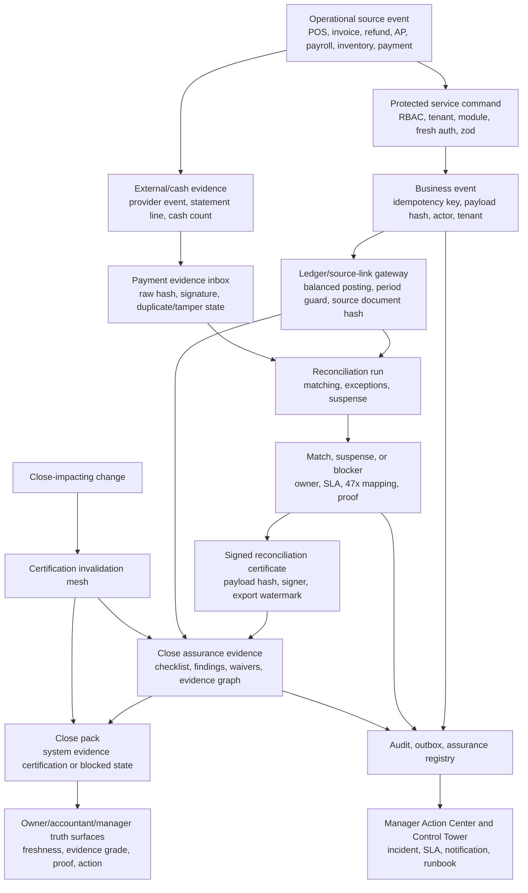

# AqStoqFlow Close Assurance And Payment Reconciliation Truth-System Synthesis And Skill Suite

Date: 2026-06-23  
Mode: report synthesis and execution planning only. No application code was modified.

## Executive Verdict

AqStoqFlow/Kontava is ready for a focused close-assurance and payment-reconciliation hardening program. The current reports show that the platform already has the right backbone: provider evidence, statement evidence, payment transactions, reconciliation runs, match records, suspense, payment exceptions, signed reconciliation certificates, close assurance runs, close findings, close evidence, close pack exports, ledger posting batches, source links, business events, proof trails, workflow assurance checks, and snapshot/action-center foundations.

Verdict: `GO_WITH_ENFORCEMENT_GATES`.

The strongest path is not a rebuild. The system should be hardened into a single source of truth SMB financial engine by tightening the last mile:

- make payment reconciliation a daily cash-truth operating loop;
- make close assurance the period-end financial trust gate;
- make every financial number evidence-graded, freshness-aware, proof-linked, and action-linked;
- add universal close certification invalidation for every close-impacting change;
- keep external/statutory/provider certification claims blocked until real authority/provider readiness exists;
- promote assurance checks from observe mode to enforce mode only by tenant ring, seeded failure fixture, browser smoke, rollback plan, and release-gate evidence.

## Report Inventory

| Source | Functional area | Main proposals | Strategic importance | Readiness |
| --- | --- | --- | --- | --- |
| `moat proposals/KONTAVA_CLOSE_ASSURANCE_PAYMENT_RECON_TRUTH_SYSTEM_ROADMAP_PROMPT_2026-06-23.md` | Prompt / roadmap brief | Define close assurance and payment reconciliation as a unified truth system; require phases, actions, UX, prerequisites, and gates. | High | Conceptual source prompt |
| `what-next/AQSTOQFLOW_CLOSE_ASSURANCE_PAYMENT_RECON_TRUTH_SYSTEM_REFINEMENT_REPORT_2026-06-23.md` | Close assurance and payment reconciliation refinement | Preserve existing evidence architecture, align permissions, productize proof/freshness, add invalidation hooks, keep certification language honest. | Critical | Implementation-ready with gates |
| `what-next/AQSTOQFLOW_CLOSE_PAYMENT_TRUTH_SYSTEM_EXECUTION_ROADMAP_2026-06-23.md` | Execution roadmap | Defines phased program from readiness audit through payment truth, close hardening, incidents, trust packs, BI gates, and enforce pilots. | Critical | Implementation-ready roadmap |
| `what-next/AQSTOQFLOW_ENTERPRISE_SMB_OS_ARCHITECTURE_INSPECTION_REPORT_2026-06-23.md` | Enterprise architecture | Declares operating truth contract, close invalidation mesh, certified read models, external readiness, assurance daily work, release gates. | Critical | Architecture-ready; implementation slices defined |

### Supporting Sources Referenced By The Current Reports

| Supporting source | Why it matters |
| --- | --- |
| `what-next/AQSTOQFLOW_CLOSE_ASSURANCE_READINESS_AUDIT_2026-06-16.md` | Earlier close-readiness audit foundation. |
| `what-next/AQSTOQFLOW_CLOSE_ASSURANCE_CENTER_IMPLEMENTATION_REPORT_2026-06-16.md` | Existing close center implementation evidence. |
| `what-next/PAYMENT_RECONCILIATION_WORKBENCH_BLUEPRINT_2026-06-14.md` | Payment workbench architecture source. |
| `what-next/PAYMENT_RECON_READINESS_AUDIT_2026-06-14.md` | Payment reconciliation readiness baseline. |
| `what-next/PAYMENT_RECON_WORKBENCH_BUILD_LAUNCH_REPORT_2026-06-14.md` | Payment workbench build evidence. |
| `what-next/AQSTOQFLOW_PRIORITY_010_CERTIFICATION_ASSURANCE_HARDENER_REPORT_2026-06-17.md` | Certification assurance hardening evidence. |
| `what-next/WORKFLOW_ASSURANCE_PAYMENT_RECON_RELEASE_GATE_STATIC_REPORT_2026-06-21.md` | Static workflow assurance evidence for payment reconciliation. |
| `what-next/KONTAVA_PAYMENT_RECONCILIATION_ASSURANCE_RUN_REPORT_2026-06-21.md` | Payment assurance run evidence and candidate gates. |
| `innovation/KONTAVA_DASHBOARD_EXPERIENCE_EXECUTION_BLUEPRINT_2026-06-22.md` | UI and BI proof-surface recommendations, including cash truth and close readiness journey. |

## Proposal Classification Matrix

| Category | Current problem | Proposed hardening | Business risk if ignored | Technical approach | Required tests | Release gate |
| --- | --- | --- | --- | --- | --- | --- |
| Ledger and accounting truth | Financial facts can only be trusted if every economic event links to ledger/source evidence. | Declare and enforce an operating truth contract: protected command, validated input, business event, ledger/source link, audit/evidence, snapshot/close invalidation. | Reports drift from books; close packs become decorative. | Service-owned commands, ledger-first gateway, source links, event payload hashes, immutable audit. | Idempotency, balance, source-link, period-lock, reversal tests. | Ledger/event focused tests plus `prisma:validate`, typecheck, policy gates. |
| Payment evidence ingestion | Provider/bank/cash truth is not production-complete until external channels, freshness, outage, credential, and replay controls are operational. | Add provider readiness records, health states, statement freshness, callback lag, duplicate/tamper handling, and ingestion runbooks. | Sales and cash may disagree without visible proof. | ProviderAccountHealth read model, import job queue, idempotency keys, payload/file hashes, replay protection. | Forged, replay, duplicate, tampered, stale, outage, high-volume import fixtures. | Payment ingestion tests and Workflow Assurance report. |
| Matching and reconciliation | Reconciliation is strong but needs manager-visible trust state and run dedupe. | Add trust banner, proof links, run dedupe, provider health cards, certificate drift checks. | Users cannot tell if cash is trusted, partial, or blocked. | Service read models for evidence counts, signed runs, suspense, blockers, freshness. | RBAC read/run split, concurrency/dedupe, certificate hash drift tests. | Payment reconciliation service tests plus browser smoke. |
| Suspense handling | Suspense exists but must become impossible to hide or treat as generic variance. | Keep every unmatched franc itemized with owner, SLA, evidence, 47x mapping, resolution action, close-blocking status. | Unknown money disappears into revenue/expense/variance. | Suspense workflow actions, Action Center routing, SLA escalation, ledger-gateway posting only. | Suspense lifecycle, owner/SLA, anti-self-approval, write-off approval, sum-to-47x tests. | Reconciliation and close preflight gates. |
| Close task orchestration | Close assurance is strong but needs universal invalidation and daily operator workflow. | Build close readiness timeline, finding routing, waiver workflow, invalidation graph, stale-evidence UX. | Close pack can look certified after material changes. | `recordCloseCertificationInvalidation` from every close-impacting domain. | Statement import, sign/export, suspense posting, ledger reversal, inventory valuation invalidation fixtures. | Close pack service tests and stale-source scan. |
| Period lock and certification | Certification must remain internal system evidence unless external legal/provider readiness is real. | Preserve statutory disclaimer, expert-review blockers, country-pack/adapter readiness gates. | Overclaiming certification damages trust and legal posture. | Distinguish operational, reconciled, certified-system-evidence, statutory-certified states. | Copy/UI smoke, export watermark/hash tests, country-pack blocker tests. | Compliance/oracle review before statutory claims. |
| Audit trail and provenance | Proof primitives exist but proof subject coverage is selective. | Add direct proof/drill-through for provider events, statement imports, suspense items, exceptions, close evidence, close pack exports. | Users cannot defend or explain numbers under audit. | Proof subject registry, evidence graph, redaction policy, source hash lists. | Proof route, redaction, source-count, evidence-hash tests. | Data-trust certificate T3/T4 gates. |
| Financial report trust | Reports and dashboards must not blend operational/estimated values with posted truth. | Certified DTOs must carry source tables, source count, generated-at, as-of, evidence grade, freshness, period status, proof route. | Dashboards lie even when backend is correct. | Certified read models separated from operational DTOs. | No mock data, no `?? 0` financial fallback, source provenance tests. | Data trust certifier T3 minimum for financial surfaces. |
| Dashboard/read-model integrity | Manager-facing surfaces need visible trust states, not buried service correctness. | Add payment trust banner, close readiness journey, why-blocked drawer, stale banners, proof links, action links. | Users ignore blockers or cannot act on them. | Components consume service-owned DTOs; no direct Prisma; role-aware cache keys. | Component tests, browser smoke, service-boundary ratchet. | Browser smoke for `/dashboard/finance/reconciliation` and `/dashboard/accounting/close`. |
| Compliance and fiscal linkage | Fiscal/country/provider readiness is intentionally incomplete. | Keep external readiness records, adapter conformance, credential lifecycle, outage handling, expert review. | Platform makes unsafe statutory or provider claims. | Adapter registry, readiness status, country-pack version pinning, certification outbox. | Adapter sandbox tests, outage/retry tests, country-pack blocker tests. | Compliance tests plus expert/legal review for statutory production. |
| Tenant isolation and RBAC | Reconciliation read currently overuses run permission; module entitlements remain observe mode. | Split read/run/import/match/override/suspense/sign/export; add module entitlement telemetry then ring enforcement. | Users either overpowered or blocked from safe evidence inspection. | `payments.reconciliation.read` for view; critical actions keep elevated permissions and fresh auth. | RBAC matrix tests; module entitlement denial fixture. | RBAC and module-control release gate. |
| Error handling and rollback safety | Recovery lanes are not productized. | Add runbooks for provider outage, replayed callback, duplicate file, certificate drift, stale close pack, suspense rollback, failed close certification. | Support improvises during financial trust incidents. | Typed errors, correlation IDs, retries, Action Center incidents, rollback/waiver paths. | Duplicate replay, rollback, retry exhaustion, typed error mapping tests. | Error-boundary gate and incident workflow tests. |
| Release gates and production readiness | Static readiness passes, but enforce mode must not be broad. | Per-check, per-tenant ring pilots with seeded failure, proof/action route, owner, rollback, browser smoke. | Enforce mode blocks valid operations or misses bad ones. | Assurance registry gates, scheduler policy, release report. | Seeded failures for open suspense, unsigned run, stale certificate, provider outage. | Workflow Assurance release gate plus pilot evidence. |
| BI and executive intelligence | Snapshots exist but need freshness SLA and trust-gated UX. | Build owner/manager trust cockpit: trusted, partial, blocked, action required. | BI becomes pretty but not trusted. | PaymentTruthSnapshot, CloseReadinessSnapshot, Manager Action Center, Owner War Room. | Snapshot provenance, stale-state, role redaction, action routing tests. | BI data-trust certificate and browser smoke. |

## Target Financial Truth Architecture

### Source-Of-Truth Hierarchy

1. Business event: what happened and who/what caused it.
2. Ledger posting/source link: accounting effect and source-document proof.
3. Payment evidence: external/cash evidence, statement lines, provider events, cash counts.
4. Reconciliation result: match, exception, or suspense with sign-off.
5. Close assurance: period-level proof, findings, waivers, evidence graph.
6. Certified system evidence pack: exportable internal evidence, not statutory certification unless external adapters and expert validation exist.
7. BI/read models: derived operational surfaces that must declare evidence grade, freshness, source count, and proof route.

### Non-Negotiable Invariants

- No economic event bypasses the service-owned command and ledger/event pipeline.
- No payment is trusted without external/cash evidence or a typed suspense/exception path.
- No reconciliation run is signed with open exceptions, open suspense, missing external evidence, or unposted suspense.
- No close pack is certified with unavailable evidence, open high/critical findings, unsigned reconciliation evidence, stale inventory valuation, failed business events, or missing ledger source links.
- No certified close pack remains trusted after material payment, ledger, inventory, payroll, AP, compliance, fiscal, country-pack, or permission changes.
- No financial dashboard number renders as trusted without source tables, source count, as-of/freshness, evidence grade, period status, and proof/action route.

## Complete Codex Skill Suite Proposal

### Orchestrator

| Skill | Purpose | Inputs | Responsibilities | Gates |
| --- | --- | --- | --- | --- |
| `aqstoqflow-financial-truth-system-orchestrator` | Coordinate the full close/payment truth-system implementation sequence. | Current reports, roadmap, schema, services, actions, UI, tests, release gates. | Run phases in order, prevent skipped gates, sequence specialist skills, save run reports, stop on blockers. | Every phase must pass its focused tests and release gate before the next phase. |

### Specialist Skills

| Order | Skill name | Purpose | Inspect | Implementation responsibilities | Non-negotiable controls | Tests/gates |
| ---: | --- | --- | --- | --- | --- | --- |
| 1 | `aqstoqflow-close-payment-readiness-auditor` | Freeze current foundations and gaps before code changes. | June 23 reports, schema, close/payment services, actions, UI, tests, release scripts. | Inventory reports, map source truth, identify current blockers, produce baseline. | No implementation in audit mode; no certification overclaim. | Static scans, `workflow-assurance-release-gate --mode report`, focused test list. |
| 2 | `aqstoqflow-reconciliation-permission-aligner` | Correct read/run/sign/export permission split. | `config/sidebar.ts`, reconciliation actions/workbench, permission catalog, RBAC tests. | Move read-only surfaces to `payments.reconciliation.read`; preserve elevated mutation/sign/export permissions. | UI visibility is not authorization; fresh auth remains for critical actions. | RBAC matrix, sidebar smoke, action permission tests. |
| 3 | `aqstoqflow-payment-evidence-hardener` | Harden provider events, statement imports, evidence health, and ingestion readiness. | `services/payments/**`, adapters, statement import, provider event tests. | Add provider health read model, freshness states, duplicate/tamper fixtures, outage/replay runbooks. | Webhooks/imports never post ledger directly; raw evidence immutable and hashed. | Forged, replay, duplicate, stale, outage, high-volume import tests. |
| 4 | `aqstoqflow-matching-suspense-exception-builder` | Make matching, suspense, exceptions, and SLA routing operational. | `services/reconciliation/**`, Action Center, notifications, suspense workflows. | Add itemized suspense controls, owner/SLA/escalation routing, run dedupe, proof links. | Every unmatched franc becomes itemized suspense; high-risk manual match uses maker-checker. | Suspense lifecycle, run dedupe, SoD, sum-to-47x, notification dedupe tests. |
| 5 | `aqstoqflow-close-invalidation-mesh-builder` | Wire universal close certification invalidation. | close pack service, payments, ledger, inventory, payroll, AP, compliance, RBAC/country-pack services. | Add invalidation hooks and typed source catalog; stale-state evidence and audit. | Close-impacting changes invalidate or block certified evidence. | Cross-domain invalidation fixtures; stale close pack tests. |
| 6 | `aqstoqflow-ledger-provenance-certifier` | Certify ledger/source-link and business-event provenance for truth surfaces. | accounting source links, posting batches, business events, reports, exports. | Enforce event->ledger->source link proof, source hashes, no operational totals as statutory truth. | Financial truth reads posted ledger/event projections or declares operational/estimated. | Data-trust T3/T4 checks, no-mock/no-estimate financial tests. |
| 7 | `aqstoqflow-accounting-export-trust-auditor` | Harden accounting exports and report auditability. | report/export services, close pack exports, accounting reports, BI read models. | Add export hashes, watermarks, row counts, source counts, limitations, audit events. | Statutory exports require T4 plus domain/legal approval. | Export hash/redaction/watermark/provenance tests. |
| 8 | `aqstoqflow-fiscal-compliance-linkage-hardener` | Connect fiscal documents, compliance submissions, country packs, and close blockers. | compliance services, country packs, fiscal docs, certification outbox, close services. | Add readiness states, adapter conformance, expert-review blockers, invalidation hooks. | No authority/statutory certification claim without real adapter and expert validation. | Compliance adapter, country-pack, certification blocker tests. |
| 9 | `aqstoqflow-close-pack-evidence-builder` | Build accountant trust pack and evidence graph. | close assurance service, close pack service, proof trail, redaction policy, accountant review. | Evidence hash list, source count, blocker history, review workflow, redacted exports. | Raw provider payloads, credentials, and sensitive internals are redacted by default. | Export redaction, proof route, review workflow tests. |
| 10 | `aqstoqflow-financial-bi-trust-dashboard-builder` | Build trusted/partial/blocked BI surfaces for owners and managers. | snapshots, Manager Action Center, Owner War Room, finance/close dashboards. | Payment trust banner, close readiness journey, why-blocked drawer, proof/action links. | Every KPI declares evidence grade, freshness, proof route, and next action. | Snapshot provenance, browser smoke, BI data-trust gates. |
| 11 | `aqstoqflow-tenant-rbac-financial-controls-gate` | Harden tenant/RBAC/module entitlement controls for close/payment. | `protect`, permission catalog, module entitlements, sensitive actions, route/actions. | Ring-based module enforcement, fresh auth, anti-self-approval, redaction permissions. | Permission and module entitlement are both server-side; no self-approval for sensitive actions. | RBAC, module denial, fresh-auth, SoD tests. |
| 12 | `aqstoqflow-financial-release-ratchet` | Make release gates enforce trust-system regressions. | scripts, package commands, boundary reports, workflow assurance, browser smoke. | Add zero-regression gates, seeded failures, release report, rollback requirements. | No enforce-mode check without seeded failure, owner, proof route, action route, rollback. | `verify:repo`, boundary gates, workflow assurance, seeded failure tests. |

## Step-By-Step Implementation Program

### Phase 1: Source Discovery And Baseline Audit

- Objective: freeze the truth-system map and current readiness.
- Likely files/modules: `what-next/**`, `moat proposals/**`, `prisma/schema.prisma`, close/payment services, release scripts.
- Tasks: inventory source reports; map payment and close data flows; list existing tests and gates; record current observe/enforce posture.
- Tests: static report command, focused source scans.
- Risks: implementing UI before trust gaps are explicit.
- Definition of done: baseline report with blockers, ready foundations, and phase gates.
- Skills: auditor, orchestrator, data trust certifier.

### Phase 2: Data Model And Service-Boundary Hardening

- Objective: preserve zero service-boundary findings and add missing typed truth models/read models.
- Likely files/modules: `services/payments/**`, `services/reconciliation/**`, `services/accounting/**`, `services/evidence/**`, `prisma/schema.prisma`.
- Tasks: add typed invalidation source catalog, provider health read model, truth dependency graph, certified DTO contracts.
- Tests: Prisma validate, service-boundary ratchet, typecheck, provenance tests.
- Risks: accidental Prisma/action bypass; overly broad schema changes.
- Definition of done: service-owned DTOs with evidence grade/freshness/proof metadata.
- Skills: payment evidence hardener, close invalidation mesh builder, ledger provenance certifier.

### Phase 3: Payment Evidence And Matching Controls

- Objective: make payment reconciliation a daily cash-control loop.
- Likely files/modules: provider event service, statement import, reconciliation run, certification, suspense workflow, workbench actions/UI.
- Tasks: read permission alignment, provider health cards, trust banner, run dedupe, proof links, suspense SLA routing.
- Tests: RBAC split, duplicate evidence, partial/over/under payment, run dedupe, suspense lifecycle.
- Risks: over-permissioning read users or under-permissioning finance visibility.
- Definition of done: read-only users can inspect evidence; only elevated users can run/sign/export/post.
- Skills: permission aligner, payment evidence hardener, matching/suspense builder.

### Phase 4: Ledger And Financial Provenance Guarantees

- Objective: guarantee financial truth traces to event, ledger, source document, and evidence.
- Likely files/modules: posting gateway, accounting source links, business events, report/export services.
- Tasks: require source hashes, event IDs, row counts, correlation IDs, posted/estimated distinction, no mock/zero fallbacks.
- Tests: ledger posting idempotency, rollback/fault-injection, source-link proof, no-mock financial path scan.
- Risks: dashboards showing operational numbers as trusted accounting truth.
- Definition of done: certified read models meet T3/T4 data-trust requirements.
- Skills: ledger provenance certifier, accounting export trust auditor, ohada compliance oracle.

### Phase 5: Close Assurance Workflow Implementation

- Objective: make close readiness live, stale-aware, and evidence-driven.
- Likely files/modules: close assurance service, close pack service, proof trail, CloseAssuranceCenter, close pages.
- Tasks: close readiness timeline, why-blocked drawer, evidence hash list, invalidation hooks from first-ring domains.
- Tests: period close lock, close invalidation after statement import/sign/export/suspense posting, waiver SoD, certification eligibility.
- Risks: stale certified packs and operator confusion.
- Definition of done: close pack cannot remain trusted after first-ring close-impacting changes.
- Skills: close invalidation mesh builder, close pack evidence builder.

### Phase 6: Certification, Audit Pack, And Fiscal Linkage

- Objective: produce honest, redacted, watermarked accountant packs.
- Likely files/modules: close pack export, compliance/fiscal document services, country packs, proof trail, redaction policy.
- Tasks: system-evidence disclaimers, fiscal linkage, country-pack readiness, expert-review blockers, accountant review workflow.
- Tests: export auditability, redaction, fiscal-document eligibility, authority-adapter blocker, hash consistency.
- Risks: statutory overclaim or sensitive evidence leakage.
- Definition of done: accountant pack is useful and honest; statutory claims remain blocked without real validation.
- Skills: fiscal compliance linkage hardener, accounting export trust auditor, close pack evidence builder.

### Phase 7: BI Dashboards And Management Intelligence

- Objective: expose trusted/partial/blocked financial truth to owners, finance managers, accountants, and branch managers.
- Likely files/modules: payment truth snapshot, close readiness snapshot, Manager Action Center, Owner War Room, finance/close dashboards.
- Tasks: payment trust banner, close readiness journey, provider health, action links, proof drawer, stale-state UX.
- Tests: dashboard provenance, role redaction, stale-state rendering, browser smoke.
- Risks: correct backend remains invisible or unactionable.
- Definition of done: every major number has evidence grade, freshness, proof route, and next action.
- Skills: financial BI trust dashboard builder, tenant/RBAC financial controls gate.

### Phase 8: Release Gates, Ratchets, And Production Readiness

- Objective: turn the program into repeatable release discipline.
- Likely files/modules: release scripts, workflow assurance registry, package commands, browser tests, runbooks.
- Tasks: add seeded failure fixtures, pilot one enforce-mode check, require release report, keep global observe-mode until proven.
- Tests: open suspense, unsigned run, stale certificate, provider outage, stale close evidence, browser smoke.
- Risks: premature broad enforcement or weak release confidence.
- Definition of done: one controlled enforce pilot passes with rollback and no broad production enforcement.
- Skills: financial release ratchet, orchestrator.

## Enterprise Validation Matrix

| Validation scenario | Required behavior | Evidence |
| --- | --- | --- |
| Duplicate payment evidence | Identical replay dedupes; same key different payload blocks, audits, alerts. | Provider/statement duplicate tests. |
| Partial payment matching | Partial match is explicit, traceable, and not marked fully reconciled. | Match rule tests and UI state. |
| Overpayment / underpayment | Difference becomes exception or suspense, with owner/SLA. | Amount mismatch fixtures. |
| Suspense lifecycle | Itemized suspense links evidence, 47x account, owner, SLA, resolution event. | Suspense workflow tests. |
| Reconciliation rollback | Corrections use compensating events, not edits/deletes of signed facts. | Reconciliation correction tests. |
| Ledger posting idempotency | Replay creates one posting; hash conflict blocks. | Ledger/event idempotency tests. |
| Period close lock | Closed/locked periods reject postings and finalization. | Period service tests. |
| Certification eligibility | No sign/export/certify with open exceptions, open suspense, missing evidence, stale source. | Certification service tests. |
| Accounting export auditability | Export has hash, row count, source count, actor, tenant, timestamp, limitations. | Export tests. |
| Dashboard/report traceability | KPI includes evidence grade, source tables, freshness, proof route. | Data-trust tests. |
| Tenant isolation | Queries, caches, exports, jobs are tenant-scoped and permission-aware. | RBAC/tenant tests. |
| RBAC enforcement | Read/run/sign/export/post are separate; critical actions require fresh auth. | Permission matrix tests. |
| Error handling | Typed safe errors with correlation IDs; internals never leak. | Error-boundary gate. |
| Release regression | Boundary, Prisma, typecheck, lint, workflow assurance, browser smoke pass. | Financial release ratchet. |

## Prioritized Backlog

### P0: Safest First Slice

1. Change Finance > Reconciliation sidebar permission to `payments.reconciliation.read`.
2. Change reconciliation workbench read action to `payments.reconciliation.read`.
3. Add RBAC tests proving read-only users cannot run, sign, export, match, override, or post suspense.
4. Add compact payment trust banner.
5. Add system-evidence disclaimer around close/reconciliation certificates.
6. Add proof links on reconciliation runs, suspense rows, exception rows, close findings, evidence rows, and close pack exports.
7. Add why-blocked drawer for reconciliation and close surfaces.
8. Add close invalidation from statement import, reconciliation sign/export, and suspense posting.
9. Add browser smoke for `/dashboard/finance/reconciliation`.
10. Add browser smoke for `/dashboard/accounting/close`.

### P1: Platform Hardening

1. Provider account health read model.
2. Typed close invalidation source catalog.
3. Reconciliation run dedupe.
4. Certificate hash drift recomputation before export.
5. Statement import job queue and chunking.
6. Manager Action Center routing for suspense SLA, unsigned run, stale evidence, failed import, certificate drift.
7. Export redaction and accountant pack evidence hash list.

### P2: Strategic Moat

1. Universal close invalidation mesh across payments, ledger, inventory, payroll, AP, compliance, country packs, and permissions.
2. Ring-based enforce pilot for one payment reconciliation check.
3. External rail readiness records and provider conformance.
4. Settlement/bank balance tie-out to treasury ledger plus itemized suspense.
5. Owner trust briefing and monthly accountant pack cadence.

## Immediate Next Actions For Codex

Recommended next implementation slice: `payment-close-trust-surface-hardening`.

Execution order:

1. Load `payment-reconciliation-moat`, `ledger-first-business-events`, `ohada-compliance-oracle`, `stockflow-data-trust-certifier`, `enterprise-error-handling`, and RBAC guidance.
2. Patch permission alignment for reconciliation read surfaces.
3. Add focused RBAC tests for read/run/sign/export/post separation.
4. Add first trust banner DTO and component wiring from existing reconciliation service data.
5. Add first-ring close invalidation hook for statement import.
6. Run focused payment/reconciliation/close tests, boundary gates, Prisma validate, typecheck, lint.
7. Save a run report with files changed, tests, residual blockers, and whether enforcement remains observe-mode.

## Observe-Mode Boundaries

Keep these in observe mode until explicitly proven:

- broad Workflow Assurance enforcement across tenants;
- module entitlement hard-deny for close/payment;
- provider/bank/statutory certification claims;
- BI trust blocking on dashboards;
- any enforcement check without seeded failure, owner, proof route, corrective route, notification route, rollback path, and browser smoke.

## Final Recommendation

Build the truth system in narrow slices, starting with permission alignment, trust visibility, proof links, and first-ring close invalidation. That path produces immediate user trust without unsafe enforcement or broad schema churn. Once the platform proves that blockers are visible, actionable, tested, and reversible, graduate one payment reconciliation check into a ring-based enforce pilot. Only after that should broader close/payment enforcement and external-provider claims be considered.
