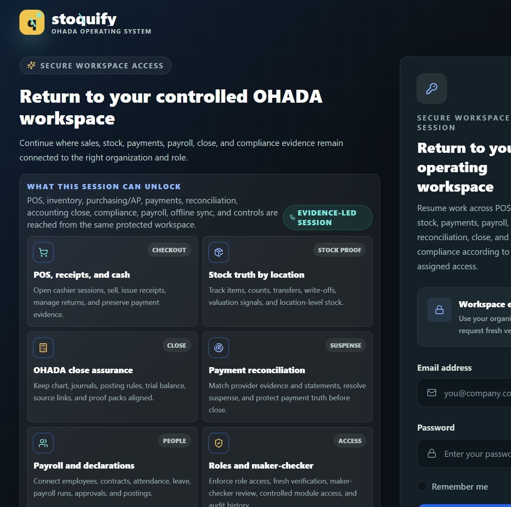

# Stoquify Purchase Page Enterprise-Grade Readiness Audit

**Audit date:** 2026-08-17  
**Domain:** Purchasing and accounts payable  
**Mode:** Evidence-led audit and proposal only; no production code, schema, configuration, dependency, or data changes  
**Overall maturity:** **Functional SMB** — backed by several enterprise-capable control seams, but exposed through a fragmented and partly nonfunctional purchase experience  
**Release/certification status:** This report is not legal, tax, accounting, security, accessibility, privacy, or release certification.

## 1. Executive assessment

Stoquify already contains substantive purchasing capabilities: tenant-scoped server actions, separate permissions for create/update/approve/cancel/receive, maker-checker approval, atomic goods-receipt and inventory posting, an analytics read model, and adjacent AP fraud-control gates. Those are stronger than the user-facing purchase experience.

The purchase surface is not yet professional or enterprise-capable as a coherent product. The advertised entry route, `/[locale]/dashboard/purchases`, is a copied detail page that requires an `id` its route cannot supply and intentionally returns `notFound()` when none exists. The usable register lives in a second route family, `/[locale]/dashboard/purchase-orders`, while a third set of purchase/AP pages remains under `/dashboard/purchases/*`. On the register and detail screens, hard-coded USD and English conflict with organization-level XAF and bilingual product behavior; action visibility is status-driven rather than permission-aware; at least two advertised actions cannot complete as presented; lifecycle evidence is incomplete; and the list performs unbounded, duplicated, over-broad reads.

This is therefore a **functional SMB experience**, not an enterprise-ready purchase workbench. The backend/control foundation makes remediation realistic without a wholesale rewrite, but visual polish alone would leave the highest risks intact.

### Five principal obstacles

1. **The primary purchase entry is broken.** Authorized navigation to `/dashboard/purchases` reaches a route that calls `notFound()` because no order ID can exist in its route parameters.
2. **Route and capability ownership is fragmented.** Overview, register, detail, analytics, AP, and suppliers are split across overlapping route families, including a shadow detail page with inert hash-link actions.
3. **Displayed financial truth is unreliable.** The register and legacy detail force USD although the organization model defaults to XAF and the analytics service already resolves organization currency.
4. **The UI promises actions that authority or lifecycle rules do not support.** Buttons are exposed by status rather than permission; the receive deep link is ignored; and “Force Complete” requests a transition the canonical service rejects.
5. **The operational register does not scale or evidence work adequately.** It uses unbounded full-relation reads, duplicated client fetching, client-only pagination/export, minimal filters, and a synthetic history that omits important actors, reasons, and transitions.

## 2. Scope, canonical surface, and repository truth

### Route ownership conclusion

| Surface | Repository truth | Assessment |
| --- | --- | --- |
| `/[locale]/dashboard/purchases` | Sidebar “Overview” and dashboard quick actions point here; implementation is a detail page without a dynamic segment and calls `notFound()` when `id` is absent. | Intended domain entry, currently unusable. |
| `/[locale]/dashboard/purchase-orders` | Loads the purchase-order register, summary cards, and `PurchaseOrderManagement`. | Current functional order register. |
| `/[locale]/dashboard/purchase-orders/[id]` | Renders `ModernPurchaseOrderDetailPage`. | Current functional detail route. |
| `/[locale]/dashboard/purchases/[id]` | Duplicate detail implementation with `#edit`, `#send-mail`, `#pdf`, `#receive`, and `#convert` links. | Shadow/legacy route; should not remain independently owned. |
| `/[locale]/dashboard/purchases/payables` and `/history` | Modern AP workbench/history, covered by recent remediation evidence. | Adjacent downstream capability, not a substitute for a working purchase overview. |
| `/[locale]/dashboard/purchases/suppliers` | Modern supplier surface, covered by recent remediation evidence. | Adjacent master-data capability. |

The lowest-risk target is to keep `/dashboard/purchase-orders` as the canonical order register/detail family, turn `/dashboard/purchases` into a real purchasing command-center overview or a deterministic redirect, and retire `/dashboard/purchases/[id]` through a compatibility redirect. A wholesale domain route rename is not required.

### Capability classification

- **Implemented and effective:** organization-scoped server authorization; maker-checker approval; atomic goods receipt and inventory posting; soft-delete/archive service behavior; analytics data-trust measures; adjacent AP fraud-control seams.
- **Implemented but inconsistent:** current register and detail routes; design-system use; currency formatting; bilingual behavior; module/permission navigation.
- **Partial or misleading:** lifecycle history, export control, row selection, delete wording, refresh feedback, metric context.
- **Missing:** server pagination/filter contract, saved views, complete lifecycle evidence, stale-write conflict handling, a coherent purchase overview, permission-aware action projection.
- **Technically present but unusable:** root purchase overview, legacy detail hash actions, receive query deep link, partial-receipt “Force Complete.”
- **Intentionally deferred/observe-mode:** purchasing module entitlement enforcement appears to remain in an observe/pilot posture; this must be confirmed against the commercialization rollout before making it a hard release gate.
- **Blocked by missing contract:** complete actor/reason/timestamp history and concurrency conflict recovery require service/data contracts, not just UI work.

## 3. Evidence inventory

### Runtime evidence

- A server was already listening on `localhost:3000`; attempting a second `npm run dev` failed with `EADDRINUSE`, so the existing instance was used.
- An unauthenticated request to `/en/dashboard/purchases` returned HTTP `307` to `/en/login?callbackUrl=%2Fen%2Fdashboard%2Fpurchases`, confirming the protected boundary.
- The in-app browser rendered the secure login page and a full-page 1264 × 1254 screenshot was captured at `evidence/unauthenticated-login-boundary-desktop.png`.
- Authenticated purchase-page inspection was **blocked** because no browser session existed and entering the repository-defined local test credentials required user confirmation. No credential was entered, no database was seeded, and no mutation was exercised.
- Consequently, desktop/tablet/mobile purchase-page rendering, keyboard traversal, interactive workflow execution, visual regression, and computed accessibility checks remain **unverified** in this run. Source evidence and focused tests support the confirmed code-level findings; visual judgments are deliberately conservative.



### Principal files inspected

- `app/[locale]/(dashboard)/dashboard/purchases/page.tsx`
- `app/[locale]/(dashboard)/dashboard/purchases/[id]/page.tsx`
- `app/[locale]/(dashboard)/dashboard/purchases/purchases-route-data-access.ts`
- `app/[locale]/(dashboard)/dashboard/purchase-orders/page.tsx`
- `app/[locale]/(dashboard)/dashboard/purchase-orders/[id]/page.tsx`
- `app/[locale]/(dashboard)/dashboard/purchase-orders/new/page.tsx`
- `app/[locale]/(dashboard)/dashboard/purchase-orders/purchase-orders-route-data-access.ts`
- `components/ui/groups/purchase-orders/PurchaseOrderManagement.tsx`
- `components/purchase-orders/ModernPurchaseOrderDetailPage.tsx`
- `components/purchase-orders/ModernCreatePurchaseOrderForm.tsx`
- `actions/purchaseOrderWorkflow/purchaseOrderSystemAction.ts`
- `services/purchase-order/purchase-order.service.ts`
- `hooks/useRecentPurchaseOrderQueries.ts`
- `config/sidebar.ts`, `config/permissions.ts`, `lib/formatCurrency.ts`, and `prisma/schema.prisma`
- Focused route, component, service, analytics, and policy-gate tests listed in the evidence ledger.

### Architecture graph evidence

The repository graphs confirm that the fragmentation is architectural rather than merely visual:

- `graph_app.json`: functional purchase-order register community **143**; canonical detail community **225**; root `/purchases` community **46**; shadow `/purchases/[id]` community **48**; AP workbench/history communities **145/146**.
- `graph_components.json`: `PurchaseOrderManagement.tsx` community **58**; `ModernPurchaseOrderDetailPage.tsx` community **135**; AP workbench community **25**; AP history community **7**.
- `graph_actions.json`: purchase-order system actions community **2**; purchase summary/goods-receipt service community **68**; AP action community **26**.
- `graph_hooks.json`: recent purchase-order queries and `usePurchaseOrderActions()` community **0**; the graph report identifies `usePurchaseOrderActions()` as a high-connectivity node.

### Relevant prior artifacts

- `what-next/purchase-order-analytics-modernization-2026-08-14.md`: confirms a localized, tenant-scoped, read-only analytics route with organization currency and evidence coverage.
- `what-next/ui-ux/STOQUIFY_PURCHASING_AP_SUPPLIER_PRESENTATION_REMEDIATION_2026-08-10.md`: confirms recent authenticated desktop/tablet/mobile work on AP and supplier surfaces; it does not cover the broken root purchase overview or the order register.
- `what-next/purchasing-ap-consolidation-readiness.md` and copied dated evidence: 11/11 static control seams ready, with an explicit statement that this is not statutory certification.
- `what-next/ap-fraud-control-readiness.md` and copied dated evidence: 9/9 checks ready for supplier bank/payment control boundaries.
- `docs/UI/UX/AQSTOQFLOW_UI_ROUTE_MATURITY_MATRIX_2026-06-26.md`: authenticated route certification requires real session/storage evidence; the purchase register is not presently certified by that matrix.

## 4. Findings register

### PUR-001 — Primary purchase overview always resolves to not-found

| Field | Detail |
| --- | --- |
| Dimension | B — information architecture; F — state completeness; K — product credibility |
| Evidence | `purchases/page.tsx:186-214` reads optional `id` from a non-dynamic route and calls `notFound()` when absent. `purchases/__tests__/page.test.tsx:230-233` explicitly expects `NEXT_NOT_FOUND` for the “legacy overview route.” Sidebar `config/sidebar.ts:265` and dashboard entry points still navigate here. |
| Affected users/role | Every authorized purchasing user entering via Overview or dashboard quick actions |
| Workflow | Enter purchasing, identify work, start or resume a purchase order |
| Severity | **Critical** |
| Consequence | A primary module entry becomes a dead end; the green test suite protects the wrong product behavior. |
| Probable root cause | A detail page was copied into the overview route during route migration without an explicit ownership/redirect decision. |
| Recommendation | Choose and encode one route contract: implement a real purchasing overview at `/dashboard/purchases` or redirect it to `/dashboard/purchase-orders`; replace the not-found test with an authorized-route success contract. |
| Dependencies | Route catalog, sidebar/dashboard links, locale redirect helper, compatibility analytics |
| Effort | **M** |
| Confidence | **Confirmed** |

### PUR-002 — Parallel route families create shadow pages and inert actions

| Field | Detail |
| --- | --- |
| Dimension | A, B, C, K |
| Evidence | `purchases/page.tsx:69-93` and `purchases/[id]/page.tsx:67-91` expose `#edit`, `#send-mail`, `#pdf`, `#receive`, and `#convert` links. The maintained detail lives at `/purchase-orders/[id]` and uses `ModernPurchaseOrderDetailPage`. Architecture graph communities 46/48 and 143/225 show parallel ownership. |
| Affected users/role | Buyers, approvers, receivers, support teams |
| Workflow | View/edit/send/print/receive/convert purchase order |
| Severity | **High** |
| Consequence | Different entry points imply different capabilities; users encounter ghost actions and support cannot describe one canonical journey. |
| Probable root cause | Incremental modernization without deprecating legacy routes. |
| Recommendation | Declare `/purchase-orders/*` canonical for orders; redirect the shadow detail while preserving locale and query context; place AP/supplier links in a real domain overview. |
| Dependencies | Routing, telemetry, bookmarks, tests, support documentation |
| Effort | **M** |
| Confidence | **Confirmed** |

### PUR-003 — Purchase values are rendered in a hard-coded, potentially wrong currency

| Field | Detail |
| --- | --- |
| Dimension | C, H, I, K |
| Evidence | Register `purchase-orders/page.tsx:130,159,178`, management table `PurchaseOrderManagement.tsx:860-863`, and legacy details repeatedly format `USD`. `prisma/schema.prisma:248` defines organization currency with XAF default; analytics already resolves organization currency at `purchase-order.service.ts:1265,1530`. |
| Affected users/role | Buyers, finance/AP, approvers, auditors |
| Workflow | Review totals, approve commitments, export, reconcile |
| Severity | **High** |
| Consequence | A correct numeric amount can be presented with the wrong monetary unit, undermining approvals and reconciliation. |
| Probable root cause | Presentation components were built against demo assumptions rather than a shared tenant monetary context. |
| Recommendation | Add currency to the purchase register/detail DTO from the organization-owned source; use locale-aware shared formatting everywhere; prohibit literal currency codes in the target slice with a focused test. |
| Dependencies | Read-model DTO, server page props, shared formatter, fixtures, export contract |
| Effort | **M** |
| Confidence | **Confirmed** |

### PUR-004 — Action presentation does not project server permissions

| Field | Detail |
| --- | --- |
| Dimension | C, E, I |
| Evidence | The route requires only `purchases.orders.read`. Register and detail actions are rendered by status with no `hasPermission` checks. Server actions separately require create/update/approve/cancel/receive, and delete uses `purchases.delete` (`purchaseOrderSystemAction.ts:139-230`). |
| Affected users/role | Read-only users, buyers, approvers, receivers |
| Workflow | Edit, approve, cancel, receive, delete/archive |
| Severity | **High** |
| Consequence | Users see commands that will be denied after interaction; UI implies authority it does not possess. Server enforcement limits direct compromise but not confusion, support load, or probing. |
| Probable root cause | Route authorization and action capability projection were designed independently. |
| Recommendation | Return a server-derived capability map per page/order based on permission, entitlement, state, and segregation rules; hide unavailable actions or render them with a precise prerequisite explanation. Keep server authorization authoritative. |
| Dependencies | RBAC helper, module entitlement state, DTO contract, negative authorization tests |
| Effort | **M** |
| Confidence | **Confirmed** |

### PUR-005 — “Receive Items” deep link does not open the receive workflow

| Field | Detail |
| --- | --- |
| Dimension | B, C, E, F |
| Evidence | Register navigates to `?tab=receive` and announces “Opening receive dialog” (`PurchaseOrderManagement.tsx:777-779`). Detail initializes `activeTab` to `overview`, `showReceiveDialog` to false, and never reads `useSearchParams` (`ModernPurchaseOrderDetailPage.tsx:192-196`). |
| Affected users/role | Warehouse receivers, buyers |
| Workflow | Receive approved or partially received goods |
| Severity | **High** |
| Consequence | A high-value operational command lands on the wrong state while falsely reporting progress. |
| Probable root cause | Deep-link contract added only on the caller. |
| Recommendation | Define one supported receive URL/state contract, validate permission and receivable state server-side, focus/open the correct panel, and provide a recoverable explanation when prerequisites change. |
| Dependencies | Detail route query parsing, dialog state, authorization, browser test |
| Effort | **S** |
| Confidence | **Confirmed** |

### PUR-006 — “Force Complete” contradicts the canonical transition rules

| Field | Detail |
| --- | --- |
| Dimension | C, E, I, K |
| Evidence | Detail offers Force Complete when status is `PARTIALLY_RECEIVED` (`ModernPurchaseOrderDetailPage.tsx:945-975`). Service permits `PARTIALLY_RECEIVED → RECEIVED/CANCELLED` but only `RECEIVED → COMPLETED` (`purchase-order.service.ts:67-78`); `closePurchaseOrder()` delegates to that transition. |
| Affected users/role | Buyers, receivers, approvers |
| Workflow | Close a partially received order |
| Severity | **High** |
| Consequence | The advertised command must fail, or future weakening of the service could close commitments without an explicit short-close policy and evidence. |
| Probable root cause | UI-specific state interpretation was not derived from the canonical transition machine. |
| Recommendation | Remove the action until a reviewed short-close/quantity-write-off policy exists. If required, add an explicit server command with reason, permission, residual-quantity treatment, accounting impact, audit event, and maker-checker policy. |
| Dependencies | Product/control decision, domain state machine, audit schema, inventory/AP impact review |
| Effort | **S** to remove; **L** to design and implement safely |
| Confidence | **Confirmed** |

### PUR-007 — Register loading is unbounded, duplicated, and over-broad

| Field | Detail |
| --- | --- |
| Dimension | D, I, J |
| Evidence | `listPurchaseOrders()` performs unbounded `findMany` with `standardInclude` (`purchase-order.service.ts:470-477`). The include serializes supplier tax ID/notes/contact data, lines, item descriptions/costs, and actor emails. The server page loads the list, form options, and summary (`purchase-orders/page.tsx:97-99`), while the client immediately calls `usePurchaseOrders()` again (`PurchaseOrderManagement.tsx:661`). Supplier/location form options are accepted but unused. |
| Affected users/role | High-volume operators; tenant users whose supplier/actor data is serialized |
| Workflow | Open/search/page through purchase orders |
| Severity | **High** |
| Consequence | Payload and query cost grow with tenant history; duplicate requests delay interaction; more personal/commercial data reaches the client than the list requires. |
| Probable root cause | Detail DTO and form bootstrap were reused for the register without a bounded read model. |
| Recommendation | Introduce a list-specific DTO and server query with cursor/offset pagination, explicit sort/filter, ≤50 rows per response, minimal selected fields, and no duplicate hydration fetch. Load form options only on create/edit or on demand. |
| Dependencies | Service query contract, URL state, hooks, table component, performance fixture |
| Effort | **L** |
| Confidence | **Confirmed** |

### PUR-008 — Export bypasses enterprise report controls

| Field | Detail |
| --- | --- |
| Dimension | D, I, J, K |
| Evidence | Register imports `xlsx` and writes the currently loaded client data directly (`PurchaseOrderManagement.tsx:5,824-852`). The alternative server export also authorizes only `purchases.orders.read` (`purchaseOrderSystemAction.ts:319-322`) and returns full unbounded list output. No export-specific permission, audit event, redaction policy, provenance ID, or scope summary is visible. |
| Affected users/role | Buyers, finance users, auditors, privacy/security operators |
| Workflow | Export purchase-order data |
| Severity | **High** |
| Consequence | Sensitive supplier/contact and commercial data can leave the application without a controlled evidence trail; exported totals may represent only the client-loaded subset. |
| Probable root cause | Convenience export was treated as a table feature rather than a controlled report boundary. |
| Recommendation | Move export to a server-owned, bounded job/action with explicit export permission, filter snapshot, row count, tenant scope, currency, redaction, actor/time, audit event, and generated-file expiry. |
| Dependencies | Reporting/export policy, object/file storage if asynchronous, audit log, UI job state |
| Effort | **L** |
| Confidence | **Confirmed** |

### PUR-009 — Lifecycle history is synthetic and incomplete

| Field | Detail |
| --- | --- |
| Dimension | C, F, I, K |
| Evidence | `transition()` updates status without actor/audit evidence; cancel appends an optional reason into free-form notes (`purchase-order.service.ts:707-809`). `getStatusHistory()` synthesizes draft, approval, receipts, and final status from current timestamps but omits submit actor/time, cancellation actor/reason, and complete actor (`:1611-1634`). The detail History tab only renders created and current status (`ModernPurchaseOrderDetailPage.tsx:1620-1658`) and does not call the status-history service. |
| Affected users/role | Approvers, buyers, AP, auditors, support |
| Workflow | Explain who changed an order, why, and what happened before receipt/payment |
| Severity | **High** |
| Consequence | Disputes and control reviews cannot reliably reconstruct lifecycle decisions from the page. |
| Probable root cause | State transitions predate a uniform domain-event/audit contract. |
| Recommendation | Record every lifecycle transition atomically with from/to state, actor, timestamp, reason, request/correlation ID, and relevant evidence; render the canonical history service rather than reconstructing it in the client. |
| Dependencies | Audit/domain-event model, action actor propagation, retention/redaction policy, migration/backfill decision |
| Effort | **L** |
| Confidence | **Confirmed** |

### PUR-010 — Delete language contradicts safe archive behavior

| Field | Detail |
| --- | --- |
| Dimension | E, I, K |
| Evidence | Confirmation states data “will be permanently removed” (`PurchaseOrderManagement.tsx:806`), while the server returns “archived successfully” and the service uses soft-delete/audit/business-event behavior. |
| Affected users/role | Buyers, administrators |
| Workflow | Remove/archive a draft order |
| Severity | **Medium** |
| Consequence | Users cannot make an informed destructive-action decision; records-governance expectations are misstated. |
| Probable root cause | Generic delete-dialog copy was retained after archive semantics were introduced. |
| Recommendation | Rename to Archive, state visibility/recovery/retention effects, display the correct permission, and provide an archive view/restore policy if supported. Do not promise restoration unless implemented. |
| Dependencies | Product retention policy, archive query/view, copy/localization |
| Effort | **S** |
| Confidence | **Confirmed** |

### PUR-011 — Bilingual and locale behavior is incomplete

| Field | Detail |
| --- | --- |
| Dimension | G, H, K |
| Evidence | Register header/stat labels use translations, but `PurchaseOrderManagement`, detail, create form, notifications, dialogs, dates, and statuses contain extensive hard-coded English. `lib/formatCurrency.ts` fixes `en-US`/XAF while other surfaces fix USD. |
| Affected users/role | French-speaking users; multilingual support/training teams |
| Workflow | All purchase list, create, detail, approval, receiving, and error flows |
| Severity | **Medium** |
| Consequence | Locale switching produces mixed-language, inconsistent monetary/date output and weakens operator comprehension. |
| Probable root cause | Modernized shell and legacy operational components use different localization strategies. |
| Recommendation | Move all user-facing strings/status labels/plurals to the existing message system; pass locale, organization currency, and time-zone context into one formatting layer; test EN and FR at expanded-label widths. |
| Dependencies | Message catalogs, formatter contract, component props, bilingual browser fixtures |
| Effort | **L** |
| Confidence | **Confirmed** |

### PUR-012 — The register is not an enterprise work queue

| Field | Detail |
| --- | --- |
| Dimension | A, B, D, K |
| Evidence | The table exposes global search, sorting, column visibility, and client pagination. It lacks status/supplier/location/date/overdue/receipt-exception filters, saved views, URL persistence, and meaningful bulk actions. Row selection only reports a count (`PurchaseOrderManagement.tsx:435,568-572`). Empty output is “No purchase orders found” with no contextual recovery. |
| Affected users/role | Buyers, purchasing managers, receivers, approvers |
| Workflow | Triage approvals, overdue orders, partial receipts, supplier/location workload |
| Severity | **Medium** |
| Consequence | Operators must scan and revisit records manually; occasional and high-volume workflows are not differentiated. |
| Probable root cause | A generic client table was adopted before operational query and saved-view contracts existed. |
| Recommendation | Build URL-driven server filters and named views around demonstrable queues: awaiting my approval, overdue delivery, partial receipt, and exceptions. Remove selection until a safe bulk action exists; never bulk-approve. |
| Dependencies | Paginated read model, user preference storage for saved views, attention service, analytics definitions |
| Effort | **L** |
| Confidence | **Confirmed** |

### PUR-013 — Row action markup and naming create keyboard/screen-reader risk

| Field | Detail |
| --- | --- |
| Dimension | G |
| Evidence | View/edit actions nest a `Button` inside a `Link`; view also performs an `onClick` router push (`PurchaseOrderManagement.tsx:317-339,750-761`). The disabled edit button remains inside an enabled link, creating conflicting activation semantics. Icons rely on title rather than a consistent accessible-name pattern. Authenticated keyboard and automated accessibility checks were blocked. |
| Affected users/role | Keyboard, screen-reader, switch, and voice-control users |
| Workflow | Open or edit a row |
| Severity | **Medium** |
| Consequence | Duplicate navigation, invalid interactive nesting, ambiguous focus/disabled behavior, and unreliable announcements are likely. |
| Probable root cause | Link and button primitives were composed without a single-interactive-element contract. |
| Recommendation | Use one link styled as an icon button for navigation; use actual buttons for commands; provide stable accessible names, focus-visible styles, ≥44 CSS-pixel targets where practical, and keyboard regression tests. |
| Dependencies | Shared action-cell primitive, accessibility tests, design-system tokens |
| Effort | **S** |
| Confidence | **Confirmed** for markup; runtime impact **strongly inferred** |

### PUR-014 — Failure, freshness, stale-write, and partial-service states are incomplete

| Field | Detail |
| --- | --- |
| Dimension | E, F, J, K |
| Evidence | Legacy detail catches any fetch exception and converts it to `notFound()` (`purchases/page.tsx:206-214`), masking server failure as missing data. Refresh shows a success toast without freshness provenance. Mutations update by ID/state but no record version/`updatedAt` precondition or conflict UI was found. The client offers generic loading/error boundaries but no stale/conflict or partial-service recovery model. |
| Affected users/role | Concurrent buyers/approvers/receivers; support/SRE |
| Workflow | Load, refresh, edit, approve, receive, recover after service failure |
| Severity | **Medium** |
| Consequence | Users may act on stale financial/quantity state, overwrite peers, or receive an incorrect “not found” diagnosis. |
| Probable root cause | Happy-path CRUD hooks without a shared enterprise mutation envelope. |
| Recommendation | Differentiate 404/403/409/5xx; include data-as-of and correlation ID; use optimistic concurrency for mutable orders; preserve input on retry; instrument load/mutation latency, denial, conflict, and failure. |
| Dependencies | Service error taxonomy, version/precondition contract, telemetry, error-state components |
| Effort | **L** |
| Confidence | **Confirmed** for error masking; **strongly inferred** for concurrency risk |

### PUR-015 — AP workbench navigation permission differs from its route permission

| Field | Detail |
| --- | --- |
| Dimension | B, I, K |
| Evidence | Sidebar AP Workbench uses `finance.payables.read` (`config/sidebar.ts:278`); purchase route data access requires `purchasing.ap.invoice.view`. AP History already supports an any-of permission list, showing an available pattern. |
| Affected users/role | AP clerks, purchasing users, finance readers |
| Workflow | Navigate from purchasing to invoice/AP workbench |
| Severity | **Medium** |
| Consequence | Authorized users may not discover the page, while visible navigation may lead other users to denial. |
| Probable root cause | Permission vocabulary migrated on the route but not on the sidebar item. |
| Recommendation | Reconcile the authoritative permission contract and add a sidebar-to-route parity test for every purchase/AP entry. |
| Dependencies | RBAC owner decision, role mappings, sidebar tests |
| Effort | **S** |
| Confidence | **Confirmed** |

### PUR-016 — Create form validates a PO number that the server ignores

| Field | Detail |
| --- | --- |
| Dimension | C, E, K |
| Evidence | `ModernCreatePurchaseOrderForm` requires `values.poNumber` and submits all form fields; the server action in `purchase-orders/new/page.tsx` does not read `poNumber` and the service generates the canonical number. The form also defaults payment terms to hard-coded “Net 30 days.” |
| Affected users/role | Buyers creating purchase orders |
| Workflow | Create and identify a purchase order |
| Severity | **Medium** |
| Consequence | Users spend effort validating/editing a value that is not authoritative; displayed pre-submit identity can differ from the created record. |
| Probable root cause | Client form contract predates server-owned sequence generation. |
| Recommendation | Display the number as “assigned on creation” or reserve it through a server contract; remove it from client validation. Source payment-term defaults from supplier/organization policy and disclose fallback. |
| Dependencies | Form schema, create DTO, supplier policy, create tests |
| Effort | **S–M** |
| Confidence | **Confirmed** |

## 5. Target enterprise experience

### Recommended operating model

The purchase page should be a command center for attention and safe progression, not a gallery of decorative cards. Reuse the existing `dashboard-landing-theme`, AP workbench primitives, analytics definitions, route guards, and controlled service actions.

```text
┌ Purchasing & AP ───────────────────────────────────────────────────────────┐
│ Organization · Location scope · XAF · Data as of 10:42 · [Create PO]      │
│ Role/capability context                       [Suppliers] [AP] [Analytics]  │
├ Attention ─────────────────────────────────────────────────────────────────┤
│ Awaiting my approval  7 | Overdue  4 | Partial receipt  9 | Exceptions  3 │
│ Each value has a definition, timestamp, permission, and filtered link.     │
├ Work queue ────────────────────────────────────────────────────────────────┤
│ [Saved view] [Search] [Status] [Supplier] [Location] [Due] [More filters] │
│ PO     Supplier  Status  Ordered/Received  Due  Owner  Total  Updated  …   │
│ server pagination · stable sort · URL state · density/column preferences   │
├ Context panel / canonical detail ──────────────────────────────────────────┤
│ Summary | Lines & receipts | Approval/lifecycle | Evidence | AP linkage    │
│ Only authorized, state-valid actions; prerequisites and impact explained.  │
└────────────────────────────────────────────────────────────────────────────┘
```

### Interaction and trust rules

- Header names the domain, organization/location scope, authoritative currency, data freshness, and primary action.
- Attention signals reuse the analytics/read-model definitions and state their denominator/scope; no decorative KPI without a drill-through.
- Default work queue prioritizes actionable exceptions. User views preserve filter/sort/page in the URL; personal saved views are optional after actual usage validates them.
- Each row exposes one navigation link and a small, permission-aware action menu. Bulk approval remains prohibited; bulk operations must have a separate safe server command and impact preview.
- Detail shows supplier identity/risk, quantities, receipts, due dates, monetary composition, linked invoice/match/payment readiness when the downstream contract exists, and immutable lifecycle evidence.
- Commands state prerequisites, affected quantities/value, and downstream effect. Destructive/archive, cancellation, short-close, and export operations use precise terminology and evidence.
- Loading, empty, no-results, denied, module-unavailable, locked/archived, stale/conflict, partial failure, timeout, long-running, success, and retry states preserve user context.
- Mobile uses stacked key fields and a controlled detail drawer/page instead of compressing the desktop table beyond readable reflow.

## 6. Prioritized remediation roadmap

### P0 — Correctness, authority, and blocked workflows

| Workstream | Required change |
| --- | --- |
| Frontend | Replace the broken root page with an overview/redirect; retire shadow detail; remove inert hash actions; remove invalid Force Complete; make receive deep link real; correct archive wording. |
| Service/API | Expose organization currency and server-derived action capabilities; align transition responses with page state; preserve distinct not-found/denied/failure errors. |
| Data | No schema change required for route/currency fixes; document organization currency as authoritative. Decide whether short-close is excluded or needs a controlled domain contract. |
| Permissions | Align sidebar/route permissions; resolve delete permission vocabulary; project create/update/approve/cancel/receive capability without weakening server checks. |
| Tests | Replace expected-not-found overview test; add canonical-route/redirect, permission matrix, currency, receive deep-link, and transition-parity tests. |
| Operations | Add redirects/telemetry for legacy bookmarks and monitor 404/denial/action-failure rates. |

### P1 — Evidence, accessibility, robust states, and bilingual trust

| Workstream | Required change |
| --- | --- |
| Frontend | Render canonical lifecycle history; add permission/prerequisite explanations; implement complete error/conflict/retry states; fix single-interactive-element semantics; localize all copy and formatters. |
| Service/API | Emit actor/time/from/to/reason/correlation evidence for every transition; add optimistic concurrency; implement controlled export with explicit scope and audit. |
| Data | Decide audit/domain-event retention and any backfill limits; avoid fabricating historic actors or reasons. |
| Permissions | Add export permission and fresh-auth/risk policy if governance classifies the dataset as sensitive; test tenant isolation. |
| Tests | Keyboard and screen-reader naming; axe scans; EN/FR; 403/404/409/5xx; concurrent editors; export authorization/redaction; audit completeness. |
| Operations | Dashboards/alerts for purchase load latency, mutation failures, denials, conflicts, receipt errors, and export jobs. |

### P2 — Operator productivity, responsive refinement, and scale

| Workstream | Required change |
| --- | --- |
| Frontend | URL-driven filters, exception views, contextual detail, meaningful empty/no-result states, density/column preferences, responsive row/cards, sticky table affordances where evidence supports them. |
| Service/API | List-specific minimal DTO; bounded server pagination/sort/filter; remove duplicate fetch and unused form options; lazy-load heavy detail. |
| Data | Add indexes only after query plans identify need (likely organization/status/date/supplier/location combinations); measure before migration. |
| Permissions | Keep saved views private by default; define sharing ownership before team views. |
| Tests | 10k-record fixture/query plan; ≤50 returned rows; URL-state restoration; tablet/mobile dialogs; long translations; visual regression. |
| Operations | Establish page latency, payload, error, and database-query budgets; record before/after measurements. |

### P3 — Optional, evidence-led extensions

- Supplier/budget/commitment forecasting, shared team views, comments/attachments, notification subscriptions, external acknowledgements, and deeper invoice/match/payment drill-through should be prioritized only from observed user value and existing safe service contracts.
- Offline purchase mutation, AI recommendations, and autonomous purchasing are **not applicable now**: this audit found no page promise or validated need that justifies their control and reconciliation cost.
- OHADA/SYSCOHADA certification is **not applicable to this UI audit**: the page can improve currency, tax, provenance, and AP linkage, but statutory conclusions require dated country-pack rules and qualified human review.
- Pricing/billing redesign is **not applicable**: only module entitlement and route discoverability are in scope; no packaging change is supported by this evidence.

## 7. Acceptance criteria

### Route and task completion

- Authorized EN and FR navigation to `/dashboard/purchases` returns a usable overview or deterministic localized redirect, never an expected 404.
- All navigation entry points converge on one canonical order register and detail family; legacy detail URLs preserve locale/query context through redirects.
- A user with the required capability can create, submit, approve, receive, cancel/archive, and complete only the server-valid paths; every visible action either succeeds or explains a changed prerequisite.

### Business and monetary correctness

- Every amount on overview, register, detail, create, print, and export uses the organization-owned currency and locale-aware number/date formatting; no literal USD remains in the target slice.
- UI state/action availability is generated from the same transition policy exercised by service tests.
- Partial receipt cannot be closed as complete unless an approved short-close contract records residual quantity treatment, reason, actor, and evidence.
- Create form does not ask users to own a server-generated PO number.

### Tenant, RBAC, entitlement, and evidence

- Cross-tenant IDs fail server-side; read-only users never receive mutation capability in the UI and direct server calls remain denied.
- Sidebar visibility and route access use an explicitly tested permission/entitlement contract.
- Every lifecycle transition records tenant, record, from/to state, actor, timestamp, reason where required, and correlation/evidence identifier atomically with the change.
- Export requires an explicit permission, produces an audited scope/filter/row-count record, applies redaction, and expires generated artifacts according to reviewed policy.

### Accessibility, responsive behavior, and localization

- Automated scans report zero critical/serious accessibility violations on the target pages; manual keyboard use can reach, understand, and operate every action with visible focus and no focus trap.
- No nested interactive controls remain; icon actions have stable accessible names and status is not conveyed by color alone.
- Register, filters, dialogs, detail, loading, error, and empty states reflow at 1440 × 900, 834 × 1112, and 412 × 915 without clipped actions or two-dimensional page overflow.
- EN and FR journeys contain no unintended mixed-language copy; long French labels, plurals, time zone, dates, and currency remain readable.

### Performance, resilience, and regression

- The register service returns a bounded page of at most 50 minimal rows; initial render does not issue a duplicate full-list request or fetch create-form options.
- A release test with at least 10,000 tenant-scoped purchase orders records query count, query plan, response payload, server duration, and interaction latency against an agreed budget; regression thresholds are enforced after the baseline is approved.
- Loading, background refresh, empty, no-results, validation, denied, entitlement-unavailable, 404, 409 conflict, 5xx/timeout, archived/locked, long-running, success, and retry states are covered by tests.
- Concurrent mutation with a stale version cannot silently overwrite a newer order; the user receives a conflict comparison/reload path and retains unsaved input where safe.

## 8. Verification plan

1. **Unit/component:** route ownership, currency/locale, capability projection, action-cell semantics, empty/no-result states, lifecycle rendering, receive deep link, and no hard-coded target-slice copy.
2. **Service/action integration:** tenant scoping; permissions for create/update/approve/cancel/receive/archive/export; maker-checker; transition matrix; atomic receipt/inventory; audit event atomicity; concurrency precondition.
3. **Negative security:** cross-tenant IDs, read-only mutation, self-approval, wrong module entitlement, archived record, redacted export, expired download.
4. **Browser:** authenticated buyer, approver, receiver, read-only, and denied users at 1440 × 900, 834 × 1112, and 412 × 915 in EN and FR. Exercise create → submit → approve → partial receipt → receipt → complete, cancellation, archive, errors, and navigation restoration without production data.
5. **Accessibility:** semantic snapshot, keyboard-only run, screen-reader spot checks, focus restoration after dialogs/errors, zoom/reflow at 200% and 400%, reduced motion, and automated WCAG checks.
6. **Failure/resilience:** inject timeout, network loss, service 5xx, partial dependent-service failure, stale version, duplicate submission, and receipt retry; verify idempotency and user recovery.
7. **Visual regression:** overview, populated/empty/no-results register, detail statuses, permission-denied, module-unavailable, dialogs, and responsive overflow.
8. **Performance:** bounded 10k fixture, query-count/plan capture, RSC/client payload measurement, first useful render, filter latency, and export-job duration/size.

Recommended focused command set after implementation:

```powershell
node node_modules/jest/bin/jest.js --runInBand --runTestsByPath `
  "app/[locale]/(dashboard)/dashboard/purchases/__tests__/page.test.tsx" `
  "app/[locale]/(dashboard)/dashboard/purchase-orders/__tests__/page.test.tsx" `
  "components/ui/groups/purchase-orders/__tests__/PurchaseOrderManagement.test.tsx" `
  "services/purchase-order/__tests__/purchase-order.service.test.ts" `
  "services/purchase-order/__tests__/purchase-order-receive-batch.service.test.ts"
npm run typecheck
npm run lint -- --quiet
```

The implementation run should add dedicated authenticated browser projects rather than relying on the currently absent purchase-route visual evidence.

## 9. Multidisciplinary tradeoffs and reviewer positions

- **Product/workflow vs. frontend speed:** a polished register shell can ship quickly, but the board rejects visual-only completion because currency, transition parity, and permission projection are correctness contracts.
- **Backend reuse vs. data minimization:** `standardInclude` is convenient and consistent for detail reads, but a list-specific DTO is warranted because the register does not need supplier tax IDs, notes, actor email, all item descriptions, or every line field.
- **Operations vs. feature breadth:** saved views and team collaboration may improve throughput, but P0/P1 should first remove broken actions, establish evidence, and instrument actual queue usage.
- **Controls vs. convenience:** bulk approval and ungoverned client export are not accepted. Bulk non-approval changes may be allowed only through an explicit server command with impact preview and per-record failures.
- **Records governance vs. simple copy fix:** renaming Delete to Archive is necessary but not sufficient; retention, discovery, and any restore behavior must match actual service policy.
- **Compliance lens:** currency/tax/provenance defects matter operationally, but this audit does not infer OHADA postings, tax treatment, or statutory readiness from the purchase page.

## 10. Final recommendation

Proceed with a **P0 route-and-truth remediation**, not a broad redesign. Make the existing functional register/detail family canonical, restore a real purchase entry, remove impossible actions, carry tenant currency and server-derived capabilities, and align navigation permissions. Then complete lifecycle evidence, accessibility/localization, controlled export, and robust states before labeling the page enterprise-capable. Only after those contracts are stable should the team invest in the full operator work queue and visual refinement.

The purchase backend already contains enough useful control structure to support this path. The current blocker is coherence: users must see the same route ownership, financial truth, permissions, state machine, and evidence that the services actually enforce.
