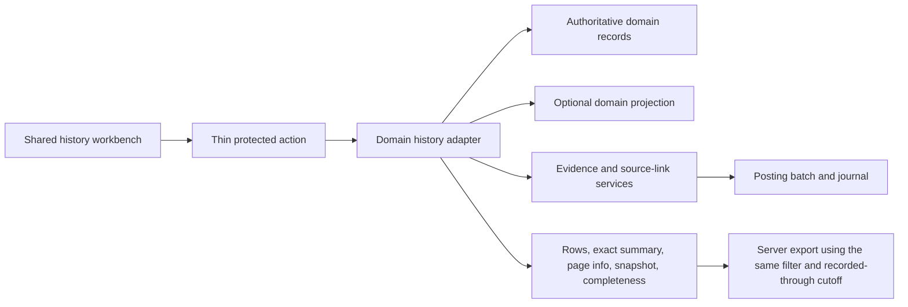

# Stoquify Transaction History Current-State Assessment

Date: 2026-07-14
Scope: Transaction-history architecture, data truth, financial provenance, security, and operational UX
Source proposal: `docs/new ideas/STOQUIFY_TRANSACTION_HISTORY_ANALYTICS_AND_SECURITY_PROPOSAL_2026-07-14.md`

## Executive Decision

Stoquify has strong domain evidence kernels but does not yet have a coherent transaction-history product layer. Payment reconciliation, purchasing/AP, journals, business events, source links, and close assurance contain credible control evidence. Inventory, cash drawer, supplier/customer, finance, and close pages frequently expose bounded activity windows rather than complete histories.

The correct target is a hybrid architecture:

- one shared history result, filter, cursor, completeness, export, and UX contract;
- domain-owned read models and financial semantics;
- direct reads for bounded authoritative records where practical;
- domain projections only where cross-source timelines or volume justify them;
- no universal write ledger and no UI-owned financial truth.

Current overall status: **FOUNDATION REQUIRED**.

## Evidence Method

The assessment reconciles the proposal with current routes, components, hooks, actions, services, Prisma models, focused tests, policy scripts, and `graphify-out/`. The graph is supporting topology evidence only because it was generated on 2026-06-14 and can lag the current worktree. Current source files control every implementation conclusion.

## Maturity By Domain

| Domain | Verified current state | Classification | Required next contract |
|---|---|---|---|
| Inventory movements | Organization-scoped `InventoryTransaction` reads, item/location/type/date filters, summary service, fixed 100-row UI request | Functional but incomplete and internally inconsistent | Canonical enum, permissioned action, snapshot cursor, row/summary/export parity, full `WRITE_OFF` support |
| Cash drawer/POS | Service-owned sessions, transactions, expected/count/variance metrics and journal | Operational dashboard, not complete ledger | Exact aggregates separated from paginated rows, cashier/manager scope, settlement proof lifecycle |
| Payment capture | `Payment` activity and capture-readiness workbench | Bounded operational view | Label as capture truth and link to durable reconciliation timeline |
| Durable reconciliation | Provider events, statement lines, matches, suspense, exceptions, runs, evidence, certificates | Strong kernel, bounded presentation | Paginated proof timeline and exact blocker/summary queries |
| Purchasing/AP | Invoice, match, bank-change, payment approval/release, posting, reconciliation and business-event controls | Strongest operational control kernel, bounded workbench | Lifecycle history, supplier statement, exact tie-outs and server export |
| Supplier activity | Eight recent POs, eight ledger entries and linked items | Recent snippet | Paginated activity adapter; statement only after balance semantics pass |
| Customer activity | Eight recent orders, ledger entries and payments | Recent snippet | Paginated activity adapter; receivable statement remains blocked |
| Receivables | Finance aging derives open amounts and due dates from sales orders and payment state | Aggregate approximation | Explicit invoice/open-item, receipt allocation, credit/refund/write-off/reversal and GL contracts |
| Payables finance view | Aggregate purchase-order/payable approximation beside stronger AP service | Duplicated levels of truth | Route users to authoritative AP history and label forecast/aggregate views |
| Accounting journals/source links | Posted journals, posting batches, source links and reversals exist | Strong accounting spine | Stable history queries and complete source drilldown |
| Close/data trust | Persisted runs, findings, evidence, reviews and exports | Strong assurance kernel with bounded child histories | Separate snapshot `asOf` from live activity, exact export completeness |
| Audit logs | Tenant-scoped append calls exist; generic security audit failures are logged and swallowed | Useful log, not immutable evidence | Access-audit policy, append-only database controls and external anchoring for critical claims |
| Payroll history | Rich run/payment/declaration/proof services | Strong but privacy-sensitive | Aggregate lenses first; employee detail only with fresh auth, scope and redaction |

## Confirmed Architecture Facts

1. `components/inventory/movements/StockMovementDashboard.tsx` sends `limit: 100`; `services/inventory/inventory-read.service.ts` caps reads at 500 and orders only by `createdAt DESC`.
2. `types/inventoryMovementTypes.ts` defines synthetic or renamed transaction types that diverge from Prisma `TransactionType`; the read service hides the mismatch with `as any`.
3. The inventory table applies a movement type filter, while `getStockMovementSummary` does not accept or forward that filter.
4. Inventory movement actions establish trusted organization scope but do not invoke the same `inventory.levels.read` permission used by the page.
5. `services/pos/drawer-dashboard.service.ts` caps sessions at 120 and transactions at 250, then derives dashboard summaries from those arrays and exposes 80 journal rows.
6. `services/payments/payment-reconciliation-workbench.service.ts` caps `Payment` records at 500 and derives capture metrics from the bounded set.
7. `services/reconciliation/payment-reconciliation-dashboard.service.ts` exposes bounded runs, suspense, and inbox queues while some displayed counts are array lengths.
8. `services/purchasing/ap-control.service.ts` provides mature posting, source-link, idempotency, bank-change, approval, reconciliation, and close-invalidation controls, but `getAPWorkbenchData` is capped at 50.
9. Supplier and customer detail analytics use `take: 8`; their dashboard exports serialize only the browser-filtered management list.
10. `services/finance/finance-dashboard.service.ts` derives receivable/payable aging from sales and purchase orders with synthetic due dates, not from mature open-item subledgers.
11. `services/evidence/evidence-contracts.ts` supports only `journal.entry`, `reconciliation.run`, `close.run`, and `payment.transaction` proof subjects.
12. The generic security audit path in `lib/security/audit-log.ts` catches write failures and allows the requested operation to continue.

## Target Architecture

The shared contract must distinguish:

- `effectiveAt`: when the business effect applies;
- `recordedAt`: when Stoquify learned or persisted it;
- `recordedThrough`: the fixed knowledge boundary for one traversal/export;
- `generatedAt`: when the response was produced;
- `complete` versus `partial` source coverage.

## Product Decision

Implement in this order:

1. Freeze vocabulary, ownership, access and accounting claims.
2. Establish the shared envelope and opaque cursor contract.
3. Pilot inventory with exact filter parity and permission-negative tests.
4. Build cash settlement and durable payment proof.
5. Extend AP lifecycle and supplier statements.
6. Build AR source contracts before any receivable-statement claim.
7. Add shared UX only after each selected domain contract passes.
8. Certify each slice independently through release review.

## Non-Claims

- The existing graph is not a current dependency oracle.
- A stored SHA-256 value is not authenticity or non-repudiation evidence.
- Existing supplier/customer `balanceAfter` values are not yet certified as concurrent, backdated as-of statement truth.
- Finance sales-order aging is not a complete AR subledger.
- A skill being installed does not make the corresponding product stage production-ready.
