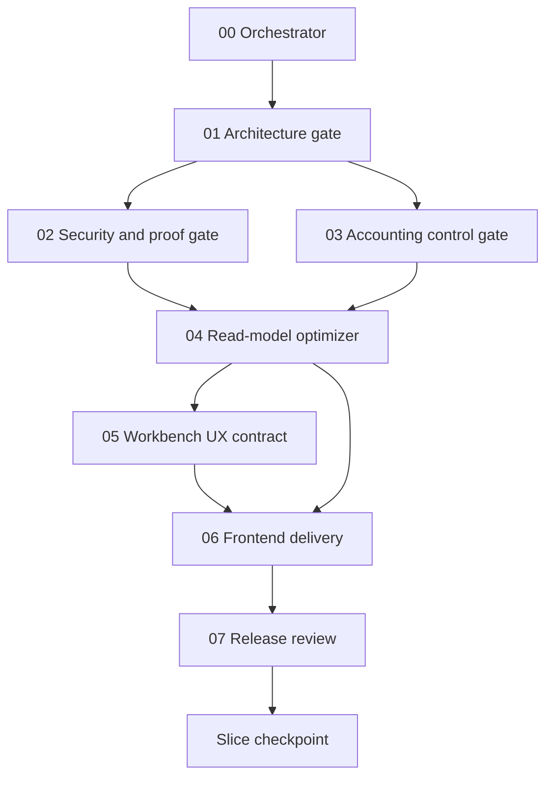

# Stoquify Transaction History Execution Roadmap

Date: 2026-07-14
Program model: Eight reusable stage skills applied to three typed delivery slices.

## Dependency Graph

Stages 02 and 03 may run concurrently only as read-only audits. Product edits remain serialized with exact file ownership.

## Delivery Slices

| Slice | Objective | Entry gate | Exit definition |
|---|---|---|---|
| `foundation-inventory` | Prove the shared result/cursor/export contract and migrate inventory truth safely | Proposal and source map current | Canonical enum, protected action, exact summary parity, stable cursor, server export contract, robust workbench states, focused release PASS |
| `cash-payment` | Deliver cashier settlement accountability and durable payment proof | Foundation slice PASS | Exact cash totals, role scope, variance approval, payment evidence timeline, suspense/close blockers, redaction and release PASS |
| `ap-ar` | Deliver AP lifecycle and supplier statement, then establish AR foundations | Foundation PASS; cash/payment preferred by product priority | AP statement and GL tie-out PASS; AR remains BLOCKED until all source contracts pass |

## Stage Roadmap

### Stage 00: Orchestration And Resume Control

- Objective: Select one slice/mode, validate prerequisites, detect dirty overlap, persist run state and route the next stage.
- Output: Run manifest, run state, trace, selected stage and explicit blockers.
- Done: The selection is deterministic, resumable and cannot skip failed prerequisites.
- Rollback: Run artifacts only; no product rollback.

### Stage 01: Architecture And Vocabulary Gate

- Objective: Freeze route-to-database ownership, transaction vocabulary, source maturity and an exact edit allowlist.
- Files: Proposal, graph, selected route/component/action/service/model/tests.
- Done: Every selected row and summary field has one authoritative owner or is marked partial/blocked.
- Stop: Ownership cannot be established or dirty changes overlap the allowlist.

### Stage 02: Security And Proof Gate

- Objective: Define permission scope for table, drawer, export and actions; proof subjects; redaction; fresh auth; cursor/export abuse controls.
- Done: Tenant and permission-negative tests are specified and every displayed proof grade has a supported subject contract.
- Stop: Tenant bypass, sensitive export leakage, unverifiable proof, or wrong cryptographic primitive.

### Stage 03: Accounting Control Gate

- Objective: Freeze balance, allocation, posting, reversal, reconciliation, close and evidence invariants.
- Done: Accounting claims can be proven by source links and tie-outs; unsupported claims are blocked.
- Stop: Posted records are editable, balances are unexplained, or AR source contracts are absent.

### Stage 04: Domain Read Model And Performance

- Objective: Implement the domain adapter, exact summary, snapshot cursor, server export and plan-proven indexes.
- Contract: `effectiveAt`, `recordedAt`, `recordedThrough`, `id`; tenant/adapter/filter-bound opaque cursor.
- Done: Rows, summary and export share one normalized filter and knowledge cutoff; cap+1 tests pass.
- Stop: Unbounded query, hidden cap, unstable traversal, cross-tenant cursor, or unplanned destructive migration.

### Stage 05: Workbench UX Contract

- Objective: Define command brief, KPI strip, action queue, filter bar, table row roles, detail/proof drawer and robust states.
- Done: Mobile, keyboard, focus, EN/FR, timezone, URL state and complete/recent/partial language are explicit.
- Stop: UI would derive financial truth or advertise unsupported proof.

### Stage 06: Frontend Delivery

- Objective: Implement the shared shell and one approved domain adapter without moving business truth to the client.
- Done: The selected surface consumes only approved contracts and passes focused browser/accessibility evidence.
- Stop: Contract mismatch, client-only filtering/export, or required service edits outside the allowlist.

### Stage 07: Release Review

- Objective: Independently verify contract, API, RBAC, finance, pagination, export, accessibility, regression and policy gates.
- Done: No critical/high defect remains and a scoped release verdict is saved.
- Stop: Reviewer must route defects back to the owning stage rather than self-approve a production fix.

## Foundation Inventory Implementation Detail

1. Replace the divergent frontend movement vocabulary with a canonical mapping that covers every Prisma value.
2. Introduce shared normalized filter, result, snapshot, completeness and cursor contracts under a service-owned history namespace.
3. Protect inventory row and summary actions with `inventory.levels.read`.
4. Query rows with a fixed `recordedThrough` cutoff and stable effective/recorded/id order.
5. Derive exact summary from the same normalized filter, including selected type.
6. Add `WRITE_OFF` display/filter support and remove zero placeholders from truth claims.
7. Implement server export by keyset traversal using the same snapshot.
8. Integrate the workbench shell only after service tests pass.

## Verification Ladder

1. Skill structure: `quick_validate.py` for each skill.
2. Skill scripts: Node unit tests for artifact validation and next-stage selection.
3. Slice tests: focused Jest service/action/component suites.
4. Static gates: `npm run prisma:validate`, `npm run typecheck`, `npm run lint`.
5. Domain gates: inventory boundary, API guard, payment cash truth, ledger close truth, purchasing AP, report/export and role cockpit as applicable.
6. Browser evidence: 320px and desktop, keyboard/focus, EN/FR, URL state and export smoke.
7. Release: `npm run verify:repo` only after focused stages are green and no dirty overlap invalidates evidence.

## Commercial Milestones

- Milestone 1: Inventory history can be trusted beyond the first 100 rows.
- Milestone 2: Cash discrepancies and payment exceptions are explainable from source to certificate.
- Milestone 3: Supplier statements tie to AP and the control account.
- Milestone 4: Customer statements become available only after a defensible AR kernel exists.
- Milestone 5: All supported histories share predictable ergonomics without flattening domain meaning.
