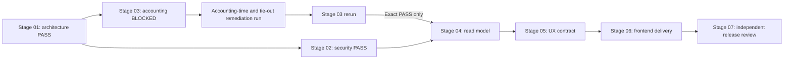

# Stoquify Transaction History Readiness Report

## Decision

**NO-GO for transaction-history release or UI expansion.**

The execution achieved two material outcomes: a validated, installed, reusable eight-skill delivery system and a tested fix for the inventory history action authorization bypass. It also proved that the current inventory accounting model is not yet strong enough to support complete, as-of, evidence-grade transaction history.

## Readiness By Capability

| Capability | Status | Decision |
|---|---|---|
| Skill suite installation | Ready | All eight skills validate and source/install hashes match |
| Orchestration control plane | Ready | 13 tests pass; dependency, overlap, stale, lane, and blocker behavior verified |
| Inventory history RBAC/tenant/module boundary | Ready for current reads | Focused denial tests, lint, and typecheck pass |
| Inventory proof subject | Not ready | No registered evidence subject; UI must show proof unavailable |
| Complete stable history pagination | Not ready | Effective/recorded persistence is implemented but not deployed; knowledge-cutoff queries and signed cursors remain absent |
| Same-filter summary and export | Not ready | Summary type parity and server export contract remain absent |
| Period-end inventory-to-class-3 tie-out | Blocked | Current reconciliation mixes period activity and current value and scans capped evidence |
| Shared transaction-history workbench | Not eligible | Stages 03/04/05 are not complete |
| Stage 07 release certification | Not eligible | Upstream stages are not all current `PASS` |

## Commercial And Control Implication

Shipping the current page as complete history would overstate Stoquify's accounting assurance. The safe product claim remains a permission-protected **recent inventory movement view**, not a complete statement, bitemporal history, or certified OHADA subledger tie-out.

The strongest next investment is complete inventory reconciliation and close tie-out at one effective/recorded cutoff. The accounting-time persistence foundation now exists, but it is not release-ready until its migration is deployed and full-population reconciliation, class 3 tie-out, and correction lineage pass Stage 03. UI work before that step would polish an incomplete truth contract.

## Re-entry Criteria

Stage 04 may resume only when Stage 03 evidence proves:

- deployed immutable effective and recorded timestamps with verified legacy migration provenance;
- complete, uncapped source-to-event and source-to-ledger continuity checks;
- opening plus in-period movement equals closing at one declared cutoff;
- closing inventory valuation ties to the class 3 control balance at that cutoff;
- explicit immutable reversal/correction lineage;
- focused behavioral tests and query-plan evidence pass.

Until then, keep the `foundationInventory` gate `PENDING`, later slices blocked, and proof/export claims unavailable.

## Remediation Update

Run `th-foundation-inventory-remediation-20260714-002` validated successfully with three evidence artifacts and no validator warnings. It closed the missing effective/recorded-time implementation gap and preserved explicit legacy approximation provenance. Stage 03 remains `BLOCKED` by capped reconciliation, temporal tie-out mismatch, missing correction lineage, undeployed migration evidence, and an unavailable full typecheck. Focused ESLint passed. The installed selector returned no next stage and the expected `STAGE_BLOCKED` control.
## Reconciliation Readiness Update

Run th-foundation-inventory-reconciliation-20260714-003 replaces the earlier capped and temporally mismatched reconciliation implementation with complete database aggregates and stable cursor traversal. Focused tests prove opening plus movement equals closing for inventory and class 3 at one recorded-through cutoff, and a deliberate class 3 variance blocks the result. Close-assurance consumers remain green.

Stage 03 is still BLOCKED, so the shared workbench remains ineligible. The remaining product blocker is explicit append-only correction/reversal lineage for posted inventory movements. The accounting-time migration must also be deployed and its legacy backfill and indexes verified before release. The safe claim has improved from recent sampled reconciliation to tested complete-population reconciliation logic, but no production-data, migrated, system-certified, or statutory OHADA claim is yet permitted.

## Correction Gate Update

Run th-foundation-inventory-correction-20260715-004 confirmed the correct service boundary for append-only inventory reversal, exact compensating journals, source links, business events, maker-checker evidence, idempotency, and close invalidation. Stage 01 stopped before implementation because the canonical Prisma schema is already modified by two separate predecessor programs.

Correction readiness therefore remains blocked by repository ownership, not by unresolved architecture. Once the mixed schema work is reviewed and checkpointed cleanly, the proposed dedicated reversal schema/service/test and migration can proceed in a fresh run. Stage 04 remains ineligible.
