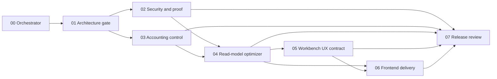

# Stoquify Transaction History Skill Suite Catalog

## Dependency Graph

| Stage | Skill | Primary reusable judgment | Modes |
|---|---|---|---|
| 00 | `stoquify-transaction-history-00-orchestrator` | State, dependencies, fingerprints, dirty overlap, lane gates, resume | audit, implement, verify |
| 01 | `stoquify-transaction-history-01-architecture-gate` | Route-to-source ownership and exact downstream edit boundary | audit, implement, verify |
| 02 | `stoquify-transaction-history-02-security-proof-gate` | Tenant, RBAC, entitlement, redaction, proof, cursor/export abuse controls | audit, implement, verify |
| 03 | `stoquify-transaction-history-03-accounting-control-gate` | Sign, roll-forward, subledger tie-out, posting, reversal, close, OHADA provenance | audit, implement, verify |
| 04 | `stoquify-transaction-history-04-read-model-optimizer` | Same-cutoff rows/summary/export, stable cursor, plans, indexes, migration safety | audit, implement, verify |
| 05 | `stoquify-transaction-history-05-workbench-ux-contract` | Role workflow, completeness semantics, robust states, EN/FR, accessibility | audit, implement, verify |
| 06 | `stoquify-transaction-history-06-frontend-delivery` | Contract-driven shared shell and one domain adapter | audit, implement, verify |
| 07 | `stoquify-transaction-history-07-release-review` | Independent adversarial verification and release verdict | audit, verify |

## Locations

- Versioned source: `docs/skills-life-cycle/stoquify-transaction-history-skill-suite-src/`
- Local installation: `C:\Users\J COMPUTER\.codex\skills\stoquify-transaction-history-*`
- Runtime evidence: `what-next/transaction-history/runs/<run-id>/slices/<slice-id>/`
- Installation evidence: `STOQUIFY_TRANSACTION_HISTORY_SKILL_SUITE_INSTALLATION_REPORT_2026-07-14.md`

Only exact stage `PASS` satisfies a dependency. `PARTIAL`, `BLOCKED`, or `FAILED` stops that path; passed lanes continue only through a fresh narrowed run.
