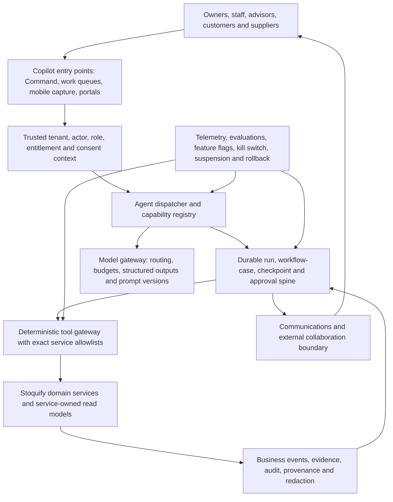

# Stoquify: Top 12 Additive Agents and Skills

**Evidence-led product, architecture, and growth research report**  
**Prepared:** 2 August 2026  
**Scope:** New professional agents and reusable skills that add daily-use, retention, referral, and moat value without duplicating Stoquify's existing 9-agent/28-skill suite

## 1. Executive recommendation

Stoquify should pursue a deliberately additive portfolio, not a larger collection of chat personas. The installed suite already covers the operating brief, cash and reconciliation, inventory and replenishment, purchasing/AP, payroll, close/compliance, customer adoption, platform assurance, and exception orchestration. The best next investments are the missing workflows surrounding those capabilities: getting paid, getting reliable evidence into the system, and bringing outside professionals and counterparties into controlled collaboration.

The top three new capabilities are:

1. **Receivables and Collections Agent** — the strongest immediate daily-use and cash-impact opportunity. It should predict collection risk, prepare evidence-linked follow-ups, coordinate approved communications, and track promises to pay. It must begin in draft-and-approve mode.
2. **Mobile Document Intake and Evidence Capture Agent** — the highest-leverage data acquisition skill. It should accept receipts, invoices, statements, and evidence through mobile upload, email, scanning, and later approved WhatsApp channels; extract structured fields; detect duplicates; and route uncertain data to human verification.
3. **Advisor Collaboration and Review Agent** — the strongest referral loop. It should let businesses invite accountants, auditors, bookkeepers, and consultants into a purpose-limited workspace containing requests, evidence, exceptions, comments, approvals, and certification boundaries.

Together these form a compounding loop:

> Evidence arrives faster → books and operating records become more trustworthy → collections and decisions improve → owners invite accountants and advisors → advisors bring additional businesses → the shared evidence and workflow history make Stoquify harder to replace.

The recommended portfolio is conditional on continuing the Copilot runtime programme. The repository now contains a real Phase 1 foundation—tenant-scoped run persistence, policy checks, read-only tool definitions, evidence and redaction controls, rollout controls, release reconciliation, a kill switch, and a governed Command Agent path. This is material progress beyond the 16 July advisory. However, the 999-case evaluation catalog remains `NOT_TESTED`, and a focused Jest run attempted for this review did not complete within the bounded review window. Therefore, the platform is ready for controlled implementation and internal read-only pilots, not broad autonomous or financially consequential execution.

### Leadership decision

Approve the top-three portfolio as the next product-discovery and contract-design programme, but keep all external messages, accounting mutations, payment actions, credit sharing, and statutory activity human-approved. Fund shared foundations once, then deliver narrow vertical slices instead of twelve independent agent projects.

## 2. Stoquify current-state assessment

### 2.1 Verified installed definition suite

The local validator completed successfully on 2 August 2026:

`PASS — 0 errors; 9 agents; 28 skills; 37 registry capabilities; 999 evaluation cases.`

The nine defined agents are:

- Command Agent
- Cash and Reconciliation Agent
- Inventory and Replenishment Agent
- Purchasing and Accounts Payable Agent
- Payroll and Workforce Agent
- Close and Compliance Agent
- Customer Success and Adoption Agent
- Platform Assurance Agent
- Exception and Action Orchestrator

The 28 existing skills already cover trusted context, RBAC/entitlement checks, evidence recording and retrieval, freshness, redaction, preference memory, daily briefs, root-cause tracing, exception prioritization, cash triage, reconciliation suggestions, inventory risk and variance, PO/receipt/invoice variance, supplier payment risk, payroll variance, close blockers, compliance explanation, country-pack provenance, approvals, notification routing, run state, idempotent tool execution, cost routing, and safe action planning.

### 2.2 Runtime progress verified in the repository

Since the prior runtime advisory, Stoquify has added a substantial Phase 1 foundation:

- `prisma/schema.prisma` contains `AgentRun` and related agent release, checkpoint, evidence, approval, feedback, and governance structures.
- `prisma/migrations/20260722143000_agent_runtime_phase_1_foundation/` establishes the initial runtime persistence model.
- `services/agents/` contains trusted context, policy, tool registry, execution control, evidence, redaction, output validation, rollout, release control, reconciliation, governance, metrics, feedback, and deterministic runner services.
- `services/agents/agent-policy.service.ts` prohibits unsafe tool patterns and constrains Phase 1 tools to read-only behavior.
- `services/agents/agent-context.service.ts` derives trusted organization and actor context and fails closed when context is absent.
- `services/agents/agent-rollout.service.ts` honors the emergency kill switch before other rollout settings.
- `services/agents/agent-release-control.service.ts` and control-plane reconciliation add tenant release, approval, drift, suspension, and ownership rules.
- `services/agents/command-agent.service.ts` and `actions/agents/command-agent.actions.ts` provide a governed Command Agent execution path.
- The current Command tool adapters and daily-brief/freshness skills create a credible read-only internal-pilot slice.

This changes the implementation posture from “runtime absent” to “runtime foundation and one narrow governed agent path present.” It does not yet prove broad production readiness.

### 2.3 Remaining qualification gaps

- The evaluation catalog's overall status and all 999 case entries remain `NOT_TESTED`.
- The catalog validates structurally but is not yet a complete executable certification harness for every capability.
- A focused Jest command covering context, policy, runner, and Command Agent services was bounded and terminated after producing no result; this review therefore records the focused runtime test result as **inconclusive**, not failed and not passed.
- The current runtime is intentionally Phase 1/read-only. New communications, credit packages, supplier actions, or workflow writes require stronger approval and service-contract coverage.
- The architectural graph report is dated 14 June 2026. It remains useful for navigation and identifies the ledger-backed compliance control plane and enterprise POS flow, but it does not include all July runtime work.

### 2.4 Product gaps that remain additive

The installed suite is strongest inside Stoquify's internal operating domains. It is weaker at the edges where value and referrals compound:

- Customer collection and promise-to-pay workflows
- Mobile-first document acquisition and verified capture
- Accountant, auditor, customer, and supplier collaboration spaces
- Forward cash scenarios rather than current-state exception summaries
- Cross-domain business fraud and control signals
- Consent-aware interactive communication channels
- Unit, item, customer, branch, and job profitability guidance
- Connector freshness, data-quality, and remediation operations
- Consent-based financing-readiness packages
- Bid-to-profit and lead-to-cash workflows

Those gaps drive the recommendations below.

## 3. Research method and evidence limitations

### 3.1 Method

The review combined:

1. Repository evidence from the Copilot reports, definition suite, registries, Prisma schema, agent services, actions, tests, and architecture graph.
2. Current primary-source internet research accessed on 2 August 2026.
3. A longlist of 38 candidates screened for duplication, mission fit, daily frequency, referral mechanics, moat formation, feasibility, and safety.
4. A weighted comparison of the final 12 using the exact scoring model in the prompt.
5. Portfolio-level sequencing against the current read-only runtime.

### 3.2 Source standard

Primary sources were preferred: official product documentation, vendor help centers, maintained technical documentation, World Bank/IFC material, GSMA industry research, and OpenPeppol. Vendor performance claims are labeled as vendor claims and are not treated as independently proven for Stoquify.

### 3.3 Important external signals

- Intuit's current QuickBooks AI portfolio separates accounting, payments, finance, customer, and project-management workflows and places AI work in a reviewable business feed. This supports specialist agents with human control rather than a single omnipotent assistant.
- Sage positions collections, document capture, anomaly detection, cash insight, and embedded workflow as core finance-copilot functions. Sage's “seven days faster” collections and “over 50%” document-processing statements are vendor claims, useful as hypotheses rather than Stoquify forecasts.
- QuickBooks and Xero use accountant invitations and professional workspaces as product-distribution and collaboration mechanisms. This is strong evidence for an advisor-led referral loop.
- GSMA reports that mobile money exceeded $2 trillion in 2025 and that merchant payments were its fastest-growing use case. This supports mobile-money-aware collections, reconciliation, and communication for African businesses.
- The World Bank reports that electronic payments and digital transaction data can reduce information asymmetry and support SME access to credit, especially in weaker credit-information environments. This supports a consent-based financing-readiness capability, not an unregulated lending engine.
- OpenPeppol demonstrates how standardized e-orders and e-invoices can create interoperable B2B document networks. Stoquify should adopt interoperable document semantics progressively without assuming Peppol coverage in every target market.
- Plaid and Mono demonstrate webhook-driven transaction synchronization and open-banking-style data access, but geographic coverage differs. Stoquify needs country-by-country connector adapters and cannot assume a universal African banking API.
- Current agent-runtime documentation from OpenAI, Inngest, and Langfuse reinforces tool-level guardrails, durable pauses and resumptions, traceability, evaluations, and human approval. These patterns align with Stoquify's existing runtime direction.

## 4. Candidate longlist and disposition

| # | Candidate | Disposition | Reason |
|---:|---|---|---|
| 1 | Command Agent | Already covered | Installed and supported by an emerging runtime path. |
| 2 | Cash/Reconciliation Agent | Already covered | Defined with cash triage and match-suggestion skills. |
| 3 | Inventory/Replenishment Agent | Already covered | Defined with risk and variance skills. |
| 4 | Purchasing/AP Agent | Already covered | Defined with three-way variance and supplier risk. |
| 5 | Payroll/Workforce Agent | Already covered | Defined with aggregate readiness and variance boundaries. |
| 6 | Close/Compliance Agent | Already covered | Defined with blocker, explanation, and provenance skills. |
| 7 | Customer Success/Adoption Agent | Already covered | Defined; retain for onboarding rather than external professional review. |
| 8 | Platform Assurance Agent | Already covered | Covers Copilot quality and operational assurance, not business fraud. |
| 9 | Exception/Action Orchestrator | Already covered | Shared runtime capability, not another user persona. |
| 10 | Receivables and Collections Agent | **Final 12** | High-frequency cash outcome and communication loop. |
| 11 | Mobile Document Intake and Evidence Capture | **Final 12** | Feeds every financial and control workflow. |
| 12 | Advisor Collaboration and Review Agent | **Final 12** | Strongest professional referral and trust loop. |
| 13 | Cash Forecast and Scenario Planning Agent | **Final 12** | Moves Stoquify from reporting to forward decisions. |
| 14 | Continuous Controls and Fraud Signals Agent | **Final 12** | Adds cross-domain business-risk monitoring. |
| 15 | Omnichannel Business Communications Skill | **Final 12** | Turns insights into consented, trackable customer/supplier interaction. |
| 16 | Profitability and Pricing Intelligence Agent | **Final 12** | Creates recurring margin decisions and differentiated data value. |
| 17 | Connector Health and Data Trust Agent | **Final 12** | Protects freshness and confidence across fragmented data sources. |
| 18 | Financing Readiness and Consent Package Agent | **Final 12** | Converts trusted operations into partner-ready evidence. |
| 19 | Supplier Collaboration Network Agent | **Final 12** | Creates counterpart invitations and shared exception resolution. |
| 20 | Job and Project Margin Agent | **Final 12** | Adds bid-to-profit control for service and project businesses. |
| 21 | Sales Pipeline-to-Cash Agent | **Final 12** | Connects prospects, quotes, invoices, receipts, and margin. |
| 22 | Anonymous Peer Benchmark Agent | Later | High moat potential but needs scale, cohort privacy, and statistical governance. |
| 23 | Statutory Filing Submission Agent | Later/merge | Close/Compliance covers readiness; submission requires country-specific legal controls. |
| 24 | ESG Reporting Agent | Later | Relevant to larger customers but weak near-term daily use. |
| 25 | Voice Copilot | Experimental | Accessibility upside; privacy, verification, and local-language quality need pilots. |
| 26 | Expense Policy Agent | Merge | Add as a skill within AP/controls, not a standalone agent. |
| 27 | Procurement Negotiation Agent | Later | Requires high-quality supplier data and strict communication authority. |
| 28 | General Customer Support Bot | Reject | Weak core differentiation; use conventional support tooling first. |
| 29 | Marketing Content Agent | Reject | Off-mission and widely commoditized. |
| 30 | Autonomous Coding Agent | Internal only | Engineering productivity tool, not a customer Copilot capability. |
| 31 | E-invoice Interoperability Agent | Merge/later | Treat as a document/network skill under intake and supplier collaboration. |
| 32 | Contract Intelligence Agent | Later | Useful for larger customers but lower daily frequency. |
| 33 | Insurance Readiness Agent | Later | Financing-readiness evidence may later support this partner use case. |
| 34 | Demand Forecast Agent | Merge | Extend the existing Inventory Agent rather than duplicate it. |
| 35 | Workforce Scheduling Agent | Merge/later | Belongs inside Payroll/Workforce after source-data readiness. |
| 36 | Business Marketplace Matching Agent | Reject for now | Network scale and trust are insufficient; high distraction risk. |
| 37 | Automated Tax Advice Agent | Reject | Legal and statutory risk; provide sourced readiness explanations instead. |
| 38 | Autonomous Payment Agent | Reject for now | Irreversible financial action exceeds current runtime maturity. |

## 5. Scoring model

Scores are from 1 to 10. Weighted total is the sum of each raw score multiplied by its weight, divided by 100.

| Code | Criterion | Weight |
|---|---|---:|
| A | Mission alignment | 15% |
| D | Daily/weekly usage | 12% |
| S | Stickiness | 12% |
| V | Measurable customer value | 10% |
| R | Referral/collaboration | 8% |
| M | Data/workflow/evidence/network moat | 10% |
| F | African/OHADA relevance | 8% |
| T | Technical feasibility | 8% |
| B | Backbone compatibility | 5% |
| G | Security/governance readiness | 5% |
| C | Commercial potential | 4% |
| P | Time to first production value | 3% |

## 6. Ranked final 12

| Rank | Capability | Type | Primary user | Frequency | Stickiness | Referral | Moat | Feasibility | Main risk | Score | Phase |
|---:|---|---|---|---|---|---|---|---|---|---:|---|
| 1 | Receivables and Collections | Agent | Owner/CFO/AR | Daily | Very high | High | Workflow/outcome | High | Harmful or noncompliant messages | **9.55** | Now |
| 2 | Mobile Document Intake and Evidence Capture | Hybrid | All operators/accountants | Daily | Very high | Medium-high | Evidence/data | High | Extraction errors and sensitive data | **9.42** | Now |
| 3 | Advisor Collaboration and Review | Agent/workspace | Accountant/auditor/owner | Weekly/daily | Very high | Very high | Trust/network | Medium-high | Oversharing or scope creep | **9.14** | Now |
| 4 | Cash Forecast and Scenario Planning | Agent | Owner/CFO | Weekly/daily | Very high | Medium | Decision/outcome | Medium-high | False precision | **8.97** | Next |
| 5 | Omnichannel Business Communications | Shared skill | Owner/AR/AP/HR | Daily | High | Very high | Interaction/history | Medium-high | Consent, delivery, impersonation | **8.76** | Next |
| 6 | Continuous Controls and Fraud Signals | Agent | Owner/controller/auditor | Daily | Very high | Low-medium | Risk/outcome | Medium | False positives and accusation risk | **8.74** | Next |
| 7 | Profitability and Pricing Intelligence | Agent | Owner/CFO/manager | Weekly/daily | High | Medium | Proprietary economics | Medium-high | Bad allocation assumptions | **8.57** | Next |
| 8 | Connector Health and Data Trust | Agent/shared service | Operator/admin/accountant | Daily background | High | Low | Integration/freshness | High | Credential and remediation risk | **8.56** | Now/next |
| 9 | Supplier Collaboration Network | Agent/workspace | Buyer/AP/supplier | Weekly/daily | High | Very high | Counterparty network | Medium | External identity and disputes | **8.53** | Later pilot |
| 10 | Financing Readiness and Consent Package | Agent | Owner/CFO/lender partner | Monthly/on-demand | High | High | Evidence/partner | Medium-low | Credit, consent, discrimination | **8.43** | Later pilot |
| 11 | Sales Pipeline-to-Cash | Agent | Owner/sales/finance | Daily | High | Very high | Revenue workflow | Medium | CRM scope expansion | **8.18** | Later |
| 12 | Job and Project Margin | Agent | Project/service manager | Daily/weekly | High | Medium-high | Project economics | Medium | Incomplete time/cost data | **8.07** | Later |

### 6.1 Transparent raw scores

| Capability | A | D | S | V | R | M | F | T | B | G | C | P | Weighted |
|---|---:|---:|---:|---:|---:|---:|---:|---:|---:|---:|---:|---:|---:|
| Receivables/Collections | 10 | 10 | 10 | 10 | 9 | 9 | 10 | 9 | 9 | 8 | 9 | 10 | 9.55 |
| Document Intake | 10 | 10 | 10 | 10 | 8 | 10 | 10 | 8 | 9 | 8 | 8 | 9 | 9.42 |
| Advisor Collaboration | 9 | 9 | 10 | 9 | 10 | 10 | 9 | 8 | 8 | 9 | 9 | 8 | 9.14 |
| Cash Forecast | 10 | 9 | 10 | 10 | 6 | 9 | 9 | 8 | 9 | 8 | 9 | 8 | 8.97 |
| Omnichannel Communications | 8 | 10 | 9 | 9 | 10 | 8 | 10 | 8 | 8 | 7 | 8 | 9 | 8.76 |
| Controls/Fraud Signals | 10 | 9 | 10 | 10 | 5 | 10 | 9 | 7 | 8 | 7 | 8 | 7 | 8.74 |
| Profitability/Pricing | 9 | 9 | 9 | 10 | 5 | 9 | 9 | 8 | 8 | 8 | 9 | 8 | 8.57 |
| Connector Health | 10 | 8 | 9 | 9 | 4 | 10 | 9 | 8 | 10 | 9 | 7 | 7 | 8.56 |
| Supplier Collaboration | 9 | 8 | 9 | 9 | 10 | 10 | 9 | 6 | 7 | 7 | 9 | 6 | 8.53 |
| Financing Readiness | 9 | 6 | 9 | 10 | 9 | 10 | 10 | 6 | 8 | 6 | 10 | 6 | 8.43 |
| Pipeline-to-Cash | 7 | 10 | 8 | 9 | 10 | 8 | 8 | 7 | 7 | 7 | 9 | 7 | 8.18 |
| Job/Project Margin | 8 | 9 | 9 | 9 | 7 | 8 | 7 | 7 | 8 | 8 | 8 | 7 | 8.07 |

## 7. Detailed assessments

### 7.1 Receivables and Collections Agent

**Classification and users.** A customer-facing workflow agent for owners, CFOs, AR clerks, and account managers. It complements the Cash/Reconciliation Agent by acting upstream on unpaid invoices rather than merely explaining cash exceptions.

**Problem and workflows.** It identifies overdue and at-risk invoices, ranks collection work, predicts likely delay using the business's own payment history, drafts appropriate reminders, records promises to pay, proposes payment plans, monitors delivery and replies, and closes the loop when payment evidence is reconciled.

**Features, inputs, outputs, and controls.** Inputs include approved customer master data, invoice state, due dates, dispute flags, payment history, consent/channel preferences, and reconciled receipts. Outputs include a prioritized queue, evidence-linked reason codes, draft messages, next-best action, promise-to-pay case, and escalation recommendation. No message should leave Stoquify without the configured authorization level; legal threats, fee waivers, discounts, debt restructuring, and account holds require explicit human authority.

**Experience and daily-use mechanism.** The owner opens a “Get paid” queue each morning, sees cash at risk, approves or edits a small batch of drafts, and follows resolved promises. This is a concrete daily outcome rather than a chat session.

**Stickiness, referrals, moat, and commercial value.** Payment-behavior history, message outcomes, dispute reasons, promises, and reconciled receipts create an outcome-labelled collection graph. Customers are invited to view invoices, confirm disputes, or choose an approved payment route. The capability supports premium cash-management packaging and makes replacement costly because another product would lack the interaction and resolution history.

**Pros.** Immediate cash benefit; frequent use; measurable days-to-pay and collection-rate metrics; reuses invoices, customers, reconciliation, notifications, evidence, and cases; relevant across African markets and payment rails.

**Cons and failure modes.** Incorrect, excessive, or culturally inappropriate reminders can damage relationships. Delivery does not prove receipt. Prediction can penalize new or irregular customers. Regulations and accepted collection practices vary by jurisdiction.

**Security and integration requirements.** Tenant-scoped customer and invoice access; opt-in/channel consent; approved templates; suppression lists; quiet hours; human review; delivery webhook verification; immutable message/evidence log; redaction; role-based limits; safe dispute routing. Integrates with AR/invoicing, customers, reconciliation, notifications, email/WhatsApp/SMS providers, cases, and audit.

**Backbone dependency and sourcing decision.** Requires durable case state, exact communication-tool allowlists, approval checkpoints, idempotent sends, evidence capture, and kill switch. **Build Stoquify-native**, using external messaging providers only as transport.

**Feasibility, phase, and metrics.** High feasibility; approximately 8–12 weeks for a draft-only pilot after connector and consent contracts. Phase: **Now**. Metrics: overdue balance contacted, approval rate, reminder edit rate, delivery rate, reply rate, promises kept, median days-to-pay, collected cash per active tenant, opt-out/complaint rate, incorrect-contact incidents, cost per collected unit.

**Score rationale.** 9.55. Strongest on mission, frequency, measurable value, regional relevance, and time to value; governance is the principal weaker dimension.

### 7.2 Mobile Document Intake and Evidence Capture Agent

**Classification and users.** A hybrid ingestion agent and reusable skill set serving owners, cashiers, purchasers, accountants, payroll operators, and auditors.

**Problem and workflows.** Many records begin as photos, PDFs, statements, email attachments, or chat documents. The capability receives content, scans for malware, classifies document type, extracts fields, identifies organization/context, detects duplicates, links provenance, estimates confidence, asks bounded clarification, and routes human-verified data to service-owned drafts.

**Features and controls.** Support mobile camera, upload, email intake, batch scans, and later approved WhatsApp intake. Extract supplier/customer, date, currency, tax, totals, line items, references, and document hashes. Show the original beside extracted fields. Low-confidence or conflicting data must never silently post. Every accepted value retains source coordinates, parser/model version, reviewer, and timestamp.

**Experience and daily use.** “Snap it now, reconcile it later” removes end-of-week paperwork. Operators receive a short verification inbox rather than a blank form. Accountants request missing evidence from inside the same workflow.

**Stickiness, referrals, moat, and commercial value.** The evidence archive connects documents to transactions, approvals, exceptions, close periods, and counterparties. This is a foundational data moat and lowers onboarding friction. Advisor document requests create invitations. Monetization can be usage-tiered while preserving a meaningful base allowance.

**Pros.** Feeds nearly every Stoquify module; high daily frequency; improves completeness and auditability; valuable in mobile-first and intermittent-connectivity contexts; can reduce manual entry.

**Cons.** Image quality, handwriting, language, tax layout, and counterfeit documents create errors. OCR/model cost can grow. Storing identity, payroll, bank, and invoice documents increases privacy and breach impact.

**Security and integrations.** Malware scanning; content-type validation; size limits; encrypted object storage; tenant-scoped keys; retention/deletion policy; PII classification; redaction; duplicate/fraud signals; signed upload URLs; reviewer separation for sensitive records. Integrates with document storage, AP, AR, reconciliation, payroll evidence, close assurance, email, and mobile clients.

**Backbone and decision.** Requires asynchronous durable processing, evidence records, output schemas, confidence policy, human checkpoints, cost routing, and trace redaction. **Adapt commodity OCR/document-AI components, but build Stoquify-native classification, provenance, validation, and posting boundaries.**

**Feasibility, phase, metrics.** Medium-high feasibility; 10–16 weeks for receipts and supplier invoices, then statements. Phase: **Now**. Metrics: documents captured per active tenant, verified-field accuracy, straight-through draft rate, reviewer correction rate, duplicate detection, time from receipt to verified draft, missing-evidence reduction, cost per verified document, security incidents.

**Score rationale.** 9.42. Maximum evidence/moat and workflow value; slightly lower referral and feasibility scores due to extraction, privacy, and storage complexity.

### 7.3 Advisor Collaboration and Review Agent

**Classification and users.** A role-aware agent plus collaboration workspace for owners, accountants, bookkeepers, auditors, controllers, and consultants.

**Problem and workflows.** Businesses and advisors currently exchange questions and evidence through fragmented email and messaging. The agent creates scoped review requests, assembles evidence, identifies unresolved exceptions, tracks comments and responses, proposes corrections as drafts, records approvals, and maintains certification boundaries.

**Features and controls.** Purpose-bound invitations; client/firm relationships; delegated team access; request lists; evidence upload; threaded comments; review notes; draft adjustment requests; period-lock awareness; sign-off packages; revocation; access expiry; download/redaction controls. It must state when work is advisory, reviewed, certified, or unsupported.

**Experience and daily use.** An accountant manages multiple clients from an advisor cockpit; each client sees a simple “requests from your advisor” queue. Owners can invite an advisor during onboarding, close, financing preparation, or exception resolution.

**Stickiness, referral, moat, and commercial value.** This is the strongest invitation loop: one accountant can bring many businesses, and each business may bring a professional firm. Shared request history, evidence, decisions, and role-scoped access create a trust network. Commercial models include accountant editions, client bundles, firm administration, and premium assurance workflows.

**Pros.** Strong precedent in QuickBooks/Xero; lowers support burden; improves data quality; drives multi-user adoption; reinforces evidence and close workflows.

**Cons.** Complex delegated permissions; professional liability expectations; potential advisor/client conflict; export and data portability requirements; firms may resist another portal.

**Security and integrations.** External identity verification; firm membership; client-granted scopes; least privilege; no cross-client leakage; download watermarking; redaction; fresh auth; immutable access log; revocation propagation; maker-checker. Integrates with invitations, organizations, evidence, cases, close, reports, approvals, exports, and notifications.

**Backbone and decision.** Requires trusted external identity, organization-to-firm relationship models, scoped tool registry, durable requests/cases, approvals, and audit. **Build Stoquify-native**; do not outsource the trust graph.

**Feasibility, phase, metrics.** Medium-high; 12–18 weeks for evidence requests and read-only review. Phase: **Now**, after top-level authorization contracts. Metrics: advisor invitations, acceptance, clients per firm, monthly advisor-active tenants, request completion time, evidence completeness, close delay, cross-tenant denial tests, referral conversion, net revenue retention.

**Score rationale.** 9.14. Highest referral/network value and strong governance potential; implementation is constrained by cross-organization authorization complexity.

### 7.4 Cash Forecast and Scenario Planning Agent

**Classification and users.** A decision-support agent for owners, CFOs, controllers, and finance partners.

**Problem and workflows.** Current balances and exceptions do not answer “what happens next?” The agent produces base, downside, and upside cash scenarios from opening cash, receivables, payables, payroll, tax, recurring flows, purchase commitments, and user-controlled assumptions.

**Features and controls.** 13-week cash view; confidence bands; assumption ledger; source freshness; driver waterfall; scenario comparisons; alert thresholds; proposed actions such as collection priority or purchase timing. It must never present a model-generated number as a booked fact.

**Experience and daily use.** A compact runway card appears in the Command brief, with weekly scenario review and drill-down into the few drivers that changed.

**Stickiness, referral, moat, and commercial value.** Scenario assumptions and actual outcomes create a decision-quality dataset. Owners share scenarios with accountants or lenders through controlled packages. This supports premium planning tiers.

**Pros.** High management value; reuses multiple modules; provides forward-looking differentiation; measurable forecast accuracy.

**Cons.** Incomplete AR/AP data creates false precision. Seasonal and informal cash flows are difficult. Users may over-trust visually precise forecasts.

**Security and integrations.** Read-only source adapters; evidence and freshness labels; explicit assumptions; scenario versioning; no automatic transactions; restricted sharing. Integrates with cash, AR, AP, payroll, tax/close, inventory commitments, budgets, and Command Agent.

**Backbone and decision.** Requires evidence-grounded retrieval, snapshot/version storage, deterministic calculations outside the LLM, model explanations only after computation, and outcome measurement. **Build Stoquify-native**, potentially using a commodity forecasting library for statistical baselines.

**Feasibility, phase, metrics.** Medium-high; 10–16 weeks for deterministic 13-week scenarios. Phase: **Next**. Metrics: weekly scenario users, forecast error by horizon, assumption override rate, avoided shortfall events, action acceptance, evidence coverage, unsupported forecast rate.

**Score rationale.** 8.97. Excellent mission, value, and stickiness; referral is weaker than advisor or counterparty workflows.

### 7.5 Omnichannel Business Communications Skill

**Classification and users.** A shared, consent-aware skill used by Collections, AP, Payroll, Advisor, Supplier, and Pipeline agents.

**Problem and workflows.** Recommendations have limited value if users must manually copy them into email, SMS, or WhatsApp. The skill prepares, approves, sends, receives, verifies, and links messages to business cases.

**Features and controls.** Template registry; channel consent; language/tone policy; quiet hours; preview/edit/approve; signed links; inbound reply classification; delivery/read status when available; opt-out handling; fallback channel; immutable message-to-case link; rate limits and abuse controls.

**Experience and daily use.** Users act from the workflow they are already viewing. External recipients can respond without becoming full users, then may be invited into a controlled portal.

**Stickiness, referral, moat, and commercial value.** Interaction history and response outcomes improve future workflow recommendations. Every customer, supplier, employee, or advisor touchpoint can become a permissioned referral route. Usage-based communication and premium automation are potential revenue streams.

**Pros.** High daily frequency; strong African mobile relevance; shared investment across agents; converts insight into action.

**Cons.** Provider policies, template approval, delivery variation, opt-outs, fraud, and sender reputation. WhatsApp or SMS availability varies by country and provider.

**Security and integrations.** Consent ledger; verified sender; exact provider allowlists; secrets isolation; webhook signature verification; idempotency; replay protection; content redaction; rate limits; human approval; emergency suspension. Integrates with existing notification routing, cases, evidence, contacts, and external providers.

**Backbone and decision.** Requires durable outbound/inbound events, tool approval, retries, delivery reconciliation, and kill switch. **Build the policy/orchestration skill; buy transport from regulated providers.**

**Feasibility, phase, metrics.** Medium-high; 8–14 weeks for email plus one pilot messaging channel. Phase: **Next**. Metrics: delivery, reply, opt-out, approval/edit, time-to-response, provider failures, duplicate sends, complaints, invitations generated.

**Score rationale.** 8.76. Outstanding frequency, referral, and regional relevance; privacy, consent, and provider governance reduce its readiness score.

### 7.6 Continuous Controls and Fraud Signals Agent

**Classification and users.** A cross-domain monitoring agent for owners, controllers, auditors, security teams, and branch managers. It is distinct from Platform Assurance, which governs the Copilot platform itself.

**Problem and workflows.** Fraud and control failures often appear as weak signals across cash, stock, purchasing, payroll, users, and approvals. The agent correlates deterministic rules and statistical anomalies, assembles an evidence packet, ranks materiality, and opens a confidential investigation case.

**Features and controls.** Duplicate/fabricated document signals; unusual refunds/voids; inventory shrinkage patterns; changed supplier payment destinations; payroll destination collisions; approval bypass; after-hours activity; split transactions; repeated reconciler overrides; role-conflict signals. It must say “signal” or “requires review,” never accuse a person of fraud.

**Experience and daily use.** A confidential controls queue shows material signals with evidence and safe next steps. Resolved outcomes improve rule precision.

**Stickiness, referral, moat, and commercial value.** Cross-domain event and outcome history creates a difficult-to-copy control graph. Auditors and accountants may be invited to reviewed cases. Supports a premium controls/assurance tier.

**Pros.** Strong mission alignment; high loss-prevention value; reuses Stoquify's ledger, inventory, AP, payroll, audit, and evidence foundations.

**Cons.** False positives cause fatigue and reputational harm. Insider-threat cases require restricted access. Model explanations can amplify bias or unsupported suspicion.

**Security and integrations.** Confidential case scopes; separation of duties; restricted evidence; redaction; immutable audit; explainable deterministic features; protected whistleblowing boundaries; no automated discipline or payment block. Integrates with events, audit logs, evidence, cash, inventory, AP, payroll, approvals, and incidents.

**Backbone and decision.** Requires event normalization, deterministic rules, outcome labels, restricted case orchestration, and assurance monitoring. **Build Stoquify-native; use statistical libraries, not an external autonomous fraud agent.**

**Feasibility, phase, metrics.** Medium; 12–20 weeks for a narrow supplier-bank-change and duplicate-payment pilot. Phase: **Next**. Metrics: confirmed-signal precision, false-positive rate, time to triage, prevented loss, control coverage, access violations, resolution completeness.

**Score rationale.** 8.74. Exceptional mission and moat value; lower referral, feasibility, and governance scores reflect the sensitivity of fraud inferences.

### 7.7 Profitability and Pricing Intelligence Agent

**Classification and users.** A decision agent for owners, CFOs, product managers, branch managers, and sales leaders.

**Problem and workflows.** Revenue can grow while margins deteriorate. The agent calculates contribution margins using service-owned cost and revenue data, identifies leakage, tests price/cost scenarios, and explains which items, customers, locations, or channels drive changes.

**Features and controls.** Item/customer/branch/channel margin; cost-to-serve assumptions; discount leakage; dead-stock carrying cost; price-floor suggestions; mix effects; supplier cost changes; scenario sandbox. Deterministic financial calculations remain outside the LLM.

**Experience and daily use.** A weekly “margin moves” card highlights a small number of decisions, with drill-down to source transactions and assumptions.

**Stickiness, referral, moat, and commercial value.** Historical unit economics and decision outcomes create proprietary business intelligence. Advisors can collaborate on assumptions. Supports premium analytics and vertical packages.

**Pros.** Direct profit impact; broad reuse; differentiated from bookkeeping; strong cross-module value.

**Cons.** Allocation methods can be contentious; bad costs produce bad recommendations; price recommendations may have legal or customer implications.

**Security and integrations.** Role-scoped margins; assumption versioning; evidence; no automatic price changes; approval for published price lists. Integrates with sales, inventory valuation, purchasing, payroll/time, expenses, branches, and projects.

**Backbone and decision.** Requires trusted read models, deterministic calculation engine, versioned assumptions, evidence links, and scenario storage. **Build Stoquify-native.**

**Feasibility, phase, metrics.** Medium-high; 10–16 weeks for item and branch contribution margin. Phase: **Next**. Metrics: active margin viewers, recommendation acceptance, gross-margin change, discount leakage, stale-cost rate, assumption disputes, realized versus predicted benefit.

**Score rationale.** 8.57. Strong mission, value, moat, and monetization; moderate referral contribution.

### 7.8 Connector Health and Data Trust Agent

**Classification and users.** A shared operational agent for tenant administrators, accountants, support, and the Copilot runtime.

**Problem and workflows.** Forecasts, reconciliation, and controls are unsafe when bank, mobile-money, commerce, messaging, or document feeds are stale or broken. The agent detects lag, schema drift, credential expiry, duplicates, gaps, webhook failures, and reconciliation discrepancies; explains impact; and guides safe remediation.

**Features and controls.** Connector inventory; last successful sync; freshness SLA; coverage; event gap detection; schema-version alerts; credential-expiry warnings; retry/dead-letter status; affected reports/agents; safe reconnect flow; incident linkage.

**Experience and daily use.** Most work is background monitoring. Users see a plain-language trust banner only when decisions may be affected, plus a remediation queue for administrators.

**Stickiness, referral, moat, and commercial value.** Reliable connections make every other module dependable. Connector behavior and remediation knowledge create an integration moat. It reduces support cost and can differentiate enterprise plans.

**Pros.** High backbone compatibility; protects every agent; directly addresses fragmented African payment/banking integrations; measurable reliability.

**Cons.** Low visible delight; every provider differs; automated reconnect can be dangerous; observability volume can grow.

**Security and integrations.** Secrets vault; no credential exposure to models; signed webhooks; replay protection; least privilege; provider status isolation; operator approvals for credential changes. Integrates with provider accounts/events, business-event outbox, mobile money, bank feeds, messaging, document intake, telemetry, and incidents.

**Backbone and decision.** Requires standardized connector contracts, freshness metadata, provider event ledger, alert routing, and incident state. **Build the trust control plane; partner for data access country by country.**

**Feasibility, phase, metrics.** High for existing connectors; 8–14 weeks for a common health model. Phase: **Now/Next**. Metrics: freshness SLA, detection time, recovery time, duplicate/gap events, reconciler failure rate, support tickets, agent answers blocked for stale evidence.

**Score rationale.** 8.56. Exceptional mission, backbone, evidence, and governance fit; weak direct referral contribution.

### 7.9 Supplier Collaboration Network Agent

**Classification and users.** A controlled external workspace/agent for buyers, AP teams, inventory managers, and suppliers.

**Problem and workflows.** PO acknowledgements, delivery dates, invoice disputes, missing documents, bank-detail changes, and payment status are fragmented across messages. The agent coordinates a shared, evidence-linked case without granting suppliers internal system access.

**Features and controls.** Supplier invite; PO acknowledgement; delivery commitment; ASN/document upload; invoice status; dispute thread; payment-status visibility; bank-change request with independent verification; performance history; approved reorder collaboration.

**Experience and daily use.** Buyers work from an exception queue; suppliers use a lightweight portal or signed link. Successful counterparties may adopt Stoquify for their own business.

**Stickiness, referral, moat, and commercial value.** Each supplier invitation expands the network. Commitment, delivery, dispute, and payment histories improve purchasing decisions and financing possibilities. Monetization may include supplier premium services later, but basic collaboration should reduce friction rather than create a paywall.

**Pros.** Strong referral/network loop; improves inventory and AP data; reduces disputes; creates supplier reliability data.

**Cons.** External identity, multilingual support, portal adoption, and dispute liability are hard. Bank-change workflows are fraud targets.

**Security and integrations.** Purpose-bound external identity; PO/invoice-specific access; no tenant browsing; signed links; bank-change maker-checker; fresh auth; immutable dispute history; attachment scanning. Integrates with suppliers, POs, receipts, invoices, payments, evidence, cases, and communications.

**Backbone and decision.** Requires external-party identity, scoped cases, durable collaboration, approval, document intake, and communication. **Build Stoquify-native after advisor collaboration proves the external-access model.**

**Feasibility, phase, metrics.** Medium; 14–22 weeks for acknowledgement and document exchange. Phase: **Later pilot**. Metrics: suppliers invited/activated, acknowledgement time, on-time delivery, dispute cycle, missing documents, duplicate invoices, bank-change incidents, supplier-to-tenant referrals.

**Score rationale.** 8.53. Excellent referral and network moat; external authorization and adoption reduce feasibility.

### 7.10 Financing Readiness and Consent Package Agent

**Classification and users.** An evidence-packaging agent for owners, CFOs, accountants, and regulated financing partners. It is not a lender and should not make final credit decisions.

**Problem and workflows.** Many SMEs lack organized, credible records when seeking finance. The agent evaluates evidence completeness, explains gaps, assembles consented cash-flow and operating summaries, redacts unnecessary data, and shares a time-limited package with a selected partner.

**Features and controls.** Readiness checklist; identity/business evidence; reconciled transaction summaries; cash-flow history; receivables/payables; inventory and payroll indicators where authorized; provenance; consent; package version/hash; expiry/revocation; partner access log; correction process. No hidden score and no sale of data.

**Experience and daily use.** The capability appears when cash forecasts or growth plans reveal a financing need. Owners progressively improve readiness, then intentionally share a package.

**Stickiness, referral, moat, and commercial value.** Stoquify becomes the system that turns daily operations into credible finance evidence. Lenders and advisors can refer applicants to improve records. Partner revenue is possible only with transparent consent and conflict disclosure.

**Pros.** Major African SME problem; strong partner/referral potential; leverages Stoquify's evidence and reconciliation; high customer value.

**Cons.** High regulatory, privacy, discrimination, and reputational risk. Partner coverage varies. Readiness must not be represented as loan approval.

**Security and integrations.** Explicit granular consent; purpose limitation; data minimization; revocation; partner due diligence; immutable disclosure; explainability; adverse-action boundary; no protected-attribute inference; country legal review. Integrates with evidence, reports, cash, reconciliation, AR/AP, consent, advisor workspace, and partner APIs.

**Backbone and decision.** Requires mature evidence grading, export provenance, consent ledger, partner registry, redaction, external access, and assurance. **Build the readiness/package layer; partner with regulated financial institutions.**

**Feasibility, phase, metrics.** Medium-low; 16–26 weeks plus legal/partner work. Phase: **Later pilot**. Metrics: packages created/shared, consent completion, correction rate, partner decision turnaround, successful financing, complaints, revocations, unauthorized access, demographic fairness review.

**Score rationale.** 8.43. Strong mission, partner, moat, and monetization potential; low frequency and high governance complexity limit the score.

### 7.11 Sales Pipeline-to-Cash Agent

**Classification and users.** A revenue-workflow agent for owners, sales staff, customer managers, and finance.

**Problem and workflows.** Leads, quotes, orders, invoices, collections, and margin often live in separate tools. The agent captures qualified opportunities, prepares quotes from approved catalog/pricing, monitors next steps, converts accepted quotes through service-owned workflows, and connects invoice/payment outcome to the customer record.

**Features and controls.** Lead inbox, qualification prompts, quote draft, margin check, follow-up plan, acceptance evidence, handoff to order/invoice, collection linkage, win/loss reason. No unapproved discounts, commitments, or customer messages.

**Experience and daily use.** A daily “revenue next actions” queue connects prospect activity to cash and margin rather than becoming a full generic CRM.

**Stickiness, referral, moat, and commercial value.** Lead-to-cash history improves forecast, pricing, and customer economics. Quote and customer portal links invite external users. Supports revenue/CRM expansion pricing.

**Pros.** Daily frequency; strong invitation loop; aligns finance and sales; vendor precedent in Intuit's Customer and Project agents.

**Cons.** Significant product expansion; crowded CRM market; contact data and messaging consent; weak value until invoicing/catalog/pricing are mature.

**Security and integrations.** Contact consent, role scope, approved templates, price/discount limits, audit, deduplication, export/delete. Integrates with customers, catalog, pricing, quotations, orders, invoices, collections, and communications.

**Backbone and decision.** Requires customer workflow models, quote service, communication approval, and durable handoffs. **Build a narrow Stoquify-native lead-to-cash layer; do not recreate a general CRM initially.**

**Feasibility, phase, metrics.** Medium; 14–22 weeks after AR and pricing foundations. Phase: **Later**. Metrics: active opportunities, quote time, follow-up completion, conversion, quote-to-cash time, margin leakage, invitations, message complaints.

**Score rationale.** 8.18. High daily/referral and commercial potential; lower core-mission alignment and scope risk.

### 7.12 Job and Project Margin Agent

**Classification and users.** A vertical agent for professional services, construction, maintenance, agencies, and project-based businesses.

**Problem and workflows.** Projects become unprofitable through weak estimating, uncontrolled scope, missing time, procurement overruns, and delayed billing. The agent prepares evidence-based estimates, monitors budget/actual/commitment, identifies margin drift, and coordinates billing readiness.

**Features and controls.** Estimate draft; cost-code mapping; milestones; committed costs; time/expense capture; change-order evidence; earned/reported progress; billing checklist; forecast-at-completion; margin alerts. No contract commitment or invoice release without approval.

**Experience and daily use.** Project managers see a short margin-risk queue and missing-input prompts. Owners view portfolio margin in the Command brief.

**Stickiness, referral, moat, and commercial value.** Historical estimates, scope changes, supplier costs, time, and realized margins create vertical intelligence. Client approvals and subcontractor evidence create invitations. Supports industry-specific packages.

**Pros.** High value in project sectors; connects sales, purchasing, payroll/time, invoicing, and cash; strong vertical differentiation.

**Cons.** Requires time tracking and project models; industry semantics vary; completion estimates can be manipulated or over-trusted.

**Security and integrations.** Project role scope; client/subcontractor external access; assumption versioning; change approval; evidence; no automatic commitments. Integrates with projects, quotes, customers, suppliers, AP, inventory, payroll/time, invoicing, and cash.

**Backbone and decision.** Requires service-owned project read models, scenario calculations, collaboration, and approval. **Build as a vertical package after core profitability and pipeline capabilities.**

**Feasibility, phase, metrics.** Medium; 16–24 weeks for one target vertical. Phase: **Later**. Metrics: projects monitored, estimate variance, margin drift detected, time-to-bill, unbilled work, change-order capture, realized margin, invited collaborators.

**Score rationale.** 8.07. Strong value and frequency in target segments, but narrower market coverage and heavier domain modeling.

## 8. Portfolio architecture

The final 12 should plug into the existing control plane and domain services. They should not create independent databases, unrestricted tools, or direct Prisma access.

### 8.1 Shared foundations to build once

- External-party identity and purpose-bound invitation model
- Consent and communication-preference ledger
- Verified document intake and object-storage pipeline
- Durable workflow-case state and approval resumption
- Provider/connector health contract with freshness semantics
- Output provenance, evidence grading, and signed export packages
- Exact communication, document, and partner tool allowlists
- Deterministic calculation services for forecasts, margins, and scores
- Outcome and feedback schema connecting recommendation → decision → action → resolution
- Evaluation fixtures for cross-tenant, injection, stale data, retries, duplicate events, and human approval

### 8.2 Capability combinations

- Collections should use Document Intake for remittance evidence and Communications for reminders/replies.
- Advisor Collaboration should reuse Document Intake, evidence requests, and signed exports.
- Cash Forecast should consume Collections outcomes, Connector Health, AP commitments, payroll, and reconciled cash.
- Fraud Signals should remain logically and permission-wise separate from customer communications and sales agents.
- Financing Readiness should reuse Advisor Collaboration and signed evidence packages but remain isolated from final lender decisions.
- Supplier Collaboration should reuse Communications and Document Intake but enforce supplier-specific scopes.
- Pipeline-to-Cash and Job Margin should share customer, pricing, quote, and project contracts without becoming one oversized agent.

## 9. Implementation roadmap

### Phase 0 — Foundation qualification (0–6 weeks)

**Deliverables:** update runtime ADRs to current code; freeze capability/version contracts; make focused agent tests reliably terminate; convert the first risk-based slice of the 999 catalog into executable fixtures; define external identity, consent, document, communication, and case schemas.

**Gate:** 100% pass for selected tenant/RBAC/entitlement/kill-switch/prohibited-side-effect cases; zero uncontrolled outbound communications; repeatable CI results.

**Non-goals:** no autonomous messages, payments, filings, credit decisions, or supplier bank changes.

### Phase 1 — Read-only and draft-only top-three pilot (6–18 weeks)

**Deliverables:** Collections priority queue with draft reminders; receipt/invoice mobile capture with human verification; advisor invitations with read-only evidence requests; Connector Health banners; telemetry and cost dashboards.

**Gate:** evidence coverage ≥95% for material recommendations; cross-tenant tests 100%; document verification quality threshold by document class; all outbound messages manually approved; no direct model writes.

**Expected value:** faster collections, more complete records, first professional invitation loop.

### Phase 2 — Controlled communications and forward planning (18–30 weeks)

**Deliverables:** consented email plus one pilot messaging channel; promise-to-pay cases; deterministic 13-week cash scenarios; item/branch margin analysis; narrow supplier-bank-change and duplicate-payment control signals.

**Gate:** message consent and idempotency tests; forecast backtesting; false-positive thresholds; maker-checker for sensitive operations; incident and rollback drills.

### Phase 3 — External collaboration pilots (30–46 weeks)

**Deliverables:** supplier acknowledgement/document portal; financing-readiness package with one regulated partner; advisor firm cockpit; signed exports and revocation.

**Gate:** external identity penetration test; purpose-bound authorization tests; consent/legal review; partner due diligence; data deletion and revocation drills.

### Phase 4 — Vertical expansion (46+ weeks)

**Deliverables:** narrow pipeline-to-cash and one project-margin vertical; optional anonymized benchmark research only after minimum cohort and privacy thresholds.

**Gate:** demonstrated top-three adoption and retention lift; trusted source data; unit economics; no unresolved material incidents.

## 10. Measurement framework

### 10.1 North-star outcome

**Weekly businesses completing at least one evidence-backed operating workflow with a verified outcome.** This is stronger than raw chat messages or generated answers.

### 10.2 Leading indicators

- Eligible tenants activating each capability
- Time to first verified document, collection queue, or advisor invite
- Weekly work queues opened and completed
- Recommendations with sufficient evidence
- Draft approval, edit, rejection, and unsupported rates
- External invitations sent, accepted, and activated
- Cross-module workflows completed
- Connector freshness and blocked-answer rates
- Cost and latency per successful outcome

### 10.3 Lagging indicators

- DAU/WAU and 4/8/12-week repeat usage
- Net revenue retention and expansion by capability
- Median days-to-pay and overdue-balance recovery
- Evidence completeness and close-cycle duration
- Forecast accuracy and avoided cash shortfalls
- Gross-margin improvement and leakage reduction
- Advisor-referred tenants and suppliers/customers converted
- Financing packages leading to partner decisions
- Support tickets, complaints, security incidents, suspensions, and rollbacks

### 10.4 Trust and safety metrics

- Cross-tenant access failures: target zero
- Prohibited tool executions: target zero
- Unapproved outbound messages: target zero
- Duplicate sends or writes: target zero
- Material recommendations without evidence: target below 5% before pilot promotion
- High-severity redaction failures: target zero
- Human reversal/correction rate by capability
- Fraud-signal false-positive and disputed-outcome rate
- Consent withdrawal propagation time
- Mean time to kill, suspend, investigate, and restore a capability

## 11. Risks and mitigations

| Risk | Consequence | Required mitigation |
|---|---|---|
| Duplicating installed agents | Confusion and platform sprawl | Treat recommendations as additive agent/skill packages mapped to the registry. |
| Model becomes business truth | Financial/control errors | Deterministic services and databases remain authoritative; model explains and proposes. |
| External-party oversharing | Tenant or client data breach | Purpose-bound scopes, expiry, revocation, redaction, and cross-tenant tests. |
| Messaging abuse or impersonation | Customer harm and provider suspension | Consent, approved templates, human approval, rate limits, verified senders, kill switch. |
| OCR/extraction errors | Incorrect books or payments | Human verification, confidence policy, source coordinates, no silent posting. |
| False fraud allegations | Reputational and employment harm | “Signal, not accusation,” restricted cases, deterministic evidence, human investigation. |
| Credit discrimination or unlawful sharing | Regulatory and trust harm | Explicit consent, minimization, partner/legal review, no final credit decision by Stoquify. |
| Connector staleness | Misleading forecasts and advice | Freshness contracts, health agent, block unsupported answers. |
| Framework/vendor lock-in | Cost and migration risk | Keep Stoquify capability/tool contracts provider-neutral and service-owned. |
| Premature autonomous writes | Irreversible loss | Draft/read-only first; staged approvals; idempotency; rollback where possible. |

## 12. Final decisions

### 12.1 Which 12 should Stoquify pursue?

Receivables/Collections; Mobile Document Intake; Advisor Collaboration; Cash Forecast/Scenarios; Omnichannel Communications; Continuous Controls/Fraud Signals; Profitability/Pricing; Connector Health/Data Trust; Supplier Collaboration; Financing Readiness; Sales Pipeline-to-Cash; and Job/Project Margin.

### 12.2 Which three should be implemented first?

1. Receivables and Collections
2. Mobile Document Intake and Evidence Capture
3. Advisor Collaboration and Review

Build Connector Health as a shared enabling workstream, not as a competing product priority.

### 12.3 What should not be built yet?

Autonomous payments, statutory filing, tax advice, unrestricted credit scoring, a general customer-support bot, a marketing-content agent, a broad agent swarm, a generic marketplace, or anonymous peer benchmarking before sufficient cohorts and privacy controls exist.

### 12.4 What infrastructure must exist first?

Reliable executable tests; versioned registry/runtime contracts; trusted tenant/actor/entitlement context; durable run and workflow-case state; exact tool allowlists; external identity; consent; document/evidence storage; communication idempotency; deterministic calculations; telemetry; feature flags; kill switch; suspension; and rollback/incident procedures.

### 12.5 What value should the top three deliver?

- Collections: measurable improvement in days-to-pay, cash recovered, and collection workload.
- Document Intake: reduced time to verified records, greater evidence completeness, and fewer missing-document exceptions.
- Advisor Collaboration: more invited professionals, faster request resolution, higher client retention, and advisor-driven tenant acquisition.

### 12.6 Principal risks

External access leakage, messaging harm, extraction error, false precision, fraud-label bias, unlawful credit sharing, stale connectors, and scaling product breadth faster than runtime assurance.

### 12.7 Leadership decisions required now

- Confirm that the next portfolio is “get paid, capture evidence, invite advisors.”
- Approve read-only/draft-only autonomy limits for the next pilot.
- Select the first target tenant segment and countries.
- Assign product, security, accounting-control, data, and growth owners.
- Choose one initial messaging channel and one document class.
- Fund executable evaluation and connector trust as product prerequisites.
- Decide whether advisor distribution is a primary go-to-market channel.

## 13. Sources accessed 2 August 2026

### Stoquify repository evidence

- `docs/copilot/stoquify-agent-skill-definition-suite/`
- `docs/copilot/STOQUIFY_EXECUTABLE_COPILOT_RUNTIME_IMPLEMENTATION_ADVISORY_REPORT_2026-07-16.md`
- `docs/agents and skills/STOQUIFY_AGENT_SKILL_GITHUB_LEVERAGE_REPORT_2026-07-21.md`
- `services/agents/`, `actions/agents/`, `app/api/internal/agents/`
- `prisma/schema.prisma` and `prisma/migrations/20260722143000_agent_runtime_phase_1_foundation/`
- `graphify-out/GRAPH_REPORT.md`

### External primary sources

1. [Intuit: Overview of AI in QuickBooks Online](https://quickbooks.intuit.com/learn-support/en-us/help-article/accounting-bookkeeping/overview-agents-quickbooks-online/L9irCAtK4_US_en_US)
2. [Intuit: Virtual team of AI agents](https://quickbooks.intuit.com/r/news/virtual-team-of-ai-agents/)
3. [Sage Copilot](https://www.sage.com/en-us/sage-copilot/)
4. [Sage 50 AI and document capture](https://www.sage.com/en-gb/products/sage-50c-accounting/)
5. [QuickBooks: Invite accountant users](https://quickbooks.intuit.com/learn-support/en-us/help-article/account-management/managing-accountant-users-quickbooks-online/L2AcdYvHw_US_en_US)
6. [QuickBooks: My Accountant collaboration page](https://quickbooks.intuit.com/learn-support/en-uk/help-article/accountant-features/use-accountant-page/L323FXOCi_GB_en_GB)
7. [Xero Partner Program](https://www.xero.com/us/partner/)
8. [GSMA: State of the Industry Report on Mobile Money 2026](https://www.gsma.com/sotir/)
9. [GSMA: Mobile Economy Africa 2025](https://www.gsma.com/about-us/regions/africa/gsma_resources/the-mobile-economy-africa-report-2025/)
10. [World Bank: Global Findex 2025 regional highlights](https://www.worldbank.org/en/news/press-release/2025/07/16/mobile-phone-technology-powers-saving-surge-in-developing-economies)
11. [World Bank: Electronic payments and access to credit](https://blogs.worldbank.org/en/allaboutfinance/when-digital-payments-unlock-access-to-credit--new-evidence-from)
12. [World Bank: SME financing through improved credit reporting](https://www.worldbank.org/en/topic/financialsector/publication/facilitating-sme-financing-through-improved-credit-reporting)
13. [World Bank: Digital financial services and SME finance](https://blogs.worldbank.org/en/psd/role-digital-financial-services-bridging-sme-financing-gap)
14. [IFC: MSME Finance Gap report](https://www.ifc.org/content/dam/ifc/doclink/2018/msme-finance-gap-report.pdf)
15. [OpenPeppol: About and interoperability model](https://peppol.org/about/)
16. [Plaid Transactions documentation](https://plaid.com/docs/transactions/)
17. [Mono open-banking API documentation](https://docs.mono.co/)
18. [Meta: WhatsApp Cloud API documentation](https://developers.facebook.com/docs/whatsapp/cloud-api/)
19. [OpenAI Agents SDK for TypeScript](https://openai.github.io/openai-agents-js/)
20. [OpenAI Agents SDK: tool guardrails](https://openai.github.io/openai-agents-js/guides/guardrails/)
21. [OpenAI Agents SDK: human-in-the-loop](https://openai.github.io/openai-agents-js/guides/human-in-the-loop/)
22. [Inngest: Durable agents](https://www.inngest.com/docs/learn/durable-agents)
23. [Langfuse: LLM observability and tracing](https://langfuse.com/docs/observability/overview)

## 14. Verification record

| Check | Result |
|---|---|
| Attached prompt read in full | Passed |
| Required repository areas inspected | Passed, with graph freshness qualification |
| Suite structural validator | Passed: 9 agents, 28 skills, 37 capabilities, 999 cases, 0 errors |
| Evaluation execution status | 999 cases remain `NOT_TESTED`; catalog aggregate also `NOT_TESTED` |
| Current runtime implementation check | Phase 1 services, persistence, release control, and Command path verified present |
| Focused Jest verification | Inconclusive: bounded run did not return a result and was terminated |
| Candidate count | 38 screened |
| Final recommendations | 12 ranked and assessed |
| Primary-source internet research | Completed; sources listed with access date |
| Production readiness claim | Not made |

---

**Final recommendation:** Continue building Stoquify as a controlled, evidence-backed operating copilot. The next moat is not “more AI.” It is the closed loop between verified business evidence, high-frequency financial outcomes, and permissioned collaboration among owners, staff, advisors, customers, suppliers, and financing partners.
