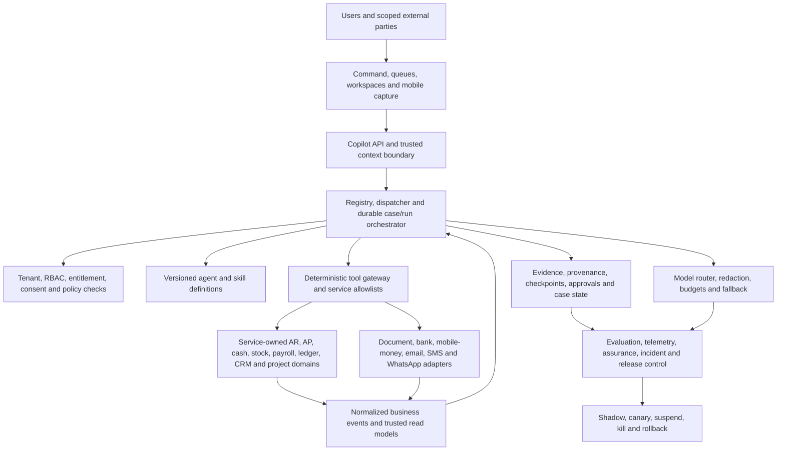
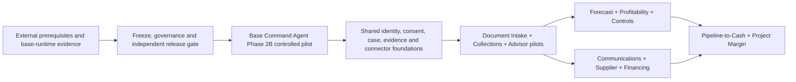

# Stoquify Top 12 Agents and Skills — Complete Execution Roadmap

**Programme date:** 2 August 2026  
**Decision horizon:** 30–36 months, with gated value releases from the first 90 days  
**Authority:** Execution roadmap derived from `STOQUIFY_TOP_12_ADDITIVE_AGENTS_AND_SKILLS_RESEARCH_REPORT_2026-08-02.md` and reconciled against the current Stoquify repository  
**Status:** Implementation-ready programme plan; production activation remains fail-closed  

## 1. Executive decision

Stoquify should approve the complete portfolio as a sequenced programme, but should not launch twelve independent agent projects. It should build one governed execution spine, seven shared foundations, and a series of narrow workflow slices that reuse those foundations.

The recommended order is:

1. **Qualify the existing runtime and close release-evidence blockers.** Product design can continue, but no new external or financially consequential execution should bypass the blocked Phase 2B entry gate.
2. **Build the shared data-trust, document, consent, case, communication, external-identity, evaluation, and product-measurement foundations.**
3. **Release the first value loop:** Mobile Document Intake → Receivables and Collections → Advisor Collaboration, supported by Connector Health.
4. **Add forward decisions and controls:** Cash Forecast, Profitability/Pricing, Continuous Controls, and the shared Omnichannel Communications skill.
5. **Add network and partner workflows:** Supplier Collaboration and Financing Readiness.
6. **Expand into revenue and vertical economics:** Sales Pipeline-to-Cash and Job/Project Margin.

The programme is a **conditional GO** for controlled development and a **NO-GO** for broad autonomy or production activation today. The existing runtime has material foundations, but current repository evidence still records blocked production prerequisites, blocked operational evidence, blocked Phase 2B entry, and 999 structurally defined evaluation cases that have not been executed as a certification corpus.

### Leadership outcome

Fund the programme in stage gates. Authorize Phase 0 and Phase 1 immediately. Release later funding only when measurable trust, adoption, unit economics, and safety thresholds are met. Keep all messages, accounting mutations, payment actions, credit disclosures, price changes, legal threats, bank-detail changes, and statutory representations human-approved until a separately authorized control proves bounded execution safe.

## 2. Scope, assumptions, and definitions

### 2.1 Capabilities in scope

| ID | Capability | Portfolio role | Initial autonomy |
|---|---|---|---|
| C01 | Receivables and Collections Agent | Daily cash outcome | L2 draft-and-approve |
| C02 | Mobile Document Intake and Evidence Capture | Evidence acquisition foundation | L1 read/extract; L2 verified draft |
| C03 | Advisor Collaboration and Review Agent | Referral and trust network | L1 read-only review; L2 draft requests |
| C04 | Cash Forecast and Scenario Planning Agent | Forward decision support | L1 deterministic insight |
| C05 | Omnichannel Business Communications Skill | Shared action channel | L2 approve-before-send |
| C06 | Continuous Controls and Fraud Signals Agent | Cross-domain loss prevention | L1 confidential signals |
| C07 | Profitability and Pricing Intelligence Agent | Margin decision support | L1 analysis; L2 price draft |
| C08 | Connector Health and Data Trust Agent | Reliability prerequisite | L1 monitoring; bounded operator remediation only |
| C09 | Supplier Collaboration Network Agent | Counterparty network | L1/L2 scoped collaboration |
| C10 | Financing Readiness and Consent Package Agent | Evidence-to-finance partner route | L2 consented package preparation |
| C11 | Sales Pipeline-to-Cash Agent | Revenue workflow | L2 quote/follow-up drafts |
| C12 | Job and Project Margin Agent | Vertical economics | L1 analysis; L2 estimate/change drafts |

**Autonomy levels.** L0 is disabled. L1 is read-only analysis. L2 prepares a reviewable draft and requires an authorized human action. L3 is a bounded, reversible, policy-controlled action with an explicit service allowlist and approval policy. L4 autonomous consequential execution is outside this roadmap.

### 2.2 Planning assumptions

- The existing tenant, RBAC, ledger, evidence, provider-event, agent-run, release-control, and Command Agent foundations will be extended rather than replaced.
- Service-owned deterministic code remains the source of truth for amounts, eligibility, accounting, permissions, workflow state, and compliance decisions. Models may classify, summarize, draft, and explain; they do not invent business truth.
- Country coverage is enabled through versioned country packs and legal review, not through a universal “Africa” rule set.
- Estimates are planning ranges, not vendor quotations. Cost ranges assume loaded delivery cost of **€7,000–€13,000 per FTE-month**, plus **€5,000–€35,000 per month** in pilot-stage model, messaging, document-processing, observability, and connector costs.
- External prerequisites—production targets, secrets, workload identity, approvers, statutory experts, provider credentials, pilot tenants, and operational owners—are calendar risks outside engineering’s unilateral control.

## 3. Evidence-led current-state reconciliation

### 3.1 What is present

| Area | Status | Repository evidence | Roadmap consequence |
|---|---|---|---|
| Agent definitions | PRESENT | 9 agents, 28 skills, 37 registry capabilities validate structurally | Extend the registry; do not create disconnected prompts |
| Evaluation definitions | PARTIALLY PRESENT | 999 cases validate structurally but remain `NOT_TESTED` | Convert into executable, evidence-producing certification suites |
| Tenant-scoped runtime | PRESENT, NOT PRODUCTION-QUALIFIED | `AgentRun`, steps, evidence, feedback, cost and incidents; runner/context/policy services | Reuse, then qualify through existing gates |
| Tool registry and policy | PRESENT | Exact tool definitions, policy checks, prohibited-pattern gates | Add capability-specific tools only through allowlisted contracts |
| Rollout controls | PRESENT | Shadow mode, UI visibility control, suspension and kill switch | Preserve fail-closed rollout pattern |
| Command Agent slice | PRESENT, INACTIVE/CONTROLLED | Governed service/action/UI path and daily digest integration | Use as base-runtime pilot before Top 12 execution |
| Provider-event evidence | PRESENT | Provider accounts/events, signatures, idempotency and correlation | Extend to common connector-health contracts |
| Generic external collaboration | PARTIALLY PRESENT | Tenant invitation exists; purpose-bound firm/client/counterparty access is not established | Build external-party identity and resource scopes |
| Durable generic workflow cases | PARTIALLY PRESENT | Agent runs/steps/proposals exist; capability-neutral case lifecycle is not clearly established | Add a case aggregate or extend an existing service-owned case contract |
| General consent ledger | PARTIALLY PRESENT | Domain consent exists; cross-channel, purpose-bound, revocable consent is not proven | Build a common consent service before messaging or finance sharing |
| Document intake | PARTIALLY PRESENT | Upload/evidence patterns exist; universal malware-scanned ingestion, extraction provenance and verification are not proven | Build a reusable intake pipeline |
| Model-provider runtime | NOT PROVEN ACTIVE | Current release evidence identifies `modelProvider: none`; no provider SDK is established in the reviewed package manifest | Introduce provider abstraction only after privacy, cost and evaluation contracts |

### 3.2 Qualification evidence and limitations

- The July runtime completion audit records Phase 0/1 and a narrow inactive Phase 2A slice as implemented, but marks promotion before Phase 2B as blocked.
- The July blocker-elimination report records `REJECTED_NO_GO` for pilot/production while allowing fail-closed development to continue.
- Operational release evidence records **152 blockers**; external-input readiness records **1 of 13** prerequisite groups ready and **102 blockers**.
- Production database targeting, secrets, workload identity, statutory authority, provider credentials, operational ownership, freeze reconciliation, governance approval, Phase 2B entry, and Phase 3 authority remain material gates.
- The architecture graph is dated 14 June 2026 and contains 4,121 nodes, 5,321 edges and 135 communities. It confirms tenant defence, ledger-first operational posting, RBAC hardening, and error-handling control patterns, but it predates the July runtime work and is used as navigation—not current release proof.

### 3.3 Non-negotiable implication

The Top 12 programme may perform discovery, contract design, fixtures, deterministic calculation work, UX prototypes and internal shadow evaluation while external release blockers are being closed. It may not treat those activities as production authorization. Every stage must emit independent evidence and must inherit the stricter of the base-runtime gate and the capability-specific gate.

## 4. Target operating architecture



### Architectural invariants

1. Organization and actor context comes from authenticated server state, never model or client claims.
2. Every tool has a stable ID, versioned input/output schema, authorization policy, idempotency behavior and service owner.
3. Financial and compliance calculations are deterministic and independently testable.
4. Every material output links to source evidence, freshness, assumptions and transformation version.
5. Every side effect has preview, explicit authority, immutable audit, replay protection and safe retry semantics.
6. External access is purpose-bound, resource-bound, time-bound, revocable and denied by default.
7. Model prompts and outputs never receive raw secrets and receive only the minimum necessary personal data.
8. Feature flags, tenant allowlists and kill switches apply at agent, skill, tool, provider, country and tenant levels.
9. A capability cannot promote if the base runtime, its dependencies, or its own evaluation gate is red.

## 5. Shared foundation workstreams

| ID | Foundation | Key deliverables | Primary owner | Exit gate | Estimate |
|---|---|---|---|---|---|
| F-A | Runtime and orchestration | Versioned registry loader, dispatcher, durable run/case state, checkpoints, retries, idempotency, resumable approvals | Principal platform engineer | Crash/retry/replay tests; no duplicate side effects | 24–40 FTE-weeks |
| F-B | Security and authorization | Trusted tenant/actor context, entitlement service, resource scopes, external identities, maker-checker, fresh auth, purpose-bound consent | Security architect | Cross-tenant and privilege-escalation suite 100% pass | 28–48 FTE-weeks |
| F-C | Evidence and data trust | Evidence envelope, hashes, source coordinates, freshness, provenance, document pipeline, connector health and data-quality contracts | Data/platform lead | Every surfaced claim has evidence state; stale data blocks unsafe output | 32–54 FTE-weeks |
| F-D | Model controls | Provider abstraction, redaction, prompt/version registry, structured output, deterministic fallback, cost/latency budgets | AI platform lead | Provider failure and prompt-injection tests; budget enforcement | 20–36 FTE-weeks |
| F-E | Evaluation and assurance | Executable catalog, fixtures, adversarial suites, regression baselines, shadow/canary evidence, independent gate | QA/assurance lead | Required cases executed with signed artifacts and zero critical violations | 36–60 FTE-weeks |
| F-F | User experience | Command surfaces, verification inbox, evidence drawer, approval diff, case timeline, offline/mobile states, accessibility | Product/design lead | Task completion and accessibility thresholds met | 28–46 FTE-weeks |
| F-G | Growth and commercialization | Packaging, entitlements, usage meters, invitation attribution, value telemetry, experiments, customer-success playbooks | Product growth lead | Measured activation/value loop and auditable billing events | 18–30 FTE-weeks |

### Foundation implementation notes

**F-A — runtime.** Extend the current `AgentRun` and step/proposal structures. First publish a decision record on whether a generic workflow-case aggregate is required. Do not force long-lived collection, advisor, supplier or investigation cases into short-lived run semantics if their lifecycle, ownership and legal retention differ.

**F-B — security.** Add `ExternalParty`, `OrganizationRelationship`, `ResourceGrant`, `PurposeConsent`, `ConsentEvent`, `AccessSession` and revocation propagation concepts, or equivalent service-owned schemas. Establish row-level authorization tests for client-firm, buyer-supplier, business-customer and business-finance-partner relationships.

**F-C — evidence.** Standardize an evidence envelope containing organization, source, source version, captured-at, observed-at, freshness policy, hash, transformation chain, confidence, reviewer, retention class and redaction state. Build document ingestion as an asynchronous pipeline: quarantine → scan → identify → extract → validate → duplicate check → human verify → service-owned draft.

**F-D — models.** Start with a provider-neutral adapter. Route low-risk classification and drafting to the least expensive qualified model. Use deterministic or template fallbacks for critical queues. Store prompt/version hashes and evaluation cohort—not unrestricted chain-of-thought.

**F-E — assurance.** Convert 999 cases from catalog entries into runnable fixtures with expected policy, tool, evidence and output assertions. Add cases for every new capability; maintain critical suites for cross-tenant denial, prompt injection, stale evidence, side-effect approval, replay, provider outage, PII leakage and country-pack expiry.

**F-F — UX.** The primary interface is a queue or business cockpit, not a blank chat box. Every recommendation must show “why,” sources, freshness, uncertainty, what will happen, who must approve and how to undo or contest it.

**F-G — growth.** Instrument time-to-first-value, weekly completed outcomes, invitations, accepted invitations, multi-user activation, retained value, expansion, cost-to-serve and trust incidents. Never optimize message volume or invitations without recipient consent and complaint safeguards.

## 6. Dependency map and critical path

### 6.1 Capability dependencies

| Capability | Hard prerequisites | Soft prerequisites | Unlocks |
|---|---|---|---|
| C08 Connector Health | F-A, F-B, F-C, provider contracts | F-E | Every data-dependent capability |
| C02 Document Intake | F-A–F-F, object storage/security | C08 | C01, C03, C06, C09, C10, C12 |
| C01 Collections | AR truth, C08, cases, consent, approval | C02, C05 | C04, C10, C11 |
| C03 Advisor Collaboration | External identity, resource grants, audit | C02, C05 | C09, C10, advisor referral loop |
| C05 Communications | Consent, cases, provider allowlists, webhook verification | C08 | C01, C03, C09, C11 |
| C04 Cash Forecast | Trusted cash/AR/AP/payroll read models, C08 | C01, C02 | C10, executive planning |
| C07 Profitability/Pricing | Cost/revenue read models, deterministic allocation engine | C02, C08 | C11, C12 |
| C06 Controls/Fraud | Normalized events, confidential cases, F-E | C02, C08 | Assurance tier |
| C09 Supplier Network | Proven C03 external access, C02, C05 | C06 | Counterparty network |
| C10 Financing Readiness | Mature evidence grading, consent, C03, C04 | C01, C02 | Regulated partner channel |
| C11 Pipeline-to-Cash | C01, C05, C07, quote/order services | C03 | Revenue suite |
| C12 Job/Project Margin | C07, projects/time/cost models | C02, C03, C11 | Vertical packages |

### 6.2 Critical path



Calendar-critical external inputs are the production deployment target, CI candidate identity, secrets/workload identity, statutory reviewers, provider credentials, named product/security/operations owners, pilot cohort and activation authority. While those are pending, teams may complete contracts, fixtures, synthetic tests and design prototypes; they may not self-authorize a pilot.

## 7. Phased delivery roadmap

| Phase | Calendar | Outcomes | Promotion gate | Indicative cost |
|---|---|---|---|---|
| 0. Mobilize and reconcile | Weeks 0–8 | Programme charter; owner map; authoritative status register; current gate rerun; baseline metrics; architecture decisions; top-three discovery | Evidence register approved; no status contradictions | €250k–€600k |
| 1. Qualify the spine | Months 2–6 | Close base-runtime blockers; executable evaluation harness; consent/external identity/case/evidence contracts; connector health MVP | Phase 2B base-runtime entry 100%; critical security tests pass | €700k–€1.3m |
| 2. First value loop | Months 5–11 | Document Intake pilot; draft-only Collections; read-only Advisor workspace; email communication pilot | Each pilot meets safety, accuracy, task-value and rollback gates | €900k–€1.6m |
| 3. Decisions and controls | Months 9–16 | 13-week cash forecast; profitability; narrow fraud-signal pilots; one approved mobile messaging channel | Deterministic accuracy, false-positive and consent thresholds | €800k–€1.5m |
| 4. Network workflows | Months 14–22 | Advisor firm cockpit; Supplier Collaboration; consented Financing Readiness with one regulated partner | External access, legal, fairness and partner assurance | €900k–€1.7m |
| 5. Revenue and verticals | Months 20–30 | Narrow Pipeline-to-Cash; one Job/Project Margin vertical | Quote/margin/project data-quality and commercial proof | €900k–€1.8m |
| 6. Scale and optimize | Month 24 onward | Country/connector expansion, L3 candidates, marketplace/partner operations, cost optimization | Per-country and per-tool independent promotion | €400k–€1.0m/year incremental |

Phases overlap only where dependencies permit. A recommended 16–22-person cross-functional programme can target 24–30 months. A minimum 10–13-person team should plan for 30–42 months and fewer concurrent pilots. Total internal planning envelope is **€4.8m–€7.8m over 24–30 months**, excluding broad go-to-market spend, acquisitions, regulated-partner capital and country-specific licensing. Funding should be released in gate-based tranches rather than committed as one irreversible amount.

## 8. Capability execution playbooks

### C01 — Receivables and Collections Agent

- **Outcome and users:** Give owners, CFOs and AR staff a daily “get paid” queue that converts overdue invoices into evidence-linked, approved action.
- **MVP:** Aging/risk queue; dispute suppression; contact and consent validation; explainable priority; editable email draft; approval; delivery webhook; promise-to-pay case; reconciled-payment closure.
- **Inputs/outputs:** Customer/invoice/payment history, dispute flags and channel permissions → ranked case, reason codes, message draft, promise and next action.
- **Build/buy:** Build workflow, policy and outcome graph; buy regulated message transport.
- **Controls:** No auto-send; no legal threat, discount, fee waiver, account hold or restructuring without explicit authority; quiet hours; suppression and complaint controls.
- **Milestones:** data contract (2 weeks); queue and rules (4); draft/approval (4); delivery/replies (3); shadow and pilot (4–6). **Estimate:** 12–19 weeks, 5–7 FTE.
- **Acceptance:** zero cross-tenant contacts; zero duplicate sends; 100% evidence-linked priority; ≥90% delivery-state reconciliation; complaint/opt-out below approved threshold.
- **Value hypothesis:** reduce median days-to-pay by 5–12% in eligible pilot invoices and create completed collection work on ≥3 days/week for activated AR users.

### C02 — Mobile Document Intake and Evidence Capture

- **Outcome and users:** Turn photos, PDFs and attachments into verified service-owned drafts without losing provenance.
- **MVP:** Mobile/web upload; signed URL; quarantine and malware scan; receipt/supplier-invoice classification; field extraction; source highlighting; confidence policy; duplicate detection; verification inbox; AP/evidence draft handoff.
- **Controls:** No silent posting; encrypted storage; tenant keys; retention class; PII redaction; content/size checks; sensitive-document reviewer separation.
- **Build/buy:** Buy/adapt OCR and scanning components; build provenance, validation, country layouts and service boundaries.
- **Milestones:** threat model/storage (3); pipeline (5); extraction adapters (5); reviewer UX (4); offline/retry (3); pilot (4–6). **Estimate:** 16–24 weeks, 6–9 FTE.
- **Acceptance:** ≥95% verified accuracy for required header fields in supported document classes; 100% originals/hash/provenance retained; no malware escapes; documented unit cost.
- **Value hypothesis:** cut receipt-to-verified-draft median time by ≥50%; reduce missing-evidence exceptions by ≥20% in activated tenants.

### C03 — Advisor Collaboration and Review Agent

- **Outcome and users:** Give accountants and advisors a purpose-limited multi-client review cockpit and give businesses a simple request queue.
- **MVP:** advisor invitation; firm membership; client-granted scope; evidence request; threaded response; read-only exception/report access; expiry/revocation; access audit.
- **Controls:** no cross-client discovery; resource and purpose scopes; fresh auth; watermark/download controls; explicit advisory/reviewed/certified states.
- **Build/buy:** Build Stoquify trust graph and workspace; buy only commodity identity verification if required.
- **Milestones:** authorization model (4); invitation/relationship (4); request case (4); cockpit (5); denial/adversarial tests (3); pilot (4–6). **Estimate:** 18–26 weeks, 6–8 FTE.
- **Acceptance:** 100% cross-client denial suite; revocation effective within defined SLA; full access audit; ≥60% pilot invitation acceptance.
- **Value hypothesis:** one activated advisor brings or manages ≥3 client organizations over time; reduce evidence-request cycle time by ≥30%.

### C04 — Cash Forecast and Scenario Planning Agent

- **Outcome:** Deterministic 13-week base/downside/upside cash scenarios with explicit assumptions and confidence—not fabricated precision.
- **MVP:** opening cash, AR probability, AP commitments, payroll/tax and recurring flows; assumption ledger; scenario comparison; freshness and driver waterfall; Command card.
- **Controls:** booked facts and assumptions separated visually and in schema; no automated transaction; forecast blocked or degraded when evidence is stale.
- **Build/buy:** Build calculation and scenario storage; optionally use a statistical library for calibrated baselines.
- **Estimate/gate:** 14–22 weeks, 5–7 FTE; pass backtests by horizon and achieve 100% source/assumption traceability.
- **Value hypothesis:** ≥40% of activated owner/CFO users review weekly; forecast error improves against naive baseline over two cycles.

### C05 — Omnichannel Business Communications Skill

- **Outcome:** A reusable, consent-aware message pipeline for all agents.
- **MVP:** versioned templates; preview/edit/approve; email plus one country/provider pilot channel; verified webhooks; inbound reply linkage; opt-out; rate limiting; delivery reconciliation.
- **Controls:** exact provider allowlists; secrets isolation; replay protection; sender verification; quiet hours; emergency suspension; no model access to credentials.
- **Build/buy:** Build policy/orchestration; buy transports.
- **Estimate/gate:** 12–20 weeks, 5–7 FTE; zero duplicate sends in fault injection, 100% consent checks, provider failure recovery demonstrated.
- **Value hypothesis:** reduce workflow response time ≥25% without breaching complaint and opt-out thresholds.

### C06 — Continuous Controls and Fraud Signals Agent

- **Outcome:** Surface confidential, reviewable signals across AP, cash, stock, payroll, approvals and access—not accusations.
- **MVP:** supplier bank-detail change, duplicate-payment/document, approval bypass and payment-destination collision rules; materiality; evidence pack; restricted case; outcome label.
- **Controls:** deterministic features; “signal/requires review” wording; restricted access; no automated discipline or payment block; protected investigation records.
- **Build/buy:** Build control graph and cases; use statistical libraries only after deterministic baseline.
- **Estimate/gate:** 16–26 weeks, 6–9 FTE; confirmed-signal precision target set per control, false-positive budget, zero confidential-case leakage.
- **Value hypothesis:** reduce control review time and establish measurable prevented-loss evidence without alert fatigue.

### C07 — Profitability and Pricing Intelligence Agent

- **Outcome:** Explain margin by item, customer, branch and channel and prepare controlled scenarios.
- **MVP:** contribution-margin engine; cost freshness; versioned allocations; discount leakage; mix/cost waterfall; scenario sandbox; price-floor draft.
- **Controls:** deterministic calculations; assumptions visible; role-scoped margins; no automatic published price changes.
- **Build/buy:** Build native unit-economics layer.
- **Estimate/gate:** 14–22 weeks, 5–7 FTE; calculations reconcile to service-owned totals within agreed tolerance and all allocations are reproducible.
- **Value hypothesis:** identify actionable leakage in ≥30% of eligible pilots and measure realized improvement after approved actions.

### C08 — Connector Health and Data Trust Agent

- **Outcome:** Make stale, missing, duplicated or broken data visible before it contaminates an agent decision.
- **MVP:** connector inventory; last success; SLA/freshness; gap/duplicate/schema drift; credential-expiry metadata; affected-capability map; dead-letter and incident linkage; safe reconnect guidance.
- **Controls:** credentials never enter prompts/logs; signed webhooks; operator approval for credential change; provider isolation.
- **Build/buy:** Build common trust plane; partner country by country for data access.
- **Estimate/gate:** 12–18 weeks, 5–7 FTE; detection/recovery objectives met and stale-dependent agent outputs fail closed.
- **Value hypothesis:** reduce connector-caused support tickets ≥20% and mean time to detection ≥50% in instrumented connectors.

### C09 — Supplier Collaboration Network Agent

- **Outcome:** Move PO acknowledgement, evidence, delivery commitments and disputes into scoped supplier cases.
- **MVP:** supplier invite/signed link; PO acknowledgement; delivery commitment; attachment upload; invoice dispute thread; limited payment status.
- **Controls:** PO/invoice-specific grants; no tenant browsing; attachment scan; fresh auth and independent maker-checker for bank-detail changes.
- **Build/buy:** Build after C03 proves external authorization.
- **Estimate/gate:** 18–28 weeks, 6–9 FTE; external denial suite, bank-change controls, dispute audit and supplier adoption thresholds pass.
- **Value hypothesis:** reduce acknowledgement and dispute cycle times ≥25%; create consented supplier-to-tenant invitations.

### C10 — Financing Readiness and Consent Package Agent

- **Outcome:** Convert daily trusted operations into a consented, time-limited finance evidence package; never claim credit approval.
- **MVP:** readiness checklist; evidence gaps; reconciled summaries; redaction; granular consent; package hash/version; expiry/revocation; partner access log; correction process.
- **Controls:** regulated-partner diligence; country legal review; purpose limitation; no protected-attribute inference, hidden score or data sale; fairness and complaint review.
- **Build/buy:** Build readiness/package layer; partner with regulated institutions.
- **Estimate/gate:** 22–36 weeks plus partner/legal lead time, 6–10 FTE; legal, privacy, fairness, revocation and partner-security gates all green.
- **Value hypothesis:** reduce evidence-preparation time ≥40% and partner turnaround without increasing complaints or unauthorized access.

### C11 — Sales Pipeline-to-Cash Agent

- **Outcome:** Connect a narrow opportunity/quote workflow to approved prices, order/invoice creation, collections and margin.
- **MVP:** lead inbox; qualification; quote draft; margin/discount policy; approved follow-up; acceptance evidence; service-owned invoice handoff; win/loss reason.
- **Controls:** no generic CRM sprawl; contact consent; approved price/discount boundaries; no unapproved commitment or message.
- **Build/buy:** Build narrow native workflow; integrate rather than replace full CRMs when needed.
- **Estimate/gate:** 18–28 weeks, 6–9 FTE; quote correctness, authorization, margin and conversion telemetry pass.
- **Value hypothesis:** reduce quote preparation and quote-to-cash time ≥25% in the target segment.

### C12 — Job and Project Margin Agent

- **Outcome:** Protect margin for one chosen vertical through estimate, commitment, time/cost, change and billing readiness.
- **MVP:** cost codes; estimate draft; budget/actual/commitment; time/expense inputs; change evidence; forecast-at-completion; billing checklist.
- **Controls:** project role scopes; versioned assumptions; client/subcontractor grants; no automatic contract, change order or invoice release.
- **Build/buy:** Build as a vertical package after C07 and C11; select one segment through discovery.
- **Estimate/gate:** 20–32 weeks, 7–10 FTE; source completeness, reproducible forecast, access and vertical product-market proof pass.
- **Value hypothesis:** reduce unbilled work and detect material margin drift earlier in ≥50% of at-risk pilot projects.

## 9. Integrated work breakdown structure

The following epics are issue-tracker ready. “Done evidence” is mandatory, not optional documentation.

| WBS | Epic | Depends on | Owner | Done evidence |
|---|---|---|---|---|
| PGM-001 | Charter, scope, autonomy policy and funding gates | — | Executive sponsor | Signed charter and decision log |
| PGM-002 | Authoritative programme status register | PGM-001 | Programme lead | Reconciled source-linked register |
| PGM-003 | Named RACI, on-call and approvers | PGM-001 | COO/CTO | Accepted ownership roster |
| PGM-004 | Benefits baseline and pilot cohorts | PGM-001 | Product/data | Baseline dashboard and cohort consent |
| RUN-001 | Rerun base runtime entry gates | PGM-002 | Platform assurance | Machine-readable gate artifacts |
| RUN-002 | Close production DB/target and artifact identity | RUN-001 | Platform/DevOps | Immutable candidate proof |
| RUN-003 | Secrets, workload identity and rotation | RUN-002 | Security/DevOps | Secret scan and rotation drill |
| RUN-004 | Operational evidence collectors and alerts | RUN-002 | SRE | Successful dry run and paging evidence |
| RUN-005 | Freeze/drift reconciliation | RUN-001 | Release manager | Zero unexplained drift |
| RUN-006 | Governance and independent approval | RUN-003, RUN-004, RUN-005 | Assurance | Signed gate decision |
| RUN-007 | Phase 2B base Command pilot | RUN-006 | Product/platform | Pilot report and rollback drill |
| FND-001 | Case/run lifecycle ADR | RUN-001 | Architect | Approved ADR and schema decision |
| FND-002 | Durable case/checkpoint implementation | FND-001 | Platform | Recovery/idempotency tests |
| FND-003 | External-party identity and relationship model | RUN-003 | Identity lead | Threat model and denial suite |
| FND-004 | Purpose/resource/time-bound grants | FND-003 | Security | Cross-tenant tests 100% pass |
| FND-005 | General consent ledger and revocation | FND-003 | Privacy lead | Consent lifecycle tests |
| FND-006 | Evidence envelope and freshness policy | — | Data trust lead | Contract tests and sample lineage |
| FND-007 | Document quarantine/storage/scanning | RUN-003, FND-006 | Platform/security | Malware and retention tests |
| FND-008 | Provider-neutral model router | RUN-006 | AI platform | Failure, budget and redaction tests |
| FND-009 | Structured-output and prompt registry | FND-008 | AI platform | Version and schema tests |
| FND-010 | Executable evaluation harness | RUN-001 | QA | Reproducible local/CI run |
| FND-011 | Convert 999 catalog cases | FND-010 | QA/domain owners | 999 executed case artifacts |
| FND-012 | Common connector health contract | FND-006 | Integration lead | Adapter contract suite |
| FND-013 | Evidence/approval/case UX components | FND-002, FND-006 | Design/frontend | Accessibility and usability evidence |
| C08-001 | Connector inventory and freshness read model | FND-012 | Integration | Reconciliation tests |
| C08-002 | Gap/drift/credential warning rules | C08-001 | Integration/SRE | Fault-injection results |
| C08-003 | Trust banners and remediation queue | C08-002, FND-013 | Product | Task test and telemetry |
| C02-001 | Receipt/invoice classification and extraction | FND-007, FND-009 | Document team | Golden-set accuracy report |
| C02-002 | Duplicate and confidence policy | C02-001 | Data trust | Adversarial fixture results |
| C02-003 | Verification inbox and AP draft handoff | C02-002, FND-013 | Product/AP | End-to-end evidence chain |
| C05-001 | Template, consent and provider contracts | FND-005, FND-012 | Communications | Policy tests |
| C05-002 | Approve/send/reconcile email flow | C05-001, FND-002 | Communications | Retry/replay/delivery tests |
| C05-003 | One mobile-message pilot adapter | C05-002 | Communications | Provider/legal/pilot gate |
| C01-001 | AR risk and priority read model | C08-003 | AR/data | Deterministic fixture tests |
| C01-002 | Collection case and dispute suppression | C01-001, FND-002 | AR | Workflow tests |
| C01-003 | Draft, approval, promise and closure loop | C01-002, C05-002 | AR/product | Shadow and pilot outcome report |
| C03-001 | Advisor invitation and firm relationship | FND-004 | Identity/product | Access test suite |
| C03-002 | Evidence request and response case | C03-001, C02-003 | Advisor team | End-to-end pilot evidence |
| C03-003 | Multi-client advisor cockpit | C03-002 | Advisor team | No cross-client leakage; usability pass |
| C04-001 | Forecast source and assumption contracts | C08-003 | Finance/data | Reconciled sample dataset |
| C04-002 | Deterministic 13-week engine | C04-001 | Finance engineering | Backtest report |
| C04-003 | Scenario UX and Command integration | C04-002 | Product | User comprehension test |
| C07-001 | Contribution-margin and allocation engine | C08-003 | Finance engineering | Ledger/read-model reconciliation |
| C07-002 | Scenario and price-draft controls | C07-001 | Product | Approval/assumption tests |
| C06-001 | Confidential investigation case/access | FND-004, FND-002 | Security | Restricted-access tests |
| C06-002 | Bank-change and duplicate-payment signals | C06-001, C02-002 | Controls | Precision/false-positive report |
| C06-003 | Cross-domain signal outcome loop | C06-002 | Controls/data | Outcome and drift dashboard |
| C09-001 | Supplier-specific grants and portal | C03-003 | Supplier team | External denial suite |
| C09-002 | PO acknowledgement and evidence | C09-001, C02-003 | Supplier/AP | Pilot cycle-time report |
| C09-003 | Disputes and bank-change maker-checker | C09-002, C06-002 | Supplier/security | Fraud-control simulation |
| C10-001 | Finance-readiness schema and checklist | C04-003, C03-003 | Finance partnerships | Domain review |
| C10-002 | Consent, package, redaction and revocation | C10-001, FND-005 | Privacy/security | Privacy and revocation test |
| C10-003 | Regulated partner pilot | C10-002 | Partnerships/legal | Signed assurance and outcome report |
| C11-001 | Narrow opportunity and quote contracts | C07-002 | Revenue product | Scope and domain acceptance |
| C11-002 | Quote approval and communication loop | C11-001, C05-003 | Revenue team | Price/discount authorization tests |
| C11-003 | Acceptance-to-invoice/collection handoff | C11-002, C01-003 | Revenue/AR | End-to-end cash trace |
| C12-001 | Select vertical and define project read model | C07-002, C11-001 | Vertical GM | Signed discovery evidence |
| C12-002 | Estimate, cost and change controls | C12-001, C02-003 | Vertical team | Golden project scenarios |
| C12-003 | Forecast-at-completion and billing readiness | C12-002, C11-003 | Vertical team | Pilot margin report |
| REL-001 | Per-capability shadow and canary framework | FND-010 | Assurance | Promotion/rollback proof |
| REL-002 | Country-pack and provider certification | REL-001 | Legal/integration | Versioned approvals |
| REL-003 | Cost, latency, quality and incident SLOs | FND-008 | SRE/FinOps | Operational dashboard |
| REL-004 | Quarterly portfolio continue/pivot/stop review | PGM-004 | Steering committee | Decision and benefit evidence |

## 10. Evaluation and release strategy

### 10.1 Evaluation pyramid

1. **Contract tests:** schemas, tenant context, RBAC, entitlements, consent, tool allowlists and service ownership.
2. **Deterministic unit/golden tests:** calculations, rules, freshness, duplicate detection, idempotency and redaction.
3. **Agent scenario tests:** prompt injection, missing evidence, ambiguity, unsafe requests, refusal and bounded clarification.
4. **Workflow tests:** crash/retry, approval pause/resume, webhook replay, duplicate delivery, revocation, provider outage and rollback.
5. **Security/privacy tests:** cross-tenant and cross-client access, PII leakage, secret exposure, signed-link misuse and malicious documents.
6. **Shadow evaluation:** compare outputs with real workflows without user-visible execution.
7. **Canary pilot:** tenant allowlist, bounded workload, staffed monitoring, predeclared stop conditions.
8. **Independent certification:** Platform Assurance cannot self-certify the capability owner’s assertions; an independent release authority signs the promotion artifact.

### 10.2 999-case conversion plan

- Freeze a catalog version and map every case to owner, risk tier, fixture, expected policy result, expected tool set, evidence requirements and output assertions.
- Implement the highest-risk 150 cases first: tenancy, authorization, prohibited action, stale evidence, financial mutation, external message, consent, privacy, replay and kill switch.
- Execute all 999 in CI against a deterministic stubbed provider and then a qualified live-provider shadow environment where applicable.
- Store run ID, code/artifact identity, model/prompt/tool versions, dataset hash, result, latency, cost and reviewer decision.
- Add capability-specific cases before each pilot; a regression cannot be waived silently.

### 10.3 Promotion gates

| Gate | Minimum evidence |
|---|---|
| Design ready | Product brief, threat model, data map, tool contracts, metrics, stop conditions |
| Build complete | Code review, schema/migration proof, deterministic tests, runbook, telemetry |
| Shadow ready | Critical evaluation pass, no unresolved severity-1/2 issue, cost/latency budget |
| Canary ready | Independent approval, tenant consent, named on-call, rollback rehearsal, provider/legal clearance |
| Scale ready | Value threshold met, trust incidents within budget, unit economics viable, support ready |
| L3 candidate | Separately authorized action, reversible/idempotent tool, maker-checker policy, extended clean canary |

## 11. Value-realization traceability

| Capability | Daily-use value | Retention value | Referral value | Revenue value | Trust/risk value | Defensible asset |
|---|---|---|---|---|---|---|
| C01 Collections | Daily get-paid queue | Outcome history and promises | Customer links and advisor visibility | Premium cash tier/usage | Controlled, evidenced contact | Payment-behavior outcome graph |
| C02 Document Intake | Snap/upload and verify | Evidence archive and less re-entry | Advisor evidence requests | Usage tiers | Provenance, accuracy, malware controls | Labeled regional document corpus |
| C03 Advisor | Request/review queue | Multi-user workflow lock-in | Highest—advisor brings clients | Firm edition/client bundles | Scoped access and review states | Firm-client trust graph |
| C04 Forecast | Runway/driver card | Assumption and outcome history | Share with advisor/lender | Planning tier | Avoids unsupported precision | Forecast/outcome dataset |
| C05 Communications | Act inside workflow | Interaction continuity | Recipient-to-portal invitations | Usage/premium automation | Consent and immutable messaging | Response/outcome history |
| C06 Controls | Confidential signal queue | Loss-prevention dependency | Auditor collaboration | Assurance tier | Material control improvement | Cross-domain control graph |
| C07 Profitability | Margin-move decisions | Proprietary unit economics | Advisor collaboration | Premium analytics | Reproducible assumptions | Business economics history |
| C08 Connector Health | Background trust/readiness | Reliability of every feature | Limited direct | Enterprise reliability | Prevents stale/false answers | Provider remediation knowledge |
| C09 Supplier | PO/dispute queue | Counterparty workflow | Supplier network loop | Network/premium services later | Safer bank changes/disputes | Supplier performance graph |
| C10 Financing | Readiness progression | Operations-to-evidence dependency | Lender/advisor route | Transparent partner/premium model | Consent, redaction, fairness | Consented evidence packages |
| C11 Pipeline-to-Cash | Revenue next actions | Lead-to-cash history | Quote/customer links | Revenue suite | Price/commitment control | Conversion and cash graph |
| C12 Project Margin | Project-risk queue | Vertical system of record | Client/subcontractor links | Vertical package | Change/billing evidence | Estimate-to-realized-margin data |

### 11.1 Explicit value mapping matrix

| Capability | Daily-use value | Retention value | Referral value | Revenue value | Trust value | Cost-reduction value | Data value | Workflow value | Network value | OHADA/African-market value |
|---|---|---|---|---|---|---|---|---|---|---|
| C01 Collections | Faster daily cash recovery decisions | Reusable payer/contact history and promise outcomes | Referral through advisor/customer visibility | Premium for collections stack, upsell probability | Evidence-backed outreach reduces disputes and pressure | Reduced manual follow-up cost and recall time | Enrichment of payment pattern and customer behavior datasets | Queue-first collection workflows reduce churn | Opens advisor-led customer concentration effects | Aligns with OHADA proof-of-cash evidence requirements |
| C02 Document Intake | Immediate document capture and extraction in first workflow step | Lower re-entry and filing friction | Advisor/client access to structured evidence | Usage-based intake and add-on evidence bundle revenue | Document integrity and extraction transparency reduce fraud disputes | Saves clerk labor and accelerates audit-ready closure | Builds trusted regional document corpus with redaction/privacy controls | Standardizes intake workflow across channels | Enables supplier/client evidence exchange later | Supports OHADA invoice/supporting-document compliance |
| C03 Advisor | Shared queue for review + action | Multi-user stickiness and account entanglement | Advisor referrals from proof-ready workflows | Advisory-tier packs and retainer retention | Scoped permissions, provenance and override transparency | Avoids duplicate calls and untracked advice | Produces advisor interaction evidence graph | Institutionalizes review workflow and approvals | Extends advisor recommendation network | Fits advisor-led close standards in OHADA contexts |
| C04 Forecast | Daily scenario visibility before decisions | Better planning continuity in volatile seasons | Shareable scenario packages for teams | Planning-tier upgrade and advisory confidence | Guardrails against unsupported precision | Reduces expensive stock/credit misalignment | Strengthens cash/AR/AP dataset quality | Creates recurring planning cadence | Foundation for commercial negotiation prep with suppliers | Supports liquidity control used in OHADA insolvency controls |
| C05 Communications | In-workflow message control points | Continual operational thread continuity | Partner portal engagement loops | Communication premium and automations | Consent-first trace prevents misuse | Fewer failed follow-ups and lower support churn | Communication outcome logs improve evidence quality | Improves multi-touch sales/cash workflows | Supplier/customer message infrastructure for network effects | Local communication compliance with localized consent |
| C06 Controls | Continuous risk signal loop in daily ops | Builds trust in controls and process discipline | Shared risk signal view for advisors and auditors | Assurance-tier pricing and compliance moat | Hardens early warning and manual escalation | Prevents losses and late remediations | Creates labeled exception dataset | Embeds controls into process rather than post-facto cleanup | Facilitates supplier and partner trust if integrated | Supports OHADA control evidence retention requirements |
| C07 Profitability | Instant margin and pricing context in pricing loops | Keeps teams using one source of truth for price discipline | Advisor and client confidence in profitability discussions | Premium analytics bundle, margin visibility upsell | Deterministic contribution logic reduces pricing disputes | Prevents margin erosion and unnecessary discounts | Creates unit-level profitability knowledge base | Standardizes change-request and pricing workflows | Basis for sector templates and cross-tenant benchmarking | Consistent cost accounting under OHADA costing principles |
| C08 Connector Health | Daily connector trust status in control cockpit | Reduces uncertainty across all daily operations | Faster trustworthy partner onboarding for connected services | Enterprise/regulated reliability package value | Prevents stale data and false assertions | Lowers reconciliation and operational incident costs | Produces source-quality provenance and freshness telemetry | Unblocks safe multi-module operations | Shared reliability signal supports broader integrations | Demonstrates infrastructure quality governance for host jurisdictions |
| C09 Supplier | Faster PO/dispute handling in daily commerce | Strengthens supplier relationship continuity | Supplier-network participation and response referrals | New supplier-network premium later | Consented exchange + role boundaries reduce leakage | Reduces order errors and delays | Builds PO/fulfillment/settlement quality history | Centralizes supplier workflows and commitments | Strongest direct network effect lever | Supports supplier proofing in cross-border trade |
| C10 Financing | Faster financing readiness checkpoints | Keeps teams using Stoquify for decision evidence | Referrals to partner financing channels | Lender readiness/partner transaction fee upside | Consent and evidence controls reduce bias/abuse risk | Reduced manual underwriting support burden | Creates auditable financing evidence pack dataset | Integrates financing posture into existing workflows | Partner network moat with documented consent pathways | Enhances credit evidence maturity for OHADA-compliant lending docs |
| C11 Pipeline-to-Cash | Faster quote-to-cash progression | Keeps revenue process embedded in operations | Increases referrals via better client response | Revenue acceleration and cash visibility features | Evidence-based commitments reduce misunderstandings | Improves conversion without overstaffing sales ops | Adds stage and conversion history for forecasting | Links sales, collections and finance workflows | Expands account-level growth loops | Supports revenue recognition and reporting consistency |
| C12 Project Margin | Faster project risk and margin checks | Increases repeat use for project-heavy clients | Shared estimates and supplier alignment drives referral trust | Verticalized pricing/estimation products | Evidence and assumptions make disputes easier to resolve | Prevents margin shocks and rework costs | Enriches project-time-cost dataset for next period | Creates consistent closeout and change-control workflow | Deepens subcontractor and partner reliance on shared process | Aligns project profitability evidence with OHADA bookkeeping rigor |

### Programme north star and guardrails

**North star:** monthly organizations completing at least three evidence-backed business outcomes across at least two Stoquify workflows, with no material trust-policy violation.

| Dimension | Leading indicator | Lagging indicator | Guardrail |
|---|---|---|---|
| Daily use | Outcome days per active user/week | 8-week retained active organizations | Do not count passive notifications as value |
| Retention | Multi-workflow activation; second user | Gross/net revenue retention | Exportability and revocation remain available |
| Referral | Invitations and acceptance | Referred activated/paying organizations | Consent and complaint rate |
| Revenue | Paid feature activation | Expansion ARR and gross margin | Cost per verified outcome |
| Trust | Evidence coverage; approval comprehension | Critical incidents and disputed outputs | Zero tolerated cross-tenant leakage |
| Operations | Automated detection and successful recovery | Support cost and MTTR | No hidden retry or duplicate action |

## 12. Staffing and operating model

### 12.1 Recommended team

| Function | Recommended FTE | Minimum FTE | Accountability |
|---|---:|---:|---|
| Programme/product leadership | 2–3 | 1–2 | Portfolio, discovery, value gates |
| Platform/runtime/backend | 4–6 | 3 | Orchestration, APIs, cases, service contracts |
| Security/privacy/identity | 2–3 | 1 | Threat models, authorization, consent, incident readiness |
| Data/ML/AI platform | 3–4 | 2 | Evidence, models, evaluation, forecasting/signals |
| Frontend/mobile/design | 3–4 | 2 | Queues, collaboration, verification and accessibility |
| QA/assurance/SRE | 3–4 | 2 | Automation, release gates, observability and operations |
| Domain experts | 2–3 shared | 1 shared | Accounting, collections, OHADA/country rules |
| Partnerships/growth/success | 2–3 | 1 | Providers, advisors, pilots, packaging and adoption |
| **Total** | **21–30** | **13–16** | Some roles may be fractional early |

The 16–22-person delivery assumption used in the schedule reflects ramping and shared/fractional roles. The minimum team must reduce concurrency; it must not remove security, domain review or independent assurance.

### 12.2 RACI matrix

| Workstream | Responsible (R) | Accountable (A) | Consulted (C) | Informed (I) |
|---|---|---|---|---|
| Program baseline & governance | Programme Lead | CTO/CPO | Assurance Authority, Security Lead | All leads |
| Runtime foundations (F-A to F-G) | Platform Lead | CTO | SRE, Security, Product | Programme Lead |
| Shared evidence, consent, trust graph | Security/Privacy Lead | Legal Counsel | Product, SRE, Data Ops | Assurance Authority |
| C01 Collections + Advisor + Document intake | Product Lead (Collections) + Domain Product Manager | Programme Lead | Compliance, Finance, Frontend | Customer Success |
| C04 Forecast + C07 Profitability | Data Finance Lead | Programme Lead | Controller/Accounting, Product | Sales Lead |
| C05 Communications + C06 Controls + C10 readiness | Security & Product Lead | Compliance Officer | Communications, Legal, Partner team | Product Lead |
| Supplier + Project + Pipeline-to-Cash modules | Program Manager | Programme Lead | Sales, Supplier Partnerships, Growth | Finance Lead |
| Evaluation, release, canary, rollbacks | QA/Assurance Lead | CTO/SRE Lead | Product, Security, Programme Lead | All domain leads |

### 12.3 Operating cadence


- Weekly capability delivery and evidence review.
- Fortnightly architecture/security council for contract and autonomy changes.
- Monthly value, cost and trust review with pilot owners.
- Quarterly continue/pivot/stop portfolio decision.
- Incident review within 48 hours for material Copilot, privacy or external-action events.
- Country/provider release is separately versioned; approval in one jurisdiction does not authorize another.

## 13. Commercial and financial plan

### Packaging hypothesis

- **Core:** meaningful document allowance, connector trust, read-only insights and basic advisor invitation.
- **Cash Operations:** Collections, cash forecast and communications usage.
- **Finance Professional:** Advisor cockpit, client bundles, close/evidence collaboration.
- **Controls and Performance:** Continuous controls, profitability and advanced assurance.
- **Network/Partner:** Supplier collaboration and financing-readiness packages, with transparent partner terms.
- **Vertical:** Pipeline-to-Cash and Project Margin packages tailored to chosen industries.

Do not finalize pricing before measuring willingness to pay, cost per verified outcome and support burden. Avoid charging external recipients merely to respond to a request; friction would weaken the referral loop.

### Investment checkpoints

| Checkpoint | Release next funding when… | Stop/pivot when… |
|---|---|---|
| After Phase 0 | owners, prerequisites, baseline and architecture decisions are credible | no accountable release authority or pilot cohort exists |
| After Phase 1 | base runtime and critical evaluation gate are green | tenant isolation or side-effect controls remain structurally unsafe |
| After Phase 2 | top-three pilots show task value, acceptable cost and trust | accuracy/complaints/support costs exceed agreed budgets |
| After Phase 3 | forecasts beat baseline and control signals are useful | users over-trust outputs or false positives remain harmful |
| After Phase 4 | external-network activation and partner economics are proven | legal/consent/fairness risks cannot be bounded |
| After Phase 5 | one revenue/vertical wedge has repeatable economics | generic CRM or broad vertical scope dilutes core advantage |

## 14. Risk register

| ID | Risk | Likelihood/impact | Prevention | Detection/response | Owner |
|---|---|---|---|---|---|
| R01 | Cross-tenant/client data leakage | M/Critical | Trusted context, resource grants, least privilege | Continuous denial tests; kill switch; incident response | Security |
| R02 | Unsafe or duplicate external message | M/High | Approval, idempotency, consent, templates | Delivery reconciliation, complaints, immediate suspension | Communications |
| R03 | Model fabricates financial/compliance truth | M/High | Deterministic services, structured outputs, evidence | Unsupported-claim tests and user dispute flow | AI platform |
| R04 | Stale/broken connector contaminates advice | H/High | C08 trust contract and freshness gates | Trust banner, blocked output, incident queue | Integration |
| R05 | Document malware/PII breach | M/Critical | Quarantine, scan, encryption, retention | Security monitoring and breach runbook | Security |
| R06 | False fraud accusation | M/High | Signal wording, deterministic basis, restricted review | Precision monitoring, correction and appeal | Controls |
| R07 | Forecast false precision | H/Medium | Assumption ledger/confidence, backtests | Error-by-horizon dashboard and degradation | Finance data |
| R08 | External identity/relationship abuse | M/Critical | Purpose/resource/time scopes, fresh auth | Access anomaly and rapid revocation | Identity |
| R09 | Financing privacy/fairness violation | M/Critical | Consent, minimization, partner/legal review | Fairness/complaint audits; suspend partner | Privacy/legal |
| R10 | Provider/country coverage fragmentation | H/Medium | Adapter contracts and staged countries | SLA/incident metrics and fallback | Partnerships |
| R11 | Cost/latency runaway | M/High | Routing budgets, caching, deterministic fallback | Per-outcome FinOps alerts and throttles | AI/SRE |
| R12 | Scope expansion into generic CRM/ERP | H/High | Narrow outcome charters and gates | Quarterly stop/pivot review | Product |
| R13 | Evaluation theater | M/Critical | Runnable fixtures and immutable artifacts | Independent gate and reproducibility audit | Assurance |
| R14 | External prerequisites delay critical path | H/High | named owners/dates/escalation | weekly blocker aging and alternate design work | Programme lead |
| R15 | Low advisor/supplier adoption | M/High | lightweight portal, free response, co-design | funnel/task telemetry and interviews | Growth |
| R16 | Data residency/retention mismatch | M/High | country data map and configurable retention | compliance scan and deletion proof | Privacy |

## 15. First 30, 60 and 90 days

### Days 0–30 — make the programme governable

1. Appoint executive sponsor, programme lead, platform owner, security owner, assurance authority and product owners for C01/C02/C03/C08.
2. Create the authoritative status register and rerun the current runtime gates against an immutable candidate.
3. Turn all external-input blockers into named tasks with owner, evidence requested, due date and escalation path.
4. Freeze autonomy policy at L0–L2; publish the prohibited-action catalog.
5. Complete discovery with 8–12 businesses, 4–6 accountants/advisors, and AR/document operators in the first target countries.
6. Baseline days-to-pay, document cycle time, evidence completeness, advisor invitation behavior, connector incidents and current support cost.
7. Approve ADRs for case lifecycle, external-party identity, consent, evidence envelope and provider abstraction.

### Days 31–60 — build the proof foundations

1. Implement the executable evaluation harness and highest-risk 150 cases.
2. Close or evidence production target, CI artifact identity, workload identity, secret handling and operational collectors.
3. Build common connector-health and evidence-envelope contracts with two existing provider adapters.
4. Prototype the verification inbox, get-paid queue and advisor request queue with clickable evidence/approval states.
5. Implement synthetic document quarantine/scan/extract/verify flow and a deterministic collections priority fixture.
6. Finalize pilot tenant selection, data-processing terms, on-call roster, stop conditions and success thresholds.

### Days 61–90 — demonstrate controlled end-to-end slices

1. Execute all 999 baseline cases or publish an explicit blocked exception; no untested case may be reported as passed.
2. Run base Command Agent Phase 2B entry and controlled-pilot rehearsal, including suspension and rollback.
3. Demonstrate receipt/photo → quarantine → extract → human verify → AP draft with complete provenance.
4. Demonstrate overdue invoice → evidence-linked priority → approved unsent message preview → promise case using synthetic data.
5. Demonstrate advisor invitation → resource-scoped request → evidence response → revocation with cross-client denial tests.
6. Present the steering committee with measured accuracy, task completion, cost, security and readiness evidence; authorize or reject live canaries separately.

## 16. Final recommendations by capability

| Capability | Decision | Start now | Delay until | Explicit rejection boundary |
|---|---|---|---|---|
| C01 Collections | START design/build | AR contracts, rules, drafts | outbound send until consent/runtime gates | Autonomous legal threats, discounts or restructuring |
| C02 Document Intake | START | secure pipeline, two document classes | silent posting and sensitive classes | Unverified extraction posted as truth |
| C03 Advisor | START | identity design, requests, read-only cockpit | broader firm powers until denial suite | Cross-client discovery or ambiguous certification |
| C04 Forecast | PREPARE | source contracts/backtests | user pilot until freshness foundation | Model-generated booked facts |
| C05 Communications | PREPARE | consent/templates/provider design | sending until C01/C03 and provider gate | Unapproved mass or consequential messaging |
| C06 Controls | PREPARE narrow rules | confidential cases and deterministic signals | statistical expansion until outcome labels | Automated accusation, discipline or payment block |
| C07 Profitability | PREPARE | allocation engine and data-quality study | price drafts until costs reconcile | Automatic price publication |
| C08 Connector Health | START as foundation | common health model and two adapters | auto-remediation of credentials | Credential exposure to models |
| C09 Supplier | DELAY product pilot | research and authorization reuse | C03 external-access proof | Unverified bank-detail change |
| C10 Financing | DELAY | legal/partner discovery and schemas | mature consent/evidence and regulated partner | Lending decision, hidden score or data sale |
| C11 Pipeline-to-Cash | DELAY | narrow discovery | C01+C05+C07 proven | Generic CRM rebuild or unapproved commitments |
| C12 Project Margin | DELAY | select one vertical | C07 and project/time data ready | Cross-industry generic build |

## 17. Verification record and evidence standard

This roadmap was reconciled against:

- the authoritative Top 12 research report;
- `package.json` runtime/release scripts;
- current `services/agents`, `actions/agents` and Copilot/Command UI surfaces;
- `prisma/schema.prisma` agent, invitation, provider-event and evidence-related models;
- the July phased execution completion audit, blocker-elimination/Phase 3 entry report, operational release evidence, external-input readiness and Phase 3 decision;
- the 14 June architecture graph report.

Required verification commands for programme execution include:

```powershell
npm run prisma:validate
npm run agent:tool-registry:gate
npm run agent:prohibited-action:gate
npm run agent:release-control:gate
npm run ai:copilot:guardrails:gate
npm run agent:phase2a:gate
npm run agent:phase2b:entry:gate
npm run agent:phase3:entry:gate
```

Each command result must be bound to source commit, immutable artifact, environment class and timestamp. A local pass is development evidence; it is not a substitute for production-environment prerequisites, independent approval or a controlled pilot.

## 18. Latest verification run log

Latest executable verification (this run, 2 August 2026)

| Command | Result | Exit code | Duration |
|---|---|---:|---:|
| `python docs/copilot/stoquify-agent-skill-definition-suite/scripts/validate_suite.py` | PASS (agents=9, skills=28, capabilities=37, cases=999) | 0 | 3.2s |
| `npm test -- --runInBand services/agents/portfolio/__tests__/connector-inventory-read-model.service.test.ts services/agents/portfolio/__tests__/connector-health.service.test.ts services/agents/portfolio/__tests__/evidence-trust.contracts.test.ts` | PASS (3 suites, 15 tests) | 0 | 26.1s |
| `npm run typecheck` | PASS | 0 | 34.6s |
| `npm run prisma:validate` | PASS | 0 | 11.1s |
| `npm run agent:tool-registry:gate` | PASS | 0 | 3.4s |
| `npm run agent:prohibited-action:gate` | FAIL (services/agents/portfolio/connector-inventory-read-model.service.ts Prisma DB import outside governance boundary) | 1 | 3.9s |
| `npm run agent:release-control:gate` | PASS | 0 | 4.3s |
| `npm run ai:copilot:guardrails:gate` | PASS | 0 | 3.4s |
| `npm run agent:phase2a:gate` | PASS | 0 | 3.4s |
| `npm run agent:phase2b:entry:gate` | BLOCKED (2/23 passed, 21 blockers) | 1 | 3.6s |
| `npm run agent:phase3:entry:gate` | BLOCKED (0/34 passed, 34 blockers) | 1 | 3.5s |
| `npm run agent:external-inputs:report` | EXTERNAL_INPUTS_REQUIRED (1/13, 102 blockers) | 0 | 3.6s |

All command results are commit-stamped and used as part of Phase 0 evidence; FAIL/BLOCKED items are intentionally treated as hard guards, not defects.

## 19. Approval requested

Leadership should approve:

1. Phase 0 and Phase 1 funding and named accountability.
2. The top-three value loop plus Connector Health as the first delivery portfolio.
3. The L0–L2 autonomy ceiling and prohibited-action boundaries.
4. A gate-based 24–30 month programme envelope, reviewed quarterly.
5. External prerequisite acquisition—production target, identities, secrets, approvers, statutory reviewers, provider credentials and pilot organizations—as first-class programme work.

The immediate next move is not to write twelve prompts. It is to close the runtime qualification gap while producing the shared contracts and three end-to-end evidence-backed pilot slices that prove Stoquify can safely turn trusted business data into repeated outcomes, collaboration and referrals.


