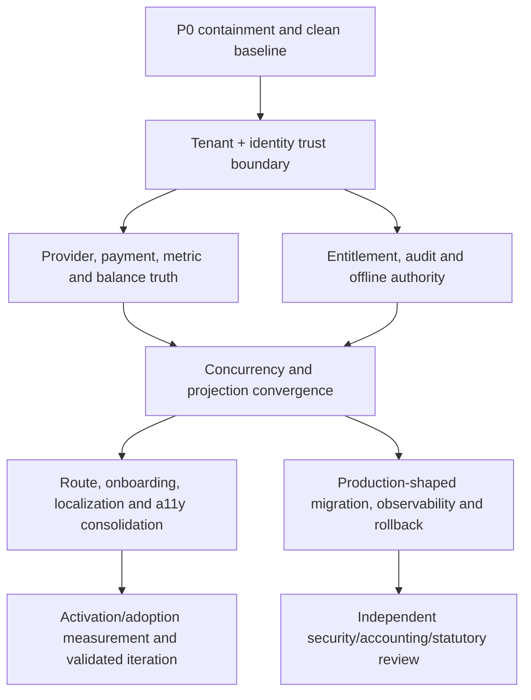

# Stoquify Completion Roadmap — 2026-08-03

## Strategy

Preserve the service-owned operational core. Sequence structural truth and control work before route polish or feature expansion. Every phase must ship as a reversible, independently testable slice with tenant-safe migrations and append-only evidence preserved.

## Dependency order

## Now — P0/P1 containment and structural trust

### 0. Establish a clean candidate and freeze authority claims

- **Problem:** current audit snapshot has 1,561 status entries; evidence cannot serve as immutable release proof.
- **Owner:** release manager/platform lead.
- **Action:** choose a clean candidate commit, preserve current containment, create an evidence manifest, and freeze claims of production/statutory/provider readiness.
- **Metric:** zero unexplained worktree changes in release rehearsal.
- **Acceptance:** commit/tree hash, build inputs, environment, evidence outputs, and reviewer identity are immutable and reproducible.
- **Rollback:** discard candidate branch; do not delete append-only evidence.

### 1. Tenant isolation pilot

- **Roles/control:** all tenants; confidentiality, integrity, financial correctness.
- **Owner:** platform security/data.
- **Action:** implement scoped repository/client for one high-risk domain, explicit unscoped escape inventory, composite tenant constraints, and RLS where justified.
- **Dependencies:** ADR approval; additive migration; disposable PostgreSQL.
- **Metric:** 100% adversarial tenant tests denied at persistence; zero unreviewed raw-client use in pilot.
- **Acceptance:** action/API/service/worker negative tests, migration rehearsal, rollback, query-plan review, and independent security review.

### 2. Identity and privileged assurance

- **Owner:** identity/security.
- **Action:** digest-only invitation tokens with one-use CAS; complete MFA enrollment/challenge; require MFA-level fresh auth for user administration, payment release, payroll, close certification, and sensitive settings.
- **Metric:** zero raw invite tokens stored/logged; 100% named high-risk commands require correct assurance.
- **Acceptance:** concurrent redemption, expiry/revocation, recovery, session invalidation, and step-up tests.

### 3. Audit and telemetry durability

- **Owner:** security evidence/SRE.
- **Action:** define mandatory versus best-effort events; commit mandatory evidence transactionally or through an atomic outbox; require production log/metric/alert sinks.
- **Metric:** zero privileged state changes without required evidence; bounded outbox/audit lag; synthetic alert delivery within SLO.
- **Acceptance:** audit-sink outage, duplicate/reorder, correlation, retention, access, pager, and recovery tests.

## Next — financial truth and concurrency

### 4. Provider-authoritative tender and refund lifecycle

- **Roles/job:** cashier completes payment; finance proves settlement; accountant closes accurately.
- **Owner:** payments/POS/accounting.
- **Action:** add provisional, authorized, captured, settled, failed, expired, and reversed states; keep electronic funds in clearing/suspense; make signed webhook/statement evidence authoritative; add idempotent refund commands.
- **Metric:** 100% non-cash final states reference verified provider evidence; duplicate callback/refund execution rate zero.
- **Acceptance:** accepted/rejected/timeout/duplicate/reorder fixtures and reconciliation/ledger proof.
- **Rollback:** disable provider activation per tenant while retaining all events/evidence.

### 5. Canonical financial metric catalogue

- **Owner:** finance/accounting snapshots.
- **Action:** define cash collected, revenue, refund, AR, AP, settlement, outstanding, currency, as-of, freshness, and partial-data semantics; migrate all projections to shared fixtures/adapters.
- **Metric:** dashboard, snapshot, finance, export, and close produce identical values for the same fixture.
- **Acceptance:** exhaustive payment-status truth table; cross-surface contract tests; visible source/freshness/definition.

### 6. Exact aggregates and atomic balances

- **Owner:** finance read models/POS.
- **Action:** replace capped-array totals with DB aggregates; retain paginated details; replace read-set balance changes with atomic increment or CAS.
- **Metric:** exact totals above every existing cap; zero lost updates under concurrency; ledger-to-projection variance zero.
- **Acceptance:** >300-record fixtures, simultaneous sale/refund/drawer/credit operations on PostgreSQL, reconciliation evidence.

### 7. Approval and exception concurrency

- **Owner:** purchase-order/purchasing/AP.
- **Action:** transaction-local state reads, status/version CAS for PO approval, deterministic AP exception identity and uniqueness.
- **Metric:** one state transition and one active exception under concurrent calls.
- **Acceptance:** real DB concurrency tests and append-only actor/event evidence.

## Next — modular and offline authority

### 8. Durable module provisioning and enforcement

- **Roles/job:** owner buys/activates modules; admin governs access; users see only valid work.
- **Owner:** modules/commercial/platform.
- **Action:** model package/subscription/entitlement lifecycle, dependencies, suspension, expiry, read-only/deactivation, and server-owned provisioning. Move from observe/legacy to staged default-deny enforcement.
- **Metric:** 100% enforcement candidates mapped and passing route/action/API/worker/read-model negative tests.
- **Acceptance:** absence/suspension/expiry/dependency tests; provider reconciliation; rollback/read-only semantics; UI truth matches server truth.

### 9. Offline original-actor authority

- **Owner:** offline POS/security.
- **Action:** version protocol; persist original actor/device/session/location/module claims per event; record replayer separately; require dedicated replay authority.
- **Metric:** 100% replayed operations retain original actor; no unauthorized replay executes.
- **Acceptance:** cross-user replay, revoked user/device, expired module, duplicate sequence, conflict, and recovery tests.

## Later — product convergence and professional UX

### 10. Canonical route registry and consolidation

- **Owner:** product/frontend.
- **Action:** assign every route owner, persona, job, canonical/alias/demo status, permission, module, telemetry, maturity, and a11y evidence.
- **Immediate decisions:** restrict notifications demo; retire null `/update`; fix user-edit route; redirect duplicate supplier/purchase/location/tax/cash-drawer/item routes.
- **Metric:** zero broken internal links; zero production demo/null routes; duplicate implementations reduced to approved aliases.
- **Acceptance:** route crawl, permission-preserving redirects, support/training migration notes.

### 11. One acquisition and onboarding funnel

- **Owner:** product/growth/customer success.
- **Action:** compare current registration and V2 flow; choose one; route quote-led/assisted intent into a real owner/CRM queue; make setup role/package aware.
- **Metric:** registration completion, time to first location/item/sale/proof, setup completion, denial/dead-end rate.
- **Acceptance:** measured funnel decision; no setup link offered when actor/module cannot perform it; “ask admin/request module” recovery states.

### 12. Localized and accessible authenticated shell

- **Owner:** frontend/localization/accessibility.
- **Action:** localize navigation and command labels; certify owner, cashier, inventory, accountant, and admin golden journeys.
- **Metric:** EN/FR parity; WCAG 2.2 AA evidence; zero critical keyboard/screen-reader/mobile blockers.
- **Acceptance:** desktop/tablet/mobile, keyboard-only, screen reader, focus, error, reflow, contrast, table/chart, and reduced-motion evidence.

### 13. Privacy and integration hardening

- **Owner:** privacy/storage/payments.
- **Action:** private/no-store uploads, streaming, magic-byte validation, quotas/malware policy; minimize/encrypt provider payloads; formalize retention/legal holds/erasure; use RFC CSV parser and versioned timestamp/signature contracts.
- **Metric:** 100% sensitive fields mapped to purpose/access/retention; zero shared-cache tenant documents; provider contract fixtures pass.
- **Acceptance:** content spoof, large file, retention, access, redaction, quoted CSV, timestamp, replay, rotation, and deletion/legal-hold tests.

## Release proof — production-shaped evidence

### 14. Migration, secrets, observability, recovery, and statutory review

- **Owner:** release/platform/SRE/security/compliance.
- **Prerequisites:** clean candidate, isolated production-shaped database, managed secrets, named external systems, approved test authority.
- **Actions:** migration checksum/history/deploy rehearsal; backup/PITR/restore; rollback; provider and alert delivery; secret rotation; SAST/SCA/secret/SBOM/container gates; country-pack source hashes/effective dates/expert approval/authority conformance.
- **Metric:** all named gates pass in the target environment with immutable evidence; recovery objectives met.
- **Acceptance:** independent security, accounting, statutory, and release reviewers sign their own scopes. The implementation team does not self-certify.

## Discovery, not build backlog

The following require user or operating evidence before implementation:

- Additional dashboards or command centers.
- New AI agents or executable automation.
- Extra analytics/report variants.
- Enterprise connectors without named customers and owned provider contracts.
- Complex packaging tiers beyond validated buyer needs.
- Major IA changes beyond confirmed duplicate/broken routes.

## What not to build

- Do not build store credit until an immutable customer credit ledger, reserve/consume/reverse lifecycle, accounting treatment, and reconciliation are approved.
- Do not add provider-specific “paid” badges before provider-authoritative states exist.
- Do not add another reporting layer while current metrics disagree.
- Do not expand agent execution authority while tenant, entitlement, audit, MFA, and maker-checker gaps remain.
- Do not create new route variants for existing jobs.
- Do not add AI where a deterministic rule, checklist, alert, filter, or approval workflow is sufficient.

## Program success criteria

1. Tenant isolation fails closed at persistence.
2. Every final non-cash payment/refund has provider evidence.
3. Financial projections share one semantic contract and exact aggregates.
4. Concurrent balances/approvals/exceptions are deterministic.
5. Privileged mutations have durable evidence and MFA-level assurance.
6. Entitlements are durable, default-deny, and consistent at every boundary.
7. Offline replay preserves original authority.
8. Canonical routes, onboarding, EN/FR, and five golden journeys are proven.
9. Product decisions use privacy-aware outcome telemetry.
10. Production migration, secrets, observability, restore, rollback, provider, and statutory evidence is independently reviewed.
