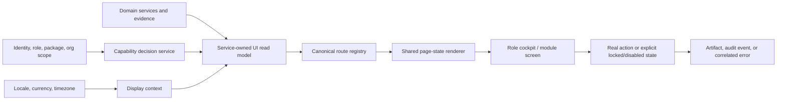

# Stoquify Enterprise UI/UX System Audit

**Audit date:** 2026-08-06  
**Scope:** Public site, authentication, dashboard shell, navigation, inventory, finance, purchasing/AP, POS, HRIS/payroll, compliance, settings, shared UI primitives, accessibility, localization, entitlement UX, and UI release governance.  
**Method:** `aqstoqflow-prompt-architect` full-system discovery protocol, repository/graph inspection, current route smoke screenshots, current WCAG axe scans, route/source heuristics, and review of prior UI/UX certification evidence.  
**Decision:** **NEEDS WORK — not ready for an enterprise UI/UX release certification.**

---

## 1. Executive decision

Stoquify already has the beginnings of a strong enterprise product: the public experience is visually coherent, the dark dashboard identity is distinctive, shared command-center and route-state primitives exist, navigation is permission-aware, and the product vocabulary is increasingly evidence-oriented.

The system is not yet enterprise-grade as a whole because presentation quality is ahead of workflow truth and governance. The most serious defects are not cosmetic:

1. Inventory headline metrics can describe only the current 50-row page while presenting themselves as totals, silently convert failed data calls into empty data, and force USD.
2. Currency and locale formatting remain hard-coded across business-critical surfaces, which can materially misrepresent OHADA/XAF workspaces.
3. Module entitlement coverage is inventoried but still largely an enforcement candidate rather than a consistently enforced UI contract.
4. Several visible export controls are dead or simulated, creating false proof and false completion.
5. Current public/auth routes contain serious WCAG violations; active authentication forms do not expose validation relationships to assistive technology.
6. Multiple aliases and duplicate implementations lead users to different versions of the same task.
7. The appearance setting promises light, dark, and system modes while many screens force a dark root, so preference behavior is inconsistent.
8. Authenticated cross-browser visual and accessibility certification is still incomplete across a 141-page localized surface.

### Release posture scorecard

The scores below are a prioritization rubric, not a user-research benchmark.

| Dimension | Assessment | Enterprise posture |
|---|---:|---|
| Public visual identity | 8/10 | Strong foundation |
| Dashboard design language | 6/10 | Good primitives, uneven adoption |
| Information architecture | 5/10 | Permission filtering helps; duplicate routes and breadth remain |
| Workflow usability | 5/10 | Strong command-center direction, inconsistent task completion |
| Data/financial trust | 3/10 | Release blocker |
| Accessibility | 4/10 | Serious current violations and weak form semantics |
| Localization/OHADA fit | 4/10 | EN/FR routes work; business formatting is not reliable enough |
| Entitlement and role UX | 4/10 | RBAC is meaningful; package/module UX is not yet a closed contract |
| Responsive behavior | 6/10 | Public experience is coherent; dense tables/forms remain risky |
| Release governance | 5/10 | Useful gates exist; authenticated breadth and browser coverage lag |

**Overall verdict:** a promising enterprise UI foundation with **P0 trust, accessibility, and access-boundary defects**. A visual refresh alone would not solve these problems.

---

## 2. Evidence boundary and limitations

### Evidence inspected

- 141 localized `page.tsx` routes, including 126 dashboard routes.
- 81 unique destinations declared by the sidebar configuration.
- 547 TSX files under `app/` and `components/`; 212 are client components.
- Current EN/FR desktop and mobile screenshots for landing, login, and registration.
- Current axe scans for `/en`, `/fr`, `/en/login`, `/fr/login`, `/en/register`, and `/fr/register`.
- Existing UI/UX roadmap, honest review, design-system, shell, robust-state, module-normalization, public-release, HRIS/payroll, and accessibility/visual-regression reports.
- `graphify-out/graph.json` and its generated report for dependency/hotspot context.
- Module surface inventory and current enforcement status.

### Important limitations

- The worktree was already heavily modified. This audit reflects the current workspace state on 2026-08-06; it does not attribute pre-existing changes to this audit.
- No application source was changed. This package adds only audit evidence and this report.
- The current public smoke was executed against the local development server. The first request included development compilation and must not be treated as production performance evidence.
- The in-app browser helper was unavailable because of a Windows sandbox setup failure. Rendered assessment therefore used current Playwright screenshots plus source/evidence inspection.
- No reusable authenticated browser state was available for a complete current sweep of all protected routes.
- Repository counts are deterministic scans; English-literal and theme-use counts are heuristics and indicate migration risk rather than exact user-visible defect counts.
- The graph is useful but stale/partial for current UI work: its main artifact predates recent August changes and reports 755 isolated nodes. It is supporting evidence, not architectural truth.

---

## 3. What is already strong

1. **Distinct product identity.** The current public landing page has a coherent, professional dark visual language, clear headline, strong product framing, and responsive behavior.
2. **Public routes are operational.** The six tested EN/FR landing/login/register routes returned HTTP 200 and produced screenshots.
3. **Permission-aware navigation exists.** The shell filters navigation through the user's permissions, reducing irrelevant first-contact complexity.
4. **Reusable enterprise primitives exist.** Shared command-center, route-state, KPI, evidence, and action components are the right direction for consistency.
5. **The main dashboard uses organization currency.** This is a good reference behavior and demonstrates that correct display context is achievable.
6. **Some exports are real.** Purchase-order export creates XLSX output; it can serve as the reference contract for all export affordances.
7. **Some dense data has a mobile alternative.** Transaction history's responsive card/table pattern is a useful reference for data-heavy modules.
8. **Accessibility and visual checks already exist.** The problem is coverage and enforcement, not a complete absence of tooling.
9. **POS scope is explicit.** Desktop/tablet certification is a defensible product boundary; phone POS is not automatically a defect unless product scope changes.

These strengths should be preserved. The recommended program is a convergence and trust program, not a redesign from scratch.

---

## 4. Release-blocking findings

### P0-01 — Headline inventory metrics do not have a trustworthy aggregation boundary

**Evidence: confirmed in source.** The inventory page paginates to `initialItemData` at line 182 and then calculates total value, profit, low-stock count, and out-of-stock count from that page slice at lines 201–219. It labels them as headline totals and formats value/profit using USD at lines 230–265. Low stock is a hard-coded `< 10`, not the item's reorder threshold or a service-owned policy. Five upstream calls can be converted to `null` and then to empty arrays, making a failed read resemble a genuine zero/empty state.

**Impact:** an owner, inventory controller, or accountant can make a real decision from a partial or failed dataset without being told it is partial. This is an enterprise trust failure and potentially a financial-control defect.

**Remedy:**

- Move KPI aggregation to a service-owned inventory summary/read model scoped by organization, location, filters, and as-of timestamp.
- Return data provenance with every KPI: `scope`, `currency`, `asOf`, `sourceStatus`, and `isPartial`.
- Use item-level reorder thresholds or an explicit organization policy.
- Represent read failure as `error` or `partial`, never as an empty successful collection.
- Add a reconciliation test proving page-size changes cannot change headline totals.

**Acceptance gate:** the same filters return identical headline KPIs for page sizes 10, 25, 50, and 100; failed summary reads render an explicit unavailable/partial state; no KPI defaults to USD.

### P0-02 — Currency and locale are not a system-wide display contract

**Evidence: repository scan.** At least 70 USD/dollar display lines occur across 22 UI files, including inventory, purchase orders, purchases, customer orders, analytics, finance, item forms, notifications, POS, reports, tax forms, and settings. Examples include explicit `formatCurrency(..., "USD")`, `en-US`, `$${amount.toFixed(2)}`, and a `$100` tax example.

**Impact:** an XAF, XOF, EUR, or multi-currency organization can see incorrect symbols, separators, examples, totals, or notification text. In an OHADA product, this is a deal breaker because users cannot distinguish display error from accounting error.

**Remedy:** create one server-derived `DisplayContext`:

```ts
type DisplayContext = {
  locale: string
  currency: string
  timeZone: string
  numberFormat: string
  organizationId: string
  locationId?: string
}
```

Pass it into every financial read model and shared formatter. Ban raw currency symbols, `toFixed()` money UI, and literal production currency codes outside fixtures and currency selectors through lint/CI.

**Acceptance gate:** zero hard-coded money symbols or production currency defaults in app/components business UI; EN/FR snapshots prove XAF, XOF, EUR, and USD formatting; notification text uses the same context.

### P0-03 — Module/package access is not yet a closed UI enforcement contract

**Evidence: current module surface inventory.** The inventory identifies 386 surfaces across 19 modules, 352 mapped surfaces, 259 marked as enforcement candidates, 6 unmapped, and 4 missing permissions. The inventory itself is report-oriented; it does not prove module entitlement enforcement. RBAC is stronger than package/module entitlement coverage.

**Impact:** navigation, quick actions, deep links, API actions, and billing/package state can disagree. Users may see a module they did not buy, be routed into denial states, or believe disabling a module has removed access when a deep surface remains reachable.

**Remedy:**

- Create a single capability decision combining `permission + module entitlement + organization state + location scope`.
- Use the same decision object in server actions, route guards, sidebar, search, dashboard shortcuts, notifications, and command palette.
- Define explicit states: `available`, `locked`, `hidden`, `temporarily_unavailable`, and `not_configured`.
- Add contract tests that enumerate the route registry and prove every protected surface has an entitlement policy.
- Do not certify module packaging until the 259 candidates are resolved or intentionally exempted.

**Acceptance gate:** 100% of registered protected routes/actions have a tested capability decision; UI visibility and server authorization agree for every package/role matrix fixture.

### P0-04 — Visible actions can be dead or simulated

**Evidence: confirmed in source.** Inventory and analytics expose Export buttons without a handler/link. `components/customers/CustomerQuickActions.tsx` lines 66–69 displays “Export Started,” waits two seconds, then displays “Export Complete” without creating a file.

**Impact:** the UI emits false completion and false evidence. This is especially damaging in accounting, audit, reporting, and data-subject workflows.

**Remedy:** define an action capability contract: a visible action must have an executable handler, an explicit disabled reason, or a locked/not-available state. Export completion must be backed by a generated artifact identifier, download URL, row count, filters, and timestamp. Use the working purchase-order XLSX path as the reference.

**Acceptance gate:** zero enabled controls without a real outcome; every export E2E test verifies a file/artifact and its metadata; simulated business success toasts are forbidden outside demos/tests.

### P0-05 — Current public/auth routes have serious WCAG failures

**Evidence: current axe scan.** `/en` has two serious `aria-prohibited-attr` nodes and one serious color-contrast failure; `/fr` has one serious contrast failure. Each tested login/register route has four serious contrast failures. Landing labels use `aria-label` on `div` elements without a supporting role. Small status-chip text is roughly 10 px and below the required contrast; the landing supporting label measured 3.64:1 where 4.5:1 is required.

**Additional source evidence:** active login and registration controls do not provide `aria-invalid`, error `aria-describedby`, error announcement via `aria-live`/`role=alert`, or autocomplete metadata. Validation exists visually but is not programmatically associated.

**Impact:** keyboard and screen-reader users cannot reliably perceive validation or status, and the current public funnel cannot pass an enterprise accessibility review.

**Remedy:**

- Repair invalid ARIA by using semantic groups/regions or removing unsupported labels.
- Raise small-text size/weight/contrast; target at least 4.5:1 for normal text and 3:1 for large text/UI components.
- Standardize accessible field primitives with stable input, hint, and error IDs.
- Add `autocomplete` tokens for identity, company, address, and password fields.
- Announce submit and server errors through an accessible live region; focus the first invalid field.
- Add keyboard-only and NVDA/VoiceOver manual scripts for auth and the top operational journeys.

**Acceptance gate:** zero critical/serious axe violations on certified routes, no keyboard trap, visible focus, successful screen-reader form completion, and WCAG 2.2 AA sign-off.

---

## 5. High-priority systemic weaknesses

### P1-01 — Information architecture contains duplicate and misleading routes

Confirmed examples:

| User intent | Conflicting surfaces |
|---|---|
| Item list | `/dashboard/items` and `/dashboard/inventory/items` |
| Create item | `/dashboard/inventory/items/new` renders management/list behavior while `/create` renders the actual form |
| Supplier management | `/dashboard/suppliersSystem/*` and `/dashboard/purchases/suppliers/*` |
| Create location | `/settings/locations/new` and `/settings/locations/create` |
| Create tax rate | `/finance/tax-rates/create` and `/settings/tax-rates/create` |
| Authentication | `/login` and `/login-v2`; `/register` and `/register-v2` |

**Impact:** bookmarks, support instructions, analytics, permission policies, screenshots, and user mental models split across versions. Duplicate routes multiply regression surface.

**Remedy:** establish one canonical typed route registry with owner, module, permission/capability, breadcrumb, canonical route, aliases, and retirement date. Convert aliases to locale-preserving redirects. Do not keep two active implementations of one user intent.

### P1-02 — Theme preference and actual screen behavior disagree

**Evidence:** appearance settings expose light, dark, and system modes through `next-themes`, but repository scan found 90 forced `.dark` occurrences across 75 files. `app/globals.css` is 1,925 lines with 288 hex literals, 297 RGB/RGBA literals, and multiple theme islands such as `.dashboard-landing-theme` and `.bee-eater-dashboard-theme`. Seventy-three TSX files use manual Tailwind color families rather than semantic tokens; payroll is the largest cluster.

**Impact:** the preference control can report light/system while screens remain dark or partially themed. New work continues to fork the design language and makes accessibility fixes harder.

**Remedy:** either (a) certify dark-only and remove the unsupported appearance promise, or (b) make semantic tokens the only color API and migrate all forced roots. The recommended enterprise option is (b), delivered module by module with visual baselines.

### P1-03 — Dashboard shortcuts are not fully role/capability derived

The shell sidebar is permission-filtered, but the operating-truth shortcut model and dashboard quick actions expose static destinations such as Owner War Room, POS, Inventory, Finance, Payroll, Compliance, Sales, and Purchases without the same capability object. Server authorization may still deny access, but the cockpit can lead a user into a denial instead of presenting their actual work.

**Remedy:** make the role home model server-owned and capability-filtered. Rank tasks by urgency and scope; never render a shortcut the decision engine would deny. Preserve a distinct locked state only when product discovery/upgrade is intentional.

### P1-04 — Registration front-loads marketing and configuration before task progress

Current mobile registration places two large headings, a “workspace control blueprint,” progress information, and step controls before the first input; the first input is below the initial viewport. The three-step flow asks for identity, phone, company metadata, location/address, currency, time zone, locale, password, and terms.

**Impact:** mobile signup requires substantial scrolling before the user can act and asks for operational setup before value is established. This is a conversion and accessibility burden.

**Remedy:** keep initial signup to identity, organization name, password/SSO, and terms. Move operational preferences into a resumable, role-aware onboarding checklist. On mobile, show one concise promise, progress, and the first control in the initial viewport.

### P1-05 — Login is visually polished but cognitively over-composed

The desktop login presents a dense value-proposition/modules panel beside the authentication form, with small status chips and multiple hierarchy levels. It competes with the singular job: sign in safely.

**Remedy:** retain brand confidence but reduce the side panel to one assurance statement, one product proof, and support/security links. Make the form the dominant focal point and remove tiny ornamental status text.

### P1-06 — Route-state behavior is not yet a complete registered contract

The route tree contains 13 layouts, 11 loading files, 23 error files, and one not-found file. Ancestor boundaries provide some coverage, so the raw counts are not themselves a defect. However, 99 files consume shared dashboard route-state primitives while 47 also contain manual state copy. Sixty-one pages use `checkPermission`; explicit RBAC error handling is less consistent, so some denials can collapse into generic failure states.

**Remedy:** every canonical route should declare its supported state contract: `loading`, `empty`, `filtered_empty`, `partial`, `stale`, `error`, `permission_denied`, `module_locked`, `not_configured`, and `success`. Shared primitives must own wording, action policy, logging correlation, and accessibility.

### P1-07 — Large client components concentrate regression and performance risk

Measured hotspots include:

| Component/surface | Approx. lines |
|---|---:|
| Professional POS system | 2,204 |
| Locations management | 1,829 |
| Supplier management | 1,671 |
| Modern create-item form | 1,671 |
| Purchase-order detail | 1,582 |
| Customer management | 1,511 |
| Payment reconciliation | 1,388 |
| Organization table | 1,269 |
| Payroll command center | 1,268 |
| Close assurance | 1,255 |

The dependency graph also marks Professional POS as a dense hotspot (community 28, degree 35). Because the graph is stale, this is corroborating rather than decisive evidence.

**Impact:** changes cross unrelated responsibilities, client bundles grow, isolated tests become difficult, and visual drift becomes more likely.

**Remedy:** split by stable workflow boundaries—not arbitrary file size—into server read model, orchestration shell, table/list, form/dialog, state renderer, and domain actions. Preserve behavior and introduce characterization tests before extraction.

### P1-08 — Authenticated visual certification is narrower than the product surface

There are only nine E2E spec files, eight files using axe, and sixteen screenshot automation files for a 141-page localized surface. Existing governance evidence explicitly leaves authenticated screenshot certification incomplete; public work is strongest in Chromium, with Firefox/WebKit, screen reader, and manual localization coverage still absent.

**Remedy:** certify a risk-weighted matrix: top revenue/control paths first, then every canonical route at least once per theme/locale category. Use reusable role storage states and deterministic fixtures. Treat screenshot absence on a changed high-risk route as a merge blocker.

---

## 6. Medium-priority weaknesses and quality debt

### P2-01 — Dense tables are not governed by one responsive contract

Multiple HRIS, compliance, finance, AP, and inventory tables set minimum widths around 860–1,120 px. Horizontal scroll is sometimes present; mobile card alternatives are inconsistent.

**Remedy:** introduce one enterprise table contract with column priority, sticky identity/action columns, keyboard navigation, density modes, responsive card fallback, preserved filters, bulk-action safety, export parity, and virtualized rendering only when measured.

### P2-02 — Native prompts/confirms create inconsistent high-risk interactions

Accountant access revocation uses `window.prompt` for a reason; item workflows use `window.confirm` for unsaved changes.

**Remedy:** use accessible controlled dialogs with explicit consequences, required reason validation, focus management, escape policy, audit correlation, and retry-safe submission.

### P2-03 — Raw image usage remains in interactive product surfaces

Five raw `` uses remain in POS/item/carousel areas; earlier build evidence reported three no-img warnings.

**Remedy:** adopt the optimized image component where applicable, with explicit dimensions/aspect ratio, meaningful alternative text or empty alt for decoration, and offline/POS fallback behavior.

### P2-04 — Literal UI copy is broadly distributed

A heuristic scan found more than one thousand English-looking literal lines across 129 UI files, while only 51 files directly reference `next-intl`. This is not proof that every literal is untranslated, but it shows a wide bypass surface.

**Remedy:** make localized message IDs or typed co-located copy maps mandatory for user-visible strings. Add extraction checks and EN/FR pseudo-localization snapshots for truncation.

### P2-05 — Global CSS and alternate theme islands are too large to govern safely

The large global stylesheet and module-specific theme roots make it difficult to know which token owns a visible value.

**Remedy:** freeze the semantic token API, move component recipes into shared primitives, and block new literal colors unless documented as data visualization or brand exceptions.

### P2-06 — Some legacy forms have fixed-width assumptions

Older verify/reset/invited forms include fixed `w-[400px]` patterns that can become fragile on narrow screens or high zoom.

**Remedy:** use `w-full max-w-*`, test 320 px and 400% zoom, and enforce reflow without two-dimensional scrolling except genuine data grids.

---

## 7. Multidisciplinary lens review

The prompt-architect skill requires the complete roster for a full-system audit. The table records the decisive contribution of each lens; “secondary” means the lens affects remediation but is not the primary source of a unique defect.

| Lens | Principal conclusion | Applicability |
|---|---|---|
| Product owner / business strategist | The product promise exceeds the current trust contract; prioritize truth and completion before breadth. | Primary |
| UX researcher | Auth cognitive load, duplicate paths, and denial-prone shortcuts need task-based validation with real roles. | Primary |
| UI designer / brand guardian | Strong identity, but token bypasses and alternate theme islands dilute it. | Primary |
| Enterprise UX architect | Canonical route, state, table, action, and role-cockpit contracts are missing or incomplete. | Primary |
| Frontend architect | Oversized client components and global styling concentrate regression risk. | Primary |
| Performance engineer | Client-heavy monoliths and unmeasured authenticated routes require route budgets and production telemetry. | Primary |
| Accessibility specialist | Serious current violations and inaccessible validation block AA certification. | Primary |
| Content/marketing strategist | Landing message is strong; auth/status microcopy is dense, small, and partly ornamental. | Primary |
| Localization specialist | Route localization exists, but business copy and money formatting bypass a reliable locale contract. | Primary |
| OHADA/SYSCOHADA finance specialist | Wrong currency/aggregation can be interpreted as accounting truth; this is unacceptable. | Primary |
| Accountant/bookkeeper/controller | Empty-on-error and simulated exports undermine reconciliation and close evidence. | Primary |
| Financial analyst / analytics reporter | KPI scope, page-size invariance, period, and as-of provenance must be visible and testable. | Primary |
| Internal auditor / evidence collector | Every state-changing/export action needs an artifact, actor, scope, timestamp, and correlation ID. | Primary |
| POS/retail operations specialist | Desktop/tablet boundary is valid; offline, cashier focus, and evidence flows remain high-risk certification paths. | Primary |
| Purchasing/AP specialist | Dense tables, supplier aliases, payment/evidence states, and duplicate paths raise operational risk. | Primary |
| HR/payroll specialist | Payroll has the largest manual-color drift and sensitive workflows need stronger privacy/state certification. | Primary |
| Payments/reconciliation specialist | Partial/stale/unmatched states must never appear as zero or complete; proof must be exportable. | Primary |
| Compliance/legal specialist | Accessibility, consent/terms, privacy, audit trails, and module disclosure need explicit gates. | Primary |
| Cybersecurity/access architect | Permission-aware shell is good; entitlement/role decisions must be identical at UI and server boundaries. | Primary |
| Backend/API architect | Service-owned UI read models and error taxonomy are prerequisites for trustworthy screens. | Primary |
| API tester / QA engineer | Capability matrices, page-state contracts, artifact assertions, and cross-browser fixtures are missing at breadth. | Primary |
| AI engineer / copilot guardrail specialist | AI surfaces must inherit the same evidence, capability, and approval contracts; no separate UI truth. | Secondary |
| Change-management specialist | Route/theme convergence needs deprecation notices, support mapping, and measured adoption. | Primary |

---

## 8. Target enterprise UI architecture

The remedy is a small set of enforceable contracts shared by every module.



### Required contracts

1. **Canonical route registry** — route, aliases, owner, capability, breadcrumb, state contract, telemetry name, retirement date.
2. **Capability decision** — one server-owned result consumed by route guard, navigation, search, shortcut, command palette, and action.
3. **Display context** — one trusted locale/currency/time-zone source used by all read models and notifications.
4. **UI read model** — already aggregated, scoped, formatted only at the edge, with `asOf`, completeness, and provenance.
5. **Page-state union** — loading, empty, filtered empty, partial, stale, error, denied, locked, not configured, success.
6. **Action capability** — hidden/locked/disabled/executable plus reason, audit requirement, idempotency, and expected artifact.
7. **Accessible form field** — label, hint, error, invalid state, autocomplete, focus, and live announcements.
8. **Enterprise data view** — filters, sort, paging, selection, bulk safety, responsive policy, export parity, and saved view.
9. **Semantic design tokens** — no module-specific color system; themes resolve the same semantic roles.
10. **Certification manifest** — route, locale, viewport, browser, role, fixture, screenshots, axe result, performance budget, and reviewer.

---

## 9. Remediation program

### Phase 0 — Stop enterprise release blockers (1–2 weeks)

**Objective:** no screen lies, silently degrades, or reports a false completed action.

- Replace inventory page-derived KPIs with a service-owned summary.
- Introduce the display-context adapter and remove hard-coded currency from inventory, purchasing, finance, POS, notifications, and reports first.
- Remove or disable dead exports; replace the customer simulated export with a real artifact flow.
- Fix current public/auth axe findings and accessible auth validation.
- Convert duplicate create/new routes and V2 aliases into canonical redirects where behavior is equivalent.
- Add explicit error/partial states where data calls currently fall back to empty.

**Exit criteria:** all P0 acceptance gates pass; typecheck/build remain green; no false success toast; public/auth axe has zero serious/critical issues.

### Phase 1 — Close navigation, entitlement, and theme contracts (2–4 weeks)

**Objective:** every user sees one coherent product surface matching role, package, and preference.

- Deliver the canonical route and capability registries.
- Resolve the 259 entitlement enforcement candidates and all unmapped/missing-permission surfaces.
- Make dashboard shortcuts capability-derived.
- Choose and enforce the appearance promise; migrate forced dark roots in the top 20 routes.
- Normalize page states and denial/locked/not-configured behavior.
- Simplify login and shorten initial registration; move setup to resumable onboarding.

**Exit criteria:** route/action matrix agrees with UI visibility; no duplicate active task route; light/dark/system behave as promised on certified routes.

### Phase 2 — Normalize high-risk modules (4–8 weeks)

**Objective:** one enterprise interaction language across operational modules.

Recommended order:

1. Inventory and item creation.
2. Purchasing, suppliers, AP, and purchase orders.
3. Finance, accounting control, reconciliation, and close assurance.
4. HRIS/payroll.
5. Settings/configuration.
6. POS internals while preserving the certified desktop/tablet boundary.

For each module: characterize behavior, split monoliths by workflow, adopt shared table/form/state contracts, remove literal colors/copy, and add role/locale evidence.

### Phase 3 — Continuous enterprise certification (ongoing)

- Chromium, Firefox, and WebKit for risk-tier routes.
- EN/FR plus pseudo-localization and OHADA currency fixtures.
- Desktop, tablet, mobile where supported, 200%/400% zoom, keyboard, screen reader.
- Production Core Web Vitals budgets: p75 LCP < 2.5 s, INP < 200 ms, CLS < 0.1.
- Screenshot diffs for every changed certified route.
- Quarterly task-based research with owner, cashier, inventory controller, purchaser/AP, accountant, payroll operator, and external accountant personas.

---

## 10. Prioritized backlog

| Priority | Work item | Primary owner | Dependency | Done when |
|---|---|---|---|---|
| P0 | Inventory summary/read model and partial-state repair | Inventory + backend + finance QA | None | Page-size invariant, provenance visible |
| P0 | DisplayContext and money-format ban | Platform + finance | Org settings truth | No hard-coded business currency |
| P0 | Real action/export contract | Frontend + backend + audit | Artifact service | Every enabled export yields evidence |
| P0 | Public/auth WCAG repair | Accessibility + auth UI | None | Zero serious/critical; manual flow passes |
| P0 | Module entitlement decision parity | Platform security + billing | Package schema | UI/server matrix fully agrees |
| P1 | Canonical route registry and redirects | Enterprise UX + frontend | Capability model | One route per intent |
| P1 | Capability-derived dashboard cockpit | Dashboard + platform | Capability decision | No denial-prone shortcuts |
| P1 | Theme/token convergence | Design system + module owners | Token freeze | Preference honored consistently |
| P1 | Auth funnel simplification | Product + UX + auth | Content/legal review | First mobile field above fold; fewer required signup fields |
| P1 | Page-state registry | Design system + backend | Error taxonomy | Every canonical route declares states |
| P1 | Authenticated visual matrix | QA + accessibility | Stable role fixtures | Risk-tier matrix green in three engines |
| P2 | Enterprise data-view primitive | Design system + module owners | Page state | Dense modules share one responsive behavior |
| P2 | Monolith decomposition | Module owners | Characterization tests | Stable workflow units and measured bundles |
| P2 | Localization literal migration | Localization + content | Typed messages | No user-visible bypass on certified routes |

---

## 11. Verification and enterprise acceptance gates

### Functional and trust gates

- 100% of visible enabled actions produce a real result or artifact.
- 100% of headline metrics expose scope, period/as-of, currency, and completeness.
- Zero read failures rendered as genuine empty/zero data.
- Zero hard-coded business currency symbols/codes outside fixtures, selectors, and approved examples.
- 100% of canonical protected surfaces have permission + entitlement policy tests.
- 100% of aliases redirect with locale/query preservation and analytics continuity.

### Usability and accessibility gates

- First actionable registration field appears in the initial mobile viewport at 320×568 and 390×844.
- Auth can be completed keyboard-only and by screen reader with announced errors.
- Zero critical/serious axe violations on the certification manifest.
- 400% zoom reflows without two-dimensional scrolling except genuine data tables.
- All dense tables preserve primary identity, row actions, filters, and export on supported mobile views.

### Visual and performance gates

- Top 20 risk routes: EN/FR, desktop/mobile or declared supported viewport, Chromium/Firefox/WebKit, relevant role fixtures.
- Every changed certified route has reviewed screenshots and no unexplained diff.
- Appearance setting matches actual rendered theme.
- Production p75 LCP < 2.5 s, INP < 200 ms, CLS < 0.1; route-specific JS budgets are measured and enforced after baseline capture.

### Recommended commands

```powershell
npm run typecheck
npm run build:app
npm run lint
npx jest --runInBand
node scripts/ui-route-smoke-gate.js --mode fail --base-url http://127.0.0.1:3000 --route public-home --route login --route register --route public-home-fr --route login-fr --route register-fr --require-screenshots
```

The current smoke command and result are preserved in `public-ui-route-smoke.json`. Axe scanning should be promoted from an audit snippet into a reusable, versioned route-matrix script before certification.

---

## 12. Execution briefs

These are implementation-ready handoffs derived from the audit. They are deliberately sequenced; do not start theme polish before truth/access contracts are stable.

### Brief A — UI financial truth and display context

**Objective:** make every money/KPI surface organization-scoped, currency-correct, complete, and provenance-bearing.  
**Scope:** inventory first; then purchasing/AP, finance, POS, notifications, reports.  
**Deliverables:** `DisplayContext`; inventory summary read model; partial/error state; lint/CI currency guard; XAF/XOF/EUR/USD fixtures.  
**Guardrails:** no schema change unless the existing organization currency/time-zone truth is insufficient; no UI total derived from paginated rows; no silent catch-to-empty.  
**Verification:** page-size invariance, failed-read tests, locale/currency snapshots, finance-owner approval.

### Brief B — Canonical route and capability convergence

**Objective:** guarantee one route per user intent and one capability decision at every surface.  
**Scope:** route registry, aliases, sidebar/search/shortcuts, module packages, route/action guards.  
**Deliverables:** typed registry, locale-preserving redirects, capability decision model, role/package test matrix, deprecation map.  
**Guardrails:** preserve existing bookmarks through redirects; never weaken server authorization; locked UI only when an upgrade path is intentional.  
**Verification:** enumerate every canonical route/action and prove UI/server decision parity.

### Brief C — Accessibility and auth funnel

**Objective:** achieve WCAG 2.2 AA and reduce auth cognitive/scroll burden.  
**Scope:** landing, login, register, forgot/reset/invited, shared auth fields/dialogs.  
**Deliverables:** semantic groups, accessible field/error primitives, autocomplete, live errors, simplified mobile hierarchy, resumable onboarding handoff.  
**Guardrails:** preserve legal consent; do not hide required security context; do not use color alone for status.  
**Verification:** axe, keyboard, NVDA/VoiceOver, 320 px, 400% zoom, EN/FR, conversion telemetry baseline.

### Brief D — Design-system and authenticated certification

**Objective:** converge every risk-tier module on semantic tokens and shared states/tables, then certify it.  
**Scope:** forced dark roots, payroll drift, alternate themes, table/form/state primitives, screenshot manifest.  
**Deliverables:** token exception register, migration map, risk-tier route matrix, three-engine screenshots, deterministic role fixtures.  
**Guardrails:** preserve specialty POS density and desktop/tablet scope; do not rewrite working domain logic during visual migration.  
**Verification:** token/literal scan, visual diff, axe, browser matrix, production performance telemetry.

---

## 13. Evidence artifacts

- `public-ui-route-smoke.json` — current six-route public/auth smoke result.
- `screenshots/public/` — current EN/FR desktop/mobile screenshots.
- `thumbnails/` — first-viewport diagnostic previews used for visual review.
- `docs/UI/UX/AQSTOQFLOW_UI_UX_HONEST_REVIEW_2026-06-26.md` — prior honest-review baseline.
- `docs/UI/UX/skill-suite/` — UI/UX phase and governance reports.
- `what-next/module-surface-inventory.md` — current module/access surface inventory.
- `graphify-out/graph.json` and graph report — supporting architecture/hotspot evidence; stale/partial caveat applies.

---

## 14. Non-goals

- No blanket visual rewrite.
- No speculative new features.
- No weakening of RBAC, audit, accounting, or evidence controls for convenience.
- No assumption that mobile POS is required without a product-scope decision.
- No destructive schema or route removal without redirects and usage evidence.
- No cleanup of unrelated dirty-worktree changes.

The shortest path to a modern, professional, enterprise-grade Stoquify UI is therefore: **make displayed truth reliable, close access and action contracts, converge routes/states/tokens, then certify representative role workflows across locales, browsers, accessibility modes, and evidence outcomes.**
