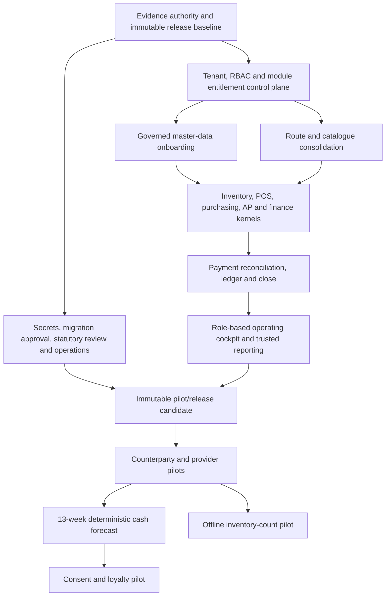

# Stoquify Enterprise Workflow Portfolio Audit

**Assessment date:** 2026-08-15  
**Repository revision:** `4a6cc16`  
**Assessment posture:** point-in-time, evidence-led, non-certifying review of the current dirty filesystem  
**Machine-readable register:** [enterprise-workflow-portfolio-register-2026-08-15.json](enterprise-workflow-portfolio-register-2026-08-15.json)

## Executive decision

Stoquify should **continue development, but keep pilot and production fail closed**. The repository does not support a production-readiness, statutory, security, accessibility or accounting-certification claim today.

The system is more mature than the number of unfinished surfaces initially suggests. Its strongest operational kernels—inventory valuation, POS stock-to-cash, offline POS replay, purchasing/AP controls, supplier management, payment reconciliation, ledger posting, close assurance, evidence exports and much of payroll—have credible local implementations and focused verification. Rebuilding those domains would destroy value.

The main weakness is the layer that turns those kernels into one coherent, sellable and operable SaaS product:

- module access is still observe-only and not backed by a durable subscription/entitlement lifecycle;
- the surface registry and current route wrappers disagree, so enforcement evidence is not yet trustworthy enough to flip globally;
- several user journeys have competing routes or placeholder controls;
- new high-value slices exist but are not fully discoverable, role-separated or release-bound;
- evidence aggregates can become stale and contradict newer direct proofs;
- real provider, secret, qualified-reviewer, scheduler, alert, pilot and production-environment evidence is missing.

The correct strategy is therefore **convergence before expansion**: finish the SaaS control plane, complete the new master-data onboarding slice, remove workflow duplication, close the operating-cockpit gaps, bind proven kernels to one immutable release candidate, and only then add forecast, offline-field and loyalty capabilities.

### Portfolio disposition

| Disposition | Workflow families | Decision |
|---|---:|---|
| Verified in the reviewed scope | 10 | Keep the kernels; add entitlement and production release binding. |
| Implemented, but not release-bound | 5 | Finish browser, operator, aggregate-evidence or rollout proof. |
| Partial | 11 | Complete the missing handoff or consolidate competing journeys. |
| Blocked by repository-owned controls | 4 | Resolve before a release candidate can be trusted. |
| Blocked by external evidence | 5 | Assign named owners and keep production fail closed. |
| Missing strategic capabilities | 4 | Defer until the shared foundations and core release are stable. |
| Duplicate/orphaned portfolio layer | 1 | Redirect, migrate and then retire; do not delete blindly. |

## The answer to “what should we do next?”

In strict order of preference:

1. **Establish one current evidence authority.** Re-run all release aggregates against one immutable revision, reconcile the payroll proof contradiction, and make newer direct evidence invalidate stale summaries.
2. **Complete the module-control foundation.** Reconcile all 408 discovered surfaces, repair the detector/registry, implement durable entitlement states and progressively ratchet from observe to enforce. Do not make a global hard-enforcement flip.
3. **Finish governed master-data onboarding as the first end-to-end product slice.** Add navigation, canonical module ownership, independent approval for high-risk batches, complete browser states, adoption metrics and release evidence.
4. **Consolidate the purchasing and legacy route families.** Make `purchase-orders`, `purchases/suppliers`, `inventory/items` and `finance/cash-drawer` canonical; redirect aliases; remove the hash-only purchase controls after caller migration.
5. **Close the two role-cockpit failures.** Fix role propagation without currency override and implement no-workspace, permission and session states; then unify dashboard, daily digest, manager action center and owner war room under one shell.
6. **Bind proven kernels to a release candidate.** Inventory, POS, offline replay, AP, reconciliation, accounting, close, supplier and public signed-link workflows need immutable revision, migration, browser, operator and rollback evidence—not new domain engines.
7. **Complete provider boundaries.** Replace or disable stub receipt channels, prove payment/provider ingestion and delivery webhooks, and add retry, dead-letter, reconciliation and provider-health operations.
8. **Clear P0 external controls.** Approve or redesign 13 destructive migration statements, complete managed secrets and credential rotation, obtain qualified country-pack approval, and prove CI/scheduler/alert/runbook ownership.
9. **Run narrow real pilots.** Supplier PO acknowledgement and referral attribution must collect production-like delivery, recipient, query, reconciliation and support evidence before expansion.
10. **Only then expand strategically.** Build a deterministic 13-week cash forecast, an offline inventory-count pilot, and a consent-aware repeat-purchase pilot—in that order.

## Scope, method and evidence rules

This was a report-only review. No application source, schema, migration, seed, environment, data or configuration was changed. The worktree contained 570 modified/untracked paths at the start of assessment; those user changes were preserved. Existing generators that would overwrite repository evidence were not rerun. Current inventories were evaluated in memory or written outside the workspace, and only this report plus its new register were added.

Evidence was ranked as follows:

1. current executable source, current schema and direct read-only runtime results;
2. focused tests and gates run against the current filesystem;
3. newer direct workflow evidence bound to an identifiable environment/revision;
4. dated aggregate gates and readiness reports;
5. strategy documents, remediation plans and proposals.

When sources disagreed, the report did not average them. The newer, more direct proof was used for engineering truth, while the stale aggregate remained a release blocker until refreshed.

### Definition of a complete workflow

A workflow is complete only when all applicable gates are satisfied:

| Gate | Required outcome |
|---|---|
| G0 — purpose | Named persona, trigger, intended outcome and accountable owner. |
| G1 — access | Identity, tenant scope, RBAC, module entitlement, privacy and segregation-of-duties policy. |
| G2 — boundary | Validated inputs, authorized context, safe errors, replay and abuse controls. |
| G3 — command | One service-owned state machine with explicit concurrency and provider-failure rules. |
| G4 — truth | Transactional persistence, monetary precision, idempotency, provenance and rollback/compensation. |
| G5 — evidence | Immutable audit, source links, privacy/redaction, retention and honest trust/certification semantics. |
| G6 — handoff | Reconciled downstream posting, close, provider, event or integration contract. |
| G7 — experience | Discoverable, role-aware, responsive, localized and accessible loading/empty/error/degraded/denied/locked/success states. |
| G8 — release | Unit/integration/contract/migration/browser/failure tests, observability, alerts, runbook, operator, rollout and rollback evidence. |

A green unit test is therefore necessary but not sufficient. A dashboard that reads data without owning the command, evidence, recovery and release path is not a complete workflow.

## Verification performed

| Check | Current result | Interpretation |
|---|---|---|
| `npm run prisma:validate` | PASS | Current Prisma schema validates. |
| `npm run typecheck` | PASS | Current TypeScript compilation succeeds. |
| Focused workflow Jest batch | PASS — 18 suites, 79 tests | Module entitlement, onboarding, role-cockpit detector, daily digest, purchasing/PO, supplier token boundary, referrals and customer statement tests pass. |
| Workflow-assurance runtime table check | READY — 7/7 tables, 3/3 migration rows, 0 blockers | Runtime schema foundation exists. This does not prove schedulers, alert delivery or production operation. |
| Current role-based cockpit gate | BLOCKED — 7/9 | Current source still lacks role propagation without currency override and no-workspace/permission/session states. The detector’s unit test passing does not make the product gate pass. |
| Current module inventory in memory | 408 records; 366 mapped; 293 enforcement candidates; 6 unmapped; 78 missing-permission findings; 76 dashboard-only risks | The commercial/access registry is not ready to enforce. Many findings may be detector false positives because centralized route wrappers are not fully understood. Direct source/tests must arbitrate. |
| Module inventory versus 2026-07-12 baseline | 153 new findings; 48 resolved | Current development and detector drift have outpaced the approved registry baseline. |
| Current API guard inventory in memory | 16 routes + 2 support records; 6 review-required; 0 direct guard issues | Signed/public/service routes appear intentional, but the API and module classifiers must be reconciled before changing guards. |
| Current enterprise release aggregate | BLOCKED | The dated aggregate reports 10 of 12 blocker families open; development can continue, but pilot/production must fail closed. |

### Evidence conflict requiring immediate correction

The 2026-08-11 enterprise release aggregate reports payroll runtime immutability as unverified. The newer 2026-08-12 isolated PostgreSQL proof reports two fresh runs with **9/9 triggers installed and 14/14 forbidden mutations blocked**. The correct conclusion is:

- payroll immutability has credible newer engineering evidence;
- the release aggregate is stale or not consuming that evidence;
- payroll is not production-cleared until the aggregate is regenerated against the selected release revision and the remaining country, secret, database and operator evidence is present.

This is not a cosmetic reporting issue. An assurance system that can continue showing an obsolete failure after a valid proof—or the opposite—cannot be used as the final release authority.

## Current architecture and dependency picture

The repository’s graph evidence is dated 2026-08-09, so it is useful for coupling and ownership analysis but does not include every 2026-08-15 change. The merged graph contains 9,484 nodes and 14,371 edges. Important communities and high-coupling functions support the recommended order:

- actions graph: `safeLoggedActionErrorMessage()` is a 50-edge hub and `scopedOrg()` has 21 edges, showing that safe errors and tenant scoping are cross-cutting release concerns;
- services graph: `hashBusinessPayload()` has 119 edges, `normalizeAssuranceResult()` 48, `createAssuranceSourceHash()` 44 and `recordBusinessEventInTx()` 28, so evidence and business-event changes have unusually broad blast radius;
- accounting close spans service communities 19 and 22; payment reconciliation spans communities 17, 18, 41 and 52; these should remain shared foundations, not be copied into dashboards;
- purchasing is split across purchase-order community 29, AP community 3 and supplier community 39, matching the source-level need to consolidate the user route while preserving distinct service owners;
- agent control is already decomposed across communities 15, 30, 43, 89, 101 and 114; production gaps are operations/evidence, not justification for a larger autonomous-agent design;
- module entitlement is small but cross-cutting, while the current catalogue contains 19 commercial module slugs. That small control surface governs hundreds of pages/actions/APIs and must be stabilized before packaging.

## Material findings and professional recommendations

### F1. Production release remains correctly blocked — P0

The enterprise release aggregate shows only two of twelve blocker families ready. The external-intake report identifies 70 missing evidence items, including production database ownership/evidence, managed secrets, credential rotation, qualified statutory review, scheduler/alert/CI operation and runbook ownership. The agent runtime separately reports 102 missing external inputs.

**Recommendation:** keep the existing posture `DEVELOPMENT_CONTINUES_PILOT_AND_PRODUCTION_FAIL_CLOSED`. Establish a release evidence owner for each blocker, an expiry/freshness rule, one release-candidate revision and one aggregate rerun. No capability should be described as production-ready merely because its local gate is green.

### F2. Module control is the highest-leverage internal gap — P0

`MODULE_CONTROL_MODE` is `observe`; the entitlement service makes every decision allowed in observe mode and reports hard enforcement false. Tenant “activation” currently appends module slugs to `Organization.requestedModules`. There is no complete subscription, package, billing-provider, delinquency, deactivation or shadow-reconciliation lifecycle.

The current inventory finds 293 enforcement candidates. It also finds 78 missing permissions and 76 dashboard-only risks, but direct inspection shows many routes use centralized access helpers that the registry detector may not recognize. The safe conclusion is neither “everything is unprotected” nor “the gate is wrong”: the registry and direct enforcement truth are out of sync.

**Recommendation:** repair the classifier first; map all surfaces to owner/module/permission/intent; introduce durable entitlement states and provider-independent package provenance; run shadow decisions; pilot enforcement on a low-risk module; compare deny decisions with expected access; prove rollback; then ratchet by module. A one-time global switch would create unacceptable tenant lockout and revenue leakage risk.

### F3. New governed onboarding is the right first product slice, but it is not finished — P1

The 2026-08-15 implementation provides tenant-scoped customer/supplier/item CSV staging, validation, approval digests, domain-owned commit, idempotent replay, evidence and control-total reconciliation. Focused tests pass, and opening stock/balances/journals/statutory history are intentionally excluded.

The route is not present in the main sidebar; its action is unmapped in the current module inventory; module entitlement is not enforced; browser/robust-state evidence is incomplete; and the service records the supplied actor as approver without an explicit `approvedBy != uploadedBy` rule. The same permitted operator can therefore stage, approve and commit unless an external policy prevents it.

**Recommendation:** give onboarding a canonical owner and entitlement, make it discoverable, require independent approval for high-risk imports or define explicit risk thresholds, finish accessibility/localization/browser states, add time-to-first-value and import-quality metrics, and bind it to the release aggregate. This is the best immediate high-value workflow because it unlocks every downstream domain without inventing a second source of truth.

### F4. Purchasing has strong services but a fragmented user journey — P1

Purchase-order services, receive-batch controls, analytics and supplier acknowledgement tests pass. Supplier workflow verification also passes within scope. Yet `/dashboard/purchases` and `/dashboard/purchases/[id]` render purchase-detail controls whose edit, email, PDF, receive and convert targets are hashes. A separate `/dashboard/purchase-orders` family implements the canonical order lifecycle. Supplier management is duplicated under `suppliersSystem` and `purchases/suppliers`.

**Recommendation:** preserve distinct domain services but expose one route journey. Make `purchase-orders` canonical for order lifecycle and `purchases/suppliers` canonical for suppliers. Redirect aliases, migrate saved links/callers, measure redirect use, and only then remove duplicate files and stub controls. Ensure receipt and AP conversion remain idempotent during the migration.

### F5. The operating cockpit is almost ready and should be finished before adding dashboards — P1

The current gate passes 7 of 9 checks. It fails role propagation when no currency override is supplied and lacks no-workspace, permission and session states. The codebase also has overlapping dashboard, daily-digest, manager-action-center and owner-war-room read models.

**Recommendation:** fix the two gate failures now, establish one operating-truth contract (role, workspace, currency, freshness, trust and recommended action), then compose role-specific views in one shell. New product work should add cards/actions to that contract rather than create another top-level dashboard.

### F6. Proven kernels need release binding, not rewrites — P2

The following gates are currently strong within their declared scope:

- inventory valuation: 6/6;
- ledger close truth: 10/10;
- payment/cash truth: 12/12;
- purchasing/AP consolidation: 11/11;
- offline POS fiscal replay: 16/16;
- payroll presence: 13/13;
- AI guardrails: 18 controls, zero gate blockers;
- report trust/export: 35/35;
- country adapter pilot: ready;
- workflow-assurance runtime schema: ready.

**Recommendation:** freeze their domain contracts for the release candidate, prove module/RBAC decisions, production migration, browser failure paths, operator runbooks, monitoring and rollback. Do not expand these services while their release evidence is being stabilized.

### F7. Provider boundaries are incomplete — P2/P3

The default receipt provider is explicitly a `StubReceiptDeliveryProvider`; enabled non-WhatsApp delivery attempts remain pending with `stub-*` references. Payment reconciliation has strong matching/suspense/sign-off architecture but still needs real provider ingestion and operational proof. Public customer statements and supplier acknowledgements have good signed/redacted access boundaries but still require delivery, recipient-resolution or real-pilot evidence.

**Recommendation:** maintain a provider-neutral interface, but forbid an unconfigured provider from presenting as a usable channel. Add per-provider credential ownership, health, idempotent request/response logging, webhook verification, reconciliation, retry/dead-letter, rate limits, consent and support runbooks.

### F8. The 19-module catalogue does not match the sellable product — P1/P3

Five catalogue slugs have no current canonical dashboard surface: `presence`, `reports`, `commercial_agents`, `content` and `administration`. Presence functions appear under people/payroll; reports under analytics/accounting; administration and content appear internal; commercial agents overlaps future growth/referral positioning. The sidebar deliberately avoids stale missing routes.

**Recommendation:** do not price or promise these as independent active modules. Consolidate presence into people/payroll and reports into analytics/accounting unless a distinct workflow and package case is approved. Keep content/administration internal-only or deprecate their commercial slugs. Defer commercial-agents packaging until the referral pilot and counterparty model prove value.

### F9. Strategic expansion is valuable, but present sequencing matters — P4

The 2026-08-14 strategy review correctly identifies counterparty collaboration, data onboarding, forecasting, offline field operations and customer growth as valuable gaps. Since then, master-data onboarding and supplier PO acknowledgement have been implemented. The strategy must now shift from “start them” to “finish and release-bind the narrow slices.”

**Recommendation:** after the core release, extend in this order: supplier/customer counterparty pilot; offline inventory count using the POS replay foundation; deterministic 13-week forecast using reconciled data; consent and repeat-purchase pilot. Defer generic case management, connector marketplace, multi-entity consolidation, embedded lending, broad AI autonomy and a full storefront.

## Prioritized initiative portfolio

| Rank | Initiative | Why now | Accountable owner | Exit condition |
|---:|---|---|---|---|
| 1 | Evidence authority and release-baseline refresh | Every later decision depends on current, non-contradictory evidence. | Release assurance + evidence governance | One revision-bound aggregate; payroll contradiction resolved; stale evidence invalidates automatically. |
| 2 | Entitlement and surface-registry ratchet | It is the safety and commercialization boundary for 408 surfaces. | SaaS platform + security | All surfaces classified; durable lifecycle; shadow comparison; one-module enforcement pilot and rollback. |
| 3 | Master-data onboarding completion | Highest immediate adoption and downstream leverage. | Data onboarding + domain owners | Discoverable, entitled, maker-checker, accessible, browser-tested and adoption-measured. |
| 4 | Route/catalogue consolidation | Current duplicates create broken UX, permission ambiguity and maintenance cost. | Platform architecture + product ops | Redirects live, callers migrated, stub controls removed, zero unexplained duplicate ownership. |
| 5 | Operating cockpit completion | Only two known control failures remain and it is the daily adoption surface. | Dashboard + daily habit | 9/9 gate; one role/workspace/currency/freshness contract; complete robust states. |
| 6 | Core-kernel release binding | The strongest value is already implemented but not safely promotable. | Domain owners + release engineering | Immutable candidate passes entitlement, migration, browser, operator, telemetry and rollback gates. |
| 7 | Provider delivery and reconciliation | Stub or unproven external edges prevent real customer outcomes. | Integration platform + payments | Real providers, webhooks, retry/dead-letter, health, consent and reconciliation evidence. |
| 8 | External P0 evidence closure | Secrets, statutory review and destructive SQL are non-delegable release prerequisites. | Named business, security, DBA and compliance owners | 13 SQL statements decided; managed secrets/rotation complete; qualified approval and runbooks present. |
| 9 | Narrow counterparty/referral pilots | Converts verified code into real usage evidence without platform sprawl. | Product ops + purchasing/growth | Real recipients, delivery, support, metrics and failure evidence satisfy pilot manifests. |
| 10 | Forecast/offline-count/loyalty expansion | These add strategic value only after source data and operations are trustworthy. | Product strategy + relevant domains | Each begins as one bounded pilot with explicit dependencies and measurable value. |

## Sequenced delivery roadmap

### Wave 0 — Evidence and safety baseline (immediate)

- Select one candidate revision and freeze the evidence manifest for assessment.
- Refresh release aggregates; reconcile payroll immutability and module/API classifier differences.
- Decide every destructive migration statement by exact hash.
- Assign external evidence owners, due dates, validity periods and escalation paths.
- Keep all pilot/production toggles fail closed.

### Wave 1 — Shared product-control foundation

- Repair the module surface classifier to understand route-access wrappers.
- Classify all 408 surfaces by canonical owner, module, permission and external intent.
- Define durable entitlement, package provenance, deactivation, override, reconciliation and rollback states.
- Pilot enforcement on a low-risk, non-financial module and compare shadow/actual decisions.
- Establish the shared maker-checker/override contract and risk matrix.

### Wave 2 — Finish current vertical slices

- Complete governed master-data onboarding.
- Consolidate purchase-order, supplier, item and cash-drawer routes.
- Close the two operating-cockpit failures.
- Release-bind supplier PO acknowledgement and public customer statement workflows.
- Refresh payroll aggregate evidence and close current browser/operator gaps.

### Wave 3 — Provider and operational readiness

- Replace/disable receipt stubs and integrate real delivery reconciliation.
- Prove real bank/mobile-money/payment-provider ingestion and failure recovery.
- Configure managed secrets, rotation, scheduler, alert, CI and incident runbooks.
- Run restore, rollback, queue retry/dead-letter and degraded-provider drills.

### Wave 4 — Controlled pilot and release

- Create one immutable release candidate and rerun all focused and enterprise gates.
- Run bounded supplier acknowledgement and referral pilots with real recipients.
- Collect operator/support evidence, accessibility checks and performance/cost telemetry.
- Promote only when every P0 gate and explicit owner approval is current.

### Wave 5 — Strategic expansion

- Extend the counterparty relationship/grant model only from proven supplier/customer public boundaries.
- Pilot offline inventory count using the existing POS edge/replay contract.
- Build a deterministic 13-week cash forecast from reconciled AR/AP/payroll/cash snapshots.
- Pilot consent and repeat-purchase value only after referral attribution and identity are proven.

## Continue, complete, consolidate, defer and remove

### Continue and protect

- Inventory valuation and movement truth.
- POS transaction, payment/cash and offline replay kernels.
- Purchasing/AP service boundaries and supplier workflow.
- Payment matching, suspense, sign-off and invalidation.
- Ledger, close assurance, evidence hashing/redaction and report trust.
- HRIS/payroll immutability and self-service boundaries, subject to refreshed release evidence.
- Signed, scoped and revocable public-access patterns for receipts, statements and supplier envelopes.

### Complete now

- Module entitlement lifecycle and surface registry.
- Governed master-data onboarding productization.
- Purchase-order user journey and real action controls.
- Role-based operating cockpit robust states.
- Evidence freshness/invalidation and release aggregation.
- Real provider delivery/reconciliation and operational ownership.

### Consolidate, then retire

| Current asset | Canonical destination | Safe treatment |
|---|---|---|
| `/dashboard/purchases/[id]` and root purchase-detail duplicate | `/dashboard/purchase-orders/[id]` and a real purchasing landing | Replace stub controls, redirect, migrate saved links, observe telemetry, then remove duplicate implementation. |
| `/dashboard/suppliersSystem` | `/dashboard/purchases/suppliers` | Preserve auth and IDs through redirects; remove after callers/tests move. |
| `/dashboard/items` | `/dashboard/inventory/items` | Redirect legacy route; retain compatibility until usage is negligible. |
| `/dashboard/cashDrawer` | `/dashboard/finance/cash-drawer` | Redirect; ensure register/location/currency state is preserved. |
| `customerActions.ts` and `customerAction2.ts` | Canonical customer-management actions/service | Migrate callers, retain compatibility exports temporarily, then remove. |
| `notifications-demo` | Internal story/demo or real notification center | Hide behind an internal flag or remove from production exposure; do not present demo state as an operational control. |
| Catalogue `presence` | People/payroll | Merge unless an independently priced attendance workflow is approved. |
| Catalogue `reports` | Analytics/accounting reporting | Merge unless a distinct package with canonical route, permissions and lifecycle is defined. |
| Catalogue `content`, `administration` | Internal capabilities | Mark internal-only or deprecate commercial slugs. |
| Catalogue `commercial_agents` | Future referral/counterparty growth | Defer packaging until a real pilot proves separate value. |

The `StubReceiptDeliveryProvider` should **not** simply be deleted: replace it with a configured provider boundary or fail closed/disable the affected channels so pending stub responses cannot be mistaken for delivery.

### Defer deliberately

- generic counterparty case-management platform;
- broad connector marketplace;
- multi-entity consolidation;
- embedded lending or credit decisioning;
- autonomous accounting/payment agents;
- full CRM/campaign suite and storefront;
- AI forecasting before a deterministic reconciled forecast exists.

## Risk register

| Risk | Likelihood | Impact | Control decision |
|---|---|---|---|
| Global entitlement enforcement locks out valid tenants | High if rushed | Critical | Classifier repair, shadow mode, low-risk pilot, deny comparison and rollback. |
| Stale evidence authorizes or blocks the wrong release | High | Critical | Revision binding, freshness/expiry, direct-proof precedence and aggregate invalidation. |
| Destructive migration causes unrecoverable loss | Medium | Critical | Exact-hash owner approval or redesign, backup/restore proof and post-deploy reconciliation. |
| Duplicate routes diverge in RBAC or business behavior | High | High | Canonical route decision, compatibility redirects, caller inventory and negative tests. |
| Same actor uploads and approves risky import | Medium | High | Risk-tiered maker-checker and fresh-auth policy. |
| Stub provider is mistaken for successful delivery | High | High | Disable unconfigured channels; real delivery receipts and reconciliation. |
| Country/payroll rule is presented as certified without qualified review | Medium | Critical | Dated provenance, named qualified reviewer, four-eyes approval and claim controls. |
| Agent performs consequential action without operational guardrails | Medium | Critical | Narrow pilot, tool allowlist, human approval, cost/latency limits and incident drill. |
| Strategic expansion creates a second source of truth | Medium | High | Reuse canonical services/events; no dashboard-owned business truth. |
| Dirty-worktree evidence cannot be reproduced | High | High | Select immutable candidate revision and regenerate all evidence before release. |

## Reviewer accountability record

No role issues a certification. Every applicable reviewer has an explicit conclusion:

| Reviewer | Finding |
|---|---|
| Principal enterprise/platform architect | Domain kernels are generally reusable; module control, evidence authority and route convergence must precede expansion. |
| Staff backend/domain and integration engineer | Service-owned purchasing, accounting, reconciliation and payroll boundaries are credible; placeholder UI and real provider failure contracts remain incomplete. |
| Principal data/database and migration architect | Schema validates and 64 migrations replay in the referenced isolated evidence; production remains blocked by 13 unapproved destructive statements and configured seed approval. |
| Principal application-security/IAM/privacy architect | Tenant/RBAC patterns exist, but observe-only entitlement, registry drift, maker-checker gaps, external secrets and credential rotation prevent release. |
| Senior frontend/design-systems engineer | Core surfaces exist, but duplicated route families and a 7/9 cockpit gate show structural UX work remains. |
| Workflow/service UX, accessibility and localization reviewer | Supplier and public signed-link flows have useful state evidence; portfolio-wide WCAG, bilingual copy, no-workspace/session and recovery proof is incomplete. |
| Principal product strategist/business analyst | Finish onboarding, cockpit and purchasing convergence; do not start broad CRM, marketplace or autonomous-agent programmes. |
| Principal quality/release-assurance lead | Current typecheck, Prisma validation and focused tests pass; production certification is unavailable until immutable aggregate gates and failure/rollback evidence pass. |
| Principal SRE/DevSecOps/resilience reviewer | Runtime tables exist, but managed secrets, credentials, schedulers, alerts, runbooks, production telemetry and recovery drills remain blockers. |
| Principal SaaS packaging/billing/product-operations strategist | The 19-module catalogue is not a sellable lifecycle; durable packages, subscriptions, billing and deactivation must follow entitlement stabilization. |
| Finance/accounting/treasury/internal-controls reviewer | Ledger, reconciliation and close kernels are strong; external statements, payment providers, maker-checker and release evidence remain conditions. |
| OHADA/SYSCOHADA/statutory reviewer | Not certified: Cameroon production readiness is 11/12 and lacks qualified source-artifact approval. |
| Audit/evidence/records-governance reviewer | Evidence primitives are strong, but stale aggregate contradiction requires a formal precedence, freshness and invalidation policy. |
| POS/inventory/offline specialist | Online and offline stock-to-cash truth is locally credible; reuse its replay contract for future field work and do not create a second inventory engine. |
| Purchasing/supplier/AP specialist | Supplier and AP workflows are credible; the purchase-order user route must be consolidated and real conversion/payment evidence completed. |
| HRIS/payroll/privacy specialist | Newer immutability evidence is strong; release aggregate, country review, privacy/browser and real declaration/payment evidence remain incomplete. |
| Payments/mobile-money/reconciliation specialist | Matching/suspense/sign-off are strong; real provider ingestion, webhook operations and statement evidence are still required. |
| Accounting close/ledger/reporting specialist | Close readiness is locally strong; every upstream evidence source must have deterministic invalidation before certification. |
| Analytics/BI/metric-governance specialist | Report trust controls exist; canonical report packaging, metric glossary and freshness contracts are prerequisites for forecasting. |
| AI/agent safety/evaluation reviewer | Guardrail code is promising; 102 external runtime blockers and operational evidence preclude consequential production autonomy. |
| API/webhook/event-boundary specialist | Current API inventory shows no direct guard issue, but six routes require intent review and the module/API classifiers must agree. |
| Change-management/training/support reviewer | New workflows need discoverability, role guidance, support ownership, pilot feedback, rollout communication and operational playbooks. |

## Programme controls and completion criteria

The remediation programme is complete only when:

- one immutable release revision owns all current gate evidence;
- every material surface has one module, owner, permission and external intent;
- entitlement decisions are durable, reconciled and progressively enforced;
- no production route exposes a placeholder action as if it were complete;
- onboarding, purchasing and cockpit journeys pass end-to-end browser and robust-state gates;
- all high-risk commands declare maker-checker/fresh-auth rules;
- external provider calls have idempotency, webhook verification, retry/dead-letter, health and reconciliation;
- migration, managed-secret, credential-rotation, statutory-review and operator evidence is current;
- P0/P1 workflows have SLOs, alerts, incidents, runbooks and rollback drills;
- catalogue slugs match actual sellable workflows and subscription states;
- strategic pilots reuse canonical domain services and demonstrate measurable customer value;
- production remains fail closed until every applicable condition is verified.

## Final recommendation

Stoquify’s highest-value path is not “complete every screen.” It is to turn a collection of strong controlled kernels into one governable product system. The immediate programme should be named and managed as a **Convergence and Release Authority Programme** with five outcomes: current evidence, enforced entitlements, first-value onboarding, canonical workflows and production operations.

If those five outcomes are completed in the order above, Stoquify can preserve its strongest competitive advantage—server-owned accounting and operating truth—while becoming easier to adopt, safer to commercialize and materially more valuable. If the team instead begins broad new modules now, it will multiply routes, evidence and operating obligations faster than the control plane can govern them.
