# Stoquify One-Week Meaningful-Progress Recovery Roadmap — 2026-08-10

Workspace: `E:\ohada saas\Focused projects\stoquify`  
Branch at planning time: `codex/service-boundary-burndown`  
Current HEAD: `4a6cc16b56f708fff1130573b60cb6ae6e80a2c6`  
Seven-day window: Monday 2026-08-10 through Sunday 2026-08-16, Europe/Paris  
Planning mode: read-only evidence review plus this single roadmap write

## 1. Executive feasibility verdict

A meaningful, externally inspectable improvement is feasible within seven calendar days. Completion of the whole Stoquify platform is not.

The credible committed outcome is:

> By 2026-08-16, the selected release-hygiene gate set is 8/8 green and the canonical supplier workflow has passed a seven-scenario authenticated browser matrix, including restricted-role denial, default export redaction, safe lifecycle mutation, responsive layouts, keyboard/dialog behavior, accessibility scanning, persistence after refresh, and zero unhandled browser-console errors.

The customer-referral exact release is a stretch outcome. It may reach an isolated, exact Git revision with clean scope, graph, and security-diff evidence during this window. A real referral pilot or production release cannot be committed until external migration approvals, target PostgreSQL access, production secrets, HTTPS origin, provider credentials, Accounting entitlement, and a real consented cohort are supplied.

Feasibility confidence:

- 80% for the release-hygiene greenline if engineering is authorized by 2026-08-10 12:00.
- 70% for supplier browser certification if safe positive, denied-role, and lifecycle fixtures may be created by 2026-08-11 12:00.
- 40% for an exact referral release revision by 2026-08-16 because the current release-scope evidence predates the 562-path HEAD commit and exact Git isolation requires explicit authority.
- 0% for a truthful production referral pilot during this window without the external inputs named above.

This plan requires one primary engineer for five focused weekdays, product/QA participation for supplier acceptance, and either weekend capacity or acceptance that referral isolation remains stretch work.

## 2. Definition of meaningful progress

### 2.1 Committed deliverables

#### C1 — Release Hygiene Greenline

All of the following must pass on the same revision:

1. `npm run typecheck`
2. `npm run prisma:validate`
3. `npm run error:boundary:fail`
4. `npm run regulatory:hardcode:fail`
5. `npm run service:boundary:fail`
6. `npm run inventory:boundary:fail`
7. `npm run hard-delete:fail`
8. `npm run demo:trust:fail`

Current baseline: 6/8 pass. The raw-error and regulatory-hardcode gates fail.

#### C2 — Supplier Workflow Browser Certification

The canonical route is `/dashboard/purchases/suppliers`. Certification requires these seven scenarios:

1. Authenticated permitted user loads the list and sees only the expected tenant’s suppliers.
2. Permitted user creates a uniquely tagged supplier and lands on its detail URL.
3. Detail state remains correct after hard refresh.
4. Permitted user edits the supplier and the change remains after hard refresh.
5. Restricted-role user is denied list, create, detail, edit, export, and lifecycle mutation without data disclosure.
6. Default export omits contact, email, phone, and tax ID; a sensitive export remains step-up/superuser controlled and audited.
7. An unused fixture is archived or a history-bearing fixture is deactivated according to server-owned rules, followed by deterministic cleanup or reset.

Every applicable scenario must also satisfy:

- Desktop Chrome, tablet, and mobile viewport coverage.
- No unexpected horizontal overflow, clipping, or actionable-element overlap.
- No unhandled page, request, or browser-console errors.
- Keyboard traversal and dialog focus/return-focus checks.
- Axe scan with zero critical or serious violations on the list and mutation dialog.
- Screenshots that contain no secrets and no unnecessary PII.
- Focused supplier unit/integration tests remain green.

Current baseline: 0/7 authenticated supplier browser scenarios. Component, service, route, export, and AP tests exist; supplier-specific Playwright setup/spec/projects do not.

### 2.2 Stretch deliverable

#### S1 — Customer Referral Exact Release Candidate

Target:

- Isolated worktree starts from `5d7c73d557e5ca49560fa8627ce45fb75a68de8a`.
- Only approved referral candidate files and approved referral hunks from the four mixed shared files are applied from `4a6cc16b56f708fff1130573b60cb6ae6e80a2c6`.
- Current scope report has zero unclassified paths and zero category conflicts.
- Shared-hunk gate passes.
- Graphs are regenerated on the isolated tree, not copied from the mixed tree.
- An exact Git revision exists.
- A revision-bound security-diff scan has no unresolved critical/high findings.
- Non-production preflight is executed only if a safe target and approvals are supplied.

This is not a production-pilot commitment.

### 2.3 Explicit non-goals for the week

- Whole-platform completion.
- New HRIS, payroll, POS, inventory, country-pack, module-commercialization, AI, or analytics features.
- Supplier data-model redesign or supplier statements.
- Customer high-volume export queue design.
- Broad architecture refactoring.
- Production deployment without target evidence and authority.
- Legal, statutory, tax, accounting, security, privacy, accessibility, or release certification beyond the exact evidence produced.
- A second general audit, new skills, or another roadmap.

### 2.4 What remains after the week

Even if C1, C2, and S1 pass, these remain:

- Real referral pilot evidence and 16/16 production-cohort checks.
- Production migration adoption/checksum/risk approvals.
- Production boundary secrets, HTTPS origin, provider channels, and Accounting entitlement.
- Statutory country-pack qualified-expert approval.
- Customer browser/accessibility certification.
- High-volume/background export design where required.
- Provider, incident-response, support, and adoption evidence.

## 3. Current-truth register

| ID | Workstream/finding | State on 2026-08-10 | Current evidence | Freshness and interpretation |
|---|---|---|---|---|
| T01 | Git revision | Confirmed | HEAD `4a6cc16`, parent `5d7c73d` | Current read-only Git result |
| T02 | Tracked source since assessment | Unchanged | `git status` contains only untracked audit/report artifacts | Same-day gate results remain applicable to tracked code |
| T03 | Current worktree cleanliness | Not release-clean | Eight untracked audit/report files existed before this roadmap | Do not delete them; use a clean worktree for referral isolation |
| T04 | Raw-error boundary | Failing | 2026-08-10 04:11 run: 12 active, 108 allowed, 120 scanned | Current and reproduced |
| T05 | Raw-error breakdown | Ready engineering work | 8 `NEEDS_MIGRATION` accounting rethrows; 4 connector `SERVICE_RAW_DOMAIN_ERROR` findings | Difficult work, not an external blocker |
| T06 | Regulatory-hardcode gate | Failing | 2026-08-10 04:11 run: one critical literal at `scripts/inventory-items-e2e-fixture.js:420` | Current and reproduced |
| T07 | Regulatory finding semantics | Gate classification defect likely | Detector excludes paths containing `fixtures`, but the file name uses singular `e2e-fixture`; gate notes explicitly exclude fixtures | Fix exclusion narrowly with a regression test; do not weaken runtime detection |
| T08 | TypeScript/Prisma/service/inventory/hard-delete/demo gates | Passing | Same-day primary assessment; no tracked source change since | Not rerun to avoid redundant work |
| T09 | Supplier code slice | Conditional pass | 9 suites/38 tests claimed; typecheck, lint, AP gate, service boundary passed | Current implementation evidence, not release certification |
| T10 | Supplier browser evidence | Missing | Supplier report and screenshot README explicitly claim no authenticated run | Current; 0/7 scenarios |
| T11 | Browser infrastructure | Partial but reusable | `playwright.config.ts`, `tests/e2e/auth.setup.ts`, RBAC-negative and accessibility patterns exist | Supplier-specific seed/setup/spec/projects are absent |
| T12 | Customer workflow | Partial | 7 suites/43 tests and export trust 35/35 reported | Older type/build syntax blocker is superseded; browser/accessibility still missing |
| T13 | Referral application workflow | Pilot-capable in seeded PostgreSQL | Takeoff report claims 29 suites/155 tests, browser smoke, build, 62 migrations, graph refresh | Local/seeded evidence only; not production release |
| T14 | Referral scope report | Superseded for current HEAD | Report inspected 556 changed paths and recorded 9 unclassified/4 mixed; HEAD commit later contains 562 paths | Must be regenerated in an isolated worktree |
| T15 | Referral report contradiction | Confirmed evidence-governance issue | Takeoff narrative says zero unclassified, while later canonical scope artifact says 9 | Canonical gate artifact wins; narrative claim is stale |
| T16 | Referral exact revision | Missing | Scope report blocks exact revision, graph-on-isolated-tree, security scan | Internal release work requiring authority |
| T17 | Referral pilot evidence | Genuinely blocked | 0/16; no PostgreSQL target, exact SHA, real cohort, or event evidence | External/operational dependencies |
| T18 | Statutory country pack | Genuinely blocked outside critical path | 11/12; qualified expert approval false | Keep production statutory claims paused |
| T19 | Architecture impact | Large but navigable | Merged graph: 9,484 nodes/14,371 edges; services 5,719/10,287; actions 1,044/1,284; components 1,173/1,089 | Use scoped impact analysis; no broad rediscovery |
| T20 | Central error patterns | Existing reuse point | Actions graph centers `safeLoggedActionErrorMessage()` and `safeSuccessActionErrorResult()`; affected services already import `BusinessRuleError` | Favor canonical typed errors, not new abstractions |
| T21 | Token efficiency | Unverified | No repo-visible AI token/session/cost ledger | Do not invent token totals |
| T22 | Weekly capacity | Unverified | No named owner availability or weekend decision in repository | Day-1 user decision |

## 4. Work-state and multidisciplinary disposition

### 4.1 Work-state summary

Completed and maintained:

- TypeScript, Prisma, service-boundary, inventory-boundary, hard-delete, demo-trust, workflow-runtime, and receipt-token checks passed in the same-day assessment.
- Purchasing/AP, payment/cash truth, offline POS replay, payroll immutability/presence, CI readiness, and settings classification are internally ready.
- Customer referral application behavior has extensive seeded-database and test evidence.

Partially completed:

- Release hygiene: 6/8 selected gates pass.
- Supplier workflow: code/test complete enough for browser certification, but browser evidence is absent.
- Customer workflow: code/test evidence exists; browser/accessibility and production proof remain.
- Referral: application workflow exists; release isolation and target evidence remain.
- Payroll/HRIS: internal controls exist; production statutory/provider evidence remains.

Genuinely blocked:

- Referral target deployment and real pilot evidence.
- Production migration adoption/checksum/risk approvals.
- Production secrets, HTTPS origin, provider channels, entitlement, and real cohort.
- Statutory country-pack expert approval.
- Weekend execution if no responsible owner is available.

Ready internal work, not “blocked”:

- The 12 raw-error findings.
- The fixture-classification hardcode finding.
- Supplier seed/auth/spec construction.
- Referral file/hunk isolation and graph/security preparation after authorization.

Superseded or stale:

- Old raw-error/regulatory reports showing zero findings.
- Old supplier/customer syntax-error narratives.
- The 556-path referral classification as a statement of current HEAD.
- The takeoff narrative’s zero-unclassified claim.

### 4.2 Reviewer disposition

| Lens | Finding |
|---|---|
| Enterprise/platform architecture | Apply. Isolate changes; 562 paths in one commit make exact release construction necessary. |
| Backend/domain/integration | Apply. Preserve transaction semantics while converting unknown raw rethrows to canonical typed errors. |
| Database/migration | Apply. Supplier certification needs reversible fixtures; referral target migration approvals remain external. |
| Security/IAM/privacy/abuse | Apply. Supplier RBAC denial, export redaction, step-up, tenant isolation, screenshot redaction, and referral security diff are acceptance gates. |
| Frontend/design system | Apply. Reuse current supplier dashboard and shared components; no redesign. |
| Workflow UX/accessibility/localization | Apply. Verify EN/FR-safe selectors, keyboard/focus, responsive layouts, and axe results. |
| Product/business process | Apply. Supplier is the closest releasable vertical slice; referral remains stretch. |
| Quality/release assurance | Apply. Require focused tests, browser matrix, one build/policy decision point, and binary acceptance. |
| SRE/DevSecOps/performance/cost | Apply. Use a clean worktree, target-bound evidence, and one build; token telemetry is unavailable. |
| SaaS packaging/adoption | Apply. Purchasing entitlement must remain; referral Accounting entitlement is target-specific. |
| Finance/accounting/reconciliation | Apply. Supplier AP history and accounting error services must preserve source truth; no accounting certification claim. |
| OHADA/SYSCOHADA/statutory | Apply only to gate integrity and external approval. The fixture literal is not evidence of a runtime statutory rule. |
| Audit/evidence/records/data quality | Apply. One canonical roadmap replaces daily reports; screenshots and command logs bind to acceptance IDs. |
| POS/inventory/offline | Not applicable to committed product scope, except the inventory E2E fixture must remain deterministic and runtime inventory code untouched. |
| Purchasing/supplier/AP | Apply fully. This is the committed product slice. |
| HRIS/payroll/employee privacy | Not applicable this week; no related feature work authorized. |
| Payments/provider/settlement | Apply only to accounting error-boundary regression and referral provider prerequisites; no provider rollout. |
| Accounting close/ledger/reporting | Apply to `close-assurance.service.ts` error semantics; do not change close logic. |
| Analytics/metric governance | Apply to daily outcome metrics; no new BI feature. |
| AI/agent governance | Apply to connector-inventory typed errors and token-efficiency stop rules; no agent expansion. |
| API/webhook/event/import/export | Apply to supplier export and referral delivery boundaries; no new provider integration. |
| Change/training/support/rollout | Apply through Day-1 decisions, daily checkpoint, fixture runbook, and go/no-go. |

## 5. Exhaustive blocker register

### 5.1 Counts

There are 26 confirmed open conditions or blockers:

| Category | Count | IDs |
|---|---:|---|
| Engineering/control | 2 | B01–B02 |
| Supplier test/evidence | 5 | B03–B07 |
| Release isolation | 6 | B08–B12, B24 |
| Environment/security/provider/entitlement | 5 | B13, B17–B20 |
| Data/migration approval | 3 | B14–B16 |
| Product/operations | 2 | B21, B26 |
| Pilot evidence | 1 | B22 |
| Regulatory expert approval | 1 | B23 |
| Measurement/governance | 1 | B25 |

Eleven require external input, authority, or availability: B13–B21, B23, and B26. The rest are internal work, derivative evidence, or a clean-workspace condition.

### 5.2 Blocker identity and root cause

| ID | Name | Symptom and root cause | Evidence/currentness | Category/severity/impact | Control/status |
|---|---|---|---|---|---|
| B01 | Twelve unsafe raw-error findings | Eight accounting rethrows lack reviewed typed-boundary classification; four connector validations throw raw `Error` | Current gate run, 2026-08-10 04:11 | Engineering, medium, blocks C1 | Internal; ready |
| B02 | E2E fixture misclassified as production VAT hardcode | Singular filename `e2e-fixture` is not covered by detector’s `fixtures` path exclusion | Current gate plus detector source | Control, critical gate impact but low runtime risk | Internal; ready |
| B03 | Supplier permitted-user fixture absent | No purchasing-entitled authenticated fixture is bound to supplier tests | Supplier report and auth setup | Testing, high, blocks C2 | Authority needed; open |
| B04 | Supplier denied-role fixture absent | Existing denied fixture targets HRIS, not supplier permissions | Playwright config/auth setup | Testing/security, high, blocks RBAC proof | Authority needed; open |
| B05 | Supplier lifecycle/reset fixture absent | No deterministic unused/history-bearing supplier pair and cleanup contract | Supplier report | Data/testing, high, blocks mutation proof | Authority needed; open |
| B06 | Supplier Playwright project/spec absent | Generic browser infrastructure exists but no supplier setup/spec/project | File inventory | Testing, high, blocks all C2 evidence | Internal; ready after B03–B05 |
| B07 | Supplier responsive/accessibility evidence absent | No supplier screenshots, axe, keyboard, focus, or overflow evidence | Supplier report/README | QA/accessibility, high, blocks C2 | Internal; ready after B06 |
| B08 | Referral scope evidence stale for HEAD | Report inspected 556 paths before `4a6cc16`; commit contains 562 | Git and timestamps | Release, high, blocks S1 | Internal; ready in clean worktree |
| B09 | Four mixed shared files need hunk isolation | Customer dashboard, permissions config, RBAC permissions, and sensitive action service combine referral/unrelated edits | Scope and hunk policy | Release/security, high | Internal; ready |
| B10 | Exact referral revision absent | No Git-backed isolated SHA exists | Scope gate | Release, high | Requires Git authority |
| B11 | Graph not regenerated on isolated revision | Existing graph represents mixed tree | Scope gate/graph report | Architecture/release, medium | Internal after B10 tree |
| B12 | Security diff absent on exact revision | No revision-bound security scan | Scope gate | Security/release, high | Internal after B10 |
| B13 | Non-production PostgreSQL target unavailable | Pilot gate has no configured target/read-only query | Pilot evidence 0/16 | Environment, critical for referral pilot | External; blocked |
| B14 | Seven baseline migration adoptions unapproved | Production clone adoption needs DBA/release approval | Takeoff blockers | Data/approval, critical | External; blocked |
| B15 | Historical migration checksum unresolved | Exact hash approval missing for `20260619120000_backfill_purchase_receive_permission` | Takeoff blockers | Data/approval, critical | External; blocked |
| B16 | Accounting/auth bridge risk approval absent | Exact-hash risk approval and target gate evidence missing | Takeoff blockers | Data/approval, high | External; blocked |
| B17 | Boundary secrets unprovisioned | Statement signing/envelope, invite, public identity, receipt, history cursor secrets missing | Takeoff blockers | Security/config, critical | External; blocked |
| B18 | Canonical HTTPS origin unconfigured | Target origin cannot bind secure links | Takeoff blockers | Environment/config, high | External; blocked |
| B19 | Live delivery/invite provider credentials absent | No enabled email/WhatsApp and invitation provider | Takeoff blockers | Provider, high | External; blocked |
| B20 | Pilot Accounting entitlement absent | Target organization lacks proven audited allow | Takeoff blockers | Entitlement, high | External; blocked |
| B21 | Real consented pilot cohort/manifest absent | No accountable real-user attestations or non-PII references | Pilot gate | Product/operations, critical | External; blocked |
| B22 | Pilot evidence gate 0/16 | Derivative result of B10 and B13–B21 | Pilot evidence report | Evidence, critical for production pilot | Blocked by prerequisites |
| B23 | Statutory expert approval absent | Qualified reviewer approval false | Country-pack 11/12 | Regulatory/expert, high but outside C1/C2 | External; paused |
| B24 | Root worktree contains unrelated audit artifacts | Eight untracked files precede this roadmap; release classifier would see mixed non-referral state | Current Git status | Release hygiene, medium | Workaround available |
| B25 | Token telemetry absent | No actual tokens/session/cost ledger | Primary assessment | Measurement, medium, non-blocking | Start lightweight ledger |
| B26 | Owner/weekend capacity unconfirmed | Days 6–7 are weekend and no named availability exists | Planning truth | Operations, high for S1 | Day-1 decision |

### 5.3 Closure contract

| ID | Prerequisite/dependency | Owner | Exact next action and likely files | Verification/evidence | Earliest finish/deadline | Workaround/escalation/consequence |
|---|---|---|---|---|---|---|
| B01 | Authorization | Backend lead | Four focused patches across affected accounting services plus connector service; add/extend matching service tests | Focused Jest, raw-error gate, typecheck | 2026-08-11 EOD | Stop if safe semantic mapping is unclear; escalate to service owner; otherwise C1 fails |
| B02 | None | Controls engineer | Add the exact E2E fixture to reviewed exclusions or formal fixture classifier; add detector regression test | Regulatory gate test and fail-mode gate | 2026-08-10 EOD | Do not broadly exclude `scripts/`; weakening detector fails C1 |
| B03 | Local DB mutation authority | QA/backend | Add supplier seed/bootstrap producing purchasing-entitled user and tenant | Auth setup asserts org, entitlement, permissions | 2026-08-12 noon | If prohibited, accept C2 blocked and record exact required fixture |
| B04 | B03 | Security QA | Seed denied user with auth but without supplier read/write/export permissions | Negative auth state and denial spec | 2026-08-12 noon | Reuse generic helper, not HRIS permissions |
| B05 | B03 | Backend/QA | Seed unique unused supplier plus history-bearing supplier and cleanup IDs | Pre/post query and cleanup proof | 2026-08-12 noon | Use transaction/cleanup; never mutate production |
| B06 | B03–B05 | Frontend QA | Add supplier auth setup/spec and desktop/tablet/mobile/RBAC projects in Playwright config | Project list and seven scenarios execute | 2026-08-13 noon | Run against isolated local/nonprod only |
| B07 | B06 | Accessibility QA | Reuse axe/layout evidence pattern; capture redacted screenshots | Zero critical/serious, no overflow/console errors | 2026-08-14 noon | Any serious issue is a C2 no-go |
| B08 | B24 and Git authority | Release lead | Create clean worktree from `5d7c73d`; reapply approved referral scope from `4a6cc16` | Current scope gate, zero unclassified/conflicts | 2026-08-15 noon | If unavailable, S1 defers without affecting C1/C2 |
| B09 | B08 | Release/backend | Apply only policy-approved hunks in four shared files | Shared-hunk gate and diff review | 2026-08-15 EOD | Escalate any anchor ambiguity; do not take whole file |
| B10 | B08–B09 | Release owner | Create exact isolated commit with `codex/` branch naming | Clean status, exact SHA, scope digest | 2026-08-16 noon | No commit authority means stop before revision claim |
| B11 | B10 tree | Architecture owner | Refresh required app/actions/components/hooks/types/lib/prisma/services graphs on isolated tree | Graph report bound to SHA | 2026-08-16 14:00 | Do not reuse mixed-tree graph |
| B12 | B10 | Security reviewer | Run security-diff scan from parent/base to exact SHA | No unresolved critical/high findings | 2026-08-16 16:00 | Finding triggers no-go and remediation owner |
| B13 | Environment allocation | Platform owner | Provide safe nonprod PostgreSQL URL through secret store | Read-only connectivity and target classification | Day 5 for S1 rehearsal | Without it, end at exact local revision |
| B14 | DBA/release review | DBA/release owner | Approve adoption evidence for seven baselines | Signed/dated approval and target history check | Outside committed week | No approval means no target migration |
| B15 | Historical evidence | DBA/security | Record exact checksum approval without rewriting migration | Migration health gate | Outside committed week | No silent history rewrite |
| B16 | Risk approver | Accounting/security | Approve bridge hash and target-specific execution | Risk artifact and target gate | Outside committed week | Keep bridge blocked |
| B17 | Deployment platform | Security/platform | Provision strong distinct secrets | Release secret preflight in target | Day 5 for rehearsal | Never place values in report/log |
| B18 | Deployment platform | Platform | Configure canonical HTTPS URL | Origin preflight/browser link check | Day 5 for rehearsal | Local HTTP cannot prove production origin |
| B19 | Provider sandbox | Integration owner | Enable email-first sandbox/test recipient; leave WhatsApp off initially | Delivery/invite provider smoke | Day 6 stretch | No credential means no live-channel claim |
| B20 | Pilot org | SaaS/admin owner | Grant Accounting module with audited allow | Entitlement gate and audit record | Day 6 stretch | App workflow remains local only |
| B21 | Product consent | Product/pilot owner | Select small consented cohort and complete operator-owned manifest | Manifest validation, no PII in repo | Outside committed week | No cohort means 0 production claims |
| B22 | B10, B13–B21 | Release evidence owner | Run read-only pilot evidence gate against exact deployed SHA | 16/16 | Post-deployment | Partial pass remains blocked |
| B23 | Qualified expert | Statutory owner | Obtain dated expert-reviewed approval | Country-pack gate 12/12 | Outside critical path | Keep production statutory claims paused |
| B24 | None | Release owner | Leave user artifacts untouched; create separate clean worktree | Clean `git status --porcelain` | Before B08 | Never delete/reset current artifacts |
| B25 | Daily process | Engineering lead | Record tokens if visible; otherwise sessions, elapsed time, accepted outputs | Daily metric row | Start Day 1 | Never invent token totals |
| B26 | User decision | User/program owner | Name weekday/weekend owners and availability | Decision recorded by 2026-08-10 12:00 | Day 1 noon | Without weekend owner, S1 moves out; C1/C2 remain |

## 6. Conditions-of-success register

| Condition | Required state | Current state/gap | Owner/deadline | Validation | Miss consequence |
|---|---|---|---|---|---|
| Scope freeze | Only C1, C2, then S1 | Not yet formally approved | User, Day 1 noon | Decision entry | Parallel drift resumes |
| WIP limit | One primary slice plus one unblocker | Not operationally enforced | Engineering lead, immediate | Daily board | Rework/token waste |
| Engineering authority | May edit listed gate files/tests | Not recorded | User, Day 1 noon | Written authorization | C1 cannot begin |
| Fixture mutation authority | Local/nonprod seed and cleanup allowed | Missing | User/product, Day 1 noon | Environment classification | C2 blocked |
| Positive auth state | Purchasing-entitled same-tenant user | Missing | QA, Day 3 noon | Permissions endpoint | Happy path blocked |
| Denied auth state | Authenticated without supplier capabilities | Missing | Security QA, Day 3 noon | Forbidden-permission assertions | RBAC proof blocked |
| Lifecycle data | Unused and history-bearing supplier with cleanup | Missing | Backend/QA, Day 3 noon | DB assertions | Lifecycle proof blocked |
| Browser tooling | Supplier projects/spec, axe, screenshots | Generic tools only | Frontend QA, Day 3 EOD | Playwright project listing | C2 blocked |
| Clean release workspace | Separate worktree from parent | Root contains untracked audit artifacts | Release lead, Day 6 AM | Clean porcelain status | S1 invalid |
| Release policy | Candidate/mixed/excluded rules current | Historical 556-path artifact | Release lead, Day 6 | Current gate | Exact scope unknown |
| Git authority | May create exact branch/commit | Missing | User, Day 1 | Decision | S1 stops pre-commit |
| Security scan | Reviewer/tool available | No exact SHA | Security, Day 7 | Revision-bound result | S1 no-go |
| Graph runtime | Deterministic graph refresh available | Existing mixed-tree graph exists | Architecture, Day 7 | SHA-bound report | S1 no-go |
| Nonprod target | Safe Postgres and secret store | Not supplied | Platform, Day 5 | Read-only preflight | Rehearsal skipped |
| External approvals | Migration/checksum/bridge approved | Missing | DBA/risk owners | Signed evidence | Production blocked |
| Provider/origin/secrets | Target-ready | Missing | Platform/integration | Preflight | Production blocked |
| Real pilot | Consent, cohort, entitlement, exact SHA | Missing | Product/ops | 16/16 gate | Production pilot blocked |
| Weekend capacity | Named owner for Aug 15–16 | Unknown | User, Day 1 | Decision | S1 deferred |
| Token ledger | Actual if visible; proxy otherwise | Missing | Engineering lead | Daily row | Efficiency remains unmeasured |
| Evidence discipline | Update this report; no daily reports | Approved in prompt, not operationalized | Program owner | Artifact count | Context sprawl returns |

## 7. Dependency graph and critical path

```mermaid
flowchart LR
    D0["Day-1 decisions and scope freeze"]
    G1["B02 fixture-classifier fix"]
    G2["B01 connector typed errors"]
    G3["B01 accounting typed-boundary fixes"]
    G4["C1: 8/8 greenline"]
    F1["Supplier positive/denied/lifecycle fixtures"]
    F2["Supplier Playwright setup and projects"]
    F3["Seven browser scenarios"]
    F4["Responsive, axe, keyboard, screenshots"]
    C2["C2: supplier browser certification"]
    W1["Clean worktree from 5d7c73d"]
    W2["Referral candidate and four shared hunks"]
    W3["0 unclassified/conflicts"]
    W4["Exact SHA"]
    W5["Isolated graphs and security diff"]
    S1["S1: exact referral candidate"]
    EXT["External target, approvals, secrets, providers, entitlement, cohort"]
    PILOT["16/16 real pilot evidence"]

    D0 --> G1
    D0 --> G2
    G2 --> G3
    G1 --> G4
    G3 --> G4
    D0 --> F1
    G4 --> F2
    F1 --> F2
    F2 --> F3
    F3 --> F4
    F4 --> C2
    C2 --> W1
    W1 --> W2
    W2 --> W3
    W3 --> W4
    W4 --> W5
    W5 --> S1
    S1 --> PILOT
    EXT --> PILOT
```



Committed critical path:

`Day-1 authority → B01/B02 fixes → 8/8 greenline → supplier fixtures → supplier Playwright matrix → supplier browser certification`

Stretch critical path:

`C2 → clean parent worktree → referral file/hunk isolation → zero classification blockers → exact SHA → isolated graph + security diff`

External production path:

`S1 + migration approvals + target configuration + providers + entitlement + real cohort → 16/16 pilot gate`

Tasks that can run concurrently:

- B02 fixture classification and B01 connector typed-error work.
- Supplier fixture design may begin while accounting error fixes finish, but browser execution waits for C1.
- External target/approval provisioning may run independently; it must not interrupt C1/C2.

Tasks removed from the week:

- Statutory approval implementation, payroll/HRIS expansion, new POS/inventory work, customer redesign, supplier statements, broad AI work, report consolidation beyond this roadmap.

Earliest credible completion:

- C1: Tuesday 2026-08-11 EOD.
- C2: Friday 2026-08-14 EOD.
- S1: Sunday 2026-08-16 EOD only with weekend and Git/security/graph authority.
- Real referral pilot: not credibly schedulable from current evidence.

## 8. Seven-day calendar and half-day execution board

| Date/checkpoint | Task | Owner/duration | Exact scope/action | Acceptance/evidence | Unlock/stop |
|---|---|---|---|---|---|
| Mon 10 AM | GOV-01 | User + lead, 2h | Approve C1/C2, WIP, owners, fixture mutation, Git/worktree, weekend | Six Day-1 decisions recorded | No authority: publish blocked decisions, do not rediscover |
| Mon 10 AM | BASE-01 | Lead, 2h | Bind HEAD, current gate outputs, 8/8 baseline, paused work | Baseline rows updated | Unlock GATE-01 |
| Mon 10 PM | GATE-01 | Backend/control, 4h | B02 narrow fixture classification plus four connector typed errors and tests | Gate tests + connector tests + two gates | Unknown semantic issue: escalate |
| Tue 11 AM | GATE-02 | Accounting backend, 4h | Accountant access, receivable document, statement raw rethrows; preserve typed errors and retry semantics | Three service suites, raw-error count reduced | Failing domain behavior stops merge |
| Tue 11 PM | GATE-03 | Accounting backend, 4h | Settlement, reversal, close-assurance rethrows and regression tests | Remaining service suites; raw-error 0 | Run C1 chain |
| Wed 12 AM | CERT-01 | QA/release, 2h | Run selected 8 gates on same revision | 8/8, exact SHA | Any failure returns to named owner |
| Wed 12 AM | SUP-01 | Backend/QA, 2h | Create supplier seed/cleanup contract and positive/denied/lifecycle records | Org/permission/data assertions | Unlock SUP-02 |
| Wed 12 PM | SUP-02 | Frontend QA, 4h | Add supplier auth setup/spec and four projects: desktop, tablet, mobile, RBAC-negative | Project listing and auth states pass | Auth failure escalates fixture owner |
| Thu 13 AM | SUP-03 | Frontend/backend QA, 4h | List/create/detail/edit/hard-refresh persistence, unique evidence tag | Scenarios 1–4 pass; cleanup IDs retained | Mutation mismatch is no-go |
| Thu 13 PM | SUP-04 | Security/accessibility QA, 4h | RBAC denial, export redaction/step-up, lifecycle rule, axe, keyboard/focus | Scenarios 5–7; no critical/serious violations | Leakage or RBAC failure is no-go |
| Fri 14 AM | SUP-05 | QA, 4h | Desktop/tablet/mobile rerun, overflow/console checks, redacted screenshots, cleanup | 7/7 and evidence matrix | Any unstable test reruns once, then root-cause |
| Fri 14 PM | CERT-02 | Release/product, 4h | Focused tests, one typecheck/gate pass, optional one build/policy run in clean authorized environment | C2 go/no-go, this roadmap updated | C2 is weekly committed exit |
| Sat 15 AM | REF-01 | Release lead, 4h | New worktree at `5d7c73d`; inventory 562-path `4a6cc16` diff; exclude supplier/audit/temp work | Clean base and approved scope manifest | No Git authority: stop S1 |
| Sat 15 PM | REF-02 | Release/backend, 4h | Apply candidate files and only approved hunks from four mixed files; run scope/hunk gates | 0 unclassified/conflicts; hunk gate pass | Ambiguous hunk escalates |
| Sun 16 AM | REF-03 | Architecture/security, 4h | Create exact SHA if authorized; regenerate required graphs; run security diff | SHA-bound graph and no critical/high | Finding/authority blocks S1 |
| Sun 16 PM | GOV-02 | Product/release, 4h | Final go/no-go; optional nonprod preflight if target supplied; update metrics and next slice | C1/C2 accepted; S1 exact state truthful | No production claim without external proof |

## 9. Task-level definitions of ready and done

| Task family | Definition of Ready | Definition of Done |
|---|---|---|
| GATE | Exact finding list, affected tests, no schema scope, service semantics understood | Focused tests pass; raw/regulatory gates pass; no broad allowlist; typecheck passes |
| SUP fixture | Written local/nonprod mutation authority, database classification, unique evidence tag, cleanup plan | Positive/denied/lifecycle records exist, permissions asserted, cleanup repeatable, no production data touched |
| SUP browser | Fixture states exist, server reachable, storage states fresh, routes stable | 7/7 scenarios, three viewports, RBAC denial, export redaction, axe/keyboard/focus, no console errors, screenshots redacted |
| C2 certification | SUP browser done, focused tests named, same SHA, clean evidence directory | Product/QA signoff based on binary matrix; residuals recorded without “certified” overclaim |
| REF isolation | Git authority, clean worktree, parent/current SHAs, policies reviewed | 0 unclassified/conflicts, four mixed hunks isolated, no audit/supplier/temp leakage |
| REF exact revision | REF isolation done, graph/security owners available | Exact SHA, clean status, graph bound to SHA, security diff no unresolved critical/high |
| Nonprod rehearsal | Exact SHA, safe target, approvals, secrets, origin, provider sandbox, entitlement | Target gates pass and evidence is environment-bound; otherwise precisely blocked |
| Daily checkpoint | Prior acceptance data available | One update in this roadmap; no new status document |

## 10. Verification and evidence matrix

### 10.1 Release hygiene

Run after focused tests:

```powershell
npm run typecheck
npm run prisma:validate
npm run error:boundary:fail
npm run regulatory:hardcode:fail
npm run service:boundary:fail
npm run inventory:boundary:fail
npm run hard-delete:fail
npm run demo:trust:fail
```

Focused gate tests:

```powershell
npx jest --runTestsByPath "scripts/__tests__/raw-error-boundary-gate.test.js" "scripts/__tests__/regulatory-hardcode-gate.test.js" --runInBand
npx jest --runTestsByPath "services/agents/portfolio/__tests__/connector-inventory-read-model.service.test.ts" --runInBand
npx jest --runTestsByPath "services/accounting/__tests__/accountant-access.service.test.ts" "services/accounting/__tests__/close-assurance.service.test.ts" "services/accounting/__tests__/customer-receivable-document.service.test.ts" "services/accounting/__tests__/customer-settlement.service.test.ts" "services/accounting/__tests__/customer-settlement-reversal.service.test.ts" "services/accounting/__tests__/customer-statement.service.test.ts" --runInBand
```

Pass: all commands exit 0.  
Fail: any active finding, domain regression, masking of typed errors, or widened regulatory exclusion.

### 10.2 Supplier unit/integration

Minimum focused suite:

```powershell
npx jest --runTestsByPath "components/suppliers/__tests__/supplier-management-dashboard-export.test.ts" "services/supplier/__tests__/supplier.service.test.ts" "services/supplier/__tests__/supplier-export.service.test.ts" "services/purchasing/__tests__/ap-history.service.test.ts" "hooks/__tests__/useAPHistoryWorkbench.test.ts" "app/[locale]/(dashboard)/dashboard/purchases/suppliers/__tests__/page-boundary.test.tsx" "app/[locale]/(dashboard)/dashboard/purchases/suppliers/__tests__/layout-boundary.test.tsx" "app/[locale]/(dashboard)/dashboard/purchases/payables/history/__tests__/page.test.tsx" "app/[locale]/(dashboard)/dashboard/suppliersSystem/__tests__/page-boundary.test.tsx" --runInBand
```

Add focused tests for any changed seed/auth/setup helpers.

### 10.3 Supplier authenticated browser

Expected future projects:

```powershell
npm run test:e2e -- --project=supplier-authenticated-desktop --project=supplier-authenticated-tablet --project=supplier-authenticated-mobile --project=supplier-rbac-negative
```

Evidence per scenario:

- SHA, base URL class, evidence tag, viewport, route.
- Passed assertions and denied assertions.
- Console/page/request failure count.
- Axe critical/serious count.
- Overflow/overlap/clipping result.
- Screenshot path with PII/secrets review.
- Fixture IDs or digests only; no credentials.
- Cleanup result.

### 10.4 Referral isolation

Future execution only, in a separate clean worktree:

```powershell
npm run referral:release:scope:gate
npm run referral:release:hunks:gate
```

Then:

- Regenerate architecture graphs on the isolated revision using the established deterministic Graphify workflow.
- Record exact SHA and scope digest.
- Run the installed security-diff scan against the parent/base and exact SHA.
- Run `npm run build:app` once at the release-decision point, not after every edit.
- Run `npm run policy:gates` only when C1 is green and the statutory external block is expected/understood.
- Run `npm run referral:pilot:evidence:gate` only against a real, consented, exact deployed revision and read-only PostgreSQL target.

### 10.5 Commands deliberately not run in this planning turn

- `npm run policy:gates`: it generates multiple evidence artifacts and is intentionally blocked by statutory expert approval.
- `npm run build:app`: it writes build output; existing takeoff evidence says it passed, but this planning prompt allowed only one report write.
- Referral scope/hunk/pilot gates: their default flows update canonical evidence artifacts and current root includes unrelated audit files.
- Browser tests: no supplier fixtures/spec/projects currently exist.

## 11. Day-1 user decision packet

| Decision | Exact question/options | Recommendation and evidence | Deadline | Work while waiting | No-decision consequence |
|---|---|---|---|---|---|
| D01 Critical path | Approve C1 → C2 → S1, choose referral first, or choose another workstream? | Approve C1 → C2 → S1; supplier is nearest verifiable user outcome and referral is externally constrained | 2026-08-10 12:00 | B02 analysis only | Parallel work continues |
| D02 Change authority | May engineering fix only B01/B02 and add focused tests? | Yes; both are current internal gate failures | 2026-08-10 12:00 | Read-only review | C1 cannot start |
| D03 Fixture authority | May local/nonprod seed, mutate, and clean deterministic supplier records/users? | Yes, only classified local/nonprod DB; never production | 2026-08-10 12:00 | Browser spec skeleton only | C2 remains blocked |
| D04 Owner/capacity | Name engineering, QA/product, security/release owners; is weekend work authorized? | Protect Mon–Fri for C1/C2; weekend only for S1 | 2026-08-10 12:00 | Weekday tasks | S1 moves beyond week |
| D05 Git/release authority | May a clean worktree/`codex/` branch and exact referral commit be created from `5d7c73d`? | Yes after C2; never alter/delete root audit files | 2026-08-10 EOD | C1/C2 | S1 stops at plan |
| D06 External package | Will nonprod PostgreSQL, approvals, secrets, HTTPS, email sandbox, Accounting entitlement, and pilot owner be supplied? | Supply only what is safely available; do not delay C1/C2 | 2026-08-14 noon for stretch | Complete C1/C2/isolation | No referral rehearsal/pilot claim |

Statutory expert assignment is required for future country-pack production work, but it is not a Day-1 prerequisite for C1/C2.

## 12. Progress metrics and token-efficiency controls

### 12.1 Baseline and targets

| Metric | Baseline | Daily target | End-of-week target |
|---|---:|---:|---:|
| Execution-board tasks accepted | 0/16 | 2–3 half-day tasks | 12/12 committed tasks; stretch reported separately |
| Selected release gates | 6/8 | Close at least one failing cluster/day | 8/8 |
| Raw-error findings | 12 | 4–8 removed with tests/day | 0 |
| Regulatory-hardcode findings | 1 | Close Day 1 | 0 |
| Supplier browser scenarios | 0/7 | Fixtures Day 3; 3–4 scenarios/day | 7/7 |
| Supplier viewports | 0/3 | Begin Day 4 | 3/3 |
| Supplier critical/serious axe findings | Unmeasured | Measure Day 4 | 0 |
| Referral current unclassified paths | Unknown; historical report says 9 | Recompute Day 6 | 0 for S1 |
| Referral mixed shared paths | 4 | Isolate Day 6 | 0 unresolved for S1 |
| Exact referral SHA | 0/1 | Day 7 stretch | 1 if authorized |
| Genuine external blockers closed | 0/11 | Owner/deadline assigned | Do not promise closure; 11/11 explicitly owned |
| WIP | Unbounded historically | ≤2 | ≤2 |
| New planning/readiness reports | 1 canonical roadmap | 0 new | 1 total |
| Rework loops | Unmeasured | Max 2 attempts without new evidence | ≤1 average per accepted task |
| Actual tokens per accepted deliverable | Unavailable | Record if visible | No fabricated value |

### 12.2 Daily checkpoint template

Update this section in place. Do not create a daily report.

| Date | Accepted task IDs | Failed checks | Blockers opened/closed | Overdue decisions | Critical-path change | Actual vs plan | Tokens if visible, otherwise sessions/hours | Next commitment |
|---|---|---|---|---|---|---|---|---|
| 2026-08-10 |  |  |  |  |  |  |  |  |
| 2026-08-11 |  |  |  |  |  |  |  |  |
| 2026-08-12 |  |  |  |  |  |  |  |  |
| 2026-08-13 |  |  |  |  |  |  |  |  |
| 2026-08-14 |  |  |  |  |  |  |  |  |
| 2026-08-15 |  |  |  |  |  |  |  |  |
| 2026-08-16 |  |  |  |  |  |  |  |  |

### 12.3 Stop rules

- WIP maximum: one primary implementation slice plus one unblocker.
- No new product stream during the week.
- No whole-repository audit unless HEAD materially changes the question.
- No new readiness document; update this roadmap and existing canonical evidence only.
- After two failed attempts without new evidence, stop, classify the root cause, assign an owner, and switch to the next authorized task.
- Discovery is capped at one targeted search/source pass per task before implementation begins.
- A task does not count as complete without its named acceptance evidence.
- File count, line count, prompt count, report count, and test count are activity measures, not user value.
- Track accepted gates and journeys per session. If token telemetry becomes visible, calculate tokens divided by accepted deliverables.

## 13. Risk, rollback, and escalation register

| Risk | Prevention | Rollback/recovery | Escalation trigger |
|---|---|---|---|
| Unknown DB error is masked by generic typed error | Preserve `ApplicationError` and known Prisma/control-flow semantics; add negative tests | Revert only the focused execution commit; no hard reset | Financial/idempotency behavior changes |
| Regulatory detector is broadly weakened | Exact fixture rule plus regression proving production literal still fails | Revert narrow detector/test change | Any runtime file becomes excluded |
| Supplier fixture touches production | Require local/nonprod classification and explicit URL review | Transaction/cleanup script; retain IDs/digests | Target classification uncertain |
| Supplier lifecycle leaves residue | Unique evidence tag and deterministic cleanup | Cleanup in finally/teardown; manual query check | Cleanup fails twice |
| Cross-tenant or denied-role leakage | Permissions endpoint assertions and denial tests before mutations | Disable test user, revoke role, stop run | Any foreign tenant identifier/data appears |
| Sensitive export or screenshot leaks PII | Default redaction, reviewed fixture-only values, screenshot review | Remove unsafe evidence, rotate any exposed secret | Any real contact/tax/credential data appears |
| Browser evidence is flaky | One retry maximum; capture trace/video on failure | Root-cause before rerun; do not certify intermittent pass | Same scenario fails twice |
| Referral isolation consumes supplier/audit/temp changes | New worktree from exact parent; path/hunk policies | Abandon isolated worktree/branch without touching root | Unexpected path or hunk appears |
| Migration history is rewritten | Approval-only adoption/checksum workflow | Stop; restore from tracked exact bytes, never silent rewrite | Hash mismatch lacks evidence |
| Secrets leak to logs/report | Secret store, preflight prints state only | Revoke/rotate immediately, purge unsafe evidence through approved process | Any secret value printed |
| Graph represents wrong tree | Run only after isolated tree and bind SHA | Regenerate on correct SHA | Digest/SHA mismatch |
| Security diff finds high risk | Predefine no-go | Do not promote; create focused remediation | Any unresolved critical/high |
| Schedule assumes weekend | Day-1 availability decision | Complete C1/C2 Friday; move S1 | No named weekend owner |
| Planning/report churn returns | One canonical report and WIP cap | Stop new report, merge evidence here | New generic audit/roadmap requested without changed evidence |

## 14. End-of-week go/no-go criteria

### 14.1 C1 release-hygiene go

Go only if:

- 8/8 selected gates pass on the same SHA.
- Raw-error active count is 0.
- Regulatory-hardcode active count is 0 without broad exclusions.
- Focused gate/service tests pass.
- No schema/migration or unrelated refactor entered the slice.

Otherwise: no-go, with exact failing gate and owner.

### 14.2 C2 supplier browser-certification go

Go only if:

- 7/7 scenarios pass.
- Desktop/tablet/mobile pass.
- Restricted-role denial covers read, mutation, export, and lifecycle.
- Default export is redacted; sensitive export remains step-up/superuser/audited.
- No unexpected console/page/request failures.
- Zero critical/serious axe violations.
- Keyboard/dialog focus checks pass.
- Fixture cleanup passes.
- Focused supplier tests and C1 remain green.
- Evidence contains no secrets or unnecessary PII.

Otherwise: retain “conditional pass”; do not claim release certification.

### 14.3 S1 referral exact-candidate go

Go only if:

- Clean isolated base is `5d7c73d`.
- Current classifier has zero unclassified/conflicts.
- Four mixed paths pass the hunk contract.
- Exact SHA exists.
- Graph output is regenerated and bound to that SHA.
- Security diff has no unresolved critical/high findings.
- Root user artifacts remain untouched.

Otherwise: record the precise stage reached. No production release claim.

### 14.4 Production referral no-go

Production remains no-go unless B13–B22 are closed and the pilot evidence gate is 16/16. Local smoke, seeded data, exact SHA, or nonprod rehearsal alone cannot override this.

## 15. Post-week backlog at milestone level

1. Referral target readiness: approvals, nonprod deployment, secrets/origin/providers, entitlement, exact-revision rehearsal.
2. Real referral pilot: consented cohort, support runbook, statement-to-activation evidence, 16/16 gate.
3. Statutory country-pack production approval: qualified expert review and runtime promotion evidence.
4. Customer browser/accessibility certification and high-volume export decision.
5. Evidence governance: canonical index/supersession policy without deleting audit history.
6. Token/cost governance: capture actual session/token/cost telemetry if the execution environment exposes it.

## 16. Three actions that must begin immediately

1. **Owner: user/program owner. Deadline: 2026-08-10 12:00. Deliverable:** approve the C1 → C2 → S1 sequence, named weekday/weekend owners, B01/B02 code authority, local/nonprod supplier fixture mutation, and clean worktree/exact-commit authority. **Acceptance:** D01–D05 each has an explicit yes/no decision; if weekend work is unavailable, S1 is formally moved out without weakening C1/C2.

2. **Owner: backend/control engineering lead. Deadline: 2026-08-11 EOD. Deliverable:** close B01 and B02 through focused typed-error migrations and a narrow E2E-fixture classification rule with regression tests. **Acceptance:** focused gate/service suites pass and all eight C1 commands exit 0 on one revision, with zero raw-error and zero regulatory-hardcode active findings.

3. **Owner: product/QA lead with backend and security support. Deadline: 2026-08-14 EOD. Deliverable:** build the positive, denied-role, and lifecycle-safe supplier fixtures plus the supplier-specific Playwright setup/projects/spec, then execute the seven-scenario desktop/tablet/mobile certification matrix. **Acceptance:** 7/7 scenarios pass with RBAC denial, export redaction, persistence, lifecycle cleanup, zero critical/serious axe findings, zero unhandled console errors, redacted screenshots, and the focused supplier test suite green.
