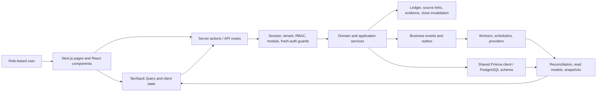

# Stoquify Whole-System Audit — 2026-08-03

## Executive verdict

**Production and external-certification decision: NO-GO.**

Stoquify is not an empty dashboard product. It has a substantial operational core across POS, inventory, purchasing/AP, payment reconciliation, accounting, payroll, evidence, close assurance, and role-oriented command surfaces. Service-owned persistence, accounting invariants, business events, idempotency, public-receipt token controls, inventory concurrency patterns, statutory blocking, and workflow-assurance concepts are unusually strong foundations.

The platform is not yet fail-closed where it matters most. The accepted organization-scoped Prisma boundary is still absent; electronic tenders and refunds can become locally final without provider-authoritative evidence; payment/cash/AR definitions disagree; finance totals are silently computed from capped datasets; customer/drawer balances remain race-prone; audit writes fail open; invite bearer tokens remain plaintext; module enforcement defaults to observe/legacy access; offline replay does not preserve original-actor authority; MFA is not completed; and production secret, migration, observability, and statutory evidence remains blocked or unverified.

The product experience is promising but fragmented. The five-lane navigation, Owner War Room, Manager Action Center, Daily Digest, domain workbenches, Workflow Atlas, guided setup, and HRIS evidence create real user value. That value is undermined by duplicate routes/funnels, a broken user-edit destination, a production demo route, English-only authenticated navigation, permission-blind setup links, mixed module truth, weak product telemetry, and reporting semantics that can show different answers to the same question.

The correct next move is not another dashboard. It is to make tenant, payment, metric, entitlement, audit, and identity truth structural; then consolidate routes and onboarding; then prove the system in a clean, production-shaped environment.

## Audit identity and limitations

| Item | Evidence |
|---|---|
| Audit date | 2026-08-03, Europe/Paris |
| Branch | `codex/service-boundary-burndown` |
| Commit | `5dc78f2c007c51e151342de08be34b72994839bb` |
| Worktree | 329 tracked changes, 1,232 untracked entries, 1,561 status entries total |
| Source inventory | `app` 279 files; `actions` 227; `services` 620; `components` 312; `hooks` 47; `lib` 70; `config` 7; `prisma` 60; `scripts` 235 |
| Entry points | 139 page files; 141 files containing server-action directives; 10 current API route files by `route.ts/tsx` inventory |
| Client data | 41 files matched TanStack/query operation signatures; deeper static review classified 137 operations: 51 queries/infinite queries and 86 mutations |
| Data model | 6,308 schema lines; 158 models; 164 enums; 45 migration directories |
| Tests | 1,330 files matched the broad repository test pattern; 25 focused suites / 180 tests were executed |
| Graph | `GRAPH_REPORT.md` dated 2026-06-14: 4,121 nodes, 5,321 edges, 135 communities; 709 inferred edges; stale relative to current source |
| Runtime limits | No production/test DB, migrations, seeds, providers, browser authentication, load tests, or authority systems were accessed |

Counts differ from older reports because this audit used the current dirty filesystem and broader filename patterns. The graph and July reports were used for navigation only.

## Readiness verdicts

| Dimension | Verdict | Maturity | Rationale |
|---|---|---:|---|
| Product value | Conditional go | 3/5 | Real daily operating value, but activation, route truth, and telemetry are incomplete |
| UI/UX | Partial | 3/5 | Strong command/workbench direction and HRIS evidence; broad authenticated a11y/responsive proof missing |
| Architecture | Not ready | 2/5 | Service boundaries are good, but tenant and cache context guarantees remain caller-dependent |
| Security | Not ready | 2/5 | Tenant backstop, MFA, durable audit, tokens, rate limiting, CSP, and supply-chain gates incomplete |
| Financial integrity | Not ready | 2/5 | Provider finality, metric semantics, capped totals, and balance concurrency unresolved |
| Inventory controls | Strong application layer | 4/5 | CAS/event/reversal patterns are strong; systemic tenant boundary still applies |
| Purchasing/AP | Useful, controlled, residual risk | 3/5 | Maker-checker improved; approval and exception races remain |
| Payroll/OHADA | Strong fail-closed design, certification blocked | 3/5 | Evidence-rich controls; expert/authority/runtime proof incomplete |
| Privacy | Not ready | 2/5 | Upload caching, raw provider payload, retention/erasure, and invite tokens need correction |
| Integrations | Partial | 3/5 | Signed HMAC adapter and workers exist; POS finality, CSV robustness, and runtime provider proof incomplete |
| Observability/operations | Not ready | 2/5 | Static assurance strong; logger sink, alert delivery, SLOs, restore drills, and production evidence unproven |
| Migration/release | Blocked/unverified | 2/5 | Local static checks pass; configured production target and execution/history proof absent |
| Overall | **NO-GO** | 2/5 | Core is credible; structural and external release evidence is insufficient |

## System architecture

This is a modular monolith with healthy service-owned persistence direction. The most serious architectural defect is that `prisma/db.ts:7-23` exports a plain `PrismaClient`, while ADR-0002 requires automatic organization scoping and an explicit unscoped escape (`docs/architecture/decisions/0002-org-scoped-prisma-extension.md:11-23`). The current `protect` wrapper inspects only known organization fields (`services/_shared/protect.ts:181-196`); it cannot constrain an omitted filter inside arbitrary service code.

## Strongest foundations to preserve

1. **Service-owned persistence.** The current service-boundary gate found zero active direct Prisma/action-owned mutation violations across its configured runtime surfaces. This is a real architectural strength, even though the gate does not prove tenant safety inside services.
2. **POS transaction orchestration.** Sale commit links cart, stock, payment, drawer, posting, fiscalization request, receipt, and business-event evidence (`services/pos/pos.service.ts:1718-2272`).
3. **Inventory concurrency and lineage.** Inventory mutation paths commonly use quantity/version guards, movements, reversals, events, and close invalidation.
4. **Accounting posting controls.** Balanced entries, open periods, source links, tenant checks, idempotency, reversals, and close/data-trust blockers are first-class concepts.
5. **AP and payroll control depth.** Maker-checker identities, payment evidence, provider inbox leases, retries, declarations, correction/provenance, and close integration are well represented.
6. **Public receipt boundary.** Signed, hashed, tenant/sale/time-bound tokens, revocation, redaction, and fresh-auth administration form one of the strongest boundary implementations.
7. **Workflow assurance.** The static release gate reports 38/38 checks, 11/11 indexes, and 2/2 engine-health gates ready, while correctly stating it did not execute or enable checks.
8. **Honest statutory blocking.** Country-pack and tax paths expose blocked/unverified states instead of manufacturing legal certainty.
9. **Command/workbench UI direction.** Owner War Room, Manager Action Center, Daily Digest, Workflow Atlas, and domain workbenches align UI with decisions and evidence rather than decorative KPIs.
10. **Focused testability.** The selected mocked slices passed 180 tests across access, approval, POS, idempotency, cache boundaries, provider workers, redaction, migration logic, financial projections, AP, and close trust.

## Principal findings

### P0 — systemic tenant isolation remains absent

**Status:** still confirmed. **Confidence:** high. **Maturity:** 2/5. **Danger:** cross-tenant confidentiality and integrity.

- ADR-0002 requires a scoped client, context injection, and explicit unscoped access (`docs/architecture/decisions/0002-org-scoped-prisma-extension.md:11-23`).
- `prisma/db.ts:7-23` still exposes the raw client as the shared client.
- `services/_shared/protect.ts:54,180-200` makes tenant validation dependent on caller-supplied/recognized values.
- No PostgreSQL RLS backstop was evidenced.

**Recommendation:** establish mandatory organization-scoped repositories or Prisma extension, tenant-composite constraints, and RLS for the highest-risk tables. Prove with adversarial service/action/API and real PostgreSQL tests.

### P1 — provider finality is separate from POS finality

**Status:** still confirmed. **Confidence:** high. **Maturity:** 2/5.

POS derives capture evidence from tender input (`services/pos/pos.service.ts:1810-1824`), persists non-credit methods as `PAID` (`:2013-2044`), and creates refunds as `PROCESSED/REFUNDED` immediately (`:2737-2760`). Signed provider-event controls exist separately (`services/payments/provider-event.service.ts:151-156,250-309`) but are not the authority that gates the POS status transition.

**Recommendation:** introduce provisional/authorized/captured/settled/failed/reversed states and post non-cash tenders to clearing/suspense until signed webhook or statement evidence proves finality. Provider refunds need their own idempotent lifecycle.

### P1 — no canonical payment/cash/AR semantic contract

**Status:** still confirmed. **Confidence:** very high. **Maturity:** 2/5.

- Main dashboard counts only `PAID` (`services/dashboard/dashboard-read-model.service.ts:347-356`).
- Tenant and branch snapshots count `PAID` and `PARTIAL` (`services/snapshots/tenant-operating-snapshot.service.ts:47-52`).
- Finance includes every non-cancelled sales payment and applies related logic to AR (`services/finance/finance-dashboard.service.ts:750-816`).

Users can receive three defensible-looking answers to “how much cash did we collect?”

**Recommendation:** define one versioned payment-state and metric catalogue with as-of, source, currency, refund, settlement, and partial-data semantics. Make all dashboards, exports, aging, close, and snapshots consume shared fixtures/adapters.

### P1 — finance dashboard silently aggregates capped result sets

**Status:** newly confirmed. **Confidence:** very high. **Maturity:** 2/5.

`services/finance/finance-dashboard.service.ts:568-688` caps sales/purchases/open orders/expenses at 250, payments at 300, and customers/suppliers at 100, then computes totals from those arrays at `:742-778`. Larger tenants receive understated totals without a partial-data warning.

**Recommendation:** use database aggregates for totals and paginated queries for detail. Add fixtures beyond each cap and require exact totals.

### P1 — customer and drawer balance races

**Status:** still confirmed. **Confidence:** high. **Maturity:** 2/5.

Customer and drawer paths read balances, calculate new values, and update by ID (`services/pos/pos.service.ts:1859-1872,1971-1994,2555-2575,2926-2935`). Concurrent sales/refunds can overwrite each other. Drawer close already demonstrates a better compare-and-set pattern.

**Recommendation:** use atomic increments or `{tenant,id,version/currentBalance}` CAS with `count === 1`, then reconcile projections to immutable ledger/transaction truth.

### P1 — audit evidence fails open; production telemetry is unproven

**Status:** still confirmed. **Confidence:** high. **Maturity:** 2/5.

`lib/security/audit-log.ts:37-68` skips organization-less events and swallows persistence failures. Invite acceptance invokes that global writer during a transaction without the transaction client (`services/users/user-identity.service.ts:900-911`). `lib/logger.ts:14` defaults to a no-op sink.

**Recommendation:** commit mandatory audit obligations transactionally or through an atomic outbox; fail privileged operations when required evidence cannot be secured. Require a production sink at startup and prove alert delivery, retention, correlation, and recovery drills.

### P1 — identity, entitlement, and offline authority are incomplete

- Invite bearer tokens remain stored/indexed and redeemed in plaintext (`prisma/schema.prisma:404-425`; `services/users/user-identity.service.ts:725-751,801-807`).
- MFA schema fields exist, but the security UI states enrollment/challenge is not connected (`app/[locale]/(dashboard)/dashboard/settings/security/page.tsx:63`).
- Module mode is globally `observe`; missing requests can imply legacy full-suite access (`services/modules/module-control-contracts.ts:1`; `services/modules/module-entitlement.service.ts:25-87`).
- POS tender actions now require the module, but offline actions omit it and replay uses the current replayer rather than an immutable original actor (`actions/pos/sync.actions.ts:85-166`; `services/pos/offline-sync.service.ts:1289-1294`).

**Recommendation:** hash one-time invite tokens; complete MFA/WebAuthn/TOTP and step-up requirements; make entitlement server truth default-deny; persist original offline actor/device/session claims separately from the replayer.

### P1 — global query cache lacks explicit organization context

**Status:** new likely risk. **Confidence:** medium-high pending runtime reproduction. **Maturity:** 2/5.

The application creates a global QueryClient (`components/Providers.tsx:16-40`; `lib/providers/query-provider.tsx:14-58`), while many list/detail keys omit organization identity (`types/queryKeys.ts:2-93`; `hooks/useCustomerQueries.ts:24-87`; `hooks/useCategories.ts:35-106`). Without a proven reset/remount on organization/session change, stale cross-context data can be reused.

**Recommendation:** add a canonical tenant/session prefix or clear the client on context changes, then add an organization-switch test that proves no previous-context record remains.

### P1/P2 — residual approval and exception races

- Canonical PO approval now enforces maker-checker but reads before its transaction and updates by ID without status/version CAS (`services/purchase-order/purchase-order.service.ts:732-777`).
- AP active exceptions use find-then-create without a matching uniqueness invariant (`services/purchasing/ap-control.service.ts:990-1020`; `prisma/schema.prisma:4896-4949`).

**Recommendation:** add state/version predicates and deterministic uniqueness, with real database concurrency tests.

### P2 — privacy, integration, and web hardening gaps

- Authenticated tenant uploads are served with `Cache-Control: public`, buffered wholly, and typed by extension (`app/api/uploads/[...path]/route.ts:110-116`).
- Mobile-money payloads retain raw provider objects; CSV parsing is comma splitting; timestamp units are implicit (`services/payments/adapters/mobile-money-hmac.adapter.ts:107-110,131-170`).
- Production CSP allows `unsafe-inline`, and client-IP enforcement trusts forwarding headers.
- CI has strong domain gates but no explicit SAST, SCA/dependency review, secret scan, SBOM, container scan, or DAST job.

## Prior July 28 P0/P1 delta

| Prior finding | Current disposition | Evidence |
|---|---|---|
| Org-scoped Prisma ADR absent | Still confirmed | Raw shared client remains |
| Bulk PO approval bypass | Fully remediated at reviewed boundary | Action and service reject bulk `APPROVED`; actor derived server-side; 31/31 access/approval tests passed |
| Store-credit tender has no owner | Safely contained, feature still missing | `assertSupportedSaleTenders` rejects before transaction (`services/pos/pos.service.ts:80-86,1720`) |
| Provider truth locally asserted | Still confirmed | POS status transitions remain local; signed provider ingestion is separate |
| Cash/AR/read-model divergence | Still confirmed | Three status definitions remain |
| Trusted origins derived from request host | Fully remediated | Configured normalized origin builder replaces forwarded-host expansion |
| Audit durability | Still confirmed | Fail-open writer remains |
| Plaintext invitation tokens | Still confirmed | Schema/service unchanged |
| Optional entitlement/offline actor authority | Partially remediated | Tender gate fixed; global observe/legacy and offline provenance remain |
| Migration/statutory/release prerequisites | Improved locally, still blocked/unverified | Static/local readiness does not prove production; expert and secret evidence blocked |

## Product and UI/UX opinion

### Strong

- Role-oriented command surfaces and workbenches align with real operational decisions.
- Public copy now labels preview/sample boundaries and describes packages as reviewed rollout paths.
- The five-lane shell—Command, Operations, Finance & Trust, People, Governance—is directionally coherent.
- HRIS has the strongest saved responsive/RBAC evidence: 18/18 recorded route/viewport combinations passed, though manual assistive-technology coverage remains incomplete.

### Useful but incomplete

- Workflow Atlas is valuable as a public guide, not another daily launcher.
- Owner War Room, Manager Action Center, Daily Digest, Module Control Center, and guided setup are useful composition layers.
- Module Control Center must remain diagnostic until commercial/server enforcement is authoritative.

### Weak or misleading

- Setup links are not permission/entitlement aware.
- Authenticated navigation labels are hard-coded English (`config/sidebar.ts:63`; `components/dashboard/Navbar.tsx:206`).
- Public “module-bounded” and offline-provenance claims exceed current runtime proof.
- Product adoption analytics, time-to-value, denied-navigation, setup progression, and role-retention evidence are missing.

### Consolidate or retire

- Consolidate v1/v2 registration and marketing funnels after measuring the winning flow.
- Redirect `/dashboard/suppliersSystem` to `/dashboard/purchases/suppliers`.
- Consolidate `/dashboard/purchases/[id]` with `/dashboard/purchase-orders/[id]`.
- Consolidate duplicate location-create and tax-rate-create routes.
- Replace legacy `/dashboard/items` variants with canonical inventory routes.
- Restrict `/dashboard/notifications-demo` to non-production/internal use.
- Retire `/update`, which returns `null`.
- Fix `/dashboard/settings/users/update/{id}`, currently linked without a corresponding route (`app/[locale]/(dashboard)/dashboard/settings/users/columns.tsx:70`).

No existing operational feature was classified useless solely from code presence. Retirement recommendations require demonstrated duplication, null/demo behavior, broken navigation, or absence of a distinct user job.

## Verification summary

- Prisma schema validation: passed.
- Typecheck: passed.
- Lint: passed with four warnings and no errors.
- Service boundary: passed, zero active violations.
- Hard delete: passed, zero active unsafe findings.
- Raw-error boundary: failed with six active findings.
- Workflow-assurance static release gate: passed 38/38 checks, 11/11 indexes, 2/2 engine-health gates.
- Focused Jest: 25/25 suites and 180/180 tests passed.
- Three focused invocations reported forced Jest worker shutdown/open-handle warnings. Treat teardown hygiene as a P2 reliability issue; test assertions still passed.

No new tests were added. Real cross-tenant persistence, balance races, simultaneous approvals, cache context switching, audit outage, and provider finality require isolated PostgreSQL/browser/provider fixtures. Adding speculative or failing tests to a tree with 1,561 status entries would risk overlapping user work; those tests are assigned to the follow-up prompts.

## Overall recommendation

Preserve the core. Do not pursue broad UI expansion. Sequence the next work as:

1. Tenant and identity trust boundary.
2. Provider/payment/metric/balance truth.
3. Entitlement, audit, offline provenance, and concurrency.
4. Route, funnel, onboarding, and localization consolidation.
5. Production-shaped migration, observability, rollback, and statutory evidence.
6. Product telemetry and validated UX simplification.

## Narrow follow-up prompts

1. Implement one fail-closed tenant-scoped persistence pilot with raw-client escape inventory, composite tenant constraints, adversarial tests, additive migration rehearsal, and rollback proof.
2. Introduce provider-authoritative non-cash tender/refund states and one canonical payment/cash/AR contract; migrate all projections with truth-table fixtures.
3. Replace customer/drawer read-set updates and PO/AP find-then-write races with atomic/CAS/unique invariants and PostgreSQL concurrency tests.
4. Make module entitlement default-deny and durable; preserve original offline actor authority; add route/action/API/read-model reconciliation gates.
5. Make critical audit transactional, hash invite tokens, complete MFA/step-up, and prove failure behavior without leaking secrets or PII.
6. Consolidate duplicate routes/funnels, fix broken/demo/null surfaces, make setup permission/package aware, localize the authenticated shell, and certify five golden journeys.
7. Execute migration, secret, observability, restore, provider, and statutory evidence gates in a clean disposable production-shaped environment with independent review.

## Certification boundary

This report is a source-and-focused-test assessment of a dirty local filesystem. It is not a security, privacy, accounting, tax, payroll, OHADA, statutory, or production certification.
