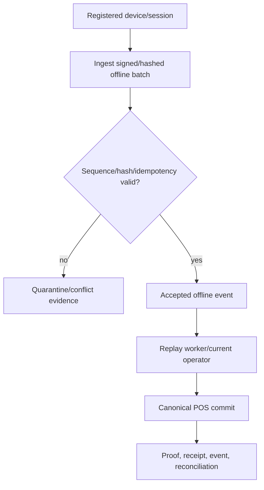
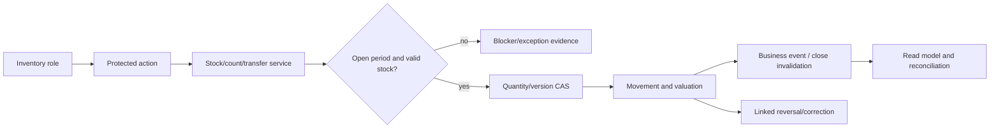
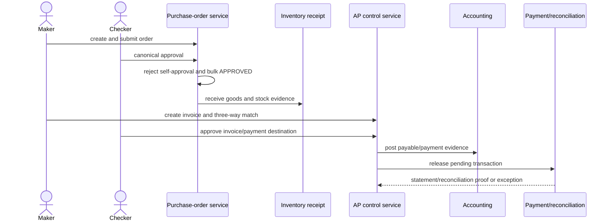
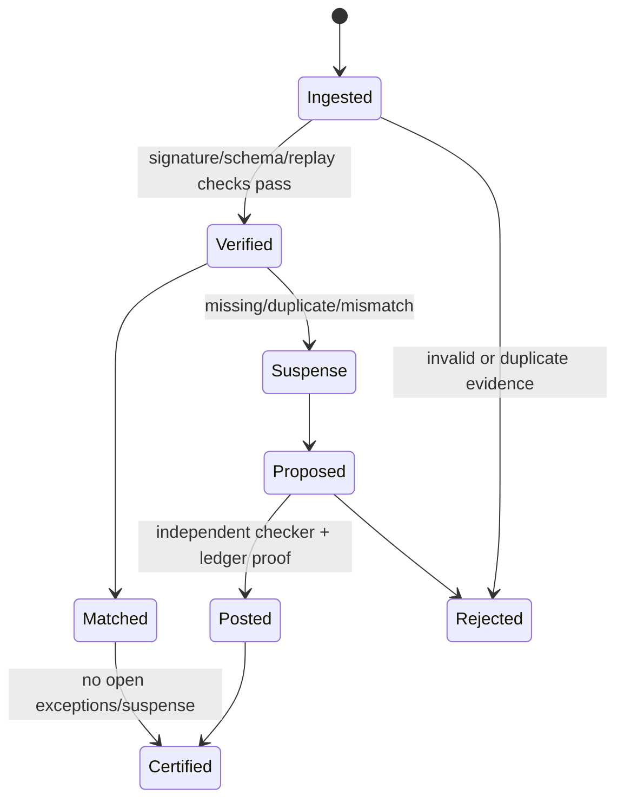
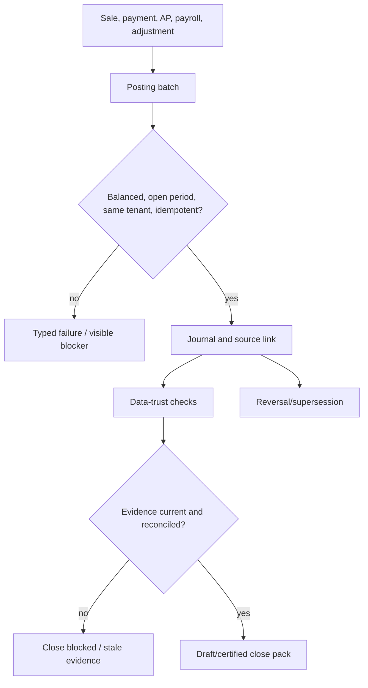
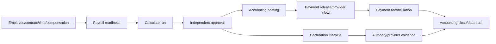
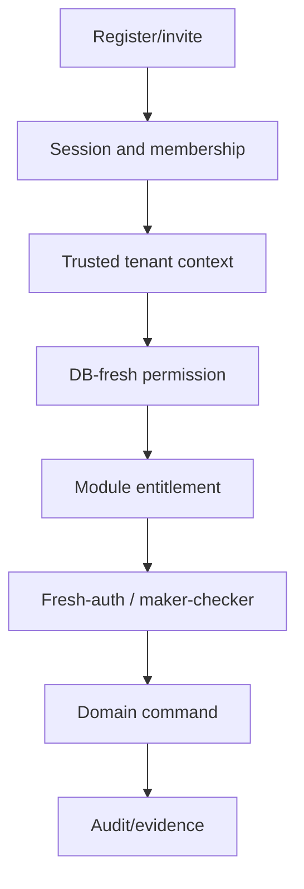
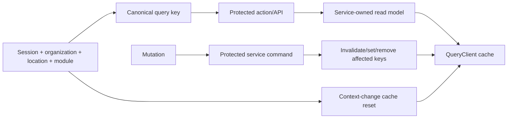

# Stoquify Workflow Atlas — 2026-08-03

## Purpose

This atlas traces representative current-source workflows from user surface to durable truth and back to UI. It distinguishes implemented flow, strong controls, and unresolved authority/recovery gaps. It does not claim exhaustive runtime execution.

## Workflow family summary

| Family | Entry → owner → durable truth | Happy path | Failure/correction path | Assessment |
|---|---|---|---|---|
| Identity/tenant | Auth/settings → user/organization services → identity models/audit | Register/invite/session/membership/role | denial, expiry, recovery, offboarding | Partial; plaintext invite, MFA, audit durability, DB tenant backstop |
| POS | POS UI → tender action → POS service transaction → sale/stock/drawer/payment/ledger/event/receipt | Strong atomic sale composition | refund/void/offline/fiscalization | Strong core; provider finality and balance concurrency dangerous |
| Inventory | Inventory workbench → stock/count/transfer services → levels/movements/events/ledger | CAS-protected movement and proof | reversal, blocker, replay, reconciliation | Strong |
| Purchasing | PO UI → action → PO service → order/approval/receipt/event | Maker-checker approval and receipt | cancel, rejection, duplicate/concurrent approval | Strong; approval CAS residual |
| AP | Payables UI → AP action/service → invoice/match/approval/payment/reconciliation | Three-way match and segregated release | exception, suspense, correction | Strong; active-exception race |
| Payments/recon | Provider/statement input → payment/recon services → events/statements/matches/suspense/certification | Verify, ingest, match, sign | duplicate, missing evidence, suspense, retry | Strong independently; not POS final authority |
| Accounting/close | Source event/action → posting/close services → batches/journals/source links/evidence | Balanced posting and close checks | reversal, stale evidence, blocked close | Strong; upstream/provider/statutory dependencies |
| HR/payroll | People/payroll UI → HR/payroll services → employee/run/payment/declaration/evidence | Readiness, run, approval, release, declare, reconcile | correction, provider retry, exception, close blocker | Strong design; external/statutory proof blocked |
| Public receipt | Public route/token → receipt service/registry → redacted receipt | Verify signed/hashed token and serve | expiry, revocation, invalid scope | Strongest public boundary |
| Assurance/agents | Protected action/scheduler → assurance/agent services → proposals/incidents/outbox | Detect, propose, review, evidence | retry, reject, recover, kill switch | Strong static contracts; runtime operations unproven |

## POS sale, provider, receipt, and refund

```mermaid
sequenceDiagram
  actor Cashier
  participant UI as POS UI / TanStack
  participant Action as tender.actions
  participant POS as commitPOSSale
  participant DB as Prisma transaction
  participant Acct as Accounting posting
  participant Event as Business event/outbox
  participant Provider as Provider/reconciliation
  participant Receipt as Receipt delivery

  Cashier->>UI: complete cart and submit tenders
  UI->>Action: server action with tenant/session/location
  Action->>POS: authenticated module-scoped command
  POS->>POS: reject STORE_CREDIT; validate references
  POS->>DB: claim session/sale; stock, drawer, payment, customer
  POS->>Acct: sale/payment postings
  POS->>Event: finalized sale + fiscalization request
  DB-->>POS: commit
  POS->>Receipt: load and deliver receipt
  Receipt-->>UI: redacted receipt/result
  Note over POS,Provider: Non-cash payment is currently marked PAID before provider-authoritative finality
  Provider-->>DB: separate signed event/statement/reconciliation evidence
```

Strong controls: tenant/location/session predicates, sale claim, transactional stock/payment/ledger/evidence composition, unique local references, receipt token controls, pending non-authoritative fiscalization watermark.

Gaps:

- Electronic references are derived from tender input and persisted as final payment.
- Signed provider evidence is not the transition authority.
- Customer/drawer balances use read-compute-write.
- Non-cash refunds become processed without provider refund execution.
- Store credit is safely disabled, not implemented.

Required correction path:

`PROVISIONAL → AUTHORIZED → CAPTURED → SETTLED`, with `FAILED/EXPIRED/REVERSED`, clearing/suspense posting, idempotent provider commands, reconciliation, and evidence-preserving refunds.

## Offline POS replay



Strong controls: device/session/location claims, sequence hash, idempotency, quarantine, canonical POS execution, assurance checks.

Gap: original actor is not immutable per event and replay uses the current replayer; offline action entitlement is incomplete. Record original actor and replayer separately and require explicit replay authority.

## Inventory movement and reversal



Assessment: one of the strongest domain implementations. Preserve CAS, immutable movement evidence, reversal lineage, event idempotency, and close invalidation. Add real concurrency and tenant-boundary proof.

## Purchase order and AP



Resolved: generic bulk approval bypass.

Residual:

- PO approval lacks status/version CAS inside the transaction.
- AP active exception creation is find-then-create without a uniqueness invariant.
- Provider/statement truth remains externally unverified.

## Payment reconciliation and suspense



Strengths: HMAC verification, constant-time comparison, provider inbox, statement imports, duplicate/missing evidence detection, suspense maker-checker, ledger link, certification blockers.

Gaps: CSV parsing robustness, explicit timestamp contract, encrypted/redacted raw payload retention, runtime provider proof, POS integration.

## Accounting and close



Assessment: strong control architecture. Readiness remains conditional on canonical payment truth, migration history, provider statements, statutory sources, expert approval, and production observability.

## HRIS and payroll



Strengths: identity scope, approvals, hashes, correction/provenance, leases, retries, payment/declaration evidence, payslip self-service, close blockers.

Gaps: production provider/authority credentials, expert-reviewed statutory sources, MFA for privileged actions, broad privacy and runtime certification.

## Identity, invitation, and access



Current weak links: raw invite tokens, MFA not connected, module observe/legacy access, fail-open audit, and no persistence-level tenant backstop.

## TanStack Query lifecycle



Current finding: the global QueryClient exists, but many keys omit organization identity and no context-change reset was proven. The required contract is a trusted context prefix plus a mutation-to-projection invalidation registry and organization-switch tests.

## Public receipt and uploads

Public receipt:

`public route → signed/hashed token registry → tenant/sale/jti/time binding → scoped receipt → redacted response → revocation/expiry`

Assessment: strong.

Uploads:

`authenticated route → organization equality → module/filename/path containment → full file read → extension MIME → public cache response`

Assessment: access boundary has useful controls, but response caching, streaming, content validation, and retention are weak.

## Assurance and agent boundaries

Protected actions derive server-side actor/tenant context; deterministic agent tools are read-only; proposals use status CAS and human review; workflow assurance has a static registry, indexes, scheduler policy, and incident concepts. Do not expand execution authority until creator self-approval, entitlement, audit durability, runtime scheduler, alert delivery, secrets, and production evidence are resolved.

## Recovery matrix

| Failure | Current recovery | Status |
|---|---|---|
| Duplicate business event/offline batch | idempotency/sequence detection | Strong in mocked tests |
| Invalid provider signature/replay | reject and alert/inbox evidence | Strong service contract; runtime unverified |
| Worker lease expiry | lease/retry patterns in payroll/payment workers | Tested mocked behavior; production unverified |
| Ledger posting failure | transaction/blocker/suspense paths | Strong |
| Audit sink failure | swallowed/best effort | DANGEROUS |
| Concurrent balances | no CAS on key POS paths | DANGEROUS |
| Concurrent PO approvals | no state/version CAS in canonical approval | Residual risk |
| Cache organization switch | no proven global reset/context prefix | Likely risk |
| Migration failure | static safety/approval logic and rollback planning | Production environment blocked |
| Statutory uncertainty | blocked/expert-review state | Strong fail-closed behavior |
