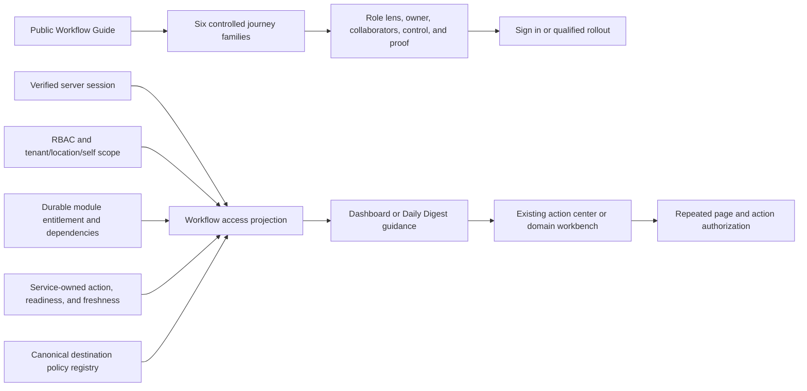
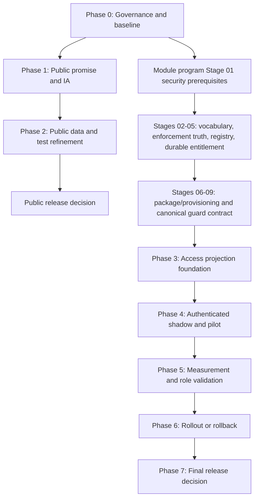

# Stoquify Workflow Atlas Transformation Roadmap

**Date:** 2026-07-30  
**Roadmap status:** Approved planning baseline; implementation not started  
**Governing decision:** Retain, reshape, and split  
**Public launch posture:** Conditional GO after Phases 0-2 and fresh visual review  
**Authenticated launch posture:** NO-GO until Phase 3 prerequisites and Phase 4 pilot gates pass

## Executive Direction

The Workflow Atlas should remain in Stoquify, but its jobs must be separated.

1. The public Atlas becomes a bilingual **Workflow Guide** for buyer education, onboarding, and training.
2. Authenticated guidance becomes a compact, server-owned projection inside the existing Dashboard or Daily Digest.
3. Daily execution stays in Daily Digest, Manager Action Center, Owner War Room, and domain workbenches.
4. A dedicated `/dashboard/workflows` route is not part of the pilot. It can be reconsidered only after measured repeat use proves additional value.

The public lane can move now. The authenticated lane cannot move past design and shadow planning until Stoquify has authoritative destination policy, tenant and location scope, durable module entitlement, and consistent access states.

## Outcomes

This roadmap is complete when Stoquify can prove all of the following:

- Public visitors understand each workflow's owner, handoff, control, evidence, and protected destination without mistaking the guide for live work.
- Public role selection is demonstrably a discovery lens and never an authorization input.
- Authenticated guidance is generated from fresh server-side identity, tenant, permission, scope, entitlement, and source-owned work state.
- Every displayed authenticated destination agrees with its page and action/API authorization.
- Existing command centers remain the source of operating truth and the place where work is completed.
- Product telemetry is privacy-approved and can prove comprehension, time-to-action, and repeat value.
- Rollback returns users to existing command surfaces without weakening underlying guards.

## Current Baseline

| Area | Verified state | Consequence |
| --- | --- | --- |
| Public routes | `/en/workflows` and `/fr/workflows` render the client-side `WorkflowAtlas` | Suitable for public explanation, not operational authorization |
| Catalogue | 8 roles, 12 outcomes, 12 workflows, 41 unique destinations | Rich content, but too repetitive and too broad for daily use |
| Recommendation logic | First three records after static role/outcome filtering | Not urgency, assignment, entitlement, or live relevance |
| Public access language | EN/FR copy still says daily shortcut/operating map | Promise correction is a P0 release gate |
| Destination coverage | Read-only comparison found 41/41 Atlas destinations in the sidebar | Useful baseline, but no CI contract prevents future drift |
| Route gate | Tests prove `/dashboard/` shape and page-file existence | Must be named route-existence, not authorization proof |
| Browser evidence | 4/4 EN/FR mobile/desktop checks passed; eight screenshots saved | Functional baseline exists; fresh human visual review is still required |
| Module control | Stage 01 security prerequisites in progress; broad enforcement no-go | Authenticated projection remains blocked |
| Entitlement source | `requestedModules` or legacy full-suite derivation remains possible | Not authoritative commercial access truth |
| Existing operating surfaces | Dashboard, Daily Digest, Manager Action Center, Owner War Room, and domain workbenches exist | Reuse these surfaces; do not create another broad dashboard |
| Graph evidence | July 14 graphs predate the Atlas but identify existing command hubs and security services | Useful for boundaries; refresh only after implementation |
| Telemetry | No Atlas value telemetry | Expansion cannot be justified from current functional evidence |

## Locked Decisions

These decisions are non-negotiable throughout the program:

- A public role or outcome selection is discovery metadata only.
- No authenticated projection API accepts a public role, outcome, or client-computed permission list.
- Route hiding and sidebar filtering are not enforcement.
- An `allowed` projection permits navigation only; page and action/API guards reauthorize.
- Permission, tenant scope, location/self scope, and module entitlement remain distinct decisions.
- Permission denial masks entitlement detail, sensitive counts, and hidden work state.
- HRIS, payroll, payroll self-service, and payroll administration remain distinct privacy and permission scopes.
- Fresh authentication and maker-checker controls remain on sensitive actions.
- Assignment, urgency, completion, and freshness are displayed only when an owning service supplies them.
- Analytics is not added until owner, consent, retention, payload, and deletion rules are approved.
- Broad module enforcement is not enabled by the Workflow Atlas program.
- Dirty-worktree safety applies to every phase; unrelated files, warnings, and generated output are not cleaned up.

## Target Product Model



### Public Workflow Guide

Organize the current 12 playbooks into six buyer-oriented journey families:

1. Sell, collect, and reconcile.
2. Stock, move, and explain.
3. Buy, receive, and pay.
4. People, payroll, and statutory proof.
5. Close, comply, and certify.
6. Govern daily operations and access.

Each family should expose:

- a primary owner and supporting collaborators;
- source, handoff, control, evidence, and destination;
- package/country/permission availability caveats;
- one progressive-detail path rather than repeated recommendation, map, and library cards;
- one safe continuation to sign-in or qualified rollout.

The home page should keep one concise workflow preview that links to the Guide. Detailed Connected Workflow, Operations Map, People to Pay, and use-case material should not compete with duplicate Atlas content.

### Authenticated Contextual Guidance

The first placement is Daily Digest, with a compact Dashboard fallback. Guidance should explain why a live action matters, the control to perform, the expected evidence, and the already-authorized destination.

Do not copy the public catalogue into the dashboard. Do not add a second role selector. Do not create a new assignment engine.

### Existing Execution Surfaces

- Daily Digest owns the first pilot placement.
- Manager Action Center and Owner War Room remain ranked operating views.
- POS, Inventory, Purchasing/AP, People, Payroll, Reconciliation, Accounting, Close, Compliance, and Settings workbenches remain execution destinations.
- `WorkspaceSetupPanel` remains the first-run setup surface.

## Authenticated Contract

### Destination Policy

Create one server-only destination policy contract before the pilot:

```ts
type WorkflowAccessState =
  | "login_required"
  | "tenant_required"
  | "stale_session"
  | "permission_denied"
  | "scope_denied"
  | "module_locked"
  | "read_only"
  | "step_up_required"
  | "allowed"

type DestinationPolicy = {
  id: string
  href: string
  permissions: { any?: readonly string[]; all?: readonly string[] }
  modules: readonly CommercialModuleSlug[]
  scope: "tenant" | "location" | "self"
  freshAuth: boolean
  sensitivity: "normal" | "sensitive" | "critical"
  owner: string
}
```

The projection has no role argument:

```ts
async function getMyWorkflowProjection(): Promise<WorkflowProjection> {
  const context = await requireRbacContext()
  return projectDestinations(context)
}
```

### Access-State Precedence

Expose the first safe state in this order:

1. `login_required`
2. `tenant_required` or `stale_session`
3. `permission_denied`
4. `scope_denied`
5. `module_locked`
6. `read_only`
7. `step_up_required`
8. `allowed`

Keep data readiness separate: `empty`, `partial`, `stale`, `blocked`, and `error` describe source data, not authorization.

## Delivery Lanes



The public lane is not blocked by the module-control program. The authenticated lane is on its critical path.

## Phase Roadmap

### Phase 0: Governance And Baseline

**Objective:** Freeze product, security, evidence, and ownership decisions before implementation.

**Owners:** Product, Security, Platform Architecture, QA/Release  
**Indicative effort:** 3-5 working days  
**Status:** Ready

**Deliverables**

- Signed retain/reshape/split decision.
- No-public-role-authorization invariant.
- Baseline inventory for 12 workflows, 41 destinations, EN/FR copy, tests, and screenshots.
- Named owners for public content, destination policy, module control, scope, telemetry, and each domain read model.
- Public and authenticated launch checklists.
- Versioned risk and evidence registers.

**Exit gate**

- All P0 risks have an owner and treatment.
- No team interprets the public Atlas as an access-control source.
- Public and authenticated delivery lanes are tracked separately.

### Phase 1: Public Promise And Information Architecture

**Objective:** Correct the public promise and replace the repetitive launchpad structure with a clear Workflow Guide.

**Owners:** Product, Content, UI/UX, Frontend, Localization  
**Indicative effort:** 1-2 weeks  
**Depends on:** Phase 0

**Deliverables**

- Remove claims such as daily launchpad, assigned work, best next action, or permission awareness.
- Rename the surface to Workflow Guide or Role and Outcome Guide.
- Replace the outcome step with six journey families and one optional role lens.
- Add `primaryRoles` and `supportingRoles` semantics.
- Consolidate repeated recommendations, map links, and full cards into one progressive-detail experience.
- Reconcile overlap with home-page workflow and use-case sections.
- Preserve full French accents and semantic parity.

**Exit gate**

- EN/FR contain no live-work or access-awareness overclaim.
- At least 4 of 5 usability participants can identify owner, control, evidence, and destination.
- No page section duplicates the same full playbook.

### Phase 2: Public Data, Tests, And Release Evidence

**Objective:** Make the reshaped public guide durable, bilingual, accessible, and regression-resistant.

**Owners:** Frontend, QA, Accessibility, Localization  
**Indicative effort:** 1-2 weeks  
**Depends on:** Phase 1

**Deliverables**

- Stable journey and destination IDs.
- A route-existence test with an honest name.
- A destination-registry drift test covering sidebar entry, permission, module slug, catalog membership, and page file.
- Component tests for primary/supporting roles, progressive detail, and bilingual parity.
- Production-like browser smoke in EN/FR at 390x844, 768 tablet, and 1440x1100.
- Chromium plus representative Firefox/WebKit coverage.
- Keyboard, focus, 200% reflow, contrast, touch target, axe, and manual assistive-technology evidence.
- Timestamped screenshots and browser JSON under `what-next/`.

**Exit gate**

- All focused tests pass.
- Zero serious or critical accessibility findings.
- Zero browser errors, critical request failures, overflow, or clipped text.
- Human visual review signs the current screenshots.

### Phase 3: Entitlement, Scope, And Destination Policy Foundation

**Objective:** Establish the server contracts required for authenticated guidance without changing navigation.

**Owners:** Identity/Security, Module Control Plane, Platform Navigation, Domain Owners  
**Indicative effort:** Cross-program; no Atlas-specific date until module Stage 01 completes  
**Depends on:** Module-control Stages 01-09 and Phase 0

**Deliverables**

- One destination policy registry for all 41 current destinations.
- Exact any/all permissions, module dependencies, tenant/location/self scope, sensitivity, fresh-auth requirement, and owner for each destination.
- Durable tenant entitlement read model with no legacy/requested-module fallback in enforce decisions.
- Generalized operating-scope resolver.
- Canonical module access guard and normalized unavailable-state adapter.
- Zero unresolved Atlas-path surface, permission, and module mappings.
- Registry checks that compare sidebar, page/action guards, module catalog, and destination policy.

**Exit gate**

- Every policy can be evaluated server-side before any protected read.
- Every denied result suppresses sensitive metadata and counts.
- Page and action/API authorization contracts agree.
- Module program release gate explicitly approves a bounded shadow projection.

### Phase 4: Authenticated Shadow And Pilot

**Objective:** Prove contextual guidance in existing command surfaces before it can influence user navigation.

**Owners:** Dashboard, Daily Digest, Security, QA, Product Analytics  
**Indicative effort:** 2-4 weeks after Phase 3  
**Depends on:** Phase 3 and telemetry approval

**Deliverables**

- Shadow projection inside Daily Digest with no navigation effect.
- Compact "why, control, evidence, destination" guidance for service-owned actions.
- Feature flag, cohort definition, policy version, audit evidence, and kill switch.
- Persona matrix for owner, cashier, stock, purchasing/AP, payroll, accountant, and denied users.
- Cross-tenant, wrong-location, stale-session, revoked-session, and tampered-public-role tests.
- All normalized access states and separate empty/partial/stale/error data states.
- Repeated authorization at page and action/API boundaries.

**Exit gate**

- At least 98% authorized-destination success with one-sided 95% lower bound of at least 97%.
- Zero tenant, scope, permission, entitlement, hidden-state, or sensitive-count defects.
- Zero known permission-dead-end calls to action.
- Tampering with the public role lens cannot alter the projection.

### Phase 5: Measurement And Role Validation

**Objective:** Determine whether the authenticated layer improves real work instead of becoming a link directory.

**Owners:** Product, Analytics, Customer Success, UX Research, Domain Owners  
**Indicative effort:** 4-6 week pilot window  
**Depends on:** Phase 4

**Deliverables**

- Privacy-approved event contract and data-quality dashboard.
- Public comprehension and continuation funnel.
- Authenticated time-to-action, open-to-resolution, repeat-use, source-freshness, and denial/dead-end measures.
- Role-family interviews and support-volume review.
- Comparison against existing Dashboard, Daily Digest, and sidebar behavior.

**Exit gate**

- Event delivery completeness is at least 95%.
- Median time-to-relevant-action improves by at least 15%, with a 95% bootstrap interval excluding zero.
- Repeat use appears in at least three role families.
- No material EN/FR comprehension disparity.
- Product decides expand, revise, or retire using recorded evidence.

### Phase 6: Controlled Rollout And Rollback

**Objective:** Expand only the proven placement, with immediate recovery to existing command surfaces.

**Owners:** Release Management, SRE, Security, Product, Support  
**Indicative effort:** 2-4 weeks per expansion cohort  
**Depends on:** Phase 5 expand decision

**Deliverables**

- Cohort-by-cohort rollout manifest.
- Error budget, latency and freshness SLOs.
- Support runbook and role-safe user messaging.
- Rehearsed kill switch and rollback smoke.
- Canary evidence for each new module or role family.
- No dedicated route unless the evidence demonstrates a distinct repeat-use job.

**Exit gate**

- Security thresholds remain perfect.
- Rollback is exercised without weakening RBAC, tenant, module, or action guards.
- Support can explain every projection and denial using evidence IDs.

### Phase 7: Final Release And Risk Decision

**Objective:** Make an explicit release, reduction, or retirement decision.

**Owners:** Product Council, Security, Release Management, Domain Owners  
**Indicative effort:** 3-5 working days  
**Depends on:** Phase 6

**Deliverables**

- Final gate packet with product, security, accessibility, performance, telemetry, support, and rollback evidence.
- Residual risk acceptance with named owners and review dates.
- Public-guide release decision.
- Authenticated-placement release, reduction, or retirement decision.
- Dedicated-route decision, defaulting to no.

**Exit gate**

- No critical or high invariant is open.
- Evidence is fresh and reproducible.
- The release decision states exactly what is and is not approved.

## Critical Backlog

| Priority | Backlog item | Owner | Dependency | Acceptance |
| --- | --- | --- | --- | --- |
| P0 | Correct EN/FR daily-launch claims | Product/Content | None | Copy gate passes |
| P0 | Rename route authorization claim to route existence | QA | None | Test name and report state exact proof |
| P0 | Sign no-public-role-authorization invariant | Product/Security | None | Recorded in Phase 0 report |
| P0 | Complete module Stage 01 security prerequisites | Security | Module program | Stage register marks complete |
| P0 | Establish canonical destination policy | Platform/Security | Module stages 02-04 | 41/41 policies valid |
| P0 | Establish durable entitlement truth | Module Control Plane | Module stage 05 | No legacy fallback in enforce decisions |
| P1 | Replace 12 one-to-one outcome cards with six journey families | Product/Frontend | Phase 1 | Usability gate passes |
| P1 | Add primary owner/collaborator semantics | Product | Phase 1 | EN/FR and tests complete |
| P1 | Add route/sidebar/catalog drift gate | QA/Platform | Destination IDs | Zero mismatch |
| P1 | Normalize access and data states | Security/Dashboard | Phase 3 | Negative matrix passes |
| P1 | Run Daily Digest shadow projection | Dashboard | Phase 3 | No navigation effect, no leakage |
| P1 | Approve telemetry privacy contract | Privacy/Analytics | Before Phase 4 | Owner, consent, retention, deletion recorded |
| P2 | Add shareable public guide state | Product | Proven sales/training demand | No access semantics |
| P2 | Consider dedicated authenticated route | Product | Phase 5 evidence | Distinct repeat-use job proven |

## Verification Strategy

### Existing Baseline

```powershell
npm run ui:gate:workflow-atlas
```

The saved baseline records 3 suites and 12 passing tests plus 4/4 browser checks. It does not prove authorization or current visual quality.

### Public Lane

Use the smallest focused command set in Phases 1-2:

```powershell
npm run ui:gate:workflow-atlas
npm run typecheck
npm run build:app
npm run ui:smoke:workflow-atlas -- --base-url http://127.0.0.1:<production-like-port>
```

Add focused localization, destination-registry, accessibility, and production-start gates with the implementation.

### Authenticated Lane

Use the existing release culture plus new projection tests:

```powershell
npm run module:surface:fail
npm run api:guard:inventory:fail
npm run role:cockpit:gate
npm run policy:gates
npm run verify:release
```

The exact command set must be confirmed from the active `package.json` in each phase. Do not claim authenticated smoke from unauthenticated redirects.

### Required Browser Matrix

| Dimension | Public | Authenticated |
| --- | --- | --- |
| Locales | EN, FR | EN, FR |
| Viewports | 390x844, 768 tablet, 1440x1100 | Same |
| Browsers | Chromium, representative Firefox/WebKit | Chromium minimum; cross-browser before expansion |
| Personas | Anonymous, signed-in header, all public role lenses | Owner, cashier, stock, purchasing/AP, payroll, accountant, denied, cross-tenant, wrong-location |
| Access states | Public and login continuation | All normalized access states |
| Data states | Static content | Empty, partial, stale, blocked, error, ready |
| Accessibility | Keyboard, focus, reflow, contrast, touch, axe, AT sample | Same plus denial/lock announcements and live-state stability |

## Measurement Contract

### Public Events

- `guide_view`
- `journey_open`
- `role_lens_select`
- `guide_cta`
- `auth_continuation_success`
- `qualified_rollout_submit`

### Authenticated Events

- `guidance_impression`
- `destination_select`
- `access_result`
- `source_action_open`
- `action_resolved`

Allowed dimensions are locale, stable journey/destination ID, placement, cohort, and coarse role family. Do not send raw tenant data, sensitive counts, personal data, financial values, or user-entered text.

## Rollback And Kill Criteria

Immediately disable the authenticated projection, while retaining underlying security guards, when any of these occurs:

- cross-tenant, wrong-location, hidden-count, or sensitive-state disclosure;
- one destination-policy, page, or action/API authorization disagreement;
- an enforce decision depends on legacy entitlement fallback;
- a stale or revoked session receives projected work;
- authorized-destination success falls below 98%;
- permission dead ends or denial rates spike above the approved budget;
- source freshness is unreliable;
- the layer duplicates the sidebar or command centers without measurable benefit.

Rollback returns users to the existing Dashboard, Daily Digest, Manager Action Center, Owner War Room, and domain workbenches. Public Workflow Guide availability is independent unless its own content or accessibility gate fails.

## Non-Goals

- No application-code implementation in this roadmap run.
- No new workflow engine, assignment service, task state machine, or orchestration platform.
- No public or client-selected role as access proof.
- No new authenticated theme or broad dashboard redesign.
- No replacement of existing command centers or workbenches.
- No broad module enforcement, billing provider integration, or package redesign.
- No analytics provider selection before privacy governance.
- No legal, tax, payroll, compliance, or country capability claims beyond verified implementation.
- No unrelated lint cleanup, refactor, migration, reseed, commit, push, or deployment.

## Roadmap Decision

Proceed immediately with Phases 0-2 for the public Workflow Guide.

Keep the authenticated layer at NO-GO until the module-control program completes the required security, policy, registry, entitlement, and guard stages. When those gates pass, run a Daily Digest-first shadow projection and make expansion earn its place through security evidence and measured task improvement.

