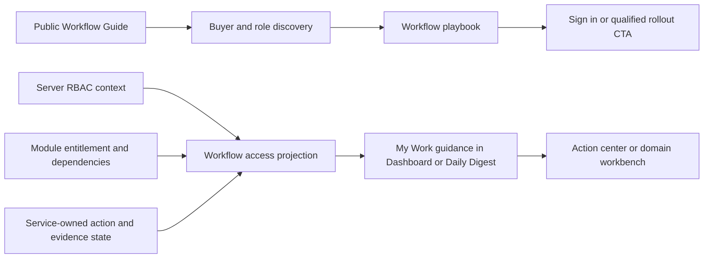

# Stoquify Workflow Atlas Value Evaluation

**Date:** 2026-07-30  
**Scope:** Product value, architecture, user roles, RBAC, module entitlement, overlap, measurement, and launch risk  
**Method:** `aqstoqflow-prompt-architect`, multidisciplinary agent review, repository inspection, focused tests, saved browser evidence, component graph evidence, and official product-pattern research

## Executive Decision

**Verdict: retain, reshape, and split.**

The Workflow Atlas makes sense in Stoquify as a **public workflow guide, onboarding aid, and product-proof catalogue**. It does not yet make sense as a daily operating surface.

1. **Retain the public Atlas.** It explains Stoquify as connected work, control, evidence, and destination rather than another module list.
2. **Reshape the public experience.** Make buyer education, onboarding, and training its primary jobs. Remove the claim that it is a permission-aware daily launchpad.
3. **Split operational guidance from public discovery.** Any authenticated "My Work" experience must be derived server-side from the user's real permissions, tenant and location scope, module entitlement, source state, and assigned work.
4. **Merge daily execution into existing command surfaces.** Use the dashboard, Daily Digest, Manager Action Center, Owner War Room, and domain workbenches. Do not create another broad dashboard until usage evidence proves a dedicated route is valuable.

Confidence is **high** for the public/operational split and **medium** for the eventual authenticated layout until telemetry and user research exist.

## Decision Matrix

| Option | Decision | Reason |
| --- | --- | --- |
| Retain unchanged | Reject | The page mixes prospect, training, and operator jobs and overstates daily operational capability. |
| Reshape | Approve | Preserve the strong workflow/evidence explanation while correcting audience and capability claims. |
| Split | Approve | Public discovery and authenticated work routing need different trust, data, and interaction contracts. |
| Merge operational use | Approve | Put permission-filtered guidance in existing authenticated surfaces and route live work to established command centers. |
| Retire entirely | Reject | The Atlas solves a real product-clarity and onboarding problem and provides the public depth requested by the landing roadmap. |

## Current-State Evidence

The current Atlas is a technically sound public catalogue:

- `/en/workflows` and `/fr/workflows` render a public `WorkflowAtlas` component.
- The component uses local `activeRole` and `activeOutcome` state.
- The catalogue contains 8 operating roles, 12 outcomes, 12 workflows, and 41 unique dashboard destinations.
- Role selection filters static role tags. It does not query the user's tenant, location, permission, entitlement, assignment, urgency, or evidence state.
- "Recommended" means the first three matching records in catalogue order, not the most urgent or relevant work.
- Every outcome currently maps to one workflow, making the second outcome-selection stage less useful than it appears.
- The cards repeat across recommendations, map navigation, and the full playbook library.
- Existing tests verify rendering, role filtering, localization, route-file existence, accessibility mechanics, and evidence paths.
- The existing browser evidence records successful EN/FR mobile and desktop checks.

The implementation is therefore a **public operating manual**, not a live operating surface.

## Where The Atlas Creates Real Value

### Product clarity

The Atlas presents end-to-end journeys such as sell-to-cash, stock-to-sale, procure-to-pay, people-to-pay, reconciliation, close, and compliance. Each journey connects source work, control points, evidence, and protected destinations. That is materially stronger than a list of disconnected modules.

### Onboarding and training

The structure is useful when:

- an implementation lead explains how modules connect;
- a manager trains a new operator;
- an accountant identifies where evidence originates;
- a buyer validates a cross-team process;
- customer success routes a user to the correct protected workspace.

Static, bilingual, non-tenant-specific guidance is appropriate for these jobs.

### Landing-page depth

The home page already contains Connected Workflow, Operations Map, People to Pay, and Use Cases. A dedicated workflow route can carry deeper material while the landing page stays concise. The Atlas should consolidate or replace overlapping public depth instead of duplicating it.

### Stoquify's differentiated narrative

The source-control-proof-destination model expresses the platform's strongest idea: operating activity should remain explainable through reconciliation, accounting, assurance, and close. That narrative should remain central.

## Role Value Assessment

| Role | Natural job and cadence | Best operating destination | Atlas value |
| --- | --- | --- | --- |
| Owner | Identify cash, stock, close, and evidence risk; decide priorities daily | Owner War Room and Daily Digest | Strong public explanation, low daily value because almost every workflow appears relevant |
| Cashier | Open shift, sell, collect, issue receipt, close drawer every shift | POS | Good first-shift orientation, unnecessary during routine operation |
| Stock operator | Receive, count, move, transfer, and explain variance daily | Inventory and action queue | Useful onboarding, but live stock/location state must lead |
| Purchasing/AP | Order, receive, validate payable, approve, and release daily or weekly | Purchase and AP workbenches | Valuable cross-functional journey; purchasing and AP duties must remain distinct |
| HR/payroll | Maintain people facts daily and execute payroll by cycle/deadline | People and Payroll command surfaces | Must separate HRIS access from payroll permissions and privacy scope |
| Accountant | Reconcile, review journals, clear blockers, and close | Reconciliation, Accounting, Close Assurance | Strong buyer story; too broad to be an operational launcher |
| Compliance | Review country evidence, fiscal documents, submissions, and exceptions | Compliance Center | Useful capability explanation; operational use is event and deadline driven |
| Admin | Invite users, assign roles, and manage modules, locations, and security | Settings | Useful during setup and exceptions, weak as daily content |

## Material Findings

### P1: Daily-launchpad language is not proven

Current copy describes a "daily workflow launchpad" and "daily shortcut map." The implementation has static filters and protected links only. It cannot answer:

- What is assigned to me?
- What needs attention now?
- What may I access in this tenant and location?
- Which modules are active?
- Which action is blocked, overdue, stale, or complete?

**Control:** rename the public section to **Workflow Guide** or **Role and Outcome Guide**. Reserve "My Work," "daily," "assigned," and "next action" for authenticated, service-owned state.

### P1: Public role relevance is not authorization

The workflow model has one undifferentiated roles array. A role association can mean owner, participant, approver, reviewer, or interested reader.

**Control:** separate `primaryRoles` from `supportingRoles` for public explanation. Authenticated routing must ignore these labels as access proof and use server-derived permissions.

### P1: Module entitlement is not an authoritative boundary

Current module entitlement behavior remains legacy/observe oriented in important paths. Observe mode can report a decision without blocking access, and some tenants may receive legacy defaults.

**Control:** do not launch an authenticated Atlas until durable tenant entitlements and canonical enforced page/action module guards exist. Permission alone is not sufficient for commercial module access.

### P1: The route test proves existence, not authorization

The current Atlas test checks that links start with `/dashboard/` and that corresponding page files exist. Static inspection found explicit or delegated guards for the 41 destinations, but the Atlas gate itself does not prove:

- the intended permission for each workflow;
- tenant and location scoping;
- module entitlement enforcement;
- denied-state behavior;
- repeated authorization at the action boundary.

**Control:** rename the assertion as a route-existence contract. Add a separate access-registry gate for any authenticated projection.

### P1: Route and policy registries can drift

The Atlas owns hard-coded destination links. The sidebar separately owns route-to-permission and module metadata. The module catalogue separately owns route prefixes, permissions, dependencies, and entitlement behavior.

**Control:** use stable destination IDs and a canonical server registry for authenticated routing. Public descriptions may remain static, but they must not become a third authorization map.

### P2: Public content is repetitive

Recommendations are catalogue-order slices, each outcome maps to one workflow, and workflow cards repeat in the recommendation and library sections.

**Control:** compress the public Atlas to 5-7 cross-functional buyer journeys, show primary owner and collaborators, and use one progressive-detail path rather than repeated cards.

### P2: No value telemetry exists

Functional and visual evidence does not prove comprehension, qualified intent, onboarding success, task completion, or repeated use.

**Control:** define a minimal event contract after privacy, consent, retention, and analytics ownership are agreed.

### P2: Session-aware header behavior is not access awareness

The public shell knows whether a session exists, but the Atlas component does not receive effective tenant, permission, entitlement, or freshness state. Its prominent CTA sends visitors to login even when a session may already exist.

**Control:** keep public authentication display separate from operational authorization. Preserve a signed-in destination only through a safe return path or authenticated adapter.

## Recommended Target Model

### Public Workflow Guide

Keep:

- bilingual role and outcome discovery;
- source, handoff, control, evidence, and destination explanation;
- detailed playbooks;
- protected-route labels;
- sign-in or qualified-rollout CTA.

Change:

- remove daily-launch and assignment implications;
- distinguish primary owner from collaborators;
- compress overlapping role/outcome controls and repeated cards;
- make the home page a concise preview linking to this deeper guide;
- avoid implying that every route is available in every package, tenant, or country.

### Authenticated My Work Guidance

Do not copy the public component into the dashboard.

Build a compact server-owned projection that:

- starts from fresh RBAC context;
- uses effective permissions, not a user-selected role;
- applies organization and location scope;
- enforces module entitlement and dependencies;
- consumes service-owned action/read models;
- exposes only safe allowed, denied, locked, read-only, or step-up states;
- ranks live work above static shortcuts;
- routes exceptions to existing command centers and workbenches.

Default placement should be the main dashboard or Daily Digest. A dedicated `/dashboard/workflows` route should be considered only after measured repeat use shows that a separate surface reduces time-to-action without duplicating command centers.

## Minimum Authenticated Contract

An authenticated workflow projection is not launchable until all of these are true:

1. Server-proven session, active organization, user, roles, and expanded permissions.
2. Tenant isolation and stale-organization session checks.
3. Required permission for every visible destination.
4. Enforced module entitlement and dependency decision.
5. Location or branch scope where required.
6. No hidden count or sensitive-state leakage.
7. Route and action authorization repeated after navigation.
8. Fresh authentication and maker-checker retained for sensitive actions.
9. Normalized states: `login_required`, `tenant_required`, `permission_denied`, `module_locked`, `read_only`, `step_up_required`, and `allowed`.
10. Public role tags never accepted as authorization input.

## Phased Delivery

### Phase 0: Correct the promise

- Keep `/en/workflows` and `/fr/workflows`.
- Replace daily-launch language with workflow-guide and onboarding language.
- Rename the route test so it states what it proves.
- Define analytics privacy and the minimal event taxonomy.

**Exit:** no public copy implies live, assigned, permission-aware, or tenant-aware work.

### Phase 1: Strengthen public learning

- Compress to 5-7 cross-functional stories.
- Add primary owner and collaborator semantics.
- Remove redundant outcome selection and duplicate cards.
- Consolidate overlapping landing-page workflow and use-case material.
- Add shareable role/outcome state only if sales or training needs it.

**Exit:** a prospect or new user can identify the work, control, evidence, and protected destination without mistaking the page for live operations.

### Phase 2: Pilot authenticated guidance

- Implement a server-owned workflow access projection.
- Enforce module entitlement before returning module paths.
- Embed compact guidance in Daily Digest or the main dashboard.
- Reuse existing action centers for live work.
- Test owner, cashier, stock, purchasing/AP, payroll, accountant, and denied-user contexts.

**Exit:** every shown destination is permission- and entitlement-proven; no client role selector affects access.

### Phase 3: Expand only on measured value

- Add assignment/status semantics only when a service owns those states.
- Consider a dedicated route only if repeat use and time-to-action support it.
- Reduce or retire authenticated guidance if it becomes another static link directory.

## Success Metrics

### Public guide

- Role/story engagement.
- Workflow-detail completion.
- Qualified rollout/demo conversion.
- Successful public-to-auth continuation.
- Comprehension of next control and evidence output.

### Onboarding

- First controlled task completed within seven days.
- Median time to first role-specific value.
- Navigation-related support volume.
- Completion of role-specific setup or readiness checklist.

### Authenticated pilot

- Authorized destination success rate.
- Denied-route click rate.
- Median selection-to-action time.
- Open-to-resolution rate for surfaced actions.
- Weekly repeat use by eligible roles.
- Percentage of surfaced paths backed by fresh source data.

Suggested provisional gates:

- at least 98% of launches reach an authorized destination;
- zero known permission-dead-end calls to action;
- a measurable reduction in time-to-relevant-action;
- repeated use across at least three role families;
- no tenant, permission, entitlement, or hidden-state defect.

Kill or reduce the authenticated layer if it does not improve task access, is used mainly as a static directory, or duplicates the sidebar and command centers.

## External Pattern Review

Only transferable product principles were used. No external visual design or wording should be copied.

| Official pattern | Transferable lesson | Current Stoquify boundary |
| --- | --- | --- |
| [Microsoft Dynamics 365 operational workspaces](https://learn.microsoft.com/en-us/dynamics365/fin-ops-core/dev-itpro/user-interface/build-workspaces) | A workspace supports a logical activity for a target persona, shows current state, enables light tasks, and links to deeper work. | The public Atlas has no current-state or light-task contract. |
| [SAP Signavio Process Collaboration Hub](https://help.sap.com/docs/signavio-process-collaboration-hub) | A central process guide supports shared understanding and onboarding. | Audience curation is not authorization. |
| [SAP Signavio audience-specific home page](https://help.sap.com/docs/signavio-process-collaboration-hub/user-guide/manage-home-page) | Different audiences can receive curated launchpad content. | Authenticated curation must still use Stoquify server policy. |
| [Salesforce Flow Orchestration work items](https://help.salesforce.com/s/articleView?id=platform.orchestrator_concepts_work_items.htm&language=en_US&type=5) | Real work guides are backed by assignment, ownership, status, and completion. | Static links must not be called assigned work or orchestration. |
| [Oracle NetSuite role centers](https://docs.oracle.com/en/cloud/saas/netsuite/ns-online-help/chapter_N131898.html) | Operational centers derive pages and live data from assigned roles. | A self-selected public role lens is not an operational center. |

## Verification Performed

| Check | Result |
| --- | --- |
| `npm run ui:gate:workflow-atlas` | PASS: 3 suites, 12 tests |
| Existing browser evidence | PASS recorded for EN/FR at 390x844 and 1440x1100 |
| Existing rounded-corner evidence | PASS recorded |
| Unique Atlas destination inventory | 41 routes |
| Representative authorization inspection | POS, Sales, Reconciliation, Accounting, Compliance, Users, Purchases, People, Payroll, Daily Digest, Manager Action Center, and Owner War Room |
| Multidisciplinary agent review | Product, architecture, and security reviews completed |
| Component graph | Available graph dated 2026-07-14, before Atlas implementation; useful for established command-surface boundaries but not current Atlas integration |
| Fresh screenshot visual review | Not completed because the local image sandbox helper failed; prior screenshot and JSON evidence remain available |

No application code was changed during this evaluation.

## Residual Launch Risk

### Public preview

**Conditional GO** after copy correction and human visual review.

- Current daily-launch language overstates static behavior.
- Saved screenshots were not visually reopened in this run.
- Static route references can drift from sidebar and module registries.
- No product telemetry proves visitor or onboarding value.

### Authenticated operational use

**NO-GO in the current form.**

- Self-selected roles are not authorization.
- Module entitlement is not yet an enforced, authoritative boundary across the required paths.
- No live assignment, urgency, freshness, or completion model exists in the Atlas.
- Denied-state behavior is inconsistent across modern and legacy routes.
- Existing command surfaces would be duplicated.

## Final Recommendation

Keep the useful idea and narrow its promise.

The public Atlas should help people understand Stoquify and learn its controlled workflows. Real daily work should remain inside permission-filtered, tenant-safe, service-owned surfaces. The next valuable implementation is therefore not a larger Atlas, but a smaller public guide plus contextual authenticated guidance that proves access and routes users directly into live work.
