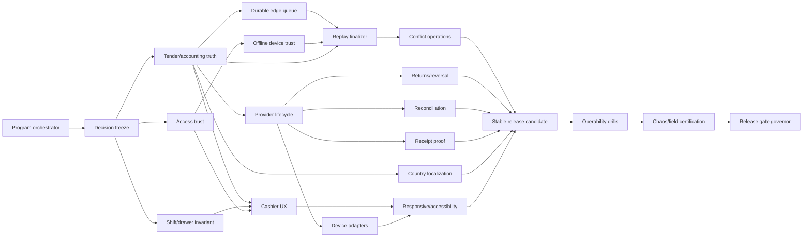

# Stoquify POS 9+ Specialist-Skill Architecture

Date: 2026-07-20

Status: Installed and validated under C:\Users\J COMPUTER\.codex\skills

Source: `docs/pos/STOQUIFY_POS_9_PLUS_EVALUATION_AND_ROADMAP_2026-07-20.md`

## 1. Executive recommendation

Use a thin program orchestrator above 18 bounded specialist skills. Adapt existing Stoquify skills wherever their source of truth and verification method already fit; create a new skill only for a genuine ownership gap. Builders must not certify themselves, the orchestrator must not implement product code, and the release governor must not repair defects.

Recommended first wave:

1. Create the orchestrator, tender/accounting truth, shift/drawer invariant, and access-trust skills.
2. Freeze STORE_CREDIT, session-boundary, entitlement, provider, offline-risk, hardware, refund, and country-pack decisions.
3. Stop at Hold Point HP-1 until G1, G2, and the design portions of G5 have approved contracts.
4. Only then create provider, offline, correction, and experience implementation skills.
5. Create independent certification and release-governance skills last, before any promotion claim.

## 2. Architecture principles

- One accountable skill per mutation boundary.
- Shared state contracts may be consumed by many skills but authored by one.
- UI skills never invent financial, authorization, device, or replay truth.
- Offline transport, device authenticity, economic replay, and human conflict resolution remain separate failure domains.
- Payment capture is separate from settlement reconciliation.
- Accessibility and field certification provide independent evidence; they do not repair the candidate during certification.
- A disabled capability may be not applicable only when hidden, documented, and technically unreachable.
- Any failed G1-G8 mandatory gate is NO-GO.

## 3. Proposed skill catalog

### Program governance

| Skill | Adapt/create | Bounded responsibility | Primary outputs | Gates |
|---|---|---|---|---|
| `stoquify-pos-9plus-program-orchestrator` | Create; compose `aqstoqflow-uiux-00-orchestrator` and program-control patterns | Maintain decisions, dependency DAG, work-package ownership, evidence registry, hold points, and dispatch; never implement or self-certify | Status register, DAG, handoffs, blockers, next-work prompt | All gates; owns none |

### Financial, session, and correction truth

| Skill | Adapt/create | Bounded responsibility | Primary outputs | Gates |
|---|---|---|---|---|
| `stoquify-pos-tender-accounting-truth` | Adapt `007-aqstoqflow-pos-ledger-controls` | Tender eligibility/state plus stock, cash, journal, fiscal, receipt, audit, and close consequences | Tender state machine, accounting matrix, golden fixtures | G1, G6 |
| `stoquify-pos-shift-drawer-invariant` | Create | Physical register boundary, DB-enforced active-session uniqueness, atomic claim, handover, and recovery | Decision record, migration/backfill, race evidence | G2, G5 |
| `stoquify-pos-provider-payment-lifecycle` | Create using provider portions of reconciliation adapters | Authorization, capture, status query, webhook trust, timeout, late success, reversal, and refund provider contracts | Adapter contract, evidence, kill switch, provider certification | G1, G5, G6 |
| `stoquify-pos-returns-reversal-controls` | Adapt correction boundary of `007-aqstoqflow-pos-ledger-controls` | Partial/full/cross-shift correction lifecycle across provider, cash, stock, journal, fiscal, receipt, and approvals | Eligibility service, correction state machine, evidence workbench contract | G1, G2, G5, G6, G7 |
| `stoquify-pos-payment-reconciliation-certifier` | Compose existing `01`-`05-payment-recon-*` suite | Statement ingestion, deterministic matching, suspense, maker-checker resolution, settlement/fee/refund certification, and close linkage | Certified reconciliation run and evidence pack | G1, G5, G6, G8 |

### Offline continuity and trust

| Skill | Adapt/create | Bounded responsibility | Primary outputs | Gates |
|---|---|---|---|---|
| `stoquify-pos-offline-durable-edge-queue` | Split client boundary from `014-aqstoqflow-offline-pos-sync` | IndexedDB queue, durable event states, leases, stale recovery, multi-tab safety, per-event acknowledgement, retention, export | Queue repository, migration, browser chaos evidence | G3, G8 |
| `stoquify-pos-offline-device-trust` | Split trust boundary from `014-aqstoqflow-offline-pos-sync` | Registration, canonical signing, server verification, sequence/freshness, rotation, revocation, compromise response | Key lifecycle, verifier, attack corpus, runbook | G4, G5 |
| `stoquify-pos-offline-replay-finalizer` | Strengthen existing `aqstoqflow-offline-pos-replay-finalizer` | Reuse canonical sale finalizer exactly once and persist terminal economic evidence | Replay adapter, stable blockers, duplicate/race evidence | G1, G3, G4, G6 |
| `stoquify-pos-offline-conflict-operations` | Create | Conflict taxonomy, authorized acknowledge/correct/retry/reject/quarantine/escalate, ownership, SLA, audit, close linkage | Resolution engine and supervisor workbench contract | G3, G5, G6, G7, G8 |

### Access and experience

| Skill | Adapt/create | Bounded responsibility | Primary outputs | Gates |
|---|---|---|---|---|
| `stoquify-pos-access-trust-hardener` | Adapt `aqstoqflow-module-access-guard-contract` | Auth, tenant ownership, entitlement, RBAC, fresh auth, maker-checker, privacy, and capability-aware presentation | Surface/control matrix and negative evidence | G4, G5 |
| `stoquify-pos-cashier-workstation-ux` | Adapt POS lane of `aqstoqflow-uiux-00-orchestrator` | Incremental decomposition plus cashier catalog/cart/customer/tender/proof/recovery ergonomics; consumes authoritative states | Target component tree, state matrix, journey evidence, performance budgets | G7 |
| `stoquify-pos-device-adapter-certification` | Create | Scanner, printer, drawer, customer display, and terminal capability adapters, diagnostics, reconnect, simulators, supported matrix | Adapter contracts, emulators, field matrix, support bundle | G1, G2, G4, G7 |
| `stoquify-pos-receipt-delivery-proof` | Create from existing receipt-token strengths | Truthful print/email/SMS/public receipt availability, provisional/final state, retry, revocation, redaction, evidence | Channel registry, delivery state machine, provider evidence | G6, G7 |
| `stoquify-pos-country-pack-money-localization` | Adapt `015-aqstoqflow-country-adapter-pilot` | EN/FR copy and approved country-pack currency, minor-unit, cash-rounding, tax/fiscal terminology presentation | Locale matrix, golden money fixtures, activation checklist | G1, G6 |
| `stoquify-pos-responsive-accessibility-certifier` | Create; compose accessibility and responsive evidence | WCAG 2.2 AA, keyboard/screen reader, focus/announcements, zoom/reflow, touch, compact/handheld viewport certification | WCAG matrix, evidence, responsive baselines, blockers | G7 |

### Operability and independent assurance

| Skill | Adapt/create | Bounded responsibility | Primary outputs | Gates |
|---|---|---|---|---|
| `stoquify-pos-operability-slo-runbook-builder` | Create using platform observability patterns | Canonical telemetry, SLIs/SLOs, alerts, dashboards, support bundles, runbooks, incident/rollback drills | SLO catalog, alert routing, runbooks, drill evidence | G8 plus evidence for G1/G3/G4/G6 |
| `stoquify-pos-chaos-field-certifier` | Adapt `aqstoqflow-release-verification-foundation` | Independently test real DB concurrency, offline chaos, provider failures, browser/accessibility, hardware, performance, recovery | Immutable build-bound certification evidence | Evidence for G1-G8 |
| `stoquify-pos-release-gate-governor` | Adapt `017-aqstoqflow-enterprise-release-gate` | Evaluate G1-G8, claims scope, residual risk, migration/rollback, and promotion; never fix | Gate matrix, claims matrix, signed verdict | Final G1-G8 decision |

## 4. Trigger and handoff contracts

| Skill | Example trigger | Must receive | Must hand off |
|---|---|---|---|
| Program orchestrator | “Execute the next safe POS 9+ wave.” | Approved backlog, decisions, current evidence | Bounded prompt, file ownership, prerequisites, stop conditions |
| Tender/accounting truth | “Harden POS tender and posting truth.” | Country policy, supported tenders, current posting kernel | Versioned tender/accounting contract |
| Shift/drawer invariant | “Make shift opening concurrency-safe.” | Chosen physical boundary, duplicate-data audit | Migration, atomic claim API, conflict contract |
| Provider lifecycle | “Integrate authoritative mobile-money capture and reversal.” | Approved provider, tender contract, sandbox | Provider states/evidence, kill switch, reconciliation feed |
| Durable queue | “Replace the POS localStorage queue safely.” | Browser matrix, offline envelope/outcome contract | Durable queue API, migration, event acknowledgement |
| Device trust | “Verify signed POS offline device events.” | Device authority and canonical envelope | Registration/signature contract and verifier |
| Replay finalizer | “Finalize accepted offline events exactly once.” | Signed accepted event, canonical sale finalizer | Terminal replay outcome and close evidence |
| Conflict operations | “Add supported POS replay conflict recovery.” | Stable conflict codes and replay outcomes | Authorized terminal-resolution contract |
| Returns controls | “Implement partial tender-aware POS returns.” | Correction policy, provider reversal, stock/accounting/fiscal rules | Correction lifecycle and proof |
| Reconciliation | “Certify POS provider settlement.” | Internal payment, provider events/statements, posting evidence | Match/suspense/certificate and close blocker |
| Access trust | “Enforce POS entitlement and negative tenant controls.” | Surface inventory, ownership model, permissions | Guard matrix and negative tests |
| Cashier UX | “Modernize scan-to-sale without moving truth client-side.” | Approved capability/payment/offline states | UI contracts, parity/performance/browser evidence |
| Device adapters | “Add and certify POS scanner/printer support.” | Supported hardware decision and protocol/provider contracts | Objective device states and certification evidence |
| Receipt proof | “Enable truthful receipt delivery.” | Final/provisional fiscal/payment states and providers | Delivery evidence and supervisor governance contract |
| Country localization | “Make XAF and French POS behavior correct.” | Approved country pack and provenance | Golden fixtures and reviewed catalogs |
| Responsive/accessibility | “Certify POS WCAG and supported viewports.” | Stable candidate and supported matrix | Independent G7 evidence or blockers |
| Operability | “Create POS SLOs, alerts, and recovery runbooks.” | Stable state/error vocabulary and owners | Telemetry/runbook contracts and drill results |
| Chaos certifier | “Certify this POS release candidate.” | Immutable candidate, matrices, gate criteria | Raw evidence and independent verdict |
| Release governor | “Decide whether this POS capability may ship.” | Candidate-bound evidence, risks, rollback | PASS/FAIL/BLOCKED per gate and claims scope |

## 5. Dependency and execution order

Parallel execution is allowed only after shared contracts are frozen and file/mutation ownership does not overlap.

## 6. Non-overlap rules

- Tender truth owns internal economic state; provider lifecycle owns external real-time operations; reconciliation owns later statement matching and suspense.
- Durable queue owns browser storage/transport; device trust owns authenticity; replay owns economic finalization; conflict operations owns human recovery.
- Cashier UX owns presentation and interaction only; it consumes server capability states.
- Device adapters report capabilities and failures; they do not determine payment settlement.
- Country localization propagates approved policy; it does not invent law, tax, fiscal, or accounting rules.
- Operability observes and guides recovery; certification attacks the candidate; release governance decides promotion.
- The orchestrator coordinates and records but never edits product code or weakens a specialist verdict.

## 7. Bundled-resource design

Keep every `SKILL.md` concise and place detailed reusable material one level deep.

Recommended shared references:

- `references/pos-g1-g8-gates.md`
- `references/pos-state-vocabulary.md`
- `references/evidence-provenance-contract.md`
- `references/pos-access-surface-taxonomy.md`
- `references/offline-chaos-scenarios.md`
- `references/hardware-certification-matrix.md`
- `references/telemetry-redaction-policy.md`

Recommended deterministic scripts:

- `scripts/validate_dependency_dag.py`
- `scripts/validate_work_package_ownership.py`
- `scripts/validate_gate_evidence.py`
- `scripts/validate_entitlement_coverage.py`
- `scripts/hash_evidence_bundle.py`

Scripts must be read-only by default, deterministic, and tested before adoption.

## 8. Skill creation waves

### Wave S0 — governance foundation

Create and validate:

1. `stoquify-pos-9plus-program-orchestrator`
2. `stoquify-pos-tender-accounting-truth`
3. `stoquify-pos-shift-drawer-invariant`
4. `stoquify-pos-access-trust-hardener`

Exit: decision register, work-package DAG, ownership matrix, G1/G2/G5 contracts, and HP-1 approval.

### Wave S1 — P0 money and offline trust

Create/adapt provider lifecycle, durable queue, device trust, replay finalizer, conflict operations, returns controls, and reconciliation certifier.

Exit: complete P0 state/handoff contracts and independent validation scenarios. Offline remains disabled.

### Wave S2 — professional experience

Create/adapt cashier UX, device adapters, receipt proof, country localization, and responsive/accessibility certification.

Exit: workflow-first architecture with no fabricated capabilities and measurable G7 criteria.

### Wave S3 — assurance

Create operability, chaos/field certification, and release-governor skills.

Exit: independent evidence chain from exact candidate to G1-G8 verdict.

## 9. Validation plan for proposed skills

For each skill:

1. Initialize using the system `skill-creator` toolchain only after user approval.
2. Use only `name` and `description` in frontmatter.
3. Generate matching `agents/openai.yaml` metadata.
4. Validate with `quick_validate.py`.
5. Forward-test against raw POS artifacts using a fresh agent without leaking the expected answer.
6. Verify that two independently triggered skills do not claim the same mutation boundary.
7. Verify that failed gates produce BLOCKED or NO-GO rather than qualified completion.
8. Confirm each skill preserves unrelated working-tree changes and reports exact evidence.

## 10. Exact next prompt

> Create Wave S0 of the approved Stoquify POS 9+ skill architecture: `stoquify-pos-9plus-program-orchestrator`, `stoquify-pos-tender-accounting-truth`, `stoquify-pos-shift-drawer-invariant`, and `stoquify-pos-access-trust-hardener`. Use the system skill-creator workflow, initialize each skill under the user-approved skill root, keep SKILL.md concise, generate agents/openai.yaml, add only necessary one-level references and deterministic validation scripts, run quick_validate.py, and forward-test each skill against raw POS evidence. Do not implement product changes. Preserve unrelated workspace changes. Stop if ownership overlaps, a product decision is missing, or validation fails.

## 11. Verdict

The complete suite is installed and structurally valid. Wave S0 forward tests correctly stopped at unresolved decisions and failed critical gates. Begin execution with GOV-01; do not bypass HP-1 or create a single all-purpose POS implementation skill.

