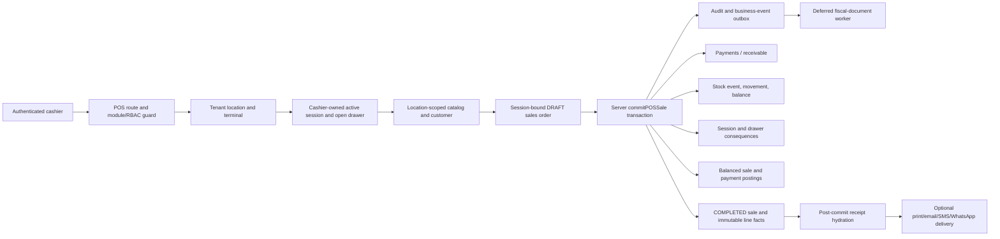

# Stoquify POS Sale Atomicity and Receipt Assurance

Date: 2026-08-15  
Scope: POS sale completion, payment, receipt issuance, inventory, cashier session, accounting, isolation, offline/outbox recovery  
Routes: `/en/dashboard/pos`, `/fr/dashboard/pos`  
Selected execution skill: `007-aqstoqflow-pos-ledger-controls`

## Executive verdict

**Overall classification: Implemented but not production-proven.**

Stoquify does not have a “nothing works” POS problem. A live authenticated cash sale completed locally and produced mutually consistent sale, payment, stock, drawer, session, posting-batch, journal, audit, and outbox records. The core commit is a single database transaction and the focused automated evidence is substantial.

This run nevertheless confirmed three sale-completion defects and remediated them surgically:

1. Finalization trusted persisted draft totals instead of independently reconciling every line and the order total at commit time.
2. The active session lookup did not prove that the selected terminal still pointed to that same session and its opening drawer evidence.
3. The cash drawer used a read-then-absolute-update sequence that could lose one of two concurrent cash-sale updates.

The fixes add exact decimal server reconciliation, terminal/session/drawer consistency checks, and compare-and-set claims for session and drawer state. Focused tests prove that stale or inconsistent state is rejected before payment and ledger writes.

The portfolio is **not** classified as proven because the remaining gaps are material:

- A retry after an ambiguous client response does not return the original committed result; it prevents a second commit but currently reports that the draft no longer exists.
- Card, mobile-money, and bank-transfer entries are cashier-declared evidence, not demonstrated provider authorization/capture state machines. Unknown provider outcomes and delayed callbacks are therefore not proven.
- The durable fiscalization instruction exists, but the live sale still had a pending outbox event and no generated immutable `FiscalDocument` at observation time.
- Email, SMS, and print delivery are placeholder/PENDING paths; WhatsApp has a durable outbox but was not exercised against a live provider.
- The authenticated live shift could not close because its offline queue contained one pending event, one conflict, and one blocker.
- PostgreSQL-backed cashier-close integration evidence remained opt-in and skipped in the broad test run.
- The production receipt-token signing secret is not configured locally, and the Super Admin seed user received a receipt-management permission denial.
- The repository-wide inventory boundary gate and migration-safety gate have pre-existing blockers outside the files changed in this run.

This is a locally credible cash-sale kernel with explicit production blockers, not a production certification or an OHADA/SYSCOHADA fiscal opinion.

## Current workflow map

The authoritative completion path is `commitPOSSaleAction` → `commitPOSSale`. The action derives organization and user identity from the authenticated server context and enforces POS permission/module access. The service loads the draft, verifies the location/terminal/session/customer/stock context, calculates tender allocations, and commits all strongly consistent internal effects in `db.$transaction`.

Receipt hydration and customer delivery execute only after the transaction commits. Fiscalization is represented inside the transaction by a durable business-event/outbox instruction and is materialized by a later worker.

Refund and void paths exist as separate permissioned commands. They create compensating inventory, payment, accounting, audit, and event records rather than rewriting the original history. Store-credit tender is intentionally rejected. On-account sales create receivable and customer-ledger consequences.

No second competing online sale-finalization service was found. Offline sales enter through the offline replay service and converge through idempotent event/stock/accounting controls rather than the interactive UI call stack.

## Transaction and trust boundaries

### Browser boundary

The browser may express location, terminal, customer, cart mutations, tenders, provider references, and receipt preference. It is not authoritative for organization identity, permissions, prices, stock, line totals, tax totals, tender sufficiency, session state, or financial posting.

The action layer derives `organizationId` and `userId` from the authenticated context. The finalization service re-reads the draft and operational records inside the database transaction.

### Strongly consistent database boundary

The following occur inside the same transaction:

- claim the DRAFT sale for completion;
- validate and persist the customer association and completed sale state;
- claim stock through the inventory event/CAS kernel and create movement evidence;
- update cashier-session totals;
- compare-and-set the active cash drawer and create its SALE movement;
- create payment records or on-account receivable/customer-ledger effects;
- create sale and payment posting batches/journals and source links;
- create audit evidence;
- create the sale-finalized business event and fiscalization/notification outbox work.

Any thrown error rolls this internal transaction back. Unit tests assert the absence of downstream payment and ledger calls when session, totals, or drawer claims fail.

### External and eventually consistent boundary

The following correctly remain outside the ACID transaction:

- receipt rendering/hydration for the response;
- print, email, SMS, and WhatsApp delivery;
- provider communication and reconciliation;
- fiscal-document materialization by the outbox worker;
- notification delivery.

Post-commit receipt hydration failure returns the committed sale with `receiptStatus: RETRY_REQUIRED`; it does not roll back or conceal the sale. That recovery shape was already present in the working tree and is covered by a focused test.

## State-transition model

| Aggregate | Observed states and transition | Control assessment |
| --- | --- | --- |
| Sales order | `DRAFT → COMPLETED/PAID`; later `REFUNDED` or `VOIDED` through compensating commands | Completion claim is conditional; second finalizer cannot repeat side effects. Original-result replay remains missing. |
| POS session | `ACTIVE → CLOSING → CLOSED`, with recovery to `ACTIVE` on failed close where applicable | Close kernel and static gates pass; live session was blocked by offline conflict. |
| Cash drawer | opened by one opening-balance record; SALE movements update current and expected cash; close finalizes | Current sale now CASes the exact active drawer balances. |
| Payment | created `PAID` for accepted tenders; refund records compensate | Cash semantics are locally demonstrated. Electronic provider state is not independently proven. |
| Stock event | durable event claimed/applied, movement created, balance decremented | Event and balance scopes are tenant/location/item bound; optimistic concurrency prevents lost stock updates. |
| Posting batch/journal | created and `POSTED`, with source links and balanced debit/credit | Live sale and payment journals balanced. Closed-period behavior is covered by the ledger gate, not production evidence. |
| Business event/outbox | `RECORDED/PENDING → worker processing → applied/failed/retry` | Durable instruction exists. Live fiscalization was still pending. |
| Fiscal document | absent before worker; immutable record/lines after successful worker | Correct asynchronous boundary, but the live sale did not reach this state. |
| Receipt delivery | `SKIPPED`, `PENDING`, `SENT`, or failure/retry according to channel | “No receipt” correctly means no delivery. Durability varies by channel. |

## Root causes and confirmed defects

### 1. Stored draft math was accepted at commit

The draft and its lines contained persisted subtotal, discount, tax, and total values. Finalization rounded and used the order total but did not independently prove that each line still satisfied `quantity × unit price − discount + tax`, or that the order aggregates equalled the sum of the lines.

Impact: stale or directly corrupted persisted draft values could flow into tender allocation, session totals, fiscalization hashes, and journals.

### 2. Session evidence was not fully bound to terminal truth

The session was scoped by organization, location, terminal, cashier, and ACTIVE status, but completion did not also prove that the terminal was active and still had `currentSessionId` equal to the claimed session. It also discovered a drawer independently instead of binding to the session's unique opening evidence.

Impact: stale terminal/session state or ambiguous drawer evidence could be used during completion.

### 3. Cash drawer update could lose a concurrent sale

The service read a drawer balance and then wrote an absolute new balance. Two concurrent transactions starting from the same value could each calculate a new balance and one could overwrite the other.

Impact: both sales could complete while expected physical cash increased only once.

### 4. Important gaps confirmed but not hidden by code changes

- No sale-level client idempotency key/result registry returns the original result after response loss.
- Electronic tenders are not backed by a demonstrated authorization/capture/pending/unknown provider state machine.
- Receipt rendering before fiscalization reads mutable organization, location, item, and customer presentation data.
- Print/email/SMS delivery is not a demonstrated durable provider integration.
- Country-pack fiscal requirements and production fiscal worker evidence are not certified.
- Cashier-close support is split between credible kernel/static evidence and an unresolved live offline blocker.

## Implemented remediation

This run changed only the POS service and its focused unit tests for the three confirmed defects:

- Added exact `Prisma.Decimal` line and aggregate reconciliation before the sale, stock, payment, or posting claims.
- Rejects non-positive quantities, negative prices/discounts, discounts above line gross, and tax rates outside 0–100.
- Uses the newly calculated totals for session tax/discount, revenue/tax posting, and the fiscalization source hash.
- Requires an active terminal whose tenant, location, and `currentSessionId` match the cashier session.
- Requires exactly one session opening drawer record, an open drawer, and matching session/drawer current and expected balances.
- Adds `expectedBalance` and terminal relationship conditions to the POS-session compare-and-set claim.
- Replaces the drawer absolute update with `updateMany` compare-and-set on drawer identity, open state, current balance, and expected balance.
- Stops before payment and ledger writes when the drawer CAS loses.
- Adds focused adverse tests for stale terminal linkage, inconsistent totals, correct session/drawer money claims, and lost drawer concurrency.

Relevant customer/location isolation changes and receipt-retry behavior already existed in the dirty working tree before this run. They were verified and included in the evidence, but are not misrepresented here as new changes.

## Isolation matrix

| Boundary | Repository control | Result |
| --- | --- | --- |
| Organization | Authenticated action supplies tenant/user context; service predicates and unique keys include organization | Implemented; focused action/service tests pass |
| Location | Active tenant-owned location and route context; terminal, session, catalog, customer, stock, movement, and journals carry location | Implemented; database-level composite coverage is not universal |
| Terminal | Tenant/location-scoped and active; commit now requires terminal `currentSessionId` to equal session | Implemented and focused test passed |
| Session/cashier | Tenant/location/terminal/user/ACTIVE predicate plus conditional claim | Implemented and focused tests passed |
| Drawer | Exact opening evidence for session; terminal/location predicate; balance CAS | Implemented and focused tests passed |
| Customer | `requirePOSCustomerAtLocation` requires active, non-deleted tenant customer eligible for selected location | Implemented; location/customer suite passed |
| Draft cart | DRAFT order scoped to tenant/location/terminal/session; session ownership is required for creation/mutation | Implemented; focused tests passed |
| Item/stock | Catalog and balance are tenant/location scoped; event claim/CAS and movement source are sale-scoped | Implemented; POS/inventory tests passed |
| Batch/serial/variant/UOM | Not represented as selectable constraints in the audited POS finalization path | Partial; unsupported capabilities must not be implied by UI or packaging |
| Price/tax/discount | Persisted server draft facts are revalidated at commit with exact decimal math | Implemented in this run; tax-inclusion/exemption overrides are not a supported POS option |
| Tender/payment | Payment rows carry organization/location/sale/session; electronic provider references have tenant/method uniqueness | Partial; provider ownership/capture truth is not proven |
| Currency | Organization-owned accounting/fiscal records use organization currency; tender input has no independent currency | Partial; acceptable for single-currency POS, not proof of multi-currency isolation |
| Accounting | Tenant/location/source-linked posting kernels and idempotent batches; balanced-entry gate | Implemented locally; no production-period close certification |
| Receipt/token | Sale/org predicates; scoped token registry supports expiry/revocation; secret gate exists | Partial; local signing secret absent and live permission denied |
| Offline event | Tenant/device/sequence/hash keys, quarantine and replay controls | Implemented; automated gate passes, live queue has unresolved conflict |
| Module/RBAC | Finalize/refund/void actions enforce permission and POS module | Implemented for financial commands; some supporting surfaces remain observe-mode |

No evidence of a successful cross-tenant or cross-location write was found. “No evidence found” is not equivalent to a formal database isolation proof: some relationships rely on service predicates rather than composite foreign keys.

## Sale math contract

For every line the server now calculates, to two decimal places:

`gross = quantity × unit price`  
`taxable base = gross − line discount`  
`tax = taxable base × tax rate / 100`  
`line total = taxable base + tax`

The order subtotal, discount, tax, and total must equal the exact sum of the line values. Any mismatch returns a safe conflict before the sale claim. Decimal arithmetic uses `Prisma.Decimal`; JavaScript floating point is not accounting truth.

Tender allocation then proves full coverage. Cash overpayment produces change; non-cash overpayment is not treated as cash change. On-account amounts enter receivable/credit-limit logic. Negative/return behavior is handled by the separate refund/void workflows, not by negative sale lines.

Current tax semantics are tax-exclusive. Inclusive tax, tax-exemption selection, tax override, price-list promotion logic, variant/batch/serial selection, and explicit UOM conversion are not implemented in this sale path and therefore remain partial/not applicable rather than silently assumed.

## Atomicity and idempotency contract

### Proven by structure and tests

- Strongly consistent internal sale consequences execute in one Prisma transaction.
- The DRAFT sale state is claimed conditionally, so concurrent finalizers cannot both transition it.
- Stock uses idempotent source keys and optimistic concurrency.
- Drawer and session now use explicit compare-and-set predicates.
- Payment provider references, posting source identities, business events, fiscal source identities, and other consequence records have uniqueness/idempotency controls.
- A pre-commit failure rolls back the database transaction.
- Receipt hydration/delivery failures occur after commit and do not undo the sale.
- Offline replay has deterministic device/sequence/hash controls and passed its 16/16 gate.

### Not yet proven or incomplete

- Retrying the same interactive request after an unknown response prevents duplicate consequences but does **not return the original committed response**. Add a tenant-scoped client idempotency key, payload hash, final result reference, and conflict rule.
- No PostgreSQL concurrency/failure-injection run demonstrated two real transactions racing on sale, stock, session, and drawer rows.
- Provider authorization/capture cannot be atomically included in the database transaction. The required saga state (`PENDING_PROVIDER`, `AUTHORIZED`, `CAPTURED`, `UNKNOWN`, `DECLINED`, `REVERSED`) is not yet demonstrated.
- The live fiscal/notification outbox events were pending; worker execution, retry, dead-letter handling, and alert ownership were not observed end to end.

Recommended idempotency extension: require `clientCommitId` on online and offline finalization, persist `(organizationId, clientCommitId, payloadHash, saleId, resultVersion)` transactionally, return the original sale/result for the same hash, and reject key reuse with a different hash.

## Payment and provider-failure semantics

| Method/scenario | Current truth | Classification |
| --- | --- | --- |
| Cash | Server allocation, change, payment row, session total, drawer movement, sale/payment journals | Proven locally for one live sale; not production-proven |
| Split tender | Allocation and posting logic with automated coverage | Implemented but not live-proven |
| Card | Cashier-entered provider reference is stored and payment becomes PAID | Partial; no live provider capture/unknown state |
| Mobile money | Same manual-reference pattern as card | Partial |
| Bank transfer | Same manual-reference pattern as card | Partial |
| Store credit | Explicitly rejected with a business rule | Not supported by design |
| On account | Receivable document, customer ledger and credit-limit CAS | Implemented; automated evidence only |
| Partial payment | Only coherent when residual is represented by on-account; arbitrary underpayment is rejected | Partial by product design |
| Cash overpayment | Change is calculated and net cash reaches drawer | Implemented; live exact-cash case, automated change coverage |
| Duplicate provider reference | Tenant/method reference uniqueness and preflight check | Implemented; provider webhook race not live-proven |
| Provider timeout/unknown | No authoritative pending/unknown sale-payment state in interactive commit | Missing |
| Delayed success callback | Reconciliation primitives exist, but no demonstrated commit/callback saga | Partial |
| Refund | Full paid sale compensation path with refund rows, stock, cash, ledger and event | Implemented; broad automated suite, not browser-proven |
| Void | Permissioned compensating path including on-account receivable handling | Implemented; broad automated suite, not browser-proven |
| Chargeback | Schema/reconciliation concepts exist outside the audited sale completion | Not proven end to end |

Sale status, payment status, provider settlement, and reconciliation should remain separate. The current cash path does this sufficiently. Electronic tenders need an explicit provider-boundary state machine and suspense/reconciliation ownership before they can be called reliable.

## Receipt architecture decision

### Current repository truth

The transaction creates a durable `pos.sale.finalized` business event with fiscalization work. After commit, the service hydrates a receipt payload from committed sale facts and optionally invokes delivery. “No receipt” creates auditable `RECEIPT_NONE/SKIPPED` evidence; it does not remove the sale, payments, inventory, journals, or fiscalization instruction.

The fiscalization worker can create an immutable `FiscalDocument` and fiscal lines idempotently. However, before that worker succeeds, ordinary receipt rendering includes current mutable display data such as organization/location/item/customer names. In the observed sale the fiscalization event was pending and no fiscal document existed.

WhatsApp has a durable delivery outbox. Print/email/SMS currently return placeholder/PENDING behavior and audit evidence rather than a demonstrated durable provider delivery. Public tokens support scoping, expiry, and revocation in design, but local signing configuration was absent and receipt management returned `Forbidden` for the seeded Super Admin.

### Options

| Option | Advantages | Disadvantages | Decision |
| --- | --- | --- | --- |
| A — authoritative immutable receipt/fiscal source for every completed sale; optional delivery | Best audit, reprint, support, reconciliation, dispute and fiscal foundation; “no receipt” creates no evidence gap | More storage, numbering, retention, privacy, correction and worker operations | **Recommended** |
| B — persist only when customer requests | Lower volume and simpler for low-control deployments | Inconsistent evidence, weak reprint/support, historical reconstruction risk, possible country-pack conflict | Reject as platform default |
| C — render only from live sale and master data | Small initial implementation | Mutable history, weak duplicate/reissue/delivery evidence, unsuitable as a strong financial control | Reject as authority; may remain a convenience view only |

Recommendation: complete Option A by materializing an immutable tenant-scoped receipt source record (or legally equivalent fiscal document) for every completed sale. Delivery preference must affect only print/message delivery. Snapshot sale number, receipt number, issued time, tenant, location, terminal, cashier, applicable customer, currency, line descriptions/SKUs/UOM, quantities, unit prices, discounts, taxable bases, taxes, totals, tenders, paid, due, and change. Numbering, correction, void/reissue, retention, token privacy, and fiscal fields must be supplied by versioned country packs with dated expert-reviewed provenance.

This is an architecture recommendation, not legal or fiscal certification.

## Workflow consequence matrix

| Consequence | Transactional source | Idempotency/isolation | Live evidence | Readiness |
| --- | --- | --- | --- | --- |
| Sale | DRAFT claim → COMPLETED/PAID | Tenant/location/terminal/session/user predicates | `POS-CMP005-TERM-001-20260815-GXDD2` | Proven locally |
| Payment | Payment row(s) linked to sale/session/location | Provider-ref uniqueness; sale transaction | Cash `PAY-20260815-LZE7EO2`, 37,578.79 | Cash proven locally; electronic partial |
| Receipt source | Sale-finalized/fiscalization instruction in business event | Tenant/source/hash identity | Instruction PENDING, no fiscal document yet | Implemented but not proven |
| Delivery | Post-commit channel service/outbox | Channel-specific audit/idempotency | `RECEIPT_NONE`, SKIPPED | No-delivery proven; live channels not proven |
| Inventory | Stock event + SALE movement + balance CAS | Tenant/location/item/source keys | Quantity −3, balance 67 | Proven locally |
| Cash session | Session conditional update | Tenant/location/terminal/cashier/expected balance | Sales/tax/transaction/cash totals match | Proven locally |
| Drawer | Drawer balance CAS + SALE transaction | Exact drawer/open/current/expected predicate | 125,000.00 → 162,578.79 | Proven locally |
| Accounting | Sale and payment posting kernels | Source link, posting-batch idempotency, balanced journal | `VT-20260815-0002`, `PY-20260815-0002` | Proven locally |
| Audit | Sale/receipt actions and result metadata | Tenant/sale/action scoped | receipt skip audit present | Implemented locally |
| Offline/outbox | Business events, replay sequence/hash, worker states | Idempotency keys and conflict quarantine | Sale event pending; live queue blocker | Implemented, operationally blocked |

The live sale amounts were coherent:

- three units × 11,817.23 = 35,451.69 subtotal;
- 6% exclusive tax = 2,127.10;
- total and cash payment = 37,578.79;
- change = 0.00;
- session expected cash and drawer balance = 162,578.79 after a 125,000.00 opening;
- inventory moved from 70 to 67 units;
- sale journal debits and credits each totalled 41,103.79, including 3,525.00 cost/inventory;
- payment journal debits and credits each totalled 37,578.79.

## Test and browser evidence

### Automated verification

| Check | Result |
| --- | --- |
| Focused `pos.service` suite | 27/27 passed |
| Related sale/tender/session/close/receipt/offline/fiscal/payment/stock suites | 9 suites, 77/77 tests passed |
| Broad POS and receipt slice | 31 suites passed, 1 skipped; 216 passed, 7 skipped |
| TypeScript | `npm run typecheck` passed |
| Focused ESLint | POS service and test file passed |
| Prisma schema | `npm run prisma:validate` passed |
| Diff whitespace | `git diff --check` for changed POS files passed |

The skipped group is the opt-in PostgreSQL cashier-close integration suite; its environment prerequisites were not present. No skipped test is counted as proof.

New focused assertions cover:

- stale terminal `currentSessionId` is rejected before side effects;
- inconsistent line/order totals are rejected before session, stock, payment, or ledger claims;
- successful cash completion binds the exact session expected balance and opening drawer;
- losing the drawer compare-and-set prevents drawer movement, payment, and posting writes.

### Authenticated browser evidence

English and French routes loaded under the authenticated seed organization. The EN route completed one live cash sale. The UI did not show success before commit, cleared the cart after success, disabled a zero-value charge, and displayed the sale, inventory, finance, cash-drawer, customer, and receipt-skip timeline.

The FR route showed localized POS, shift, cart, cashier, sales, and close labels and reflected the same committed sale and drawer values.

The browser also exposed two controlled failure states:

- cashier close showed “Offline close blocked” with one pending item, one conflict, and one blocker;
- receipt access management returned `Forbidden` despite the seeded Super Admin identity.

Screenshots:

- [English POS evidence](evidence/pos-sale-assurance-en-2026-08-15.png)
- [French POS evidence](evidence/pos-sale-assurance-fr-2026-08-15.png)

Browser evidence is local seeded-environment evidence only. Keyboard-only, mobile/touch, screen-reader, and full responsive accessibility verification were not completed and remain unproven.

## Policy, workflow, and release gates

| Gate | Result |
| --- | --- |
| Workflow assurance runtime | Ready: 7/7 tables, 3/3 migrations |
| Workflow assurance release | Ready: 38/38 checks, 11/11 indexes, 2/2 engine-health gates, 0 blockers |
| Payment/cash truth | Ready: 12/12, 0 blockers |
| Ledger/close truth | Ready: 10/10, 0 blockers |
| Offline POS replay | Ready: 16/16, 0 blockers |
| Receipt token config | Ready: 4/4; warning that production secret is absent and release enforcement is off |
| Inventory boundary | **Failed:** one pre-existing active violation in `scripts/supplier-po-ack-e2e-fixture.js` using direct `inventoryLevel.create` |
| Full policy chain | **Blocked** at the first inventory-boundary gate; downstream success is not inferred |
| Prisma migration safety | **Blocked:** 13 legacy destructive-SQL risks in the accounting/auth baseline bridge lack an approved exact hash |

The inventory and migration blockers were not introduced by the two POS files changed in this run. They still prevent a repository-wide release claim.

## Migration evidence and rollback

No schema or migration change was made by this run. The money/session/drawer fixes are service-layer predicates and transaction semantics, so there is no new database rollback procedure.

The dirty worktree already contains customer/location-scope schema and migration work from the preceding isolation task. That migration was validated as part of the current Prisma schema but remains subject to the repository's production migration-safety process.

Application rollback for this run is the ordinary source rollback of the POS service/test diff. Do not roll back by deleting live sale, stock, drawer, payment, journal, event, or fiscal records; financial corrections must be compensating transactions.

## Observability and operational ownership

| Signal | Owner | Required action/SLA |
| --- | --- | --- |
| Completed sale missing payment/stock/ledger/receipt instruction | Branch manager + finance/inventory owner | Workflow-assurance finding; investigate before close |
| Fiscalization outbox PENDING/FAILED | Compliance/accounting operations | Worker retry, country-pack validation, dead-letter escalation |
| Receipt delivery PENDING/FAILED | Store support/customer operations | Retry/resend without repeating sale; preserve attempts |
| Unknown electronic payment | Finance reconciliation owner | Suspend success assumption; reconcile provider event, clearing and suspense |
| Offline replay conflict | Operations lead/branch manager | Resolve/quarantine before cashier close |
| Drawer/session CAS conflict | Cashier/branch manager | Refresh and re-evaluate; never auto-repeat an unknown charge |
| Posting failure/unbalanced journal | Finance manager/accountant | Block close and route to accounting control center |
| Receipt token secret/permission failure | Platform security + support | Correct configuration/RBAC; do not expose unscoped fallback links |

Correlation should preserve organization, location, terminal, session, sale, payment, posting batch, stock event, business event, provider reference, and client idempotency identities. Logs must exclude payment credentials and unnecessary customer PII.

## Multidisciplinary reviewer decision

| Lens | Decision |
| --- | --- |
| Enterprise/platform architecture | Single online commit path and outbox boundary are sound; client result replay and provider saga remain gaps. |
| Backend/API/distributed systems | Transaction, CAS, and post-commit delivery boundaries improved; database race evidence still required. |
| Database/data integrity/migrations | Decimal and conditional updates are credible; cross-entity composite constraints and legacy migration approvals remain partial. |
| Security/IAM/privacy/fraud | Auth-derived tenant context and command permissions are present; live receipt RBAC denial and provider-reference trust need resolution. No security certification. |
| Frontend/design system | Clear success timeline and double-submit controls observed; async feedback, electronic-tender state distinctions and receipt retry affordance need hardening. |
| UX/accessibility/localization | EN/FR content observed; responsive, keyboard, touch and assistive-technology coverage not proven. |
| Product/business process | Cash and on-account scope is coherent; unsupported UOM/tax/provider capabilities must be described honestly in packaging. |
| Finance/accounting/internal control | Live postings balanced and linked; production close, settlement, and country-pack review remain outstanding. |
| OHADA/SYSCOHADA/country pack | **Not certified:** no dated expert-reviewed fiscal receipt/account mapping evidence was produced here. |
| Quality/release assurance | Broad focused tests and static gates are strong; skipped Postgres suite and global blockers prevent release proof. |
| SRE/DevSecOps/observability | Assurance checks and ownership routes exist; worker health, live retries, provider ambiguity and production alerts need evidence. |
| Integration/offline/provider boundary | Offline gate passes and outbox is durable; live queue conflict and missing electronic-provider saga are blockers. |
| Analytics/data governance | Consequence identities support traceability; retention and immutable receipt analytics require governance. |
| AI/agent safety | Not applicable to the deterministic sale commit; AI must not approve payments, accounting, or receipt corrections without human controls. |
| SaaS packaging/billing/growth | POS entitlement exists; do not sell electronic-provider/fiscal-channel capabilities as proven until adapters and country packs pass. |
| Change/support/training | Runbooks must teach “sale succeeded, receipt failed,” unknown-provider reconciliation, offline-conflict resolution, and compensating void/refund. |

## Remaining risks and prioritized next work

1. Add interactive sale result idempotency and original-result replay.
2. Implement provider-boundary state machines for card/mobile-money/bank transfer with webhook idempotency, unknown outcome, suspense and reconciliation.
3. Make an immutable receipt/fiscal source materialize for every completed sale and complete durable delivery adapters.
4. Configure and verify receipt token signing and correct the live receipt-management RBAC assignment.
5. Resolve the live offline conflict, then demonstrate successful cashier close with database and browser evidence.
6. Run real PostgreSQL concurrency/failure-injection tests for sale, stock, drawer, postings and transaction rollback.
7. Resolve the unrelated repository inventory-boundary and migration-safety blockers before full release gates.
8. Obtain dated expert-reviewed country-pack decisions for fiscal numbering, mandatory receipt fields, tax semantics, retention and correction.

## Production-readiness classification

| Workflow | Classification | Basis |
| --- | --- | --- |
| Online cash sale completion | **Proven locally** | Live browser + database consequences + automated tests |
| Server sale math | **Implemented but not production-proven** | New exact validation and tests; no production telemetry |
| Tenant/location/customer/terminal/session isolation | **Implemented but not proven** | Strong service predicates and tests; not a formal DB/production proof |
| Inventory consequence | **Proven locally** | Live −3 movement/balance and focused tests |
| Cash-session/drawer consequence | **Proven locally** | Live matched values and new CAS tests |
| Accounting consequence | **Proven locally** | Live balanced sale/payment journals and static gate |
| Split tender/on-account | **Implemented but not proven** | Automated evidence only |
| Electronic payments | **Partial** | Manual reference/PAID semantics; provider saga missing |
| Duplicate sale prevention | **Implemented but not proven** | At-most-once side effects; original-result replay missing |
| Receipt/fiscal source | **Partial** | Durable instruction exists; live immutable document pending |
| Receipt delivery | **Partial** | NONE skip works; WhatsApp not live-proven; other channels placeholders |
| Refund/void | **Implemented but not proven** | Compensating transaction design and tests, no browser/live proof |
| Offline replay | **Implemented but operationally blocked** | Gate passes; live shift contains conflict/blocker |
| Cashier closing | **Implemented but not proven** | Kernel/gate tests pass; PostgreSQL suite skipped and live close blocked |
| OHADA/SYSCOHADA fiscal compliance | **Blocked** | Country-pack expert/provenance and production fiscal evidence absent |
| Repository-wide production release | **Blocked** | Inventory boundary, migration safety, provider, receipt, close and production evidence gaps |

**Final decision: do not classify the overall POS/cashier capability as proven.** The online cash-sale core is locally credible after the surgical fixes, but the entire workflow cannot be promoted beyond **implemented but not production-proven** until receipt materialization/delivery, provider ambiguity, retry replay, offline resolution, successful cashier close, PostgreSQL concurrency/failure evidence, and release blockers are closed.

## Evidence inventory

Primary implementation reviewed:

- `services/pos/pos.service.ts`
- `services/pos/pos.schemas.ts`
- `services/pos/receipt.service.ts`
- `services/pos/receipt-channels.ts`
- `services/pos/offline-sync.service.ts`
- `services/pos/pos-customer.service.ts`
- `actions/pos/`
- `components/pos/ProfessionalPOSSystem.tsx`
- `hooks/posHooks/usePosOperations.ts`
- inventory stock-event, payment reconciliation, accounting posting and fiscalization-outbox services
- `prisma/schema.prisma` and relevant unique/index/relationship definitions
- Graphify architecture report and recent POS/cashier/payment/receipt/ledger evidence under `what-next/`

Generated/updated evidence:

- this report;
- two EN/FR browser screenshots under `what-next/evidence/`;
- focused POS service/test changes;
- refreshed payment/cash, ledger/close, offline replay and migration readiness reports generated by their gates.

No production environment, provider sandbox, fiscal authority, bank/mobile-money settlement, or statutory expert sign-off was represented as evidence.
